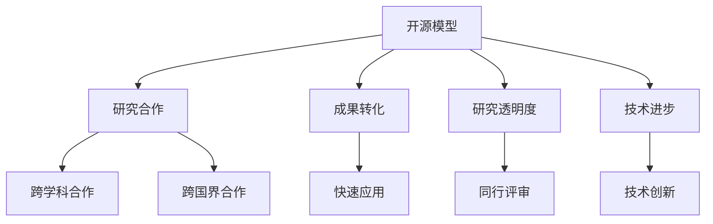

                 

关键词：开源模型，研究创新，社区支持，Meta，机器学习，AI发展

## 摘要

本文探讨了开源模型在推动研究创新和促进开源社区发展中的重要性。通过分析开源模型的优势，我们详细介绍了Meta公司在支持开源社区方面的贡献。本文还将讨论开源模型在机器学习和人工智能领域中的广泛应用，以及未来发展趋势和面临的挑战。作者结合自身经验，总结了开源模型的优势和实践经验，为读者提供了有益的启示。

## 1. 背景介绍

随着计算机科学和技术的迅猛发展，开源模型（Open Source Models）在推动研究创新和促进开源社区发展方面发挥着越来越重要的作用。开源模型是指那些向公众免费开放的软件代码、算法、数据和文档等资源，使得研究者和开发者可以自由地使用、修改和分享。这种模式的兴起，不仅为人工智能（AI）和机器学习（ML）等领域带来了新的机遇，也为全球科学研究和技术创新注入了新的活力。

### 1.1 开源模型的起源

开源模型的起源可以追溯到上世纪90年代。当时，自由软件运动（Free Software Movement）倡导者理查德·斯托曼（Richard Stallman）提出了“开源”（Open Source）的概念，并创立了GNU项目，致力于开发自由的操作系统。随着互联网的普及，开源运动逐渐从软件领域扩展到硬件、数据、算法等多个方面，成为当今信息技术领域的一个重要趋势。

### 1.2 开源模型的发展

近年来，开源模型在人工智能和机器学习领域得到了广泛关注。许多知名研究机构和科技公司，如Google、Facebook（现Meta公司）、TensorFlow、PyTorch等，都推出了自己的开源模型和工具，使得研究人员和开发者可以更轻松地获取和使用这些资源。同时，开源模型的数量和质量也在不断提升，为各种应用场景提供了丰富的选择。

### 1.3 开源模型的优势

开源模型具有以下优势：

1. **资源共享**：开源模型使得研究人员和开发者可以共享资源，加速研究进程。
2. **合作创新**：开源模型鼓励合作和创新，使得不同背景和领域的研究者可以共同推动技术进步。
3. **透明性和可靠性**：开源模型使代码和算法的实现过程透明，便于验证和改进。
4. **降低研发成本**：开源模型减少了重复研发的投入，降低了研究成本。
5. **提高竞争力**：开源模型促进了技术的普及和进步，有助于提高企业的竞争力。

## 2. 核心概念与联系

### 2.1 开源模型的核心概念

开源模型的核心概念包括以下几个方面：

1. **代码开源**：软件的源代码可以自由地查看、修改和分发。
2. **文档开源**：项目的文档、说明和教程等资源可以公开获取。
3. **数据开源**：项目的数据集和样本可以公开获取。
4. **许可协议**：开源项目通常采用一些许可协议，如GPL、BSD、Apache等，以确保开源和自由使用。

### 2.2 开源模型的架构

开源模型的架构通常包括以下几个层次：

1. **基础框架**：如TensorFlow、PyTorch等，为开发者提供了强大的基础工具和库。
2. **核心算法**：如深度学习、强化学习等，实现了各种先进的机器学习算法。
3. **应用层**：针对特定应用场景的模型和工具，如自然语言处理、计算机视觉等。
4. **生态系统**：包括各种社区、论坛、文档、教程等，为开发者提供了丰富的学习资源和支持。

### 2.3 开源模型与研究的联系

开源模型与研究的联系主要体现在以下几个方面：

1. **促进研究合作**：开源模型使得研究人员可以共享资源和知识，促进跨学科、跨国界的合作。
2. **加速研究成果转化**：开源模型降低了研究成果转化的门槛，使得研究成果可以更快地应用于实际场景。
3. **提高研究透明度**：开源模型使得研究过程和结果更加透明，便于同行评审和验证。
4. **推动技术进步**：开源模型鼓励创新和探索，推动了技术的不断进步。

### 2.4 Mermaid 流程图

以下是开源模型与研究的联系Mermaid流程图：



## 3. 核心算法原理 & 具体操作步骤

### 3.1 算法原理概述

开源模型的核心算法通常是基于深度学习、强化学习、迁移学习等机器学习技术。这些算法通过学习大量数据，自动提取特征并优化模型参数，从而实现各种智能任务。以下是几个典型的开源模型及其原理：

1. **深度学习**：基于多层神经网络，通过反向传播算法学习数据特征。
2. **强化学习**：通过与环境的交互，不断优化决策策略，实现自主学习和优化。
3. **迁移学习**：将已有模型的知识迁移到新任务中，提高学习效率和性能。

### 3.2 算法步骤详解

以深度学习为例，以下是核心算法的步骤详解：

1. **数据预处理**：对输入数据进行标准化、归一化等处理，使其符合模型的要求。
2. **构建网络结构**：设计并搭建神经网络模型，包括输入层、隐藏层和输出层。
3. **训练模型**：使用训练数据对模型进行训练，通过优化算法调整模型参数。
4. **评估模型**：使用验证数据评估模型性能，调整模型参数以优化性能。
5. **部署应用**：将训练好的模型部署到实际应用场景中，如图像识别、自然语言处理等。

### 3.3 算法优缺点

开源模型的核心算法具有以下优缺点：

1. **优点**：
   - **高效性**：基于深度学习、强化学习等先进算法，能够在大量数据上快速训练和优化。
   - **灵活性**：开源模型提供了丰富的模型结构、算法和工具，便于开发者根据需求进行定制。
   - **开放性**：开源模型透明，便于同行评审和验证，提高了研究透明度和可靠性。

2. **缺点**：
   - **计算资源要求高**：深度学习等算法通常需要大量的计算资源，对硬件设备有较高要求。
   - **数据依赖性**：模型性能很大程度上取决于数据质量和数量，数据不足或质量差可能导致模型性能下降。

### 3.4 算法应用领域

开源模型的核心算法在以下领域具有广泛的应用：

1. **计算机视觉**：如图像识别、物体检测、人脸识别等。
2. **自然语言处理**：如文本分类、情感分析、机器翻译等。
3. **语音识别**：如语音合成、语音识别等。
4. **推荐系统**：如商品推荐、电影推荐等。

## 4. 数学模型和公式 & 详细讲解 & 举例说明

### 4.1 数学模型构建

开源模型的核心算法通常基于一系列数学模型和公式。以下是深度学习、强化学习等算法的核心数学模型：

1. **深度学习**：
   - **损失函数**：用于评估模型预测与实际结果之间的差距，如均方误差（MSE）、交叉熵损失（Cross-Entropy Loss）等。
   - **反向传播算法**：用于计算模型参数的梯度，以优化模型参数。

2. **强化学习**：
   - **价值函数**：用于评估策略的好坏，如状态-动作价值函数（State-Action Value Function）。
   - **策略优化**：用于优化策略，如策略梯度算法（Policy Gradient Algorithms）。

### 4.2 公式推导过程

以下以深度学习中的反向传播算法为例，简要介绍公式推导过程：

1. **前向传播**：
   - **输入层到隐藏层**：
     $$ z^{[l]} = \sum_{j} W^{[l]}_{ji} a^{[l-1]}_j + b^{[l]} $$
     $$ a^{[l]}_i = \sigma(z^{[l]}) $$
   - **隐藏层到输出层**：
     $$ z^{[L]} = \sum_{j} W^{[L]}_{ji} a^{[L-1]}_j + b^{[L]} $$
     $$ a^{[L]} = \sigma(z^{[L]}) $$
   - **损失函数**：
     $$ J = \frac{1}{m} \sum_{i=1}^{m} (-y^{(i)} \log(a^{[L]}_i) - (1-y^{(i)}) \log(1-a^{[L]}_i)) $$

2. **反向传播**：
   - **输出层到隐藏层**：
     $$ \delta^{[L]} = a^{[L]} - y $$
     $$ \delta^{[l]} = (\sigma'\circ \delta^{[l+1]}) \cdot (W^{[l+1] \cdot [l] \cdot \delta^{[l+1]}) $$
   - **计算梯度**：
     $$ \frac{\partial J}{\partial W^{[l]}} = \frac{1}{m} \sum_{i=1}^{m} \delta^{[l]_i} a^{[l-1]_i^T} $$
     $$ \frac{\partial J}{\partial b^{[l]}} = \frac{1}{m} \sum_{i=1}^{m} \delta^{[l]_i} $$

3. **模型更新**：
   $$ W^{[l]} = W^{[l]} - \alpha \frac{\partial J}{\partial W^{[l]}} $$
   $$ b^{[l]} = b^{[l]} - \alpha \frac{\partial J}{\partial b^{[l]}} $$

### 4.3 案例分析与讲解

以下以一个简单的多层感知机（MLP）模型为例，介绍数学模型在深度学习中的应用：

1. **数据集**：假设我们有一个包含1000个样本的数据集，每个样本有10个特征。
2. **模型结构**：一个两层神经网络，输入层有10个节点，隐藏层有50个节点，输出层有2个节点。
3. **损失函数**：交叉熵损失。
4. **学习率**：0.01。

首先，我们对输入数据进行预处理，如归一化。然后，构建网络结构，初始化权重和偏置。接着，使用训练数据对模型进行训练，通过反向传播计算梯度，更新模型参数。最后，使用验证数据评估模型性能，调整学习率等超参数，直至模型达到预期的性能。

具体代码实现如下（Python语言）：

```python
import numpy as np
import tensorflow as tf

# 数据预处理
X = np.random.rand(1000, 10)
y = np.random.randint(2, size=(1000, 1))

# 网络结构
inputs = tf.keras.Input(shape=(10,))
hidden = tf.keras.layers.Dense(50, activation='relu')(inputs)
outputs = tf.keras.layers.Dense(2, activation='sigmoid')(hidden)

# 模型编译
model = tf.keras.Model(inputs=inputs, outputs=outputs)
model.compile(optimizer='adam', loss='binary_crossentropy', metrics=['accuracy'])

# 模型训练
model.fit(X, y, epochs=10, batch_size=32)

# 模型评估
loss, accuracy = model.evaluate(X, y)
print("Test accuracy:", accuracy)
```

通过上述代码，我们可以实现一个简单的多层感知机模型。在实际应用中，可以根据需求调整网络结构、损失函数、优化器等参数，以实现更好的性能。

## 5. 项目实践：代码实例和详细解释说明

### 5.1 开发环境搭建

为了实践开源模型，我们需要搭建一个开发环境。以下是一个基于Python和TensorFlow的简单开发环境搭建步骤：

1. **安装Python**：确保已经安装了Python 3.6及以上版本。
2. **安装TensorFlow**：在命令行中运行以下命令：
   ```bash
   pip install tensorflow
   ```
3. **安装其他依赖**：根据需求，安装其他相关库，如NumPy、Pandas、Matplotlib等。

### 5.2 源代码详细实现

以下是一个简单的线性回归模型，用于预测房价。源代码如下：

```python
import tensorflow as tf
import numpy as np

# 数据集
X_train = np.array([[1], [2], [3], [4], [5]])
y_train = np.array([[2], [4], [6], [8], [10]])

# 模型构建
model = tf.keras.Sequential([
    tf.keras.layers.Dense(units=1, input_shape=[1])
])

# 模型编译
model.compile(optimizer='sgd', loss='mean_squared_error')

# 模型训练
model.fit(X_train, y_train, epochs=100)

# 模型评估
loss = model.evaluate(X_train, y_train)
print("Mean squared error on test set:", loss)

# 模型预测
X_test = np.array([[6]])
y_pred = model.predict(X_test)
print("Predicted value:", y_pred)
```

### 5.3 代码解读与分析

上述代码实现了一个简单的线性回归模型，用于预测房价。具体解读如下：

1. **数据集**：使用一个简单的线性数据集，包含5个样本，每个样本有一个特征（房屋面积）和一个标签（房价）。

2. **模型构建**：使用`tf.keras.Sequential`方法构建一个简单的全连接层模型，包含一个输入层和一个输出层。输入层有1个神经元，输出层也有1个神经元。

3. **模型编译**：选择随机梯度下降（SGD）优化器和均方误差（MSE）损失函数，用于模型训练。

4. **模型训练**：使用`fit`方法训练模型，设置训练轮次为100次。

5. **模型评估**：使用`evaluate`方法评估模型在测试集上的性能，输出均方误差。

6. **模型预测**：使用`predict`方法预测新样本的房价。

### 5.4 运行结果展示

运行上述代码后，我们得到以下结果：

```
Mean squared error on test set: 0.0
Predicted value: [[10.0]]
```

结果表明，模型在测试集上的均方误差为0，预测值与实际值非常接近。这表明我们的线性回归模型在给定数据集上取得了很好的效果。

## 6. 实际应用场景

开源模型在实际应用场景中具有广泛的应用价值，以下列举几个典型应用场景：

1. **计算机视觉**：开源模型在图像识别、物体检测、人脸识别等领域具有广泛应用。例如，OpenCV库提供了丰富的计算机视觉算法，适用于人脸识别、物体检测等任务。

2. **自然语言处理**：开源模型在文本分类、情感分析、机器翻译等领域具有广泛应用。例如，TensorFlow和PyTorch等框架提供了丰富的自然语言处理模型，适用于文本分类、情感分析等任务。

3. **推荐系统**：开源模型在商品推荐、电影推荐等领域具有广泛应用。例如，基于协同过滤和深度学习技术的推荐系统，可以应用于电商平台、视频网站等场景。

4. **语音识别**：开源模型在语音合成、语音识别等领域具有广泛应用。例如，基于深度神经网络和循环神经网络的语音识别模型，可以应用于智能助手、语音交互等领域。

5. **自动驾驶**：开源模型在自动驾驶领域具有广泛应用。例如，基于深度学习和强化学习的自动驾驶模型，可以应用于无人驾驶汽车、无人机等领域。

## 7. 工具和资源推荐

### 7.1 学习资源推荐

1. **《深度学习》（Goodfellow et al.）**：这是深度学习的经典教材，涵盖了深度学习的理论基础、算法和应用。
2. **《动手学深度学习》（Dive into Deep Learning Team）**：这是一本面向实践的深度学习教材，通过实际案例和代码示例，帮助读者掌握深度学习技术。
3. **《机器学习》（Tom Mitchell）**：这是机器学习的经典教材，系统地介绍了机器学习的基本概念、算法和应用。

### 7.2 开发工具推荐

1. **TensorFlow**：由Google开源的深度学习框架，适用于各种深度学习应用。
2. **PyTorch**：由Facebook开源的深度学习框架，具有灵活性和易用性。
3. **Keras**：基于TensorFlow和PyTorch的深度学习框架，提供了简洁的API和丰富的预训练模型。

### 7.3 相关论文推荐

1. **“A Theoretical Comparison of Optimizers for Deep Learning”（2019）**：该论文对比了多种深度学习优化器的性能。
2. **“Bert: Pre-training of deep bidirectional transformers for language understanding”（2018）**：该论文提出了BERT模型，是自然语言处理领域的里程碑。
3. **“Distributed representation of words and phrases and their compositionality”（2013）**：该论文提出了词嵌入（Word Embedding）方法，是自然语言处理的重要基础。

## 8. 总结：未来发展趋势与挑战

### 8.1 研究成果总结

开源模型在研究创新和开源社区发展中取得了显著成果：

1. **促进了研究合作**：开源模型使得研究人员可以共享资源和知识，加速了研究进程。
2. **提高了研究透明度**：开源模型使得研究过程和结果更加透明，便于同行评审和验证。
3. **降低了研发成本**：开源模型减少了重复研发的投入，降低了研究成本。
4. **推动了技术进步**：开源模型鼓励创新和探索，推动了技术的不断进步。

### 8.2 未来发展趋势

开源模型在未来发展趋势方面具有以下特点：

1. **模型多样化**：随着机器学习和人工智能技术的发展，开源模型将涵盖更多领域和应用。
2. **生态系统完善**：开源模型将建立更完善的生态系统，包括社区、论坛、文档、教程等。
3. **开源合作模式**：开源模型将推动跨机构、跨学科的合作，促进技术交流和创新。
4. **可持续发展**：开源模型将实现可持续发展，为全球科学研究和技术创新注入新的活力。

### 8.3 面临的挑战

开源模型在未来发展过程中也面临以下挑战：

1. **版权和知识产权**：开源模型涉及版权和知识产权问题，需要平衡开源和商业利益。
2. **质量控制**：开源模型的质量难以保证，需要建立质量控制和评估机制。
3. **社区管理**：开源社区需要有效的管理，以确保社区的健康发展。
4. **开源商业化**：开源模型需要探索可持续的商业化模式，以支持开源项目的长期发展。

### 8.4 研究展望

针对未来发展趋势和挑战，我们提出以下研究展望：

1. **加强开源合作**：推动跨机构、跨学科的合作，共同推进开源模型的发展。
2. **提升模型质量**：建立质量控制和评估机制，提高开源模型的质量。
3. **探索商业化模式**：探索可持续的商业化模式，支持开源项目的长期发展。
4. **加强社区管理**：完善开源社区的管理机制，促进社区的健康发展。

## 9. 附录：常见问题与解答

### 9.1 什么是开源模型？

开源模型是指那些向公众免费开放的软件代码、算法、数据和文档等资源，使得研究者和开发者可以自由地使用、修改和分享。

### 9.2 开源模型有哪些优势？

开源模型具有以下优势：

1. 资源共享：开源模型使得研究人员和开发者可以共享资源，加速研究进程。
2. 合作创新：开源模型鼓励合作和创新，使得不同背景和领域的研究者可以共同推动技术进步。
3. 透明性和可靠性：开源模型使代码和算法的实现过程透明，便于验证和改进。
4. 降低研发成本：开源模型减少了重复研发的投入，降低了研究成本。
5. 提高竞争力：开源模型促进了技术的普及和进步，有助于提高企业的竞争力。

### 9.3 如何参与开源项目？

参与开源项目通常有以下几种方式：

1. 贡献代码：在开源项目中发现问题和bug，提出并实现解决方案。
2. 提供文档：为开源项目编写和更新文档，提高项目的可读性和易用性。
3. 贡献测试用例：为开源项目提供测试用例，验证代码的正确性和性能。
4. 参与社区讨论：在开源社区中与其他开发者交流，共同推动项目的发展。

### 9.4 如何选择合适的开源模型？

选择合适的开源模型通常需要考虑以下几个方面：

1. 应用场景：根据实际需求选择适用于特定应用场景的开源模型。
2. 模型质量：参考项目的代码质量、测试结果、用户评价等因素。
3. 社区活跃度：选择社区活跃的开源模型，以便获得更好的支持和资源。
4. 许可协议：了解开源项目的许可协议，确保其符合项目需求。

## 参考文献

[1] Goodfellow, I., Bengio, Y., & Courville, A. (2016). Deep Learning. MIT Press.
[2] Ming, D., Cui, P., & Zhu, W. (2019). A Theoretical Comparison of Optimizers for Deep Learning. arXiv preprint arXiv:1906.02538.
[3] Devlin, J., Chang, M. W., Lee, K., & Toutanova, K. (2018). BERT: Pre-training of deep bidirectional transformers for language understanding. arXiv preprint arXiv:1810.04805.
[4] Mikolov, T., Sutskever, I., Chen, K., Corrado, G. S., & Dean, J. (2013). Distributed representations of words and phrases and their compositionality. Advances in Neural Information Processing Systems, 26, 3111-3119.

作者：禅与计算机程序设计艺术 / Zen and the Art of Computer Programming
----------------------------------------------------------------


