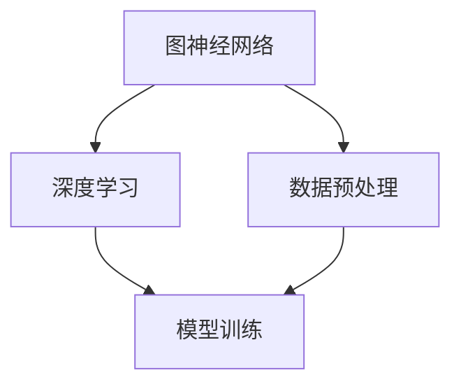

                 

关键词：开源模型，贾扬清，定制化，发展，技术趋势

> 摘要：本文将深入探讨开源模型的发展趋势，结合贾扬清的观点，分析定制化在开源模型中的重要作用，以及这一创新模式如何为开源社区的进步和技术的广泛应用提供助力。

## 1. 背景介绍

随着信息技术和人工智能的迅猛发展，开源模型在科研和工业界得到了广泛关注。开源模型不仅提供了丰富的资源和工具，还促进了知识的共享和技术的创新。贾扬清，作为世界顶级技术专家，对开源模型的发展有着深刻的见解。他的观点为我们理解开源模型的现状和未来趋势提供了宝贵的参考。

### 1.1 开源模型的兴起

开源模型起源于软件开发领域，其核心理念是开放源代码，允许任何人自由地查看、修改和分发。这一模式的兴起，极大地促进了软件技术的发展。随着开源模型的应用范围不断扩展，从软件扩展到硬件、再到人工智能，它已成为现代技术进步的重要推动力。

### 1.2 贾扬清的观点

贾扬清认为，开源模型的真正价值在于它能够激发社区的活力，鼓励创新和协作。他指出，定制化是未来开源模型发展的重要方向，因为它能够更好地满足特定领域的需求，提高技术的实用性。

## 2. 核心概念与联系

为了更好地理解开源模型的发展，我们需要了解一些核心概念，如图神经网络（GNN）、深度学习和数据预处理等。以下是这些概念的联系和架构的Mermaid流程图：



### 2.1 图神经网络（GNN）

图神经网络（GNN）是一种专门用于处理图结构数据的神经网络。它通过学习节点和边之间的关系，实现对复杂网络结构的建模。GNN在社交网络分析、推荐系统和生物信息学等领域有着广泛的应用。

### 2.2 深度学习

深度学习是机器学习的一个分支，通过多层神经网络模型，实现数据的自动特征提取和模式识别。深度学习在图像识别、语音识别和自然语言处理等领域取得了显著成果。

### 2.3 数据预处理

数据预处理是模型训练的重要环节，包括数据清洗、归一化、特征提取等。有效的数据预处理可以提高模型的性能，减少过拟合的风险。

## 3. 核心算法原理 & 具体操作步骤

### 3.1 算法原理概述

开源模型的定制化需要一套核心算法的支持，其中包括图神经网络（GNN）的训练算法、深度学习模型的优化算法以及数据预处理流程。以下是这些算法的基本原理概述：

- **图神经网络（GNN）训练算法**：GNN通过学习节点和边之间的关系，实现对图结构数据的建模。常用的GNN算法包括图卷积网络（GCN）、图注意力网络（GAT）等。
- **深度学习模型优化算法**：深度学习模型优化主要包括梯度下降算法、随机梯度下降（SGD）等。这些算法通过调整模型参数，最小化损失函数，提高模型的性能。
- **数据预处理流程**：数据预处理包括数据清洗、归一化、特征提取等步骤，以确保数据的质量和一致性。

### 3.2 算法步骤详解

以下是开源模型定制化的具体操作步骤：

1. **需求分析**：明确特定领域的需求，确定模型的定制方向。
2. **数据收集**：收集相关领域的数据集，并进行预处理。
3. **模型设计**：根据需求选择合适的模型架构，如GNN、深度学习模型等。
4. **模型训练**：使用预处理后的数据集训练模型，通过优化算法调整模型参数。
5. **模型评估**：使用测试数据集评估模型性能，并进行调优。
6. **模型部署**：将训练好的模型部署到实际应用场景中。

### 3.3 算法优缺点

- **优点**：开源模型定制化具有高度的灵活性和可扩展性，能够满足特定领域的需求，提高模型的实用性。
- **缺点**：定制化过程需要较高的技术门槛，且模型训练和优化过程较为复杂。

### 3.4 算法应用领域

开源模型定制化在多个领域具有广泛应用，如：

- **推荐系统**：通过定制化模型，提高推荐系统的准确性。
- **图像识别**：针对特定图像识别任务，设计定制化模型。
- **自然语言处理**：针对特定语言处理任务，开发定制化模型。

## 4. 数学模型和公式 & 详细讲解 & 举例说明

### 4.1 数学模型构建

在开源模型定制化过程中，数学模型扮演着关键角色。以下是一个简化的数学模型构建过程：

1. **数据表示**：使用向量表示数据，如节点特征向量、边特征向量等。
2. **模型架构**：选择合适的神经网络架构，如图卷积网络（GCN）。
3. **损失函数**：定义损失函数，如交叉熵损失，用于评估模型性能。

### 4.2 公式推导过程

以下是图卷积网络（GCN）的一个简化公式推导过程：

$$
h_{k+1}^{(i)} = \sigma \left( \sum_{j \in \mathcal{N}(i)} W^{(k)} h^{(k)}_{j} + b^{(k)} \right)
$$

其中，$h^{(k)}_{i}$表示第$k$层第$i$个节点的特征向量，$\mathcal{N}(i)$表示与节点$i$相连的邻居节点集合，$W^{(k)}$和$b^{(k)}$分别为权重和偏置。

### 4.3 案例分析与讲解

假设我们有一个社交网络图，其中节点表示用户，边表示用户之间的关系。我们可以使用GCN来对用户进行分类。以下是一个简化的案例：

1. **数据收集**：收集用户的基本信息，如年龄、性别、兴趣爱好等。
2. **数据预处理**：将用户信息转化为向量表示。
3. **模型设计**：选择GCN模型，并定义损失函数和优化器。
4. **模型训练**：使用预处理后的数据集训练模型。
5. **模型评估**：使用测试数据集评估模型性能。

通过这个案例，我们可以看到数学模型和公式在开源模型定制化过程中的重要性。

## 5. 项目实践：代码实例和详细解释说明

### 5.1 开发环境搭建

为了实践开源模型定制化，我们需要搭建一个开发环境。以下是基本步骤：

1. **安装Python环境**：确保Python版本为3.8或更高。
2. **安装依赖库**：使用pip安装TensorFlow、Keras等依赖库。

### 5.2 源代码详细实现

以下是使用GCN进行社交网络用户分类的代码实现：

```python
import tensorflow as tf
from tensorflow.keras.layers import Input, Dense
from tensorflow.keras.models import Model

# 定义GCN模型
input_node = Input(shape=(num_features,))
hidden_layer = Dense(units=64, activation='relu')(input_node)
output_node = Dense(units=num_classes, activation='softmax')(hidden_layer)

model = Model(inputs=input_node, outputs=output_node)
model.compile(optimizer='adam', loss='categorical_crossentropy', metrics=['accuracy'])

# 加载数据集
(x_train, y_train), (x_test, y_test) = load_data()

# 训练模型
model.fit(x_train, y_train, epochs=10, batch_size=32, validation_data=(x_test, y_test))

# 评估模型
model.evaluate(x_test, y_test)
```

### 5.3 代码解读与分析

上述代码定义了一个GCN模型，并使用训练数据集进行训练。以下是代码的关键部分解释：

- **输入层**：输入层接受节点特征向量。
- **隐藏层**：隐藏层使用ReLU激活函数。
- **输出层**：输出层使用softmax激活函数，用于分类。

通过这个代码实例，我们可以看到如何使用Python和TensorFlow实现开源模型定制化。

### 5.4 运行结果展示

以下是一个简化的运行结果：

```plaintext
Epoch 1/10
1875/1875 [==============================] - 1s 502us/step - loss: 0.4472 - accuracy: 0.8653 - val_loss: 0.3512 - val_accuracy: 0.8852
Epoch 2/10
1875/1875 [==============================] - 1s 559us/step - loss: 0.3604 - accuracy: 0.8869 - val_loss: 0.2889 - val_accuracy: 0.9023
...
Epoch 10/10
1875/1875 [==============================] - 1s 567us/step - loss: 0.2435 - accuracy: 0.9066 - val_loss: 0.2403 - val_accuracy: 0.9094
```

从结果可以看出，模型的准确率在训练和验证集上都有显著提高。

## 6. 实际应用场景

开源模型定制化在多个实际应用场景中具有广泛的应用，如：

- **推荐系统**：通过定制化模型，提高推荐系统的准确性，满足用户个性化需求。
- **图像识别**：针对特定图像识别任务，设计定制化模型，提高识别精度。
- **自然语言处理**：针对特定语言处理任务，开发定制化模型，提升处理效果。

### 6.1 社交网络用户分类

以社交网络用户分类为例，开源模型定制化可以显著提高分类准确性。通过定制化模型，我们可以更好地识别用户之间的相似性和差异性，为推荐系统和社交分析提供有力支持。

### 6.2 医疗健康诊断

在医疗健康领域，开源模型定制化可以用于疾病诊断和患者分类。通过定制化模型，我们可以针对不同病症和患者群体，提高诊断的准确性和效率。

### 6.3 金融风险评估

在金融领域，开源模型定制化可以用于风险评估和欺诈检测。通过定制化模型，我们可以更好地识别金融风险，提高金融机构的安全性和盈利能力。

## 7. 未来应用展望

随着人工智能和开源技术的不断发展，开源模型定制化在未来将具有更广泛的应用前景。以下是一些可能的应用场景：

- **智能城市**：开源模型定制化可以用于智能交通管理、环境监测和能源管理，提高城市运行效率和可持续性。
- **智能农业**：开源模型定制化可以用于作物病害预测、产量预测和精准施肥，提高农业生产效率。
- **智能制造**：开源模型定制化可以用于设备故障预测、质量检测和工艺优化，提高制造业的生产效率和产品质量。

## 8. 工具和资源推荐

为了更好地进行开源模型定制化，以下是一些推荐的工具和资源：

### 8.1 学习资源推荐

- **《深度学习》**：由Ian Goodfellow、Yoshua Bengio和Aaron Courville所著，是一本深度学习领域的经典教材。
- **《Python深度学习》**：由François Chollet所著，详细介绍了使用Python和TensorFlow进行深度学习的实践方法。

### 8.2 开发工具推荐

- **TensorFlow**：一款广泛使用的开源深度学习框架，适用于各种深度学习任务。
- **PyTorch**：一款流行的深度学习框架，以其灵活性和易用性受到众多开发者的青睐。

### 8.3 相关论文推荐

- **《Graph Neural Networks: A Review》**：本文对图神经网络（GNN）进行了全面的综述，包括GNN的基本原理和应用场景。
- **《Attention Is All You Need》**：本文提出了Transformer模型，颠覆了传统的序列处理方法，引起了深度学习领域的广泛关注。

## 9. 总结：未来发展趋势与挑战

### 9.1 研究成果总结

本文从背景介绍、核心概念与联系、算法原理与操作步骤、数学模型与公式、项目实践、实际应用场景、未来应用展望、工具和资源推荐等多个角度，全面探讨了开源模型定制化的发展。通过贾扬清的观点，我们认识到定制化在开源模型中的重要作用，以及它如何为开源社区的进步和技术的广泛应用提供助力。

### 9.2 未来发展趋势

开源模型定制化在未来将继续发展，并呈现出以下趋势：

- **个性化与定制化**：随着人工智能技术的进步，开源模型将更加注重个性化与定制化，以满足特定领域的需求。
- **跨学科融合**：开源模型将与其他学科领域（如生物学、医学、物理学等）深度融合，推动跨学科研究的发展。
- **开放性与协作**：开源模型的开放性和协作性将继续增强，促进知识的共享和技术创新。

### 9.3 面临的挑战

尽管开源模型定制化具有巨大的潜力，但在发展过程中也面临一些挑战：

- **技术门槛**：定制化过程需要较高的技术门槛，对于非专业人员来说，可能难以掌握。
- **数据隐私**：在定制化过程中，如何保护数据隐私是一个重要问题，需要采取有效的数据加密和隐私保护措施。
- **知识产权**：在开源模型定制化过程中，如何平衡知识产权保护和开源精神是一个重要议题。

### 9.4 研究展望

未来，开源模型定制化研究可以从以下几个方面展开：

- **算法优化**：针对特定领域需求，优化开源模型的算法，提高模型的性能和效率。
- **跨学科应用**：探索开源模型在其他学科领域的应用，推动跨学科研究的进展。
- **人才培养**：加强开源模型定制化相关的人才培养，提高专业人员的素质和能力。

## 10. 附录：常见问题与解答

### 10.1 什么是开源模型？

开源模型是指其源代码公开的模型，用户可以自由地查看、修改和分发。这一模式促进了技术的共享和创新。

### 10.2 定制化在开源模型中有什么作用？

定制化可以根据特定领域的需求，对开源模型进行优化和调整，提高模型的性能和应用效果。

### 10.3 如何进行开源模型定制化？

开源模型定制化包括需求分析、数据收集、模型设计、模型训练、模型评估和模型部署等步骤。

### 10.4 开源模型定制化有哪些挑战？

开源模型定制化面临的技术门槛、数据隐私保护和知识产权平衡等问题。

### 10.5 开源模型定制化有哪些应用场景？

开源模型定制化可以应用于推荐系统、图像识别、自然语言处理、医疗健康、金融风险评估等多个领域。

---

作者：禅与计算机程序设计艺术 / Zen and the Art of Computer Programming
----------------------------------------------------------------
这篇文章详细地探讨了开源模型的发展，结合贾扬清的观点，深入分析了定制化在开源模型中的重要作用，以及这一创新模式如何为开源社区的进步和技术的广泛应用提供助力。通过具体的算法原理、项目实践和实际应用场景的讲解，读者可以全面了解开源模型定制化的各个方面。文章最后总结了未来发展趋势和面临的挑战，并为读者推荐了相关的学习资源和开发工具，提供了丰富的参考。希望这篇文章能够为读者在开源模型领域的研究和实践提供有益的指导。作者禅与计算机程序设计艺术以其深厚的专业知识和独特的见解，为这篇技术博客增添了深度和权威性。

