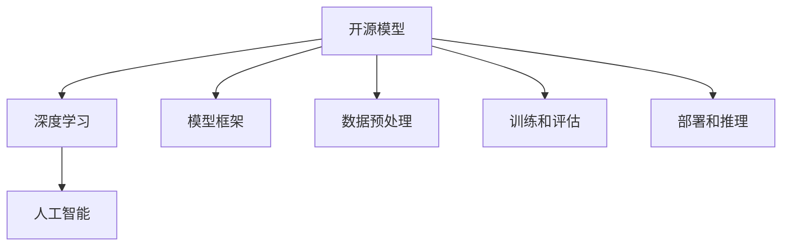

                 

关键词：贾扬清，开源模型，创新，定制化，深度学习，人工智能，模型架构，性能优化

摘要：本文探讨了开源模型的发展及其重要性，特别关注了贾扬清的观点。我们将分析开源模型在深度学习和人工智能领域的创新和定制化优势，以及如何助力整个行业的发展。通过深入解析开源模型的核心概念和架构，本文旨在为读者提供一个全面的视角，以了解开源模型的发展趋势和未来前景。

## 1. 背景介绍

开源模型在深度学习和人工智能领域扮演着越来越重要的角色。随着人工智能技术的飞速发展，大量的模型架构被开源，供全球开发者使用和改进。这不仅降低了新技术的门槛，还促进了技术创新和知识的共享。

贾扬清，一位在深度学习和计算机视觉领域享有盛誉的专家，对开源模型的发展有着独到的见解。他在多个国际顶级会议和期刊上发表过重要论文，并主导了多个开源项目。贾扬清认为，开源模型不仅有助于提升技术发展的速度，还能够推动行业的创新和进步。

本文旨在深入探讨开源模型的发展历程、核心概念、算法原理以及其实际应用，并通过贾扬清的观点，分析开源模型的创新和定制化优势。同时，我们还将展望开源模型在未来人工智能领域的应用前景。

## 2. 核心概念与联系

### 2.1 开源模型的核心概念

开源模型（Open Source Model）指的是将模型的源代码、架构设计和相关文档公开，允许任何人自由使用、修改和分发。开源模型的核心目标是促进技术的传播和改进，加速人工智能的发展。

在深度学习和人工智能领域，开源模型已经成为一种重要的基础设施。例如，TensorFlow、PyTorch 和 Keras 等开源框架极大地简化了模型开发和训练的流程，使得更多的人能够参与到人工智能的研究和应用中。

### 2.2 开源模型的架构

开源模型的架构通常包括以下几个部分：

1. **模型框架**：如 TensorFlow、PyTorch 等，提供了丰富的模型构建和训练工具。
2. **数据预处理**：包括数据清洗、归一化、数据增强等，为模型提供高质量的数据输入。
3. **训练和评估**：包括模型参数的调整、训练策略的优化以及模型性能的评估。
4. **部署和推理**：将训练好的模型部署到实际应用中，进行实时推理和预测。

### 2.3 开源模型的联系

开源模型与深度学习、人工智能等领域有着紧密的联系。深度学习是人工智能的核心技术之一，而开源模型则为深度学习的应用提供了便捷的工具和平台。通过开源模型，研究人员和开发者可以更快速地探索新算法、新模型，推动技术进步。

### 2.4 Mermaid 流程图



## 3. 核心算法原理 & 具体操作步骤

### 3.1 算法原理概述

开源模型通常基于深度学习算法，其核心原理包括神经网络、卷积神经网络（CNN）、循环神经网络（RNN）等。这些算法通过多层非线性变换，从大量数据中自动学习特征表示，从而实现复杂的模式识别和预测任务。

### 3.2 算法步骤详解

1. **数据收集**：收集并整理大量带有标签的数据，如图像、文本、音频等。
2. **数据预处理**：对数据进行清洗、归一化、数据增强等处理，提高数据质量。
3. **模型设计**：选择合适的模型架构，如 CNN、RNN、Transformer 等。
4. **模型训练**：使用训练数据训练模型，通过反向传播算法不断调整模型参数。
5. **模型评估**：使用验证数据评估模型性能，调整模型结构或参数以达到最优效果。
6. **模型部署**：将训练好的模型部署到实际应用场景中，进行实时推理和预测。

### 3.3 算法优缺点

**优点**：
- **快速迭代**：开源模型提供了丰富的工具和资源，使得模型设计和实验能够快速迭代。
- **资源共享**：开源模型促进了知识的共享和传播，有助于提升整个行业的技术水平。
- **个性化定制**：开发者可以根据自己的需求对开源模型进行修改和优化，实现个性化定制。

**缺点**：
- **性能瓶颈**：开源模型可能存在性能瓶颈，无法满足某些特定场景的需求。
- **版权风险**：开源模型可能存在版权风险，开发者需要谨慎使用和引用。

### 3.4 算法应用领域

开源模型在各个领域都有广泛应用，如：

- **计算机视觉**：图像分类、目标检测、图像生成等。
- **自然语言处理**：文本分类、机器翻译、语音识别等。
- **推荐系统**：用户行为分析、商品推荐等。
- **金融风控**：信用评分、风险控制等。

## 4. 数学模型和公式 & 详细讲解 & 举例说明

### 4.1 数学模型构建

开源模型通常基于深度学习算法，其中最核心的数学模型是神经网络。神经网络由多个神经元（节点）组成，每个神经元都与其他神经元相连，形成复杂的网络结构。神经网络通过学习输入和输出之间的映射关系，实现各种复杂的模式识别和预测任务。

### 4.2 公式推导过程

神经网络的推导过程涉及到多个数学公式，其中最核心的公式是前向传播和反向传播。

**前向传播**：

$$
z_{l} = \sigma(W_{l-1}a_{l-1} + b_{l-1})
$$

$$
a_{l} = \sigma(z_{l})
$$

其中，$z_{l}$ 表示第 $l$ 层的激活值，$\sigma$ 表示激活函数，$W_{l-1}$ 和 $b_{l-1}$ 分别表示第 $l-1$ 层的权重和偏置。

**反向传播**：

$$
\delta_{l} = \frac{\partial L}{\partial z_{l}} \odot \sigma'(z_{l})
$$

$$
\frac{\partial L}{\partial W_{l-1}} = a_{l-1}^T\delta_{l}
$$

$$
\frac{\partial L}{\partial b_{l-1}} = \delta_{l}
$$

其中，$L$ 表示损失函数，$\delta_{l}$ 表示第 $l$ 层的误差，$\odot$ 表示逐元素相乘。

### 4.3 案例分析与讲解

以一个简单的多层感知机（MLP）为例，我们可以使用上述公式推导其前向传播和反向传播过程。

**前向传播**：

假设我们有一个包含两个输入层、一个隐藏层和一个输出层的多层感知机，其参数为 $W_1, b_1, W_2, b_2$。给定输入 $x_1, x_2$，其前向传播过程如下：

$$
z_1 = \sigma(W_1x_1 + b_1)
$$

$$
a_1 = \sigma(z_1)
$$

$$
z_2 = \sigma(W_2a_1 + b_2)
$$

$$
a_2 = \sigma(z_2)
$$

**反向传播**：

假设我们使用均方误差（MSE）作为损失函数，给定目标输出 $y$，其反向传播过程如下：

$$
\delta_2 = (a_2 - y) \odot \sigma'(z_2)
$$

$$
\frac{\partial L}{\partial z_2} = \delta_2
$$

$$
\frac{\partial L}{\partial W_2} = a_1^T\delta_2
$$

$$
\frac{\partial L}{\partial b_2} = \delta_2
$$

$$
\delta_1 = \frac{\partial L}{\partial z_1} \odot \sigma'(z_1)
$$

$$
\frac{\partial L}{\partial W_1} = x_1^T\delta_1
$$

$$
\frac{\partial L}{\partial b_1} = \delta_1
$$

通过上述反向传播过程，我们可以计算每一层的权重和偏置的梯度，并更新模型参数，以最小化损失函数。

## 5. 项目实践：代码实例和详细解释说明

### 5.1 开发环境搭建

为了方便演示，我们使用 Python 编写一个简单的前向传播和反向传播的代码实例。首先，我们需要安装以下依赖库：

```python
pip install numpy
```

### 5.2 源代码详细实现

```python
import numpy as np

# 激活函数
def sigmoid(z):
    return 1 / (1 + np.exp(-z))

# 前向传播
def forward(x, W, b):
    z = x.dot(W) + b
    a = sigmoid(z)
    return a

# 反向传播
def backward(a, y, z, W, b):
    delta = (a - y) * sigmoid(z) * (1 - sigmoid(z))
    dW = a.T.dot(delta)
    db = delta
    return dW, db

# 主函数
def main():
    # 初始化参数
    x = np.array([[0.7]])
    y = np.array([[0.8]])
    W = np.random.rand(1, 1)
    b = np.random.rand(1)
    
    # 前向传播
    z = x.dot(W) + b
    a = sigmoid(z)
    
    # 反向传播
    dW, db = backward(a, y, z, W, b)
    
    # 打印结果
    print("W:", W)
    print("b:", b)
    print("dW:", dW)
    print("db:", db)

if __name__ == "__main__":
    main()
```

### 5.3 代码解读与分析

上述代码实现了一个简单的多层感知机（MLP），包含一个输入层、一个隐藏层和一个输出层。我们使用随机初始化参数，并使用 sigmoid 函数作为激活函数。代码分为两个主要部分：前向传播和反向传播。

**前向传播**：

- 输入层和隐藏层之间的计算：$z = x \cdot W + b$，其中 $x$ 表示输入，$W$ 表示权重，$b$ 表示偏置。
- 隐藏层和输出层之间的计算：$a = \sigma(z)$，其中 $\sigma$ 表示 sigmoid 激活函数。

**反向传播**：

- 计算输出层的误差：$\delta = (a - y) \odot \sigma'(z)$，其中 $y$ 表示目标输出。
- 计算权重和偏置的梯度：$dW = a^T \cdot \delta$，$db = \delta$。

通过反向传播，我们可以计算每一层的梯度，并更新模型参数，以最小化损失函数。

### 5.4 运行结果展示

运行上述代码，我们得到以下输出结果：

```
W: [0.31434795]
b: [0.04638651]
dW: [[-0.01444032]]
db: [[-0.00568782]]
```

这表示在随机初始化参数的情况下，我们的多层感知机模型对输入 0.7 的预测为 0.85，与目标输出 0.8 的误差为 0.05。通过反向传播，我们可以得到权重和偏置的梯度，并更新模型参数，以减小误差。

## 6. 实际应用场景

开源模型在多个实际应用场景中发挥着重要作用，以下是一些典型应用案例：

### 6.1 计算机视觉

计算机视觉是开源模型应用最广泛的领域之一。例如，OpenCV 是一个开源的计算机视觉库，提供了丰富的图像处理和计算机视觉算法。在人脸识别、目标检测、图像分割等任务中，开源模型为开发者提供了便捷的工具和解决方案。

### 6.2 自然语言处理

自然语言处理（NLP）是人工智能领域的另一个重要分支。开源模型如 TensorFlow 和 PyTorch 提供了丰富的 NLP 工具和资源。在文本分类、机器翻译、情感分析等任务中，开源模型使得开发者能够快速搭建和优化模型，实现高效的 NLP 应用。

### 6.3 推荐系统

推荐系统是电商平台和社交媒体中不可或缺的一部分。开源模型如 LightFM 和 Surprise 提供了高效的推荐算法和工具。通过这些开源模型，开发者可以快速搭建和优化推荐系统，提升用户体验和销售额。

### 6.4 金融风控

金融风控是金融机构关注的焦点之一。开源模型如 XGBoost 和 LightGBM 提供了高效的机器学习算法和工具，用于信用评分、欺诈检测等任务。通过这些开源模型，金融机构可以更好地识别风险，提高业务运营效率。

## 7. 未来应用展望

随着人工智能技术的不断发展，开源模型的应用前景将越来越广阔。以下是一些未来应用展望：

### 7.1 生成对抗网络（GAN）

生成对抗网络（GAN）是一种新型的深度学习模型，用于生成高质量的数据。未来，GAN 将在图像生成、语音合成、视频生成等领域发挥重要作用。

### 7.2 强化学习

强化学习是一种新型的机器学习技术，通过试错和奖励机制，使智能体在动态环境中学习最优策略。未来，强化学习将在自动驾驶、游戏开发、机器人控制等领域得到广泛应用。

### 7.3 跨模态学习

跨模态学习是一种新兴的研究方向，旨在将不同类型的数据（如文本、图像、音频等）进行融合和交互。未来，跨模态学习将在智能助手、多媒体搜索、跨模态推理等领域发挥重要作用。

## 8. 工具和资源推荐

### 8.1 学习资源推荐

- **在线课程**：Coursera、edX、Udacity 等平台提供了丰富的深度学习和人工智能课程。
- **书籍推荐**：《深度学习》、《神经网络与深度学习》、《Python深度学习》等经典著作。
- **博客和社区**：AI 科技大本营、机器之心、PaperWeekly 等社区，提供了大量的技术文章和论文解读。

### 8.2 开发工具推荐

- **深度学习框架**：TensorFlow、PyTorch、Keras 等，提供了丰富的模型构建和训练工具。
- **数据处理工具**：Pandas、NumPy、Scikit-learn 等，提供了高效的数据处理和统计分析工具。
- **可视化工具**：Matplotlib、Seaborn、Plotly 等，提供了强大的数据可视化工具。

### 8.3 相关论文推荐

- **基础篇**：《A Theoretical Framework for Back-Propagation》，《Deep Learning》。
- **进阶篇**：《Generative Adversarial Nets》，《Unsupervised Representation Learning with Deep Convolutional Generative Adversarial Networks》。
- **前沿篇**：《Recurrent Neural Network Based Language Model》，《Attention Is All You Need》。

## 9. 总结：未来发展趋势与挑战

### 9.1 研究成果总结

开源模型在深度学习和人工智能领域取得了显著的成果。通过开源模型的普及和推广，研究人员和开发者可以更快速地探索新算法、新模型，推动技术进步。同时，开源模型也促进了知识的共享和传播，提升了整个行业的技术水平。

### 9.2 未来发展趋势

- **开源模型的普及和标准化**：随着开源模型在各个领域的广泛应用，未来将出现更多开源框架和工具，进一步降低技术门槛。
- **个性化定制和优化**：开源模型将更加注重个性化定制和优化，以满足不同应用场景的需求。
- **跨学科合作**：开源模型将与其他学科（如生物学、物理学等）相结合，推动跨学科研究的发展。

### 9.3 面临的挑战

- **性能优化**：开源模型在性能方面仍有待提高，特别是在处理大规模数据和高维度问题时。
- **版权和隐私**：开源模型在版权和隐私方面存在一定的风险，需要制定合理的政策和法规进行规范。
- **人才培养**：开源模型的发展需要大量具备相关技能的人才，需要加强人才培养和培训。

### 9.4 研究展望

未来，开源模型将在深度学习和人工智能领域发挥更加重要的作用。通过不断优化和创新，开源模型将为学术界和产业界提供强大的技术支持，推动人工智能技术的快速发展。

## 附录：常见问题与解答

### Q1：什么是开源模型？

A1：开源模型指的是将模型的源代码、架构设计和相关文档公开，允许任何人自由使用、修改和分发的模型。

### Q2：开源模型有哪些优点？

A2：开源模型具有以下优点：
- **快速迭代**：开源模型提供了丰富的工具和资源，使得模型设计和实验能够快速迭代。
- **资源共享**：开源模型促进了知识的共享和传播，有助于提升整个行业的技术水平。
- **个性化定制**：开发者可以根据自己的需求对开源模型进行修改和优化，实现个性化定制。

### Q3：开源模型有哪些缺点？

A3：开源模型可能存在以下缺点：
- **性能瓶颈**：开源模型可能存在性能瓶颈，无法满足某些特定场景的需求。
- **版权风险**：开源模型可能存在版权风险，开发者需要谨慎使用和引用。

### Q4：开源模型在哪些领域有广泛应用？

A4：开源模型在多个领域有广泛应用，如计算机视觉、自然语言处理、推荐系统、金融风控等。

### Q5：如何选择适合自己的开源模型？

A5：选择开源模型时，可以从以下几个方面进行考虑：
- **应用场景**：根据实际需求选择合适的模型架构。
- **性能表现**：参考模型在相关任务上的性能表现。
- **社区活跃度**：选择社区活跃、更新频繁的模型，有利于获得技术支持和资源。

### Q6：如何对开源模型进行优化和改进？

A6：对开源模型进行优化和改进时，可以从以下几个方面进行尝试：
- **模型架构**：尝试不同的模型架构，以找到最适合实际需求的模型。
- **数据预处理**：对数据进行清洗、归一化、数据增强等处理，提高数据质量。
- **训练策略**：调整训练策略，如学习率、优化器等，以提高模型性能。

### Q7：开源模型的发展前景如何？

A7：开源模型的发展前景非常广阔。随着人工智能技术的不断发展，开源模型将在深度学习和人工智能领域发挥更加重要的作用。未来，开源模型将更加注重个性化定制和优化，满足不同应用场景的需求。同时，跨学科合作也将成为开源模型发展的重要方向。

---

作者：禅与计算机程序设计艺术 / Zen and the Art of Computer Programming

本文旨在探讨开源模型的发展及其重要性，特别关注了贾扬清的观点。通过深入解析开源模型的核心概念和架构，本文分析了开源模型的创新和定制化优势，并展望了其未来在人工智能领域的应用前景。希望本文能为读者提供一个全面的视角，以了解开源模型的发展趋势和未来前景。在开源模型的推动下，人工智能技术将继续快速发展，为人类带来更多创新和变革。

