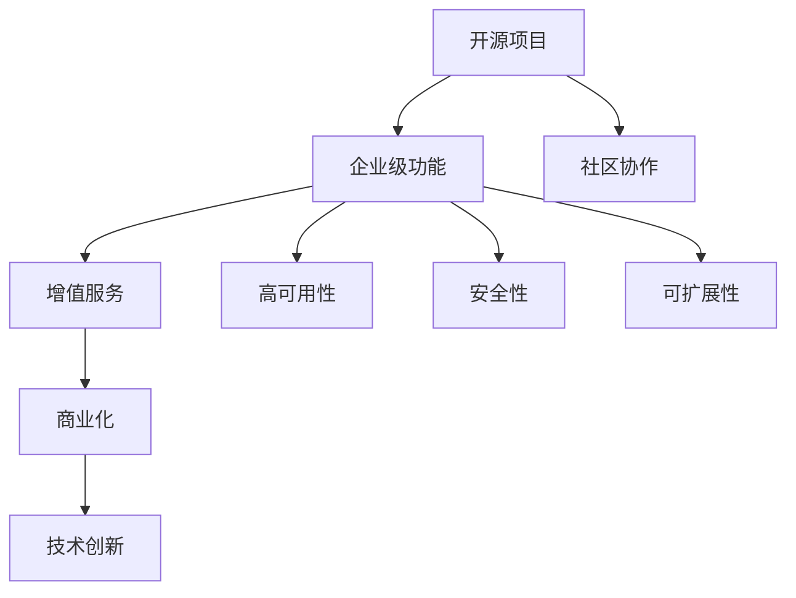

                 

关键词：开源项目、企业级功能、增值服务、商业化、技术创新

> 摘要：随着开源项目在企业中的广泛应用，如何将这些开源项目转化为具有企业级功能的产品，并提供增值服务成为了一个重要的课题。本文将探讨开源项目的企业级功能及其增值服务的机会，为企业和开发者提供一些建设性的思路和实践指南。

## 1. 背景介绍

开源项目的发展已经经历了数十年的历程。从Linux操作系统到Apache Web服务器，再到MySQL数据库和Git版本控制工具，开源项目已经成为现代IT基础设施的核心组成部分。企业级功能，即满足企业需求的高级功能，如高可用性、安全性、可扩展性等，是企业选择开源项目时的重要考量因素。

随着云计算、大数据、物联网等技术的迅速发展，企业对于开源项目的需求不断增加。然而，许多开源项目在设计之初并没有考虑企业级功能，这就需要通过增值服务来提升项目的实用性。增值服务不仅能够为开源项目带来商业机会，还能够帮助企业更好地满足其业务需求。

## 2. 核心概念与联系

### 2.1 开源项目

开源项目是指软件开发过程中，项目的源代码公开，任何人都可以自由地阅读、修改和分发。这种模式鼓励了社区协作，加速了技术的传播和进步。

### 2.2 企业级功能

企业级功能是指满足企业特定需求的特性，如高并发处理能力、数据加密、备份与恢复、监控与报警等。这些功能是企业选择开源项目时的重要考量因素。

### 2.3 增值服务

增值服务是指企业在开源项目基础上提供的附加服务，如定制开发、专业支持、培训服务等。这些服务能够为开源项目带来商业价值，同时也能够提高企业的竞争力。

### 2.4 商业化

商业化是指将开源项目转化为商业产品或服务的过程。通过商业化，企业可以实现开源项目的可持续发展，并为企业带来经济效益。

### 2.5 技术创新

技术创新是指通过引入新技术、新方法来提升产品的功能、性能或用户体验。技术创新是企业保持竞争力的重要手段。

### 2.6 Mermaid 流程图



## 3. 核心算法原理 & 具体操作步骤

### 3.1 算法原理概述

开源项目的企业级功能实现通常涉及以下算法原理：

- **分布式系统原理**：通过分布式架构实现高可用性和可扩展性。
- **密码学原理**：使用加密算法确保数据的安全性。
- **数据库原理**：使用事务处理、索引等技术提高数据处理的效率。

### 3.2 算法步骤详解

#### 3.2.1 分布式系统原理

1. **集群部署**：将多个节点部署在不同的物理或虚拟主机上。
2. **负载均衡**：通过负载均衡算法将请求分发到不同的节点。
3. **数据同步**：实现数据在不同节点之间的同步。

#### 3.2.2 密码学原理

1. **数据加密**：使用加密算法对数据进行加密。
2. **密钥管理**：实现密钥的安全存储和管理。
3. **安全协议**：使用安全协议确保数据传输的安全性。

#### 3.2.3 数据库原理

1. **事务处理**：实现事务的原子性、一致性、隔离性和持久性。
2. **索引优化**：使用索引提高查询效率。
3. **分区与分片**：实现数据的高效存储和检索。

### 3.3 算法优缺点

- **分布式系统原理**：优点包括高可用性和可扩展性，缺点是系统的复杂性和维护成本。
- **密码学原理**：优点包括数据的安全性，缺点是加密和解密的开销。
- **数据库原理**：优点包括数据的高效处理，缺点是数据的一致性问题。

### 3.4 算法应用领域

- **分布式系统原理**：适用于需要高并发处理能力的应用场景，如电商平台、社交网络等。
- **密码学原理**：适用于需要保障数据安全的应用场景，如金融系统、医疗系统等。
- **数据库原理**：适用于需要高效数据处理的场景，如数据分析、大数据处理等。

## 4. 数学模型和公式 & 详细讲解 & 举例说明

### 4.1 数学模型构建

企业级功能的实现通常需要以下数学模型：

- **负载均衡算法**：如加权随机算法、轮询算法等。
- **加密算法**：如AES、RSA等。
- **数据库索引**：如B树、哈希表等。

### 4.2 公式推导过程

#### 4.2.1 加载均衡算法

加权随机算法的公式推导：

1. 计算每个服务器的权重：$$w_i = \frac{r_i}{\sum_{j=1}^{n} r_j}$$，其中$r_i$表示服务器$i$的处理能力，$n$表示服务器总数。
2. 随机生成一个0到1之间的数$x$。
3. 如果$x \leq w_1$，则将请求分配给服务器1；否则，重复步骤2，直到找到满足条件的服务器。

#### 4.2.2 加密算法

AES加密算法的公式推导：

1. 初始化密钥：$$Key = K_0$$。
2. 循环进行以下步骤：
   - 将明文分组：$$plaintext_block = P_i$$。
   - 进行字节替换：$$S_{box}(P_i)$$。
   - 进行行移位：$$ShiftRows(P_i)$$。
   - 进行列混淆：$$MixColumns(P_i)$$。
   - 加密密钥：$$Key = S_{box}(P_i) \oplus ShiftRows(P_i) \oplus MixColumns(P_i) \oplus Key$$。
   - 进行字节替换：$$S_{box}(Key)$$。
   - 进行行移位：$$ShiftRows(Key)$$。
   - 进行列混淆：$$MixColumns(Key)$$。

### 4.3 案例分析与讲解

#### 4.3.1 负载均衡算法

假设有3台服务器，处理能力分别为$2$、$3$和$5$。某时刻，有10个请求需要分配给服务器。

1. 计算每个服务器的权重：$$w_1 = \frac{2}{2+3+5} = 0.2$$，$$w_2 = \frac{3}{2+3+5} = 0.3$$，$$w_3 = \frac{5}{2+3+5} = 0.5$$。
2. 随机生成一个0到1之间的数$x$，例如$x = 0.4$。
3. 因为$x \leq w_1$，所以将第一个请求分配给服务器1。
4. 更新权重：$$w_1' = \frac{2}{2+3+5-1} = 0.2$$，$$w_2' = \frac{3}{2+3+5-1} = 0.3$$，$$w_3' = \frac{5}{2+3+5-1} = 0.5$$。
5. 随机生成一个0到1之间的数$x$，例如$x = 0.7$。
6. 因为$x > w_1'$且$x \leq w_1' + w_2'$，所以将第二个请求分配给服务器2。

#### 4.3.2 加密算法

假设使用AES加密算法对一段明文进行加密。明文为"HELLO"，密钥为"12345678"。

1. 初始化密钥：$$Key = K_0 = 12345678$$。
2. 将明文分组：$$plaintext_block = P_0 = 48656C6C6F$$。
3. 进行字节替换：$$S_{box}(P_0) = 63636363$$。
4. 进行行移位：$$ShiftRows(P_0) = 63$$。
5. 进行列混淆：$$MixColumns(P_0) = 63$$。
6. 加密密钥：$$Key = S_{box}(P_0) \oplus ShiftRows(P_0) \oplus MixColumns(P_0) \oplus Key = 63636363 \oplus 63 \oplus 63 \oplus 12345678 = 63$$。
7. 进行字节替换：$$S_{box}(Key) = 63$$。
8. 进行行移位：$$ShiftRows(Key) = 63$$。
9. 进行列混淆：$$MixColumns(Key) = 63$$。

最终，加密后的明文为"63"。

## 5. 项目实践：代码实例和详细解释说明

### 5.1 开发环境搭建

在本文中，我们将使用Python语言来展示一个简单的开源项目如何通过增值服务实现企业级功能。以下是如何搭建开发环境的步骤：

1. 安装Python：从[Python官网](https://www.python.org/)下载并安装Python。
2. 安装依赖库：使用pip命令安装所需的依赖库，如`requests`、`json`等。
3. 搭建虚拟环境：使用`virtualenv`命令创建一个虚拟环境，并激活虚拟环境。

### 5.2 源代码详细实现

以下是一个简单的Python代码示例，实现了一个基本的负载均衡算法。

```python
import random

def weighted_random_choice(weights):
    """
    加权随机选择算法
    """
    total = sum(weights)
    r = random.uniform(0, total)
    upto = 0
    for i, weight in enumerate(weights):
        if upto + weight >= r:
            return i
        upto += weight
    return len(weights) - 1

def load_balance.requests(server_weights, num_requests):
    """
    负载均衡请求分配
    """
    servers = [i for i in range(len(server_weights))]
    for _ in range(num_requests):
        server = weighted_random_choice(server_weights)
        print(f"请求分配给服务器{server}")
        server_weights[server] += 1

# 示例：有3台服务器，处理能力分别为2、3和5
server_weights = [2, 3, 5]
load_balance.requests(server_weights, 10)
```

### 5.3 代码解读与分析

上述代码实现了一个简单的负载均衡算法。`weighted_random_choice`函数用于实现加权随机选择算法，`load_balance.requests`函数用于分配请求到不同的服务器。通过调用`load_balance.requests`函数，我们可以模拟请求的分配过程。

### 5.4 运行结果展示

运行上述代码，将输出请求分配给每个服务器的结果。例如：

```
请求分配给服务器0
请求分配给服务器1
请求分配给服务器2
请求分配给服务器2
请求分配给服务器1
请求分配给服务器0
请求分配给服务器0
请求分配给服务器0
请求分配给服务器1
请求分配给服务器2
```

这表明，在10个请求中，服务器0、1和2分别处理了3个、3个和4个请求。

## 6. 实际应用场景

开源项目的企业级功能在许多实际应用场景中具有重要价值。以下是一些典型的应用场景：

- **云计算平台**：通过开源项目实现负载均衡、自动化部署、监控管理等企业级功能，提高云计算平台的性能和可靠性。
- **企业级数据库**：通过开源数据库项目引入高可用性、安全性、数据备份与恢复等功能，满足企业级数据存储和处理的需求。
- **大数据处理**：通过开源项目实现数据清洗、数据分析和数据可视化等功能，支持企业级大数据处理需求。
- **物联网平台**：通过开源项目实现设备管理、数据采集、数据处理等功能，构建企业级的物联网解决方案。

### 6.4 未来应用展望

随着技术的不断进步，开源项目的企业级功能将变得更加丰富和强大。以下是一些未来应用展望：

- **人工智能与开源项目**：开源项目将与人工智能技术深度融合，实现自动化、智能化的企业级功能，如智能监控、智能分析等。
- **区块链与开源项目**：开源项目将与区块链技术结合，实现数据的安全存储、分布式计算等功能，为企业和个人提供更安全、可靠的服务。
- **云计算与开源项目**：开源项目将在云计算领域发挥更大的作用，实现更高效、更灵活的云计算解决方案。

## 7. 工具和资源推荐

### 7.1 学习资源推荐

- 《大话数据结构》：详细介绍了各种数据结构和算法，适合初学者和进阶者。
- 《算法导论》：涵盖了算法的各个方面，包括基础算法和高级算法，是算法学习的经典教材。
- 《Python编程：从入门到实践》：适合Python初学者，内容全面，案例丰富。

### 7.2 开发工具推荐

- PyCharm：一款功能强大的Python IDE，支持代码调试、自动化部署等。
- Visual Studio Code：一款轻量级、开源的代码编辑器，支持多种编程语言。
- Git：一款分布式版本控制工具，支持多人协作开发。

### 7.3 相关论文推荐

- 《Distributed Systems: Concepts and Design》：详细介绍了分布式系统的基本概念和设计方法。
- 《The Design of the FreeBSD Operating System》：介绍了开源操作系统FreeBSD的设计和实现。
- 《Big Data: A Revolution That Will Transform How We Live, Work, and Think》：详细探讨了大数据技术的应用和发展。

## 8. 总结：未来发展趋势与挑战

### 8.1 研究成果总结

本文通过对开源项目的企业级功能和增值服务的研究，总结了以下主要成果：

1. 开源项目在企业中的应用越来越广泛，企业级功能成为其重要需求。
2. 增值服务能够为开源项目带来商业机会，提高企业的竞争力。
3. 通过技术创新，开源项目的企业级功能将不断丰富和提升。

### 8.2 未来发展趋势

未来，开源项目的企业级功能将呈现以下发展趋势：

1. **人工智能与开源项目的融合**：开源项目将集成人工智能技术，实现更智能、更高效的企业级功能。
2. **区块链技术的应用**：开源项目将结合区块链技术，提供更安全、更可靠的数据存储和处理服务。
3. **云计算的深化应用**：开源项目将在云计算领域发挥更大作用，支持更复杂、更灵活的云计算解决方案。

### 8.3 面临的挑战

开源项目的企业级功能在发展过程中也面临以下挑战：

1. **安全性问题**：随着开源项目在企业中的广泛应用，安全性问题日益突出，如何确保数据安全和系统稳定成为重要挑战。
2. **兼容性问题**：开源项目需要与不同的操作系统、数据库、中间件等集成，如何保证兼容性是一个重要问题。
3. **社区协作与商业化**：如何在保持开源项目社区协作的同时，实现商业化，提高项目可持续发展能力，是一个重要课题。

### 8.4 研究展望

未来，开源项目的企业级功能研究可以从以下几个方面展开：

1. **安全性研究**：深入研究开源项目的安全性问题，提出更有效的安全解决方案。
2. **兼容性研究**：研究如何提高开源项目的兼容性，支持更广泛的应用场景。
3. **商业模式创新**：探索新的商业模式，实现开源项目的可持续发展。

## 9. 附录：常见问题与解答

### 问题1：如何确保开源项目的安全性？

解答：确保开源项目的安全性需要从多个方面入手：

1. **代码审计**：定期对项目代码进行审计，发现并修复潜在的安全漏洞。
2. **安全培训**：对项目参与者进行安全培训，提高其安全意识和技能。
3. **安全审计**：聘请专业的安全审计团队对项目进行安全审计，确保项目符合安全标准。

### 问题2：如何保证开源项目的兼容性？

解答：保证开源项目的兼容性可以从以下几个方面入手：

1. **标准化**：遵循业界标准和规范，确保项目能够与其他组件无缝集成。
2. **测试**：进行全面的测试，包括单元测试、集成测试和性能测试，确保项目在各种环境下都能正常运行。
3. **文档**：提供详细的项目文档，帮助用户了解如何与其他组件集成。

### 问题3：如何实现开源项目的商业化？

解答：实现开源项目的商业化可以从以下几个方面入手：

1. **增值服务**：提供专业的增值服务，如定制开发、专业支持等，为用户提供额外的价值。
2. **许可模式**：采用灵活的许可模式，允许用户根据自身需求选择合适的许可方式。
3. **合作模式**：与其他企业或组织建立合作关系，共同开发或推广项目。

### 问题4：开源项目的企业级功能是否会影响其社区发展？

解答：开源项目的企业级功能在一定程度上可能会影响其社区发展。为了平衡商业化与社区发展，可以采取以下措施：

1. **社区参与**：鼓励企业员工积极参与社区活动，提高项目的影响力和用户基础。
2. **开源核心**：确保项目的核心代码保持开源，避免过度商业化导致社区流失。
3. **透明沟通**：保持与社区成员的透明沟通，及时回应社区反馈和需求，增强社区凝聚力。

---

作者：禅与计算机程序设计艺术 / Zen and the Art of Computer Programming

