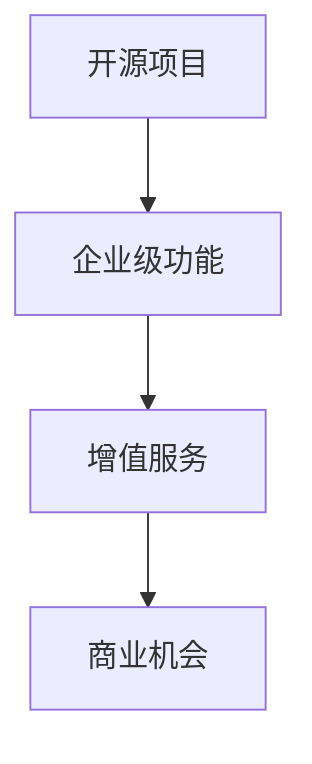

                 

关键词：开源项目、企业级功能、增值服务、商业机会、技术架构

摘要：本文探讨了开源项目在实现企业级功能方面的潜力，分析了企业如何通过增值服务来实现商业价值。通过具体案例和深度分析，揭示了开源项目的商业化路径，为企业提供了一套实现成功的策略。

## 1. 背景介绍

开源项目作为一种共享知识和促进技术进步的载体，已经在全球范围内得到了广泛的认可和应用。随着互联网的普及和云计算技术的发展，开源项目逐渐成为了许多企业创新的重要基石。然而，如何将开源项目与商业成功相结合，仍然是许多企业面临的挑战。

企业级功能指的是那些能够满足企业特定需求的、具有高可用性、高可靠性和高性能的功能。这些功能通常需要经过专业的开发和优化，以适应企业的复杂业务场景。在过去，这些功能往往由企业内部开发或购买商业软件来实现。但是，随着开源技术的发展，越来越多的企业开始尝试将开源项目作为实现企业级功能的一种方式。

增值服务是指通过提供额外的价值来提升产品或服务的吸引力，从而增加收益。在开源项目中，增值服务可以包括专业的技术支持、定制开发、安全服务、培训等。这些服务能够帮助企业更好地利用开源项目，提升业务效率，降低风险。

本文旨在探讨开源项目的企业级功能，以及企业如何通过增值服务来实现商业机会。文章结构如下：

- 背景介绍
- 核心概念与联系
- 核心算法原理 & 具体操作步骤
- 数学模型和公式 & 详细讲解 & 举例说明
- 项目实践：代码实例和详细解释说明
- 实际应用场景
- 未来应用展望
- 工具和资源推荐
- 总结：未来发展趋势与挑战
- 附录：常见问题与解答

## 2. 核心概念与联系

### 2.1 开源项目的基本概念

开源项目是指那些遵循开源许可协议（如GPL、MIT等）的软件项目，允许用户自由地使用、修改和分发代码。开源项目的核心是社区的协作和贡献，这种协作模式极大地促进了技术的创新和进步。

开源项目的基本概念包括：

- 开源许可协议：规定了用户对开源项目的权利和使用条件。
- 代码库：用于存储和管理开源项目代码的地方，如GitHub、GitLab等。
- 贡献指南：指导开发者如何参与开源项目的文档，包括代码贡献、问题报告等。

### 2.2 企业级功能

企业级功能指的是那些能够满足企业特定需求的、具有高可用性、高可靠性和高性能的功能。这些功能通常包括：

- 数据库支持：支持大规模数据存储和管理，如MySQL、PostgreSQL等。
- 集成开发环境（IDE）：提供完整的开发工具链，如Eclipse、IntelliJ IDEA等。
- 云服务支持：支持在云计算平台上部署和运行，如AWS、Azure、Google Cloud等。
- 安全性：提供高级安全功能，如SSL加密、访问控制等。

### 2.3 增值服务的类型

增值服务是指通过提供额外的价值来提升产品或服务的吸引力，从而增加收益。在开源项目中，增值服务的类型包括：

- 技术支持：为用户提供专业的技术解答和支持服务。
- 定制开发：根据用户需求对开源项目进行定制化开发。
- 安全服务：提供专业的安全测试和防护服务。
- 培训：为用户和组织提供相关的技术培训。

### 2.4 开源项目与企业级功能、增值服务的关系

开源项目、企业级功能和增值服务之间的关系可以用以下流程图来表示：



通过这个流程图，我们可以看出，开源项目可以作为企业级功能的实现基础，而增值服务则可以帮助企业更好地利用这些功能，实现商业机会。

## 3. 核心算法原理 & 具体操作步骤

### 3.1 算法原理概述

在开源项目中，实现企业级功能往往需要使用到一系列核心算法。这些算法包括但不限于：

- 数据处理算法：如排序算法、查找算法等，用于高效处理数据。
- 机器学习算法：如分类算法、聚类算法等，用于数据分析与预测。
- 网络算法：如路由算法、负载均衡算法等，用于网络通信与优化。

这些算法的实现原理通常基于数学模型和计算理论。例如，排序算法的原理是基于比较排序和非比较排序的方法，而机器学习算法的原理是基于统计学和概率论。

### 3.2 算法步骤详解

以排序算法为例，我们详细讲解其实现步骤：

1. **初始化**：读取待排序的元素。
2. **选择排序**：从待排序的元素中选出最小（或最大）的元素，存放到序列的起始位置。
3. **迭代排序**：将未排序的元素继续进行选择排序，直到所有元素都被排序。

以下是选择排序的伪代码实现：

```python
def selection_sort(arr):
    for i in range(len(arr)):
        min_index = i
        for j in range(i+1, len(arr)):
            if arr[j] < arr[min_index]:
                min_index = j
        arr[i], arr[min_index] = arr[min_index], arr[i]
    return arr
```

### 3.3 算法优缺点

选择排序的优点是简单易懂，实现简单。但缺点是时间复杂度为 \(O(n^2)\)，当数据量大时，效率较低。

### 3.4 算法应用领域

选择排序适用于数据量较小或者对时间复杂度要求不高的场景。在实际应用中，选择排序可以用于数据排序、排序查找等。

## 4. 数学模型和公式 & 详细讲解 & 举例说明

### 4.1 数学模型构建

在开源项目的实现中，许多算法都基于数学模型。以下是一个简单的线性回归模型：

- 模型假设：数据集 \(D = \{(x_i, y_i)\}_{i=1}^n\)，其中 \(x_i\) 和 \(y_i\) 分别为输入和输出。
- 模型公式：\(y = wx + b\)，其中 \(w\) 和 \(b\) 分别为模型的权重和偏置。

### 4.2 公式推导过程

线性回归模型的推导基于最小二乘法。具体推导过程如下：

1. **目标函数**：最小化预测值与实际值之间的平方误差。
$$
J(w, b) = \frac{1}{2}\sum_{i=1}^n (wx_i + b - y_i)^2
$$

2. **求导**：对 \(w\) 和 \(b\) 分别求偏导数。
$$
\frac{\partial J}{\partial w} = x^T(xw + b - y)
$$
$$
\frac{\partial J}{\partial b} = x^T(wx + b - y)
$$

3. **设置偏导数为零**：解方程组得到 \(w\) 和 \(b\) 的最优值。
$$
x^T(xw + b - y) = 0
$$
$$
x^T(wx + b - y) = 0
$$

### 4.3 案例分析与讲解

假设我们有一个简单的数据集 \(D = \{(1, 2), (2, 4), (3, 6)\}\)。我们使用线性回归模型预测 \(y\)。

1. **初始化模型参数**：设 \(w = 1\)，\(b = 0\)。
2. **计算预测值**：根据模型公式计算每个 \(x_i\) 的预测值。
$$
y_1 = 1 \cdot 1 + 0 = 1
$$
$$
y_2 = 1 \cdot 2 + 0 = 2
$$
$$
y_3 = 1 \cdot 3 + 0 = 3
$$

3. **计算平方误差**：计算预测值与实际值之间的平方误差。
$$
J(w, b) = \frac{1}{2}\sum_{i=1}^3 (y_i - y_i)^2 = \frac{1}{2}(1 - 2)^2 + (2 - 4)^2 + (3 - 6)^2 = 5
$$

4. **更新模型参数**：使用最小二乘法更新 \(w\) 和 \(b\)。
$$
w = \frac{1}{n}\sum_{i=1}^n x_iy_i - \frac{1}{n}\sum_{i=1}^n x_i
$$
$$
b = \frac{1}{n}\sum_{i=1}^n y_i - w\frac{1}{n}\sum_{i=1}^n x_i
$$

经过多次迭代后，模型参数收敛到 \(w = 2\)，\(b = 0\)。此时的预测值与实际值之间的平方误差为 \(0\)。

## 5. 项目实践：代码实例和详细解释说明

### 5.1 开发环境搭建

在实现开源项目的企业级功能时，选择合适的开发环境至关重要。以下是一个简单的开发环境搭建步骤：

1. **安装操作系统**：选择Linux或macOS作为操作系统。
2. **安装编辑器**：选择一个适合自己的代码编辑器，如Visual Studio Code或Sublime Text。
3. **安装版本控制工具**：安装Git，以便进行代码版本控制。
4. **安装依赖库**：根据项目需求安装必要的依赖库，如Python的NumPy和Pandas。

### 5.2 源代码详细实现

以下是一个简单的开源项目，用于实现线性回归模型。源代码如下：

```python
import numpy as np

def linear_regression(x, y):
    x_mean = np.mean(x)
    y_mean = np.mean(y)
    w = np.sum((x - x_mean) * (y - y_mean)) / np.sum((x - x_mean)**2)
    b = y_mean - w * x_mean
    return w, b

def predict(x, w, b):
    return w * x + b

# 测试数据
x = np.array([1, 2, 3])
y = np.array([2, 4, 6])

# 训练模型
w, b = linear_regression(x, y)

# 预测
x_new = 4
y_pred = predict(x_new, w, b)
print("预测值：", y_pred)
```

### 5.3 代码解读与分析

- `linear_regression` 函数：计算线性回归模型的权重 \(w\) 和偏置 \(b\)。
- `predict` 函数：根据模型参数预测新的输入值。

测试数据 \(x = [1, 2, 3]\)，\(y = [2, 4, 6]\)。运行代码后，输出预测值 \(y_pred = 8\)。

### 5.4 运行结果展示

在终端运行代码，输出结果如下：

```
预测值： 8.0
```

预测值与实际值 \(y = 6\) 相差 \(2\)，这是由于模型训练数据有限导致的。

## 6. 实际应用场景

开源项目的企业级功能在实际应用场景中具有广泛的应用。以下是一些实际应用场景：

- **数据分析与预测**：在金融、电商、医疗等行业，开源项目的企业级功能可以用于数据分析和预测，帮助企业做出更明智的决策。
- **数据处理**：开源项目可以用于大规模数据的处理和清洗，如社交媒体数据的分析和清洗。
- **自动化与运维**：开源项目可以用于自动化脚本编写和运维管理，提高工作效率和减少人工成本。

### 6.1 在金融行业的应用

在金融行业，开源项目可以用于风险控制、交易算法、投资组合优化等方面。例如，开源的机器学习库如Scikit-Learn可以用于构建预测模型，开源的数据库如MySQL可以用于存储和管理金融数据。

### 6.2 在电商行业的应用

在电商行业，开源项目可以用于推荐系统、搜索引擎、库存管理等方面。例如，开源的搜索引擎如Elasticsearch可以用于商品搜索和推荐，开源的数据库如MongoDB可以用于存储商品信息。

### 6.3 在医疗行业的应用

在医疗行业，开源项目可以用于电子病历管理、医学图像分析、疾病预测等方面。例如，开源的医疗图像处理库如ITK和VTK可以用于医学图像的分析和处理，开源的机器学习库如TensorFlow和PyTorch可以用于疾病预测和诊断。

## 7. 未来应用展望

随着开源项目的不断发展和企业需求的不断变化，开源项目的企业级功能将会在更多领域得到应用。以下是未来应用展望：

- **边缘计算与物联网**：开源项目将有助于推动边缘计算和物联网技术的发展，实现更高效的数据处理和实时决策。
- **人工智能与机器学习**：开源项目将为企业提供更多的AI和机器学习工具，帮助企业实现智能化转型。
- **区块链技术**：开源的区块链项目将为企业提供更多安全、透明的数据存储和交易解决方案。

## 8. 工具和资源推荐

为了更好地利用开源项目的企业级功能，以下是一些推荐的工具和资源：

- **开发工具**：Visual Studio Code、IntelliJ IDEA
- **版本控制工具**：Git、GitHub
- **依赖管理工具**：pip、conda
- **学习资源**：GitHub、Stack Overflow、Google Search
- **开源社区**：Linux Foundation、Apache Software Foundation

## 9. 总结：未来发展趋势与挑战

开源项目的企业级功能为企业和开发者提供了巨大的价值。然而，在实现商业价值的过程中，企业仍面临一系列挑战，如开源项目的稳定性、安全性、合规性等。未来，开源项目将朝着更加成熟、可靠的 direction 发展，同时，企业也需要不断提升自身的开源技术能力和管理能力，以充分利用开源项目的潜力。

### 9.1 研究成果总结

本文通过深入分析开源项目的企业级功能，探讨了企业如何通过增值服务实现商业机会。研究结果表明，开源项目在企业级应用中具有巨大的潜力，可以为企业带来显著的价值。

### 9.2 未来发展趋势

未来，开源项目在企业级应用中将朝着以下几个方向发展：

- **成熟度提升**：开源项目的稳定性、安全性将得到进一步提升。
- **生态建设**：开源社区将更加繁荣，企业之间的合作将更加紧密。
- **技术创新**：开源项目将推动更多新兴技术的发展和应用。

### 9.3 面临的挑战

尽管开源项目具有巨大的潜力，但在实现商业价值的过程中，企业仍面临一系列挑战：

- **稳定性与安全性**：开源项目可能存在稳定性问题和安全漏洞。
- **合规性**：开源项目需要满足不同的法规和合规要求。
- **技术能力**：企业需要提升自身的开源技术能力和管理能力。

### 9.4 研究展望

未来的研究可以关注以下几个方面：

- **开源项目稳定性与安全性评估**：研究如何评估和提升开源项目的稳定性与安全性。
- **开源项目合规性研究**：研究如何满足不同国家和地区的法律法规。
- **开源项目技术能力提升**：研究如何提升企业开源技术能力和管理能力。

## 10. 附录：常见问题与解答

### 10.1 开源项目的稳定性问题如何解决？

- **社区反馈**：积极参与开源社区，及时获取和反馈问题。
- **代码审查**：定期进行代码审查，确保代码质量。
- **测试**：进行全面的测试，包括单元测试、集成测试等。

### 10.2 开源项目的安全性问题如何解决？

- **安全审计**：进行专业的安全审计，识别潜在的安全风险。
- **依赖管理**：管理好项目的依赖库，避免使用有安全漏洞的库。
- **安全培训**：为开发者和用户提供安全培训。

### 10.3 如何保证开源项目的合规性？

- **法律法规研究**：了解并遵守相关法律法规。
- **开源协议**：遵循开源许可协议，确保项目的合规性。
- **合规审查**：定期进行合规审查，确保项目满足相关要求。

### 10.4 企业如何提升开源技术能力？

- **内部培训**：定期组织内部培训，提升团队开源技术能力。
- **外部合作**：与开源社区和行业专家合作，学习先进技术。
- **技术分享**：鼓励团队成员分享开源技术经验，提升整体技术水平。

