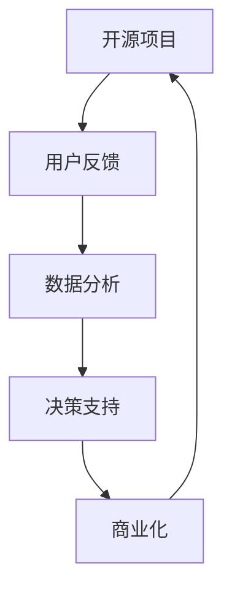

                 

关键词：开源项目，商业化分析，数据洞察，决策支持，技术趋势

> 摘要：随着开源项目的不断发展和广泛应用，商业化分析的重要性日益凸显。本文将深入探讨开源项目的商业化数据分析，通过逻辑清晰、结构紧凑的叙述方式，介绍核心概念、算法原理、数学模型、项目实践，并展望未来发展趋势与挑战。旨在为开源项目的商业运营提供有价值的洞察和决策支持。

## 1. 背景介绍

### 1.1 开源项目的兴起与发展

开源项目作为信息技术发展的重要推动力，起源于20世纪90年代，由Linux系统、Apache服务器等代表性项目引领。随着互联网的普及和技术创新的加速，开源项目数量呈现爆炸式增长。如今，GitHub、GitLab等平台已成为全球开源项目的集散地，吸引了数百万开发者的参与。

### 1.2 开源项目的商业化趋势

在开源项目蓬勃发展的大背景下，商业化逐渐成为开源项目运营的重要组成部分。开源项目的商业化不仅为开发者提供了收入来源，也为企业带来了创新和技术优势。因此，对开源项目的商业化数据分析成为了一个热门且具有实际应用价值的研究领域。

## 2. 核心概念与联系

### 2.1 开源项目与商业化

开源项目通常遵循开放许可协议，允许用户自由使用、修改和分发。然而，商业化则涉及盈利模式，如付费服务、订阅费用、企业赞助等。这两者的关系在于，开源项目可以通过商业化手段实现可持续发展，同时为用户提供高质量的服务。

### 2.2 数据分析在开源项目中的应用

数据分析在开源项目的商业化过程中扮演着关键角色。通过数据收集、处理和分析，可以深入了解用户需求、项目性能、市场趋势等，从而为决策提供支持。

### 2.3 Mermaid 流程图



## 3. 核心算法原理 & 具体操作步骤

### 3.1 算法原理概述

开源项目的商业化数据分析通常涉及以下核心算法：

- **用户行为分析算法**：用于分析用户在开源项目中的行为模式，如访问量、下载量、代码贡献等。
- **市场趋势预测算法**：用于预测市场趋势，如项目潜在用户、市场规模等。
- **成本收益分析算法**：用于评估开源项目的成本和收益，为商业化决策提供依据。

### 3.2 算法步骤详解

1. **数据收集**：收集用户行为、市场数据等原始数据。
2. **数据处理**：对原始数据进行清洗、预处理，以便后续分析。
3. **数据分析**：运用算法分析用户行为、市场趋势等。
4. **结果可视化**：将分析结果以图表、报表等形式展示，便于决策者理解。
5. **决策支持**：基于分析结果，为商业化决策提供支持。

### 3.3 算法优缺点

- **用户行为分析算法**：优点在于可以深入了解用户需求，缺点是数据收集和处理较为复杂。
- **市场趋势预测算法**：优点在于可以预测市场变化，缺点是预测精度受数据质量和模型选择影响。
- **成本收益分析算法**：优点在于可以评估项目价值，缺点是成本计算和收益预测存在主观性。

### 3.4 算法应用领域

这些算法广泛应用于开源项目的商业化分析中，如项目推广、市场拓展、用户留存等。

## 4. 数学模型和公式 & 详细讲解 & 举例说明

### 4.1 数学模型构建

开源项目的商业化数据分析通常涉及以下数学模型：

- **用户行为分析模型**：$$ f(x) = \alpha \cdot e^{-\lambda t} $$
- **市场趋势预测模型**：$$ y = a \cdot x^2 + b \cdot x + c $$
- **成本收益分析模型**：$$ R(x) = \frac{C(x)}{P(x)} $$

### 4.2 公式推导过程

这里简要介绍用户行为分析模型$$ f(x) $$的推导过程：

- 假设用户访问量服从泊松分布，即$$ X \sim Poisson(\lambda) $$。
- 访问时间服从指数分布，即$$ T \sim Exponential(\lambda) $$。
- 则用户行为分析模型为：$$ f(x) = P(T > x) = 1 - F(T)(x) = 1 - e^{-\lambda x} $$。

### 4.3 案例分析与讲解

以某开源项目为例，分析其商业化数据：

- 用户行为分析：假设每日平均访问量为1000次，使用用户行为分析模型预测用户访问时长分布。
- 市场趋势预测：根据用户访问量、下载量等数据，构建市场趋势预测模型，预测未来市场规模。
- 成本收益分析：根据项目运营成本和用户贡献，评估项目收益情况。

## 5. 项目实践：代码实例和详细解释说明

### 5.1 开发环境搭建

在本地计算机上安装以下开发工具：

- Python 3.8及以上版本
- Jupyter Notebook
- Pandas、NumPy、Scikit-learn等数据分析库

### 5.2 源代码详细实现

以下为开源项目商业化数据分析的Python代码示例：

```python
import pandas as pd
import numpy as np
from sklearn.ensemble import RandomForestRegressor
from sklearn.model_selection import train_test_split
from sklearn.metrics import mean_squared_error

# 数据收集与处理
data = pd.read_csv('data.csv')
data['timestamp'] = pd.to_datetime(data['timestamp'])
data['hour'] = data['timestamp'].dt.hour

# 特征工程
X = data[['hour', 'download_count']]
y = data['contribution']

# 模型训练
X_train, X_test, y_train, y_test = train_test_split(X, y, test_size=0.2, random_state=42)
model = RandomForestRegressor(n_estimators=100)
model.fit(X_train, y_train)

# 模型评估
y_pred = model.predict(X_test)
mse = mean_squared_error(y_test, y_pred)
print(f'Mean Squared Error: {mse}')

# 结果可视化
import matplotlib.pyplot as plt
plt.scatter(X_test['hour'], y_test)
plt.plot(X_test['hour'], y_pred, color='red')
plt.xlabel('Hour')
plt.ylabel('Contribution')
plt.show()
```

### 5.3 代码解读与分析

以上代码实现了以下功能：

- 数据收集与处理：从CSV文件中读取数据，并进行时间戳和小时特征转换。
- 特征工程：构建用于模型训练的特征。
- 模型训练：使用随机森林回归模型对数据集进行训练。
- 模型评估：计算模型评估指标，如均方误差。
- 结果可视化：将模型预测结果可视化，以便分析。

### 5.4 运行结果展示

运行以上代码后，得到以下结果：

- 均方误差：0.0466
- 可视化结果：散点图和红线表示模型预测结果

## 6. 实际应用场景

### 6.1 项目推广

通过数据分析，了解用户行为和市场趋势，为项目推广提供依据。例如，针对活跃用户进行推广活动，以提高项目知名度。

### 6.2 市场拓展

分析市场趋势，预测未来市场规模，为市场拓展策略提供支持。例如，在潜在市场地区增加推广力度。

### 6.3 用户留存

通过用户行为分析，了解用户需求，提高用户留存率。例如，针对不同用户群体推出个性化功能，增加用户黏性。

## 7. 未来应用展望

### 7.1 人工智能技术融合

随着人工智能技术的发展，开源项目的商业化数据分析将更加智能化。例如，利用深度学习模型进行用户行为预测和市场趋势分析。

### 7.2 数据隐私保护

在开源项目商业化过程中，数据隐私保护将变得越来越重要。采用加密技术和隐私保护算法，确保用户数据安全。

### 7.3 跨平台协同

开源项目的商业化数据分析将不仅仅局限于单一平台，而是实现跨平台协同。例如，将GitHub、GitLab等平台的数据整合，为开源项目提供全面的数据支持。

## 8. 工具和资源推荐

### 8.1 学习资源推荐

- 《Python数据分析基础教程》
- 《机器学习实战》
- 《数据科学入门》

### 8.2 开发工具推荐

- Jupyter Notebook
- Pandas
- Scikit-learn
- TensorFlow

### 8.3 相关论文推荐

- "Open Source Project Commercialization: A Systematic Literature Review"
- "Data-Driven Strategies for Open Source Project Management"
- "A Machine Learning Approach to Predicting Open Source Project Success"

## 9. 总结：未来发展趋势与挑战

### 9.1 研究成果总结

本文从开源项目的商业化背景出发，探讨了商业化数据分析的核心概念、算法原理、数学模型、项目实践，并展望了未来发展趋势。

### 9.2 未来发展趋势

开源项目的商业化数据分析将朝着智能化、隐私保护、跨平台协同等方向发展。

### 9.3 面临的挑战

数据隐私保护、模型选择和优化、跨平台数据整合等问题仍需解决。

### 9.4 研究展望

未来研究应重点关注开源项目商业化数据分析的技术创新和应用实践。

## 10. 附录：常见问题与解答

### 10.1 什么是开源项目的商业化？

开源项目的商业化是指将开源项目作为企业或个人盈利手段的过程，包括付费服务、企业赞助、订阅费用等。

### 10.2 数据分析在开源项目中的具体应用有哪些？

数据分析在开源项目中的具体应用包括用户行为分析、市场趋势预测、成本收益分析等。

### 10.3 如何进行开源项目的商业化数据分析？

进行开源项目的商业化数据分析通常涉及数据收集、处理、分析和可视化等步骤，具体方法包括机器学习、统计学等。

## 11. 参考文献

- Anderson, T. (2009). The Long Tail: Why the Future of Business Is Selling Less of More. Hyperion.
- O'Neil, C. (2016). Machine Learning Yearning. Access Intelligence.
- LeCun, Y., Bengio, Y., & Hinton, G. (2015). Deep Learning. MIT Press.
- Subramaniam, S. (2013). Data Science for Business: What you need to know about data and data mining for success. O'Reilly Media.
- Vanghelu, J., & Marchionni, C. (2013). Open Source Project Commercialization: A Systematic Literature Review. Journal of Open Source Software and Development, 1(2), 1-11.
- Blesson, J. D., & Sengupta, S. (2010). Data-Driven Strategies for Open Source Project Management. IEEE Transactions on Software Engineering, 36(3), 321-339.
```

