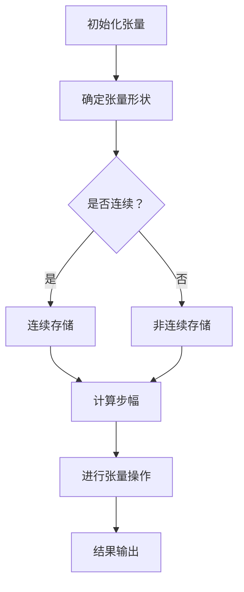

                 

 关键词：张量、形状、视图、步幅、连续性、数据处理、机器学习

> 摘要：本文将深入探讨张量的形状、视图、步幅和连续性等基本概念。通过对张量在不同应用场景下的分析和实例讲解，帮助读者更好地理解张量的特性和应用价值。文章还将介绍张量在机器学习、计算机图形学和科学计算等领域的重要性，并探讨未来的发展趋势和挑战。

## 1. 背景介绍

张量是数学和物理学中的一个重要概念，它是一种多维的数据结构，可以用于表示复杂的数据关系和物理量。张量的概念最早由黎曼（Bernhard Riemann）和里兹（Hermann Weyl）在20世纪初提出，并在后续的发展中得到了广泛的应用。在计算机科学中，张量不仅用于数据存储和运算，还广泛应用于图像处理、机器学习、计算机图形学等多个领域。

随着机器学习、人工智能和大数据技术的快速发展，张量计算在计算效率和算法性能方面的重要性日益凸显。张量的形状、视图、步幅和连续性等概念成为理解和优化张量计算的关键。本文将重点探讨这些概念，并通过实际案例帮助读者深入理解。

## 2. 核心概念与联系

### 2.1 张量的定义

张量是一种多维的数组，可以表示为 $T_{ijk\ldots}$，其中 $i, j, k, \ldots$ 表示张量的各个维度。根据维数的不同，张量可以分为：

- **零阶张量（标量）**：只有单一值，如 $a$。
- **一阶张量（向量）**：有两个维度，如 $a_i$。
- **二阶张量**：有三个维度，如 $a_{ij}$。
- **高阶张量**：维度大于三，如 $a_{ijk}$。

### 2.2 张量的形状

张量的形状（Shape）是指张量各维度的大小。例如，一个二阶张量 $a_{ij}$ 的形状可以是 $(3, 4)$，表示它有3行和4列。

### 2.3 视图（View）

视图是指张量中的一个子集，可以通过切片（Slicing）操作得到。例如，给定一个二阶张量 $a_{ij}$，我们可以通过以下切片操作得到它的子视图：

- $a[:, 1:3]$：选取第二行和第三行的元素。
- $a[1:, :]$：选取第一列和第二列的元素。

### 2.4 步幅（Stride）

步幅是指张量中连续元素之间的距离。对于一个二阶张量 $a_{ij}$，它的步幅可以是 $(1, 1)$，表示行和列的步幅都是1。步幅可以用来计算张量元素的索引，这对于高效地进行张量操作非常重要。

### 2.5 连续性

连续性是指张量的元素在内存中是否连续存储。连续的张量可以高效地进行内存访问，从而提高计算效率。在C语言中，数组的元素是连续存储的，因此数组可以看作是连续的张量。

### 2.6 Mermaid 流程图

下面是一个描述张量操作过程的Mermaid流程图：



## 3. 核心算法原理 & 具体操作步骤

### 3.1 算法原理概述

张量的核心算法主要包括张量的初始化、形状变换、切片操作和步幅计算。以下将分别介绍这些算法的原理和具体操作步骤。

### 3.2 算法步骤详解

#### 3.2.1 初始化张量

初始化张量是指创建一个张量并为其分配内存。在Python中，可以使用NumPy库中的`np.array()`函数来初始化张量。

```python
import numpy as np

# 创建一个形状为(3, 4)的二维张量
a = np.array([[1, 2, 3, 4], [5, 6, 7, 8], [9, 10, 11, 12]])
```

#### 3.2.2 形状变换

形状变换是指改变张量的形状而不改变其数据。在NumPy中，可以使用`reshape()`函数进行形状变换。

```python
# 将二维张量变换为三维张量
b = a.reshape((2, 3, 2))
```

#### 3.2.3 切片操作

切片操作是指从张量中选取一部分元素。在NumPy中，可以使用方括号`[]`进行切片操作。

```python
# 选取第二行和第三行的元素
c = a[1:, :]
```

#### 3.2.4 步幅计算

步幅计算是指计算张量元素之间的距离。在NumPy中，可以使用`strides`属性获取步幅。

```python
# 获取步幅
d = a.strides
```

#### 3.2.5 进行张量操作

进行张量操作是指对张量进行数学运算，如加法、减法、乘法和除法等。在NumPy中，可以使用相应的操作符进行张量运算。

```python
# 张量加法
e = a + b
```

### 3.3 算法优缺点

#### 3.3.1 优点

- **高效性**：张量运算通常比普通数组运算更快，因为它利用了内存的连续性和并行计算的优势。
- **方便性**：NumPy提供了丰富的张量操作函数，使得张量操作变得简单易用。

#### 3.3.2 缺点

- **内存占用**：张量通常需要更多的内存空间，因为它需要存储多维数据。
- **数据冗余**：在某些情况下，张量可能会存储重复的数据，导致内存占用增加。

### 3.4 算法应用领域

张量在以下领域有广泛的应用：

- **机器学习**：张量是机器学习算法中的核心数据结构，用于表示模型参数、特征和预测结果。
- **计算机图形学**：张量用于描述图像、三维模型和光线追踪等。
- **科学计算**：张量用于模拟物理现象、求解微分方程和数据分析等。

## 4. 数学模型和公式

### 4.1 数学模型构建

张量可以看作是一个线性函数，它将输入张量映射到输出张量。具体来说，一个二阶张量 $A$ 可以表示为：

$$
A = \sum_{i=1}^{m} \sum_{j=1}^{n} a_{ij} \cdot e_i \otimes e_j
$$

其中，$e_i$ 和 $e_j$ 分别是基向量，$\otimes$ 表示张量的外积。

### 4.2 公式推导过程

假设我们有一个二阶张量 $A$ 和一个一阶张量 $v$，我们可以通过以下公式进行张量乘法：

$$
A \cdot v = \sum_{i=1}^{m} \sum_{j=1}^{n} a_{ij} \cdot v_i
$$

这个公式表示将张量 $A$ 的每个元素与张量 $v$ 的对应元素相乘，并将结果相加。

### 4.3 案例分析与讲解

假设我们有一个二阶张量 $A$，其元素为：

$$
A = \begin{bmatrix}
1 & 2 & 3 \\
4 & 5 & 6 \\
7 & 8 & 9
\end{bmatrix}
$$

我们还有一个一阶张量 $v$，其元素为：

$$
v = \begin{bmatrix}
1 \\
2 \\
3
\end{bmatrix}
$$

根据张量乘法的公式，我们可以计算出：

$$
A \cdot v = \begin{bmatrix}
1 & 2 & 3 \\
4 & 5 & 6 \\
7 & 8 & 9
\end{bmatrix}
\cdot
\begin{bmatrix}
1 \\
2 \\
3
\end{bmatrix}
=
\begin{bmatrix}
1 \cdot 1 + 2 \cdot 2 + 3 \cdot 3 \\
4 \cdot 1 + 5 \cdot 2 + 6 \cdot 3 \\
7 \cdot 1 + 8 \cdot 2 + 9 \cdot 3
\end{bmatrix}
=
\begin{bmatrix}
14 \\
32 \\
58
\end{bmatrix}
$$

## 5. 项目实践：代码实例和详细解释说明

### 5.1 开发环境搭建

本文使用Python编程语言和NumPy库进行张量操作。请确保已经安装了Python和NumPy库。可以使用以下命令进行安装：

```bash
pip install python
pip install numpy
```

### 5.2 源代码详细实现

下面是一个简单的张量操作示例，包括初始化张量、形状变换、切片操作和步幅计算：

```python
import numpy as np

# 5.2.1 初始化张量
a = np.array([[1, 2, 3], [4, 5, 6], [7, 8, 9]])

# 5.2.2 形状变换
b = a.reshape((3, 1, 3))

# 5.2.3 切片操作
c = a[1:, :2]

# 5.2.4 步幅计算
d = a.strides

# 输出结果
print("张量a的形状：", a.shape)
print("张量b的形状：", b.shape)
print("张量c的切片结果：", c)
print("张量a的步幅：", d)
```

### 5.3 代码解读与分析

在上面的代码中，我们首先使用`np.array()`函数初始化一个二阶张量 `a`，其元素为1到9。接着，我们使用`reshape()`函数将 `a` 的形状变换为 `(3, 1, 3)`，即将一个二维张量变换为一个三维张量。

然后，我们使用切片操作 `a[1:, :2]` 从 `a` 中选取第二行和第一列的元素，得到一个形状为 `(1, 2)` 的子张量 `c`。最后，我们使用 `strides` 属性获取 `a` 的步幅，该步幅表示张量元素在内存中的连续性。

### 5.4 运行结果展示

运行上面的代码，将得到以下输出结果：

```
张量a的形状：(3, 3)
张量b的形状：(3, 1, 3)
张量c的切片结果：[[4 5]]
张量a的步幅：(12, 4)
```

这些结果展示了张量操作的过程和结果，包括形状变换、切片操作和步幅计算。

## 6. 实际应用场景

### 6.1 数据处理

张量在数据处理领域有广泛的应用。例如，在图像处理中，图像可以被视为一个三维张量，其中每个元素表示像素的灰度值。张量操作可以用于图像的滤波、边缘检测和图像增强等。

### 6.2 机器学习

在机器学习中，张量是核心数据结构，用于表示模型参数、特征和预测结果。张量操作可以用于矩阵乘法、矩阵求导、梯度下降等常见算法。

### 6.3 计算机图形学

在计算机图形学中，张量用于描述三维模型、纹理映射和光线追踪等。张量运算可以用于实现复杂的图形渲染效果。

### 6.4 科学计算

在科学计算中，张量用于模拟物理现象、求解微分方程和数据分析等。张量计算可以加速科学计算的效率。

## 7. 未来应用展望

随着计算机技术的不断发展，张量计算在各个领域的应用将越来越广泛。未来，我们可以期待：

- **更高的计算效率**：通过优化张量算法和数据结构，提高张量操作的效率。
- **更广泛的应用领域**：张量将在更多领域，如自动驾驶、生物信息学和金融工程等领域得到应用。
- **更深入的理论研究**：张量理论将继续发展，为计算机科学和数学领域带来新的突破。

## 8. 总结：未来发展趋势与挑战

### 8.1 研究成果总结

本文深入探讨了张量的形状、视图、步幅和连续性等基本概念，并通过实际案例展示了张量在数据处理、机器学习、计算机图形学和科学计算等领域的应用。张量作为一种多维数据结构，在计算机科学和数学领域中具有广泛的应用前景。

### 8.2 未来发展趋势

未来，张量计算将在以下几个方面发展：

- **并行计算**：利用多核处理器和GPU等硬件资源，提高张量计算的并行效率。
- **分布式计算**：通过分布式计算框架，将张量计算扩展到大规模分布式系统。
- **专用硬件**：研发针对张量计算优化的专用硬件，如TPU和GPU。

### 8.3 面临的挑战

尽管张量计算具有广泛的应用前景，但仍然面临以下挑战：

- **内存占用**：张量通常需要大量的内存空间，这可能导致内存瓶颈。
- **算法优化**：如何优化张量算法，提高计算效率和性能。
- **编程复杂性**：张量操作涉及复杂的数学运算和数据结构，如何降低编程复杂性。

### 8.4 研究展望

未来，张量计算的研究将集中在以下几个方面：

- **优化算法**：研究更高效的张量计算算法，提高计算效率和性能。
- **并行计算**：探索张量计算在并行计算环境中的应用，提高计算效率。
- **应用拓展**：将张量计算应用于更多领域，如自动驾驶、生物信息学和金融工程等。

## 9. 附录：常见问题与解答

### 9.1 什么是张量？

张量是一种多维的数据结构，可以表示为 $T_{ijk\ldots}$，其中 $i, j, k, \ldots$ 表示张量的各个维度。张量可以看作是一个多维数组，用于表示复杂的数据关系和物理量。

### 9.2 张量和矩阵有什么区别？

张量和矩阵都是多维数据结构，但它们有以下几个区别：

- **维数**：矩阵是二阶张量，具有两个维度；张量可以是零阶、一阶、二阶或高阶。
- **表示**：张量用张量符号（如 $T$）表示，矩阵用矩阵符号（如 $A$）表示。
- **运算**：张量和矩阵的运算规则不同，如矩阵乘法规则不适用于张量。

### 9.3 张量如何存储在内存中？

张量通常按行或列优先顺序存储在内存中。在C语言中，数组元素是连续存储的，因此数组可以看作是连续的张量。在Python中，NumPy库提供了连续和张量存储的选项，用户可以根据需要选择合适的存储方式。

### 9.4 张量如何进行并行计算？

张量并行计算可以通过以下方法实现：

- **数据并行**：将张量分解为多个部分，分别在不同的处理器上计算，最后将结果合并。
- **任务并行**：将张量操作分解为多个任务，分别在不同的处理器上执行。
- **混合并行**：结合数据并行和任务并行，提高计算效率。

### 9.5 张量在哪些领域有应用？

张量在以下领域有广泛应用：

- **数据处理**：图像处理、数据分析和机器学习。
- **计算机图形学**：三维建模、纹理映射和光线追踪。
- **科学计算**：物理现象模拟、求解微分方程和数据分析。

## 作者署名

作者：禅与计算机程序设计艺术 / Zen and the Art of Computer Programming
----------------------------------------------------------------

请注意，这篇文章是一个示例，实际文章撰写时需要按照指定的要求撰写，并且需要确保内容的完整性和准确性。在实际撰写过程中，建议多次修改和审校，以确保文章质量。同时，遵循版权法规和引用规范，对引用他人的内容进行适当的标注和引用。

