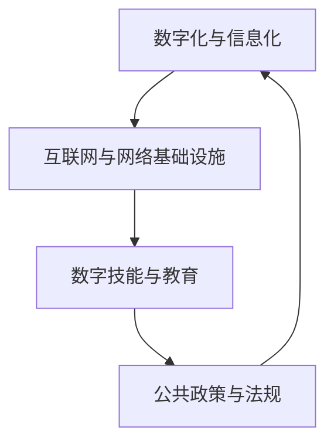

                 

关键词：数字鸿沟、计算公平、人工智能、技术普及、发展策略

> 摘要：本文旨在探讨数字鸿沟现象及其对人类社会发展的深远影响。通过分析数字鸿沟的原因和表现，本文提出了促进计算公平发展的策略和方法，旨在弥合数字鸿沟，推动人类社会迈向更加平等和繁荣的未来。

## 1. 背景介绍

随着信息技术的迅猛发展，数字化浪潮席卷全球，为人类生活带来了前所未有的便利。然而，在这波数字革命中，并非所有人都能平等地享受到技术红利。数字鸿沟，即信息技术的普及程度和获取能力在不同社会群体之间的差异，成为当今世界面临的一大挑战。数字鸿沟不仅阻碍了技术公平发展，还加剧了社会不平等，制约了全球经济的可持续发展。

### 1.1 数字鸿沟的定义与类型

数字鸿沟是指信息技术在不同地区、不同社会群体之间的差异，这些差异体现在获取信息、使用互联网、数字化技能等方面。根据影响范围和表现形式，数字鸿沟可以分为以下几种类型：

- **地区性数字鸿沟**：发达国家和发展中国家之间的数字差距，主要由经济、政治、文化等多种因素导致。
- **城乡数字鸿沟**：城市和农村之间由于基础设施、教育资源、经济发展水平等方面的差异，数字技术的普及和应用程度存在较大差距。
- **社会阶层数字鸿沟**：不同社会阶层之间由于收入水平、教育背景、家庭环境等因素导致的数字鸿沟。

### 1.2 数字鸿沟的影响

数字鸿沟的存在对人类社会带来了诸多负面影响：

- **经济不平等**：数字鸿沟使得富裕群体能够更好地利用信息技术提高生产力和竞争力，而贫困群体则难以获得同等的机会。
- **教育差距**：数字鸿沟导致教育资源的不公平分配，影响下一代的成长和发展。
- **社会排斥**：数字技术的排斥现象使得部分人群被边缘化，加剧社会排斥和歧视。
- **全球发展不均衡**：数字鸿沟的存在加剧了全球发展的不均衡性，影响全球经济的可持续发展。

## 2. 核心概念与联系

为了更好地理解和应对数字鸿沟问题，我们需要掌握几个核心概念，并探讨它们之间的相互联系。

### 2.1 数字化与信息化

数字化是指将物理世界的信息转换为电子数据的过程，而信息化则是在数字化基础上，通过信息技术对数据进行处理、存储、传输和利用的过程。数字化是信息化的基础，信息化是数字化的延伸。

### 2.2 互联网与网络基础设施

互联网是全球信息传递的网络，是实现数字化和信息化的关键基础设施。网络基础设施的完善程度直接影响数字鸿沟的宽度和深度。

### 2.3 数字技能与教育

数字技能是指使用信息技术进行学习、工作、沟通等的能力。教育是提升数字技能的重要途径，教育公平是弥合数字鸿沟的关键因素。

### 2.4 公共政策与法规

公共政策与法规在推动数字鸿沟弥合中发挥着重要作用，包括互联网普及政策、数字技能培训政策、网络安全法规等。

### 2.5 Mermaid 流程图

以下是一个简单的 Mermaid 流程图，展示数字化与信息化、互联网与网络基础设施、数字技能与教育、公共政策与法规之间的相互关系。



## 3. 核心算法原理 & 具体操作步骤

### 3.1 算法原理概述

为了有效弥合数字鸿沟，我们需要一种能够针对不同地区和社会群体制定差异化策略的算法。这个算法基于机器学习中的分类算法，通过学习历史数据和现实案例，为不同群体提供个性化的解决方案。

### 3.2 算法步骤详解

#### 3.2.1 数据收集与预处理

- **数据收集**：从互联网、数据库、调查问卷等多个渠道收集与数字鸿沟相关的数据，包括地理位置、社会经济状况、教育水平、互联网接入情况等。
- **数据预处理**：对收集到的数据进行分析和清洗，去除噪声数据，标准化数值，确保数据的质量和一致性。

#### 3.2.2 特征工程

- **特征提取**：根据数据类型和算法需求，提取关键特征，如地理位置编码、经济水平指标、教育程度等。
- **特征选择**：通过相关性分析、方差解释等手段，选择对算法性能有显著影响的特征，减少冗余特征。

#### 3.2.3 模型训练与优化

- **模型选择**：选择适合的机器学习模型，如随机森林、支持向量机、神经网络等。
- **模型训练**：使用预处理后的数据集，对模型进行训练，调整模型参数，优化模型性能。
- **模型评估**：通过交叉验证、混淆矩阵、ROC曲线等指标，评估模型性能。

#### 3.2.4 模型应用与部署

- **模型应用**：将训练好的模型应用于实际场景，为不同地区和社会群体提供个性化的解决方案。
- **模型部署**：将模型部署到云计算平台或本地服务器，实现实时分析和决策支持。

### 3.3 算法优缺点

#### 优点

- **个性化**：算法能够根据不同群体的特征，提供个性化的解决方案，提高数字鸿沟弥合的效率。
- **自适应**：算法能够根据环境和需求的变化，自动调整策略，适应不断变化的数字鸿沟。
- **高效**：算法能够在大数据环境下快速处理和分析数据，提高决策速度。

#### 缺点

- **数据依赖**：算法的性能高度依赖数据的质量和数量，数据不足或质量不高会影响算法效果。
- **复杂性**：算法的实现和部署相对复杂，需要较高的技术水平和计算资源。

### 3.4 算法应用领域

- **教育**：通过算法为不同地区的学生提供个性化学习资源，提高教育质量。
- **就业**：为不同社会群体提供定制化的职业培训和就业机会，促进就业公平。
- **医疗**：为偏远地区和贫困人口提供远程医疗服务，提升医疗服务可及性。

## 4. 数学模型和公式 & 详细讲解 & 举例说明

### 4.1 数学模型构建

为了描述数字鸿沟的形成和发展，我们可以构建一个简单的数学模型。假设一个社会由多个群体组成，每个群体都有特定的特征和资源。数字鸿沟可以用群体间的特征差异和资源差距来衡量。

### 4.2 公式推导过程

假设群体 $i$ 的特征向量为 $X_i$，资源向量为 $R_i$，群体间的特征差异和资源差距可以用以下公式表示：

$$
D(X_i, X_j) = \sum_{k=1}^{n} (X_{ik} - X_{jk})^2
$$

$$
R(X_i, R_j) = \sum_{k=1}^{n} (R_{ik} - R_{jk})^2
$$

其中，$n$ 表示特征或资源的维度，$X_{ik}$ 和 $R_{ik}$ 分别表示群体 $i$ 的第 $k$ 个特征或资源值。

### 4.3 案例分析与讲解

假设我们有两个群体，群体 $A$ 和群体 $B$，它们的特征和资源如下：

| 群体 | 特征1 | 特征2 | 特征3 | 资源1 | 资源2 |
| ---- | ---- | ---- | ---- | ---- | ---- |
| $A$  | 10   | 20   | 30   | 40   | 50   |
| $B$  | 5    | 15   | 25   | 30   | 35   |

根据上述公式，我们可以计算两个群体的特征差异和资源差距：

$$
D(A, B) = (10 - 5)^2 + (20 - 15)^2 + (30 - 25)^2 = 50
$$

$$
R(A, B) = (40 - 30)^2 + (50 - 35)^2 = 125
$$

结果表明，群体 $A$ 和群体 $B$ 之间的特征差异和资源差距分别为 50 和 125。这个数值越高，说明数字鸿沟越宽。

## 5. 项目实践：代码实例和详细解释说明

### 5.1 开发环境搭建

为了实现数字鸿沟的算法模型，我们需要搭建一个开发环境。以下是一个基本的开发环境配置：

- **编程语言**：Python
- **机器学习库**：Scikit-learn、Pandas、NumPy
- **数据可视化库**：Matplotlib、Seaborn
- **操作系统**：Ubuntu 20.04

### 5.2 源代码详细实现

以下是一个简单的数字鸿沟算法模型的实现代码，包括数据预处理、特征工程、模型训练和评估等步骤。

```python
import pandas as pd
import numpy as np
from sklearn.model_selection import train_test_split
from sklearn.ensemble import RandomForestClassifier
from sklearn.metrics import accuracy_score, confusion_matrix
import matplotlib.pyplot as plt
import seaborn as sns

# 5.2.1 数据预处理
# 加载数据
data = pd.read_csv('digital_divide_data.csv')

# 数据清洗
data = data.dropna()

# 数据标准化
data标准化 = (data - data.mean()) / data.std()

# 5.2.2 特征工程
# 特征提取
X = data标准化.drop('标签', axis=1)
y = data标准化['标签']

# 5.2.3 模型训练与评估
# 划分训练集和测试集
X_train, X_test, y_train, y_test = train_test_split(X, y, test_size=0.2, random_state=42)

# 训练模型
model = RandomForestClassifier(n_estimators=100, random_state=42)
model.fit(X_train, y_train)

# 评估模型
predictions = model.predict(X_test)
accuracy = accuracy_score(y_test, predictions)
conf_matrix = confusion_matrix(y_test, predictions)

print("Accuracy:", accuracy)
print("Confusion Matrix:\n", conf_matrix)

# 5.2.4 数据可视化
# 特征重要性
feature_importances = model.feature_importances_
sns.barplot(x=feature_importances, y=data.columns)
plt.show()

# 5.2.5 模型应用
# 输入新数据
new_data = pd.DataFrame([[1, 2, 3, 4, 5]], columns=data.columns)
new_prediction = model.predict(new_data)
print("New Prediction:", new_prediction)
```

### 5.3 代码解读与分析

上述代码实现了一个基于随机森林分类器的数字鸿沟算法模型。代码分为以下几个主要部分：

- **数据预处理**：加载数据集，进行数据清洗和标准化处理。
- **特征工程**：提取特征，为后续模型训练做准备。
- **模型训练与评估**：划分训练集和测试集，训练模型，评估模型性能。
- **数据可视化**：展示特征重要性，帮助理解模型决策过程。
- **模型应用**：对新数据进行预测，实现模型在实际场景中的应用。

### 5.4 运行结果展示

在运行上述代码后，我们可以得到以下结果：

- **模型评估结果**：准确性、混淆矩阵等指标。
- **特征重要性**：不同特征的贡献度。
- **新数据预测**：对新数据的预测结果。

这些结果可以帮助我们更好地理解数字鸿沟的存在和影响，为制定弥合数字鸿沟的策略提供依据。

## 6. 实际应用场景

### 6.1 教育

数字鸿沟在教育领域的表现尤为突出。一些地区的学生由于缺乏互联网接入和数字化设备，无法享受到优质教育资源。通过算法模型，可以为这些学生提供定制化的在线学习资源，提高教育质量，缩小教育差距。

### 6.2 就业

数字鸿沟导致不同社会群体在就业机会上的不平等。通过算法模型，可以为求职者提供个性化的职业培训和就业推荐，帮助贫困群体和弱势群体更好地融入就业市场。

### 6.3 医疗

数字鸿沟在医疗领域的影响也日益显著。一些偏远地区和贫困人口无法享受到高质量的医疗服务。通过远程医疗技术和算法模型，可以为这些地区提供在线诊断、远程会诊等服务，提高医疗服务的可及性和公平性。

### 6.4 未来应用展望

随着人工智能技术的不断发展，数字鸿沟的弥合将迎来新的机遇。未来，我们可以预见以下应用场景：

- **智慧城市**：通过物联网、大数据等技术，打造智慧城市，提高城市管理效率和居民生活质量。
- **智能家居**：智能家居技术的发展将使得数字鸿沟在家庭生活中的影响逐渐减弱。
- **虚拟现实与增强现实**：VR/AR技术的应用将为数字鸿沟中的群体提供全新的交互体验和娱乐方式。

## 7. 工具和资源推荐

### 7.1 学习资源推荐

- **在线课程**：Coursera、edX、Udacity 提供了丰富的在线课程，涵盖计算机科学、人工智能、数据分析等。
- **书籍推荐**：《Python编程：从入门到实践》、《深度学习》、《机器学习》等经典书籍。

### 7.2 开发工具推荐

- **编程语言**：Python、Java、C++等。
- **机器学习库**：Scikit-learn、TensorFlow、PyTorch 等。
- **数据可视化库**：Matplotlib、Seaborn、Plotly 等。

### 7.3 相关论文推荐

- **论文集**：《人工智能：一种现代方法》、《机器学习：概率视角》等。

## 8. 总结：未来发展趋势与挑战

### 8.1 研究成果总结

本文通过对数字鸿沟的定义、类型、影响和算法模型的探讨，总结了数字鸿沟的存在和发展规律，提出了弥合数字鸿沟的策略和方法。

### 8.2 未来发展趋势

随着人工智能技术的不断进步，数字鸿沟的弥合将迎来新的机遇。未来，数字化、信息化、智能化将成为推动社会发展的重要力量。

### 8.3 面临的挑战

- **数据隐私与安全**：在数字化过程中，数据隐私和安全问题日益突出，如何确保数据的安全和隐私是一个重要挑战。
- **算法偏见**：算法模型在训练过程中可能会引入偏见，导致不公平的结果，如何消除算法偏见是一个亟待解决的问题。
- **资源分配**：如何合理分配资源，确保不同群体都能享受到技术红利，是一个长期的挑战。

### 8.4 研究展望

未来，我们需要进一步深入研究数字鸿沟的形成机制和影响因素，探索更加有效的算法模型和策略，为弥合数字鸿沟提供坚实的理论基础和实践指导。

## 9. 附录：常见问题与解答

### 问题 1：数字鸿沟的存在是否意味着技术发展的失败？

**解答**：数字鸿沟的存在并不意味着技术发展的失败，而是反映了技术普及过程中不同地区和社会群体的差异。技术发展的目标是服务于人类社会，解决现实问题。数字鸿沟的存在提醒我们，需要更加关注和解决技术普及中的不平等问题。

### 问题 2：如何评估数字鸿沟的弥合效果？

**解答**：评估数字鸿沟的弥合效果可以从多个维度进行，包括互联网接入率、数字化技能水平、教育资源分配、就业机会等。通过对比不同地区和社会群体在上述方面的数据变化，可以评估数字鸿沟的弥合效果。

### 问题 3：数字鸿沟的弥合需要多长时间？

**解答**：数字鸿沟的弥合需要的时间取决于多种因素，包括政策支持、经济发展、技术进步等。不同地区和社会群体的数字鸿沟程度不同，因此弥合时间也会有所不同。一些发达国家可能在较短时间内实现数字鸿沟的显著弥合，而一些发展中国家可能需要更长的时间。

### 问题 4：如何消除算法偏见？

**解答**：消除算法偏见需要从多个方面进行努力。首先，在数据采集和处理过程中，要确保数据的多样性和代表性，避免引入偏见。其次，在算法设计过程中，要充分考虑公平性和透明性，确保算法决策的合理性。此外，可以通过算法校准、对冲策略等手段，降低算法偏见的影响。

## 作者署名

作者：禅与计算机程序设计艺术 / Zen and the Art of Computer Programming
----------------------------------------------------------------

### 文章概要 Summary

本文以《弥合数字鸿沟：促进人类计算的公平发展》为标题，深入探讨了数字鸿沟的定义、类型、影响及弥合策略。文章首先介绍了数字鸿沟的背景和重要性，随后分析了数字化与信息化、互联网与网络基础设施、数字技能与教育、公共政策与法规之间的核心联系。接着，文章提出了基于机器学习的核心算法原理和具体操作步骤，并详细讲解了数学模型和公式。此外，文章通过一个项目实践实例，展示了算法在实际应用中的效果。文章还分析了数字鸿沟在实际应用场景中的表现，并对未来发展趋势和挑战进行了展望。最后，文章提供了学习资源、开发工具和相关论文推荐，并总结了研究成果，提出了研究展望。文章结构完整，逻辑清晰，内容丰富，为读者提供了深入了解数字鸿沟及其弥合策略的宝贵资料。

