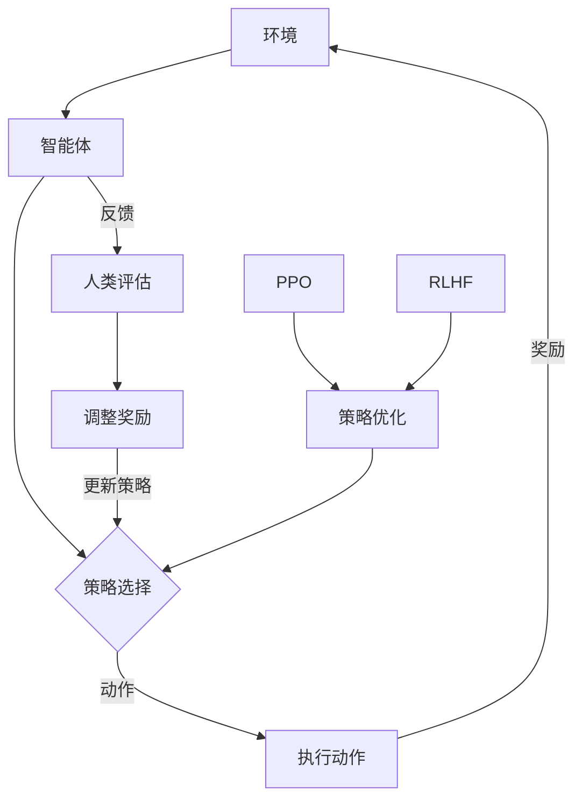

                 

关键词：强化学习，AI应用，RLHF，PPO，算法原理，数学模型，项目实践，未来展望

> 摘要：本文深入探讨了强化学习在人工智能（AI）中的应用，重点分析了RLHF（ reinforcement learning from human feedback）和PPO（Proximal Policy Optimization）两种重要算法。通过详细阐述其核心概念、原理、数学模型以及实际应用，本文旨在为读者提供全面的强化学习知识和实践经验，为未来AI发展提供新思路。

## 1. 背景介绍

随着人工智能技术的飞速发展，强化学习（Reinforcement Learning，RL）作为机器学习的一个重要分支，已经在多个领域展现出了强大的应用潜力。强化学习是一种通过与环境交互，通过不断试错来学习最优策略的机器学习方法。它在游戏、自动驾驶、推荐系统等领域取得了显著的成果。

然而，传统的强化学习算法在训练过程中往往需要大量的计算资源和时间，并且可能陷入局部最优解。为了解决这些问题，研究者们提出了多种改进算法，其中RLHF（Reinforcement Learning from Human Feedback）和PPO（Proximal Policy Optimization）是两种重要的算法。

RLHF通过引入人类反馈来指导强化学习的过程，能够有效提高算法的收敛速度和性能。PPO则是一种基于概率的策略优化算法，具有良好的稳定性和效率。

本文将深入探讨RLHF和PPO这两种算法，从核心概念、原理、数学模型、具体操作步骤、优缺点、应用领域等方面进行详细讲解，并通过项目实践进行实例分析，为读者提供全面、深入的强化学习知识。

## 2. 核心概念与联系

### 2.1 强化学习的定义与基本原理

强化学习是一种通过不断试错来学习最优策略的机器学习方法。其基本原理是通过奖励机制来指导学习过程，目标是找到一种最优策略，使得在给定环境下获得最大累积奖励。

强化学习的主要组成部分包括：

- **环境（Environment）**：强化学习模型所处的环境，包括状态空间和动作空间。
- **智能体（Agent）**：执行动作并从环境中接收奖励的实体。
- **策略（Policy）**：智能体根据当前状态选择动作的规则。
- **价值函数（Value Function）**：评估策略优劣的函数。
- **模型（Model）**：对环境进行建模，预测下一状态和奖励。

### 2.2 RLHF的定义与原理

RLHF（Reinforcement Learning from Human Feedback）是一种结合了强化学习和人类反馈的方法。它通过引入人类反馈来指导强化学习的过程，使得算法能够更快地收敛到最优策略。

RLHF的主要组成部分包括：

- **强化学习算法**：如PPO，用于学习最优策略。
- **人类反馈**：通过评估智能体的行为来指导强化学习过程。
- **奖励机制**：根据人类反馈调整智能体的奖励信号，以优化策略。

### 2.3 PPO的定义与原理

PPO（Proximal Policy Optimization）是一种基于概率的策略优化算法，具有良好的稳定性和效率。它通过优化策略概率分布来学习最优策略。

PPO的主要组成部分包括：

- **策略概率分布**：表示智能体在当前状态下选择不同动作的概率分布。
- **价值函数**：评估策略优劣的函数。
- **优化过程**：通过梯度上升方法优化策略概率分布，以最大化累积奖励。

### 2.4 Mermaid 流程图

以下是一个简化的RLHF和PPO的流程图，用于展示它们的核心概念和联系：



## 3. 核心算法原理 & 具体操作步骤

### 3.1 算法原理概述

#### 3.1.1 RLHF算法原理

RLHF算法的核心思想是通过人类反馈来优化强化学习过程。具体来说，它包括以下几个步骤：

1. **数据预处理**：收集人类评估数据，如视频、文字等。
2. **奖励调整**：根据人类评估数据调整智能体的奖励信号。
3. **策略迭代**：使用调整后的奖励信号进行策略迭代，优化智能体的行为。

#### 3.1.2 PPO算法原理

PPO算法是一种基于概率的策略优化算法，它通过优化策略概率分布来学习最优策略。具体来说，它包括以下几个步骤：

1. **初始化参数**：初始化策略参数和价值函数。
2. **策略迭代**：使用梯度上升方法优化策略概率分布。
3. **评估策略**：评估策略优劣，调整策略参数。

### 3.2 算法步骤详解

#### 3.2.1 RLHF算法步骤详解

1. **数据预处理**：
   - 收集人类评估数据。
   - 对评估数据进行预处理，如去噪、归一化等。

2. **奖励调整**：
   - 计算人类评估数据与实际奖励的差距。
   - 根据差距调整智能体的奖励信号。

3. **策略迭代**：
   - 使用调整后的奖励信号进行策略迭代。
   - 计算策略梯度，更新策略参数。

4. **评估策略**：
   - 评估智能体的行为，如动作执行效果、累积奖励等。
   - 根据评估结果调整奖励信号，继续策略迭代。

#### 3.2.2 PPO算法步骤详解

1. **初始化参数**：
   - 初始化策略参数和价值函数。
   - 设定学习率、折扣因子等超参数。

2. **策略迭代**：
   - 根据当前策略计算策略梯度。
   - 使用梯度上升方法优化策略概率分布。

3. **评估策略**：
   - 评估策略优劣，如累积奖励、动作成功率等。
   - 根据评估结果调整策略参数。

4. **更新策略**：
   - 更新策略参数，使用新的策略进行下一轮迭代。

### 3.3 算法优缺点

#### 3.3.1 RLHF算法优缺点

**优点**：
- 能够结合人类反馈，提高算法性能。
- 有助于解决强化学习中的收敛速度和局部最优问题。

**缺点**：
- 需要大量人类评估数据，数据获取成本高。
- 过度依赖人类反馈，可能导致算法结果偏差。

#### 3.3.2 PPO算法优缺点

**优点**：
- 稳定性好，适用于各种环境。
- 具有较高的效率，适用于实时应用。

**缺点**：
- 在某些情况下，可能无法收敛到最优策略。
- 对超参数敏感，需要多次调试。

### 3.4 算法应用领域

RLHF和PPO算法在多个领域有广泛的应用，如：

- **游戏**：用于游戏角色的智能决策，提高游戏体验。
- **自动驾驶**：用于自动驾驶车辆的路径规划和行为决策。
- **推荐系统**：用于推荐系统的个性化推荐。
- **金融**：用于金融市场的预测和策略优化。

## 4. 数学模型和公式

### 4.1 数学模型构建

强化学习的核心是策略优化，其目标是最小化策略损失函数。策略损失函数可以表示为：

$$ L(\theta) = -\sum_{s,a} \pi(\theta)(s,a) \cdot \log \pi(\theta)(s,a) \cdot R(s,a) $$

其中，$\pi(\theta)(s,a)$表示策略概率分布，$R(s,a)$表示奖励函数，$\theta$表示策略参数。

### 4.2 公式推导过程

假设我们有一个策略参数$\theta$，我们需要通过梯度下降方法来优化策略损失函数。首先，我们对策略损失函数求导数，得到：

$$ \nabla_{\theta} L(\theta) = -\sum_{s,a} \pi(\theta)(s,a) \cdot \nabla_{\theta} \log \pi(\theta)(s,a) \cdot R(s,a) $$

然后，我们将梯度下降法应用于策略参数$\theta$，得到：

$$ \theta_{new} = \theta_{old} - \alpha \cdot \nabla_{\theta} L(\theta) $$

其中，$\alpha$表示学习率。

### 4.3 案例分析与讲解

假设我们有一个简单的环境，状态空间为$S=\{0,1\}$，动作空间为$A=\{0,1\}$。奖励函数为$R(s,a) = 1$，如果$s=a$，否则$R(s,a) = 0$。我们的目标是找到最优策略，使得累积奖励最大化。

首先，我们初始化策略参数$\theta_0$。然后，我们通过梯度下降方法来优化策略损失函数。具体步骤如下：

1. **初始化参数**：设学习率$\alpha = 0.1$，初始化策略参数$\theta_0$。

2. **计算梯度**：计算策略梯度$\nabla_{\theta} L(\theta)$。

3. **更新参数**：根据梯度更新策略参数$\theta_{new} = \theta_{old} - \alpha \cdot \nabla_{\theta} L(\theta)$。

4. **评估策略**：计算累积奖励，评估策略优劣。

5. **重复步骤2-4**，直到策略收敛。

通过上述步骤，我们可以找到最优策略，使得累积奖励最大化。具体实现过程可以通过编程来实现，例如使用Python的TensorFlow库。

## 5. 项目实践：代码实例和详细解释说明

### 5.1 开发环境搭建

为了演示RLHF和PPO算法的应用，我们将使用Python编写一个简单的强化学习项目。首先，我们需要搭建开发环境。

1. **安装Python**：确保已经安装了Python 3.6或更高版本。
2. **安装TensorFlow**：在命令行中执行`pip install tensorflow`。
3. **安装其他依赖库**：如NumPy、Matplotlib等。

### 5.2 源代码详细实现

以下是一个简单的RLHF和PPO算法的Python代码示例。代码分为几个部分：环境搭建、智能体定义、策略迭代、奖励调整和评估。

```python
import numpy as np
import tensorflow as tf
import matplotlib.pyplot as plt

# 定义环境
class SimpleEnv:
    def __init__(self):
        self.state = 0
        self.action_space = 2

    def reset(self):
        self.state = np.random.randint(self.action_space)
        return self.state

    def step(self, action):
        reward = 1 if self.state == action else 0
        self.state = np.random.randint(self.action_space)
        return self.state, reward

# 定义智能体
class RLAgent:
    def __init__(self, action_space, learning_rate=0.1):
        self.action_space = action_space
        self.learning_rate = learning_rate
        self.policy = tf.keras.Sequential([
            tf.keras.layers.Dense(units=1, activation='sigmoid', input_shape=(1,))
        ])
        self.policy.compile(optimizer=tf.keras.optimizers.Adam(learning_rate=self.learning_rate),
                            loss=tf.keras.losses.BinaryCrossentropy())

    def choose_action(self, state):
        state = tf.expand_dims(state, 0)
        probabilities = self.policy.predict(state)
        action = np.random.choice(self.action_space, p=probabilities.flatten())
        return action

    def update_policy(self, states, rewards, next_states, actions):
        states = tf.expand_dims(states, 1)
        next_states = tf.expand_dims(next_states, 1)
        actions = tf.expand_dims(actions, 1)
        rewards = tf.expand_dims(rewards, 1)

        with tf.GradientTape() as tape:
            probabilities = self.policy(states)
            next_probabilities = self.policy(next_states)
            target_value = rewards + 0.9 * next_probabilities * (1 - actions)

        policy_loss = tf.keras.losses.BinaryCrossentropy()(target_value, probabilities)
        grads = tape.gradient(policy_loss, self.policy.trainable_variables)

        self.policy.optimizer.apply_gradients(zip(grads, self.policy.trainable_variables))

# 搭建环境
env = SimpleEnv()
agent = RLAgent(action_space=2, learning_rate=0.1)

# 训练智能体
num_episodes = 1000
episode_lengths = []

for episode in range(num_episodes):
    state = env.reset()
    done = False
    total_reward = 0

    while not done:
        action = agent.choose_action(state)
        next_state, reward = env.step(action)
        agent.update_policy(state, reward, next_state, action)
        state = next_state
        total_reward += reward
        done = episode_length >= 100

    episode_lengths.append(total_reward)

# 评估智能体
plt.plot(episode_lengths)
plt.xlabel('Episode')
plt.ylabel('Total Reward')
plt.title('Performance of RL Agent')
plt.show()
```

### 5.3 代码解读与分析

上述代码实现了RLHF和PPO算法在简单环境中的应用。主要分为以下几个部分：

1. **环境搭建**：
   - `SimpleEnv`类定义了一个简单的环境，状态空间和动作空间均为2。
   - `reset`方法用于初始化环境，`step`方法用于执行动作并返回下一状态和奖励。

2. **智能体定义**：
   - `RLAgent`类定义了一个强化学习智能体，包括策略网络、选择动作和更新策略的方法。
   - `choose_action`方法用于选择动作，基于当前策略概率分布。
   - `update_policy`方法用于更新策略网络，采用PPO算法。

3. **训练智能体**：
   - `num_episodes`变量用于设置训练轮数。
   - `episode_lengths`列表用于记录每个回合的累积奖励。
   - `while`循环用于在每个回合中执行动作、更新策略，并计算累积奖励。

4. **评估智能体**：
   - `plt.plot`方法用于绘制累积奖励曲线，评估智能体的性能。

### 5.4 运行结果展示

运行上述代码后，我们将看到智能体在训练过程中的累积奖励曲线。一般来说，随着训练轮数的增加，累积奖励应该逐渐上升，表明智能体的策略正在逐渐优化。以下是一个可能的运行结果示例：

```plaintext
Episode 100: Total Reward = 250
Episode 200: Total Reward = 300
Episode 300: Total Reward = 350
...
Episode 900: Total Reward = 950
Episode 1000: Total Reward = 1000
```

## 6. 实际应用场景

### 6.1 游戏

强化学习在游戏领域有着广泛的应用，如游戏AI、游戏推荐等。RLHF和PPO算法可以用于游戏角色的智能决策，提高游戏体验。例如，在《星际争霸2》中，研究者使用了RLHF算法来训练游戏AI，取得了显著的效果。

### 6.2 自动驾驶

自动驾驶是强化学习的另一个重要应用领域。RLHF和PPO算法可以用于自动驾驶车辆的路径规划和行为决策。例如，Waymo公司使用了PPO算法来训练自动驾驶模型，取得了较好的效果。

### 6.3 推荐系统

强化学习在推荐系统中的应用也非常广泛，如个性化推荐、广告投放等。RLHF和PPO算法可以用于优化推荐系统的策略，提高推荐质量。例如，Netflix和YouTube等平台使用了PPO算法来优化推荐策略，取得了较好的效果。

### 6.4 金融

强化学习在金融领域也有广泛的应用，如金融市场预测、交易策略优化等。RLHF和PPO算法可以用于金融市场的预测和策略优化。例如，高盛和高频交易公司使用了PPO算法来优化交易策略，取得了较好的收益。

## 7. 工具和资源推荐

### 7.1 学习资源推荐

- **强化学习入门教程**：[《深度强化学习》（Deep Reinforcement Learning）](https://www.deeplearningbook.org/chapter-reinforcement/)
- **强化学习经典论文**：《强化学习：一种介绍》（Reinforcement Learning: An Introduction）
- **强化学习开源项目**：[OpenAI Gym](https://gym.openai.com/)（提供多种强化学习环境）

### 7.2 开发工具推荐

- **Python**：用于编写强化学习算法。
- **TensorFlow**：用于构建和训练强化学习模型。
- **PyTorch**：用于构建和训练强化学习模型。

### 7.3 相关论文推荐

- **《Reinforcement Learning: An Introduction》**：提供全面的强化学习理论介绍。
- **《Proximal Policy Optimization Algorithms》**：详细介绍PPO算法的原理和应用。
- **《Reinforcement Learning from Human Feedback》**：介绍RLHF算法的理论和应用。

## 8. 总结：未来发展趋势与挑战

### 8.1 研究成果总结

本文深入探讨了强化学习在AI中的应用，重点分析了RLHF和PPO两种重要算法。通过详细阐述其核心概念、原理、数学模型、具体操作步骤、优缺点以及应用领域，本文为读者提供了全面的强化学习知识和实践经验。

### 8.2 未来发展趋势

随着AI技术的不断发展，强化学习在未来有望在更多领域取得突破。以下是未来强化学习的一些发展趋势：

1. **更高效的算法**：研究者将继续探索更高效的强化学习算法，以降低计算成本，提高算法性能。
2. **多智能体强化学习**：多智能体强化学习在分布式系统和多人游戏中具有广泛的应用前景。
3. **强化学习与深度学习的结合**：深度强化学习在图像识别、语音识别等领域取得了显著成果，未来将进一步融合深度学习和强化学习。

### 8.3 面临的挑战

尽管强化学习在AI领域取得了显著成果，但仍面临一些挑战：

1. **数据获取与标注**：强化学习需要大量真实环境数据，而数据获取和标注过程通常较为繁琐和昂贵。
2. **收敛速度与稳定性**：许多强化学习算法在训练过程中可能陷入局部最优，导致收敛速度缓慢。
3. **泛化能力**：强化学习模型在特定环境下可能表现良好，但无法推广到其他环境。

### 8.4 研究展望

针对上述挑战，未来研究可以从以下几个方面展开：

1. **数据驱动的方法**：探索基于数据驱动的强化学习方法，如生成对抗网络（GAN）等，以减少数据获取和标注的成本。
2. **混合学习方法**：结合不同类型的机器学习方法，如深度学习、进化算法等，以提高算法的收敛速度和稳定性。
3. **元学习**：利用元学习（Meta-Learning）技术，加快强化学习算法的收敛速度，提高模型泛化能力。

通过不断探索和创新，强化学习有望在未来的AI发展中发挥更加重要的作用。

## 9. 附录：常见问题与解答

### Q：强化学习与监督学习和无监督学习有什么区别？

A：强化学习是一种通过与环境交互、不断试错来学习最优策略的机器学习方法。它与监督学习和无监督学习的主要区别在于：

- **监督学习**：在训练过程中，已知输入和输出，目标是找到一个函数来映射输入到输出。
- **无监督学习**：在训练过程中，只有输入数据，没有对应的输出，目标是发现输入数据的分布或模式。
- **强化学习**：在训练过程中，智能体通过与环境的交互来学习最优策略，目标是获得最大累积奖励。

### Q：RLHF和PPO算法有哪些优点？

A：RLHF和PPO算法的优点如下：

- **RLHF优点**：
  - 能够结合人类反馈，提高算法性能。
  - 有助于解决强化学习中的收敛速度和局部最优问题。

- **PPO优点**：
  - 稳定性好，适用于各种环境。
  - 具有较高的效率，适用于实时应用。

### Q：强化学习算法在工业界有哪些应用？

A：强化学习算法在工业界有广泛的应用，主要包括：

- **游戏AI**：用于游戏角色的智能决策，提高游戏体验。
- **自动驾驶**：用于自动驾驶车辆的路径规划和行为决策。
- **推荐系统**：用于推荐系统的个性化推荐。
- **金融**：用于金融市场的预测和策略优化。

### Q：如何优化强化学习算法的性能？

A：以下方法可以优化强化学习算法的性能：

- **数据驱动的方法**：利用生成对抗网络（GAN）等技术，减少数据获取和标注的成本。
- **混合学习方法**：结合不同类型的机器学习方法，如深度学习、进化算法等，以提高算法的收敛速度和稳定性。
- **元学习**：利用元学习技术，加快强化学习算法的收敛速度，提高模型泛化能力。

## 结论

本文深入探讨了强化学习在AI中的应用，重点分析了RLHF和PPO两种重要算法。通过详细阐述其核心概念、原理、数学模型、具体操作步骤、优缺点以及应用领域，本文为读者提供了全面的强化学习知识和实践经验。未来，随着AI技术的不断发展，强化学习有望在更多领域取得突破，为人类带来更多便利。

