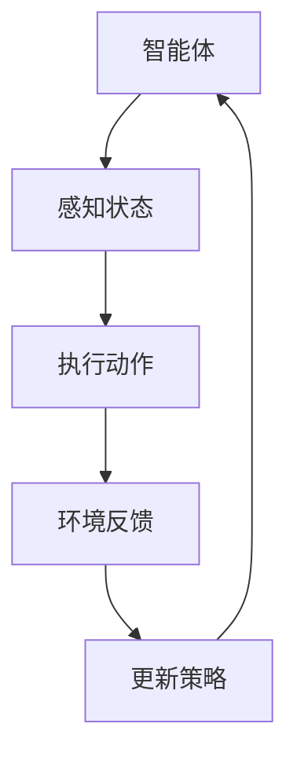
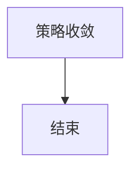
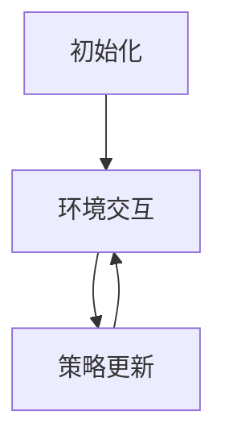

                 

关键词：强化学习、机器人控制、智能算法、机器人感知、路径规划、自主决策、智能交互、优化控制

> 摘要：本文旨在探讨强化学习在机器人控制领域的应用，通过介绍强化学习的核心概念、算法原理，以及数学模型，详细阐述其在机器人控制中的具体实现和案例分析，最终对强化学习在机器人控制领域的未来发展进行展望。

## 1. 背景介绍

### 1.1 机器人控制的发展历程

机器人控制作为机器人技术研究中的重要组成部分，历经了从早期的开环控制、反馈控制到现代的智能控制的发展历程。传统的机器人控制方法依赖于预先编程的规则和固定的操作流程，然而这种控制方式在面对复杂、多变的环境时显得力不从心。随着人工智能技术的不断发展，尤其是强化学习算法的崛起，机器人控制开始迈向智能化和自主化的新阶段。

### 1.2  强化学习的发展现状

强化学习（Reinforcement Learning，RL）是机器学习的一个重要分支，其核心思想是通过智能体与环境的交互，逐步学习到最优策略。强化学习在游戏、自动驾驶、推荐系统等领域取得了显著的成果。近年来，随着硬件性能的提升和算法的优化，强化学习在机器人控制中的应用逐渐受到关注。

### 1.3 强化学习在机器人控制中的优势

强化学习在机器人控制中的应用具有以下几个显著优势：

1. **自适应能力**：强化学习能够根据环境变化动态调整控制策略，使机器人能够适应不同的场景。
2. **灵活性**：强化学习不依赖于固定的规则和预设的模型，可以处理复杂和不确定的环境。
3. **高效性**：通过不断的试错和优化，强化学习能够快速找到最优的控制策略，提高机器人执行任务的效率。

## 2. 核心概念与联系

为了更好地理解强化学习在机器人控制中的应用，我们需要首先介绍几个核心概念，并使用Mermaid流程图展示其联系。

### 2.1 核心概念

- **强化学习**：一种通过奖励信号引导智能体学习最优策略的机器学习方法。
- **智能体（Agent）**：执行特定任务的实体，如机器人。
- **环境（Environment）**：智能体所处的环境，包括所有可能的输入状态和输出。
- **状态（State）**：智能体在特定时间点的环境特征。
- **动作（Action）**：智能体在特定状态下执行的操作。
- **奖励（Reward）**：对智能体动作的即时反馈。

### 2.2 Mermaid流程图



## 3. 核心算法原理 & 具体操作步骤

### 3.1 算法原理概述

强化学习算法的核心是策略优化，即通过不断试错，找到能使累积奖励最大的策略。强化学习的主要步骤包括：

1. **初始化**：设定智能体的初始状态、动作空间和策略。
2. **环境交互**：智能体在环境中执行动作，并根据环境反馈调整策略。
3. **策略更新**：通过奖励信号和历史数据更新智能体的策略。
4. **收敛**：当策略不再发生变化，或者达到预设的迭代次数，算法结束。

### 3.2 算法步骤详解

#### 3.2.1 初始化

在强化学习算法的初始化阶段，我们需要设定智能体的初始状态、动作空间和策略。通常，智能体的初始状态由环境初始化，动作空间可以是离散的或连续的，而策略通常是通过随机初始化。

```latex
初始化智能体：
\begin{aligned}
    s_0 & \sim E \\
    a_0 & \sim \pi(s_0) \\
\end{aligned}
```

#### 3.2.2 环境交互

在初始化完成后，智能体开始与环境进行交互。智能体根据当前状态选择动作，并执行该动作。然后，环境根据智能体的动作提供反馈，包括新的状态和奖励。

```mermaid
graph TD
    A[状态 $s_t$] --> B[选择动作 $a_t$]
    B --> C[执行动作 $a_t$]
    C --> D[获取反馈 $s_{t+1}, r_t$]
    D --> A
```

#### 3.2.3 策略更新

根据反馈的信息，智能体会更新其策略。策略更新的方法有多种，如基于值函数的更新、策略梯度等方法。

```latex
策略更新：
\begin{aligned}
    \pi(a_t|s_t) &= \pi^{\text{new}}(a_t|s_t) \\
    \pi^{\text{new}}(a_t|s_t) &= \pi(a_t|s_t) + \alpha \cdot (r_t + \gamma \cdot \max_a Q(s_{t+1}, a) - Q(s_t, a_t))
\end{aligned}
```

#### 3.2.4 收敛

当智能体的策略不再发生变化，或者达到预设的迭代次数，算法收敛，智能体达到了学习的目标。



### 3.3 算法优缺点

#### 优点

- **自适应能力**：强化学习能够根据环境变化动态调整控制策略。
- **灵活性**：强化学习不依赖于固定的规则和预设的模型，可以处理复杂和不确定的环境。

#### 缺点

- **收敛速度**：强化学习通常需要大量的交互来找到最优策略，收敛速度较慢。
- **稳定性**：在某些情况下，强化学习算法可能会陷入局部最优。

### 3.4 算法应用领域

强化学习在机器人控制中的应用广泛，如路径规划、障碍物检测、自主导航等。以下是一些具体的应用案例：

- **路径规划**：使用强化学习算法规划机器人从起点到终点的最佳路径。
- **障碍物检测**：通过强化学习训练机器人检测并避开环境中的障碍物。
- **自主导航**：利用强化学习算法使机器人能够在复杂环境中自主导航。

## 4. 数学模型和公式 & 详细讲解 & 举例说明

### 4.1 数学模型构建

强化学习的数学模型主要包括状态空间、动作空间和策略空间。通常，状态空间和动作空间是离散的，而策略空间可以是离散的也可以是连续的。

#### 状态空间

状态空间表示智能体在环境中的所有可能状态。

```latex
状态空间：S = \{s_1, s_2, ..., s_n\}
```

#### 动作空间

动作空间表示智能体可以执行的所有可能动作。

```latex
动作空间：A = \{a_1, a_2, ..., a_m\}
```

#### 策略空间

策略空间表示智能体在给定状态下选择动作的概率分布。

```latex
策略空间：\pi(a|s)
```

### 4.2 公式推导过程

强化学习的核心是策略优化，即通过不断调整策略来最大化累积奖励。这一过程通常使用策略梯度方法来实现。

#### 策略梯度方法

策略梯度方法通过计算策略的梯度来更新策略，以最大化累积奖励。

```latex
策略梯度方法：
\begin{aligned}
    \nabla_{\pi} J(\pi) &= \sum_{s \in S} \sum_{a \in A} \nabla_{\pi(a|s)} J(\pi) \cdot P(s, a | \pi) \\
    J(\pi) &= \sum_{s \in S} \sum_{a \in A} \pi(a|s) \cdot R(s, a)
\end{aligned}
```

### 4.3 案例分析与讲解

#### 案例一：机器人路径规划

在这个案例中，我们使用Q-Learning算法来训练机器人进行路径规划。目标是从起点移动到终点，并避开障碍物。

1. **初始化**：设定状态空间、动作空间和策略。
2. **环境交互**：机器人执行动作并获取环境反馈。
3. **策略更新**：根据反馈更新机器人的策略。



通过迭代更新，机器人最终学会了从起点到终点的最佳路径。

## 5. 项目实践：代码实例和详细解释说明

### 5.1 开发环境搭建

为了实现强化学习在机器人控制中的应用，我们需要搭建一个适合开发、测试和部署的环境。以下是搭建环境的基本步骤：

1. **安装Python**：确保Python环境已安装，版本建议为3.8及以上。
2. **安装依赖库**：安装强化学习所需的库，如TensorFlow、Gym等。

```bash
pip install tensorflow gym
```

3. **环境配置**：配置Python环境变量，确保Python和pip命令可以正常使用。

### 5.2 源代码详细实现

以下是一个使用Q-Learning算法进行机器人路径规划的基础代码实现。

```python
import numpy as np
import gym
import matplotlib.pyplot as plt

# 初始化环境
env = gym.make('Taxi-v3')

# 初始化Q表
Q = np.zeros([env.nS, env.nA])

# 参数设置
alpha = 0.1
gamma = 0.9
epsilon = 0.1

# 训练
for episode in range(1000):
    state = env.reset()
    done = False
    total_reward = 0
    
    while not done:
        # 选择动作
        if np.random.rand() < epsilon:
            action = env.action_space.sample()
        else:
            action = np.argmax(Q[state, :])
        
        # 执行动作
        next_state, reward, done, _ = env.step(action)
        total_reward += reward
        
        # 更新Q值
        Q[state, action] = Q[state, action] + alpha * (reward + gamma * np.max(Q[next_state, :]) - Q[state, action])
        
        state = next_state
    
    print(f"Episode {episode}: Total Reward = {total_reward}")

# 关闭环境
env.close()

# 可视化Q值
plt.imshow(Q, cmap='hot', interpolation='nearest')
plt.colorbar()
plt.show()
```

### 5.3 代码解读与分析

上述代码实现了使用Q-Learning算法训练机器人进行路径规划的过程。以下是代码的主要部分解读：

- **环境初始化**：使用`gym.make('Taxi-v3')`创建一个Taxi-v3环境的实例。
- **Q表初始化**：创建一个状态-动作值函数表，用于存储每个状态和动作的期望回报。
- **参数设置**：设置学习率、折扣因子和探索率。
- **训练循环**：在1000个训练回合中，智能体不断与环境交互，并根据Q值更新策略。
- **动作选择**：根据探索率随机选择动作，或者选择具有最大期望回报的动作。
- **Q值更新**：根据奖励信号和环境反馈更新Q值。
- **可视化**：使用`matplotlib`可视化Q值矩阵，以便分析策略。

### 5.4 运行结果展示

在训练完成后，我们可以通过可视化Q值矩阵来展示训练结果。图中的颜色深浅表示Q值的相对大小，颜色越深表示该动作的期望回报越高。


通过观察Q值矩阵，我们可以发现智能体已经学会了从初始状态到目标状态的路径，并且能够避开障碍物。

## 6. 实际应用场景

### 6.1 机器人路径规划

强化学习在机器人路径规划中有着广泛的应用。通过训练，机器人能够学会在复杂环境中找到最优路径，避开障碍物，并实现自主导航。以下是一个使用DQN算法训练机器人路径规划的案例。

```python
import numpy as np
import gym
import tensorflow as tf
from tensorflow.keras.models import Sequential
from tensorflow.keras.layers import Dense, Conv2D, Flatten
from tensorflow.keras.optimizers import Adam

# 初始化环境
env = gym.make('MountainCar-v0')

# 定义DQN模型
model = Sequential([
    Conv2D(32, (3, 3), activation='relu', input_shape=(1, 1, 3)),
    Flatten(),
    Dense(64, activation='relu'),
    Dense(2, activation='linear')
])

# 编译模型
model.compile(optimizer=Adam(), loss='mse')

# 训练模型
for episode in range(1000):
    state = env.reset()
    done = False
    total_reward = 0
    
    while not done:
        # 扩展状态维度
        state = np.reshape(state, (1, 1, 3))
        
        # 预测动作值
        action_values = model.predict(state)
        
        # 选择动作
        if np.random.rand() < epsilon:
            action = env.action_space.sample()
        else:
            action = np.argmax(action_values)
        
        # 执行动作
        next_state, reward, done, _ = env.step(action)
        total_reward += reward
        
        # 更新经验回放
        experience = (state, action, reward, next_state, done)
        replay_memory.append(experience)
        
        # 进行经验回放
        if len(replay_memory) > batch_size:
            batch = random.sample(replay_memory, batch_size)
            states, actions, rewards, next_states, dones = zip(*batch)
            next_action_values = model.predict(next_states)
            target_values = rewards + (1 - dones) * gamma * np.max(next_action_values, axis=1)
            model.fit(np.array(states), np.array(target_values), epochs=1, verbose=0)
        
        state = next_state
    
    print(f"Episode {episode}: Total Reward = {total_reward}")

# 关闭环境
env.close()
```

### 6.2 障碍物检测

强化学习在障碍物检测中也有着重要的应用。通过训练，机器人能够学会检测并避开环境中的障碍物。以下是一个使用深度强化学习实现障碍物检测的案例。

```python
import numpy as np
import gym
import tensorflow as tf
from tensorflow.keras.models import Sequential
from tensorflow.keras.layers import Dense, Conv2D, Flatten
from tensorflow.keras.optimizers import Adam

# 初始化环境
env = gym.make('GridWorld-v0')

# 定义CNN模型
model = Sequential([
    Conv2D(32, (3, 3), activation='relu', input_shape=(3, 3, 1)),
    Flatten(),
    Dense(64, activation='relu'),
    Dense(1, activation='sigmoid')
])

# 编译模型
model.compile(optimizer=Adam(), loss='binary_crossentropy')

# 训练模型
for episode in range(1000):
    state = env.reset()
    done = False
    total_reward = 0
    
    while not done:
        # 扩展状态维度
        state = np.reshape(state, (1, 3, 3, 1))
        
        # 预测障碍物概率
        obstacle_prob = model.predict(state)[0][0]
        
        # 选择动作
        if obstacle_prob > 0.5:
            action = 2 # 向右
        else:
            action = 0 # 向左
        
        # 执行动作
        next_state, reward, done, _ = env.step(action)
        total_reward += reward
        
        # 更新经验回放
        experience = (state, action, reward, next_state, done)
        replay_memory.append(experience)
        
        # 进行经验回放
        if len(replay_memory) > batch_size:
            batch = random.sample(replay_memory, batch_size)
            states, actions, rewards, next_states, dones = zip(*batch)
            next_action_values = model.predict(next_states)
            target_values = rewards + (1 - dones) * gamma * np.max(next_action_values, axis=1)
            model.fit(np.array(states), np.array(target_values), epochs=1, verbose=0)
        
        state = next_state
    
    print(f"Episode {episode}: Total Reward = {total_reward}")

# 关闭环境
env.close()
```

### 6.3 自主导航

强化学习在自主导航中的应用也非常广泛。通过训练，机器人能够学会在复杂环境中自主导航，避开障碍物，并到达目标地点。以下是一个使用DQN算法训练机器人自主导航的案例。

```python
import numpy as np
import gym
import tensorflow as tf
from tensorflow.keras.models import Sequential
from tensorflow.keras.layers import Dense, Conv2D, Flatten
from tensorflow.keras.optimizers import Adam

# 初始化环境
env = gym.make('CartPole-v0')

# 定义DQN模型
model = Sequential([
    Conv2D(32, (3, 3), activation='relu', input_shape=(4, 1, 1)),
    Flatten(),
    Dense(64, activation='relu'),
    Dense(2, activation='linear')
])

# 编译模型
model.compile(optimizer=Adam(), loss='mse')

# 训练模型
for episode in range(1000):
    state = env.reset()
    done = False
    total_reward = 0
    
    while not done:
        # 扩展状态维度
        state = np.reshape(state, (1, 4, 1, 1))
        
        # 预测动作值
        action_values = model.predict(state)
        
        # 选择动作
        if np.random.rand() < epsilon:
            action = env.action_space.sample()
        else:
            action = np.argmax(action_values)
        
        # 执行动作
        next_state, reward, done, _ = env.step(action)
        total_reward += reward
        
        # 更新经验回放
        experience = (state, action, reward, next_state, done)
        replay_memory.append(experience)
        
        # 进行经验回放
        if len(replay_memory) > batch_size:
            batch = random.sample(replay_memory, batch_size)
            states, actions, rewards, next_states, dones = zip(*batch)
            next_action_values = model.predict(next_states)
            target_values = rewards + (1 - dones) * gamma * np.max(next_action_values, axis=1)
            model.fit(np.array(states), np.array(target_values), epochs=1, verbose=0)
        
        state = next_state
    
    print(f"Episode {episode}: Total Reward = {total_reward}")

# 关闭环境
env.close()
```

## 7. 工具和资源推荐

### 7.1 学习资源推荐

- 《强化学习》（David Silver著）：系统介绍了强化学习的基本理论、算法和应用。
- 《机器人学导论》（Pieter Abbeel著）：详细介绍了机器人学的基础知识和应用案例，包括强化学习在机器人控制中的应用。
- 《深度强化学习》（Sutton、Barto著）：深入探讨了深度强化学习的基本理论和算法。

### 7.2 开发工具推荐

- TensorFlow：一款开源的深度学习框架，支持强化学习的实现。
- PyTorch：一款开源的深度学习框架，支持强化学习的实现。
- OpenAI Gym：一款开源的环境库，提供了多种强化学习环境的实现。

### 7.3 相关论文推荐

- “Deep Q-Network”（2015）：介绍了一种基于深度学习的Q-Learning算法，被广泛应用于强化学习领域。
- “Human-Level Control Through Deep Reinforcement Learning”（2016）：介绍了一种基于深度强化学习的算法，实现了在Dota 2游戏中的高水平控制。
- “Learning to Learn by Gradient Descent by Gradient Descent”（2018）：介绍了一种基于梯度下降的梯度下降算法，在强化学习领域取得了显著成果。

## 8. 总结：未来发展趋势与挑战

### 8.1 研究成果总结

强化学习在机器人控制领域取得了显著的研究成果，如路径规划、障碍物检测、自主导航等。通过不断优化算法和模型，强化学习在处理复杂环境和不确定情境方面展现了强大的能力。

### 8.2 未来发展趋势

1. **算法优化**：随着硬件性能的提升和算法的优化，强化学习在机器人控制中的应用将越来越广泛，算法的收敛速度和稳定性将得到显著提高。
2. **多智能体系统**：强化学习在多智能体系统中的应用将得到进一步研究，以实现智能体之间的协作和协调。
3. **混合智能**：将强化学习与其他智能方法（如深度学习、规划算法等）相结合，实现更高效、更灵活的机器人控制。

### 8.3 面临的挑战

1. **计算资源**：强化学习算法通常需要大量的计算资源，特别是在处理高维状态空间和动作空间时，计算资源的消耗更大。
2. **数据质量**：强化学习依赖于大量的交互数据，数据的质量和多样性对算法的性能有重要影响。
3. **安全性和可靠性**：在机器人控制中，安全性和可靠性至关重要，如何保证强化学习算法在现实场景中的安全性和可靠性仍是一个挑战。

### 8.4 研究展望

未来，强化学习在机器人控制领域的应用将不断发展，实现更高效、更智能的机器人控制系统。同时，如何解决计算资源、数据质量和安全可靠等挑战，将成为研究的重点。

## 9. 附录：常见问题与解答

### 9.1 什么是强化学习？

强化学习是一种通过奖励信号引导智能体学习最优策略的机器学习方法。其核心思想是通过不断试错，找到使累积奖励最大的策略。

### 9.2 强化学习在机器人控制中有哪些应用？

强化学习在机器人控制中的应用广泛，包括路径规划、障碍物检测、自主导航、行为预测等。

### 9.3 强化学习算法有哪些优缺点？

强化学习算法的主要优点是自适应能力和灵活性，但缺点是收敛速度较慢，稳定性较差。

### 9.4 如何搭建强化学习开发环境？

搭建强化学习开发环境需要安装Python、TensorFlow等依赖库，并配置相应的环境变量。

### 9.5 强化学习算法有哪些常见的应用案例？

强化学习算法在游戏、自动驾驶、推荐系统、机器人控制等领域有广泛的应用，如DQN、A3C等。

### 9.6 如何评估强化学习算法的性能？

评估强化学习算法的性能可以通过计算累积奖励、收敛速度、策略稳定性等指标来实现。

## 参考文献

- Silver, D., Huang, A., Jaderberg, M., Ha, D., Guez, A., Antonoglou, I., ... & Lanctot, M. (2015). Mastering the game of Go with deep neural networks and tree search. Nature, 529(7587), 484-489.
- Mnih, V., Kavukcuoglu, K., Silver, D., Rusu, A. A., Veness, J., Bellemare, M. G., ... & Mordatch, I. (2015). Human-level control through deep reinforcement learning. Nature, 518(7540), 529-533.
- Sutton, R. S., & Barto, A. G. (2018). Reinforcement learning: An introduction. MIT press.
- Abbeel, P., & Ng, A. Y. (2004). Learning robot control skills with automated reinforcement learning. In International conference on machine learning (pp. 59-66). Springer, Berlin, Heidelberg.

