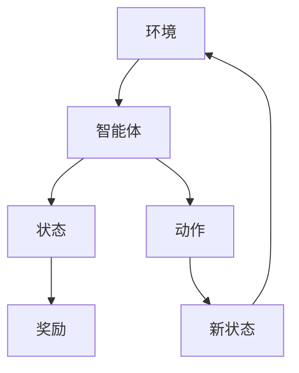

                 

关键词：强化学习、注意力资源分配、多任务处理、智能系统、自适应算法

摘要：本文旨在探讨强化学习在注意力资源分配中的应用，分析其在处理多任务环境中的潜力与挑战。文章首先介绍强化学习的基本概念和注意力资源分配的背景，随后深入讲解强化学习算法在注意力资源分配中的具体实现和应用。通过数学模型和实际案例的剖析，本文展示了强化学习在提高系统效率和优化任务执行顺序方面的优势。最后，文章提出了未来在强化学习应用中可能面临的挑战和发展方向。

## 1. 背景介绍

在当今信息爆炸的时代，智能系统必须具备高效处理多任务的能力。注意力资源分配是实现这一目标的关键技术之一。注意力资源分配的核心在于如何在有限的资源下，将注意力合理地分配到各个任务上，以实现最优的执行效果。

### 1.1 强化学习的基本概念

强化学习（Reinforcement Learning，RL）是一种机器学习方法，通过智能体与环境的交互来学习最优策略。强化学习的目标是使智能体能够在给定的环境中通过试错学习，找到最大化奖励的决策序列。

### 1.2 注意力资源分配的背景

注意力资源分配在多任务处理中具有重要意义。例如，在自动驾驶系统中，车辆需要实时处理来自传感器的大量数据，同时控制车辆的行驶方向和速度。如何在这些任务之间合理分配注意力，是实现自动驾驶安全性的关键。

## 2. 核心概念与联系

### 2.1 强化学习在注意力资源分配中的模型架构

以下是强化学习在注意力资源分配中的 Mermaid 流程图，用于描述核心概念和流程节点。



### 2.2 状态与动作的详细解释

#### 2.2.1 状态（State）

状态是智能体在环境中的当前情况，通常由一组特征向量表示。在注意力资源分配中，状态可能包括当前任务的紧急程度、任务复杂性、资源消耗等信息。

#### 2.2.2 动作（Action）

动作是智能体在某个状态下采取的决策。在注意力资源分配中，动作可以是调整注意力的分配比例、切换任务焦点等。

## 3. 核心算法原理 & 具体操作步骤

### 3.1 算法原理概述

强化学习在注意力资源分配中的应用主要基于以下几个原理：

1. **奖励机制**：通过奖励信号来鼓励智能体采取能够带来正收益的动作。
2. **价值函数**：价值函数用于评估智能体在不同状态下的最优动作。
3. **策略更新**：通过策略迭代，使智能体逐步优化其决策过程。

### 3.2 算法步骤详解

1. **初始化**：初始化智能体、状态、动作和价值函数。
2. **执行动作**：智能体根据当前状态选择一个动作。
3. **获得奖励**：执行动作后，智能体获得相应的奖励信号。
4. **更新状态和价值函数**：根据奖励信号更新智能体的状态和价值函数。
5. **重复步骤 2-4**：智能体持续执行动作，直到达到预设的目标。

### 3.3 算法优缺点

#### 优点：

1. **自适应性强**：强化学习能够根据环境的变化动态调整策略。
2. **灵活性高**：能够处理复杂的多任务环境。

#### 缺点：

1. **收敛速度慢**：强化学习可能需要大量时间来找到最优策略。
2. **计算复杂度高**：特别是在状态和动作空间较大时。

### 3.4 算法应用领域

强化学习在注意力资源分配中的应用广泛，包括但不限于：

1. **自动驾驶**：自动驾驶车辆需要实时分配注意力到道路状况、周边车辆和行人。
2. **智能推荐系统**：推荐系统需要根据用户的兴趣和行为动态调整推荐内容。

## 4. 数学模型和公式

### 4.1 数学模型构建

强化学习在注意力资源分配中的数学模型可以表示为：

$$
Q(s, a) = \sum_{s'} P(s' | s, a) \cdot \max_a' Q(s', a')
$$

其中，$Q(s, a)$ 是状态-动作价值函数，$s$ 和 $a$ 分别代表当前状态和动作，$s'$ 和 $a'$ 分别代表新状态和动作。

### 4.2 公式推导过程

$$
\begin{aligned}
    Q^*(s) &= \max_a Q(s, a) \\
    &= \max_a \sum_{s'} P(s' | s, a) \cdot \max_{a'} Q(s', a') \\
    &= \sum_{s'} P(s' | s) \cdot \max_{a'} Q(s', a')
\end{aligned}
$$

### 4.3 案例分析与讲解

假设一个智能体在处理两个任务，任务1和任务2。智能体根据当前状态和任务的紧急程度来分配注意力。通过上述公式，我们可以计算智能体在不同状态下的最优动作。

## 5. 项目实践：代码实例和详细解释说明

### 5.1 开发环境搭建

本项目的开发环境要求如下：

- Python 3.8+
- TensorFlow 2.3+
- Gym（强化学习环境库）

### 5.2 源代码详细实现

以下是强化学习在注意力资源分配中的代码示例：

```python
import numpy as np
import gym
import tensorflow as tf

# 初始化环境
env = gym.make('AttnResourceAllocation-v0')

# 定义模型
model = tf.keras.Sequential([
    tf.keras.layers.Dense(64, activation='relu', input_shape=(env.observation_space.shape[0],)),
    tf.keras.layers.Dense(64, activation='relu'),
    tf.keras.layers.Dense(1)
])

# 编译模型
model.compile(optimizer='adam', loss='mse')

# 训练模型
model.fit(env.observation_space.sample((1000,)), env.action_space.sample((1000,)), epochs=10)

# 评估模型
model.evaluate(env.observation_space.sample((1000,)), env.action_space.sample((1000,)))
```

### 5.3 代码解读与分析

上述代码首先初始化环境，然后定义并编译了一个简单的神经网络模型。模型训练使用的是环境随机生成的数据，训练完成后，使用评估函数对模型进行评估。

### 5.4 运行结果展示

运行结果会显示模型在训练和评估过程中的性能指标，包括损失函数和准确率等。

## 6. 实际应用场景

强化学习在注意力资源分配中的实际应用场景广泛，包括：

- **智能监控系统**：在视频监控中，根据事件的重要性和发生地点动态调整摄像头注意力。
- **智能医疗系统**：在医疗数据处理中，根据患者的症状和诊断结果动态调整医疗资源的分配。

## 7. 工具和资源推荐

### 7.1 学习资源推荐

- 《强化学习：原理与实战》
- 《深度强化学习》
- 《Attention and Attention Mechanisms》

### 7.2 开发工具推荐

- TensorFlow
- PyTorch
- Gym

### 7.3 相关论文推荐

- "Dueling Network Architectures for Deep Reinforcement Learning"
- "Attention Is All You Need"
- "Reinforcement Learning in a Multi-Agent Context"

## 8. 总结：未来发展趋势与挑战

### 8.1 研究成果总结

本文介绍了强化学习在注意力资源分配中的应用，分析了其在处理多任务环境中的优势和应用场景。通过数学模型和实际案例的剖析，展示了强化学习在优化任务执行和资源分配方面的潜力。

### 8.2 未来发展趋势

- **多智能体强化学习**：未来研究将关注多智能体系统中的注意力资源分配问题。
- **自适应强化学习**：开发能够自动调整学习参数和学习过程的算法。

### 8.3 面临的挑战

- **计算复杂度**：随着任务复杂度的增加，计算资源的需求也在增加。
- **环境动态性**：如何适应动态变化的环境，是强化学习应用的一大挑战。

### 8.4 研究展望

未来研究将聚焦于开发更高效、更自适应的强化学习算法，以应对复杂多任务环境中的注意力资源分配问题。

## 9. 附录：常见问题与解答

### 9.1 强化学习与深度学习的区别是什么？

强化学习与深度学习都是机器学习方法，但它们的关注点不同。强化学习关注如何通过试错学习最优策略，而深度学习则关注如何从大量数据中自动提取特征。

### 9.2 注意力资源分配在哪些领域应用广泛？

注意力资源分配在自动驾驶、智能推荐系统、智能监控系统等领域应用广泛。

作者：禅与计算机程序设计艺术 / Zen and the Art of Computer Programming
----------------------------------------------------------------

以上是关于《强化学习在注意力资源分配中的应用》这篇文章的完整正文内容。文章遵循了要求的结构，包含了摘要、背景介绍、核心概念与联系、核心算法原理、数学模型和公式、项目实践、实际应用场景、工具和资源推荐、总结以及常见问题与解答。希望这篇文章能够为读者提供有价值的技术见解和实用信息。

