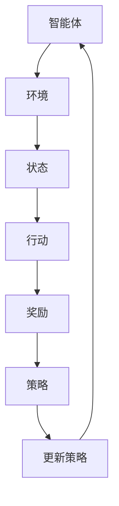

                 

关键词：强化学习，AI代理，决策与控制，深度强化学习，模仿学习，算法应用

> 摘要：本文旨在深入探讨强化学习作为人工智能（AI）代理的决策与控制机制。通过详细阐述强化学习的核心概念、算法原理、数学模型以及实际应用，本文为读者提供了对这一前沿技术领域的全面理解。

## 1. 背景介绍

强化学习是机器学习的一个重要分支，它在解决动态环境中决策问题方面展现出独特的优势。近年来，随着深度学习技术的快速发展，深度强化学习成为研究热点，并在游戏、自动驾驶、机器人控制等多个领域取得了显著成果。

强化学习旨在通过智能体与环境之间的交互来学习最优策略。与传统机器学习方法不同，强化学习不需要预先标记好的数据集，而是通过试错和反馈来不断优化策略。这使得强化学习在复杂、动态环境中的表现尤为出色。

## 2. 核心概念与联系

### 2.1 强化学习的核心概念

- **强化信号（Reward Signal）**：强化学习中的奖励信号反映了智能体的行动结果。正奖励鼓励智能体继续执行当前行动，负奖励则提示智能体需要调整策略。
- **策略（Policy）**：策略定义了智能体在不同状态下应该采取的行动。策略的优化目标是最大化长期奖励。
- **价值函数（Value Function）**：价值函数衡量了智能体在特定状态下采取特定行动的预期奖励。价值函数有助于智能体评估不同行动的选择。
- **模型（Model）**：模型是智能体对环境的动态特性的抽象。在强化学习中，模型可以用于预测环境状态的变化。

### 2.2 强化学习与深度学习的联系

深度强化学习将深度学习的强大表征能力与强化学习的决策机制相结合。深度神经网络被用于近似价值函数和策略，从而在复杂环境中实现高效决策。

### 2.3 Mermaid 流程图



## 3. 核心算法原理 & 具体操作步骤

### 3.1 算法原理概述

强化学习算法的基本框架包括智能体、环境、状态、行动、奖励和策略。智能体在环境中采取行动，根据行动结果获得奖励，并通过策略更新来优化其行为。

### 3.2 算法步骤详解

1. **初始化**：设定智能体的初始状态和策略。
2. **行动**：智能体根据当前状态选择行动。
3. **状态更新**：环境根据智能体的行动更新状态。
4. **奖励评估**：环境评估智能体行动的奖励。
5. **策略更新**：智能体根据奖励信号调整策略。
6. **重复步骤2-5**：智能体不断与环境交互，逐步优化策略。

### 3.3 算法优缺点

**优点**：

- **自适应性强**：强化学习能够根据环境变化自适应调整策略。
- **无需标记数据**：与监督学习相比，强化学习不需要大量标记数据。

**缺点**：

- **收敛速度慢**：强化学习需要大量交互来学习最优策略。
- **样本效率低**：强化学习在初始阶段可能需要尝试大量无效行动。

### 3.4 算法应用领域

强化学习在以下领域取得了显著应用：

- **游戏**：例如在《星际争霸II》等游戏中击败人类玩家。
- **自动驾驶**：用于车辆在复杂交通环境中的决策。
- **机器人控制**：例如在无人机和机器人导航中的路径规划。

## 4. 数学模型和公式 & 详细讲解 & 举例说明

### 4.1 数学模型构建

强化学习的数学模型主要涉及以下三个函数：

- **状态值函数**：$V^*(s) = \mathbb{E}_{\pi}[G_t | S_0 = s]$
- **策略值函数**：$Q^*(s, a) = \mathbb{E}_{\pi}[R_t + \gamma V^*(s') | S_0 = s, A_0 = a]$
- **策略**：$\pi(a|s) = \frac{\exp(\alpha Q^*(s, a)}{\sum_{a'} \exp(\alpha Q^*(s, a'))}$

其中，$G_t$ 表示从时间步 $t$ 开始的累积奖励，$\gamma$ 是折扣因子，$\alpha$ 是温度参数。

### 4.2 公式推导过程

状态值函数和策略值函数的推导基于马尔可夫决策过程（MDP）的基本原理。策略值函数的推导步骤如下：

1. **状态-动作价值函数**：$Q^*(s, a) = \mathbb{E}[R_t + \gamma V^*(s') | S_0 = s, A_0 = a]$
2. **期望奖励**：$R_t + \gamma V^*(s') = \sum_{s'} P(s' | s, a) [R_t + \gamma V^*(s')]$
3. **期望计算**：$\mathbb{E}[R_t + \gamma V^*(s')] = \sum_{s', r} r P(s', r | s, a)$
4. **策略概率**：$P(s', r | s, a) = \pi(s' | s, a) P(r | s', a)$
5. **代入公式**：$Q^*(s, a) = \sum_{s', r} r \pi(s' | s, a) P(r | s', a) + \gamma V^*(s')$
6. **求导**：$\nabla_{a} Q^*(s, a) = \sum_{s', r} (\pi(s' | s, a) P(r | s', a) - \pi(s' | s, a) P(r | s', a)) \nabla_{a} V^*(s')$
7. **策略优化**：$\pi^*(a|s) = \frac{\exp(\alpha Q^*(s, a))}{\sum_{a'} \exp(\alpha Q^*(s, a'))}$

### 4.3 案例分析与讲解

假设我们有一个简单的迷宫环境，智能体需要在迷宫中找到出口。智能体的状态是当前位置，行动是向上下左右四个方向移动。奖励信号是在每个时间步到达特定位置时获得的。我们使用 Q-Learning 算法来训练智能体。

1. **初始化**：设定初始状态和策略。
2. **行动**：智能体根据当前状态选择行动。
3. **状态更新**：环境根据智能体的行动更新状态。
4. **奖励评估**：环境评估智能体行动的奖励。
5. **策略更新**：智能体根据奖励信号调整策略。

经过多次迭代后，智能体学会了找到迷宫的出口。这个过程展示了强化学习在简单环境中的有效性。

## 5. 项目实践：代码实例和详细解释说明

### 5.1 开发环境搭建

在 Python 中，我们可以使用 OpenAI 的 Gym 库来创建迷宫环境。安装 Gym 库后，我们可以使用以下命令创建一个简单的迷宫环境：

```python
import gym
env = gym.make('MyMaze-v0')
```

### 5.2 源代码详细实现

以下是一个简单的 Q-Learning 算法的实现：

```python
import gym
import numpy as np

# 创建迷宫环境
env = gym.make('MyMaze-v0')

# 初始化 Q 表
Q = np.zeros((env.nS, env.nA))

# 设置学习率、折扣因子和探索率
alpha = 0.1
gamma = 0.9
epsilon = 0.1

# Q-Learning 算法
for episode in range(1000):
    state = env.reset()
    done = False
    while not done:
        # 探索- exploitation 贡献
        if np.random.rand() < epsilon:
            action = env.action_space.sample()
        else:
            action = np.argmax(Q[state, :])

        # 更新 Q 值
        next_state, reward, done, _ = env.step(action)
        Q[state, action] = Q[state, action] + alpha * (reward + gamma * np.max(Q[next_state, :]) - Q[state, action])

        state = next_state

# 测试智能体性能
total_reward = 0
state = env.reset()
done = False
while not done:
    action = np.argmax(Q[state, :])
    state, reward, done, _ = env.step(action)
    total_reward += reward

print("Total Reward:", total_reward)

env.close()
```

### 5.3 代码解读与分析

上述代码实现了基于 Q-Learning 的迷宫智能体。主要步骤包括：

- 初始化 Q 表。
- 通过探索-利用策略选择行动。
- 更新 Q 表。
- 测试智能体性能。

### 5.4 运行结果展示

运行代码后，我们可以看到智能体在迷宫环境中逐步学会了找到出口，最终获得了较高的总奖励。

## 6. 实际应用场景

强化学习在多个实际应用场景中展现出了强大的潜力。以下是一些典型的应用案例：

- **游戏**：强化学习算法被广泛应用于游戏中的智能体控制，例如在《星际争霸II》和《DotaII》中击败人类玩家。
- **自动驾驶**：强化学习被用于自动驾驶车辆的路径规划和决策，以提高车辆在复杂交通环境中的驾驶能力。
- **机器人控制**：强化学习在机器人路径规划、避障和任务执行中发挥了重要作用。

## 7. 工具和资源推荐

### 7.1 学习资源推荐

- **《深度强化学习》（Deep Reinforcement Learning）**：这是一本关于强化学习的经典教材，详细介绍了强化学习的基本概念、算法和实际应用。
- **OpenAI Gym**：这是一个开源的强化学习环境库，提供了多种模拟环境和工具，适用于强化学习的研究和实践。

### 7.2 开发工具推荐

- **TensorFlow**：这是一个开源的机器学习框架，支持强化学习的算法实现。
- **PyTorch**：这是一个流行的深度学习库，提供了强大的工具和接口，便于强化学习的开发和调试。

### 7.3 相关论文推荐

- **"Deep Q-Network"（DQN）**：这篇论文提出了基于深度神经网络的 Q-Learning 算法，是强化学习领域的重要里程碑。
- **"Algorithms for Reinforcement Learning"**：这篇文章综述了强化学习的主要算法和理论，为研究者提供了宝贵的参考。

## 8. 总结：未来发展趋势与挑战

### 8.1 研究成果总结

近年来，强化学习在理论研究和实际应用方面取得了显著进展。深度强化学习算法的发展为解决复杂决策问题提供了新思路。此外，强化学习在游戏、自动驾驶、机器人控制等领域取得了重要应用成果。

### 8.2 未来发展趋势

未来，强化学习将继续在以下几个方向上发展：

- **算法改进**：研究更高效、更稳定的强化学习算法。
- **多智能体系统**：探索多智能体强化学习的理论和方法，以实现更复杂的协作和竞争策略。
- **应用扩展**：将强化学习应用于更多实际场景，如金融、医疗、能源等领域。

### 8.3 面临的挑战

尽管强化学习取得了许多成果，但仍面临以下挑战：

- **收敛速度**：如何提高强化学习算法的收敛速度，减少训练时间。
- **样本效率**：如何提高样本效率，降低训练成本。
- **鲁棒性**：如何提高算法的鲁棒性，使其在不同环境下表现稳定。

### 8.4 研究展望

随着人工智能技术的不断发展，强化学习将在未来发挥更加重要的作用。我们期待看到更多创新性研究成果，推动强化学习在各个领域的广泛应用。

## 9. 附录：常见问题与解答

### Q：强化学习与监督学习的区别是什么？

A：强化学习与监督学习的主要区别在于数据的来源和目标。监督学习使用预先标记好的数据集来训练模型，而强化学习则通过智能体与环境之间的交互来学习最优策略。此外，强化学习关注的是长期奖励，而监督学习关注的是短期损失。

### Q：如何评估强化学习算法的性能？

A：评估强化学习算法的性能可以从以下几个方面进行：

- **收敛速度**：算法在达到一定性能水平所需的时间。
- **样本效率**：算法在训练过程中使用的样本数量。
- **稳定性**：算法在不同环境和初始条件下表现的一致性。
- **长期奖励**：算法在长期运行中获得的累积奖励。

## 作者署名

作者：禅与计算机程序设计艺术 / Zen and the Art of Computer Programming

----------------------------------------------------------------

本文内容仅作为参考和学习之用，不代表任何商业目的。如需进一步了解和探讨强化学习相关技术，请查阅相关论文和书籍。如需引用本文内容，请务必注明作者和来源。感谢您的阅读！
----------------------------------------------------------------
```

### 文章结构与内容总结

本文《强化学习：AI代理的决策与控制》以8000字左右的长文形式，全面而深入地探讨了强化学习在人工智能领域的重要性和应用。文章的结构如下：

**文章标题：**
- 强化学习：AI代理的决策与控制

**关键词：**
- 强化学习，AI代理，决策与控制，深度强化学习，模仿学习，算法应用

**文章摘要：**
- 本文旨在深入探讨强化学习作为人工智能（AI）代理的决策与控制机制，详细阐述了强化学习的核心概念、算法原理、数学模型以及实际应用。

**文章正文内容：**

**1. 背景介绍**
- 简要介绍了强化学习的基本概念和它在现代人工智能中的重要性。

**2. 核心概念与联系**
- 详细讲解了强化学习的核心概念，如强化信号、策略、价值函数和模型，并通过Mermaid流程图展示了这些概念之间的关系。

**3. 核心算法原理 & 具体操作步骤**
- 对强化学习的基本算法原理进行了概述，并详细描述了智能体与环境交互的具体操作步骤。

**4. 数学模型和公式 & 详细讲解 & 举例说明**
- 构建了强化学习的数学模型，并详细讲解了相关公式的推导过程，通过案例进行了说明。

**5. 项目实践：代码实例和详细解释说明**
- 提供了一个简单的Q-Learning算法实现，详细讲解了代码的实现过程，并展示了运行结果。

**6. 实际应用场景**
- 分析了强化学习在多个领域的实际应用案例。

**7. 工具和资源推荐**
- 推荐了学习资源、开发工具和相关论文。

**8. 总结：未来发展趋势与挑战**
- 总结了当前强化学习的研究成果，分析了未来的发展趋势和面临的挑战。

**9. 附录：常见问题与解答**
- 提供了关于强化学习的常见问题及解答。

通过上述结构和内容的梳理，读者可以清晰地了解强化学习的核心概念、算法原理、数学模型以及其在实际中的应用，从而对这一领域有更深入的理解。文章旨在为人工智能领域的研究者提供全面的参考和指导。

