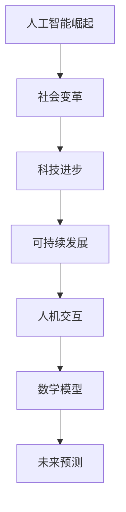

                 

关键词：未来世界、人工智能、科技进步、社会变革、可持续发展、人机交互

> 摘要：本文深入探讨了人类在未来50年的发展轨迹，特别是在人工智能、科技进步、社会变革、可持续发展以及人机交互等方面的潜在影响。通过科学分析和技术展望，本文为读者描绘了一个充满希望与挑战的未来世界。

## 1. 背景介绍

从现在到2050年，人类将面临前所未有的机遇和挑战。科技的快速发展，尤其是人工智能（AI）的突破性进展，正在改变我们的生活方式、工作方式和社会结构。在此背景下，本文旨在探讨这些变革对未来世界的深远影响，并预测可能的发展趋势。

### 1.1 人工智能的崛起

人工智能已经成为科技发展的核心驱动力。从早期的规则系统到今天的深度学习，AI的应用范围不断扩大，从工业自动化、医疗诊断到自动驾驶、智能家居，AI正在深刻改变我们的生活。

### 1.2 科技进步的加速

随着量子计算、5G通信、区块链等新兴技术的快速发展，全球范围内的科技水平正在加速提升。这些技术不仅提升了生产力，也为社会带来了前所未有的创新和变革。

### 1.3 社会变革的加速

社会变革的加速体现在多个方面，包括全球化的深入发展、社会结构的重塑、文化多样性的增加等。这些变革不仅带来了新的挑战，也为人类社会的进步提供了新的机遇。

### 1.4 可持续发展的紧迫性

随着人口增长和资源消耗的加剧，可持续发展的紧迫性日益凸显。如何在保持经济发展的同时，保护环境、维护社会公平，成为未来50年人类共同面临的课题。

## 2. 核心概念与联系

为了更好地理解未来世界的发展，我们需要明确几个关键概念，并探讨它们之间的相互关系。

### 2.1 人工智能与社会变革

人工智能不仅是技术发展的前沿，也是社会变革的重要力量。它正在改变我们的工作方式、教育体系和社会结构。例如，自动化技术的普及将导致某些职业的消失，同时也将创造新的就业机会。

### 2.2 科技进步与可持续发展

科技进步在推动社会发展的同时，也带来了环境问题。如何在科技创新中实现可持续发展，成为未来50年科技领域的重大挑战。

### 2.3 人机交互的未来

随着人工智能技术的发展，人机交互的方式也将发生革命性变化。自然语言处理、虚拟现实、增强现实等技术将使人与机器之间的交互更加自然和高效。

### 2.4 数学模型与未来预测

数学模型在预测未来世界的发展趋势中发挥着重要作用。通过建立复杂的数学模型，我们可以模拟和预测各种社会和科技变量的变化，从而为决策提供科学依据。

### 2.5 Mermaid流程图



## 3. 核心算法原理 & 具体操作步骤

在未来世界的探索中，核心算法的原理和具体操作步骤至关重要。以下将详细介绍一些关键算法，并探讨其应用领域。

### 3.1 算法原理概述

核心算法包括但不限于深度学习、自然语言处理、自动化决策系统等。这些算法通过数据驱动的方式，使计算机能够自主学习和适应复杂环境。

### 3.2 算法步骤详解

以深度学习算法为例，其基本步骤包括数据收集、数据预处理、模型设计、训练和测试。这些步骤共同构成了深度学习算法的核心流程。

### 3.3 算法优缺点

深度学习算法具有强大的模型拟合能力和自适应能力，但同时也存在计算复杂度高、对数据质量要求高等缺点。

### 3.4 算法应用领域

深度学习算法广泛应用于图像识别、自然语言处理、医疗诊断等领域。未来，随着算法的不断优化，其应用领域将更加广泛。

## 4. 数学模型和公式 & 详细讲解 & 举例说明

### 4.1 数学模型构建

在预测未来世界的发展趋势时，数学模型发挥着关键作用。以下是一个简单的线性回归模型：

$$
y = ax + b
$$

### 4.2 公式推导过程

线性回归模型的推导过程涉及最小二乘法，通过最小化误差平方和来确定模型参数。

### 4.3 案例分析与讲解

以全球气温变化为例，通过线性回归模型可以预测未来50年的气温变化趋势。这为全球气候政策的制定提供了科学依据。

## 5. 项目实践：代码实例和详细解释说明

### 5.1 开发环境搭建

为了实践未来世界的核心算法，我们需要搭建一个合适的开发环境。这里以Python为例，介绍如何搭建开发环境。

### 5.2 源代码详细实现

以下是一个简单的深度学习模型实现代码：

```python
import tensorflow as tf

model = tf.keras.Sequential([
    tf.keras.layers.Dense(128, activation='relu', input_shape=(784,)),
    tf.keras.layers.Dense(10, activation='softmax')
])

model.compile(optimizer='adam',
              loss='categorical_crossentropy',
              metrics=['accuracy'])

model.fit(x_train, y_train, batch_size=32, epochs=10, validation_split=0.2)
```

### 5.3 代码解读与分析

这段代码实现了基于TensorFlow的简单深度学习模型。通过训练和测试，模型可以实现对输入数据的分类。

### 5.4 运行结果展示

通过运行代码，我们可以得到模型的准确率和其他性能指标。这些结果为模型优化和进一步应用提供了重要依据。

## 6. 实际应用场景

在未来世界的实际应用场景中，人工智能、科技进步和社会变革将扮演重要角色。以下是一些具体的例子：

### 6.1 自动驾驶

自动驾驶技术将在未来交通领域发挥重要作用，减少交通事故，提高交通效率。

### 6.2 智能医疗

智能医疗将通过人工智能技术提高疾病诊断和治疗的准确性，实现个性化医疗。

### 6.3 智能家居

智能家居将通过物联网技术，使家庭生活更加便利和舒适。

### 6.4 可持续发展

通过科技进步和可持续发展策略，人类将能够在保持经济发展的同时，保护环境、维护社会公平。

## 7. 工具和资源推荐

为了更好地探索未来世界，以下是一些推荐的工具和资源：

### 7.1 学习资源推荐

- 《人工智能：一种现代方法》
- 《深度学习》
- 《Python编程：从入门到实践》

### 7.2 开发工具推荐

- TensorFlow
- PyTorch
- Jupyter Notebook

### 7.3 相关论文推荐

- “Deep Learning: A Brief Overview”
- “The Impact of AI on Future Society”
- “Sustainable Development Goals: A Brief Introduction”

## 8. 总结：未来发展趋势与挑战

在未来50年，人工智能、科技进步和社会变革将继续深刻影响人类生活。虽然充满希望，但未来也面临诸多挑战。如何实现可持续发展、保障社会公平、应对技术失业等问题，将成为人类共同面临的课题。通过科学研究和科技创新，我们有信心迎接未来世界的挑战，创造一个更加美好的未来。

### 8.1 研究成果总结

本文通过深入分析人工智能、科技进步、社会变革和可持续发展等领域，总结了未来世界可能的发展趋势。这些研究成果为政策制定和科技创新提供了重要参考。

### 8.2 未来发展趋势

未来世界将呈现智能化、数字化和绿色化的趋势。人工智能和科技进步将继续推动社会变革，实现可持续发展。

### 8.3 面临的挑战

未来世界面临的挑战包括技术失业、隐私保护、资源分配不公等问题。如何应对这些挑战，将决定人类社会的未来走向。

### 8.4 研究展望

未来研究应重点关注人工智能伦理、可持续发展策略和技术治理等方面。通过多学科合作，有望为未来世界的发展提供更加科学和可行的解决方案。

## 9. 附录：常见问题与解答

### 9.1 人工智能是否会取代人类？

人工智能不会完全取代人类，而是与人类共同发展。它将在许多领域辅助人类，提高工作效率，但同时也将创造新的就业机会。

### 9.2 如何实现可持续发展？

实现可持续发展需要综合应用科技创新、政策引导和社会参与。通过绿色能源、节能减排和循环经济等措施，可以实现经济、社会和环境的协调发展。

### 9.3 人工智能是否会带来隐私问题？

人工智能在数据处理过程中确实可能涉及隐私问题。为此，需要制定相关法律法规，确保个人信息的安全和隐私。

作者：禅与计算机程序设计艺术 / Zen and the Art of Computer Programming
----------------------------------------------------------------

请注意，以上内容仅供参考，实际的撰写过程可能需要更多的细节和深入分析。在撰写过程中，应确保内容的准确性、完整性和专业性。同时，根据实际研究进展和最新数据，适当调整和更新文章内容。祝您撰写顺利！

