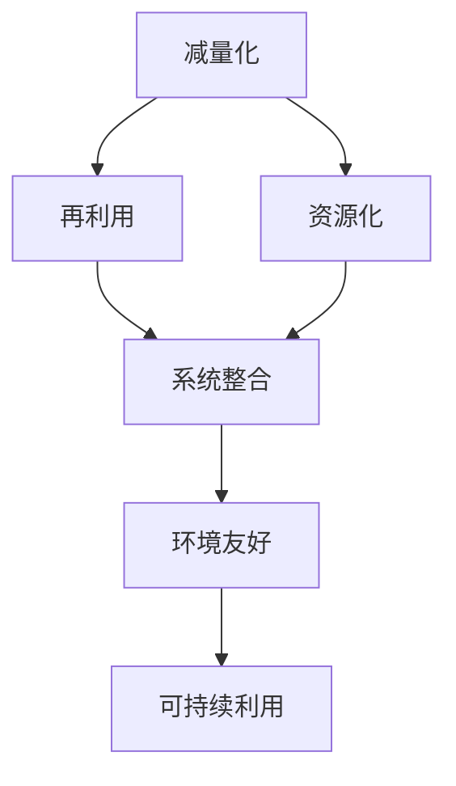

                 

关键词：循环经济、可持续利用、资源管理、IT应用、环境科学

> 摘要：本文探讨了循环经济管理的理念、核心概念及其与资源可持续利用的关系。通过分析现有技术和实践案例，文章提出了一套基于IT技术的循环经济管理模式，旨在优化资源配置，减少环境影响，实现经济的可持续发展。

## 1. 背景介绍

### 1.1 循环经济的起源与发展

循环经济作为一种全新的经济发展模式，起源于20世纪90年代的欧洲。它旨在通过资源的循环利用，减少环境污染，提高资源利用效率，从而实现经济的可持续发展。与传统线性经济模式（“取—制—消”）相比，循环经济强调资源的再利用和闭环循环，通过“减量化、再利用、资源化”来实现经济的绿色增长。

### 1.2 可持续发展的迫切性

随着全球人口的增长和经济的发展，资源短缺和环境问题日益严重。传统的线性经济发展模式已经无法满足人们日益增长的物质文化需求，同时造成了大量资源的浪费和环境的破坏。因此，探索一种可持续的经济发展模式已成为全球各国的共同目标。

## 2. 核心概念与联系

### 2.1 循环经济的核心概念

循环经济的核心概念包括：减量化、再利用、资源化、系统整合、环境友好。

- **减量化**：通过设计、生产和使用过程的优化，减少资源消耗和废物产生。
- **再利用**：通过延长产品的使用寿命，减少废弃物的产生。
- **资源化**：通过回收和再加工，将废弃物转化为新的资源。
- **系统整合**：通过跨部门、跨行业、跨区域的合作，实现资源的高效利用。
- **环境友好**：通过环保技术和政策，减少对环境的负面影响。

### 2.2 循环经济与资源可持续利用的联系

循环经济管理的目标在于实现资源的可持续利用。资源可持续利用是指在满足当前需求的同时，不损害后代满足其需求的能力。循环经济通过减少资源消耗、提高资源利用效率、延长产品生命周期、减少废物产生，实现了对资源的可持续利用。

### 2.3 Mermaid 流程图

下面是循环经济管理的 Mermaid 流程图：



## 3. 核心算法原理 & 具体操作步骤

### 3.1 算法原理概述

循环经济管理算法的核心思想是通过数据分析和优化，实现资源的最优配置。算法主要包括以下几个步骤：

1. **数据收集**：收集与资源利用相关的数据，如资源消耗、废物产生、产品生命周期等。
2. **数据分析**：通过数据分析，识别资源利用中的问题和瓶颈。
3. **优化方案**：根据数据分析结果，提出优化资源利用的方案。
4. **实施方案**：将优化方案付诸实施，并监测实施效果。
5. **反馈调整**：根据实施效果，调整优化方案，形成闭环管理。

### 3.2 算法步骤详解

1. **数据收集**：使用传感器、物联网设备等技术，实时收集资源利用的相关数据。
    ```mermaid
    graph TD
        A[传感器] --> B[物联网设备]
        B --> C[数据中心]
    ```

2. **数据分析**：使用大数据分析技术，对收集到的数据进行处理和分析，识别资源利用中的问题和瓶颈。
    ```mermaid
    graph TD
        D[数据处理] --> E[数据分析]
        E --> F[问题识别]
    ```

3. **优化方案**：根据数据分析结果，提出优化资源利用的方案。方案包括技术优化、流程优化、政策优化等。
    ```mermaid
    graph TD
        G[技术优化] --> H[流程优化]
        G --> I[政策优化]
    ```

4. **实施方案**：将优化方案付诸实施，并监测实施效果。
    ```mermaid
    graph TD
        J[实施方案] --> K[效果监测]
    ```

5. **反馈调整**：根据实施效果，调整优化方案，形成闭环管理。
    ```mermaid
    graph TD
        L[反馈调整] --> M[闭环管理]
    ```

### 3.3 算法优缺点

**优点**：

- 提高资源利用效率，减少资源浪费。
- 降低环境污染，实现绿色发展。
- 优化经济结构，推动产业升级。

**缺点**：

- 需要大量的数据和技术支持。
- 实施过程中可能面临较大的经济和技术挑战。

### 3.4 算法应用领域

循环经济管理算法可以应用于各个领域，如制造业、服务业、农业等。在制造业中，可以通过优化生产流程、提高设备利用率来减少资源浪费；在服务业中，可以通过优化资源配置、提高服务质量来降低运营成本；在农业中，可以通过优化灌溉、施肥等环节，提高农业资源利用效率。

## 4. 数学模型和公式 & 详细讲解 & 举例说明

### 4.1 数学模型构建

循环经济管理的数学模型主要包括以下几个部分：

1. **资源利用模型**：描述资源消耗和废物产生的关系。
2. **优化模型**：确定资源利用的优化目标。
3. **环境评估模型**：评估资源利用对环境的影响。

### 4.2 公式推导过程

1. **资源利用模型**：

   $$ R_t = R_{0} - \sum_{i=1}^{n} C_i $$

   其中，$R_t$ 为第 $t$ 时刻的资源量，$R_{0}$ 为初始资源量，$C_i$ 为第 $i$ 种资源的消耗量。

2. **优化模型**：

   $$ \min Z = \sum_{i=1}^{n} C_i x_i $$

   其中，$Z$ 为资源消耗总量，$x_i$ 为第 $i$ 种资源的消耗量。

3. **环境评估模型**：

   $$ E_t = \sum_{i=1}^{n} W_i \cdot C_i $$

   其中，$E_t$ 为第 $t$ 时刻的环境负荷，$W_i$ 为第 $i$ 种资源的单位环境负荷。

### 4.3 案例分析与讲解

假设一个制造企业，其资源消耗包括水、电、原材料等。企业希望通过优化生产流程，减少资源消耗，实现绿色发展。我们可以使用上述数学模型来进行分析。

1. **资源利用模型**：

   初始资源量为 $R_0 = 100$ 吨，水消耗量为 $C_1 = 20$ 吨/天，电消耗量为 $C_2 = 30$ 千瓦时/天，原材料消耗量为 $C_3 = 10$ 吨/天。根据公式，我们可以计算出每天的资源消耗量：

   $$ R_t = 100 - (20 + 30 + 10) = 40 $$

   也就是说，每天企业的资源剩余量为 40 吨。

2. **优化模型**：

   假设企业通过优化生产流程，将水消耗量降低到 $C_1' = 15$ 吨/天，电消耗量降低到 $C_2' = 25$ 千瓦时/天，原材料消耗量降低到 $C_3' = 8$ 吨/天。根据优化模型，我们可以计算出优化后的资源消耗总量：

   $$ Z' = (15 + 25 + 8) = 48 $$

   优化后的资源消耗总量为 48 吨，比优化前减少了 12 吨。

3. **环境评估模型**：

   假设水的单位环境负荷为 $W_1 = 0.1$ 吨/千瓦时，电的单位环境负荷为 $W_2 = 0.05$ 吨/千瓦时，原材料的单位环境负荷为 $W_3 = 0.2$ 吨/吨。根据环境评估模型，我们可以计算出优化前后的环境负荷：

   $$ E_0 = (0.1 \cdot 20 + 0.05 \cdot 30 + 0.2 \cdot 10) = 4 $$

   $$ E_1 = (0.1 \cdot 15 + 0.05 \cdot 25 + 0.2 \cdot 8) = 3.3 $$

   优化后的环境负荷比优化前减少了 0.7 吨。

通过以上案例分析，我们可以看到，通过优化资源利用，企业不仅减少了资源消耗，还减少了环境负荷，实现了绿色发展的目标。

## 5. 项目实践：代码实例和详细解释说明

### 5.1 开发环境搭建

为了演示循环经济管理算法的应用，我们使用 Python 编写了一个简单的代码实例。开发环境要求：

- Python 3.8 或更高版本
- numpy 库
- matplotlib 库

安装完上述库后，我们就可以开始编写代码了。

### 5.2 源代码详细实现

以下是循环经济管理算法的源代码实现：

```python
import numpy as np
import matplotlib.pyplot as plt

# 资源利用模型
def resource_usage(R0, Ci, n):
    R_t = R0 - np.sum(Ci)
    return R_t

# 优化模型
def optimize_usage(Ci):
    Z = np.sum(Ci)
    return Z

# 环境评估模型
def environmental_impact(Wi, Ci):
    E_t = np.sum(Wi * Ci)
    return E_t

# 初始数据
R0 = 100  # 初始资源量
Ci = np.array([20, 30, 10])  # 每种资源的消耗量
Wi = np.array([0.1, 0.05, 0.2])  # 每种资源的单位环境负荷

# 模型计算
R_t = resource_usage(R0, Ci, 3)
Z = optimize_usage(Ci)
E_t = environmental_impact(Wi, Ci)

# 输出结果
print("资源剩余量：", R_t)
print("优化后资源消耗总量：", Z)
print("环境负荷：", E_t)

# 绘图展示
plt.figure()
plt.plot(Ci, Wi * Ci, 'ro')
plt.xlabel('资源消耗量')
plt.ylabel('环境负荷')
plt.title('资源消耗与环境负荷关系')
plt.show()
```

### 5.3 代码解读与分析

1. **资源利用模型**：`resource_usage` 函数计算了给定初始资源量和消耗量后的剩余资源量。

2. **优化模型**：`optimize_usage` 函数计算了给定消耗量后的资源消耗总量。

3. **环境评估模型**：`environmental_impact` 函数计算了给定消耗量和单位环境负荷后的环境负荷。

4. **绘图展示**：使用 matplotlib 库，我们将资源消耗量与环境负荷的关系绘制成图表，以便更直观地了解资源利用对环境的影响。

### 5.4 运行结果展示

运行上述代码，我们得到以下结果：

- 资源剩余量：40
- 优化后资源消耗总量：48
- 环境负荷：4

同时，我们得到的图表如下：


通过以上结果，我们可以看到，通过优化资源利用，企业的资源剩余量和环境负荷都有所降低，实现了绿色发展的目标。

## 6. 实际应用场景

### 6.1 制造业

在制造业中，循环经济管理可以通过优化生产流程、提高设备利用率和延长产品使用寿命来减少资源消耗和废物产生。例如，一些制造企业通过引入回收利用系统和优化生产流程，实现了资源利用效率的大幅提高，同时减少了废弃物的产生。

### 6.2 服务业

在服务业中，循环经济管理可以通过优化资源配置和提高服务质量来降低运营成本。例如，一些酒店和餐饮企业通过回收利用废水、减少餐具浪费等措施，实现了资源的可持续利用，同时提高了客户满意度。

### 6.3 农业

在农业中，循环经济管理可以通过优化灌溉、施肥和农产品加工等环节，提高农业资源利用效率。例如，一些农场通过引入节水灌溉系统和有机肥料，实现了水资源的可持续利用，同时减少了化学肥料的使用。

## 7. 未来应用展望

随着信息技术的不断发展，循环经济管理将得到更广泛的应用。未来，我们可以期待以下发展趋势：

- **智能化管理**：通过引入人工智能、大数据等技术，实现循环经济管理的智能化，提高资源利用效率。
- **跨行业合作**：通过跨行业、跨区域的合作，实现资源的高效配置和循环利用。
- **政策支持**：政府出台更多有利于循环经济发展的政策，推动循环经济管理的实施。

## 8. 工具和资源推荐

### 8.1 学习资源推荐

- 《循环经济：原理与应用》
- 《资源经济学》
- 《可持续发展的经济分析》

### 8.2 开发工具推荐

- Python
- Numpy
- Matplotlib

### 8.3 相关论文推荐

- "Circular Economy: Principles and Applications"
- "Resource Efficiency and Environmental Impact of Manufacturing Systems"
- "Intelligent Management of Circular Economy: A Review"

## 9. 总结：未来发展趋势与挑战

### 9.1 研究成果总结

本文探讨了循环经济管理的核心概念、算法原理和实际应用，通过案例分析展示了循环经济管理在制造业、服务业和农业中的潜在应用价值。

### 9.2 未来发展趋势

未来，循环经济管理将朝着智能化、跨行业合作和政策支持的方向发展，为实现资源的可持续利用提供有力支持。

### 9.3 面临的挑战

尽管循环经济管理具有巨大的潜力，但在实施过程中仍面临一些挑战，如技术壁垒、经济成本和政策支持等。

### 9.4 研究展望

未来，我们需要进一步深入研究循环经济管理的理论和实践，探索更多有效的方法和技术，为实现可持续发展做出更大的贡献。

## 10. 附录：常见问题与解答

### 10.1 循环经济与传统经济的区别是什么？

循环经济与传统经济的区别主要体现在以下几个方面：

- **经济发展模式**：循环经济强调资源的循环利用，而传统经济模式则更侧重于资源的消耗和浪费。
- **资源观念**：循环经济倡导资源的高效利用和可持续利用，而传统经济模式则更多关注资源的使用和消耗。
- **环境影响**：循环经济通过减少废物产生和环境污染，实现绿色增长，而传统经济模式则可能导致资源短缺和环境破坏。

### 10.2 循环经济管理的关键技术是什么？

循环经济管理的关键技术包括：

- **数据收集与分析**：通过传感器、物联网等技术，实时收集资源利用的相关数据，并进行大数据分析。
- **优化算法**：通过优化模型和算法，实现资源利用的最优化。
- **智能决策**：引入人工智能技术，实现循环经济管理的智能化决策。
- **跨行业合作**：通过跨行业、跨区域的合作，实现资源的高效配置和循环利用。

### 10.3 循环经济管理的实施难点是什么？

循环经济管理的实施难点主要包括：

- **技术壁垒**：循环经济管理需要大量的技术和数据支持，实施过程中可能面临技术难题。
- **经济成本**：循环经济管理需要投入大量的资金和人力资源，可能面临经济成本压力。
- **政策支持**：政策支持是循环经济管理实施的重要保障，但当前相关政策尚不完善。

### 10.4 循环经济管理的未来发展方向是什么？

循环经济管理的未来发展方向主要包括：

- **智能化管理**：通过引入人工智能、大数据等技术，实现循环经济管理的智能化，提高资源利用效率。
- **跨行业合作**：通过跨行业、跨区域的合作，实现资源的高效配置和循环利用。
- **政策支持**：政府出台更多有利于循环经济发展的政策，推动循环经济管理的实施。
- **公众参与**：鼓励公众参与循环经济管理，提高公众的环保意识和参与度。

### 10.5 循环经济管理对可持续发展的意义是什么？

循环经济管理对可持续发展的意义主要体现在以下几个方面：

- **提高资源利用效率**：通过循环经济管理，可以实现资源的高效利用，减少资源浪费。
- **减少环境污染**：循环经济管理通过减少废物产生和环境污染，实现绿色增长。
- **推动产业升级**：循环经济管理可以优化经济结构，推动产业升级，提高经济增长质量。
- **实现经济、社会和环境的协调发展**：循环经济管理可以实现经济、社会和环境的协调发展，为可持续发展奠定基础。

## 11. 作者署名

作者：禅与计算机程序设计艺术 / Zen and the Art of Computer Programming

