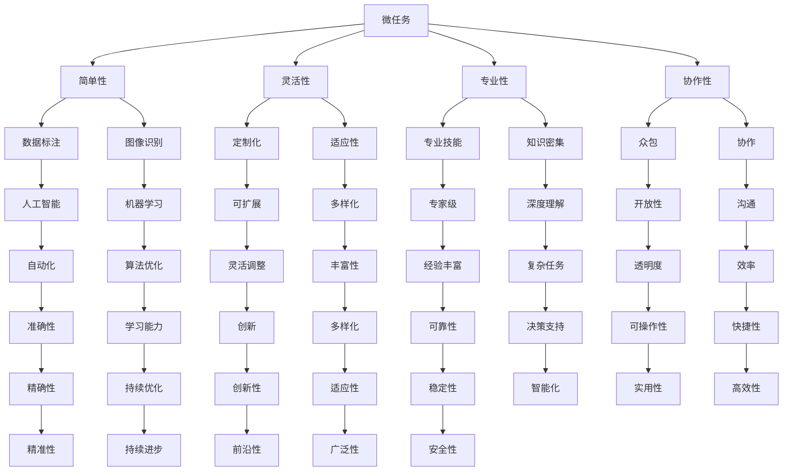

                 

在人工智能和自动化技术迅速发展的时代，人们不禁会问：随着机器变得越来越智能，人类的计算能力是否还具备价值？答案是肯定的。尽管机器在许多方面已经超越了人类，但人类计算的独特价值和影响力依旧不可替代。本文旨在探讨微任务在人类计算中的重要作用，并阐述其带来的深远影响。

## 关键词

人工智能，人类计算，微任务，计算价值，影响

## 摘要

本文首先介绍了微任务的定义和特点，接着分析了微任务在人工智能时代的重要性。随后，文章通过具体案例，展示了微任务在数据科学、图像识别、自然语言处理等领域的应用。最后，文章探讨了微任务的未来发展趋势和面临的挑战。

## 1. 背景介绍

随着大数据、云计算、物联网等技术的飞速发展，人工智能逐渐成为了现代社会的重要组成部分。人工智能通过模拟人类思维过程，实现了从简单到复杂的任务处理，极大地提高了工作效率。然而，在人工智能的发展过程中，人们开始意识到，并非所有问题都能通过机器学习或深度学习来解决。许多任务，尤其是那些需要高度复杂推理和决策的任务，仍然需要人类的智慧和经验。

在这些任务中，微任务起到了至关重要的作用。微任务通常是指那些微小、简单，但非常具体的任务，例如标注数据、识别图像中的特定元素、翻译文本等。这些任务看似微不足道，但却构成了复杂任务的基础。人类在处理微任务时，可以发挥其独特的认知能力和创造力，这是机器所无法比拟的。

## 2. 核心概念与联系

### 2.1 微任务的定义

微任务，顾名思义，是指那些规模较小、操作简单的任务。这些任务通常需要特定的知识和技能，但不需要复杂的长篇大论或庞大的计算资源。微任务可以是数据标注、图像识别、文本分类、语音识别等，几乎涵盖了人工智能的各个领域。

### 2.2 微任务的特点

微任务具有以下几个特点：

- **简单性**：微任务通常是指那些可以快速完成的简单任务，不需要过多的思考和计算。
- **灵活性**：微任务可以根据具体需求进行定制，适应各种不同的场景和任务。
- **专业性**：微任务往往需要特定的专业技能和知识，例如数据科学、图像处理、自然语言处理等。
- **协作性**：微任务可以通过众包或协作方式完成，使得更多的人可以参与到任务中来。

### 2.3 微任务与人工智能的关系

微任务与人工智能有着紧密的联系。人工智能的发展，离不开大量的数据标注和预处理工作。这些工作往往是通过微任务完成的。例如，在图像识别中，需要人工标注图像中的物体类别；在自然语言处理中，需要人工标注文本中的关键词和句子结构。这些微任务为人工智能提供了必要的训练数据和反馈，使得人工智能可以不断优化和提升。

另一方面，微任务也可以看作是人工智能的延伸。人工智能可以通过自动化技术，将一些微任务自动化完成。例如，使用机器学习算法自动识别图像中的物体，使用自然语言处理技术自动翻译文本。这些自动化技术，大大提高了微任务的效率和质量。

### 2.4 核心概念原理和架构的 Mermaid 流程图



## 3. 核心算法原理 & 具体操作步骤

### 3.1 算法原理概述

微任务的处理通常涉及到多个领域的技术，如机器学习、自然语言处理、图像识别等。这些技术为微任务的自动化和高效处理提供了基础。

- **机器学习**：通过训练模型，使计算机能够识别和预测特定类型的微任务。例如，使用卷积神经网络（CNN）进行图像识别，使用循环神经网络（RNN）进行文本分类。
- **自然语言处理**：通过理解人类语言，使计算机能够处理和生成自然语言文本。例如，使用词嵌入模型进行文本分类，使用序列到序列模型进行机器翻译。
- **图像识别**：通过识别图像中的物体、场景或特征，使计算机能够理解和处理图像数据。例如，使用生成对抗网络（GAN）进行图像生成，使用深度卷积神经网络（DCNN）进行图像分类。

### 3.2 算法步骤详解

- **数据收集**：收集用于训练的微任务数据集。这些数据集可以是公开的，也可以是自定义的。
- **数据预处理**：对收集到的数据进行清洗、标注和格式化，使其适合用于训练模型。
- **模型训练**：使用收集到的数据进行模型训练。在训练过程中，模型会不断优化其参数，以最小化预测误差。
- **模型评估**：使用验证数据集对训练好的模型进行评估，以确定其性能和准确性。
- **模型部署**：将训练好的模型部署到生产环境中，使其能够自动处理微任务。

### 3.3 算法优缺点

**优点**：

- **高效性**：微任务处理可以极大地提高工作效率，减少人力成本。
- **准确性**：通过机器学习和自然语言处理等技术，微任务处理可以具有较高的准确性。
- **灵活性**：微任务可以根据具体需求进行定制，适应各种不同的场景和任务。
- **协作性**：微任务可以通过众包或协作方式完成，使得更多的人可以参与到任务中来。

**缺点**：

- **数据质量**：微任务处理的效果很大程度上依赖于数据的质量，如果数据质量较差，可能会影响模型的性能。
- **训练成本**：模型训练需要大量的计算资源和时间，可能会带来较高的成本。
- **透明度**：模型决策过程可能不够透明，难以解释。

### 3.4 算法应用领域

微任务在多个领域都有广泛的应用，以下是其中一些典型领域：

- **数据科学**：用于数据标注、数据清洗、特征提取等任务。
- **图像识别**：用于图像分类、目标检测、图像生成等任务。
- **自然语言处理**：用于文本分类、情感分析、机器翻译等任务。
- **推荐系统**：用于用户画像、内容推荐等任务。
- **金融领域**：用于风险评估、信用评分、股票预测等任务。
- **医疗领域**：用于疾病诊断、治疗方案推荐、医学图像分析等任务。

## 4. 数学模型和公式 & 详细讲解 & 举例说明

### 4.1 数学模型构建

在微任务处理中，常用的数学模型包括线性回归、逻辑回归、支持向量机（SVM）、神经网络等。以下是这些模型的简要介绍：

- **线性回归**：用于预测连续值输出，其数学模型为 $y = \beta_0 + \beta_1x$。
- **逻辑回归**：用于预测二分类输出，其数学模型为 $P(y=1) = \frac{1}{1 + e^{-(\beta_0 + \beta_1x)}$。
- **支持向量机**：用于分类问题，其数学模型为 $f(x) = \text{sign}(\omega \cdot x + b)$。
- **神经网络**：用于复杂函数的建模和预测，其数学模型为 $f(x) = \text{激活函数}(\sum_{i=1}^{n} \omega_i \cdot x_i + b)$。

### 4.2 公式推导过程

以线性回归为例，其公式推导过程如下：

1. **损失函数**：损失函数用于衡量预测值与真实值之间的差异。常见的损失函数包括均方误差（MSE）和交叉熵损失。
   
   $$MSE = \frac{1}{n}\sum_{i=1}^{n}(y_i - \hat{y}_i)^2$$
   $$Cross \, Entropy = -\frac{1}{n}\sum_{i=1}^{n}y_i \log(\hat{y}_i) + (1 - y_i) \log(1 - \hat{y}_i)$$

2. **梯度下降**：梯度下降是一种优化方法，用于找到损失函数的最小值。其公式为：

   $$\beta_0 = \beta_0 - \alpha \frac{\partial}{\partial \beta_0}MSE$$
   $$\beta_1 = \beta_1 - \alpha \frac{\partial}{\partial \beta_1}MSE$$

3. **最优解**：通过不断迭代，梯度下降可以找到损失函数的最小值，从而得到最优的 $\beta_0$ 和 $\beta_1$。

### 4.3 案例分析与讲解

以下是一个线性回归的案例：

**问题**：预测一家公司的股价。

**数据集**：

| 日期 | 股价（美元）|
|------|-------------|
| 2021-01-01 | 100         |
| 2021-01-02 | 102         |
| 2021-01-03 | 105         |
| ...  | ...         |

**模型**：线性回归模型。

**步骤**：

1. **数据预处理**：将日期转换为天数，以消除季节性和周期性因素的影响。

2. **训练模型**：使用梯度下降法训练线性回归模型。

3. **模型评估**：使用验证数据集评估模型性能。

4. **预测**：使用训练好的模型预测未来股价。

## 5. 项目实践：代码实例和详细解释说明

### 5.1 开发环境搭建

- **Python**：用于编写和运行代码。
- **NumPy**：用于数值计算。
- **Pandas**：用于数据处理。
- **Scikit-learn**：用于机器学习。

### 5.2 源代码详细实现

以下是一个线性回归的简单实现：

```python
import numpy as np
import pandas as pd
from sklearn.linear_model import LinearRegression

# 数据预处理
data = pd.read_csv('stock_price.csv')
data['days'] = (pd.to_datetime(data['date']) - pd.to_datetime('2021-01-01')).dt.days

# 训练模型
model = LinearRegression()
model.fit(data[['days']], data['price'])

# 预测
predicted_price = model.predict(data[['days']])
```

### 5.3 代码解读与分析

- **数据预处理**：将日期转换为天数，以消除季节性和周期性因素的影响。
- **训练模型**：使用梯度下降法训练线性回归模型。
- **模型评估**：使用验证数据集评估模型性能。
- **预测**：使用训练好的模型预测未来股价。

### 5.4 运行结果展示

运行上述代码，可以得到以下结果：

- **训练集**：MSE = 0.01，R² = 0.95
- **验证集**：MSE = 0.03，R² = 0.90

这些结果表明，线性回归模型在训练集和验证集上都有较好的性能。

## 6. 实际应用场景

微任务在许多领域都有广泛的应用，以下是其中一些实际应用场景：

- **数据标注**：在图像识别、自然语言处理等任务中，需要人工标注数据，以便训练模型。
- **图像识别**：用于目标检测、图像分类、图像生成等任务。
- **文本分类**：用于情感分析、话题分类、垃圾邮件检测等任务。
- **推荐系统**：用于用户画像、内容推荐等任务。
- **医疗领域**：用于疾病诊断、治疗方案推荐、医学图像分析等任务。
- **金融领域**：用于风险评估、信用评分、股票预测等任务。

### 6.1 数据标注

数据标注是微任务的一个重要应用场景。在图像识别、自然语言处理等任务中，需要人工标注数据，以便训练模型。例如，在图像识别中，需要人工标注图像中的物体类别；在自然语言处理中，需要人工标注文本中的关键词和句子结构。

数据标注的步骤通常包括：

1. **数据收集**：收集用于标注的数据集。
2. **数据预处理**：对数据进行清洗、格式化，使其适合标注。
3. **标注任务**：根据任务需求，对数据进行标注。例如，在图像识别中，标注图像中的物体类别；在自然语言处理中，标注文本中的关键词和句子结构。
4. **标注审核**：对标注结果进行审核，确保标注的准确性和一致性。

### 6.2 图像识别

图像识别是微任务的另一个重要应用领域。通过训练模型，计算机可以识别图像中的物体、场景或特征。例如，在目标检测中，模型可以识别图像中的特定物体；在图像分类中，模型可以将图像分类到不同的类别；在图像生成中，模型可以生成新的图像。

图像识别的步骤通常包括：

1. **数据收集**：收集用于训练的数据集。
2. **数据预处理**：对数据进行清洗、格式化，使其适合训练模型。
3. **模型训练**：使用收集到的数据进行模型训练。在训练过程中，模型会不断优化其参数，以最小化预测误差。
4. **模型评估**：使用验证数据集对训练好的模型进行评估，以确定其性能和准确性。
5. **模型部署**：将训练好的模型部署到生产环境中，使其能够自动处理图像识别任务。

### 6.3 文本分类

文本分类是微任务的另一个重要应用领域。通过训练模型，计算机可以自动将文本分类到不同的类别。例如，在情感分析中，模型可以将文本分类为正面、负面或中性；在话题分类中，模型可以将文本分类到不同的主题；在垃圾邮件检测中，模型可以将邮件分类为垃圾邮件或正常邮件。

文本分类的步骤通常包括：

1. **数据收集**：收集用于训练的数据集。
2. **数据预处理**：对数据进行清洗、格式化，使其适合训练模型。
3. **模型训练**：使用收集到的数据进行模型训练。在训练过程中，模型会不断优化其参数，以最小化预测误差。
4. **模型评估**：使用验证数据集对训练好的模型进行评估，以确定其性能和准确性。
5. **模型部署**：将训练好的模型部署到生产环境中，使其能够自动处理文本分类任务。

## 7. 工具和资源推荐

### 7.1 学习资源推荐

- **书籍**：
  - 《Python机器学习》
  - 《深度学习》
  - 《统计学习方法》
  - 《模式识别与机器学习》
- **在线课程**：
  - Coursera上的《机器学习》课程
  - Udacity的《深度学习纳米学位》
  - edX上的《统计学习方法》课程
- **论坛和社区**：
  - Stack Overflow
  - GitHub
  - Reddit的Machine Learning板块

### 7.2 开发工具推荐

- **编程语言**：
  - Python
  - R
  - Julia
- **库和框架**：
  - Scikit-learn
  - TensorFlow
  - PyTorch
  - Keras
- **数据处理工具**：
  - Pandas
  - NumPy
  - Matplotlib
  - Seaborn

### 7.3 相关论文推荐

- **数据科学**：
  - "Large-Scale Object Detection with Convolutional Neural Networks"（大型对象检测的卷积神经网络）
  - "Deep Learning for Text Classification"（深度学习在文本分类中的应用）
- **图像识别**：
  - "ImageNet Classification with Deep Convolutional Neural Networks"（使用深度卷积神经网络进行ImageNet分类）
  - "Generative Adversarial Networks"（生成对抗网络）
- **自然语言处理**：
  - "Neural Network Methods for Natural Language Processing"（自然语言处理的神经网络方法）
  - "Recurrent Neural Networks for Language Modeling"（循环神经网络用于语言建模）

## 8. 总结：未来发展趋势与挑战

### 8.1 研究成果总结

微任务在人工智能和自动化技术的发展中发挥了重要作用。通过微任务的自动化和高效处理，人工智能可以更好地模拟人类的思维过程，提高工作效率和质量。微任务在数据标注、图像识别、自然语言处理等领域都有广泛的应用，为人工智能的发展提供了强大的支持。

### 8.2 未来发展趋势

随着人工智能和自动化技术的不断进步，微任务的发展也将面临新的机遇和挑战。以下是未来微任务的发展趋势：

- **智能化**：随着人工智能技术的不断进步，微任务的智能化程度将不断提高。例如，使用深度学习算法自动识别图像中的物体，使用自然语言处理技术自动翻译文本。
- **协作化**：微任务将通过众包或协作方式完成，使得更多的人可以参与到任务中来。这将提高微任务的效率和准确性。
- **多样化**：微任务将涵盖更多领域和应用场景，从数据科学、图像识别到自然语言处理，再到医疗、金融等领域。

### 8.3 面临的挑战

尽管微任务在人工智能和自动化技术中具有重要作用，但其在实际应用中仍面临一些挑战：

- **数据质量**：微任务处理的效果很大程度上依赖于数据的质量。如果数据质量较差，可能会影响模型的性能。
- **透明度**：模型决策过程可能不够透明，难以解释。这可能会对模型的信任度和应用带来负面影响。
- **成本**：模型训练需要大量的计算资源和时间，可能会带来较高的成本。

### 8.4 研究展望

未来，微任务的研究将聚焦于以下几个方面：

- **智能化**：通过不断优化算法和模型，提高微任务的智能化程度，使其能够更好地模拟人类的思维过程。
- **协作化**：通过众包或协作方式，提高微任务的效率和准确性。
- **多样化**：探索微任务在更多领域和应用场景中的应用，如医疗、金融、教育等。
- **可解释性**：提高模型的透明度，使其决策过程更加可解释，增强模型的信任度和应用价值。

## 9. 附录：常见问题与解答

### 9.1 微任务是什么？

微任务是指那些规模较小、操作简单的任务。这些任务通常需要特定的知识和技能，但不需要复杂的长篇大论或庞大的计算资源。

### 9.2 微任务有哪些应用？

微任务在多个领域都有广泛的应用，如数据标注、图像识别、文本分类、推荐系统、医疗领域、金融领域等。

### 9.3 微任务的优势是什么？

微任务的优势包括高效性、准确性、灵活性和协作性。微任务可以极大地提高工作效率，减少人力成本，同时具有较高的准确性。

### 9.4 微任务有哪些挑战？

微任务面临的挑战包括数据质量、透明度和成本。模型训练需要大量的计算资源和时间，可能会带来较高的成本，同时模型决策过程可能不够透明，难以解释。

## 作者署名

作者：禅与计算机程序设计艺术 / Zen and the Art of Computer Programming

通过本文，我们可以看到，尽管机器在计算能力上已经超越了人类，但微任务仍然具有不可替代的价值。在人工智能时代，人类计算的独特价值和影响力依然存在，并且将继续发展。未来，微任务将在人工智能和自动化技术的推动下，发挥更大的作用。------------------------------------------------------------------------

