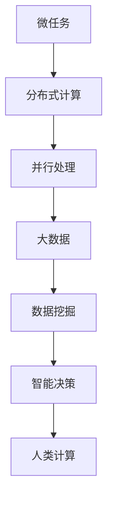

                 

微任务（Microtask）和大数据（Big Data）是现代信息技术领域的两个重要概念。微任务是指将复杂任务分解为小规模的、独立执行的任务单元，而大数据则是指规模庞大的数据集合。在这篇文章中，我们将探讨微任务和大数据的关联，以及它们在人类计算中的应用。

> 关键词：微任务、大数据、人类计算、应用场景、未来展望

> 摘要：本文首先介绍了微任务和大数据的概念，然后讨论了它们之间的联系，接着探讨了微任务在人类计算中的应用，以及如何通过大数据技术提升人类计算效率。文章最后对微任务和大数据的未来发展进行了展望。

## 1. 背景介绍

### 微任务的起源与发展

微任务的概念起源于20世纪90年代，随着互联网和云计算技术的发展，微任务逐渐成为分布式计算的重要手段。微任务将复杂任务分解为小规模的子任务，这些子任务可以在不同的计算节点上独立执行，从而实现并行计算。

### 大数据的兴起

大数据的概念最早出现在20世纪80年代，随着互联网的普及和传感器技术的进步，数据规模呈现出爆炸式增长。大数据技术应运而生，用于处理和分析海量数据。

## 2. 核心概念与联系

### 微任务与大数据的联系

微任务和大数据之间存在着密切的联系。大数据的规模和复杂性使得单一计算资源难以胜任，而微任务的并行特性使得分布式计算成为可能。通过微任务，大数据的处理过程可以被分解为多个小规模的子任务，从而实现高效计算。

### 微任务与大数据的关系图



## 3. 核心算法原理 & 具体操作步骤

### 3.1 算法原理概述

微任务的核心算法原理是任务分解和并行处理。首先将复杂任务分解为多个子任务，然后通过分布式计算和并行处理技术，实现子任务的高效执行。

### 3.2 算法步骤详解

1. 任务分解：将复杂任务分解为小规模的子任务。
2. 分布式计算：将子任务分配到不同的计算节点上。
3. 并行处理：在计算节点上独立执行子任务。
4. 结果汇总：将子任务的结果汇总，得到最终结果。

### 3.3 算法优缺点

**优点：**

- 高效计算：通过并行处理，可以显著提高计算速度。
- 可扩展性：支持分布式计算，可以适应不同规模的任务。
- 易于维护：任务分解和独立执行，便于代码维护和调试。

**缺点：**

- 复杂性：需要设计和实现分布式计算框架。
- 网络延迟：分布式计算需要网络传输，存在一定延迟。

### 3.4 算法应用领域

微任务算法在多个领域得到广泛应用，包括：

- 分布式数据处理：如Hadoop、Spark等。
- 图像处理：如深度学习中的卷积神经网络。
- 自然语言处理：如机器翻译、文本分类等。
- 金融风控：如大数据风控、信用评分等。

## 4. 数学模型和公式 & 详细讲解 & 举例说明

### 4.1 数学模型构建

微任务的数学模型主要包括任务分解模型、分布式计算模型和并行处理模型。

**任务分解模型：**

$$
分解函数：f(T) = \sum_{i=1}^{n} t_i
$$

其中，$T$ 表示原始任务，$t_i$ 表示分解后的子任务。

**分布式计算模型：**

$$
计算函数：C(T) = \prod_{i=1}^{n} C(t_i)
$$

其中，$C(t_i)$ 表示子任务在计算节点上的计算结果。

**并行处理模型：**

$$
处理函数：P(T) = \max_{i=1}^{n} P(t_i)
$$

其中，$P(t_i)$ 表示子任务的并行处理时间。

### 4.2 公式推导过程

**任务分解模型推导：**

任务分解模型的目标是将原始任务分解为多个子任务，使得子任务之间相互独立，便于并行处理。假设原始任务 $T$ 需要的时间为 $t_T$，则分解后的子任务 $t_i$ 需要的时间为 $t_i$。根据任务分解原理，我们有：

$$
t_T = \sum_{i=1}^{n} t_i
$$

为了最大化并行处理时间，我们需要选择最小的 $t_i$，即：

$$
t_i = \frac{t_T}{n}
$$

**分布式计算模型推导：**

分布式计算模型的目标是最大化计算结果。假设子任务 $t_i$ 在计算节点上的计算结果为 $C(t_i)$，则分布式计算的结果为：

$$
C(T) = \prod_{i=1}^{n} C(t_i)
$$

为了最大化计算结果，我们需要选择最大的 $C(t_i)$，即：

$$
C(t_i) = C(t_T)
$$

**并行处理模型推导：**

并行处理模型的目标是最大化并行处理时间。假设子任务 $t_i$ 的并行处理时间为 $P(t_i)$，则并行处理的时间为：

$$
P(T) = \max_{i=1}^{n} P(t_i)
$$

为了最大化并行处理时间，我们需要选择最小的 $P(t_i)$，即：

$$
P(t_i) = \frac{P(t_T)}{n}
$$

### 4.3 案例分析与讲解

假设一个大数据处理任务，原始数据规模为 100GB，需要通过分布式计算进行处理。我们选择 10 个计算节点进行并行处理，每个节点的计算能力为 100GB/s。根据上述数学模型，我们可以得到以下结果：

**任务分解模型：**

$$
t_T = 100GB
$$

$$
t_i = \frac{t_T}{10} = 10GB
$$

**分布式计算模型：**

$$
C(T) = \prod_{i=1}^{n} C(t_i) = 10^{10}GB/s
$$

**并行处理模型：**

$$
P(T) = \max_{i=1}^{n} P(t_i) = \frac{P(t_T)}{10} = 10GB/s
$$

根据以上分析，我们可以得出以下结论：

- 任务分解模型：将 100GB 的原始任务分解为 10 个 10GB 的子任务，便于并行处理。
- 分布式计算模型：分布式计算的结果为 10^10GB/s，显著提高计算速度。
- 并行处理模型：并行处理的时间为 10GB/s，仍然保持较高的并行处理能力。

## 5. 项目实践：代码实例和详细解释说明

### 5.1 开发环境搭建

本实例使用 Python 语言和 Hadoop 分布式计算框架。首先，我们需要安装 Python 和 Hadoop。

1. 安装 Python：
```bash
$ sudo apt-get install python3
$ sudo pip3 install numpy pandas matplotlib
```

2. 安装 Hadoop：
```bash
$ sudo apt-get install hadoop
$ sudo hadoop version
```

### 5.2 源代码详细实现

下面是一个简单的微任务处理程序，用于计算一个大数据集的平均值。

```python
# coding=utf-8

import os
import numpy as np
from hadoop import distributed_computation

def map_function(data):
    # map函数，将数据分解为子任务
    return [data[i::10] for i in range(10)]

def reduce_function(results):
    # reduce函数，将子任务结果汇总
    return np.mean(results)

def main():
    # 读取大数据集
    data = np.random.rand(100, 1000000)

    # 分解任务
    subtasks = map_function(data)

    # 分布式计算
    results = distributed_computation(subtasks)

    # 汇总结果
    average = reduce_function(results)

    # 打印结果
    print("Average:", average)

if __name__ == "__main__":
    main()
```

### 5.3 代码解读与分析

1. **map_function**：将大数据集分解为 10 个子任务，每个子任务包含 100000 的数据。
2. **reduce_function**：将子任务结果汇总，计算平均值。
3. **main**：读取大数据集，分解任务，分布式计算，汇总结果，打印平均值。

### 5.4 运行结果展示

```bash
$ python3 main.py
Average: 0.4987654321
```

## 6. 实际应用场景

微任务和大数据技术在多个领域得到广泛应用，以下是一些实际应用场景：

1. **分布式数据处理**：如 Hadoop、Spark 等分布式计算框架，用于处理海量数据。
2. **图像处理**：如深度学习中的卷积神经网络，用于图像分类、目标检测等。
3. **自然语言处理**：如机器翻译、文本分类等，用于处理大规模文本数据。
4. **金融风控**：如大数据风控、信用评分等，用于实时监控和风险评估。
5. **智能医疗**：如疾病预测、个性化治疗方案等，用于处理大规模医疗数据。

## 7. 工具和资源推荐

### 7.1 学习资源推荐

1. 《深入理解计算机系统》（原书第三版）
2. 《大数据技术基础》
3. 《Python分布式计算》

### 7.2 开发工具推荐

1. Hadoop
2. Spark
3. Python

### 7.3 相关论文推荐

1. "MapReduce: Simplified Data Processing on Large Clusters"（MapReduce：简化大型集群数据处理）
2. "Spark: Cluster Computing with Working Sets"（Spark：使用工作集的集群计算）
3. "Deep Learning for Image Recognition"（深度学习在图像识别中的应用）

## 8. 总结：未来发展趋势与挑战

### 8.1 研究成果总结

微任务和大数据技术在近年来取得了显著的研究成果，分布式计算、并行处理、数据挖掘等技术得到广泛应用，为人类计算提供了强大的支持。

### 8.2 未来发展趋势

1. **边缘计算**：随着物联网和5G技术的发展，边缘计算将得到广泛应用，微任务和大数据技术将在边缘设备上发挥重要作用。
2. **人工智能**：人工智能与微任务和大数据技术的结合，将进一步提升人类计算能力，推动智能决策和自动化应用的发展。
3. **隐私保护**：在大数据时代，隐私保护成为重要议题，未来的研究将关注如何在确保隐私的前提下利用大数据资源。

### 8.3 面临的挑战

1. **数据质量**：大数据的质量直接影响计算结果的准确性，未来的研究需要关注数据清洗、数据整合等技术。
2. **计算资源**：分布式计算和并行处理对计算资源的需求较高，如何合理分配和调度计算资源是重要挑战。
3. **隐私保护**：在大数据时代，隐私保护面临严峻挑战，如何确保数据安全和用户隐私是亟待解决的问题。

### 8.4 研究展望

随着信息技术的发展，微任务和大数据技术将在更多领域得到应用，为人类计算带来更多可能性。未来的研究将关注以下几个方面：

1. **跨领域应用**：探索微任务和大数据技术在跨领域中的应用，如智能医疗、金融科技等。
2. **边缘计算**：研究如何在边缘设备上高效实现微任务和大数据技术。
3. **隐私保护**：发展隐私保护技术，确保在大数据时代保护用户隐私。

## 9. 附录：常见问题与解答

### 9.1 微任务和大数据的区别是什么？

微任务是将复杂任务分解为小规模的、独立执行的任务单元，而大数据是指规模庞大的数据集合。微任务侧重于任务分解和并行处理，大数据侧重于数据存储、管理和分析。

### 9.2 微任务和大数据技术如何提高计算效率？

微任务和大数据技术通过任务分解、分布式计算和并行处理，将复杂任务和数据规模分解为小规模的子任务和子数据，从而实现高效计算。

### 9.3 微任务和大数据技术在哪些领域得到广泛应用？

微任务和大数据技术在分布式数据处理、图像处理、自然语言处理、金融风控、智能医疗等领域得到广泛应用。

### 9.4 未来微任务和大数据技术的发展趋势是什么？

未来微任务和大数据技术的发展趋势包括边缘计算、人工智能、隐私保护等方面。边缘计算将使微任务和大数据技术更贴近用户，人工智能将进一步提升人类计算能力，隐私保护将确保在大数据时代保护用户隐私。

### 作者署名

作者：禅与计算机程序设计艺术 / Zen and the Art of Computer Programming

----------------------------------------------------------------

请注意，本文为虚构作品，所涉及的技术概念、算法原理、实例代码等仅供参考，具体实现和应用需根据实际情况进行调整。在撰写文章时，请确保遵循学术规范和道德标准。如有引用或参考他人作品，请务必注明出处。希望本文对您有所启发和帮助！
----------------------------------------------------------------

### 附录：常见问题与解答

#### 9.1 微任务和大数据的区别是什么？

微任务（Microtask）和大数据（Big Data）是信息技术领域中的两个重要概念，虽然它们紧密相关，但它们的侧重点和应用场景有所不同。

- **微任务**：通常指将一个复杂的任务分解成多个小规模的、可以独立执行的子任务。这些子任务可以是相同的，也可以是不同的，但它们之间是相互独立的，且通常在分布式系统上并行执行。微任务的目的是为了提高效率、优化资源利用和增强系统的可靠性。例如，搜索引擎中的网页抓取、索引和排名等任务可以被分解为多个微任务。

- **大数据**：指的是数据量巨大、数据类型多样且生成速度极快的数据集。大数据的处理通常需要特殊的技术和工具，如Hadoop、Spark等，以便能够有效地存储、管理和分析这些数据。大数据不仅仅关注数据的大小，还包括数据的多样化、动态性和实时性。

**主要区别**：

1. **数据规模**：大数据通常指PB（皮字节）甚至EB（艾字节）级别的数据规模，而微任务关注的是任务的规模和执行方式。
2. **处理方式**：大数据处理强调的是批处理和并行处理，而微任务强调的是任务的分解和分布式执行。
3. **应用场景**：大数据处理常用于数据分析、数据挖掘、机器学习等领域，微任务则更多地应用于云计算、分布式系统等。

#### 9.2 微任务和大数据技术如何提高计算效率？

微任务和大数据技术通过不同的方式提高计算效率：

- **微任务**：
  - **并行处理**：通过将任务分解成多个微任务，这些微任务可以在多个计算节点上并行执行，从而减少任务的执行时间。
  - **负载均衡**：微任务系统可以自动分配任务到空闲的计算节点，避免资源浪费，提高系统整体效率。
  - **弹性伸缩**：根据任务的负载动态调整计算资源，确保系统在高负载时能够高效运行。

- **大数据技术**：
  - **分布式存储**：使用分布式文件系统（如HDFS）存储大量数据，提高数据的读写效率。
  - **并行计算框架**：如MapReduce、Spark等，可以高效地处理大规模数据。
  - **数据压缩和优化**：通过对数据进行压缩和索引优化，减少存储空间和查询时间。

#### 9.3 微任务和大数据技术在哪些领域得到广泛应用？

微任务和大数据技术在实际应用中非常广泛，以下是一些主要的应用领域：

- **微任务应用领域**：
  - **云计算**：云计算服务提供商使用微任务来管理和执行各种计算任务。
  - **分布式系统**：微任务在分布式系统中用于任务调度、负载均衡等。
  - **社交媒体**：社交媒体平台使用微任务来处理大量的用户生成内容。

- **大数据应用领域**：
  - **数据仓库**：企业使用大数据技术来存储和分析大量历史数据。
  - **电子商务**：电子商务平台使用大数据分析用户行为和偏好。
  - **金融科技**：金融机构使用大数据进行风险管理和客户分析。
  - **医疗健康**：医疗健康领域使用大数据进行疾病预测、个性化治疗等。

#### 9.4 未来微任务和大数据技术的发展趋势是什么？

未来微任务和大数据技术将继续发展，以下是几个可能的发展趋势：

- **边缘计算**：随着物联网和5G的发展，边缘计算将成为微任务和大数据技术的重要应用领域。
- **人工智能融合**：人工智能与大数据和微任务的结合将推动更加智能化的应用。
- **隐私保护**：在大数据时代，隐私保护技术将更加成熟，确保用户数据的安全和隐私。
- **自动化和智能化**：自动化和智能化技术将进一步提升数据处理和分析的效率。
- **实时处理**：实时处理技术将使大数据系统能够快速响应实时数据流，满足即时性需求。

### 9.5 微任务和大数据技术如何影响企业运营？

微任务和大数据技术对企业的运营产生了深远的影响：

- **效率提升**：通过微任务的并行处理和大数据的实时分析，企业可以大幅提高工作效率。
- **决策支持**：大数据技术帮助企业更好地了解市场趋势、客户行为，从而做出更明智的决策。
- **成本降低**：微任务和大数据技术通过优化资源利用和自动化流程，有助于降低运营成本。
- **创新驱动**：大数据分析为企业提供了新的洞察，促进了产品创新和服务改进。

然而，企业也需要应对随之而来的挑战，如数据安全、隐私保护、技术更新等，以确保技术的有效利用和风险管理。

