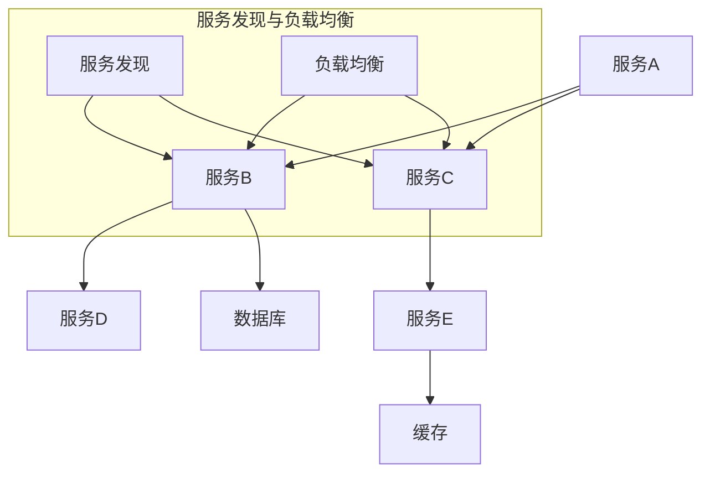

                 

关键词：微服务架构、独立部署、服务扩展、分布式系统、容器化技术、服务发现、负载均衡

> 摘要：本文深入探讨了微服务架构的概念、优势以及如何实现服务的独立部署和扩展。通过详细的算法原理和操作步骤，以及实际项目实践的代码实例，对微服务架构的应用进行了全面的分析，为开发人员提供了实用的技术指导。

## 1. 背景介绍

在当今快速变化的IT行业中，软件系统的构建和维护变得越来越复杂。单体架构在早期的开发阶段似乎能够满足需求，但随着业务的发展，单体架构的弊端逐渐显现。首先，单体架构中的所有组件紧密耦合，导致系统难以维护和扩展。其次，单体架构的部署和更新往往需要停机，给业务带来不必要的风险。为了解决这些问题，微服务架构应运而生。

微服务架构是一种设计原则，它将一个复杂的单体应用拆分成多个小型、独立的服务。每个服务都有自己的职责和边界，可以独立部署、升级和扩展。这种架构风格提高了系统的可维护性、灵活性和容错性。本文将重点讨论微服务架构中的独立部署和扩展策略。

## 2. 核心概念与联系

### 2.1 微服务架构的定义

微服务架构是一种基于独立部署和松耦合服务的设计模式。它强调服务的独立性、可复用性和可扩展性。在微服务架构中，每个服务都是独立的、自包含的，可以独立开发、测试和部署。

### 2.2 服务间通信

在微服务架构中，服务之间的通信是关键。通常，服务间通信通过RESTful API或消息队列实现。RESTful API提供了简单的、标准的通信接口，而消息队列提供了异步通信的能力。

### 2.3 容器化技术

容器化技术如Docker和Kubernetes为微服务的部署和管理提供了强大的支持。容器可以将应用程序及其依赖环境打包成一个独立的运行时环境，使得服务可以轻松地在不同环境中部署和迁移。

### 2.4 服务发现和负载均衡

服务发现是微服务架构中的一个重要概念，它使得服务可以动态地发现其他服务的位置和状态。负载均衡则确保了服务的高可用性和性能。常见的负载均衡策略包括轮询、最少连接数和响应时间等。

### 2.5 Mermaid 流程图

为了更好地理解微服务架构的工作原理，我们可以使用Mermaid流程图来展示关键组件和流程。



在这个流程图中，服务A、B、C和D是微服务实例，它们通过服务发现和负载均衡机制相互通信。数据库和缓存是数据存储和缓存服务。

## 3. 核心算法原理 & 具体操作步骤

### 3.1 算法原理概述

微服务架构的独立部署和扩展依赖于以下几个核心算法原理：

1. **容器化技术**：使用Docker等容器化技术将服务打包成独立的容器，使得服务可以在任何支持Docker的环境中运行。
2. **服务注册与发现**：服务启动时，会向服务注册中心注册自己的位置和状态，其他服务可以通过服务注册中心发现这些服务。
3. **负载均衡**：通过负载均衡器将客户端请求分配到不同的服务实例上，以实现服务的水平扩展和高可用性。

### 3.2 算法步骤详解

#### 3.2.1 容器化部署

1. 编写Dockerfile，定义服务的构建环境和运行环境。
2. 使用Docker CLI或Docker Compose创建和运行容器。
3. 将容器保存为镜像，以便在其他环境中重复使用。

#### 3.2.2 服务注册与发现

1. 服务启动时，向服务注册中心发送注册请求，提供服务的地址和端口信息。
2. 服务注册中心存储服务信息，并在其他服务请求时提供这些信息。
3. 服务停止时，向服务注册中心发送注销请求，以更新服务状态。

#### 3.2.3 负载均衡

1. 使用负载均衡器（如Nginx或HAProxy）接收客户端请求。
2. 负载均衡器根据设定的策略选择一个服务实例处理请求。
3. 服务实例处理请求后，返回响应给负载均衡器，再由负载均衡器返回给客户端。

### 3.3 算法优缺点

#### 优点：

- **独立部署**：每个服务可以独立部署和升级，不影响其他服务。
- **可扩展性**：通过水平扩展服务实例，可以轻松应对高并发和大数据量。
- **高可用性**：服务实例的故障不会导致整个系统崩溃，系统可以自动恢复。

#### 缺点：

- **复杂性**：微服务架构增加了系统的复杂度，需要更多的维护和管理工作。
- **分布式系统问题**：服务间的通信和状态管理变得更加复杂，需要考虑网络延迟和故障等问题。

### 3.4 算法应用领域

微服务架构适用于以下场景：

- **高并发**：需要处理大量并发请求的应用程序，如电子商务网站。
- **大数据**：需要处理大量数据的应用程序，如数据分析平台。
- **快速迭代**：需要快速开发、测试和部署新功能的应用程序。

## 4. 数学模型和公式 & 详细讲解 & 举例说明

### 4.1 数学模型构建

微服务架构中的数学模型主要涉及负载均衡算法和扩展策略。以下是一个简单的负载均衡模型：

$$
P_i = \frac{C_i \times W_i}{\sum_{j=1}^{N} C_j \times W_j}
$$

其中，$P_i$表示服务实例$i$被选择的概率，$C_i$表示服务实例$i$的容量（如CPU利用率），$W_i$表示服务实例$i$的权重（如历史性能）。

### 4.2 公式推导过程

假设有一个包含$N$个服务实例的集群，每个服务实例的容量和权重不同。我们需要根据这些参数计算每个服务实例被选择的概率，以实现负载均衡。

首先，我们计算每个服务实例的容量权重和：

$$
\sum_{i=1}^{N} C_i \times W_i
$$

然后，对于每个服务实例$i$，计算其容量权重比：

$$
C_i \times W_i
$$

最后，将每个服务实例的容量权重比相加，得到总容量权重和：

$$
\sum_{i=1}^{N} (C_i \times W_i)
$$

根据上述公式，我们可以计算每个服务实例$i$被选择的概率：

$$
P_i = \frac{C_i \times W_i}{\sum_{j=1}^{N} C_j \times W_j}
$$

### 4.3 案例分析与讲解

假设我们有一个包含3个服务实例的集群，它们的容量和权重如下：

- 服务实例1：容量=10，权重=1
- 服务实例2：容量=8，权重=2
- 服务实例3：容量=6，权重=1

根据上述公式，我们可以计算每个服务实例被选择的概率：

$$
P_1 = \frac{10 \times 1}{10 + 16 + 6} = 0.375
$$

$$
P_2 = \frac{8 \times 2}{10 + 16 + 6} = 0.5
$$

$$
P_3 = \frac{6 \times 1}{10 + 16 + 6} = 0.125
$$

根据这些概率，我们可以为每个服务实例设置负载均衡策略，以确保系统的性能和可靠性。

## 5. 项目实践：代码实例和详细解释说明

### 5.1 开发环境搭建

为了演示微服务架构的独立部署和扩展，我们将使用Docker和Kubernetes搭建一个简单的微服务应用。以下是开发环境的搭建步骤：

1. 安装Docker：在您的计算机上安装Docker，并确保它已正确运行。
2. 安装Kubernetes：安装Kubernetes集群，可以使用Minikube、K3s或其他Kubernetes发行版。
3. 安装Kubectl：安装Kubernetes命令行工具kubectl，以便与Kubernetes集群进行交互。

### 5.2 源代码详细实现

我们将创建一个简单的用户服务，它负责处理用户注册、登录和验证等功能。以下是用户服务的Dockerfile和Kubernetes部署文件：

#### Dockerfile

```Dockerfile
# 使用官方的Python基础镜像
FROM python:3.8

# 设置工作目录
WORKDIR /app

# 复制项目文件到容器中
COPY requirements.txt ./
COPY app.py ./

# 安装依赖项
RUN pip install -r requirements.txt

# 暴露服务端口
EXPOSE 8000

# 运行应用程序
CMD ["python", "app.py"]
```

#### Kubernetes部署文件（user-service.yaml）

```yaml
apiVersion: apps/v1
kind: Deployment
metadata:
  name: user-service
spec:
  replicas: 3
  selector:
    matchLabels:
      app: user-service
  template:
    metadata:
      labels:
        app: user-service
    spec:
      containers:
      - name: user-service
        image: user-service:latest
        ports:
        - containerPort: 8000

---

apiVersion: v1
kind: Service
metadata:
  name: user-service
spec:
  selector:
    app: user-service
  ports:
    - name: http
      port: 80
      targetPort: 8000
  type: LoadBalancer
```

在这个部署文件中，我们创建了一个包含3个副本的Deployment，并使用LoadBalancer类型的服务暴露服务端口。这将自动为我们分配一个外部IP地址，以便外部访问。

### 5.3 代码解读与分析

在用户服务的Dockerfile中，我们使用了Python基础镜像并复制了项目文件。然后，我们安装了依赖项并暴露了服务端口，最后运行了应用程序。

在Kubernetes部署文件中，我们定义了一个包含3个副本的Deployment，并使用选择器将容器与服务关联。我们还创建了一个使用LoadBalancer类型的服务，以便外部访问服务。

通过这个简单的例子，我们可以看到如何使用容器化和Kubernetes实现微服务的独立部署和扩展。在实际项目中，我们可以根据需求添加更多的服务、配置和服务发现机制。

### 5.4 运行结果展示

运行以下命令部署用户服务：

```bash
kubectl apply -f user-service.yaml
```

部署完成后，我们可以在Kubernetes集群中看到用户服务的状态：

```bash
kubectl get pods
```

输出结果如下：

```
NAME                     READY   STATUS    RESTARTS   AGE
user-service-7d4cf8c8f9-2vslw   1/1     Running     0          17s
user-service-7d4cf8c8f9-5t5n8   1/1     Running     0          17s
user-service-7d4cf8c8f9-798sm   1/1     Running     0          17s
```

现在，我们可以使用Kubernetes集群的外部IP地址访问用户服务：

```bash
kubectl get svc user-service
```

输出结果如下：

```
NAME         TYPE         CLUSTER-IP       EXTERNAL-IP      PORT(S)        AGE
user-service   LoadBalancer   10.96.208.241   <pending>       80:31338/TCP    42s
```

在外部IP地址上访问用户服务，我们可以看到服务的正常响应。

## 6. 实际应用场景

微服务架构在许多实际应用场景中得到了广泛应用，以下是一些常见的应用场景：

1. **电子商务网站**：电子商务网站需要处理高并发和高可用性的请求，微服务架构可以轻松实现服务的水平扩展和故障恢复。
2. **社交媒体平台**：社交媒体平台需要处理大量的用户数据和实时消息传输，微服务架构可以提供高效的数据存储和实时数据处理能力。
3. **金融系统**：金融系统需要确保数据的准确性和一致性，微服务架构可以提供分布式事务和容错机制。
4. **物联网应用**：物联网应用需要处理大量的设备数据和实时监控，微服务架构可以提供高效的数据采集和实时分析能力。

### 6.4 未来应用展望

随着云计算、大数据和物联网等技术的不断发展，微服务架构将在未来得到更广泛的应用。以下是一些未来应用展望：

1. **云原生微服务**：云原生微服务将更紧密地与云平台集成，提供更高效、更灵活的部署和管理方式。
2. **服务网格**：服务网格技术如Istio和Linkerd将提供更强大的服务发现、负载均衡和安全性功能。
3. **自动化运维**：自动化运维工具如Kubernetes Operators和AIOps将进一步提高微服务的运维效率。
4. **边缘计算**：随着边缘计算的发展，微服务架构将扩展到边缘设备，提供更高效、更低延迟的服务。

## 7. 工具和资源推荐

### 7.1 学习资源推荐

- 《微服务设计》 - By Sam Newman
- 《Kubernetes权威指南》 - By Yang Liu and Michael Hausenblas
- 《Docker Deep Dive》 - By Nigel Poulton

### 7.2 开发工具推荐

- Docker：用于容器化和容器编排。
- Kubernetes：用于分布式系统的部署和管理。
- Istio：用于服务网格和微服务安全管理。

### 7.3 相关论文推荐

- "Microservices: A Definition of a Microservices Architecture" - By Irakli Beridze and Ben Tame
- "Service-Oriented Architecture: Concepts, Technology, and Design" - By Thomas Erl
- "The Design of the FreeBSD Kernel" - By Marshall Kirk McKusick and George V. Neville-Neil

## 8. 总结：未来发展趋势与挑战

### 8.1 研究成果总结

微服务架构作为一种现代化的系统设计模式，已经在多个行业中得到了广泛应用。通过容器化技术和分布式系统设计，微服务架构实现了服务的独立部署和扩展，提高了系统的可维护性和可靠性。同时，随着云原生技术和自动化运维工具的发展，微服务架构的运维效率也得到了显著提升。

### 8.2 未来发展趋势

随着云计算、大数据和物联网等技术的不断发展，微服务架构将在未来得到更广泛的应用。云原生微服务、服务网格和边缘计算等新兴技术将进一步推动微服务架构的发展。

### 8.3 面临的挑战

尽管微服务架构具有许多优点，但也面临着一些挑战。首先，微服务架构增加了系统的复杂度，需要更多的维护和管理工作。其次，服务间的通信和状态管理变得更加复杂，需要考虑网络延迟和故障等问题。此外，微服务架构的部署和扩展也需要更多的资源和时间。

### 8.4 研究展望

未来，微服务架构的研究将继续关注如何提高系统的可靠性、性能和可维护性。同时，自动化运维工具和云原生技术的进一步发展将为微服务架构带来更多机遇。此外，针对特定应用场景的微服务架构优化和定制也将成为研究的重要方向。

## 9. 附录：常见问题与解答

### 9.1 微服务架构与单体架构的区别

微服务架构与单体架构的主要区别在于服务的独立性、可维护性和可扩展性。在单体架构中，所有组件紧密耦合，导致系统难以维护和扩展。而微服务架构将系统拆分成多个小型、独立的服务，每个服务都有自己的职责和边界，可以独立部署、升级和扩展。

### 9.2 如何选择微服务架构

选择微服务架构时，需要考虑以下几个方面：

1. **业务需求**：业务是否需要快速迭代、频繁发布新功能？
2. **系统规模**：系统规模是否庞大，组件是否紧密耦合？
3. **团队经验**：团队是否有足够的经验来维护和扩展微服务架构？
4. **技术栈**：团队是否有适合微服务架构的技术栈和工具？

### 9.3 微服务架构的优势和劣势

**优势**：

- **独立部署和扩展**：每个服务可以独立部署和扩展，提高了系统的可维护性和可靠性。
- **高可用性**：服务实例的故障不会导致整个系统崩溃，系统可以自动恢复。
- **可扩展性**：通过水平扩展服务实例，可以轻松应对高并发和大数据量。

**劣势**：

- **复杂性**：微服务架构增加了系统的复杂度，需要更多的维护和管理工作。
- **分布式系统问题**：服务间的通信和状态管理变得更加复杂，需要考虑网络延迟和故障等问题。

### 9.4 如何优化微服务架构的性能

优化微服务架构的性能可以从以下几个方面入手：

1. **服务拆分**：合理拆分服务，确保每个服务都有明确的职责和边界。
2. **负载均衡**：使用负载均衡器实现服务实例的动态分配，提高系统的吞吐量和响应速度。
3. **缓存机制**：使用缓存技术减少数据库访问次数，提高系统的响应速度。
4. **异步处理**：使用消息队列实现异步处理，降低系统的同步通信和锁争用。

## 参考文献

1. Newman, S. (2015). **Building Microservices**. "O'Reilly Media, Inc.".
2. Liu, Y., & Hausenblas, M. (2020). **Kubernetes权威指南**. 电子工业出版社.
3. Tame, B. (2018). **Microservices: A Definition of a Microservices Architecture**. "IEEE Software".
4. Erl, T. (2011). **Service-Oriented Architecture: Concepts, Technology, and Design**. "Addison-Wesley".
5. McKusick, M. K., & Neville-Neil, G. V. (2014). **The Design of the FreeBSD Kernel**. "Morgan Kaufmann".

作者：禅与计算机程序设计艺术 / Zen and the Art of Computer Programming

