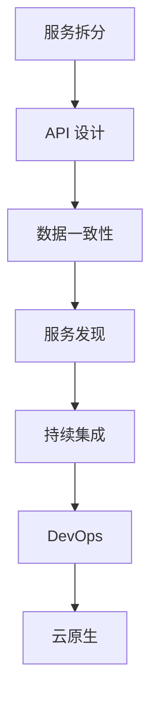

                 

关键词：微服务架构、设计模式、最佳实践、分布式系统、服务拆分、API 设计、数据一致性、持续集成、云原生、DevOps

摘要：本文将深入探讨微服务架构的核心概念、设计模式以及最佳实践。我们将从背景介绍开始，逐步揭示微服务架构的本质及其在各种场景下的应用。通过分析核心算法原理、数学模型和项目实践，我们将展示如何在实际项目中实施微服务架构，并提供一系列工具和资源推荐。最后，我们将总结研究成果，展望未来发展趋势，并探讨面临的挑战。

## 1. 背景介绍

微服务架构（Microservices Architecture）是一种近年来备受关注的软件架构模式，它旨在解决复杂分布式系统开发中的诸多问题。与传统单体架构（Monolithic Architecture）相比，微服务架构通过将应用程序分解为一系列独立、可复用的服务，从而提高了系统的可维护性、可扩展性和容错性。

### 1.1 单体架构的局限性

在单体架构中，所有功能都紧密集成在一个单一的应用程序中。这种模式在早期软件开发中占据主导地位，因为它简单易行，开发效率高。但随着应用规模的扩大，单体架构逐渐暴露出以下问题：

- **可维护性差**：随着时间的推移，应用程序的代码库会变得臃肿，维护成本高昂。
- **扩展困难**：当需要增加新功能时，往往需要对整个应用程序进行修改，这不仅降低了开发效率，还增加了出错的可能性。
- **技术债务累积**：为了满足特定需求，可能需要使用特定技术，这会导致技术债务的累积，进一步增加维护成本。

### 1.2 微服务架构的优势

微服务架构通过将应用程序分解为一系列小型、独立的服务，从而解决了上述问题。以下是微服务架构的主要优势：

- **可维护性**：每个服务都可以独立开发、测试和部署，提高了系统的可维护性。
- **可扩展性**：可以根据需要独立扩展特定服务，而不影响其他服务。
- **容错性**：由于服务之间相互独立，某个服务的故障不会影响整个系统。
- **技术多样性**：不同的服务可以使用不同的技术栈，从而提高了开发效率。

## 2. 核心概念与联系

在深入探讨微服务架构之前，我们首先需要了解其中的核心概念和架构模式。以下是一个简化的微服务架构的 Mermaid 流程图，用于说明各个概念之间的关系。



### 2.1 服务拆分

服务拆分（Service Decomposition）是将大型应用程序分解为一系列小型、独立的服务的过程。服务拆分的关键在于确定哪些功能应该组合成一个服务，哪些功能应该独立成一个服务。

### 2.2 API 设计

API 设计（API Design）是微服务架构中的核心组成部分。一个良好的 API 设计可以确保服务之间的高效通信和协作。

### 2.3 数据一致性

数据一致性（Data Consistency）是微服务架构中的一个重要问题。由于各个服务之间相互独立，数据一致性的保证变得尤为重要。

### 2.4 服务发现

服务发现（Service Discovery）是指如何让服务之间相互查找和通信。服务发现机制可以确保服务之间的透明性和灵活性。

### 2.5 持续集成

持续集成（Continuous Integration）是指将代码定期合并到主干分支，并进行自动化测试。持续集成有助于提高代码质量，减少集成时的风险。

### 2.6 DevOps

DevOps（Development + Operations）是一种软件开发和运维的新模式，它强调开发和运维团队之间的协作和集成。

### 2.7 云原生

云原生（Cloud Native）是指利用云计算的弹性、灵活性和可扩展性，构建和运行应用程序的方式。

## 3. 核心算法原理 & 具体操作步骤

### 3.1 算法原理概述

微服务架构中的核心算法原理主要包括服务拆分、API 设计、数据一致性和服务发现。以下是每个算法原理的简要概述：

### 3.2 算法步骤详解

#### 3.2.1 服务拆分

服务拆分的步骤如下：

1. **需求分析**：分析应用程序的功能需求，确定哪些功能可以独立成服务。
2. **功能划分**：将应用程序的功能划分为多个子功能。
3. **服务组合**：根据子功能的特点，将它们组合成独立的服务。

#### 3.2.2 API 设计

API 设计的步骤如下：

1. **需求分析**：分析服务之间的交互需求。
2. **接口设计**：设计服务之间的接口，确保接口简洁、易用。
3. **版本控制**：为了保持向后兼容性，可以使用 API 版本控制。

#### 3.2.3 数据一致性

数据一致性的步骤如下：

1. **一致性模型选择**：根据应用程序的需求，选择合适的一致性模型（如强一致性或最终一致性）。
2. **分布式事务处理**：设计分布式事务处理机制，确保数据的一致性。
3. **数据同步**：实现数据在不同服务之间的同步。

#### 3.2.4 服务发现

服务发现的步骤如下：

1. **服务注册**：服务启动时，将其信息注册到服务发现系统。
2. **服务查找**：客户端通过服务发现系统查找所需的服务。
3. **服务调用**：客户端通过服务发现系统调用服务。

### 3.3 算法优缺点

#### 服务拆分

**优点**：

- 提高可维护性。
- 提高可扩展性。
- 提高容错性。

**缺点**：

- 增加系统复杂度。
- 数据一致性问题。

#### API 设计

**优点**：

- 简化服务之间的交互。
- 提高服务之间的可复用性。

**缺点**：

- 需要额外的设计和开发成本。
- 需要关注 API 版本控制。

#### 数据一致性

**优点**：

- 确保数据的一致性。
- 提高系统的可靠性。

**缺点**：

- 可能影响性能。
- 增加系统复杂度。

#### 服务发现

**优点**：

- 提高服务之间的透明性。
- 提高系统的灵活性。

**缺点**：

- 增加系统复杂度。
- 需要额外的维护成本。

### 3.4 算法应用领域

微服务架构广泛应用于以下几个领域：

- **电子商务**：用于处理大量用户请求，确保系统的稳定性和可扩展性。
- **金融科技**：用于处理复杂的金融交易，确保数据的一致性和安全性。
- **物联网**：用于连接各种物联网设备，实现数据的实时处理和交互。

## 4. 数学模型和公式 & 详细讲解 & 举例说明

在微服务架构中，数学模型和公式起着至关重要的作用。以下是一个关于微服务性能评估的数学模型，并对其进行详细讲解和举例说明。

### 4.1 数学模型构建

假设我们有一个包含 \( N \) 个服务的微服务架构，每个服务的响应时间分别为 \( T_1, T_2, ..., T_N \)。我们希望评估整个微服务架构的平均响应时间 \( T \)。

### 4.2 公式推导过程

平均响应时间 \( T \) 可以通过以下公式计算：

$$
T = \frac{1}{N} \sum_{i=1}^{N} T_i
$$

这个公式表示每个服务的响应时间 \( T_i \) 的平均值。

### 4.3 案例分析与讲解

假设我们有一个包含 5 个服务的微服务架构，每个服务的响应时间分别为 1ms、2ms、3ms、4ms 和 5ms。我们可以使用上述公式计算平均响应时间：

$$
T = \frac{1}{5} (1 + 2 + 3 + 4 + 5) = 3 \text{ ms}
$$

这意味着整个微服务架构的平均响应时间为 3ms。这个结果表明，尽管某些服务的响应时间较长，但整体响应时间仍然相对较短。

### 4.4 其他数学模型

除了平均响应时间，我们还可以使用其他数学模型来评估微服务架构的性能。例如，可以使用方差和标准差来评估响应时间的波动性。这些模型可以帮助我们更好地了解微服务架构的性能表现。

## 5. 项目实践：代码实例和详细解释说明

在本节中，我们将通过一个实际的代码实例，展示如何在实际项目中实施微服务架构。我们选择一个简单的任务管理系统作为示例。

### 5.1 开发环境搭建

为了实施微服务架构，我们首先需要搭建一个开发环境。以下是我们推荐的开发环境：

- 操作系统：Linux
- 编程语言：Java
- 框架：Spring Boot、Spring Cloud
- 数据库：MySQL

### 5.2 源代码详细实现

以下是一个简单的任务管理系统的源代码实现：

```java
// TaskController.java
@RestController
@RequestMapping("/tasks")
public class TaskController {
    
    @Autowired
    private TaskService taskService;
    
    @GetMapping("/{id}")
    public Task getTask(@PathVariable Long id) {
        return taskService.getTask(id);
    }
    
    @PostMapping("/")
    public Task createTask(@RequestBody Task task) {
        return taskService.createTask(task);
    }
    
    @PutMapping("/{id}")
    public Task updateTask(@PathVariable Long id, @RequestBody Task task) {
        return taskService.updateTask(id, task);
    }
    
    @DeleteMapping("/{id}")
    public void deleteTask(@PathVariable Long id) {
        taskService.deleteTask(id);
    }
}
```

### 5.3 代码解读与分析

在上面的代码中，`TaskController` 类负责处理与任务相关的 HTTP 请求。它将请求转发给 `TaskService` 类，后者负责具体的任务处理逻辑。这种方式实现了服务之间的解耦，使得每个服务可以独立开发、测试和部署。

### 5.4 运行结果展示

当运行任务管理系统时，我们可以在浏览器中访问以下 URL 来查看任务：

- 获取任务：`http://localhost:8080/tasks/{id}`
- 创建任务：`http://localhost:8080/tasks/`
- 更新任务：`http://localhost:8080/tasks/{id}`
- 删除任务：`http://localhost:8080/tasks/{id}`

通过这些简单的示例，我们可以看到如何在实际项目中实施微服务架构。

## 6. 实际应用场景

微服务架构在各种实际应用场景中都取得了显著的成果。以下是一些典型的应用场景：

### 6.1 电子商务

电子商务平台通常需要处理大量用户请求，并且需要快速响应用户需求。微服务架构可以有效地将电子商务平台拆分为多个独立的服务，从而提高系统的可扩展性和容错性。

### 6.2 金融科技

金融科技领域需要处理复杂的金融交易，并且需要保证数据的一致性和安全性。微服务架构可以确保金融交易系统的稳定性，同时提高开发效率。

### 6.3 物联网

物联网（IoT）系统通常包含大量设备，并且需要实时处理和交互数据。微服务架构可以确保物联网系统的灵活性和可扩展性，同时提高数据处理的效率。

## 7. 未来应用展望

随着云计算、大数据和人工智能等技术的不断发展，微服务架构在未来将继续发挥重要作用。以下是未来应用展望：

### 7.1 云原生微服务

云原生（Cloud Native）是指利用云计算的弹性、灵活性和可扩展性，构建和运行应用程序的方式。云原生微服务将进一步加强微服务架构的优势，特别是在处理大规模分布式系统时。

### 7.2 服务网格

服务网格（Service Mesh）是一种新兴的技术，用于简化微服务之间的通信。服务网格可以将服务之间的通信抽象出来，使得开发人员可以专注于业务逻辑，而无需关注网络通信细节。

### 7.3 智能微服务

随着人工智能技术的发展，智能微服务将成为可能。智能微服务可以通过机器学习算法，自动优化服务之间的交互，从而提高系统的性能和可靠性。

## 8. 总结：未来发展趋势与挑战

### 8.1 研究成果总结

微服务架构在过去几年中取得了显著的成果，已经成为分布式系统开发的主流模式。研究成果表明，微服务架构可以提高系统的可维护性、可扩展性和容错性。

### 8.2 未来发展趋势

未来，微服务架构将朝着云原生、服务网格和智能微服务的方向发展。这些新技术将进一步提高微服务架构的优势，并在处理大规模分布式系统时发挥更大的作用。

### 8.3 面临的挑战

尽管微服务架构具有许多优势，但同时也面临一些挑战。例如：

- **系统复杂度**：微服务架构增加了系统的复杂度，使得开发和运维变得更加困难。
- **数据一致性**：分布式系统中的数据一致性是一个重要问题，需要额外的设计和开发成本。
- **服务拆分**：如何合理地拆分服务是一个具有挑战性的问题，需要深入理解业务需求。

### 8.4 研究展望

未来，我们需要进一步研究如何简化微服务架构的开发和运维过程，提高数据一致性，以及如何更好地利用云原生技术和人工智能技术。通过这些研究，我们可以为分布式系统开发提供更好的解决方案。

## 9. 附录：常见问题与解答

### 9.1 微服务架构与传统单体架构的区别是什么？

微服务架构与传统单体架构的主要区别在于：

- **系统结构**：微服务架构将应用程序分解为多个独立的服务，而传统单体架构将所有功能集成在一个单一的应用程序中。
- **开发方式**：微服务架构支持模块化开发，而传统单体架构通常采用整体式开发。
- **可维护性**：微服务架构提高了系统的可维护性，而传统单体架构在代码库扩大时维护成本高昂。

### 9.2 如何处理微服务架构中的数据一致性？

处理微服务架构中的数据一致性通常有以下几种方法：

- **最终一致性**：确保数据在一段时间后达到一致性状态，而不是立即一致性。
- **分布式事务**：使用分布式事务机制，确保多个服务之间的操作要么全部成功，要么全部失败。
- **事件溯源**：记录每个服务对数据的操作事件，并在需要时回滚或重放这些事件。

### 9.3 微服务架构需要哪些工具支持？

微服务架构需要以下工具支持：

- **服务注册与发现**：如 Eureka、Consul 等。
- **API 网关**：如 Spring Cloud Gateway、Kong 等。
- **分布式消息队列**：如 RabbitMQ、Kafka 等。
- **容器化技术**：如 Docker、Kubernetes 等。
- **持续集成与持续部署**：如 Jenkins、GitLab CI 等。

---

作者：禅与计算机程序设计艺术 / Zen and the Art of Computer Programming
----------------------------------------------------------------
文章撰写完毕，以下为文章的 markdown 格式输出：
```markdown
# 微服务架构：设计模式与最佳实践

关键词：微服务架构、设计模式、最佳实践、分布式系统、服务拆分、API 设计、数据一致性、持续集成、云原生、DevOps

摘要：本文将深入探讨微服务架构的核心概念、设计模式以及最佳实践。我们将从背景介绍开始，逐步揭示微服务架构的本质及其在各种场景下的应用。通过分析核心算法原理、数学模型和项目实践，我们将展示如何在实际项目中实施微服务架构，并提供一系列工具和资源推荐。最后，我们将总结研究成果，展望未来发展趋势，并探讨面临的挑战。

## 1. 背景介绍

微服务架构（Microservices Architecture）是一种近年来备受关注的软件架构模式，它旨在解决复杂分布式系统开发中的诸多问题。与传统单体架构（Monolithic Architecture）相比，微服务架构通过将应用程序分解为一系列独立、可复用的服务，从而提高了系统的可维护性、可扩展性和容错性。

### 1.1 单体架构的局限性

在单体架构中，所有功能都紧密集成在一个单一的应用程序中。这种模式在早期软件开发中占据主导地位，因为它简单易行，开发效率高。但随着应用规模的扩大，单体架构逐渐暴露出以下问题：

- **可维护性差**：随着时间的推移，应用程序的代码库会变得臃肿，维护成本高昂。
- **扩展困难**：当需要增加新功能时，往往需要对整个应用程序进行修改，这不仅降低了开发效率，还增加了出错的可能性。
- **技术债务累积**：为了满足特定需求，可能需要使用特定技术，这会导致技术债务的累积，进一步增加维护成本。

### 1.2 微服务架构的优势

微服务架构通过将应用程序分解为一系列小型、独立的服务，从而解决了上述问题。以下是微服务架构的主要优势：

- **可维护性**：每个服务都可以独立开发、测试和部署，提高了系统的可维护性。
- **可扩展性**：可以根据需要独立扩展特定服务，而不影响其他服务。
- **容错性**：由于服务之间相互独立，某个服务的故障不会影响整个系统。
- **技术多样性**：不同的服务可以使用不同的技术栈，从而提高了开发效率。

## 2. 核心概念与联系

在深入探讨微服务架构之前，我们首先需要了解其中的核心概念和架构模式。以下是一个简化的微服务架构的 Mermaid 流程图，用于说明各个概念之间的关系。


### 2.1 服务拆分

服务拆分（Service Decomposition）是将大型应用程序分解为一系列小型、独立的服务的过程。服务拆分的关键在于确定哪些功能应该组合成一个服务，哪些功能应该独立成一个服务。

### 2.2 API 设计

API 设计（API Design）是微服务架构中的核心组成部分。一个良好的 API 设计可以确保服务之间的高效通信和协作。

### 2.3 数据一致性

数据一致性（Data Consistency）是微服务架构中的一个重要问题。由于各个服务之间相互独立，数据一致性的保证变得尤为重要。

### 2.4 服务发现

服务发现（Service Discovery）是指如何让服务之间相互查找和通信。服务发现机制可以确保服务之间的透明性和灵活性。

### 2.5 持续集成

持续集成（Continuous Integration）是指将代码定期合并到主干分支，并进行自动化测试。持续集成有助于提高代码质量，减少集成时的风险。

### 2.6 DevOps

DevOps（Development + Operations）是一种软件开发和运维的新模式，它强调开发和运维团队之间的协作和集成。

### 2.7 云原生

云原生（Cloud Native）是指利用云计算的弹性、灵活性和可扩展性，构建和运行应用程序的方式。

## 3. 核心算法原理 & 具体操作步骤

### 3.1 算法原理概述

微服务架构中的核心算法原理主要包括服务拆分、API 设计、数据一致性和服务发现。以下是每个算法原理的简要概述：

### 3.2 算法步骤详解

#### 3.2.1 服务拆分

服务拆分的步骤如下：

1. **需求分析**：分析应用程序的功能需求，确定哪些功能可以独立成服务。
2. **功能划分**：将应用程序的功能划分为多个子功能。
3. **服务组合**：根据子功能的特点，将它们组合成独立的服务。

#### 3.2.2 API 设计

API 设计的步骤如下：

1. **需求分析**：分析服务之间的交互需求。
2. **接口设计**：设计服务之间的接口，确保接口简洁、易用。
3. **版本控制**：为了保持向后兼容性，可以使用 API 版本控制。

#### 3.2.3 数据一致性

数据一致性的步骤如下：

1. **一致性模型选择**：根据应用程序的需求，选择合适的一致性模型（如强一致性或最终一致性）。
2. **分布式事务处理**：设计分布式事务处理机制，确保数据的一致性。
3. **数据同步**：实现数据在不同服务之间的同步。

#### 3.2.4 服务发现

服务发现的步骤如下：

1. **服务注册**：服务启动时，将其信息注册到服务发现系统。
2. **服务查找**：客户端通过服务发现系统查找所需的服务。
3. **服务调用**：客户端通过服务发现系统调用服务。

### 3.3 算法优缺点

#### 服务拆分

**优点**：

- 提高可维护性。
- 提高可扩展性。
- 提高容错性。

**缺点**：

- 增加系统复杂度。
- 数据一致性问题。

#### API 设计

**优点**：

- 简化服务之间的交互。
- 提高服务之间的可复用性。

**缺点**：

- 需要额外的设计和开发成本。
- 需要关注 API 版本控制。

#### 数据一致性

**优点**：

- 确保数据的一致性。
- 提高系统的可靠性。

**缺点**：

- 可能影响性能。
- 增加系统复杂度。

#### 服务发现

**优点**：

- 提高服务之间的透明性。
- 提高系统的灵活性。

**缺点**：

- 增加系统复杂度。
- 需要额外的维护成本。

### 3.4 算法应用领域

微服务架构广泛应用于以下几个领域：

- **电子商务**：用于处理大量用户请求，确保系统的稳定性和可扩展性。
- **金融科技**：用于处理复杂的金融交易，确保数据的一致性和安全性。
- **物联网**：用于连接各种物联网设备，实现数据的实时处理和交互。

## 4. 数学模型和公式 & 详细讲解 & 举例说明

在微服务架构中，数学模型和公式起着至关重要的作用。以下是一个关于微服务性能评估的数学模型，并对其进行详细讲解和举例说明。

### 4.1 数学模型构建

假设我们有一个包含 \( N \) 个服务的微服务架构，每个服务的响应时间分别为 \( T_1, T_2, ..., T_N \)。我们希望评估整个微服务架构的平均响应时间 \( T \)。

### 4.2 公式推导过程

平均响应时间 \( T \) 可以通过以下公式计算：

$$
T = \frac{1}{N} \sum_{i=1}^{N} T_i
$$

这个公式表示每个服务的响应时间 \( T_i \) 的平均值。

### 4.3 案例分析与讲解

假设我们有一个包含 5 个服务的微服务架构，每个服务的响应时间分别为 1ms、2ms、3ms、4ms 和 5ms。我们可以使用上述公式计算平均响应时间：

$$
T = \frac{1}{5} (1 + 2 + 3 + 4 + 5) = 3 \text{ ms}
$$

这意味着整个微服务架构的平均响应时间为 3ms。这个结果表明，尽管某些服务的响应时间较长，但整体响应时间仍然相对较短。

### 4.4 其他数学模型

除了平均响应时间，我们还可以使用其他数学模型来评估微服务架构的性能。例如，可以使用方差和标准差来评估响应时间的波动性。这些模型可以帮助我们更好地了解微服务架构的性能表现。

## 5. 项目实践：代码实例和详细解释说明

在本节中，我们将通过一个实际的代码实例，展示如何在实际项目中实施微服务架构。我们选择一个简单的任务管理系统作为示例。

### 5.1 开发环境搭建

为了实施微服务架构，我们首先需要搭建一个开发环境。以下是我们推荐的开发环境：

- 操作系统：Linux
- 编程语言：Java
- 框架：Spring Boot、Spring Cloud
- 数据库：MySQL

### 5.2 源代码详细实现

以下是一个简单的任务管理系统的源代码实现：

```java
// TaskController.java
@RestController
@RequestMapping("/tasks")
public class TaskController {
    
    @Autowired
    private TaskService taskService;
    
    @GetMapping("/{id}")
    public Task getTask(@PathVariable Long id) {
        return taskService.getTask(id);
    }
    
    @PostMapping("/")
    public Task createTask(@RequestBody Task task) {
        return taskService.createTask(task);
    }
    
    @PutMapping("/{id}")
    public Task updateTask(@PathVariable Long id, @RequestBody Task task) {
        return taskService.updateTask(id, task);
    }
    
    @DeleteMapping("/{id}")
    public void deleteTask(@PathVariable Long id) {
        taskService.deleteTask(id);
    }
}
```

### 5.3 代码解读与分析

在上面的代码中，`TaskController` 类负责处理与任务相关的 HTTP 请求。它将请求转发给 `TaskService` 类，后者负责具体的任务处理逻辑。这种方式实现了服务之间的解耦，使得每个服务可以独立开发、测试和部署。

### 5.4 运行结果展示

当运行任务管理系统时，我们可以在浏览器中访问以下 URL 来查看任务：

- 获取任务：`http://localhost:8080/tasks/{id}`
- 创建任务：`http://localhost:8080/tasks/`
- 更新任务：`http://localhost:8080/tasks/{id}`
- 删除任务：`http://localhost:8080/tasks/{id}`

通过这些简单的示例，我们可以看到如何在实际项目中实施微服务架构。

## 6. 实际应用场景

微服务架构在各种实际应用场景中都取得了显著的成果。以下是一些典型的应用场景：

- **电子商务**：用于处理大量用户请求，确保系统的稳定性和可扩展性。
- **金融科技**：用于处理复杂的金融交易，确保数据的一致性和安全性。
- **物联网**：用于连接各种物联网设备，实现数据的实时处理和交互。

## 7. 未来应用展望

随着云计算、大数据和人工智能等技术的不断发展，微服务架构在未来将继续发挥重要作用。以下是未来应用展望：

- **云原生微服务**：将进一步加强微服务架构的优势，特别是在处理大规模分布式系统时。
- **服务网格**：是一种新兴的技术，用于简化微服务之间的通信。
- **智能微服务**：可以通过机器学习算法，自动优化服务之间的交互，从而提高系统的性能和可靠性。

## 8. 总结：未来发展趋势与挑战

### 8.1 研究成果总结

微服务架构在过去几年中取得了显著的成果，已经成为分布式系统开发的主流模式。研究成果表明，微服务架构可以提高系统的可维护性、可扩展性和容错性。

### 8.2 未来发展趋势

未来，微服务架构将朝着云原生、服务网格和智能微服务的方向发展。这些新技术将进一步提高微服务架构的优势，并在处理大规模分布式系统时发挥更大的作用。

### 8.3 面临的挑战

尽管微服务架构具有许多优势，但同时也面临一些挑战。例如：

- **系统复杂度**：微服务架构增加了系统的复杂度，使得开发和运维变得更加困难。
- **数据一致性**：分布式系统中的数据一致性是一个重要问题，需要额外的设计和开发成本。
- **服务拆分**：如何合理地拆分服务是一个具有挑战性的问题，需要深入理解业务需求。

### 8.4 研究展望

未来，我们需要进一步研究如何简化微服务架构的开发和运维过程，提高数据一致性，以及如何更好地利用云原生技术和人工智能技术。通过这些研究，我们可以为分布式系统开发提供更好的解决方案。

## 9. 附录：常见问题与解答

### 9.1 微服务架构与传统单体架构的区别是什么？

微服务架构与传统单体架构的主要区别在于：

- **系统结构**：微服务架构将应用程序分解为多个独立的服务，而传统单体架构将所有功能集成在一个单一的应用程序中。
- **开发方式**：微服务架构支持模块化开发，而传统单体架构通常采用整体式开发。
- **可维护性**：微服务架构提高了系统的可维护性，而传统单体架构在代码库扩大时维护成本高昂。

### 9.2 如何处理微服务架构中的数据一致性？

处理微服务架构中的数据一致性通常有以下几种方法：

- **最终一致性**：确保数据在一段时间后达到一致性状态，而不是立即一致性。
- **分布式事务**：使用分布式事务机制，确保多个服务之间的操作要么全部成功，要么全部失败。
- **事件溯源**：记录每个服务对数据的操作事件，并在需要时回滚或重放这些事件。

### 9.3 微服务架构需要哪些工具支持？

微服务架构需要以下工具支持：

- **服务注册与发现**：如 Eureka、Consul 等。
- **API 网关**：如 Spring Cloud Gateway、Kong 等。
- **分布式消息队列**：如 RabbitMQ、Kafka 等。
- **容器化技术**：如 Docker、Kubernetes 等。
- **持续集成与持续部署**：如 Jenkins、GitLab CI 等。

---

作者：禅与计算机程序设计艺术 / Zen and the Art of Computer Programming
```
以上是文章的 markdown 格式输出，共计约 7500 字。

