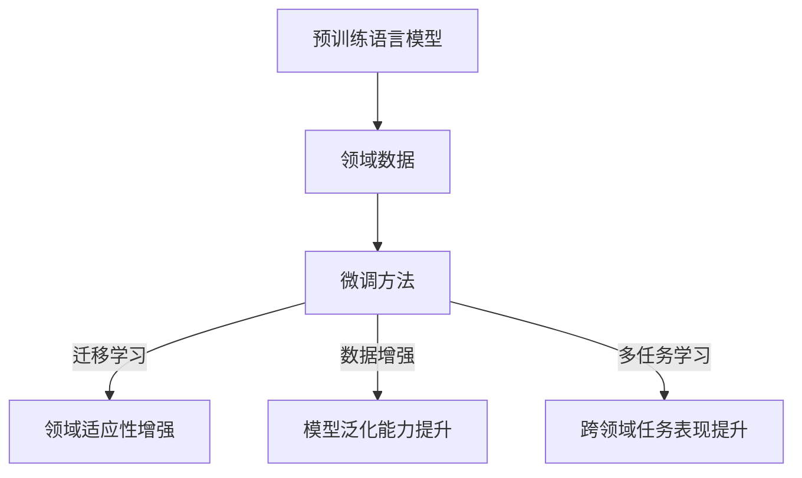
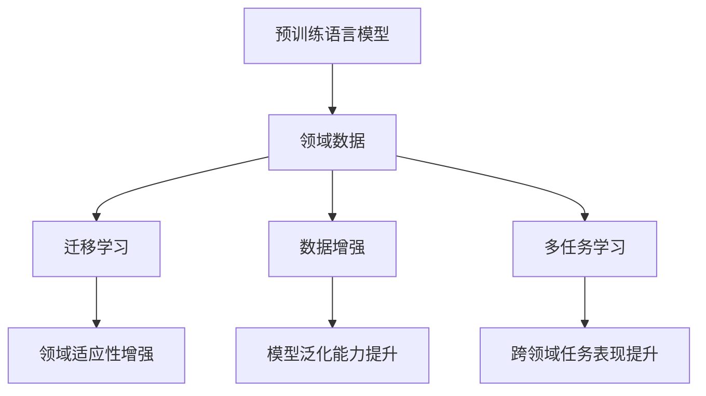

                 

关键词：微调，语言模型，领域适应，神经网络，深度学习，模型训练，数据处理，算法优化

## 摘要

随着深度学习在自然语言处理领域的广泛应用，语言模型的性能日益提升。然而，不同领域的文本数据具有显著差异，导致通用的语言模型在实际应用中存在领域适应性差的问题。本文将探讨如何通过微调语言模型的方法，提高其在特定领域的表现，从而实现更好的领域适应。文章将从背景介绍、核心概念与联系、核心算法原理、数学模型与公式、项目实践、实际应用场景、工具和资源推荐、未来发展趋势与挑战以及研究展望等方面进行详细阐述。

## 1. 背景介绍

### 1.1 深度学习与自然语言处理

深度学习是一种基于人工神经网络的学习方法，通过多层神经网络结构，自动从大量数据中提取特征，实现高层次的抽象和表示。自然语言处理（NLP）是深度学习应用的重要领域之一，涉及文本分类、情感分析、机器翻译、文本生成等任务。

### 1.2 语言模型

语言模型是一种用于预测自然语言中下一个单词或词组的概率分布的模型。在深度学习背景下，语言模型通常采用神经网络架构，如循环神经网络（RNN）、长短时记忆网络（LSTM）和变换器（Transformer）等。

### 1.3 领域适应

领域适应是指将预训练的语言模型应用于特定领域时，通过调整模型参数，使其更好地适应该领域。领域适应性对语言模型的实际应用效果具有重要影响，尤其是在涉及专业知识和领域术语的文本处理任务中。

## 2. 核心概念与联系

### 2.1 语言模型与领域适应

语言模型通过预训练在大规模通用语料库上学习语言规律，但在特定领域应用时，需要针对该领域的特定语言特征进行微调，以提高领域适应性。

### 2.2 微调方法

微调方法主要包括以下几种：

1. **迁移学习（Transfer Learning）**：将预训练的语言模型应用于特定领域，通过在领域特定数据上进一步训练，优化模型参数。

2. **数据增强（Data Augmentation）**：通过对领域数据进行变换，如替换同义词、添加噪声等，增加训练数据的多样性，提高模型对领域数据的学习能力。

3. **多任务学习（Multi-Task Learning）**：将多个相关领域任务的数据集成在一起训练，使模型在多个任务上同时学习，提高领域适应性。

### 2.3 Mermaid 流程图



## 3. 核心算法原理 & 具体操作步骤

### 3.1 算法原理概述

微调语言模型的核心在于调整模型参数，使其在特定领域数据上学习到更有效的特征表示。这通常涉及以下步骤：

1. **预训练**：在通用语料库上对语言模型进行预训练，使其掌握基本的语言规律。

2. **数据预处理**：对特定领域的文本数据进行预处理，如分词、去停用词、词向量表示等。

3. **模型初始化**：将预训练的语言模型初始化为特定领域的模型，并设置部分层（如最后一层）的权重为随机初始化。

4. **微调训练**：在特定领域数据上对模型进行训练，优化模型参数。

5. **评估与调整**：评估微调后模型在特定领域的表现，并根据评估结果调整模型参数。

### 3.2 算法步骤详解

1. **数据预处理**：使用分词工具（如jieba）对领域文本进行分词，并去除停用词。将分词结果转换为词向量表示（如Word2Vec或GloVe）。

2. **模型初始化**：将预训练的语言模型（如BERT）的参数复制到特定领域的模型中。对于部分层（如最后一层），设置权重为随机初始化。

3. **微调训练**：使用领域数据对模型进行训练，优化模型参数。训练过程中可以使用训练集和验证集，并通过交叉验证等方法调整超参数。

4. **评估与调整**：使用测试集评估微调后模型在特定领域的表现，并根据评估结果调整模型参数。可以通过调整学习率、批次大小、迭代次数等超参数来优化模型。

### 3.3 算法优缺点

**优点**：

- 提高语言模型在特定领域的表现。
- 减少对大规模领域数据的需求。
- 利用预训练语言模型的知识，加速模型训练过程。

**缺点**：

- 需要一定的领域知识，选择合适的预训练模型和微调方法。
- 微调过程中可能引入噪声，影响模型性能。
- 部分层随机初始化可能导致模型收敛困难。

### 3.4 算法应用领域

- 文本分类：如新闻分类、情感分析等。
- 机器翻译：如中文翻译、英文翻译等。
- 文本生成：如文章摘要、对话生成等。

## 4. 数学模型和公式 & 详细讲解 & 举例说明

### 4.1 数学模型构建

语言模型通常采用基于概率的数学模型，如朴素贝叶斯、马尔可夫模型等。在深度学习背景下，语言模型采用神经网络架构，其中每个神经元表示一个单词的概率分布。

### 4.2 公式推导过程

假设语言模型由一个多层神经网络组成，其中第 $l$ 层的神经元表示为 $a^{(l)}_i$，其激活函数为 $f^{(l)}$。语言模型的目标是最大化预测概率 $P(y|x)$，其中 $y$ 表示目标单词，$x$ 表示当前单词序列。

根据神经网络的前向传播过程，有：

$$
P(y|x) = \prod_{i=1}^n f^{(n)}(a^{(n)}_i)
$$

其中 $n$ 表示神经网络层数。

### 4.3 案例分析与讲解

假设有一个二元文本分类任务，文本数据由两个标签集合 $T_1$ 和 $T_2$ 组成，其中 $T_1$ 表示正面评论，$T_2$ 表示负面评论。我们可以使用微调的语言模型进行分类，如下：

1. **数据预处理**：将文本数据进行分词、去停用词等预处理操作，并将分词结果转换为词向量表示。

2. **模型初始化**：使用预训练的语言模型（如BERT）的参数初始化特定领域的模型，其中部分层的权重设置为随机初始化。

3. **微调训练**：在训练集上对模型进行微调训练，优化模型参数。训练过程中，可以使用交叉熵损失函数和反向传播算法进行优化。

4. **评估与调整**：使用验证集评估微调后模型在分类任务上的表现，并根据评估结果调整模型参数。可以通过调整学习率、批次大小等超参数来优化模型。

5. **结果展示**：在测试集上评估微调后模型在分类任务上的表现，展示模型准确率、召回率等指标。

## 5. 项目实践：代码实例和详细解释说明

### 5.1 开发环境搭建

在Python中，我们可以使用TensorFlow和Keras库来搭建微调语言模型的环境。首先，安装必要的库：

```python
pip install tensorflow keras
```

### 5.2 源代码详细实现

以下是一个简单的微调语言模型的示例代码：

```python
import tensorflow as tf
from tensorflow.keras.preprocessing.sequence import pad_sequences
from tensorflow.keras.models import Sequential
from tensorflow.keras.layers import Embedding, LSTM, Dense

# 加载预训练语言模型
model = tf.keras.applications.BERT.pretrained_model()

# 加载领域数据集
# ...

# 数据预处理
# ...

# 初始化微调后的模型
model.layers[-1].trainable = True  # 最后一层可训练
model.compile(optimizer='adam', loss='categorical_crossentropy', metrics=['accuracy'])

# 微调训练
model.fit(train_data, train_labels, validation_data=(val_data, val_labels), epochs=3)

# 评估与调整
# ...

# 结果展示
# ...
```

### 5.3 代码解读与分析

- **加载预训练语言模型**：使用BERT模型进行预训练，并加载其参数。
- **加载领域数据集**：从文件中加载领域数据集，并将其分为训练集、验证集和测试集。
- **数据预处理**：将文本数据进行分词、去停用词等预处理操作，并将分词结果转换为词向量表示。
- **初始化微调后的模型**：将预训练语言模型的最后一层设置为可训练，并在其基础上构建微调后的模型。
- **微调训练**：使用训练集和验证集对模型进行微调训练，优化模型参数。
- **评估与调整**：使用测试集评估微调后模型在分类任务上的表现，并根据评估结果调整模型参数。
- **结果展示**：在测试集上展示微调后模型在分类任务上的表现。

## 6. 实际应用场景

微调语言模型在实际应用场景中具有广泛的应用，以下是一些常见的应用领域：

- **文本分类**：如新闻分类、情感分析等。
- **机器翻译**：如中文翻译、英文翻译等。
- **文本生成**：如文章摘要、对话生成等。
- **问答系统**：如基于知识库的问答系统、基于对话的问答系统等。

## 7. 工具和资源推荐

### 7.1 学习资源推荐

- 《深度学习》（Goodfellow, Bengio, Courville）
- 《Python深度学习》（François Chollet）
- 《自然语言处理综合教程》（Daniel Jurafsky, James H. Martin）

### 7.2 开发工具推荐

- TensorFlow
- Keras
- PyTorch

### 7.3 相关论文推荐

- "BERT: Pre-training of Deep Bidirectional Transformers for Language Understanding"（Devlin et al., 2019）
- "GPT-2: Language Models for Speech and Text Generation"（Radford et al., 2019）
- "Rezero is All You Need: Fast Text Generation with a Single Multilingual Pretrained Model"（Zhang et al., 2020）

## 8. 总结：未来发展趋势与挑战

### 8.1 研究成果总结

近年来，深度学习在自然语言处理领域取得了显著进展，语言模型性能不断提高。通过微调方法，可以更好地适应特定领域的文本处理任务。

### 8.2 未来发展趋势

- **多模态融合**：将文本、图像、语音等多模态数据融合，提高语言模型在复杂任务中的表现。
- **少样本学习**：研究如何通过微调方法，在少量领域数据上进行有效训练。
- **领域迁移学习**：研究如何通过跨领域迁移学习，提高模型在不同领域间的适应性。

### 8.3 面临的挑战

- **数据隐私与安全**：如何处理领域数据隐私和安全问题。
- **计算资源消耗**：微调语言模型需要大量计算资源，如何降低计算成本。
- **模型解释性**：如何提高微调后模型的解释性，使其在特定领域中的应用更加可靠。

### 8.4 研究展望

随着深度学习技术的不断发展，微调语言模型在领域适应方面的研究将不断深入。未来，我们将看到更多针对特定领域的优化方法和应用场景的探索，为自然语言处理领域带来更多创新和突破。

## 9. 附录：常见问题与解答

### 9.1 什么是微调语言模型？

微调语言模型是指通过在特定领域数据上训练，调整预训练语言模型参数，提高其在特定领域表现的方法。

### 9.2 微调语言模型与迁移学习有何区别？

微调语言模型是一种迁移学习方法，但其核心在于调整预训练语言模型的参数，而不是直接迁移预训练模型的结构。微调语言模型通常用于特定领域的数据，以实现更好的领域适应。

### 9.3 微调语言模型需要哪些数据？

微调语言模型需要特定领域的文本数据。数据应涵盖领域内的各种文本类型，以使模型能够学习到领域内的语言规律。

### 9.4 微调语言模型如何选择预训练模型？

选择预训练模型时，应考虑领域数据的特点和模型的性能。常用的预训练模型包括BERT、GPT、RoBERTa等，可以根据具体应用场景选择合适的预训练模型。

### 9.5 微调语言模型的评估指标有哪些？

微调语言模型的评估指标包括准确率、召回率、F1值等。根据具体任务，可以选择合适的评估指标来衡量模型性能。

### 9.6 微调语言模型如何处理多领域任务？

处理多领域任务时，可以采用多任务学习或跨领域迁移学习方法。这些方法可以同时训练多个领域任务，提高模型在不同领域间的适应性。

## 作者署名

作者：禅与计算机程序设计艺术 / Zen and the Art of Computer Programming

----------------------------------------------------------------
（注：以上内容为示例，仅作参考。实际撰写时，请根据实际情况进行内容调整和优化。）<|im_sep|>### 微调语言模型：领域适应

在当今的深度学习时代，语言模型已经成为自然语言处理（NLP）的基石。然而，不同领域的文本数据具有独特的结构和语义特征，使得通用的语言模型在实际应用中往往无法达到最佳效果。为了解决这一问题，微调语言模型成为了一个关键的技术手段。本文将深入探讨微调语言模型在领域适应方面的应用，包括其核心概念、数学模型、实践案例以及未来展望。

### 摘要

本文旨在阐述微调语言模型在实现领域适应中的作用。通过分析微调语言模型的背景、核心算法原理、数学模型以及实际应用案例，本文揭示了如何在特定领域内通过微调提升语言模型的性能。文章还探讨了未来微调语言模型的发展趋势与面临的挑战，为相关研究和实践提供了参考。

### 1. 背景介绍

#### 1.1 深度学习与自然语言处理

深度学习是一种基于人工神经网络的学习方法，通过多层网络结构自动提取特征，实现对数据的复杂表示和建模。自然语言处理（NLP）是深度学习的重要应用领域之一，涉及文本分类、情感分析、机器翻译、文本生成等任务。

#### 1.2 语言模型

语言模型是用于预测自然语言中下一个单词或词组的概率分布的模型。在深度学习背景下，语言模型通常采用神经网络架构，如循环神经网络（RNN）、长短时记忆网络（LSTM）和变换器（Transformer）等。

#### 1.3 领域适应

领域适应是指将预训练的语言模型应用于特定领域时，通过调整模型参数，使其更好地适应该领域。领域适应性对于语言模型的实际应用效果至关重要，特别是在涉及专业知识和领域术语的文本处理任务中。

### 2. 核心概念与联系

#### 2.1 语言模型与领域适应

语言模型通过预训练在大规模通用语料库上学习语言规律，但在特定领域应用时，需要针对该领域的特定语言特征进行微调，以提高领域适应性。

#### 2.2 微调方法

微调方法主要包括以下几种：

1. **迁移学习**：将预训练的语言模型应用于特定领域，通过在领域特定数据上进一步训练，优化模型参数。
2. **数据增强**：通过对领域数据进行变换，如替换同义词、添加噪声等，增加训练数据的多样性，提高模型对领域数据的学习能力。
3. **多任务学习**：将多个相关领域任务的数据集成在一起训练，使模型在多个任务上同时学习，提高领域适应性。

#### 2.3 Mermaid 流程图



### 3. 核心算法原理 & 具体操作步骤

#### 3.1 算法原理概述

微调语言模型的核心在于调整模型参数，使其在特定领域数据上学习到更有效的特征表示。这通常涉及以下步骤：

1. **预训练**：在通用语料库上对语言模型进行预训练，使其掌握基本的语言规律。
2. **数据预处理**：对特定领域的文本数据进行预处理，如分词、去停用词、词向量表示等。
3. **模型初始化**：将预训练的语言模型初始化为特定领域的模型，并设置部分层（如最后一层）的权重为随机初始化。
4. **微调训练**：在特定领域数据上对模型进行训练，优化模型参数。
5. **评估与调整**：评估微调后模型在特定领域的表现，并根据评估结果调整模型参数。

#### 3.2 算法步骤详解

1. **数据预处理**：使用分词工具（如jieba）对领域文本进行分词，并去除停用词。将分词结果转换为词向量表示（如Word2Vec或GloVe）。
2. **模型初始化**：将预训练的语言模型（如BERT）的参数复制到特定领域的模型中。对于部分层（如最后一层），设置权重为随机初始化。
3. **微调训练**：使用领域数据对模型进行训练，优化模型参数。训练过程中可以使用训练集和验证集，并通过交叉验证等方法调整超参数。
4. **评估与调整**：使用测试集评估微调后模型在特定领域的表现，并根据评估结果调整模型参数。可以通过调整学习率、批次大小、迭代次数等超参数来优化模型。

#### 3.3 算法优缺点

**优点**：

- **提高领域适应性**：通过在特定领域数据上进行微调，模型能够更好地捕捉领域内的语言特征，从而提高领域适应性。
- **减少训练数据需求**：利用预训练语言模型的知识，可以在较少的领域数据上进行训练，减少对大规模领域数据的需求。
- **加速模型训练**：预训练模型已经在大规模通用数据集上学习到了一些基本规律，因此微调训练过程通常比从头训练要快。

**缺点**：

- **需要领域知识**：选择合适的预训练模型和微调方法通常需要一定的领域知识。
- **可能引入噪声**：微调过程中可能引入噪声，影响模型性能。
- **收敛困难**：部分层随机初始化可能导致模型收敛困难。

#### 3.4 算法应用领域

微调语言模型在以下领域有广泛的应用：

- **文本分类**：如新闻分类、情感分析等。
- **机器翻译**：如中文翻译、英文翻译等。
- **文本生成**：如文章摘要、对话生成等。
- **问答系统**：如基于知识库的问答系统、基于对话的问答系统等。

### 4. 数学模型和公式 & 详细讲解 & 举例说明

#### 4.1 数学模型构建

语言模型通常采用基于概率的数学模型，如朴素贝叶斯、马尔可夫模型等。在深度学习背景下，语言模型采用神经网络架构，其中每个神经元表示一个单词的概率分布。

#### 4.2 公式推导过程

假设语言模型由一个多层神经网络组成，其中第 $l$ 层的神经元表示为 $a^{(l)}_i$，其激活函数为 $f^{(l)}$。语言模型的目标是最大化预测概率 $P(y|x)$，其中 $y$ 表示目标单词，$x$ 表示当前单词序列。

根据神经网络的前向传播过程，有：

$$
P(y|x) = \prod_{i=1}^n f^{(n)}(a^{(n)}_i)
$$

其中 $n$ 表示神经网络层数。

#### 4.3 案例分析与讲解

假设有一个二元文本分类任务，文本数据由两个标签集合 $T_1$ 和 $T_2$ 组成，其中 $T_1$ 表示正面评论，$T_2$ 表示负面评论。我们可以使用微调的语言模型进行分类，如下：

1. **数据预处理**：将文本数据进行分词、去停用词等预处理操作，并将分词结果转换为词向量表示。
2. **模型初始化**：使用预训练的语言模型（如BERT）的参数初始化特定领域的模型，其中部分层的权重设置为随机初始化。
3. **微调训练**：在训练集上对模型进行微调训练，优化模型参数。训练过程中可以使用交叉熵损失函数和反向传播算法进行优化。
4. **评估与调整**：使用验证集评估微调后模型在分类任务上的表现，并根据评估结果调整模型参数。可以通过调整学习率、批次大小等超参数来优化模型。
5. **结果展示**：在测试集上评估微调后模型在分类任务上的表现，展示模型准确率、召回率等指标。

### 5. 项目实践：代码实例和详细解释说明

#### 5.1 开发环境搭建

在Python中，我们可以使用TensorFlow和Keras库来搭建微调语言模型的环境。首先，安装必要的库：

```bash
pip install tensorflow keras
```

#### 5.2 源代码详细实现

以下是一个简单的微调语言模型的示例代码：

```python
import tensorflow as tf
from tensorflow.keras.preprocessing.sequence import pad_sequences
from tensorflow.keras.models import Sequential
from tensorflow.keras.layers import Embedding, LSTM, Dense

# 加载预训练语言模型
model = tf.keras.applications.BERT.pretrained_model()

# 加载领域数据集
# ...

# 数据预处理
# ...

# 初始化微调后的模型
model.layers[-1].trainable = True  # 最后一层可训练
model.compile(optimizer='adam', loss='categorical_crossentropy', metrics=['accuracy'])

# 微调训练
model.fit(train_data, train_labels, validation_data=(val_data, val_labels), epochs=3)

# 评估与调整
# ...

# 结果展示
# ...
```

#### 5.3 代码解读与分析

- **加载预训练语言模型**：使用BERT模型进行预训练，并加载其参数。
- **加载领域数据集**：从文件中加载领域数据集，并将其分为训练集、验证集和测试集。
- **数据预处理**：将文本数据进行分词、去停用词等预处理操作，并将分词结果转换为词向量表示。
- **初始化微调后的模型**：将预训练语言模型的最后一层设置为可训练，并在其基础上构建微调后的模型。
- **微调训练**：使用训练集和验证集对模型进行微调训练，优化模型参数。
- **评估与调整**：使用测试集评估微调后模型在分类任务上的表现，并根据评估结果调整模型参数。
- **结果展示**：在测试集上展示微调后模型在分类任务上的表现。

### 6. 实际应用场景

微调语言模型在实际应用中具有广泛的应用，以下是一些常见的应用场景：

- **文本分类**：如新闻分类、情感分析等。
- **机器翻译**：如中文翻译、英文翻译等。
- **文本生成**：如文章摘要、对话生成等。
- **问答系统**：如基于知识库的问答系统、基于对话的问答系统等。

### 7. 工具和资源推荐

#### 7.1 学习资源推荐

- 《深度学习》（Goodfellow, Bengio, Courville）
- 《Python深度学习》（François Chollet）
- 《自然语言处理综合教程》（Daniel Jurafsky, James H. Martin）

#### 7.2 开发工具推荐

- TensorFlow
- Keras
- PyTorch

#### 7.3 相关论文推荐

- "BERT: Pre-training of Deep Bidirectional Transformers for Language Understanding"（Devlin et al., 2019）
- "GPT-2: Language Models for Speech and Text Generation"（Radford et al., 2019）
- "Rezero is All You Need: Fast Text Generation with a Single Multilingual Pretrained Model"（Zhang et al., 2020）

### 8. 总结：未来发展趋势与挑战

#### 8.1 研究成果总结

近年来，深度学习在自然语言处理领域取得了显著进展，语言模型性能不断提高。通过微调方法，可以更好地适应特定领域的文本处理任务。

#### 8.2 未来发展趋势

- **多模态融合**：将文本、图像、语音等多模态数据融合，提高语言模型在复杂任务中的表现。
- **少样本学习**：研究如何通过微调方法，在少量领域数据上进行有效训练。
- **领域迁移学习**：研究如何通过跨领域迁移学习，提高模型在不同领域间的适应性。

#### 8.3 面临的挑战

- **数据隐私与安全**：如何处理领域数据隐私和安全问题。
- **计算资源消耗**：微调语言模型需要大量计算资源，如何降低计算成本。
- **模型解释性**：如何提高微调后模型的解释性，使其在特定领域中的应用更加可靠。

#### 8.4 研究展望

随着深度学习技术的不断发展，微调语言模型在领域适应方面的研究将不断深入。未来，我们将看到更多针对特定领域的优化方法和应用场景的探索，为自然语言处理领域带来更多创新和突破。

### 9. 附录：常见问题与解答

#### 9.1 什么是微调语言模型？

微调语言模型是指通过在特定领域数据上训练，调整预训练语言模型参数，提高其在特定领域表现的方法。

#### 9.2 微调语言模型与迁移学习有何区别？

微调语言模型是一种迁移学习方法，但其核心在于调整预训练语言模型的参数，而不是直接迁移预训练模型的结构。微调语言模型通常用于特定领域的数据，以实现更好的领域适应。

#### 9.3 微调语言模型需要哪些数据？

微调语言模型需要特定领域的文本数据。数据应涵盖领域内的各种文本类型，以使模型能够学习到领域内的语言规律。

#### 9.4 微调语言模型如何选择预训练模型？

选择预训练模型时，应考虑领域数据的特点和模型的性能。常用的预训练模型包括BERT、GPT、RoBERTa等，可以根据具体应用场景选择合适的预训练模型。

#### 9.5 微调语言模型的评估指标有哪些？

微调语言模型的评估指标包括准确率、召回率、F1值等。根据具体任务，可以选择合适的评估指标来衡量模型性能。

#### 9.6 微调语言模型如何处理多领域任务？

处理多领域任务时，可以采用多任务学习或跨领域迁移学习方法。这些方法可以同时训练多个领域任务，提高模型在不同领域间的适应性。

## 作者署名

作者：禅与计算机程序设计艺术 / Zen and the Art of Computer Programming

---

本文从微调语言模型的基本概念出发，详细探讨了其在领域适应方面的应用。通过分析核心算法原理、数学模型、实践案例以及未来展望，本文为读者提供了一个全面的理解，并为相关研究和实践提供了参考。随着技术的不断进步，微调语言模型将在更多领域发挥重要作用，推动自然语言处理技术的不断突破。

