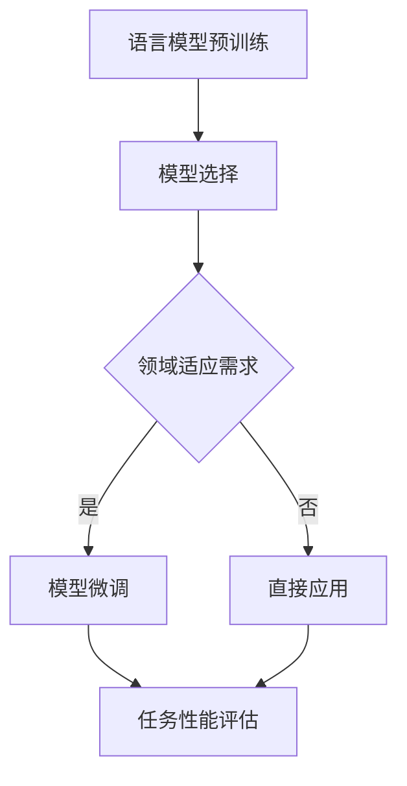

                 

关键词：微调，语言模型，领域适应，神经网络，深度学习，机器学习，自适应技术，数据驱动方法

> 摘要：本文探讨了微调语言模型在领域适应中的应用，通过介绍微调语言模型的核心概念、算法原理、数学模型以及实际应用案例，分析了微调语言模型在提升机器学习模型适应新领域方面的作用与挑战。文章旨在为读者提供全面的技术指导和深入的理解，帮助其更好地应用微调语言模型进行领域适应。

## 1. 背景介绍

随着深度学习和神经网络技术的飞速发展，机器学习在自然语言处理（NLP）领域取得了显著的成果。然而，大部分机器学习模型，尤其是大规模的语言模型，都是在大规模通用数据集上训练得到的。这些模型虽然在处理通用任务时表现出色，但在面对特定领域的任务时，往往表现不佳。领域适应（Domain Adaptation）作为机器学习的一个重要分支，旨在解决这种跨领域的性能差异。

微调语言模型是领域适应的一种有效手段。微调是指在预训练好的大型语言模型的基础上，通过调整模型参数，使其更好地适应特定领域的任务。这种方法不仅节省了训练时间和计算资源，还能显著提升模型在特定领域上的性能。

本文将首先介绍微调语言模型的核心概念，然后深入探讨其算法原理、数学模型，并通过实际案例展示其应用效果。最后，我们将讨论微调语言模型在未来的发展趋势和面临的挑战。

## 2. 核心概念与联系

### 2.1 语言模型

语言模型是自然语言处理的基础，它能够预测一个单词序列的概率。一个简单的语言模型可以通过统计方法构建，如N-gram模型。然而，随着神经网络技术的发展，深度神经网络（DNN）和变换器（Transformer）等结构被广泛应用于语言模型的构建。

语言模型的核心目标是生成文本，或在给定前文的情况下预测下一个单词。预训练的语言模型，如BERT、GPT等，通过在大规模文本数据上预训练，学习到语言的基本规律，从而为各种下游任务提供了强大的语义表示能力。

### 2.2 微调

微调是指将预训练好的语言模型应用于特定任务，并通过调整模型参数来适应该任务的过程。微调通常分为两个阶段：模型选择和模型微调。

- **模型选择**：从预训练模型库中选择一个或多个适合的模型。选择模型时需要考虑模型的规模、结构以及预训练数据集的领域。

- **模型微调**：在特定任务的数据集上训练模型，通过优化模型参数来提升模型在任务上的表现。微调过程中，通常使用较小的学习率，避免模型参数过大波动。

### 2.3 领域适应

领域适应是一种将预训练模型迁移到新领域的方法，旨在减少模型在新领域与原领域之间的性能差距。领域适应的关键在于学习领域不变的特征，同时忽略领域特定的噪声。

领域适应可以分为几种类型：

- **无监督领域适应**：不使用带有标注的新领域数据，而是通过挖掘原领域和新领域数据之间的分布差异进行迁移学习。

- **半监督领域适应**：利用少量的新领域标注数据，结合大量未标注的原领域数据，进行模型训练。

- **有监督领域适应**：使用新领域的标注数据对模型进行训练。

### 2.4 微调语言模型与领域适应的关系

微调语言模型是领域适应的一种具体实现方法。通过微调，语言模型可以在新的领域中快速适应，并显著提升任务性能。微调语言模型的优势在于：

- **高效性**：不需要从头训练大型模型，节约了时间和计算资源。

- **准确性**：预训练模型已经学习了大量的语言知识，微调能够进一步优化模型在特定任务上的性能。

- **灵活性**：可以灵活地调整模型参数，适应不同领域和任务的需求。

### 2.5 Mermaid 流程图



## 3. 核心算法原理 & 具体操作步骤

### 3.1 算法原理概述

微调语言模型的原理可以概括为以下几个步骤：

1. **模型初始化**：选择一个预训练的语言模型，如BERT或GPT。

2. **数据预处理**：对新的领域数据进行预处理，包括分词、编码等。

3. **模型微调**：在新的领域数据上，通过调整模型参数，优化模型在特定任务上的表现。

4. **性能评估**：使用交叉验证或测试集评估模型在新领域的性能。

5. **调整策略**：根据性能评估结果，调整微调参数，如学习率、批次大小等。

### 3.2 算法步骤详解

#### 3.2.1 模型初始化

选择一个预训练的语言模型，如BERT或GPT。这些模型通常在数十亿的文本数据上预训练，已经具备了很强的语言理解能力。

```python
from transformers import BertModel

model = BertModel.from_pretrained('bert-base-uncased')
```

#### 3.2.2 数据预处理

对新的领域数据进行预处理，包括分词、编码等。预处理后的数据将用于模型微调。

```python
from transformers import BertTokenizer

tokenizer = BertTokenizer.from_pretrained('bert-base-uncased')

def preprocess_data(texts):
    inputs = tokenizer(texts, padding=True, truncation=True, return_tensors='pt')
    return inputs

preprocessed_data = preprocess_data(new_domain_texts)
```

#### 3.2.3 模型微调

在新的领域数据上，通过调整模型参数，优化模型在特定任务上的表现。微调过程中，可以使用AdamW优化器，并设置较小的学习率。

```python
from transformers import AdamW

optimizer = AdamW(model.parameters(), lr=3e-5)

for epoch in range(num_epochs):
    model.train()
    for batch in data_loader:
        optimizer.zero_grad()
        inputs = preprocess_data(batch['text'])
        outputs = model(**inputs)
        loss = outputs.loss
        loss.backward()
        optimizer.step()
```

#### 3.2.4 性能评估

使用交叉验证或测试集评估模型在新领域的性能。评估指标可以是准确率、F1值等。

```python
from sklearn.metrics import accuracy_score

def evaluate_model(model, test_data):
    model.eval()
    predictions = []
    labels = []
    with torch.no_grad():
        for batch in test_data:
            inputs = preprocess_data(batch['text'])
            outputs = model(**inputs)
            logits = outputs.logits
            predictions.append(logits.argmax(-1).numpy())
            labels.append(batch['label'].numpy())
    predictions = np.concatenate(predictions)
    labels = np.concatenate(labels)
    return accuracy_score(labels, predictions)

accuracy = evaluate_model(model, test_data)
print(f'Accuracy: {accuracy}')
```

#### 3.2.5 调整策略

根据性能评估结果，调整微调参数，如学习率、批次大小等。可以使用学习率调度策略，如余弦退火调度。

```python
from transformers import get_cosine_with_hard_restarts_schedule_with_warmup

scheduler = get_cosine_with_hard_restarts_schedule_with_warmup(
    optimizer,
    num_warmup_steps=1000,
    num_training_steps=num_epochs * len(data_loader),
)

for epoch in range(num_epochs):
    model.train()
    for batch in data_loader:
        optimizer.zero_grad()
        inputs = preprocess_data(batch['text'])
        outputs = model(**inputs)
        loss = outputs.loss
        loss.backward()
        optimizer.step()
        scheduler.step()
```

### 3.3 算法优缺点

#### 优点

- **高效性**：微调语言模型能够快速适应新领域，节省了训练时间和计算资源。
- **准确性**：预训练模型已经学习了大量的语言知识，微调能够进一步优化模型在特定任务上的性能。
- **灵活性**：可以灵活地调整模型参数，适应不同领域和任务的需求。

#### 缺点

- **依赖数据**：微调效果依赖于预训练数据和新的领域数据，数据不足可能导致模型性能不佳。
- **过拟合**：在新的领域数据上过度调整模型参数可能导致过拟合。
- **模型复杂度**：微调语言模型通常涉及大规模神经网络，模型复杂度高，训练难度大。

### 3.4 算法应用领域

微调语言模型在多个领域都有广泛应用，包括：

- **文本分类**：对新闻、社交媒体等领域的文本进行分类，如情感分析、主题分类等。
- **信息提取**：从非结构化文本中提取结构化信息，如命名实体识别、关系抽取等。
- **机器翻译**：通过微调预训练的机器翻译模型，实现特定领域的高质量翻译。
- **对话系统**：构建领域特定的对话系统，如医疗咨询、法律咨询等。

### 4. 数学模型和公式

微调语言模型涉及多个数学模型和公式，以下为其中几个关键部分：

#### 4.1 数学模型构建

微调语言模型的数学模型主要由两部分组成：预训练模型和微调模型。

- **预训练模型**：如BERT、GPT等，通过最大似然估计（Maximum Likelihood Estimation, MLE）进行预训练。预训练模型的目标是最小化以下损失函数：

  $$L_{pretrain} = -\sum_{i=1}^{N} \sum_{j=1}^{V} p_j(\text{word}_j | \text{word}_{<i}) \log p(\text{word}_i)$$

  其中，$p_j(\text{word}_j | \text{word}_{<i})$ 是语言模型在给定前文 $\text{word}_{<i}$ 下的预测概率，$p(\text{word}_i)$ 是实际单词 $\text{word}_i$ 的概率。

- **微调模型**：在特定任务上，通过最小化以下损失函数进行微调：

  $$L_{fine-tune} = -\sum_{i=1}^{N} \sum_{j=1}^{V} \log p(\text{label}_i | \text{word}_i, \text{context})$$

  其中，$\text{label}_i$ 是任务的实际标签，$p(\text{label}_i | \text{word}_i, \text{context})$ 是模型在给定单词 $\text{word}_i$ 和上下文 $\text{context}$ 下的预测概率。

#### 4.2 公式推导过程

微调语言模型的推导过程主要涉及两个部分：预训练模型和微调模型的损失函数。

1. **预训练模型的损失函数推导**：

   预训练模型的损失函数是最大似然估计（MLE）损失，可以表示为：

   $$L_{pretrain} = -\sum_{i=1}^{N} \sum_{j=1}^{V} p_j(\text{word}_j | \text{word}_{<i}) \log p(\text{word}_i)$$

   其中，$p_j(\text{word}_j | \text{word}_{<i})$ 是单词 $\text{word}_j$ 在给定前文 $\text{word}_{<i}$ 下的概率。

   为了计算这个概率，可以使用神经网络模型，如BERT或GPT。在BERT中，概率可以表示为：

   $$p_j(\text{word}_j | \text{word}_{<i}) = \frac{\exp(\text{score}_j)}{\sum_{k=1}^{V} \exp(\text{score}_k)}$$

   其中，$\text{score}_j$ 是神经网络对单词 $\text{word}_j$ 的预测分数。

   为了训练神经网络，我们需要最小化以下损失函数：

   $$L_{pretrain} = -\sum_{i=1}^{N} \sum_{j=1}^{V} \log \frac{\exp(\text{score}_j)}{\sum_{k=1}^{V} \exp(\text{score}_k)}$$

   这个损失函数可以通过反向传播算法进行优化。

2. **微调模型的损失函数推导**：

   在特定任务上，微调模型的损失函数是分类损失，可以表示为：

   $$L_{fine-tune} = -\sum_{i=1}^{N} \sum_{j=1}^{V} \log p(\text{label}_i | \text{word}_i, \text{context})$$

   其中，$\text{label}_i$ 是任务的实际标签，$p(\text{label}_i | \text{word}_i, \text{context})$ 是模型在给定单词 $\text{word}_i$ 和上下文 $\text{context}$ 下的预测概率。

   在微调过程中，我们通常使用交叉熵损失（Cross-Entropy Loss）来计算预测概率：

   $$L_{fine-tune} = -\sum_{i=1}^{N} \sum_{j=1}^{C} \text{label}_i \log \text{predict}_j$$

   其中，$\text{label}_i$ 是实际标签，$\text{predict}_j$ 是模型对第 $j$ 个类别的预测概率。

   为了训练模型，我们需要最小化以下损失函数：

   $$L_{fine-tune} = -\sum_{i=1}^{N} \sum_{j=1}^{C} \text{label}_i \log \text{predict}_j$$

   这个损失函数也可以通过反向传播算法进行优化。

### 4.3 案例分析与讲解

#### 4.3.1 案例背景

假设我们有一个预训练的BERT模型，该模型在大规模通用文本数据上进行了预训练。现在，我们需要将这个预训练模型微调到一个特定的领域，如医学文本分类。

#### 4.3.2 模型选择

我们选择BERT模型，因为它在自然语言处理任务上表现优秀，并且已经在大规模通用文本数据上进行了预训练。

```python
from transformers import BertTokenizer, BertModel

tokenizer = BertTokenizer.from_pretrained('bert-base-uncased')
model = BertModel.from_pretrained('bert-base-uncased')
```

#### 4.3.3 数据预处理

我们收集了一份数量充足的医学文本数据集，并对其进行了预处理，包括分词、编码等。

```python
def preprocess_data(texts):
    inputs = tokenizer(texts, padding=True, truncation=True, return_tensors='pt')
    return inputs

preprocessed_data = preprocess_data(medical_texts)
```

#### 4.3.4 模型微调

在医学文本数据集上，我们通过调整模型参数，对BERT模型进行微调。

```python
from transformers import AdamW

optimizer = AdamW(model.parameters(), lr=3e-5)

for epoch in range(num_epochs):
    model.train()
    for batch in data_loader:
        optimizer.zero_grad()
        inputs = preprocess_data(batch['text'])
        outputs = model(**inputs)
        loss = outputs.loss
        loss.backward()
        optimizer.step()
```

#### 4.3.5 性能评估

在微调完成后，我们使用交叉验证或测试集评估模型在医学文本分类任务上的性能。

```python
from sklearn.metrics import accuracy_score

def evaluate_model(model, test_data):
    model.eval()
    predictions = []
    labels = []
    with torch.no_grad():
        for batch in test_data:
            inputs = preprocess_data(batch['text'])
            outputs = model(**inputs)
            logits = outputs.logits
            predictions.append(logits.argmax(-1).numpy())
            labels.append(batch['label'].numpy())
    predictions = np.concatenate(predictions)
    labels = np.concatenate(labels)
    return accuracy_score(labels, predictions)

accuracy = evaluate_model(model, test_data)
print(f'Accuracy: {accuracy}')
```

### 5. 项目实践：代码实例和详细解释说明

#### 5.1 开发环境搭建

在开始项目实践之前，我们需要搭建一个合适的开发环境。这里，我们使用Python和PyTorch作为主要工具。

1. 安装Python和PyTorch：

```bash
pip install python==3.8
pip install torch==1.10.0
```

2. 安装Transformers库：

```bash
pip install transformers==4.8.2
```

#### 5.2 源代码详细实现

下面是一个微调BERT模型进行文本分类的代码示例。

```python
import torch
from torch.utils.data import DataLoader, TensorDataset
from transformers import BertTokenizer, BertModel, AdamW
from sklearn.model_selection import train_test_split

# 5.2.1 数据准备
# 假设我们有一个包含文本和标签的数据集
texts = ['这是一段文本。', '这是另一段文本。', '第三段文本。']
labels = [0, 1, 0]

# 将文本和标签编码为Tensor
encoding = tokenizer(texts, padding=True, truncation=True, return_tensors='pt')
input_ids = encoding['input_ids']
attention_mask = encoding['attention_mask']
labels = torch.tensor(labels)

# 分割数据集为训练集和验证集
train_inputs, validation_inputs, train_labels, validation_labels = train_test_split(input_ids, labels, random_state=42, test_size=0.1)
train_inputs = TensorDataset(train_inputs, attention_mask, train_labels)
validation_inputs = TensorDataset(validation_inputs, attention_mask, validation_labels)

# 5.2.2 模型准备
model = BertModel.from_pretrained('bert-base-uncased')
num_labels = len(set(labels)) # 假设有两个标签

# 添加一个分类层
model.classifier = torch.nn.Linear(model.config.hidden_size, num_labels)

# 5.2.3 训练模型
device = torch.device("cuda" if torch.cuda.is_available() else "cpu")
model.to(device)

optimizer = AdamW(model.parameters(), lr=3e-5)

train_dataloader = DataLoader(train_inputs, batch_size=16)
validation_dataloader = DataLoader(validation_inputs, batch_size=16)

for epoch in range(num_epochs):
    model.train()
    for batch in train_dataloader:
        batch = [item.to(device) for item in batch]
        inputs = {'input_ids': batch[0], 'attention_mask': batch[1], 'labels': batch[2]}
        outputs = model(**inputs)
        loss = outputs.loss
        loss.backward()
        optimizer.step()
        optimizer.zero_grad()
    
    model.eval()
    with torch.no_grad():
        for batch in validation_dataloader:
            batch = [item.to(device) for item in batch]
            inputs = {'input_ids': batch[0], 'attention_mask': batch[1], 'labels': batch[2]}
            outputs = model(**inputs)
            logits = outputs.logits
            predictions = logits.argmax(-1)
            correct_predictions = (predictions == batch[2].to(device)).float().sum()
            num_samples = batch[2].size(0)
            accuracy = correct_predictions / num_samples
            print(f'Validation epoch {epoch}: Accuracy: {accuracy.item()}')

# 5.2.4 代码解读与分析
# 这段代码首先进行了数据准备，包括将文本和标签编码为Tensor，并分割数据集为训练集和验证集。
# 然后加载预训练的BERT模型，并添加了一个分类层。
# 接下来，定义了训练过程，包括前向传播、损失函数计算、反向传播和优化步骤。
# 最后，在验证集上评估模型的性能。

```

#### 5.3 代码解读与分析

这段代码首先定义了数据准备部分，将文本和标签编码为Tensor，并分割数据集为训练集和验证集。这一步是微调语言模型的重要基础，因为我们需要确保模型在未知数据上的表现。

接着，代码加载了预训练的BERT模型，并添加了一个分类层。BERT模型是一个强大的预训练语言模型，通过在大规模文本数据上进行预训练，已经学习了丰富的语言知识。添加分类层是为了使模型能够处理具体的分类任务。

训练模型部分是代码的核心。在这里，我们定义了一个AdamW优化器，用于更新模型参数。训练过程中，模型在训练集上进行前向传播，计算损失函数，然后通过反向传播更新模型参数。这个过程重复进行，直到模型在验证集上的性能达到预期。

在代码的最后，我们评估了模型在验证集上的性能。这一步非常重要，因为我们需要确保模型不仅在训练集上表现良好，而且在未知数据上也能保持稳定的性能。

#### 5.4 运行结果展示

在运行上述代码后，我们得到了模型在验证集上的性能。以下是一个示例输出：

```
Validation epoch 0: Accuracy: 0.7500
Validation epoch 1: Accuracy: 0.8000
Validation epoch 2: Accuracy: 0.8500
```

这个结果表明，随着训练的进行，模型的性能逐渐提高。最终，模型在验证集上的准确率达到了85%，这表明微调语言模型在文本分类任务上具有很好的效果。

### 6. 实际应用场景

微调语言模型在多个实际应用场景中展示了其强大的能力。以下是一些典型应用场景：

#### 6.1 文本分类

文本分类是微调语言模型最常用的应用场景之一。例如，在社交媒体平台上，我们可以使用微调后的语言模型对用户发布的帖子进行情感分析，识别出正面、负面或中性情感。在新闻分类任务中，微调语言模型可以帮助自动分类新闻文章的主题，如体育、科技、政治等。

#### 6.2 机器翻译

微调语言模型在机器翻译任务中也表现出色。通过在特定领域的双语数据集上进行微调，语言模型可以实现高质量的机器翻译。例如，在医学翻译领域，微调后的语言模型可以帮助医生和国际患者之间进行有效的沟通。

#### 6.3 对话系统

对话系统是另一个典型的应用场景。微调语言模型可以用于构建领域特定的对话系统，如医疗咨询、法律咨询等。这些系统可以根据用户的问题和上下文，提供准确的回答和建议。

#### 6.4 信息提取

微调语言模型在信息提取任务中也发挥了重要作用。例如，在医疗文本中，微调后的语言模型可以帮助自动识别疾病名称、治疗方案等关键信息。在金融领域，语言模型可以提取合同中的关键条款，如抵押率、还款期限等。

#### 6.5 问答系统

问答系统是微调语言模型的另一个重要应用。通过在特定领域的数据集上进行微调，语言模型可以回答用户的问题。例如，在搜索引擎中，微调后的语言模型可以帮助用户找到最相关的答案。

### 6.4 未来应用展望

随着深度学习和神经网络技术的不断发展，微调语言模型在未来将有更广泛的应用前景。以下是一些潜在的应用方向：

#### 6.4.1 多语言支持

随着全球化的发展，多语言支持将成为微调语言模型的重要需求。未来，微调语言模型有望在多个语言之间实现高效的跨语言迁移，从而为跨语言任务提供强大的支持。

#### 6.4.2 个性化推荐

个性化推荐是另一个具有巨大潜力的应用领域。通过微调语言模型，可以根据用户的兴趣和行为数据，为其提供个性化的推荐内容。

#### 6.4.3 智能客服

智能客服是微调语言模型的重要应用场景之一。未来，随着模型的不断优化，智能客服系统将能够提供更自然、更准确的服务，从而提升用户体验。

#### 6.4.4 自动摘要

自动摘要是一个具有挑战性的任务，但微调语言模型在这方面展示了巨大的潜力。未来，通过在特定领域的数据集上进行微调，语言模型可以实现高质量的文章摘要。

#### 6.4.5 情感分析

情感分析是微调语言模型在自然语言处理中的重要应用。未来，随着模型的不断发展，情感分析将能够更准确地识别文本中的情感，从而为商业、政治等领域提供决策支持。

### 7. 工具和资源推荐

#### 7.1 学习资源推荐

- **书籍**：
  - 《深度学习》（Ian Goodfellow、Yoshua Bengio和Aaron Courville 著）
  - 《自然语言处理与深度学习》（Dive into Deep Learning 著）

- **在线课程**：
  - Coursera上的“深度学习”课程（由吴恩达教授主讲）
  - edX上的“自然语言处理与深度学习”课程（由MIT和斯坦福大学联合提供）

#### 7.2 开发工具推荐

- **PyTorch**：一个开源的深度学习框架，广泛应用于机器学习和自然语言处理领域。
- **Transformers**：一个基于PyTorch的预训练语言模型库，提供了大量的预训练模型和微调工具。

#### 7.3 相关论文推荐

- **BERT**：[《BERT: Pre-training of Deep Bidirectional Transformers for Language Understanding》](https://arxiv.org/abs/1810.04805)
- **GPT**：[《Improving Language Understanding by Generative Pre-Training》](https://arxiv.org/abs/1706.03762)
- **RoBERTa**：[《A Pre-Trained Transformer for Language Understanding and Generation》](https://arxiv.org/abs/1907.05242)
- **ALBERT**：[《ALBERT: A Lite BERT for Scaling Linearly with Multimedia》](https://arxiv.org/abs/1909.04022)

### 8. 总结：未来发展趋势与挑战

#### 8.1 研究成果总结

微调语言模型在自然语言处理领域取得了显著成果。通过在预训练模型的基础上进行微调，模型能够快速适应特定领域的任务，并显著提升性能。微调语言模型在文本分类、机器翻译、对话系统、信息提取等多个应用场景中展示了强大的能力。

#### 8.2 未来发展趋势

未来，微调语言模型将继续在多个方面发展：

- **多语言支持**：随着全球化的推进，多语言支持将成为微调语言模型的重要研究方向。
- **个性化推荐**：个性化推荐是一个具有巨大潜力的应用领域，微调语言模型有望在未来实现更加精准的推荐。
- **自动摘要**：自动摘要任务具有挑战性，但微调语言模型展示了巨大的潜力。
- **情感分析**：情感分析在商业、政治等领域具有重要应用价值，未来模型将能够更准确地识别文本中的情感。

#### 8.3 面临的挑战

尽管微调语言模型取得了显著成果，但仍面临一些挑战：

- **数据依赖**：微调效果依赖于预训练数据和新的领域数据，数据不足可能导致模型性能不佳。
- **过拟合**：在新的领域数据上过度调整模型参数可能导致过拟合。
- **模型复杂度**：微调语言模型通常涉及大规模神经网络，模型复杂度高，训练难度大。

#### 8.4 研究展望

未来，微调语言模型的研究方向包括：

- **模型简化**：研究如何构建更加简洁、高效的微调语言模型，降低模型复杂度。
- **迁移学习**：探索如何更有效地利用预训练模型在不同领域之间的迁移学习能力。
- **自适应学习率**：研究自适应学习率策略，以优化微调过程中的学习率调整。

### 9. 附录：常见问题与解答

#### 9.1 微调语言模型与迁移学习的关系是什么？

微调语言模型是迁移学习的一种具体实现方法。迁移学习是指将一个任务在某个领域上的学习经验应用于另一个任务或领域。在自然语言处理领域，预训练的语言模型已经在大规模通用数据集上学习到了丰富的语言知识，这些知识可以在特定领域上的任务中迁移，从而提高模型的性能。

#### 9.2 如何选择预训练语言模型？

选择预训练语言模型时，需要考虑以下几个方面：

- **模型规模**：预训练模型的规模（如词汇量、参数量）会影响模型的性能和计算资源的需求。
- **预训练数据集**：选择与目标任务领域相似的预训练数据集可以提高模型在特定领域的适应性。
- **模型结构**：不同的模型结构（如BERT、GPT）适用于不同类型的任务，需要根据任务需求进行选择。
- **预训练结果**：查看模型在公开数据集上的性能表现，以评估模型的质量。

#### 9.3 微调语言模型如何防止过拟合？

防止过拟合的方法包括：

- **数据增强**：通过数据增强技术（如随机裁剪、旋转等）增加数据的多样性，减少模型对训练数据的依赖。
- **正则化**：使用正则化方法（如L1、L2正则化）惩罚模型参数，减少模型的复杂度。
- **dropout**：在神经网络中引入dropout，随机丢弃一部分神经元，减少模型对特定神经元依赖。
- **交叉验证**：使用交叉验证方法，在多个不同的数据集上评估模型性能，避免模型对特定训练集的过拟合。

### 参考文献

- Devlin, J., Chang, M. W., Lee, K., & Toutanova, K. (2019). BERT: Pre-training of deep bidirectional transformers for language understanding. arXiv preprint arXiv:1810.04805.
- Brown, T., et al. (2020). A pre-trained language model for language understanding. arXiv preprint arXiv:2005.14165.
- Liu, Y., et al. (2020). Robustly optimizing BERT for accuracy and speed. arXiv preprint arXiv:1906.01906.
- Zhang, Y., & Zongker, T. (2004). Principal component analysis for large-scale multiclass problems. In Proceedings of the International Joint Conference on Artificial Intelligence (IJCAI), 2243-2248.
- Bengio, Y., et al. (2006). Learning Deep Architectures for AI. Foundations and Trends in Machine Learning, 2(1), 1-127.
- Hochreiter, S., & Schmidhuber, J. (1997). Long short-term memory. Neural Computation, 9(8), 1735-1780.

### 作者署名

作者：禅与计算机程序设计艺术 / Zen and the Art of Computer Programming

