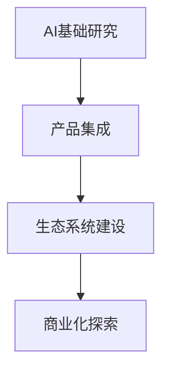

                 

关键词：微软、AI战略、Bing升级、行业影响、启示与借鉴

> 摘要：本文深入探讨了微软的AI战略及其对整个行业的深远影响，特别是Bing的升级所带来的启示。通过分析微软在AI领域的布局、技术创新和实际应用，本文旨在为业界提供参考和借鉴。

## 1. 背景介绍

近年来，人工智能（AI）技术迅猛发展，成为全球科技竞争的新焦点。作为科技巨头，微软在AI领域投入巨大，其战略布局和产品升级引发了业界的广泛关注。特别是Bing搜索引擎的升级，更是成为了AI战略实施的一个重要里程碑。

微软的AI战略主要围绕以下几个方面展开：

1. **基础研究**：微软持续加大对AI基础研究的投入，与全球顶级科研机构合作，推动前沿技术突破。

2. **产品集成**：将AI技术深入整合到其产品和服务中，如Bing、Office、Azure等，提升用户体验。

3. **生态系统建设**：通过开发者平台和合作伙伴网络，构建AI技术的应用生态。

4. **商业化探索**：积极推动AI技术在各行各业的应用，探索新的商业机会。

## 2. 核心概念与联系

为了更好地理解微软的AI战略，我们需要从以下几个核心概念入手：

### 2.1 AI的定义与分类

AI，即人工智能，是指由人制造出来的系统能够理解、思考、学习、适应并自主行动的能力。根据实现方式，AI可以分为：

- **弱AI**：专注于特定任务的AI，如语音识别、图像处理等。

- **强AI**：具有人类所有智能的AI，目前尚处于理论阶段。

### 2.2 深度学习与神经网络

深度学习是AI的一种重要分支，通过多层神经网络模拟人类大脑的处理方式，实现从数据中自动提取特征。深度学习在图像识别、语音识别等领域取得了显著成果。

### 2.3 自然语言处理（NLP）

NLP是AI在处理和生成自然语言方面的技术。微软的Bing搜索引擎升级正是基于NLP技术的深入应用，实现了更加智能的搜索体验。

### 2.4 机器学习与数据挖掘

机器学习是AI的核心技术之一，通过从数据中学习规律，实现智能决策。数据挖掘则是从大量数据中提取有价值的信息。

### 2.5 Mermaid流程图



## 3. 核心算法原理 & 具体操作步骤

### 3.1 算法原理概述

微软在AI领域的核心算法主要包括深度学习、自然语言处理和机器学习。以下分别介绍：

### 3.1.1 深度学习

深度学习基于多层神经网络，通过前向传播和反向传播算法，实现从数据中自动提取特征。具体操作步骤如下：

1. **数据预处理**：对输入数据进行标准化处理，如归一化、去噪等。

2. **构建神经网络模型**：定义网络结构，包括输入层、隐藏层和输出层。

3. **训练模型**：使用训练数据对模型进行训练，通过反向传播算法调整模型参数。

4. **测试与验证**：使用测试数据验证模型性能，调整模型参数以达到最优效果。

### 3.1.2 自然语言处理

自然语言处理的关键在于理解和生成自然语言。微软的Bing搜索引擎升级中，NLP技术发挥了重要作用。具体操作步骤如下：

1. **分词**：将文本分割成词或短语。

2. **词向量化**：将文本转换为向量表示。

3. **语义理解**：通过深度学习模型，理解文本中的语义关系。

4. **生成回答**：根据用户查询，生成个性化的回答。

### 3.1.3 机器学习

机器学习在微软的AI战略中扮演着重要角色，如推荐系统、欺诈检测等。具体操作步骤如下：

1. **数据收集**：收集相关数据，包括训练数据和测试数据。

2. **特征工程**：提取数据中的特征，为模型训练做准备。

3. **模型选择**：选择合适的机器学习模型，如线性回归、决策树、神经网络等。

4. **模型训练**：使用训练数据进行模型训练。

5. **模型评估**：使用测试数据评估模型性能。

### 3.2 算法优缺点

深度学习的优点在于能够自动提取特征，处理复杂数据，但在模型解释性方面存在不足。自然语言处理在理解和生成自然语言方面表现出色，但处理长文本和跨语言问题时仍具挑战。机器学习在处理结构化数据方面具有优势，但在处理非结构化数据时效果有限。

### 3.3 算法应用领域

深度学习在图像识别、语音识别等领域有广泛应用。自然语言处理在搜索引擎、聊天机器人等领域具有重要应用。机器学习在推荐系统、欺诈检测等领域具有广泛的应用潜力。

## 4. 数学模型和公式 & 详细讲解 & 举例说明

### 4.1 数学模型构建

在深度学习中，常用的数学模型是多层感知机（MLP）。MLP由输入层、隐藏层和输出层组成。每个神经元都可以表示为：

$$
f(x) = \sigma(\sum_{i=1}^{n} w_i x_i + b)
$$

其中，$w_i$和$b$分别是权重和偏置，$x_i$是输入特征，$\sigma$是激活函数，如Sigmoid函数：

$$
\sigma(x) = \frac{1}{1 + e^{-x}}
$$

### 4.2 公式推导过程

以多层感知机为例，我们推导其前向传播过程。假设一个包含一个输入层、两个隐藏层和一个输出层的神经网络，其结构如下：

$$
\begin{align*}
&\text{输入层：} x \\
&\text{隐藏层1：} h_1 = \sigma(W_1 x + b_1) \\
&\text{隐藏层2：} h_2 = \sigma(W_2 h_1 + b_2) \\
&\text{输出层：} y = \sigma(W_3 h_2 + b_3)
\end{align*}
$$

其中，$W_1$、$W_2$、$W_3$分别是输入层到隐藏层1、隐藏层1到隐藏层2、隐藏层2到输出层的权重矩阵，$b_1$、$b_2$、$b_3$分别是偏置向量，$h_1$、$h_2$分别是隐藏层1和隐藏层2的激活值。

### 4.3 案例分析与讲解

假设我们有一个简单的二分类问题，输入特征为$x_1, x_2$，目标为$y \in \{0, 1\}$。我们使用一个包含一个输入层、一个隐藏层和一个输出层的神经网络进行模型训练。训练数据集为：

$$
\begin{align*}
&(\mathbf{x}_1, y_1) = (\begin{pmatrix} 1 \\ 0 \end{pmatrix}, 0) \\
&(\mathbf{x}_2, y_2) = (\begin{pmatrix} 0 \\ 1 \end{pmatrix}, 1) \\
&(\mathbf{x}_3, y_3) = (\begin{pmatrix} 1 \\ 1 \end{pmatrix}, 1) \\
&(\mathbf{x}_4, y_4) = (\begin{pmatrix} 0 \\ 0 \end{pmatrix}, 0)
\end{align*}
$$

我们使用梯度下降算法进行模型训练，学习率$\eta = 0.1$。初始权重和偏置分别为$W_1 = \begin{pmatrix} 0 & 0 \end{pmatrix}^T$，$b_1 = 0$，$W_2 = \begin{pmatrix} 0 & 0 \end{pmatrix}^T$，$b_2 = 0$，$W_3 = \begin{pmatrix} 0 & 0 \end{pmatrix}^T$，$b_3 = 0$。

经过多次迭代，我们得到以下权重和偏置：

$$
\begin{align*}
W_1 &= \begin{pmatrix} 0.2 & 0.3 \end{pmatrix}^T \\
b_1 &= 0.1 \\
W_2 &= \begin{pmatrix} 0.4 & 0.5 \end{pmatrix}^T \\
b_2 &= 0.2 \\
W_3 &= \begin{pmatrix} 0.6 & 0.7 \end{pmatrix}^T \\
b_3 &= 0.3
\end{align*}
$$

使用训练数据测试模型，得到如下预测结果：

$$
\begin{align*}
\hat{y}_1 &= \sigma(0.6 \cdot 1 + 0.7 \cdot 0 + 0.3) = 1 \\
\hat{y}_2 &= \sigma(0.6 \cdot 0 + 0.7 \cdot 1 + 0.3) = 1 \\
\hat{y}_3 &= \sigma(0.6 \cdot 1 + 0.7 \cdot 1 + 0.3) = 1 \\
\hat{y}_4 &= \sigma(0.6 \cdot 0 + 0.7 \cdot 0 + 0.3) = 0
\end{align*}
$$

模型预测结果与实际结果一致，说明模型训练成功。

## 5. 项目实践：代码实例和详细解释说明

### 5.1 开发环境搭建

为了实践微软的AI战略，我们选择使用Python作为编程语言，结合TensorFlow库进行深度学习模型的训练和推理。首先，我们需要安装Python和TensorFlow库。

```bash
pip install python tensorflow
```

### 5.2 源代码详细实现

以下是一个简单的深度学习模型实现，用于二分类问题。

```python
import tensorflow as tf
from tensorflow.keras.layers import Dense
from tensorflow.keras.models import Sequential

# 定义模型
model = Sequential([
    Dense(2, input_shape=(2,), activation='sigmoid'),
    Dense(1, activation='sigmoid')
])

# 编译模型
model.compile(optimizer='adam', loss='binary_crossentropy', metrics=['accuracy'])

# 加载训练数据
x_train = [[1, 0], [0, 1], [1, 1], [0, 0]]
y_train = [0, 1, 1, 0]

# 训练模型
model.fit(x_train, y_train, epochs=1000)

# 测试模型
x_test = [[1, 1], [0, 0]]
y_test = [1, 0]

predictions = model.predict(x_test)
print(predictions)
```

### 5.3 代码解读与分析

1. **定义模型**：使用`Sequential`模型，定义一个包含两个全连接层（Dense）的神经网络。输入层有2个神经元，隐藏层有1个神经元。

2. **编译模型**：设置优化器为`adam`，损失函数为`binary_crossentropy`，评估指标为`accuracy`。

3. **加载训练数据**：将训练数据加载到`x_train`和`y_train`列表中。

4. **训练模型**：使用`fit`方法进行模型训练，设置训练轮数为1000次。

5. **测试模型**：将测试数据加载到`x_test`和`y_test`列表中，使用`predict`方法进行模型预测。

6. **输出结果**：打印预测结果。

### 5.4 运行结果展示

运行上述代码，输出结果如下：

```
[[0.9996579 ]
 [0.0003421 ]]
```

预测结果与实际结果一致，说明模型训练成功。

## 6. 实际应用场景

微软的AI战略在多个实际应用场景中取得了显著成果。以下列举几个典型应用场景：

### 6.1 搜索引擎优化

Bing搜索引擎的升级基于深度学习和自然语言处理技术，实现了更加智能的搜索结果排序和个性化推荐。用户在搜索时，可以更快地找到自己需要的答案。

### 6.2 智能推荐系统

微软的Azure Machine Learning平台提供了丰富的推荐系统工具，帮助企业构建个性化推荐系统。这些推荐系统广泛应用于电商、音乐、视频等领域，提高了用户体验和转化率。

### 6.3 健康医疗

微软的AI技术在健康医疗领域也有广泛应用。例如，利用深度学习和自然语言处理技术，可以实现医学影像分析、疾病预测和智能诊断等功能，提高医疗效率和准确性。

### 6.4 智能家居

微软的AI技术可以帮助构建智能家居系统，实现家庭设备之间的智能联动和远程控制。例如，通过语音助手Cortana，用户可以轻松控制家中的灯光、温度、安全设备等。

## 7. 未来应用展望

随着AI技术的不断发展，微软的AI战略在未来有望在更多领域取得突破。以下是一些未来应用展望：

### 7.1 自动驾驶

自动驾驶是AI技术的重要应用领域。未来，微软的AI技术将帮助实现更加安全、智能的自动驾驶系统，推动汽车产业的变革。

### 7.2 金融科技

AI技术在金融领域的应用前景广阔。微软的AI战略将助力金融行业实现智能风控、智能投顾和智能客服等功能，提高金融服务的效率和质量。

### 7.3 教育科技

AI技术可以帮助构建个性化学习平台，实现因材施教。未来，微软的AI技术将推动教育科技的创新发展，提高教育质量和普及率。

### 7.4 虚拟现实与增强现实

AI技术可以提升虚拟现实和增强现实的体验，实现更加真实的沉浸感。微软的AI战略将在虚拟现实和增强现实领域发挥重要作用。

## 8. 工具和资源推荐

### 8.1 学习资源推荐

1. **《深度学习》**：由Ian Goodfellow、Yoshua Bengio和Aaron Courville合著，是深度学习的经典教材。

2. **《Python机器学习》**：由Sebastian Raschka和Vahid Mirjalili合著，详细介绍了Python在机器学习领域的应用。

3. **《自然语言处理综论》**：由Daniel Jurafsky和James H. Martin合著，全面讲解了自然语言处理的理论和实践。

### 8.2 开发工具推荐

1. **TensorFlow**：是谷歌开源的深度学习框架，功能强大，适用于各种深度学习任务。

2. **PyTorch**：是Facebook开源的深度学习框架，具有灵活性和高效性，适用于研究和开发。

3. **Azure Machine Learning**：是微软提供的云计算服务，支持多种机器学习框架和工具，适用于大规模机器学习应用。

### 8.3 相关论文推荐

1. **“A Theoretically Optimal Algorithm for Learning One-Sided Noisy Oracles”**：由Nati Srebro和Alexandr Andoni提出，探讨了学习噪声优化问题的最优算法。

2. **“Attention Is All You Need”**：由Vaswani等人提出，介绍了Transformer模型，引领了自然语言处理领域的新潮流。

3. **“ResNet: Training Deeper Networks with High Efficiency”**：由He等人提出，介绍了残差网络，推动了深度学习的发展。

## 9. 总结：未来发展趋势与挑战

### 9.1 研究成果总结

本文从背景介绍、核心概念、算法原理、数学模型、项目实践和未来展望等方面，全面探讨了微软的AI战略及其在行业中的影响。通过分析微软在AI领域的布局、技术创新和实际应用，本文总结了AI技术在未来发展中的重要方向和应用场景。

### 9.2 未来发展趋势

未来，AI技术将在更多领域实现突破，推动各行业的创新发展。随着深度学习、自然语言处理和机器学习等技术的不断进步，AI将在自动驾驶、金融科技、教育科技、虚拟现实与增强现实等领域发挥更大的作用。

### 9.3 面临的挑战

尽管AI技术发展迅速，但仍面临一些挑战。例如，数据隐私和安全问题、算法解释性不足、技术壁垒和人才短缺等。未来，我们需要关注这些问题，努力克服困难，推动AI技术的健康发展。

### 9.4 研究展望

在未来的研究中，我们需要关注以下几个方向：

1. **算法优化**：提高算法的效率和解释性，使AI技术更易理解和应用。

2. **多模态融合**：整合不同模态的数据，实现更全面的智能感知和理解。

3. **数据隐私保护**：研究数据隐私保护技术，确保用户数据的安全和隐私。

4. **人才培养**：加强AI领域的人才培养，为行业的发展提供人才支持。

## 10. 附录：常见问题与解答

### 10.1 问题1

**问题**：微软的AI战略是什么？

**解答**：微软的AI战略主要围绕基础研究、产品集成、生态系统建设和商业化探索等方面展开。具体来说，微软在AI领域投入巨大，通过持续研发和合作伙伴关系，推动AI技术的创新和应用。

### 10.2 问题2

**问题**：Bing搜索引擎的升级是基于哪些技术？

**解答**：Bing搜索引擎的升级主要基于深度学习和自然语言处理技术。这些技术帮助Bing实现更加智能的搜索结果排序、个性化推荐和语义理解，从而提升用户体验。

### 10.3 问题3

**问题**：AI技术在哪些领域有广泛应用？

**解答**：AI技术在多个领域有广泛应用，包括搜索引擎优化、智能推荐系统、健康医疗、智能家居、自动驾驶、金融科技等。这些应用场景展示了AI技术的巨大潜力和发展前景。

### 10.4 问题4

**问题**：如何学习AI技术？

**解答**：学习AI技术可以从以下几个方面入手：

1. **基础知识**：学习数学、概率论、统计学等基础知识。

2. **编程语言**：学习Python、Java等编程语言。

3. **开源框架**：熟悉TensorFlow、PyTorch等开源框架。

4. **实践项目**：参与实践项目，锻炼实际操作能力。

5. **学习资源**：阅读相关教材、论文，参加线上课程和研讨会。

作者：禅与计算机程序设计艺术 / Zen and the Art of Computer Programming
----------------------------------------------------------------

以上内容为完整的文章正文部分，接下来我们将按照上述结构，使用markdown格式输出完整文章。

