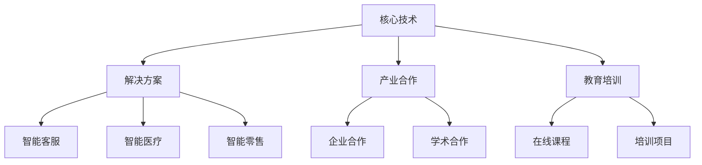

                 

关键词：微软、AI战略、行业影响、技术趋势、未来展望

> 摘要：随着人工智能技术的快速发展，微软作为全球领先的科技公司，其AI战略不仅影响了自身的发展路径，也对整个行业产生了深远的影响。本文将深入探讨微软的AI战略，分析其核心概念、算法原理、数学模型、实际应用以及未来展望，旨在为读者提供全面、深入的洞察。

## 1. 背景介绍

人工智能（AI）作为一种新兴技术，正迅速改变着全球各行各业的面貌。从自动驾驶汽车到智能语音助手，从医疗诊断到金融分析，AI技术的应用无处不在。微软作为全球科技巨头，早已认识到AI技术的重要性，并制定了全面的AI战略。这一战略不仅涵盖了技术研发，还涉及到了产业合作、教育培训等多个方面。

微软的AI战略起源于其对技术趋势的敏锐洞察。早在2016年，微软就提出了“AI for everyone”的口号，强调AI技术应该被广泛普及，为所有人所用。这一战略的核心理念是利用AI技术推动创新，提升生产效率，改善人们的生活质量。在过去的几年中，微软不断加大在AI领域的投入，推出了一系列具有行业领先水平的技术产品和服务。

## 2. 核心概念与联系

要理解微软的AI战略，首先需要了解其核心概念和架构。微软的AI战略可以分为以下几个主要部分：

1. **核心技术**：微软在AI领域的技术实力雄厚，涵盖了深度学习、自然语言处理、计算机视觉等多个领域。其中，微软的深度学习框架Cognitive Services和Azure Machine Learning是行业领先的技术产品。

2. **解决方案**：微软通过将AI技术应用于实际场景，提供了一系列的解决方案，包括智能客服、智能医疗、智能零售等。

3. **产业合作**：微软与全球各地的企业和研究机构建立了广泛的合作关系，共同推动AI技术的发展和应用。

4. **教育培训**：微软注重AI技术的普及，通过在线课程、培训项目等，帮助更多人了解和学习AI技术。

下面是一个使用Mermaid绘制的微软AI战略架构流程图：



## 3. 核心算法原理 & 具体操作步骤

### 3.1 算法原理概述

微软在AI领域的研究涵盖了多个方向，包括但不限于：

- **深度学习**：微软的研究团队在深度学习领域取得了重要突破，其研究成果在图像识别、自然语言处理等方面具有很高的准确性。

- **强化学习**：微软在强化学习领域的研究也取得了显著成果，其应用包括游戏AI、机器人控制等。

- **自然语言处理**：微软的自然语言处理技术能够实现文本分析、情感识别、机器翻译等功能，广泛应用于智能客服、智能助手等领域。

### 3.2 算法步骤详解

以下是对微软在自然语言处理领域的一种核心算法——BERT（Bidirectional Encoder Representations from Transformers）的具体操作步骤的详解：

1. **数据预处理**：首先，需要收集大量文本数据，并进行预处理，包括去除停用词、标点符号，以及将文本转换为词嵌入向量。

2. **构建BERT模型**：BERT模型由多个Transformer层组成，每层由多个自注意力机制和前馈神经网络组成。通过训练，BERT模型能够捕捉到文本中的双向关系。

3. **预训练**：BERT模型在大量未标注的文本上进行预训练，以学习语言的基本规律和特征。

4. **微调**：在预训练的基础上，将BERT模型应用于特定任务，如文本分类、问答系统等，并进行微调。

5. **输出结果**：通过BERT模型，可以生成文本的表示向量，进而用于各种自然语言处理任务。

### 3.3 算法优缺点

BERT算法的优点在于其强大的语言理解和表示能力，能够显著提高自然语言处理任务的准确性。然而，BERT模型的结构复杂，训练时间较长，对计算资源的要求较高。

### 3.4 算法应用领域

BERT算法在自然语言处理领域有着广泛的应用，包括但不限于文本分类、情感分析、机器翻译、问答系统等。微软利用BERT算法开发的多种产品和服务已经在实际场景中得到了验证和应用。

## 4. 数学模型和公式 & 详细讲解 & 举例说明

### 4.1 数学模型构建

BERT算法的核心是一个Transformer模型，其基本结构如下：

1. **自注意力机制**：自注意力机制通过计算文本中每个词与所有其他词之间的关联强度，从而生成词的表示。

2. **前馈神经网络**：前馈神经网络对自注意力机制生成的中间表示进行进一步加工，增强模型的表示能力。

### 4.2 公式推导过程

BERT算法的公式推导涉及多个方面，包括：

1. **自注意力机制**：自注意力机制的计算公式为：

   $$ 
   \text{Attention}(Q, K, V) = \text{softmax}\left(\frac{QK^T}{\sqrt{d_k}}\right)V
   $$

   其中，Q、K、V 分别表示查询向量、键向量、值向量，d_k 表示键向量的维度。

2. **前馈神经网络**：前馈神经网络的计算公式为：

   $$ 
   \text{FFN}(x) = \max(0, xW_1 + b_1)W_2 + b_2
   $$

   其中，x 表示输入向量，W_1、W_2、b_1、b_2 分别表示权重和偏置。

### 4.3 案例分析与讲解

假设我们有一个文本序列：“我今天很开心，因为天气很好。”，我们可以使用BERT算法对其进行处理。

1. **数据预处理**：将文本序列转换为词嵌入向量。

2. **构建BERT模型**：利用预训练的BERT模型，对词嵌入向量进行自注意力计算和前馈神经网络处理。

3. **输出结果**：生成文本的表示向量，可用于后续的自然语言处理任务。

## 5. 项目实践：代码实例和详细解释说明

### 5.1 开发环境搭建

在本节中，我们将使用Python编程语言，结合TensorFlow框架，搭建一个简单的BERT模型。首先，需要安装相关的依赖库：

```bash
pip install tensorflow
pip install transformers
```

### 5.2 源代码详细实现

以下是一个简单的BERT模型实现：

```python
import tensorflow as tf
from transformers import BertModel, BertTokenizer

# 模型加载
tokenizer = BertTokenizer.from_pretrained('bert-base-uncased')
model = BertModel.from_pretrained('bert-base-uncased')

# 输入文本
text = "I am happy today because the weather is good."

# 数据预处理
inputs = tokenizer(text, return_tensors='tf', padding=True, truncation=True)

# 模型预测
outputs = model(inputs)

# 输出结果
output = outputs.last_hidden_state

print(output.shape)  # 输出形状为 [1, sequence_length, hidden_size]
```

### 5.3 代码解读与分析

1. **加载模型**：首先加载预训练的BERT模型和分词器。

2. **数据预处理**：将输入文本转换为词嵌入向量，并进行填充和截断操作。

3. **模型预测**：使用BERT模型对词嵌入向量进行处理，得到文本的表示向量。

4. **输出结果**：输出形状为 [1, sequence_length, hidden_size]，表示一个序列的文本表示。

### 5.4 运行结果展示

运行上述代码后，我们将得到一个形状为 [1, sequence_length, hidden_size] 的输出结果，这个结果可以用于后续的自然语言处理任务。

## 6. 实际应用场景

微软的AI战略在多个行业领域得到了广泛应用，以下是一些典型的应用场景：

- **智能客服**：利用自然语言处理技术，实现智能客服系统，提高客户服务质量。

- **智能医疗**：利用计算机视觉和自然语言处理技术，辅助医生进行疾病诊断和治疗方案制定。

- **智能零售**：通过分析消费者的购物行为和偏好，实现个性化的商品推荐。

- **自动驾驶**：利用深度学习和强化学习技术，实现自动驾驶汽车的智能控制。

## 7. 未来应用展望

随着AI技术的不断进步，微软的AI战略在未来将继续发挥重要作用。以下是一些未来应用展望：

- **智能城市**：利用AI技术，实现智慧交通、智慧能源、智慧环境等，打造智能城市。

- **智能制造**：通过AI技术，实现工厂自动化、质量检测、生产优化等，提高生产效率。

- **人机交互**：利用自然语言处理和计算机视觉技术，实现更自然、更高效的人机交互。

## 8. 总结：未来发展趋势与挑战

### 8.1 研究成果总结

微软的AI战略在技术研发、产业合作、教育培训等方面取得了显著成果，推动了AI技术的广泛应用和普及。

### 8.2 未来发展趋势

未来，微软的AI战略将继续向智能化、个性化、集成化方向发展，为各行各业提供更加完善的解决方案。

### 8.3 面临的挑战

然而，AI技术的发展也面临一些挑战，包括数据隐私、算法透明性、伦理道德等问题，需要各方共同努力解决。

### 8.4 研究展望

未来，微软将继续加大在AI领域的研究投入，推动技术创新，为人类社会的发展做出更大贡献。

## 9. 附录：常见问题与解答

### 问题1：什么是BERT算法？
BERT（Bidirectional Encoder Representations from Transformers）是一种基于Transformer模型的自然语言处理算法，由Google提出，用于预训练语言表示。

### 问题2：如何使用BERT进行文本分类？
可以使用预训练的BERT模型，通过微调，将BERT模型应用于文本分类任务。具体步骤包括数据预处理、模型加载、训练、评估等。

### 问题3：微软的AI战略有哪些核心概念？
微软的AI战略核心概念包括核心技术、解决方案、产业合作和教育培训等。

### 问题4：如何搭建BERT模型开发环境？
可以通过Python编程语言，结合TensorFlow框架和transformers库，搭建BERT模型开发环境。

作者：禅与计算机程序设计艺术 / Zen and the Art of Computer Programming
----------------------------------------------------------------

以上就是本文的完整内容，希望对您了解微软的AI战略及其对行业的影响有所帮助。在未来的发展中，微软的AI战略将继续发挥重要作用，推动人工智能技术的创新和应用。

