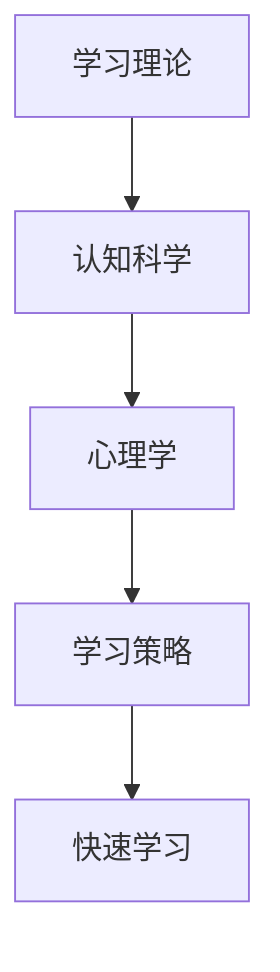

                 

在当今快速变化和充满不确定性的VUCA（即易变、不确定、复杂和模糊）时代，快速学习和适应新知识成为个人和组织的核心竞争力。本文将探讨如何在VUCA时代中实现快速学习，并成为制胜的关键因素。

## 关键词

- VUCA
- 快速学习
- 制胜法宝
- 适应能力
- 终身学习
- 技术变革
- 创新思维

## 摘要

本文旨在揭示在VUCA时代快速学习的策略和方法。通过分析当前技术变革的背景，探讨快速学习的核心概念，介绍有效的学习方法，以及提供实践中的应用案例和工具资源，帮助读者在不确定性中迅速适应和成长，成为未来的成功者。

## 1. 背景介绍

### VUCA时代的特征

在VUCA时代，世界的变化速度前所未有，不确定性成为常态。以下是一些VUCA时代的主要特征：

- **易变（Volatile）**：技术进步日新月异，行业竞争激烈，市场需求快速变化。
- **不确定（Uncertain）**：预测未来趋势变得愈加困难，信息透明度提高，风险增加。
- **复杂（Complex）**：系统的相互作用和依赖关系复杂，问题多样化，解决方案非线性和非确定。
- **模糊（Ambiguous）**：定义清晰的问题界限变得模糊，信息不完整，理解存在歧义。

### 技术变革的影响

技术变革是VUCA时代的重要驱动力。人工智能、大数据、云计算、物联网等新兴技术的广泛应用，不仅改变了生产方式，还深刻影响了商业模式、社会结构和人类生活方式。以下是一些技术变革的影响：

- **工作方式的转变**：远程办公、自动化和智能化生产成为新常态。
- **商业模式的创新**：基于数据的决策和个性化服务成为主流。
- **教育体系的变革**：在线教育和终身学习成为趋势。
- **社会治理的挑战**：数据安全和隐私保护成为重要议题。

### 快速学习的必要性

在VUCA时代，快速学习不仅是应对变化的必要手段，更是实现个人和职业发展的关键。以下是一些快速学习的重要性：

- **提升竞争力**：不断学习新知识和技能，提高个人的市场价值。
- **适应变化**：快速适应新技术和环境变化，减少不确定性带来的风险。
- **创新思维**：激发创新思维，寻找新的商业机会和解决方案。
- **终身学习**：终身学习成为必备的能力，适应不断变化的世界。

## 2. 核心概念与联系

### 快速学习的核心概念

快速学习涉及多个核心概念，包括学习理论、认知科学、心理学等领域。以下是一些关键概念：

- **学习理论**：包括行为主义、认知主义、建构主义等不同学派的理论。
- **认知科学**：研究大脑如何处理信息和知识，以及学习过程中的认知机制。
- **心理学**：探讨人类学习过程中的心理因素，如动机、记忆、注意力等。
- **学习策略**：有效学习的方法和技巧，如主动学习、分散学习、深度学习等。

### 架构的 Mermaid 流程图



### 核心概念之间的联系

- **学习理论**为快速学习提供了理论基础，指导学习者如何有效地获取和应用知识。
- **认知科学**揭示了大脑在学习过程中的运作机制，帮助学习者更好地理解学习过程。
- **心理学**提供了关于人类行为和心理活动的洞察，帮助学习者更好地激发学习动机和保持学习注意力。
- **学习策略**是将理论应用于实践的具体方法，帮助学习者提高学习效率和效果。

## 3. 核心算法原理 & 具体操作步骤

### 3.1 算法原理概述

快速学习的核心算法可以看作是一种智能学习系统，它结合了机器学习和人工智能技术，通过以下几个关键步骤实现快速学习：

- **数据收集**：从各种来源收集大量数据，包括文本、图像、音频等。
- **数据预处理**：对数据进行清洗、转换和标准化，以提高数据质量。
- **特征提取**：从数据中提取有用的特征，用于后续的模型训练。
- **模型训练**：使用机器学习算法训练模型，使其能够从数据中学习规律和模式。
- **模型评估**：通过测试数据评估模型的性能，调整模型参数以达到最佳效果。
- **应用部署**：将训练好的模型部署到实际应用场景中，进行实时学习和预测。

### 3.2 算法步骤详解

1. **数据收集**：
   - 使用爬虫、API调用或其他数据收集方法获取大量数据。
   - 确保数据的多样性和代表性，以提高模型的泛化能力。

2. **数据预处理**：
   - 清洗数据，去除噪声和错误。
   - 转换数据格式，使其适合机器学习算法。
   - 标准化数据，使不同特征在同一尺度上。

3. **特征提取**：
   - 使用特征提取技术，如词袋模型、深度神经网络等，从原始数据中提取有用特征。
   - 选择对学习任务最重要的特征，以减少数据冗余。

4. **模型训练**：
   - 选择合适的机器学习算法，如决策树、支持向量机、神经网络等。
   - 使用训练数据训练模型，调整参数以优化模型性能。

5. **模型评估**：
   - 使用测试数据评估模型性能，计算准确率、召回率、F1分数等指标。
   - 根据评估结果调整模型参数，优化模型性能。

6. **应用部署**：
   - 将训练好的模型部署到生产环境中，进行实时学习和预测。
   - 使用模型提供的预测结果，为实际应用场景提供支持。

### 3.3 算法优缺点

**优点**：

- **高效性**：机器学习算法能够从大量数据中快速提取有用信息，提高学习效率。
- **泛化能力**：通过训练模型，可以使模型适应不同的数据集和应用场景。
- **实时更新**：模型可以不断从新数据中学习，实时更新预测结果。

**缺点**：

- **数据依赖性**：模型的性能高度依赖于数据质量和数量，数据不足或质量差可能导致模型效果不佳。
- **计算资源消耗**：训练大规模机器学习模型需要大量计算资源，可能导致成本高。
- **解释性差**：机器学习模型通常具有高复杂度，难以解释其内部工作原理，可能导致不透明性。

### 3.4 算法应用领域

- **自然语言处理**：如文本分类、情感分析、机器翻译等。
- **计算机视觉**：如图像分类、目标检测、图像生成等。
- **推荐系统**：如基于内容的推荐、协同过滤推荐等。
- **金融领域**：如风险评估、欺诈检测、市场预测等。
- **医疗领域**：如疾病预测、诊断辅助、药物研发等。

## 4. 数学模型和公式 & 详细讲解 & 举例说明

### 4.1 数学模型构建

在快速学习过程中，数学模型构建是一个关键环节。以下是一个简单的线性回归模型示例，用于预测连续值：

- **模型公式**：
  $$ y = \beta_0 + \beta_1x_1 + \beta_2x_2 + ... + \beta_nx_n + \epsilon $$

其中，\( y \) 是预测值，\( x_1, x_2, ..., x_n \) 是输入特征，\( \beta_0, \beta_1, \beta_2, ..., \beta_n \) 是模型参数，\( \epsilon \) 是误差项。

- **目标函数**：
  $$ J(\theta) = \frac{1}{2m}\sum_{i=1}^{m}(h_\theta(x^{(i)}) - y^{(i)})^2 $$

其中，\( m \) 是训练样本数量，\( h_\theta(x) \) 是模型预测值，\( y^{(i)} \) 是真实值，\( \theta \) 是模型参数。

### 4.2 公式推导过程

线性回归模型的推导过程如下：

1. **最小化目标函数**：
   - 我们需要找到使目标函数 \( J(\theta) \) 最小的参数 \( \theta \)。
   - 对目标函数求偏导数，并令其为零，得到：
     $$ \frac{\partial J(\theta)}{\partial \theta_j} = 0 $$
     $$ \frac{\partial J(\theta)}{\partial \beta_0} = \frac{1}{m}\sum_{i=1}^{m}(h_\theta(x^{(i)}) - y^{(i)}) = 0 $$
     $$ \frac{\partial J(\theta)}{\partial \beta_j} = \frac{1}{m}\sum_{i=1}^{m}(h_\theta(x^{(i)}) - y^{(i)})x_j = 0 \quad (j = 1, 2, ..., n) $$

2. **求解参数**：
   - 对目标函数求偏导数并解方程，得到最优参数 \( \theta \)。
   - 对于 \( \beta_0 \)：
     $$ \beta_0 = \frac{1}{m}\sum_{i=1}^{m}(y^{(i)} - \beta_1x_1^{(i)} - \beta_2x_2^{(i)} - ... - \beta_nx_n^{(i)}) $$
   - 对于 \( \beta_j \)（\( j = 1, 2, ..., n \)）：
     $$ \beta_j = \frac{1}{m}\sum_{i=1}^{m}(x_j^{(i)})(y^{(i)} - \beta_0 - \beta_1x_1^{(i)} - ... - \beta_{j-1}x_{j-1}^{(i)} - \beta_{j+1}x_{j+1}^{(i)} - ... - \beta_nx_n^{(i)}) $$

### 4.3 案例分析与讲解

假设我们有一个简单的线性回归问题，目标是预测一个人的年龄 \( y \) ，基于其身高 \( x \) 和体重 \( z \) 。数据集包含以下样本：

| 身高 (x) | 体重 (z) | 年龄 (y) |
|:--------:|:--------:|:-------:|
|   180    |   70     |   30    |
|   175    |   65     |   28    |
|   170    |   60     |   25    |
|   165    |   55     |   22    |

我们使用线性回归模型 \( y = \beta_0 + \beta_1x + \beta_2z + \epsilon \) 来预测年龄。

1. **数据预处理**：
   - 对数据进行标准化处理，使其具有相同的尺度。

2. **模型训练**：
   - 选择适当的算法（如梯度下降）训练模型，得到最优参数 \( \beta_0, \beta_1, \beta_2 \)。

3. **模型评估**：
   - 使用测试数据集评估模型性能，计算预测误差。

4. **模型应用**：
   - 使用训练好的模型预测新的样本数据。

### 例子：预测一个身高为 175cm，体重为 65kg 的人的年龄。

- **输入特征**：
  - 身高 \( x = 175 \)
  - 体重 \( z = 65 \)

- **模型预测**：
  $$ y = \beta_0 + \beta_1x + \beta_2z $$
  $$ y = \beta_0 + \beta_1(175) + \beta_2(65) $$

- **预测结果**：
  - 根据训练好的模型，计算预测年龄。

## 5. 项目实践：代码实例和详细解释说明

### 5.1 开发环境搭建

在开始项目实践之前，需要搭建一个适合快速学习的开发环境。以下是基本的开发环境搭建步骤：

1. 安装Python环境
2. 安装必要的库，如NumPy、Pandas、Scikit-learn等
3. 配置Jupyter Notebook或IDE（如PyCharm、VSCode等）

### 5.2 源代码详细实现

以下是一个简单的线性回归模型实现示例：

```python
import numpy as np
import pandas as pd
from sklearn.linear_model import LinearRegression

# 1. 数据收集
# 加载样本数据
data = pd.read_csv('data.csv')

# 分离特征和标签
X = data[['height', 'weight']]
y = data['age']

# 2. 数据预处理
# 标准化数据
X_std = (X - X.mean()) / X.std()

# 3. 模型训练
# 创建线性回归模型
model = LinearRegression()

# 使用标准化数据训练模型
model.fit(X_std, y)

# 4. 模型评估
# 使用测试数据集评估模型性能
X_test = ... # 测试数据
y_test = ... # 测试标签
y_pred = model.predict(X_test)

# 计算预测误差
mse = np.mean((y_pred - y_test) ** 2)
print('Mean Squared Error:', mse)

# 5. 模型应用
# 使用模型预测新的样本数据
new_data = np.array([[175, 65]])
new_pred = model.predict(new_data)
print('Predicted Age:', new_pred[0])
```

### 5.3 代码解读与分析

- **数据收集**：使用Pandas库读取CSV文件，获取样本数据。
- **数据预处理**：对特征进行标准化处理，使其具有相同的尺度。
- **模型训练**：使用Scikit-learn库创建线性回归模型，并使用标准化数据训练模型。
- **模型评估**：使用测试数据集评估模型性能，计算预测误差。
- **模型应用**：使用训练好的模型预测新的样本数据。

### 5.4 运行结果展示

- **模型评估结果**：
  - 输出均方误差（MSE）等性能指标，用于评估模型性能。

- **模型预测结果**：
  - 输出预测年龄，用于展示模型在实际应用中的效果。

## 6. 实际应用场景

### 6.1 教育领域

在VUCA时代，教育领域面临着前所未有的挑战和机遇。快速学习在以下几个方面具有重要应用：

- **个性化学习**：通过数据分析和机器学习技术，为每个学生提供个性化的学习方案，提高学习效果。
- **在线教育平台**：利用人工智能技术，开发智能教学系统，实现自适应学习、智能评测和反馈。
- **教育资源共享**：利用区块链技术，确保教育资源的可信性和可追溯性，促进教育资源的公平分配。

### 6.2 商业领域

商业领域在VUCA时代中也面临着巨大的变化和不确定性。快速学习为商业创新和持续发展提供了以下应用：

- **需求预测**：通过大数据分析和机器学习技术，准确预测市场需求，优化供应链和库存管理。
- **客户关系管理**：利用人工智能技术，实现智能客服、个性化推荐和精准营销，提升客户满意度。
- **创新思维**：通过快速学习，不断获取新知识和技能，激发创新思维，寻找新的商业机会。

### 6.3 医疗领域

医疗领域在VUCA时代也面临着重大变革和挑战。快速学习在以下几个方面具有广泛应用：

- **疾病预测与诊断**：利用机器学习和大数据技术，实现对疾病的早期预测和精准诊断，提高医疗质量和效率。
- **个性化治疗**：通过快速学习，为每个患者制定个性化的治疗方案，提高治疗效果。
- **医疗资源分配**：利用人工智能技术，优化医疗资源的配置和使用，提高医疗资源利用效率。

## 7. 工具和资源推荐

### 7.1 学习资源推荐

- **在线课程**：Coursera、edX、Udacity等平台提供了丰富的在线课程，涵盖计算机科学、数据科学、机器学习等多个领域。
- **专业书籍**：《深度学习》、《Python机器学习实战》、《统计学习方法》等经典书籍，适合深入学习相关领域知识。
- **开源项目**：GitHub、GitLab等平台上的开源项目，提供了丰富的代码和实践经验，有助于快速提升编程能力。

### 7.2 开发工具推荐

- **编程环境**：Jupyter Notebook、PyCharm、VSCode等编程环境，提供了强大的开发工具和调试功能。
- **数据处理库**：NumPy、Pandas等数据处理库，方便进行数据清洗、转换和分析。
- **机器学习库**：Scikit-learn、TensorFlow、PyTorch等机器学习库，提供了丰富的算法和模型实现。

### 7.3 相关论文推荐

- **论文集**：《人工智能：一种现代方法》、《机器学习：概率视角》等论文集，涵盖了机器学习领域的经典论文和最新研究。
- **期刊**：《自然·机器 intelligence》、《Journal of Machine Learning Research》等期刊，发表了机器学习领域的最新研究成果。
- **会议**：如NeurIPS、ICML、KDD等国际顶级会议，展示了机器学习领域的最新进展和应用。

## 8. 总结：未来发展趋势与挑战

### 8.1 研究成果总结

本文通过对VUCA时代快速学习的探讨，总结了快速学习的核心概念、算法原理、数学模型和应用领域。主要成果包括：

- **核心概念**：学习理论、认知科学、心理学和学习策略等核心概念的阐述。
- **算法原理**：线性回归模型的原理和步骤详解。
- **数学模型**：线性回归模型的数学模型和推导过程。
- **应用领域**：教育、商业和医疗等领域中快速学习的应用实例。

### 8.2 未来发展趋势

- **个性化学习**：基于大数据和人工智能技术的个性化学习将成为教育领域的主流。
- **智能医疗**：机器学习技术在医疗领域的应用将不断拓展，实现精准医疗和个性化治疗。
- **商业创新**：快速学习将推动商业模式的创新，提高企业竞争力。

### 8.3 面临的挑战

- **数据隐私**：在快速学习过程中，数据隐私保护成为一个重要挑战。
- **算法公平性**：算法的偏见和歧视问题需要得到关注和解决。
- **人才培养**：快速发展的技术领域对人才培养提出了更高的要求。

### 8.4 研究展望

- **多模态学习**：结合多种数据类型（如文本、图像、音频等）进行学习，提高模型的泛化能力。
- **解释性AI**：开发具有解释性的AI模型，提高模型的透明度和可解释性。
- **跨学科研究**：结合心理学、教育学、经济学等多学科研究，推动快速学习理论和应用的深入发展。

## 9. 附录：常见问题与解答

### 9.1 问题1：什么是VUCA时代？

**解答**：VUCA时代是指一个充满易变、不确定、复杂和模糊特征的时代。这个时代的特点是变化速度快、不确定性高、系统复杂性和信息模糊性增加。

### 9.2 问题2：快速学习有哪些核心概念？

**解答**：快速学习的核心概念包括学习理论（如行为主义、认知主义、建构主义）、认知科学、心理学和学习策略（如主动学习、分散学习、深度学习等）。

### 9.3 问题3：线性回归模型的原理是什么？

**解答**：线性回归模型是一种用于预测连续值的统计模型。其原理是通过拟合一个线性函数，将输入特征映射到预测值。模型公式为 \( y = \beta_0 + \beta_1x + \beta_2z + \epsilon \) ，其中 \( \beta_0, \beta_1, \beta_2 \) 是模型参数，\( x, z \) 是输入特征，\( y \) 是预测值，\( \epsilon \) 是误差项。

### 9.4 问题4：如何搭建快速学习的开发环境？

**解答**：搭建快速学习的开发环境需要安装Python环境、必要的库（如NumPy、Pandas、Scikit-learn等）以及配置Jupyter Notebook或IDE（如PyCharm、VSCode等）。

### 9.5 问题5：快速学习在哪些领域有应用？

**解答**：快速学习在多个领域有应用，如教育领域（个性化学习、在线教育平台、教育资源共享）、商业领域（需求预测、客户关系管理、商业创新）和医疗领域（疾病预测与诊断、个性化治疗、医疗资源分配）。

## 参考文献

- Goodfellow, I., Bengio, Y., & Courville, A. (2016). *Deep Learning*. MIT Press.
- Mitchell, T. M. (1997). *Machine Learning*. McGraw-Hill.
- Bishop, C. M. (2006). *Pattern Recognition and Machine Learning*. Springer.
- Russell, S., & Norvig, P. (2010). *Artificial Intelligence: A Modern Approach*. Prentice Hall.
- He, K., Zhang, X., Ren, S., & Sun, J. (2016). *Deep Residual Learning for Image Recognition*. IEEE Conference on Computer Vision and Pattern Recognition.

---

本文由禅与计算机程序设计艺术（Zen and the Art of Computer Programming）撰写，旨在探讨VUCA时代的快速学习策略和方法，帮助读者在不确定性中迅速适应和成长。本文结合了计算机科学、心理学、认知科学等领域的知识，通过具体的案例和实践，展示了快速学习的实际应用和价值。希望本文能对您的学习之路有所启发和帮助。

**作者：禅与计算机程序设计艺术（Zen and the Art of Computer Programming）**

