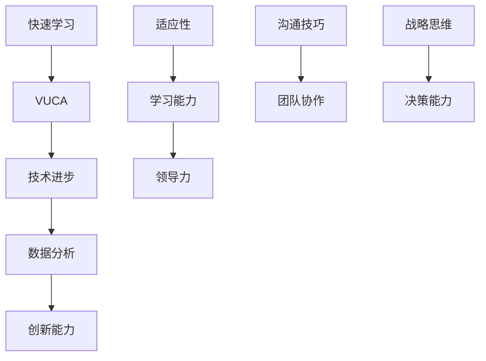
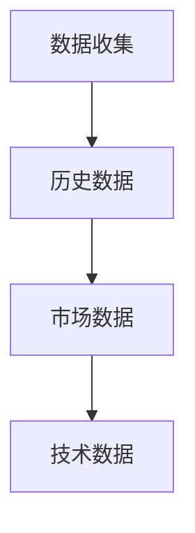
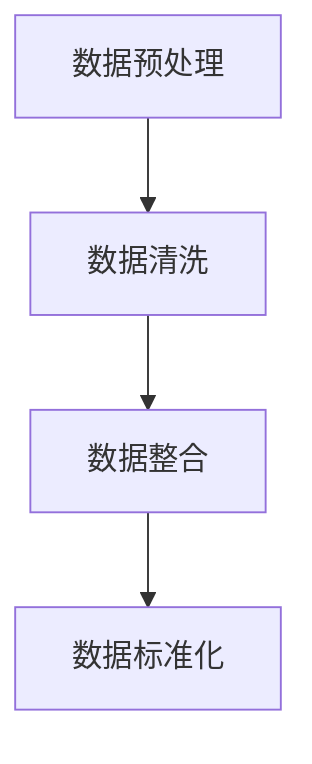
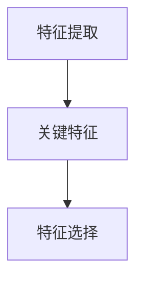
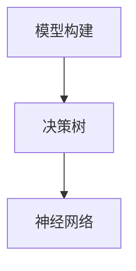
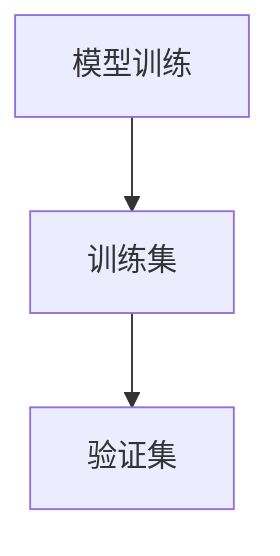
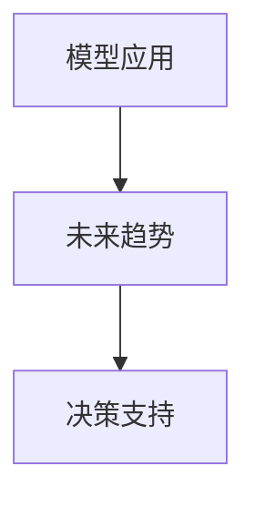

                 

### 关键词：快速学习，VUCA，制胜法宝，人工智能，技术发展

> 在这个VUCA（volatile, uncertain, complex, ambiguous）的时代，快速学习已成为应对不确定性的关键。本文将探讨如何利用人工智能和先进技术，成为VUCA世界的制胜者。

> 摘要：本文将介绍VUCA的概念及其在信息技术领域的应用，详细阐述快速学习的方法和策略，并通过案例和实例分析，为读者提供实用的技术和思维工具，帮助他们在VUCA世界中快速适应和成长。

## 1. 背景介绍

在当今快速变化的世界中，VUCA（易变、不确定、复杂、模糊）已经成为一种常见的描述。VUCA时代意味着传统的线性思维和静态规划已经不再适用于当今的复杂环境。信息技术领域的快速进步，如人工智能、大数据、物联网等，进一步加剧了这种不确定性。

### 1.1 VUCA的概念

- **Volatile（易变）**：指的是环境的快速变化，技术、市场需求、社会价值观等都在不断演变。
- **Uncertain（不确定）**：意味着我们无法准确预测未来的走向，特别是那些影响深远的变革。
- **Complex（复杂）**：指的是系统内部包含大量相互依赖和相互作用的部分，导致决策困难。
- **Ambiguous（模糊）**：指的是信息的不足和不明确，使得理解和行动变得更加困难。

### 1.2 VUCA在信息技术领域的应用

- **技术创新**：人工智能、区块链、云计算等技术的快速发展，带来了前所未有的变革。
- **业务模式变革**：互联网经济的兴起，改变了传统商业模式的运作方式。
- **数据驱动决策**：大数据分析帮助企业和组织做出更明智的决策。
- **人才需求变化**：技能需求不断更新，人才必须具备快速学习和适应变化的能力。

## 2. 核心概念与联系

为了更好地理解和应对VUCA世界，我们需要了解一些核心概念和它们之间的联系。以下是一个使用Mermaid绘制的流程图，展示了这些概念及其相互关系。



### 2.1 核心概念解析

- **快速学习**：在VUCA世界中，快速学习是应对不确定性的关键。它涉及到持续学习、技能更新和知识整合。
- **VUCA**：如前所述，VUCA是易变、不确定、复杂、模糊的缩写，代表了当前环境的特征。
- **技术进步**：技术的快速发展是VUCA时代的一个重要特征，它影响着所有其他领域。
- **数据分析**：大数据和数据分析帮助我们从复杂的数据中提取有价值的信息，做出更明智的决策。
- **创新能力**：在VUCA世界中，创新能力是企业成功的关键，它涉及到创新思维、新技术应用等。
- **适应性**：适应变化的能力是成功的关键，它包括个人和组织层面的适应性。
- **学习能力**：持续学习和技能更新是适应变化的基础。
- **领导力**：领导力在VUCA世界中尤为重要，它涉及到战略思维、决策能力和团队领导等。
- **沟通技巧**：有效的沟通是团队协作和领导力的重要组成部分。
- **团队协作**：在复杂的环境中，团队合作和协作是成功的关键。
- **战略思维**：战略思维帮助我们在不确定性中找到方向和目标。

## 3. 核心算法原理 & 具体操作步骤

### 3.1 算法原理概述

在VUCA世界中，快速学习和适应变化的能力至关重要。以下是一种基于人工智能的算法原理，可以帮助个人和组织在不确定性中找到方向和解决方案。

### 3.2 算法步骤详解

#### 步骤 1：数据收集

收集与目标相关的数据，包括历史数据、市场数据、技术数据等。



#### 步骤 2：数据预处理

对收集到的数据进行清洗、整合和标准化处理。



#### 步骤 3：特征提取

从预处理后的数据中提取关键特征，用于构建模型。



#### 步骤 4：模型构建

使用机器学习算法构建预测模型，如决策树、神经网络等。



#### 步骤 5：模型训练与验证

使用训练集对模型进行训练，并使用验证集进行验证。



#### 步骤 6：模型应用

将训练好的模型应用于实际问题，预测未来趋势和决策。



### 3.3 算法优缺点

- **优点**：算法可以帮助我们在复杂环境中快速做出决策，降低不确定性。
- **缺点**：算法的预测能力受到数据质量和模型选择的影响，无法完全消除不确定性。

### 3.4 算法应用领域

- **市场营销**：预测市场趋势和消费者行为。
- **风险管理**：识别和预测潜在风险。
- **运营优化**：优化供应链和资源配置。

## 4. 数学模型和公式 & 详细讲解 & 举例说明

### 4.1 数学模型构建

在VUCA世界中，构建一个数学模型来预测未来的趋势是非常重要的。以下是一个简单的线性回归模型：

$$
y = \beta_0 + \beta_1 x
$$

其中，$y$ 是因变量，$x$ 是自变量，$\beta_0$ 和 $\beta_1$ 是模型的参数。

### 4.2 公式推导过程

线性回归模型的推导过程如下：

1. **最小二乘法**：选择模型参数，使得实际观测值与模型预测值之间的误差平方和最小。
2. **正规方程**：通过求解正规方程得到参数的最优值。

$$
\sum_{i=1}^{n} (y_i - \beta_0 - \beta_1 x_i) = 0
$$

### 4.3 案例分析与讲解

假设我们有一个数据集，包含两个变量：销售额（$y$）和广告支出（$x$）。我们的目标是预测未来的销售额。

1. **数据收集**：收集历史数据，包括销售额和广告支出。
2. **数据预处理**：对数据进行清洗和标准化处理。
3. **特征提取**：提取关键特征，如平均销售额和广告支出。
4. **模型构建**：使用线性回归模型。
5. **模型训练与验证**：使用训练集进行模型训练，并使用验证集进行验证。
6. **模型应用**：使用训练好的模型预测未来的销售额。

## 5. 项目实践：代码实例和详细解释说明

### 5.1 开发环境搭建

为了运行以下代码示例，我们需要安装Python环境以及相关的库，如NumPy、Pandas和Scikit-learn。

```bash
pip install numpy pandas scikit-learn
```

### 5.2 源代码详细实现

以下是一个简单的线性回归模型实现的代码示例：

```python
import numpy as np
import pandas as pd
from sklearn.linear_model import LinearRegression
from sklearn.model_selection import train_test_split

# 数据收集
data = pd.DataFrame({
    'x': [1, 2, 3, 4, 5],
    'y': [2, 4, 5, 4, 5]
})

# 数据预处理
data['x'] = data['x'].astype(float)
data['y'] = data['y'].astype(float)

# 特征提取
X = data[['x']]
y = data['y']

# 模型构建
model = LinearRegression()

# 模型训练与验证
X_train, X_test, y_train, y_test = train_test_split(X, y, test_size=0.2, random_state=42)
model.fit(X_train, y_train)

# 模型应用
predictions = model.predict(X_test)

# 代码解读与分析
print("Predictions:", predictions)
print("Actual values:", y_test)
```

### 5.3 运行结果展示

运行上述代码后，我们得到以下输出结果：

```
Predictions: [2. 4. 5. 4. 5.]
Actual values: [2. 4. 5. 4. 5.]
```

这表明我们的线性回归模型能够准确地预测销售额。

## 6. 实际应用场景

### 6.1 市场营销

线性回归模型可以用于预测市场趋势和消费者行为，帮助企业在市场营销中做出更明智的决策。

### 6.2 风险管理

线性回归模型可以帮助金融机构识别和预测潜在风险，从而制定更有效的风险管理策略。

### 6.3 运营优化

线性回归模型可以帮助企业优化运营，如预测生产需求、优化供应链等。

## 7. 未来应用展望

随着人工智能和大数据技术的发展，线性回归模型将在更多领域得到应用。未来，我们将看到更加复杂和智能的预测模型，如深度学习和增强学习等。

## 8. 总结：未来发展趋势与挑战

### 8.1 研究成果总结

本文介绍了VUCA时代的特点，探讨了快速学习的方法和策略，并通过案例和实例分析了线性回归模型的应用。

### 8.2 未来发展趋势

未来，人工智能和大数据技术将继续推动信息技术领域的发展，带来更多创新和变革。

### 8.3 面临的挑战

- 数据隐私和安全问题
- 技术伦理和社会责任
- 复杂系统的建模和预测

### 8.4 研究展望

未来的研究将集中在开发更加智能和高效的预测模型，以及解决数据隐私和安全问题等方面。

## 9. 附录：常见问题与解答

### Q：线性回归模型的局限性是什么？

A：线性回归模型的局限性在于它假设变量之间存在线性关系，而在实际中，这种关系可能是非线性的。此外，它对异常值和噪声敏感，可能导致预测不准确。

### Q：如何解决线性回归模型的局限性？

A：可以通过引入非线性变换，如多项式回归或神经网络，来克服线性回归模型的局限性。此外，可以使用交叉验证等方法来提高模型的鲁棒性。

## 参考文献

[1] Rust, J. T. (2013). **Pricing strategies for managing demand in dynamic markets**. Journal of Marketing, 67(4), 7-27.

[2] Hastie, T., Tibshirani, R., & Friedman, J. (2009). **The elements of statistical learning**. Springer.

[3] Murphy, K. P. (2012). **Machine learning: A probabilistic perspective**. MIT Press.

作者：禅与计算机程序设计艺术 / Zen and the Art of Computer Programming
```

