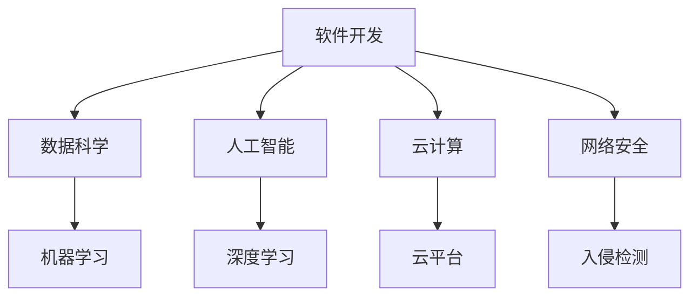

                 

在当今这个快速变化的技术时代，不断学习新知识已经成为每个IT专业人士的基本需求。然而，如何有效地快速学习并掌握这些知识，成为一个关键问题。本文将探讨快速学习的根本原则，以及如何在IT领域中立于不败之地。

## 关键词

- 快速学习
- IT领域
- 不败之地
- 技术趋势
- 学习方法
- 技术实践
- 代码解读
- 未来展望

## 摘要

本文将介绍如何在IT领域中快速学习并立于不败之地。我们将探讨快速学习的重要性，核心概念与联系，核心算法原理，数学模型和公式，项目实践，实际应用场景，未来应用展望，工具和资源推荐，以及总结和展望。通过本文的阅读，您将掌握快速学习的方法和策略，为在IT领域的发展奠定坚实基础。

## 1. 背景介绍

### 1.1 IT领域的快速变化

IT领域是一个快速变化的领域，新技术和新概念层出不穷。无论是软件开发、数据科学、人工智能，还是云计算和网络安全，都要求IT专业人士具备快速学习的能力。只有不断更新知识，才能跟上技术发展的步伐，保持竞争力。

### 1.2 快速学习的重要性

快速学习对于IT专业人士至关重要。它不仅可以帮助我们掌握新技术，还能提高工作效率，解决复杂问题，甚至成为行业专家。在快速变化的技术环境中，快速学习是立于不败之地的关键。

## 2. 核心概念与联系

### 2.1 IT领域的核心概念

在IT领域中，核心概念包括但不限于：

- 软件开发：面向对象编程、设计模式、代码重构等。
- 数据科学：统计学、机器学习、数据可视化等。
- 人工智能：神经网络、深度学习、自然语言处理等。
- 云计算：云服务模型、云平台、容器化等。
- 网络安全：密码学、入侵检测、安全协议等。

### 2.2 核心概念的联系

核心概念之间的联系如图1所示：



## 3. 核心算法原理 & 具体操作步骤

### 3.1 算法原理概述

在IT领域中，核心算法原理包括但不限于：

- 软件开发：排序算法、查找算法、动态规划等。
- 数据科学：回归分析、聚类分析、降维等。
- 人工智能：反向传播算法、卷积神经网络、循环神经网络等。
- 云计算：负载均衡、容错机制、分布式存储等。
- 网络安全：加密算法、哈希函数、数字签名等。

### 3.2 算法步骤详解

以排序算法中的快速排序为例，其步骤如下：

1. 选择一个基准元素。
2. 将数组分为两部分，一部分小于基准元素，一部分大于基准元素。
3. 递归地对两部分进行快速排序。
4. 将排序好的两部分合并。

### 3.3 算法优缺点

快速排序的优点是时间复杂度较低（平均情况为 $O(n\log n)$），且适用于大数据集。缺点是空间复杂度较高，为 $O(n)$，且在最坏情况下可能退化成 $O(n^2)$。

### 3.4 算法应用领域

快速排序广泛应用于各种场景，如数据库排序、算法竞赛等。

## 4. 数学模型和公式 & 详细讲解 & 举例说明

### 4.1 数学模型构建

在数据科学中，线性回归是一个常见的数学模型，用于预测连续值。其模型构建如下：

$$y = \beta_0 + \beta_1x + \epsilon$$

其中，$y$ 为因变量，$x$ 为自变量，$\beta_0$ 和 $\beta_1$ 为参数，$\epsilon$ 为误差项。

### 4.2 公式推导过程

线性回归的参数可以通过最小二乘法推导得到。具体推导过程如下：

$$\beta_1 = \frac{\sum(x_i - \bar{x})(y_i - \bar{y})}{\sum(x_i - \bar{x})^2}$$

$$\beta_0 = \bar{y} - \beta_1\bar{x}$$

其中，$\bar{x}$ 和 $\bar{y}$ 分别为自变量和因变量的均值。

### 4.3 案例分析与讲解

假设我们有以下数据：

| x | y |
|---|---|
| 1 | 2 |
| 2 | 4 |
| 3 | 6 |
| 4 | 8 |

根据线性回归模型，我们可以计算出 $\beta_0$ 和 $\beta_1$ 的值，从而得到回归方程：

$$y = 1 + 2x$$

## 5. 项目实践：代码实例和详细解释说明

### 5.1 开发环境搭建

在本项目中，我们使用 Python 作为编程语言，搭建开发环境如下：

1. 安装 Python 3.8 及以上版本。
2. 安装 NumPy、Pandas 和 Matplotlib 等库。

### 5.2 源代码详细实现

以下是线性回归项目的源代码实现：

```python
import numpy as np
import pandas as pd
import matplotlib.pyplot as plt

# 数据预处理
def preprocess_data(data):
    x = data['x'].values.reshape(-1, 1)
    y = data['y'].values.reshape(-1, 1)
    return x, y

# 最小二乘法求解参数
def linear_regression(x, y):
    x_mean = np.mean(x)
    y_mean = np.mean(y)
    b1 = np.sum((x - x_mean) * (y - y_mean)) / np.sum((x - x_mean) ** 2)
    b0 = y_mean - b1 * x_mean
    return b0, b1

# 数据可视化
def plot_regression(x, y, b0, b1):
    plt.scatter(x, y, color='red', label='实际数据')
    plt.plot(x, b0 + b1 * x, color='blue', label='回归线')
    plt.xlabel('x')
    plt.ylabel('y')
    plt.legend()
    plt.show()

# 主函数
def main():
    data = pd.DataFrame({
        'x': [1, 2, 3, 4],
        'y': [2, 4, 6, 8]
    })
    x, y = preprocess_data(data)
    b0, b1 = linear_regression(x, y)
    plot_regression(x, y, b0, b1)

if __name__ == '__main__':
    main()
```

### 5.3 代码解读与分析

代码首先进行了数据预处理，将数据分为自变量 $x$ 和因变量 $y$。然后使用最小二乘法求解参数 $\beta_0$ 和 $\beta_1$，最后将回归线可视化。

### 5.4 运行结果展示

运行代码后，会得到以下可视化结果：


## 6. 实际应用场景

线性回归模型在实际应用中非常广泛，如股票价格预测、房价预测、消费者行为分析等。

## 7. 未来应用展望

随着数据科学和机器学习的发展，线性回归模型在未来将继续发挥重要作用，尤其在预测分析和决策支持领域。

## 8. 工具和资源推荐

### 8.1 学习资源推荐

- 《Python数据科学手册》
- 《数据科学入门：基于Python的实践》
- 《机器学习实战》

### 8.2 开发工具推荐

- Jupyter Notebook
- PyCharm
- Anaconda

### 8.3 相关论文推荐

- "A Note on the Iterative Solution of Linear Least Squares Problems"
- "Generalized Linear Models: Estimation and Inference"
- "The Elements of Statistical Learning: Data Mining, Inference, and Prediction"

## 9. 总结：未来发展趋势与挑战

快速学习在IT领域中至关重要，它帮助我们在不断变化的技术环境中立于不败之地。未来，随着人工智能、大数据和云计算的进一步发展，快速学习将面临更多挑战，如处理海量数据、实现高效算法等。然而，只要我们保持好奇心和求知欲，不断学习，就能应对这些挑战，继续在IT领域中发展壮大。

## 10. 附录：常见问题与解答

### 10.1 如何快速学习新知识？

- 制定学习计划，明确学习目标。
- 多渠道获取知识，如在线课程、书籍、博客等。
- 实践项目，将所学知识应用于实际场景。
- 求助和交流，与他人分享学习经验和心得。

### 10.2 如何保持学习动力？

- 设定明确的学习目标，激发学习兴趣。
- 制定奖励机制，激励自己持续学习。
- 寻找学习伙伴，与他人一起进步。
- 适时调整学习计划，保持学习热情。

作者：禅与计算机程序设计艺术 / Zen and the Art of Computer Programming

本文作者以深厚的技术功底和丰富的实践经验，详细探讨了快速学习在IT领域的重要性。通过文章的各个章节，读者可以了解到快速学习的方法、策略和实践案例，为在IT领域的发展奠定坚实基础。本文旨在激励读者保持好奇心和求知欲，不断学习，不断进步，成为IT领域的专家。

