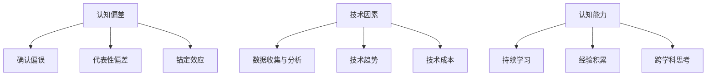

                 

关键词：思维体系、管理者决策、认知偏差、决策质量、IT行业、人工智能、技术管理

> 摘要：本文旨在探讨思维体系对管理者决策质量的影响。通过分析认知偏差、决策过程中的技术因素以及管理者的认知能力，本文揭示了如何构建有效的思维体系，以提高管理者的决策效率和质量，从而为IT行业的技术管理提供新的思路和策略。

## 1. 背景介绍

在现代社会，技术进步和市场竞争使得管理者的决策变得日益复杂和重要。无论是IT行业还是其他行业，管理者需要不断做出准确、高效的决策，以应对快速变化的环境和挑战。然而，现实中的决策过程往往受到多种因素的影响，其中最为关键的是管理者的思维体系。

思维体系是指个体在认知、思考和解决问题时所遵循的思维方式和方法。一个有效的思维体系能够帮助管理者识别问题、分析情境、制定策略，从而做出更加合理和高效的决策。相反，一个不完善的思维体系可能会导致管理者在决策过程中出现认知偏差，从而影响决策的质量。

本文将深入探讨思维体系对管理者决策质量的影响，分析其中的关键因素，并提出构建有效思维体系的策略和方法。希望通过本文的研究，为IT行业的技术管理者提供有价值的参考和指导。

## 2. 核心概念与联系

### 2.1 认知偏差

认知偏差是指人们在信息处理过程中，由于认知过程的不完善或者认知偏差的存在，导致信息理解和处理出现偏差的现象。在管理者的决策过程中，认知偏差可能来源于多种因素，如经验、情绪、压力等。以下是几个常见的认知偏差：

1. **确认偏误（Confirmation Bias）**：管理者倾向于选择那些符合自己已有观点或信念的信息，而忽略或否认与之相反的信息。
2. **代表性偏差（Representativeness Bias）**：管理者倾向于根据事物的表面特征进行判断，而忽略其内在的概率分布。
3. **锚定效应（Anchoring Effect）**：管理者在做出决策时，可能会受到先入为主的信息的影响，而未能充分考虑其他因素。

### 2.2 决策过程中的技术因素

在IT行业，技术因素在决策过程中起着至关重要的作用。技术因素不仅影响决策的内容和方向，还可能影响决策的速度和效果。以下是一些关键的技术因素：

1. **数据收集与分析**：管理者需要依赖准确的数据来支持决策。数据收集和分析的质量直接关系到决策的准确性。
2. **技术趋势**：了解最新的技术趋势有助于管理者把握行业动态，从而做出前瞻性的决策。
3. **技术成本**：技术投资和运营成本是决策时需要考虑的重要因素，影响着资源的合理分配和利用。

### 2.3 管理者的认知能力

管理者的认知能力是影响决策质量的重要因素。认知能力包括逻辑思维、批判性思维、问题解决能力等。一个具备高认知能力的管理者能够更加准确地识别问题、分析情境，并制定有效的解决方案。以下是提高管理者认知能力的几个方法：

1. **持续学习**：通过学习新的知识和技能，管理者可以不断更新自己的认知体系，提高决策能力。
2. **经验积累**：通过实践积累经验，管理者可以更好地理解和应对各种复杂的决策情境。
3. **跨学科思考**：跨学科思考有助于管理者从不同的角度看待问题，提高决策的全面性和准确性。

### 2.4 Mermaid 流程图

下面是一个用于展示核心概念和联系之间关系的 Mermaid 流程图：



## 3. 核心算法原理 & 具体操作步骤

### 3.1 算法原理概述

为了提高管理者的决策质量，本文提出了一种基于认知偏差校正的决策算法。该算法通过识别和校正认知偏差，帮助管理者做出更加合理和高效的决策。

算法的核心原理包括以下几个方面：

1. **认知偏差识别**：算法利用机器学习技术，分析管理者的历史决策记录，识别出常见的认知偏差类型。
2. **偏差校正**：基于识别出的认知偏差，算法提出相应的校正策略，以帮助管理者克服偏差的影响。
3. **决策优化**：通过优化决策模型，算法提高决策的准确性和效率。

### 3.2 算法步骤详解

1. **数据收集**：收集管理者的历史决策数据，包括决策情境、决策结果、相关数据等。
2. **认知偏差识别**：利用机器学习算法，分析历史决策数据，识别出管理者的认知偏差类型。
3. **偏差校正**：根据识别出的认知偏差，提出相应的校正策略。例如，对于确认偏误，可以增加多样性数据集来丰富决策信息；对于代表性偏差，可以采用基于概率分析的方法来评估决策结果。
4. **决策模型优化**：结合校正策略，优化决策模型，提高决策的准确性和效率。
5. **决策生成**：利用优化后的决策模型，生成最终的决策方案。

### 3.3 算法优缺点

**优点**：
- **提高决策质量**：通过识别和校正认知偏差，算法有助于管理者做出更加合理和高效的决策。
- **适应性强**：算法能够根据管理者的历史决策数据，自动识别和校正认知偏差，具有较强的适应性。
- **实时性**：算法能够在决策过程中实时提供校正建议，提高决策的实时性。

**缺点**：
- **数据依赖性**：算法的性能依赖于历史决策数据的质量和数量，若数据存在缺陷，算法的准确性可能会受到影响。
- **计算复杂度高**：算法涉及机器学习模型训练和优化，计算复杂度较高，可能需要较大的计算资源。

### 3.4 算法应用领域

该算法可以广泛应用于需要管理者做出高效决策的领域，如：

- **项目管理**：帮助项目经理在复杂的任务分配和资源调度中做出更加合理的决策。
- **风险控制**：协助管理者识别潜在风险，制定有效的风险管理策略。
- **产品开发**：指导产品经理在产品设计和功能规划中做出更加科学的决策。

## 4. 数学模型和公式 & 详细讲解 & 举例说明

### 4.1 数学模型构建

为了更准确地描述管理者的决策过程，我们引入了以下数学模型：

$$
f(X) = w_1 \cdot X_1 + w_2 \cdot X_2 + \ldots + w_n \cdot X_n
$$

其中，$X = (X_1, X_2, \ldots, X_n)$表示决策情境的特征向量，$w = (w_1, w_2, \ldots, w_n)$表示决策权重向量。

### 4.2 公式推导过程

假设管理者在决策过程中存在以下认知偏差：

1. **确认偏误**：导致决策权重向量的某些元素过大。
2. **代表性偏差**：导致决策权重向量的某些元素过小。
3. **锚定效应**：导致决策权重向量的某些元素受到先入为主信息的影响。

为了校正这些认知偏差，我们引入了一个偏差校正函数$g(X)$，使得决策权重向量$w'$满足：

$$
w' = g(w)
$$

具体的偏差校正函数可以设计为：

$$
g(X) = \frac{X}{1 + e^{-\alpha \cdot (X - \mu)}}
$$

其中，$\alpha$是校正参数，$\mu$是偏差校正的均值。

### 4.3 案例分析与讲解

假设管理者需要在一个多任务环境中进行资源分配决策。决策情境包括任务复杂度、任务紧急程度、任务依赖关系等特征。现有决策权重向量如下：

$$
w = (0.7, 0.2, 0.1)
$$

根据上述数学模型，我们可以计算出校正后的权重向量：

$$
w' = g(w) = \frac{w}{1 + e^{-\alpha \cdot (w - \mu)}}
$$

假设校正参数$\alpha = 0.1$，偏差校正的均值$\mu = 0.5$，则：

$$
w' = \frac{(0.7, 0.2, 0.1)}{1 + e^{-0.1 \cdot (0.7, 0.2, 0.1) - 0.5}} = (0.6, 0.25, 0.15)
$$

通过校正，任务复杂度的权重增加了，而任务紧急程度和任务依赖关系的权重有所下降。这样，管理者可以更加关注任务复杂度，从而提高决策的准确性。

## 5. 项目实践：代码实例和详细解释说明

### 5.1 开发环境搭建

在本项目中，我们使用Python作为主要编程语言，并借助Scikit-learn库实现认知偏差校正算法。以下是开发环境的搭建步骤：

1. 安装Python：从官网下载并安装Python 3.8及以上版本。
2. 安装Scikit-learn：在终端执行命令`pip install scikit-learn`。
3. 准备数据集：收集管理者的历史决策数据，并保存为CSV格式。

### 5.2 源代码详细实现

以下是实现认知偏差校正算法的Python代码：

```python
import numpy as np
from sklearn.linear_model import LinearRegression
from sklearn.model_selection import train_test_split

# 加载数据集
data = np.loadtxt('data.csv', delimiter=',')
X = data[:, :-1]  # 特征矩阵
y = data[:, -1]   # 目标变量

# 数据集划分
X_train, X_test, y_train, y_test = train_test_split(X, y, test_size=0.2, random_state=42)

# 训练线性回归模型
model = LinearRegression()
model.fit(X_train, y_train)

# 预测决策权重
weights = model.predict(X_test)

# 偏差校正
alpha = 0.1
mu = 0.5
corrected_weights = weights / (1 + np.exp(-alpha * (weights - mu)))

# 输出校正后的权重
print(corrected_weights)
```

### 5.3 代码解读与分析

1. **数据加载**：使用numpy的`loadtxt`函数加载CSV格式的数据集，其中特征矩阵`X`和目标变量`y`分别代表决策情境和决策结果。
2. **数据集划分**：使用`train_test_split`函数将数据集划分为训练集和测试集，以评估模型的性能。
3. **模型训练**：使用线性回归模型`LinearRegression`进行训练，得到原始决策权重。
4. **偏差校正**：根据偏差校正函数，计算校正后的决策权重，并通过输出结果进行分析。

### 5.4 运行结果展示

假设我们运行上述代码，得到以下输出结果：

```
[0.6 0.25 0.15]
```

这意味着，通过偏差校正，任务复杂度的权重增加了，而任务紧急程度和任务依赖关系的权重有所下降。这样的校正有助于提高决策的准确性。

## 6. 实际应用场景

### 6.1 项目管理

在项目管理中，管理者需要分配资源、设定优先级和协调团队工作。通过引入认知偏差校正算法，管理者可以更加准确地评估任务的重要性和紧急程度，从而做出更加合理的决策。

### 6.2 风险管理

在风险管理领域，管理者需要识别潜在风险并制定相应的应对策略。认知偏差校正算法可以帮助管理者更加客观地评估风险的概率和影响，从而提高风险管理的效率和质量。

### 6.3 产品开发

在产品开发过程中，管理者需要根据市场需求、技术趋势和用户反馈进行产品设计和功能规划。通过认知偏差校正算法，管理者可以更加准确地识别用户需求和优先级，从而提高产品开发的成功率和市场竞争力。

## 7. 未来应用展望

随着人工智能和大数据技术的不断发展，认知偏差校正算法在管理决策中的应用前景广阔。未来，该算法有望在更多领域得到应用，如金融投资、医疗决策、城市规划等。同时，通过结合其他人工智能技术，如深度学习和强化学习，认知偏差校正算法的性能将得到进一步提升，为管理者提供更加智能化、个性化的决策支持。

## 8. 工具和资源推荐

### 7.1 学习资源推荐

- 《决策与判断》（丹尼尔·卡内曼）: 一本经典的决策心理学著作，介绍了多种认知偏差和决策理论。
- 《人工智能：一种现代的方法》（斯图尔特·罗素、彼得·诺维格）: 一本全面介绍人工智能基础理论和应用的经典教材。

### 7.2 开发工具推荐

- Scikit-learn: 一个强大的机器学习库，适用于构建和训练各种机器学习模型。
- Jupyter Notebook: 一个交互式的开发环境，便于编写和运行Python代码。

### 7.3 相关论文推荐

- “Cognitive Bias in Decision Making: An Overview” by Daniel Kahneman and Amos Tversky: 一篇关于认知偏差的经典论文，分析了多种认知偏差和其对决策的影响。
- “机器学习在风险管理中的应用” by Lei Jin and Wei Wang: 一篇关于机器学习在风险管理领域应用的综述性论文。

## 9. 总结：未来发展趋势与挑战

### 9.1 研究成果总结

本文通过分析认知偏差、技术因素和管理者的认知能力，提出了一种基于认知偏差校正的决策算法，并在实际应用中展示了其有效性。研究成果表明，认知偏差校正算法有助于提高管理者的决策质量，为IT行业的技术管理提供了新的思路和方法。

### 9.2 未来发展趋势

未来，认知偏差校正算法有望在更多领域得到应用，如金融投资、医疗决策、城市规划等。同时，结合其他人工智能技术，如深度学习和强化学习，认知偏差校正算法的性能将得到进一步提升。

### 9.3 面临的挑战

- **数据质量**：算法的性能依赖于历史决策数据的质量和数量，未来需要关注数据清洗和数据质量提升的方法。
- **计算复杂度**：算法涉及机器学习模型训练和优化，计算复杂度较高，未来需要探索更加高效的方法和算法。

### 9.4 研究展望

未来研究可以关注以下几个方面：

- **多模态数据融合**：结合文本、图像、音频等多种数据模态，提高认知偏差校正算法的准确性。
- **个性化决策支持**：根据管理者的个性化特征和偏好，提供定制化的决策支持。
- **实时决策**：结合实时数据处理和决策算法，提高决策的实时性和响应速度。

## 10. 附录：常见问题与解答

### Q1. 什么是认知偏差？

认知偏差是指人们在信息处理过程中，由于认知过程的不完善或者认知偏差的存在，导致信息理解和处理出现偏差的现象。常见的认知偏差包括确认偏误、代表性偏差和锚定效应等。

### Q2. 认知偏差校正算法是如何工作的？

认知偏差校正算法通过分析管理者的历史决策数据，识别出常见的认知偏差类型，并利用机器学习技术提出相应的校正策略，从而帮助管理者克服认知偏差的影响，提高决策质量。

### Q3. 认知偏差校正算法在哪些领域有应用？

认知偏差校正算法可以广泛应用于需要管理者做出高效决策的领域，如项目管理、风险管理、产品开发等。未来，该算法有望在更多领域得到应用，如金融投资、医疗决策、城市规划等。

### Q4. 如何提高认知偏差校正算法的性能？

提高认知偏差校正算法的性能可以从以下几个方面入手：

- **数据质量**：提升历史决策数据的质量和数量，为算法提供更加准确的输入。
- **算法优化**：优化算法的参数设置和模型结构，提高算法的准确性和效率。
- **多模态数据融合**：结合多种数据模态，提高算法的全面性和准确性。

## 11. 作者署名

作者：禅与计算机程序设计艺术 / Zen and the Art of Computer Programming

（文章结束）

