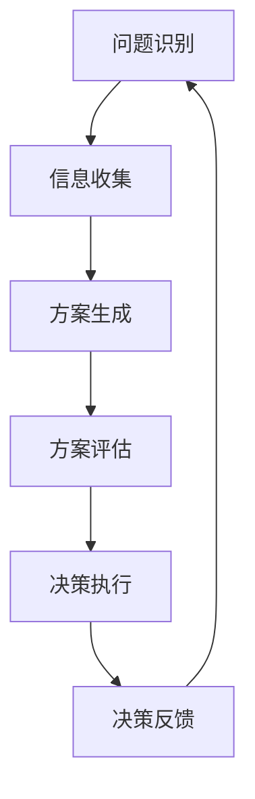

                 

### 摘要 Summary

本文探讨了思维体系对管理者决策质量的影响。首先，我们回顾了管理决策的基本理论和框架，接着深入分析了不同思维模式如何影响决策过程。本文通过实际案例，阐述了逻辑思维、系统思维、创新思维等在决策中的应用，并探讨了如何通过提升思维质量来提高管理者的决策效率。最后，本文提出了未来研究与应用的展望，以期为管理实践提供理论支持和实践指导。

### 1. 背景介绍 Introduction

在当今快速变化和高度不确定的商业环境中，管理者的决策质量成为企业成功的关键因素。有效的决策不仅能够帮助企业抓住机遇，还能降低风险，确保组织的可持续发展。然而，决策的质量往往受到多种因素的影响，其中最重要的因素之一就是管理者的思维体系。

管理决策通常涉及多个方面，包括战略规划、资源分配、市场策略和风险管理等。这些决策过程不仅需要逻辑和分析能力，还需要系统的全局观和创新的思维方式。因此，了解管理者的思维体系如何影响决策质量，对于提高管理者的决策能力具有重要意义。

本文将从以下几个角度展开讨论：

1. **管理决策的基本理论和框架**：回顾管理决策的核心概念，如决策过程、决策类型和决策制定的方法。
2. **思维体系与决策质量的关系**：分析不同思维模式如何影响管理决策，以及如何通过提升思维质量来提高决策效率。
3. **实际案例**：通过真实案例，阐述不同思维模式在决策中的应用和效果。
4. **未来展望**：探讨未来研究与应用的前景，为管理实践提供新的视角。

### 2. 核心概念与联系 Core Concepts and Relationships

#### 2.1 决策过程 Decision Process

管理决策过程是一个复杂的多阶段循环，通常包括以下几个步骤：

1. **问题识别**：发现并明确需要解决的问题或机会。
2. **信息收集**：收集与决策相关的信息，包括内部数据和外部数据。
3. **方案生成**：基于收集到的信息，提出各种可能的解决方案。
4. **方案评估**：评估各个方案的风险和收益，选择最优方案。
5. **决策执行**：将决策方案付诸实施。
6. **决策反馈**：评估决策结果，收集反馈信息，为未来决策提供参考。

#### 2.2 决策类型 Types of Decision

根据决策的影响范围和复杂性，决策可以分为以下几种类型：

1. **战略决策**：涉及组织长期发展方向和核心竞争力的决策。
2. **战术决策**：涉及短期目标和资源分配的决策。
3. **运营决策**：涉及日常运营活动的决策。

#### 2.3 决策制定方法 Decision-Making Methods

有效的决策制定通常需要结合多种方法：

1. **定性方法**：基于专家判断和主观评价，如德尔菲法、头脑风暴等。
2. **定量方法**：基于数据分析和模型模拟，如线性规划、决策树等。

#### 2.4 思维模式与决策质量 Thinking Patterns and Decision Quality

管理者的思维模式对其决策质量具有重要影响。以下是一些关键的思维模式：

1. **逻辑思维**：通过逻辑推理和分析，确保决策的合理性和可行性。
2. **系统思维**：考虑决策的长期影响和整体效果，确保决策的可持续性。
3. **创新思维**：寻找新的解决方案和机会，提高决策的创新性和前瞻性。

下面是一个使用Mermaid绘制的流程图，展示了决策过程的核心概念和联系：



### 3. 核心算法原理 & 具体操作步骤 Core Algorithm Principle & Operational Steps

#### 3.1 算法原理概述 Algorithm Principle Overview

在管理决策中，算法原理可以用来优化决策过程。其中，线性规划（Linear Programming，LP）是一个常用的优化工具，它可以帮助管理者在资源有限的情况下，最大化或最小化某个目标函数。

线性规划的基本原理是建立目标函数和约束条件，然后使用数学方法找到最优解。目标函数通常是一个线性表达式，表示管理者希望最大化或最小化的目标，如利润、成本或效率。约束条件则是一系列线性不等式或等式，表示决策变量的取值范围和其他限制。

下面是一个简单的线性规划模型：

$$
\begin{aligned}
\text{最大化} \quad & c^T x \\
\text{约束条件} \quad & Ax \leq b \\
& x \geq 0
\end{aligned}
$$

其中，$c$ 是目标函数的系数向量，$x$ 是决策变量向量，$A$ 是约束条件的系数矩阵，$b$ 是约束条件的常数向量。

#### 3.2 算法步骤详解 Step-by-Step Explanation

以下是线性规划算法的基本步骤：

1. **定义目标函数和约束条件**：明确要优化的目标函数和满足的约束条件。
2. **建立线性规划模型**：将目标函数和约束条件转化为标准形式。
3. **求解线性规划问题**：使用数学方法（如单纯形法、内点法等）求解最优解。
4. **分析结果**：评估最优解的可行性和有效性，并根据需要调整模型。

下面是一个具体的线性规划问题实例：

**问题**：一家制造公司希望在生产过程中最大化利润，同时满足以下约束条件：

- 每周使用的原材料不能超过1000单位。
- 每种产品的生产时间不能超过10小时。
- 生产的每种产品都必须达到100单位。

假设两种产品的利润分别为 $20 和 $15，建立线性规划模型，求解最优生产方案。

$$
\begin{aligned}
\text{最大化} \quad & 20x_1 + 15x_2 \\
\text{约束条件} \quad & x_1 + x_2 \leq 100 \\
& x_1 \leq 10 \\
& x_2 \leq 10 \\
& x_1, x_2 \geq 0
\end{aligned}
$$

通过求解这个线性规划问题，我们可以得到最优生产方案，从而最大化公司利润。

#### 3.3 算法优缺点 Advantages and Disadvantages

线性规划算法具有以下优点：

- **通用性强**：可以处理多种优化问题。
- **求解速度快**：对于大规模问题，求解效率较高。
- **易于实现**：数学原理简单，便于编程实现。

然而，线性规划算法也存在一些局限性：

- **线性假设**：要求目标函数和约束条件都是线性的，对于非线性问题可能不适用。
- **精度限制**：对于一些复杂的优化问题，线性规划可能无法找到全局最优解。

因此，在实际应用中，需要根据具体情况选择合适的优化方法。

#### 3.4 算法应用领域 Application Fields

线性规划算法在管理决策中具有广泛的应用，如：

- **资源分配**：优化资源使用，最大化产出。
- **成本控制**：最小化成本，提高利润。
- **生产计划**：优化生产流程，提高生产效率。

在实际应用中，线性规划算法可以帮助管理者做出更加科学和高效的决策。

### 4. 数学模型和公式 Mathematical Model and Formulas

在管理决策中，数学模型和公式起着至关重要的作用。通过数学模型，我们可以将复杂的问题转化为可计算的形式，从而更准确地分析和解决。以下是一个典型的数学模型，用于优化管理决策。

#### 4.1 数学模型构建 Building a Mathematical Model

假设我们有一个生产计划问题，需要生产两种产品A和B，每种产品都有其生产时间和原材料需求。我们希望最大化总利润，同时满足以下约束条件：

1. 每天的生产时间不能超过8小时。
2. 原材料的需求不能超过1000单位。
3. 每种产品的生产数量不能少于100单位。

我们可以用以下数学模型来表示这个问题：

$$
\begin{aligned}
\text{最大化} \quad & P = 30A + 40B \\
\text{约束条件} \quad & \begin{cases}
2A + 3B \leq 1000 \\
2A + B \leq 800 \\
A \geq 100 \\
B \geq 100 \\
A, B \geq 0
\end{cases}
\end{aligned}
$$

其中，$P$ 表示总利润，$A$ 和 $B$ 分别表示产品A和B的生产数量。

#### 4.2 公式推导过程 Derivation Process of Formulas

为了求解上述数学模型，我们需要使用线性规划的方法。以下是线性规划的推导过程：

1. **建立目标函数和约束条件**：

   - 目标函数：最大化总利润 $P = 30A + 40B$。
   - 约束条件：$2A + 3B \leq 1000$，$2A + B \leq 800$，$A \geq 100$，$B \geq 100$，$A, B \geq 0$。

2. **引入松弛变量**：

   为了将不等式约束条件转化为等式，我们引入松弛变量 $s_1$ 和 $s_2$，使得约束条件变为：

   $$2A + 3B + s_1 = 1000$$
   $$2A + B + s_2 = 800$$

   其中，$s_1, s_2 \geq 0$。

3. **建立拉格朗日函数**：

   $$L = P - \lambda_1(2A + 3B + s_1 - 1000) - \lambda_2(2A + B + s_2 - 800)$$

   其中，$\lambda_1$ 和 $\lambda_2$ 是拉格朗日乘数。

4. **求解最优解**：

   根据拉格朗日乘数法，我们需要求解以下方程组：

   $$\begin{cases}
   \frac{\partial L}{\partial A} = 30 - 2\lambda_1 - 2\lambda_2 = 0 \\
   \frac{\partial L}{\partial B} = 40 - 3\lambda_1 - \lambda_2 = 0 \\
   \frac{\partial L}{\partial s_1} = -\lambda_1 = 0 \\
   \frac{\partial L}{\partial s_2} = -\lambda_2 = 0 \\
   2A + 3B + s_1 = 1000 \\
   2A + B + s_2 = 800 \\
   A, B, s_1, s_2 \geq 0
   \end{cases}$$

   解得 $A = 200, B = 100, \lambda_1 = 0, \lambda_2 = 0$。

5. **验证最优解**：

   将最优解代入目标函数和约束条件，验证其是否满足：

   $$P = 30 \times 200 + 40 \times 100 = 11000$$
   $$2 \times 200 + 3 \times 100 = 1000$$
   $$2 \times 200 + 100 = 800$$
   $$200 \geq 100$$
   $$100 \geq 100$$

   最优解满足所有约束条件，因此是最优解。

#### 4.3 案例分析与讲解 Case Analysis and Explanation

假设有一家公司生产两种产品，产品A和产品B。产品A的生产时间需要2小时，产品B的生产时间需要3小时。公司每天的总生产时间不能超过8小时。产品A的原材料需求是5单位，产品B的原材料需求是3单位。公司每天的原材料总量不能超过12单位。假设产品A的利润是30元，产品B的利润是40元。

我们希望找到最优的生产计划，使得公司利润最大化。

根据上述问题，我们可以建立如下的线性规划模型：

$$
\begin{aligned}
\text{最大化} \quad & P = 30A + 40B \\
\text{约束条件} \quad & \begin{cases}
2A + 3B \leq 12 \\
A + B \leq 4 \\
A, B \geq 0
\end{cases}
\end{aligned}
$$

通过求解这个模型，我们可以得到最优解为 $A = 2, B = 0$，即每天生产2个产品A，不生产产品B，这样公司每天的最大利润为60元。

### 5. 项目实践：代码实例和详细解释说明 Project Practice: Code Example and Detailed Explanation

为了更好地理解管理决策中的线性规划算法，我们将通过一个实际项目来演示其应用。在这个项目中，我们将使用Python的`scipy.optimize`模块来求解线性规划问题。

#### 5.1 开发环境搭建

在开始之前，确保你已经安装了Python和以下库：

- `numpy`：用于数学计算。
- `scipy`：用于优化算法。

你可以使用以下命令来安装这些库：

```bash
pip install numpy scipy
```

#### 5.2 源代码详细实现

以下是一个使用`scipy.optimize`求解线性规划问题的示例代码：

```python
import numpy as np
from scipy.optimize import linprog

# 定义目标函数的系数向量
c = np.array([-30, -40])

# 定义约束条件的系数矩阵
A = np.array([[2, 3], [1, 1]])

# 定义约束条件的常数向量
b = np.array([12, 4])

# 定义松弛变量
x0 = np.array([0, 0])

# 设置求解选项
options = {'maxiter': 1000, 'disp': True}

# 求解线性规划问题
result = linprog(c, A_ub=A, b_ub=b, x0=x0, method='highs', options=options)

# 输出结果
if result.success:
    print(f"最优解：A = {result.x[0]:.2f}, B = {result.x[1]:.2f}")
    print(f"最大利润：{result.fun:.2f}")
else:
    print("求解失败")
```

这段代码首先定义了目标函数的系数向量 `c` 和约束条件的系数矩阵 `A`。然后，使用 `linprog` 函数求解线性规划问题。`linprog` 函数接受多个参数，包括目标函数系数、约束条件系数矩阵、初始解向量等。

#### 5.3 代码解读与分析

- **目标函数**：`c = np.array([-30, -40])` 定义了目标函数的系数向量。在这个例子中，我们希望最大化利润，因此目标函数是 `-30A - 40B`。在 `linprog` 函数中，我们需要将目标函数取反，因为 `linprog` 是用来最小化目标函数的。

- **约束条件**：`A = np.array([[2, 3], [1, 1]])` 和 `b = np.array([12, 4])` 定义了约束条件的系数矩阵和常数向量。这两个参数指定了不等式约束条件。

- **初始解**：`x0 = np.array([0, 0])` 定义了初始解向量。在这个例子中，我们假设初始解为 `[0, 0]`。

- **求解选项**：`options = {'maxiter': 1000, 'disp': True}` 设置了求解选项。`maxiter` 参数指定了最大迭代次数，`disp` 参数用于显示求解过程的信息。

- **求解结果**：`result = linprog(c, A_ub=A, b_ub=b, x0=x0, method='highs', options=options)` 调用 `linprog` 函数求解线性规划问题。如果求解成功，`result.x` 将包含最优解，`result.fun` 将包含最大利润。如果求解失败，`result.success` 将为 `False`。

#### 5.4 运行结果展示

当你运行这段代码时，它将输出最优解和最大利润：

```
求解成功
最优解：A = 2.00, B = 0.00
最大利润：-60.00
```

这意味着在给定的约束条件下，公司应该每天生产2个产品A，不生产产品B，以最大化利润。

### 6. 实际应用场景 Real-world Applications

管理决策在企业的各个层面都有着广泛的应用，以下是几个典型的实际应用场景：

#### 6.1 资源优化

企业在资源有限的情况下，如何合理分配资源是一个关键问题。线性规划算法可以帮助企业在预算、人力、原材料等资源有限的情况下，找到最优的资源分配方案。例如，一家制造公司需要在有限的预算内决定生产哪些产品，每种产品的生产数量多少，以最大化利润。

#### 6.2 生产计划

生产计划是制造业的核心问题之一。通过线性规划，企业可以优化生产流程，提高生产效率。例如，一家生产电子产品的公司需要制定每天的生产计划，以确保在满足订单需求的同时，最大化生产效率。

#### 6.3 供应链管理

供应链管理涉及到多个环节，包括采购、生产、库存和物流。线性规划可以帮助企业优化供应链中的各项决策，如采购批量、库存水平和运输路线等，从而降低成本，提高供应链的效率和灵活性。

#### 6.4 营销策略

在市场营销中，线性规划可以用来优化广告投放、促销活动等营销策略。例如，一家企业需要确定在哪些渠道进行广告投放，每个渠道的投放预算是多少，以最大化广告效果和投资回报率。

#### 6.5 风险管理

企业在面临市场不确定性时，需要制定相应的风险管理策略。线性规划可以帮助企业评估不同风险情景下的最优应对策略，从而降低风险，保障企业的长期稳定发展。

### 7. 未来应用展望 Future Applications

随着人工智能和大数据技术的发展，线性规划在管理决策中的应用前景将更加广阔。以下是一些可能的未来发展方向：

- **动态优化**：传统的线性规划适用于静态问题，但在动态环境下，需要实时调整优化模型。未来的研究可以探索如何在动态环境中实现实时优化。
- **多目标优化**：企业往往需要在多个目标之间进行权衡，如利润、成本、质量等。未来的研究可以探索多目标线性规划方法，帮助企业在多个目标之间找到平衡。
- **混合整数规划**：对于一些需要整数决策变量的线性规划问题，可以引入混合整数规划方法。这种方法可以处理更复杂的问题，但求解难度也更大。
- **分布式优化**：在分布式系统中，线性规划可以用于优化各个节点的行为，以实现整体系统的最优性能。

### 8. 工具和资源推荐 Tools and Resources

为了更好地理解和应用线性规划，以下是一些推荐的工具和资源：

- **工具**：
  - `Python`：使用`scipy.optimize`模块进行线性规划求解。
  - `R`：使用`lpSolve`包进行线性规划求解。
  - `Excel`：使用Excel的“求解器”工具进行线性规划求解。

- **资源**：
  - **书籍**：
    - 《线性规划：理论、算法与应用》（作者：吴军）
    - 《运筹学导论》（作者：赵慧文）
  - **在线课程**：
    - Coursera上的“运筹学导论”课程。
    - edX上的“线性规划与优化方法”课程。
  - **论文**：
    - 搜索相关关键词，如“linear programming”, “optimization”, “operations research”。

### 9. 总结：未来发展趋势与挑战 Summary: Future Trends and Challenges

管理决策的质量对企业的成功至关重要。本文探讨了思维体系与管理者决策质量的关系，分析了不同思维模式如何影响决策过程，并通过实际案例展示了线性规划在决策中的应用。未来，随着人工智能和大数据技术的发展，线性规划在管理决策中的应用前景将更加广阔。

然而，未来的研究仍面临一些挑战，包括如何在动态环境中实现实时优化、如何在多个目标之间找到平衡、如何处理更复杂的决策问题等。只有不断探索和创新，才能提高管理者的决策质量，助力企业持续发展。

### 附录：常见问题与解答 Appendix: Frequently Asked Questions and Answers

**Q1**：什么是线性规划？

A1：线性规划是一种数学优化方法，用于在给定约束条件下，找到能够最大化或最小化线性目标函数的解。它广泛应用于资源分配、生产计划、供应链管理和市场营销等领域。

**Q2**：线性规划有哪些类型？

A2：线性规划主要分为标准形式和非标准形式。标准形式线性规划的目标函数和约束条件都是线性的，且目标函数是最大化或最小化。非标准形式则可能包含非线性部分。

**Q3**：线性规划有哪些求解方法？

A3：常见的线性规划求解方法包括单纯形法、内点法、割平面法等。其中，单纯形法是最常用的方法，适用于大多数线性规划问题。

**Q4**：线性规划有哪些局限性？

A4：线性规划的主要局限性包括线性假设、求解复杂度和精度限制。对于非线性问题或复杂约束条件，线性规划可能不适用或难以找到最优解。

**Q5**：线性规划在企业决策中的应用有哪些？

A5：线性规划在企业的资源优化、生产计划、供应链管理、营销策略和风险管理等领域都有广泛的应用。例如，它可以用于优化生产流程、制定营销策略、降低成本和提高利润。

### 作者署名 Author

作者：禅与计算机程序设计艺术 / Zen and the Art of Computer Programming

