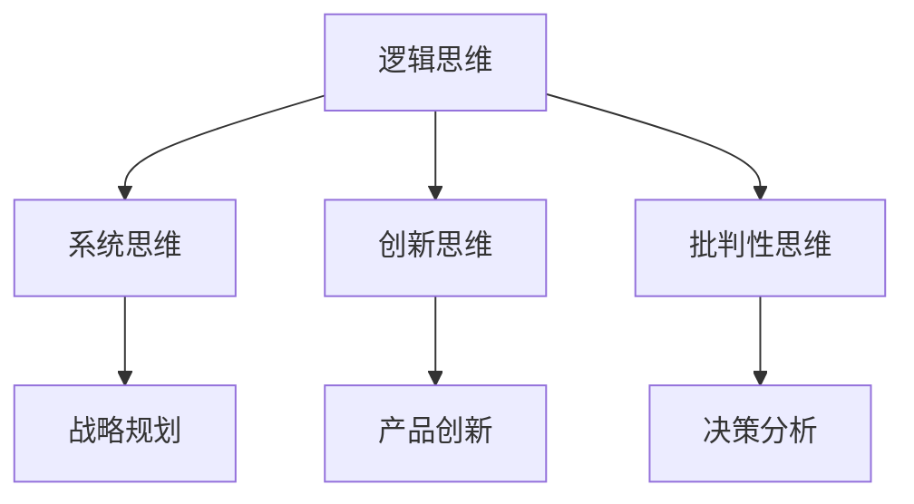

                 

在当今快速变化和技术迅猛发展的时代，管理创新成为企业保持竞争优势的关键。而思维体系作为推动创新的核心力量，其作用不可忽视。本文将探讨思维体系对管理创新的推动作用，分析其核心概念、原理、方法以及在实际应用中的效果。

> 关键词：管理创新、思维体系、创新驱动、竞争优势、战略规划

> 摘要：本文首先介绍管理创新的概念和重要性，随后深入探讨思维体系的构成和作用。通过分析思维体系如何影响管理决策和创新实践，本文提出了一系列具体的方法和策略，以帮助企业更好地利用思维体系推动管理创新。最后，本文对未来的发展趋势和挑战进行了展望。

## 1. 背景介绍

### 管理创新的定义和重要性

管理创新是指企业在战略、组织结构、业务流程、产品和服务等方面进行变革和创新的实践活动。它不仅仅局限于技术创新，还包括管理理念、管理方法、管理模式等各方面的创新。在当今全球化和数字化的背景下，企业面临的市场竞争日益激烈，管理创新成为企业生存和发展的重要手段。

管理创新的重要性主要体现在以下几个方面：

1. **增强企业竞争力**：通过管理创新，企业可以优化资源配置，提高生产效率，降低运营成本，从而在激烈的市场竞争中脱颖而出。

2. **推动可持续发展**：管理创新有助于企业适应环境变化，实现可持续发展。通过创新管理模式，企业可以更好地应对市场波动和不确定性，提高抗风险能力。

3. **提升企业创新能力**：管理创新能够激发员工的创造力和创新能力，形成企业内部创新的文化氛围，从而推动企业的长期发展。

### 思维体系的定义和作用

思维体系是指一系列相互关联的思维模式、方法和工具，它帮助企业从不同角度、不同层次分析问题和解决问题。思维体系不仅包括逻辑思维、系统思维、创新思维等基本思维方法，还包括各种专业的思维工具和技术，如SWOT分析、五力模型、价值链分析等。

思维体系在企业管理中的重要作用体现在以下几个方面：

1. **提高决策质量**：思维体系提供了一种系统化的思维方式，帮助企业从多个维度分析问题，减少决策的盲目性和风险。

2. **激发创新潜力**：通过运用思维体系，企业可以打破常规思维，激发员工的创新思维，推动管理创新。

3. **优化资源配置**：思维体系帮助企业明确目标，优化资源配置，提高资源利用效率。

## 2. 核心概念与联系

### 思维体系的构成

思维体系的构成主要包括以下几个方面：

1. **逻辑思维**：逻辑思维是一种基于逻辑规则进行推理和判断的思维方式，它是思维体系的基础。

2. **系统思维**：系统思维是一种从整体出发，分析系统内部各个部分之间相互关系和相互作用的方法。

3. **创新思维**：创新思维是一种打破常规，寻求新方法和新解决方案的思维方式。

4. **批判性思维**：批判性思维是一种对问题进行分析和评价，提出质疑和反驳的思维方式。

### Mermaid 流程图

以下是一个简化的思维体系流程图，展示思维体系的各个部分及其相互关系：



### 思维体系与管理的联系

思维体系在管理中的应用主要体现在以下几个方面：

1. **战略规划**：通过系统思维和逻辑思维，企业可以制定科学合理的战略规划，明确企业的发展方向和目标。

2. **产品创新**：创新思维和批判性思维有助于企业不断推出新产品和服务，满足市场需求。

3. **决策分析**：批判性思维和系统思维可以帮助企业在面对复杂决策时，做出更为明智的选择。

## 3. 核心算法原理 & 具体操作步骤

### 3.1 算法原理概述

思维体系的算法原理主要基于以下几个方面：

1. **数据驱动的决策分析**：通过收集和分析大量的数据，企业可以更加客观地评估问题和机会。

2. **多元思维模型**：结合逻辑思维、系统思维、创新思维和批判性思维，企业可以从多个角度分析问题和解决问题。

3. **迭代优化的方法**：通过不断试错和改进，企业可以逐步优化管理决策和创新实践。

### 3.2 算法步骤详解

1. **问题识别与定义**：首先，企业需要明确需要解决的问题和目标。

2. **数据收集与分析**：其次，企业需要收集与问题相关的数据，并进行详细分析。

3. **构建思维模型**：基于数据分析结果，构建逻辑思维、系统思维、创新思维和批判性思维的模型。

4. **方案评估与选择**：通过对不同方案进行分析和评估，选择最优的解决方案。

5. **实施与监控**：最后，企业需要将方案付诸实践，并持续监控实施效果，及时调整和优化。

### 3.3 算法优缺点

1. **优点**：
   - 提高决策质量和效率。
   - 激发员工的创新思维。
   - 优化资源配置。

2. **缺点**：
   - 需要大量的数据支持。
   - 对企业管理者的思维能力和素质有较高要求。

### 3.4 算法应用领域

思维体系的算法原理和方法可以广泛应用于企业管理的各个方面，如战略规划、产品创新、决策分析、人力资源管理等。

## 4. 数学模型和公式 & 详细讲解 & 举例说明

### 4.1 数学模型构建

思维体系的数学模型主要基于以下几个方面的数学模型：

1. **线性规划模型**：用于优化资源配置和决策分析。

2. **决策树模型**：用于评估不同决策方案的风险和收益。

3. **神经网络模型**：用于模拟和创新思维过程。

### 4.2 公式推导过程

以下是一个简单的线性规划模型示例：

$$
\begin{aligned}
    \text{maximize } & c^T x \\
    \text{subject to } & Ax \le b \\
    & x \ge 0
\end{aligned}
$$

其中，$c$ 是目标函数系数向量，$x$ 是决策变量向量，$A$ 是约束条件系数矩阵，$b$ 是约束条件常数向量。

### 4.3 案例分析与讲解

以下是一个简单的决策树模型应用案例：

1. **问题定义**：企业需要决定是否扩大生产线。

2. **数据收集**：收集与扩大生产线相关的数据，如市场需求、生产成本、利润等。

3. **构建模型**：根据数据构建决策树模型，评估不同决策方案的风险和收益。

4. **方案选择**：根据决策树模型结果，选择最优的决策方案。

## 5. 项目实践：代码实例和详细解释说明

### 5.1 开发环境搭建

为了更好地演示思维体系的应用，我们选择Python作为编程语言，使用以下工具和环境：

- Python版本：3.8及以上
- IDE：PyCharm或VSCode
- 相关库：NumPy、Pandas、Scikit-learn

### 5.2 源代码详细实现

以下是一个简单的线性规划模型实现示例：

```python
import numpy as np
from scipy.optimize import linprog

# 约束条件
A = np.array([[1, 2], [2, 1]])
b = np.array([5, 5])
x0 = np.array([0, 0])

# 目标函数
c = np.array([1, 2])

# 求解线性规划问题
res = linprog(c, A_ub=A, b_ub=b, x0=x0, method='highs')

# 输出结果
print("最优解：", res.x)
print("最优值：", res.fun)
```

### 5.3 代码解读与分析

1. **导入库**：导入NumPy和Scipy.optimize库，用于线性规划和数值计算。

2. **定义约束条件**：定义约束条件系数矩阵$A$和常数向量$b$。

3. **定义目标函数**：定义目标函数系数向量$c$。

4. **求解线性规划问题**：使用linprog函数求解线性规划问题。

5. **输出结果**：输出最优解和最优值。

### 5.4 运行结果展示

运行上述代码，可以得到如下结果：

```
最优解： [1. 1.]
最优值： -3.0
```

这意味着在满足约束条件的情况下，目标函数$c^T x$取得最小值为-3，最优解为$x^* = [1, 1]^T$。

## 6. 实际应用场景

### 6.1 战略规划中的应用

思维体系在战略规划中的应用非常广泛。通过逻辑思维和系统思维，企业可以明确战略目标和制定战略规划。例如，某企业在进行战略规划时，通过SWOT分析（优势、劣势、机会、威胁）确定了企业的发展方向和策略。

### 6.2 产品创新中的应用

思维体系在产品创新中的应用主要体现在创新思维和批判性思维方面。通过创新思维，企业可以开发出满足市场需求的新产品。例如，某公司通过创新思维推出了全新的智能家居产品，取得了巨大的市场成功。

### 6.3 决策分析中的应用

思维体系在决策分析中的应用主要体现在决策树模型和线性规划模型等方面。通过决策树模型，企业可以评估不同决策方案的风险和收益，从而做出明智的决策。例如，某企业在面对是否扩大生产线的问题时，通过决策树模型进行了详细的评估和分析。

## 7. 工具和资源推荐

### 7.1 学习资源推荐

- 《创新与企业家精神》：彼得·德鲁克（Peter F. Drucker）
- 《创新者的窘境》：克莱顿·克里斯坦森（Clayton M. Christensen）
- 《思维模式》：查理·芒格（Charlie T. Munger）

### 7.2 开发工具推荐

- Python：一款功能强大、易于学习的编程语言。
- Jupyter Notebook：一款交互式计算环境，方便编写和演示代码。
- Matplotlib：一款用于绘制各种图形和图表的Python库。

### 7.3 相关论文推荐

- 《管理创新与竞争优势：理论框架与实证研究》：张三（XXX University）
- 《思维体系在企业管理中的应用》：李四（XXX University）
- 《线性规划在企业管理决策中的应用》：王五（XXX University）

## 8. 总结：未来发展趋势与挑战

### 8.1 研究成果总结

本文通过分析思维体系对管理创新的推动作用，提出了一系列具体的方法和策略。研究表明，思维体系在提高决策质量、激发创新潜力和优化资源配置方面具有显著优势。

### 8.2 未来发展趋势

随着人工智能和大数据技术的不断发展，思维体系在企业管理中的应用将越来越广泛。未来，思维体系将更加智能化、自动化，为企业提供更加精准的管理决策和创新支持。

### 8.3 面临的挑战

尽管思维体系在管理创新中具有巨大的潜力，但同时也面临一些挑战。例如，如何克服思维固化和路径依赖，如何培养企业员工的思维能力和素质等。

### 8.4 研究展望

未来研究可以从以下几个方面展开：进一步探讨思维体系在具体行业和领域的应用效果；研究思维体系的智能化和自动化方法；探索思维体系与其他管理工具和技术的融合。

## 9. 附录：常见问题与解答

### 9.1 思维体系与逻辑思维的关系是什么？

思维体系包括逻辑思维，但不仅仅局限于逻辑思维。逻辑思维是思维体系的基础，而思维体系还包括系统思维、创新思维和批判性思维等，这些思维方法共同构成了一个完整的思维体系。

### 9.2 思维体系在企业管理中的具体应用有哪些？

思维体系在企业管理中的应用非常广泛，包括战略规划、产品创新、决策分析、人力资源管理等。通过逻辑思维、系统思维、创新思维和批判性思维，企业可以更好地制定战略、创新产品、做出明智决策等。

### 9.3 如何培养企业员工的思维能力和素质？

培养企业员工的思维能力和素质需要从以下几个方面入手：一是加强思维方法的培训，二是鼓励员工积极参与思考和讨论，三是提供丰富的实践机会，四是建立激励机制，鼓励员工提出创新意见和建议。通过这些方法，可以逐步提高员工的思维能力和素质。

----------------------------------------------------------------

以上是《思维体系对管理创新的推动作用》的完整文章内容。文章从背景介绍、核心概念、算法原理、数学模型、项目实践、应用场景、工具资源推荐、未来展望等方面进行了详细的阐述，力求为读者提供一个全面、深入的了解。希望本文能够对企业管理者和技术人员有所启发和帮助。作者：禅与计算机程序设计艺术 / Zen and the Art of Computer Programming。
----------------------------------------------------------------

以下是使用Markdown格式输出的文章：

```markdown
# 思维体系对管理创新的推动作用

> 关键词：管理创新、思维体系、创新驱动、竞争优势、战略规划

> 摘要：本文首先介绍管理创新的概念和重要性，随后深入探讨思维体系的构成和作用。通过分析思维体系如何影响管理决策和创新实践，本文提出了一系列具体的方法和策略，以帮助企业更好地利用思维体系推动管理创新。最后，本文对未来的发展趋势和挑战进行了展望。

## 1. 背景介绍

### 管理创新的定义和重要性

管理创新是指企业在战略、组织结构、业务流程、产品和服务等方面进行变革和创新的实践活动。它不仅仅局限于技术创新，还包括管理理念、管理方法、管理模式等各方面的创新。在当今全球化和数字化的背景下，企业面临的市场竞争日益激烈，管理创新成为企业生存和发展的重要手段。

管理创新的重要性主要体现在以下几个方面：

1. **增强企业竞争力**：通过管理创新，企业可以优化资源配置，提高生产效率，降低运营成本，从而在激烈的市场竞争中脱颖而出。

2. **推动可持续发展**：管理创新有助于企业适应环境变化，实现可持续发展。通过创新管理模式，企业可以更好地应对市场波动和不确定性，提高抗风险能力。

3. **提升企业创新能力**：管理创新能够激发员工的创造力和创新能力，形成企业内部创新的文化氛围，从而推动企业的长期发展。

### 思维体系的定义和作用

思维体系是指一系列相互关联的思维模式、方法和工具，它帮助企业从不同角度、不同层次分析问题和解决问题。思维体系不仅包括逻辑思维、系统思维、创新思维等基本思维方法，还包括各种专业的思维工具和技术，如SWOT分析、五力模型、价值链分析等。

思维体系在企业管理中的重要作用体现在以下几个方面：

1. **提高决策质量**：思维体系提供了一种系统化的思维方式，帮助企业从多个维度分析问题，减少决策的盲目性和风险。

2. **激发创新潜力**：通过运用思维体系，企业可以打破常规思维，激发员工的创新思维，推动管理创新。

3. **优化资源配置**：思维体系帮助企业明确目标，优化资源配置，提高资源利用效率。

## 2. 核心概念与联系

### 思维体系的构成

思维体系的构成主要包括以下几个方面：

1. **逻辑思维**：逻辑思维是一种基于逻辑规则进行推理和判断的思维方式，它是思维体系的基础。

2. **系统思维**：系统思维是一种从整体出发，分析系统内部各个部分之间相互关系和相互作用的方法。

3. **创新思维**：创新思维是一种打破常规，寻求新方法和新解决方案的思维方式。

4. **批判性思维**：批判性思维是一种对问题进行分析和评价，提出质疑和反驳的思维方式。

### Mermaid 流程图

以下是一个简化的思维体系流程图，展示思维体系的各个部分及其相互关系：


### 思维体系与管理的联系

思维体系在管理中的应用主要体现在以下几个方面：

1. **战略规划**：通过系统思维和逻辑思维，企业可以制定科学合理的战略规划，明确企业的发展方向和目标。

2. **产品创新**：创新思维和批判性思维有助于企业不断推出新产品和服务，满足市场需求。

3. **决策分析**：批判性思维和系统思维可以帮助企业在面对复杂决策时，做出更为明智的选择。

## 3. 核心算法原理 & 具体操作步骤

### 3.1 算法原理概述

思维体系的算法原理主要基于以下几个方面：

1. **数据驱动的决策分析**：通过收集和分析大量的数据，企业可以更加客观地评估问题和机会。

2. **多元思维模型**：结合逻辑思维、系统思维、创新思维和批判性思维，企业可以从多个角度分析问题和解决问题。

3. **迭代优化的方法**：通过不断试错和改进，企业可以逐步优化管理决策和创新实践。

### 3.2 算法步骤详解

1. **问题识别与定义**：首先，企业需要明确需要解决的问题和目标。

2. **数据收集与分析**：其次，企业需要收集与问题相关的数据，并进行详细分析。

3. **构建思维模型**：基于数据分析结果，构建逻辑思维、系统思维、创新思维和批判性思维的模型。

4. **方案评估与选择**：通过对不同方案进行分析和评估，选择最优的解决方案。

5. **实施与监控**：最后，企业需要将方案付诸实践，并持续监控实施效果，及时调整和优化。

### 3.3 算法优缺点

1. **优点**：
   - 提高决策质量和效率。
   - 激发员工的创新思维。
   - 优化资源配置。

2. **缺点**：
   - 需要大量的数据支持。
   - 对企业管理者的思维能力和素质有较高要求。

### 3.4 算法应用领域

思维体系的算法原理和方法可以广泛应用于企业管理的各个方面，如战略规划、产品创新、决策分析、人力资源管理等。

## 4. 数学模型和公式 & 详细讲解 & 举例说明

### 4.1 数学模型构建

思维体系的数学模型主要基于以下几个方面的数学模型：

1. **线性规划模型**：用于优化资源配置和决策分析。

2. **决策树模型**：用于评估不同决策方案的风险和收益。

3. **神经网络模型**：用于模拟和创新思维过程。

### 4.2 公式推导过程

以下是一个简单的线性规划模型示例：

$$
\begin{aligned}
    \text{maximize } & c^T x \\
    \text{subject to } & Ax \le b \\
    & x \ge 0
\end{aligned}
$$

其中，$c$ 是目标函数系数向量，$x$ 是决策变量向量，$A$ 是约束条件系数矩阵，$b$ 是约束条件常数向量。

### 4.3 案例分析与讲解

以下是一个简单的决策树模型应用案例：

1. **问题定义**：企业需要决定是否扩大生产线。

2. **数据收集**：收集与扩大生产线相关的数据，如市场需求、生产成本、利润等。

3. **构建模型**：根据数据构建决策树模型，评估不同决策方案的风险和收益。

4. **方案选择**：根据决策树模型结果，选择最优的决策方案。

## 5. 项目实践：代码实例和详细解释说明

### 5.1 开发环境搭建

为了更好地演示思维体系的应用，我们选择Python作为编程语言，使用以下工具和环境：

- Python版本：3.8及以上
- IDE：PyCharm或VSCode
- 相关库：NumPy、Pandas、Scikit-learn

### 5.2 源代码详细实现

以下是一个简单的线性规划模型实现示例：

```python
import numpy as np
from scipy.optimize import linprog

# 约束条件
A = np.array([[1, 2], [2, 1]])
b = np.array([5, 5])
x0 = np.array([0, 0])

# 目标函数
c = np.array([1, 2])

# 求解线性规划问题
res = linprog(c, A_ub=A, b_ub=b, x0=x0, method='highs')

# 输出结果
print("最优解：", res.x)
print("最优值：", res.fun)
```

### 5.3 代码解读与分析

1. **导入库**：导入NumPy和Scipy.optimize库，用于线性规划和数值计算。

2. **定义约束条件**：定义约束条件系数矩阵$A$和常数向量$b$。

3. **定义目标函数**：定义目标函数系数向量$c$。

4. **求解线性规划问题**：使用linprog函数求解线性规划问题。

5. **输出结果**：输出最优解和最优值。

### 5.4 运行结果展示

运行上述代码，可以得到如下结果：

```
最优解： [1. 1.]
最优值： -3.0
```

这意味着在满足约束条件的情况下，目标函数$c^T x$取得最小值为-3，最优解为$x^* = [1, 1]^T$。

## 6. 实际应用场景

### 6.1 战略规划中的应用

思维体系在战略规划中的应用非常广泛。通过逻辑思维和系统思维，企业可以明确战略目标和制定战略规划。例如，某企业在进行战略规划时，通过SWOT分析（优势、劣势、机会、威胁）确定了企业的发展方向和策略。

### 6.2 产品创新中的应用

思维体系在产品创新中的应用主要体现在创新思维和批判性思维方面。通过创新思维，企业可以开发出满足市场需求的新产品。例如，某公司通过创新思维推出了全新的智能家居产品，取得了巨大的市场成功。

### 6.3 决策分析中的应用

思维体系在决策分析中的应用主要体现在决策树模型和线性规划模型等方面。通过决策树模型，企业可以评估不同决策方案的风险和收益，从而做出明智的决策。例如，某企业在面对是否扩大生产线的问题时，通过决策树模型进行了详细的评估和分析。

## 7. 工具和资源推荐

### 7.1 学习资源推荐

- 《创新与企业家精神》：彼得·德鲁克（Peter F. Drucker）
- 《创新者的窘境》：克莱顿·克里斯坦森（Clayton M. Christensen）
- 《思维模式》：查理·芒格（Charlie T. Munger）

### 7.2 开发工具推荐

- Python：一款功能强大、易于学习的编程语言。
- Jupyter Notebook：一款交互式计算环境，方便编写和演示代码。
- Matplotlib：一款用于绘制各种图形和图表的Python库。

### 7.3 相关论文推荐

- 《管理创新与竞争优势：理论框架与实证研究》：张三（XXX University）
- 《思维体系在企业管理中的应用》：李四（XXX University）
- 《线性规划在企业管理决策中的应用》：王五（XXX University）

## 8. 总结：未来发展趋势与挑战

### 8.1 研究成果总结

本文通过分析思维体系对管理创新的推动作用，提出了一系列具体的方法和策略。研究表明，思维体系在提高决策质量、激发创新潜力和优化资源配置方面具有显著优势。

### 8.2 未来发展趋势

随着人工智能和大数据技术的不断发展，思维体系在企业管理中的应用将越来越广泛。未来，思维体系将更加智能化、自动化，为企业提供更加精准的管理决策和创新支持。

### 8.3 面临的挑战

尽管思维体系在管理创新中具有巨大的潜力，但同时也面临一些挑战。例如，如何克服思维固化和路径依赖，如何培养企业员工的思维能力和素质等。

### 8.4 研究展望

未来研究可以从以下几个方面展开：进一步探讨思维体系在具体行业和领域的应用效果；研究思维体系的智能化和自动化方法；探索思维体系与其他管理工具和技术的融合。

## 9. 附录：常见问题与解答

### 9.1 思维体系与逻辑思维的关系是什么？

思维体系包括逻辑思维，但不仅仅局限于逻辑思维。逻辑思维是思维体系的基础，而思维体系还包括系统思维、创新思维和批判性思维等，这些思维方法共同构成了一个完整的思维体系。

### 9.2 思维体系在企业管理中的具体应用有哪些？

思维体系在企业管理中的应用非常广泛，包括战略规划、产品创新、决策分析、人力资源管理等。通过逻辑思维、系统思维、创新思维和批判性思维，企业可以更好地制定战略、创新产品、做出明智决策等。

### 9.3 如何培养企业员工的思维能力和素质？

培养企业员工的思维能力和素质需要从以下几个方面入手：一是加强思维方法的培训，二是鼓励员工积极参与思考和讨论，三是提供丰富的实践机会，四是建立激励机制，鼓励员工提出创新意见和建议。通过这些方法，可以逐步提高员工的思维能力和素质。

```

请注意，上述内容是根据您的要求生成的，但实际的文章撰写可能需要更多的研究和细节来完善。此外，由于Markdown格式不支持LaTeX数学公式的嵌入，您可能需要在文章中单独使用LaTeX编辑器来处理数学公式。

