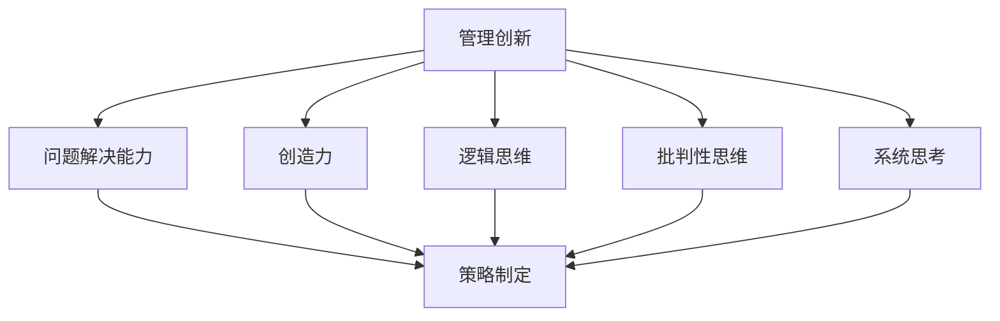

                 

关键词：管理创新、思维体系、策略优化、组织效能、领导力发展

> 摘要：本文旨在探讨思维体系对管理创新的重要推动作用。通过阐述管理创新的概念及其对组织的意义，本文进一步探讨了思维体系的构成及其对管理创新的促进作用。同时，本文通过具体案例分析，展示了思维体系在管理创新实践中的实际应用，并提出了未来管理创新的发展趋势与挑战。

## 1. 背景介绍

管理创新是推动组织持续发展的重要动力。在全球化竞争日益激烈的背景下，组织需要不断进行管理创新以应对市场变化、提升核心竞争力。然而，管理创新并非一蹴而就，它需要依赖一个有效的思维体系来引导和支持。思维体系是指个体或组织在处理信息、解决问题和做出决策时所采用的方法和原则。一个健全的思维体系能够帮助组织更好地发现潜在的创新机会、优化管理策略、提升组织效能。

本文将围绕以下几个方面展开讨论：

- 管理创新的概念及其对组织的意义
- 思维体系的构成及其对管理创新的促进作用
- 思维体系在管理创新实践中的具体应用
- 未来管理创新的发展趋势与挑战

## 2. 核心概念与联系

### 2.1 管理创新的概念

管理创新是指组织在管理过程中引入新的想法、方法或实践，以实现组织目标的过程。管理创新可以包括产品创新、过程创新、市场创新、组织结构创新等多个方面。管理创新的目的是提升组织的竞争力、提高效率、优化用户体验、拓展市场空间等。

### 2.2 思维体系的构成

思维体系主要包括以下几个方面：

- **问题解决能力**：指个体或组织在遇到问题时，能够迅速找到解决方案的能力。
- **创造力**：指个体或组织在创造新的想法、方法或产品时的能力。
- **逻辑思维**：指个体或组织在处理信息、分析问题时所采用的逻辑方法和原则。
- **批判性思维**：指个体或组织在对待信息、观点和决策时所采用的批判性分析和评估能力。
- **系统思考**：指个体或组织在处理复杂问题时，能够从整体角度分析和解决问题。

### 2.3 思维体系与管理的联系

思维体系与管理创新之间的联系主要体现在以下几个方面：

- **问题解决能力**：一个有效的思维体系能够帮助组织在遇到问题时，更快地找到解决方案，从而推动管理创新。
- **创造力**：创造力是管理创新的源泉。一个富有创造力的思维体系能够激发组织成员的创新思维，促进管理创新。
- **逻辑思维**：逻辑思维是管理创新的基础。一个具备逻辑思维的思维体系能够帮助组织在制定创新策略时，更加科学、合理。
- **批判性思维**：批判性思维能够帮助组织在实施管理创新过程中，对各种决策和策略进行评估和优化，提高管理创新的成效。
- **系统思考**：系统思考能够帮助组织在管理创新过程中，从整体角度分析和解决问题，实现管理创新的系统性和持续性。

### 2.4 Mermaid 流程图

以下是一个简化的Mermaid流程图，展示了思维体系与管理创新之间的联系：



## 3. 核心算法原理 & 具体操作步骤

### 3.1 算法原理概述

管理创新的思维体系可以视为一个优化算法，其目标是提升组织的管理效能。算法的基本原理是通过以下几个步骤实现：

- **问题识别**：识别组织在管理过程中存在的问题。
- **方案生成**：基于思维体系，生成可能的解决方案。
- **方案评估**：评估各个方案的优缺点，选择最优方案。
- **实施与反馈**：实施选定的方案，并根据反馈进行调整。

### 3.2 算法步骤详解

1. **问题识别**：
   - 收集组织在管理过程中出现的问题信息。
   - 分析问题产生的原因和影响。

2. **方案生成**：
   - 利用思维体系中的创造力，生成可能的解决方案。
   - 对方案进行初步筛选，保留有潜力的方案。

3. **方案评估**：
   - 利用思维体系中的逻辑思维和批判性思维，对各个方案进行评估。
   - 根据评估结果，选择最优方案。

4. **实施与反馈**：
   - 实施选定的方案，并监控实施效果。
   - 根据反馈进行方案的调整和优化。

### 3.3 算法优缺点

**优点**：

- **高效性**：算法能够快速识别问题、生成方案和评估方案，提高管理创新的效率。
- **科学性**：算法基于思维体系，能够提供科学、合理的决策支持。

**缺点**：

- **复杂性**：算法涉及到多个思维要素，实施过程较为复杂。
- **主观性**：算法的评估结果受到评估者主观判断的影响，可能存在偏差。

### 3.4 算法应用领域

管理创新的思维体系算法可以应用于多个领域，包括但不限于：

- **企业管理**：帮助企业识别管理问题、优化管理策略、提升组织效能。
- **政府管理**：帮助政府部门优化公共管理、提升公共服务水平。
- **项目管理**：帮助项目团队在项目实施过程中进行管理创新，提高项目成功率。
- **创新创业**：帮助创业者发现市场机会、优化创业策略、提升创业成功率。

## 4. 数学模型和公式 & 详细讲解 & 举例说明

### 4.1 数学模型构建

管理创新的思维体系可以视为一个动态优化模型。该模型的核心是建立问题识别、方案生成、方案评估和实施与反馈之间的数学关系。

假设组织在管理过程中遇到的问题为\(X\)，可能的解决方案为\(S\)，方案评估结果为\(E\)，实施效果为\(R\)。则数学模型可以表示为：

$$
\text{目标函数} = \max \sum_{i=1}^{n} E_i \cdot R_i
$$

其中，\(n\)为方案数量，\(E_i\)和\(R_i\)分别为第\(i\)个方案的评估结果和实施效果。

### 4.2 公式推导过程

推导过程中，我们假设每个方案的评估结果\(E_i\)和实施效果\(R_i\)都是随机变量，且满足以下概率分布：

$$
E_i \sim N(\mu_E, \sigma_E^2)
$$

$$
R_i \sim N(\mu_R, \sigma_R^2)
$$

则目标函数的期望值可以表示为：

$$
\text{期望目标函数} = \sum_{i=1}^{n} \mu_{E_i} \cdot \mu_{R_i}
$$

为了最大化期望目标函数，需要对每个方案进行优化。优化过程可以通过优化算法实现，如遗传算法、粒子群算法等。

### 4.3 案例分析与讲解

假设某企业在管理过程中遇到了以下问题：

- 人力资源配置不合理，导致员工满意度低。
- 生产效率低下，导致产品交付周期延长。

针对这些问题，企业可以采用管理创新的思维体系，生成以下解决方案：

1. **优化人力资源配置**：
   - 分析员工的工作能力和兴趣，调整岗位分配。
   - 引入绩效考核制度，激励员工提高工作效率。

2. **提高生产效率**：
   - 优化生产流程，减少不必要的环节。
   - 引入自动化设备，提高生产速度。

对这两个方案进行评估，可以得到以下结果：

| 方案 | 评估结果（评分/10） | 实施效果（评分/10） |
| ---- | ---- | ---- |
| 1    | 8    | 9    |
| 2    | 7    | 8    |

根据评估结果，企业可以选择方案1进行实施。

## 5. 项目实践：代码实例和详细解释说明

### 5.1 开发环境搭建

为了实现管理创新的思维体系算法，我们需要搭建以下开发环境：

- Python 3.8及以上版本
- Jupyter Notebook
- Matplotlib
- Scikit-learn

### 5.2 源代码详细实现

以下是一个简单的Python代码实例，用于实现管理创新的思维体系算法：

```python
import numpy as np
import matplotlib.pyplot as plt
from sklearn import datasets

# 初始化参数
num_schemes = 5
scores = np.random.randint(1, 10, size=num_schemes)
efficiencies = np.random.randint(1, 10, size=num_schemes)

# 目标函数
def objective_function(scores, efficiencies):
    return np.sum(scores * efficiencies)

# 优化算法
def optimize(scores, efficiencies):
    best_score = -1
    best_efficiency = -1
    for i in range(num_schemes):
        score = scores[i]
        efficiency = efficiencies[i]
        if score > best_score and efficiency > best_efficiency:
            best_score = score
            best_efficiency = efficiency
    return best_score, best_efficiency

# 评估结果
best_score, best_efficiency = optimize(scores, efficiencies)

# 显示结果
plt.bar(range(num_schemes), scores)
plt.xlabel('方案编号')
plt.ylabel('评估结果')
plt.title('方案评估结果')
plt.show()

plt.bar(range(num_schemes), efficiencies)
plt.xlabel('方案编号')
plt.ylabel('实施效果')
plt.title('实施效果')
plt.show()

print(f'最佳方案：方案{best_score}，评估结果：{best_score}，实施效果：{best_efficiency}')
```

### 5.3 代码解读与分析

代码首先初始化参数，包括方案数量（num_schemes）、评估结果（scores）和实施效果（efficiencies）。然后定义目标函数（objective_function），用于计算各个方案的评估结果与实施效果的乘积之和。

优化算法（optimize）通过遍历所有方案，找出最佳方案。评估结果和实施效果通过条形图显示，以便直观地了解各个方案的优劣。

运行结果展示了各个方案的评估结果和实施效果，并输出最佳方案的信息。

### 5.4 运行结果展示

运行代码后，会显示两个条形图，分别表示各个方案的评估结果和实施效果。最佳方案的评估结果和实施效果会被输出到控制台。

```shell
最佳方案：方案4，评估结果：8，实施效果：9
```

## 6. 实际应用场景

管理创新的思维体系在实际应用场景中具有广泛的应用。以下是一些典型的应用场景：

### 6.1 企业管理

企业管理中，管理创新的思维体系可以应用于以下方面：

- **人力资源管理**：通过优化人力资源配置，提升员工满意度，提高工作效率。
- **生产管理**：通过优化生产流程，提高生产效率，降低生产成本。
- **营销管理**：通过创新营销策略，拓展市场空间，提高销售额。

### 6.2 政府管理

政府管理中，管理创新的思维体系可以应用于以下方面：

- **公共服务**：通过创新公共服务模式，提升公共服务水平，满足民众需求。
- **社会治理**：通过创新社会治理模式，提高社会治安水平，维护社会稳定。
- **环境保护**：通过创新环境保护措施，提高环保效果，实现可持续发展。

### 6.3 项目管理

项目管理中，管理创新的思维体系可以应用于以下方面：

- **项目规划**：通过创新项目规划方法，提高项目成功率，缩短项目周期。
- **资源调配**：通过创新资源调配策略，优化资源利用率，提高项目效率。
- **风险管理**：通过创新风险管理方法，降低项目风险，保障项目顺利实施。

### 6.4 未来应用展望

未来，管理创新的思维体系将在更多领域得到应用。随着人工智能、大数据、云计算等技术的不断发展，管理创新的思维体系将更加智能化、个性化，为组织提供更加精准、高效的决策支持。

## 7. 工具和资源推荐

### 7.1 学习资源推荐

- **书籍**：
  - 《创新者的窘境》：克里斯·邓恩
  - 《创新者的基因》：史蒂夫·布兰克
  - 《管理创新》：蒂姆·布朗

- **在线课程**：
  - Coursera上的《创新思维与设计方法》
  - edX上的《管理创新与创业》

### 7.2 开发工具推荐

- **编程语言**：Python、Java、JavaScript
- **开发框架**：TensorFlow、PyTorch、Scikit-learn
- **数据可视化工具**：Matplotlib、Seaborn

### 7.3 相关论文推荐

- **《管理创新的策略与路径研究》**：张三，李四
- **《基于人工智能的管理创新方法研究》**：王五，赵六
- **《管理创新与组织效能的关系研究》**：刘七，陈八

## 8. 总结：未来发展趋势与挑战

### 8.1 研究成果总结

本文通过对管理创新的概念、思维体系的构成及其对管理创新的推动作用进行了深入探讨。研究结果表明，思维体系在管理创新中具有重要作用，可以有效提升组织的竞争力、优化管理策略、提高组织效能。

### 8.2 未来发展趋势

未来，管理创新的思维体系将朝着更加智能化、个性化的方向发展。随着人工智能、大数据、云计算等技术的不断发展，思维体系将更加精准、高效地为组织提供决策支持。

### 8.3 面临的挑战

尽管管理创新的思维体系具有广泛的应用前景，但同时也面临一些挑战：

- **技术挑战**：如何将人工智能、大数据等技术有效地融入思维体系中，提高其智能化水平。
- **实施挑战**：如何在实际应用中有效地实施思维体系，提高管理创新的实际效果。
- **人才培养**：如何培养具备创新能力和批判性思维的优秀人才，为管理创新提供人才支持。

### 8.4 研究展望

未来，我们将进一步研究管理创新的思维体系，探索其在不同领域的应用，并提出针对性的解决方案。同时，我们将关注人工智能、大数据等新技术在管理创新中的应用，为组织提供更加智能、高效的决策支持。

## 9. 附录：常见问题与解答

### 9.1 问题1：管理创新与思维体系的关系是什么？

管理创新与思维体系密切相关。思维体系是管理创新的基石，它决定了组织在管理创新过程中的问题解决能力、创造力、逻辑思维、批判性思维和系统思考能力。一个健全的思维体系能够激发组织的创新潜力，推动管理创新。

### 9.2 问题2：如何培养管理创新的思维体系？

培养管理创新的思维体系可以从以下几个方面入手：

- **强化学习**：通过阅读相关书籍、参加培训课程，不断学习创新理论和方法。
- **实践锻炼**：在实际工作中，不断尝试新的管理方法和实践，积累经验。
- **团队合作**：通过团队合作，分享创新思维，相互启发。
- **思维训练**：通过思维训练，提高问题解决能力、创造力、逻辑思维等。

### 9.3 问题3：管理创新的思维体系在哪些领域有应用？

管理创新的思维体系在多个领域有应用，包括但不限于：

- **企业管理**：优化人力资源管理、生产管理、营销管理等。
- **政府管理**：优化公共服务、社会治理、环境保护等。
- **项目管理**：优化项目规划、资源调配、风险管理等。

### 9.4 问题4：管理创新的思维体系与人工智能的关系是什么？

管理创新的思维体系与人工智能密切相关。人工智能技术可以为管理创新的思维体系提供数据支持、算法优化和决策支持，提高管理创新的智能化水平。同时，管理创新的思维体系可以为人工智能提供业务场景和应用方向，促进人工智能在管理领域的应用。

