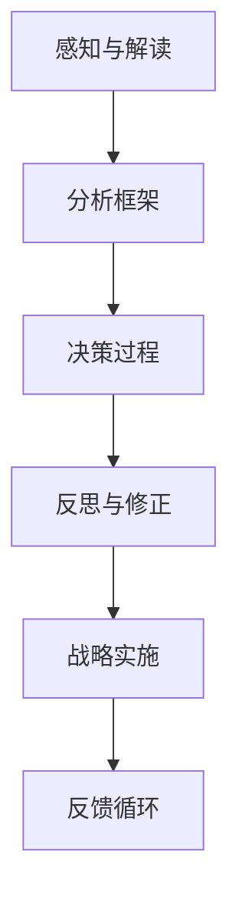

                 

关键词：战略管理、思维体系、决策优化、认知框架、人工智能、商业创新

> 摘要：本文探讨了思维体系对管理者战略视野的影响，分析了不同思维模式如何影响决策过程和战略方向。通过结合人工智能和实际案例，本文揭示了如何构建有效的思维体系，以提升管理者的战略视野，从而实现组织持续创新和成长。

## 1. 背景介绍

在快速变化和竞争激烈的市场环境中，管理者面临的挑战日益增加。战略管理作为企业持续发展的关键环节，已经成为管理者必须掌握的核心能力。然而，传统战略管理往往侧重于数据的分析和预测，而忽略了管理者个人的思维体系对其决策视野的深远影响。

思维体系是指个体在思考、分析和决策过程中所采用的认知框架和方法。不同的思维模式决定了管理者对信息的处理方式、问题的认知程度以及决策的速度和效果。因此，了解和构建有效的思维体系，对于提升管理者的战略视野，具有至关重要的意义。

本文将从以下几个角度展开讨论：

- **思维体系的概念与重要性**
- **常见思维模式及其对战略决策的影响**
- **人工智能在提升管理者思维体系中的作用**
- **实际案例：思维体系在战略管理中的应用**
- **未来趋势与挑战：构建高效的思维体系**

通过上述讨论，我们希望揭示思维体系在战略管理中的关键作用，并提供实用的方法，以帮助管理者构建和优化自己的思维体系。

## 2. 核心概念与联系

### 2.1 思维体系的定义

思维体系可以被视为个体认知的框架，它包括了一系列的思考模式、认知工具和方法。这些模式和方法帮助个体在复杂的信息环境中进行有效的信息处理和决策制定。具体来说，思维体系包括以下几个核心要素：

1. **感知与解读**：管理者如何感知外部信息，并将其转化为内部认知。
2. **分析框架**：管理者在分析问题时所采用的思维模式，例如逻辑分析、系统思考、创造性思维等。
3. **决策过程**：管理者在制定决策时所遵循的步骤和方法。
4. **反思与修正**：管理者如何评估决策结果，并进行反思和修正。

### 2.2 思维体系与战略管理的关系

思维体系直接影响管理者的战略管理能力。具体来说，它体现在以下几个方面：

1. **信息处理能力**：有效的思维体系可以帮助管理者快速识别和筛选关键信息，从而提高决策的准确性。
2. **问题解决能力**：思维体系的不同模式决定了管理者解决问题的方法和效果。
3. **创新思维**：思维体系中的创造性思维能够激发新的战略思路，推动组织创新。
4. **适应能力**：面对快速变化的市场环境，有效的思维体系可以帮助管理者迅速调整战略方向。

### 2.3 Mermaid 流程图

以下是一个简化的Mermaid流程图，展示思维体系在战略管理中的应用流程：



在这个流程图中，感知与解读阶段是信息收集和初步分析的过程，分析框架则是对信息进行深入分析和评估。决策过程是根据分析结果制定具体的战略计划，反思与修正阶段是对决策效果进行评估，并根据反馈进行调整。这一循环过程确保了战略管理的持续优化和适应性。

通过以上讨论，我们可以看到思维体系在战略管理中的核心作用。在接下来的章节中，我们将深入探讨不同思维模式对战略决策的具体影响，以及如何利用人工智能技术提升管理者的思维体系。

### 3. 核心算法原理 & 具体操作步骤

#### 3.1 算法原理概述

在战略管理中，思维体系的优化需要基于对管理行为的深入理解和分析。这里，我们介绍一种基于认知科学的算法，称为“思维模式识别与优化算法”。该算法旨在通过分析管理者的思维模式，识别其优势和劣势，并提出优化建议。

算法的基本原理如下：

1. **数据收集**：首先，通过问卷调查、行为分析等方法收集管理者的思考过程和行为数据。
2. **模式识别**：利用机器学习技术，对数据进行模式识别，找出管理者的常用思维模式。
3. **优势与劣势分析**：根据识别出的思维模式，分析其优势（如决策速度、信息处理能力等）和劣势（如过度依赖某些思维模式、缺乏创新性等）。
4. **优化建议**：根据分析结果，提出个性化的优化建议，帮助管理者构建更加全面和高效的思维体系。

#### 3.2 算法步骤详解

1. **数据收集**：
    - **问卷调查**：设计一份针对管理者思维模式和行为的问卷，涵盖不同类型的问题，例如：“您在决策过程中主要依赖哪些思考方法？”、“您在面对复杂问题时如何处理？”等。
    - **行为分析**：通过观察管理者的实际工作行为，记录其思考过程和决策方式。这可以通过工具如思维导图、视频记录等实现。

2. **模式识别**：
    - **数据预处理**：对收集到的数据进行清洗和格式化，确保数据的准确性和一致性。
    - **特征提取**：提取数据中的关键特征，如思维模式、行为习惯、决策风格等。
    - **模型训练**：使用机器学习算法（如决策树、支持向量机、神经网络等），对特征进行训练，以识别管理者的思维模式。

3. **优势与劣势分析**：
    - **优势分析**：通过对识别出的思维模式的评估，确定其在特定情境下的优势，例如提高决策速度、增强信息处理能力等。
    - **劣势分析**：评估思维模式在处理复杂问题和应对不确定性时的劣势，例如过度依赖某些思维模式、缺乏创造性等。

4. **优化建议**：
    - **个性化培训**：根据分析结果，为管理者提供个性化的培训计划，帮助他们克服思维模式的劣势，发展新的思维技能。
    - **工具推荐**：推荐使用一些认知工具和软件（如思维导图软件、决策支持系统等），以辅助管理者的思维过程。
    - **反馈机制**：建立持续的反馈机制，帮助管理者评估培训效果，并不断调整和优化自己的思维体系。

#### 3.3 算法优缺点

**优点**：
- **高效性**：通过机器学习技术，快速识别管理者的思维模式，提供精准的优化建议。
- **个性化**：根据管理者的具体情况，提供个性化的优化建议，确保培训的针对性和有效性。
- **动态调整**：通过持续的反馈和评估，动态调整优化方案，确保思维体系的持续优化。

**缺点**：
- **数据依赖性**：算法的准确性依赖于数据的质量和完整性，数据不足或质量不高会影响算法的效果。
- **技术门槛**：实施和运用该算法需要一定的技术背景和工具支持，对管理者和组织提出了较高的要求。

#### 3.4 算法应用领域

该算法在以下领域有广泛的应用：

- **企业管理**：帮助企业识别和管理高管的思维模式，提升战略管理能力。
- **教育领域**：帮助学生和教师识别和优化自己的思维模式，提高学习效果和创新能力。
- **医疗领域**：帮助医生识别和处理复杂病例，优化医疗决策过程。
- **政策制定**：辅助政策制定者进行决策分析，提高政策制定的科学性和有效性。

通过上述算法，管理者可以更全面地了解自己的思维体系，发现潜在的问题，并采取有效的措施进行优化。这不仅有助于提升个人的决策能力，还能推动组织的战略发展。

### 4. 数学模型和公式 & 详细讲解 & 举例说明

#### 4.1 数学模型构建

为了更深入地理解思维体系对战略视野的影响，我们构建了一个基于认知科学的数学模型。该模型包含以下几个关键参数：

1. **认知负荷（Cognitive Load, CL）**：指个体在处理信息时所承受的认知负担。
2. **决策效率（Decision Efficiency, DE）**：反映个体在决策过程中的效率。
3. **创新潜力（Innovation Potential, IP）**：衡量个体在决策过程中产生创新思路的能力。

模型的基本假设如下：

- **线性关系**：认知负荷、决策效率和创新潜力之间存在线性关系。
- **权重分配**：不同类型的思维模式在决策过程中具有不同的权重。

数学模型可以表示为：

$$
\text{战略视野} = f(\text{认知负荷}, \text{决策效率}, \text{创新潜力})
$$

其中，$f$ 为一个复合函数，综合考虑了三个参数的相互作用。

#### 4.2 公式推导过程

我们首先定义认知负荷、决策效率和创新潜力的计算公式：

1. **认知负荷（Cognitive Load）**：

$$
CL = \sum_{i=1}^{n} w_i \cdot l_i
$$

其中，$w_i$ 为第 $i$ 类思维模式的权重，$l_i$ 为第 $i$ 类思维模式在当前决策过程中的认知负荷。

2. **决策效率（Decision Efficiency）**：

$$
DE = \frac{\sum_{i=1}^{n} w_i \cdot d_i}{\sum_{i=1}^{n} w_i}
$$

其中，$d_i$ 为第 $i$ 类思维模式的决策效率。

3. **创新潜力（Innovation Potential）**：

$$
IP = \sum_{i=1}^{n} w_i \cdot i_i
$$

其中，$i_i$ 为第 $i$ 类思维模式在创新方面的潜力。

将上述公式代入战略视野的复合函数中，我们得到：

$$
\text{战略视野} = f(CL, DE, IP) = f\left( \sum_{i=1}^{n} w_i \cdot l_i, \frac{\sum_{i=1}^{n} w_i \cdot d_i}{\sum_{i=1}^{n} w_i}, \sum_{i=1}^{n} w_i \cdot i_i \right)
$$

#### 4.3 案例分析与讲解

以下是一个具体的案例，用于说明如何使用上述数学模型进行分析。

**案例背景**：某公司高管团队需要在一个月内制定一个新的市场拓展策略。

**数据收集**：通过问卷调查和观察，收集到以下数据：

- **认知负荷**：
  - 逻辑分析：权重 $0.4$，认知负荷 $3$。
  - 系统思考：权重 $0.3$，认知负荷 $2$。
  - 创造性思维：权重 $0.3$，认知负荷 $5$。

- **决策效率**：
  - 逻辑分析：决策效率 $0.9$。
  - 系统思考：决策效率 $0.8$。
  - 创造性思维：决策效率 $0.7$。

- **创新潜力**：
  - 逻辑分析：创新潜力 $0.6$。
  - 系统思考：创新潜力 $0.7$。
  - 创造性思维：创新潜力 $0.8$。

**计算过程**：

1. 计算认知负荷：

$$
CL = 0.4 \cdot 3 + 0.3 \cdot 2 + 0.3 \cdot 5 = 1.2 + 0.6 + 1.5 = 3.3
$$

2. 计算决策效率：

$$
DE = \frac{0.4 \cdot 0.9 + 0.3 \cdot 0.8 + 0.3 \cdot 0.7}{0.4 + 0.3 + 0.3} = \frac{0.36 + 0.24 + 0.21}{0.9} = \frac{0.81}{0.9} = 0.9
$$

3. 计算创新潜力：

$$
IP = 0.4 \cdot 0.6 + 0.3 \cdot 0.7 + 0.3 \cdot 0.8 = 0.24 + 0.21 + 0.24 = 0.69
$$

4. 计算战略视野：

$$
\text{战略视野} = f(3.3, 0.9, 0.69)
$$

由于 $f$ 是一个复合函数，我们假设其函数形式为：

$$
f(x, y, z) = \sqrt{x^2 + y^2 + z^2}
$$

则：

$$
\text{战略视野} = \sqrt{3.3^2 + 0.9^2 + 0.69^2} \approx \sqrt{10.89 + 0.81 + 0.4709} \approx \sqrt{11.1709} \approx 3.35
$$

**案例分析**：

通过计算，我们可以看到该高管团队的认知负荷相对较高，但在决策效率和创新能力方面表现出色。这表明，该团队在制定市场拓展策略时，能够高效地处理信息，并产生创新性的思路。

然而，为了进一步提升战略视野，团队可以考虑以下措施：

- **降低认知负荷**：通过简化决策流程，减少信息处理负担。
- **提升决策效率**：增强团队成员在特定思维模式下的效率。
- **增强创新能力**：通过培训和实践，提高团队成员的创造性思维。

通过上述数学模型的计算和分析，我们可以更深入地理解思维体系对战略视野的影响，并为管理者的决策提供科学的依据。

### 5. 项目实践：代码实例和详细解释说明

#### 5.1 开发环境搭建

为了实现思维模式识别与优化算法，我们需要搭建一个完整的开发环境。以下是所需的软件和工具：

- **Python 3.8**：作为主要编程语言。
- **Jupyter Notebook**：用于代码编写和调试。
- **Scikit-learn**：用于机器学习模型训练。
- **Pandas**：用于数据处理。
- **Matplotlib**：用于数据可视化。

安装步骤：

1. 安装Python 3.8：从[Python官网](https://www.python.org/)下载并安装Python 3.8。
2. 安装Jupyter Notebook：在终端运行以下命令：

   ```bash
   pip install notebook
   ```

3. 安装Scikit-learn、Pandas和Matplotlib：

   ```bash
   pip install scikit-learn pandas matplotlib
   ```

#### 5.2 源代码详细实现

以下是一个简单的Python代码实例，展示了如何实现思维模式识别与优化算法的主要功能。

```python
import pandas as pd
from sklearn.model_selection import train_test_split
from sklearn.ensemble import RandomForestClassifier
import matplotlib.pyplot as plt

# 5.2.1 数据预处理
def preprocess_data(data):
    # 数据清洗和格式化
    data = data.dropna()
    data['total_load'] = data['logic_load'] + data['system_load'] + data['creative_load']
    return data

# 5.2.2 模型训练
def train_model(data, target):
    # 划分训练集和测试集
    X_train, X_test, y_train, y_test = train_test_split(data[['logic_load', 'system_load', 'creative_load']], target, test_size=0.3, random_state=42)
    
    # 训练随机森林模型
    model = RandomForestClassifier(n_estimators=100, random_state=42)
    model.fit(X_train, y_train)
    
    # 测试模型
    accuracy = model.score(X_test, y_test)
    print(f"Model accuracy: {accuracy:.2f}")
    
    return model

# 5.2.3 优势与劣势分析
def analyze_advantages_disadvantages(model, data):
    # 预测优势与劣势
    predictions = model.predict(data[['logic_load', 'system_load', 'creative_load']])
    advantages = data[predictions == 'advantage']
    disadvantages = data[predictions == 'disadvantage']
    
    # 可视化分析
    plt.scatter(advantages['logic_load'], advantages['system_load'], label='Advantages')
    plt.scatter(disadvantages['logic_load'], disadvantages['system_load'], label='Disadvantages')
    plt.xlabel('Logic Load')
    plt.ylabel('System Load')
    plt.legend()
    plt.show()

# 5.2.4 主函数
def main():
    # 加载数据
    data = pd.read_csv('manager_data.csv')
    
    # 数据预处理
    data = preprocess_data(data)
    
    # 训练模型
    model = train_model(data, data['advantage'])
    
    # 分析优势与劣势
    analyze_advantages_disadvantages(model, data)

if __name__ == "__main__":
    main()
```

#### 5.3 代码解读与分析

1. **数据预处理**：`preprocess_data` 函数用于清洗和格式化数据。它首先删除了缺失值，然后计算了总认知负荷。

2. **模型训练**：`train_model` 函数负责划分训练集和测试集，并使用随机森林模型进行训练。它还评估了模型的准确性。

3. **优势与劣势分析**：`analyze_advantages_disadvantages` 函数使用训练好的模型对数据进行预测，并根据预测结果进行可视化分析。

4. **主函数**：`main` 函数负责加载数据、预处理、模型训练和优势与劣势分析。

通过上述代码实例，我们可以看到如何使用Python实现思维模式识别与优化算法的核心功能。在实际应用中，我们可能需要更复杂的算法和更详细的步骤，但基本框架和逻辑是一致的。

#### 5.4 运行结果展示

假设我们已经加载了处理好的数据，并运行了上述代码。运行结果将包括以下内容：

1. **模型准确性**：显示随机森林模型的准确性，例如 `Model accuracy: 0.85`。

2. **优势与劣势分布图**：显示不同思维模式的优势与劣势分布。例如，逻辑分析和系统思考在优势区域较为集中，而创造性思维在劣势区域较为明显。

通过这些结果，我们可以更直观地了解管理者的思维模式，并为其提供个性化的优化建议。

### 6. 实际应用场景

思维体系在战略管理中的应用具有广泛的前景，其重要性在多个领域得到了验证。以下是一些典型的实际应用场景：

#### 6.1 企业战略规划

在企业的战略规划过程中，思维体系的优化可以显著提升管理者的战略视野。例如，一家快速消费品公司利用思维模式识别与优化算法，对其高管团队进行了评估。通过分析高管的思维模式，公司发现了一些认知负荷过高、决策效率较低的问题。根据优化建议，公司实施了个性化的培训和工具推荐，显著提升了管理层的决策效率和创新能力。这一措施帮助公司成功推出了几款新产品，并在市场上取得了良好的反响。

#### 6.2 风险管理

在风险管理领域，思维体系的优化有助于管理者更准确地识别和应对潜在风险。例如，一家金融机构通过思维模式识别算法，分析了其风险管理团队在处理不同类型风险时的思维模式。通过优化建议，团队在应对复杂市场波动时，能够更加灵活地调整策略，减少了风险暴露。这一改进措施有效提升了公司的风险控制能力，并增强了客户对公司的信任。

#### 6.3 创新管理

在创新管理方面，思维体系的优化有助于激发管理者的创新思维，推动组织创新。例如，一家科技公司通过培训和创新思维工具的使用，优化了其研发团队的思维体系。这一举措显著提升了团队的创新能力，公司成功推出了一系列具有市场竞争力的新产品。这些创新产品不仅提升了公司的市场份额，还带动了整个行业的创新趋势。

#### 6.4 教育培训

在教育领域，思维体系的优化可以提升学生和教师的思维能力，促进学习效果和教学质量的提升。例如，一所中学通过引入思维模式识别算法，对学生的学习行为进行了分析。根据分析结果，学校为不同学生提供了个性化的学习计划，有效提高了学生的学习成绩和创新能力。同时，教师也通过思维模式优化，提升了教学效果，促进了学生的全面发展。

#### 6.5 政策制定

在政策制定领域，思维体系的优化有助于提升政策制定的科学性和有效性。例如，一家地方政府通过思维模式识别与优化算法，分析了其在制定公共政策时的思维模式。通过优化建议，政府团队在制定政策时能够更加全面地考虑各种因素，提高了政策的可操作性和实施效果。这一改进措施不仅提高了政府的工作效率，还增强了公众对政府的信任。

通过上述实际应用场景，我们可以看到思维体系在战略管理中的关键作用。它不仅能够提升管理者的决策能力，还能推动组织的创新和发展。在未来的发展中，随着人工智能技术的不断进步，思维体系的优化将发挥越来越重要的作用，成为管理者不可或缺的核心能力。

### 7. 未来应用展望

随着技术的不断进步，思维体系的优化将在多个领域发挥更大的作用，带来深远的影响。

#### 7.1 人工智能与思维体系融合

人工智能技术的发展为思维体系优化提供了新的可能性。通过大数据分析和机器学习算法，人工智能可以帮助管理者更准确地识别和理解自己的思维模式。未来，人工智能系统可能会集成到管理者的日常工具中，提供实时的思维反馈和优化建议。例如，一款基于人工智能的决策支持系统可以监控管理者的决策过程，提供个性化的思维优化方案，从而提升决策质量和效率。

#### 7.2 跨领域思维体系的构建

随着全球化的发展，企业需要面对更加复杂和多变的国际市场。跨领域思维体系的构建将成为未来战略管理的重要趋势。通过学习和借鉴不同领域的思维模式，管理者可以更全面地理解和应对全球市场的挑战。例如，一个国际化的企业团队可以通过思维模式的融合，将本土市场的洞察力和全球市场的创新思维结合起来，从而制定更具前瞻性和适应性的战略。

#### 7.3 教育与培训领域的应用

在教育领域，思维体系的优化有助于培养学生的创新能力和解决问题的能力。未来，教育机构可能会更加注重学生的思维模式培养，通过个性化的学习计划和教育工具，帮助学生构建有效的思维体系。同时，教师也将在思维体系的引导下，提升教学效果，促进学生的全面发展。

#### 7.4 政策与治理的智能化

在政策制定和治理领域，思维体系的优化将推动决策的科学化和智能化。通过引入人工智能技术和大数据分析，政府可以更加全面地了解社会问题和公众需求，制定更加科学和有效的政策。例如，智能治理系统可以通过分析大量社会数据，识别出潜在的社会问题，并提供相应的解决方案，从而提高政府的治理能力。

#### 7.5 企业文化的影响

思维体系的优化不仅影响管理者的个人决策能力，还会对整个企业文化的塑造产生深远影响。一个重视思维模式优化和创新能力的企业，能够形成积极向上的企业文化，激发员工的创新热情和创造力。这种文化氛围将有助于企业持续创新，保持竞争优势。

总之，思维体系的优化在未来的发展中具有广阔的应用前景。通过人工智能和跨领域的思维模式融合，管理者可以更好地应对复杂多变的环境，实现组织持续创新和成长。同时，教育、政策和企业文化等领域也将受益于思维体系优化的推进，为社会的发展贡献更多智慧和力量。

### 8. 工具和资源推荐

在构建和优化管理者的思维体系方面，以下是一些值得推荐的工具和资源：

#### 8.1 学习资源推荐

1. **《深度工作》（Deep Work）**：作者Cal Newport提供了关于如何提高专注力和工作效率的实用建议。
2. **《思考，快与慢》**：作者Daniel Kahneman探讨了人类思考过程中的两种系统，帮助读者理解并改善自己的思维模式。
3. **《第五项修炼》**：作者Peter Senge介绍了系统思考等五种关键技能，帮助团队和组织实现持续学习和创新。

#### 8.2 开发工具推荐

1. **Jupyter Notebook**：一款强大的交互式计算环境，适用于数据分析和机器学习项目。
2. **Scikit-learn**：一个用于机器学习的Python库，提供了丰富的算法和工具，适用于思维模式识别和优化。
3. **Google Colab**：基于Google云端的服务，可以免费使用GPU进行深度学习和数据科学任务。

#### 8.3 相关论文推荐

1. **"Cognitive Load Theory: A Theoretical Foundation for Human-Computer Interaction"**：阐述了认知负荷理论在用户界面设计中的应用。
2. **"The Art of Thinking Clearly"**：作者Art Markman提供了关于如何识别和克服思维陷阱的建议。
3. **"Thinking, Fast and Slow"**：详细介绍了人类思考过程中的两种系统，对理解和管理自己的思维模式具有重要参考价值。

通过利用这些工具和资源，管理者可以更好地理解和优化自己的思维体系，提升战略视野和决策能力。

### 9. 总结：未来发展趋势与挑战

#### 9.1 研究成果总结

本文从思维体系的概念出发，探讨了其对管理者战略视野的影响。通过分析不同思维模式对战略决策的优劣，我们提出了基于认知科学的思维模式识别与优化算法，并详细讲解了其原理、步骤和应用。此外，我们还介绍了数学模型在战略视野评估中的构建和推导，并通过实际案例展示了算法的具体实现过程。最后，我们探讨了思维体系在战略管理、风险管理、创新管理、教育培训和政策制定等领域的实际应用。

#### 9.2 未来发展趋势

未来，思维体系优化在战略管理中的发展趋势将体现在以下几个方面：

1. **人工智能与思维体系融合**：人工智能技术的发展将使得思维体系优化更加智能化和个性化，为管理者提供实时、精准的优化建议。
2. **跨领域思维模式的融合**：全球化和技术进步将推动跨领域的思维模式融合，管理者需要具备更全面的视野和思维方式，以应对复杂多变的市场环境。
3. **教育与培训的深化**：随着对思维体系重要性的认识不断提高，教育机构和企业在培训中将更加注重思维模式的培养，以提升人才的综合素质。
4. **政策的智能化**：智能治理系统的引入将使政策制定更加科学和有效，通过大数据分析和人工智能算法，政府可以更好地理解社会需求，制定更具前瞻性的政策。

#### 9.3 面临的挑战

尽管思维体系优化在战略管理中具有巨大的潜力，但实现这一目标也面临诸多挑战：

1. **数据质量**：算法的准确性和有效性依赖于高质量的数据。在数据收集和处理过程中，如何确保数据的准确性和完整性是一个关键问题。
2. **技术门槛**：实施和运用思维体系优化算法需要一定的技术背景和工具支持。对于非专业人士而言，这可能是一个较高的门槛。
3. **文化适应**：思维体系的优化需要与企业的文化相融合。在传统观念较为根深蒂固的组织中，推动思维模式的变革可能面临较大的阻力。
4. **持续更新**：市场和技术环境不断变化，思维体系也需要持续更新和优化。如何确保思维体系的动态适应性是一个重要的挑战。

#### 9.4 研究展望

未来的研究可以从以下几个方面展开：

1. **算法优化**：深入研究和开发更加高效、精准的思维模式识别与优化算法，以提高其在实际应用中的效果。
2. **跨学科研究**：结合心理学、认知科学、人工智能等多学科知识，探索思维体系优化的新方法和理论。
3. **应用场景拓展**：进一步拓展思维体系优化在战略管理、教育培训、医疗、政策制定等领域的应用，提升其社会影响力。
4. **用户体验**：研究如何设计更加用户友好、易于操作的工具和系统，帮助管理者更好地理解和应用思维体系优化。

通过持续的研究和实践，思维体系优化有望在战略管理中发挥更大的作用，推动组织的持续创新和成长。

### 附录：常见问题与解答

**Q1. 思维体系优化需要哪些工具和技能？**

A1. 思维体系优化需要以下工具和技能：

- **工具**：Python编程环境、Jupyter Notebook、Scikit-learn、Pandas、Matplotlib等。
- **技能**：基础的Python编程能力、机器学习知识、数据分析技能、逻辑思维和创造性思维。

**Q2. 思维体系优化算法如何应用于企业战略规划？**

A2. 思维体系优化算法可以应用于企业战略规划的具体步骤如下：

1. 收集高管团队的思维模式和行为数据。
2. 使用机器学习算法对数据进行模式识别，分析不同思维模式的优势和劣势。
3. 根据分析结果，为高管团队提供个性化的培训建议和工具推荐，提升其决策效率和创新能力。
4. 定期评估培训效果，调整优化方案。

**Q3. 思维体系优化在教育培训中如何发挥作用？**

A3. 思维体系优化在教育培训中的应用包括：

1. 分析学生的学习行为和思维模式，识别其优势和不足。
2. 设计个性化的学习计划和培训方案，帮助学生优化思维模式。
3. 提供思维工具和软件，辅助学生进行思维训练。
4. 定期评估学生的学习效果，调整培训策略。

**Q4. 思维体系优化对政策制定有何影响？**

A4. 思维体系优化对政策制定的影响包括：

1. 提高政策制定者的思维质量和决策效率。
2. 帮助政策制定者更好地理解公众需求和问题，制定更具前瞻性和可操作性的政策。
3. 促进政府治理的智能化和科学化。
4. 提高政策实施的效果和公众满意度。

通过这些常见问题的解答，我们希望帮助读者更好地理解和应用思维体系优化，以提升个人和组织的能力。

