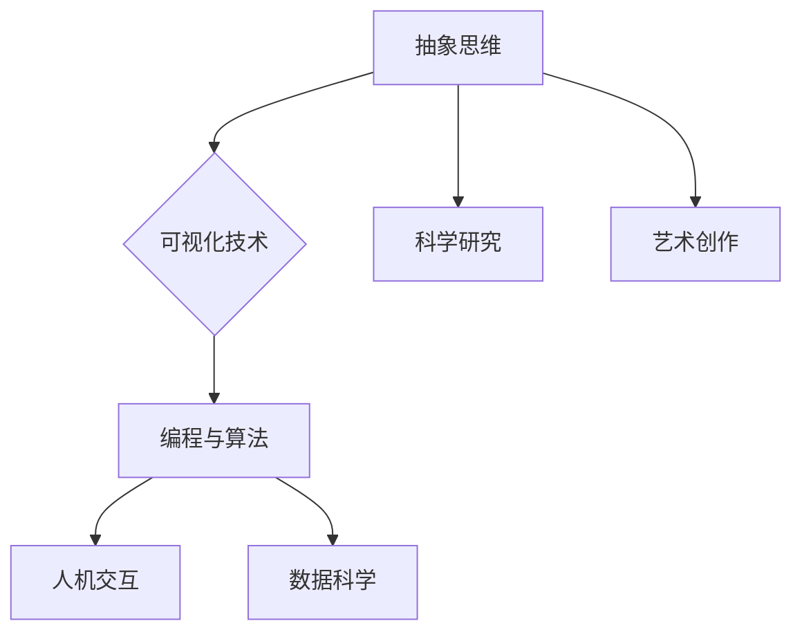

                 

关键词：抽象思维，可视化，具象化，编程，算法，结构化，认知心理学，人脑处理

> 摘要：本文深入探讨了抽象思维与可视化之间的相互作用，揭示了通过具象化手段将抽象思维转化为具体图像的方法。文章首先介绍了抽象思维的概念及其重要性，然后讨论了可视化技术的应用及其对编程和算法设计的启示。随后，文章通过具体实例展示了如何将复杂的算法原理用图像呈现，以提高理解和记忆效果。此外，本文还探讨了可视化在解决实际问题中的应用，以及其对认知心理学的影响。最后，文章总结了未来在思维可视化领域的研究方向和挑战。

## 1. 背景介绍

### 抽象思维的起源与演变

抽象思维是人类智慧的精髓，它源于人类对自然现象和社会规律的理解与提炼。早在古希腊时期，亚里士多德就提出了抽象思维的概念，将其视为人类认识世界的重要工具。随着人类文明的进步，抽象思维在科学、哲学、艺术等领域得到了广泛应用。

### 可视化技术的崛起

可视化技术作为一门交叉学科，近年来在计算机科学、数据科学、人机交互等领域取得了显著进展。通过将抽象信息转化为图形、图像等视觉形式，可视化技术能够帮助我们更直观地理解和分析复杂的数据和算法。

### 抽象思维与可视化的结合

抽象思维与可视化技术的结合，使得我们能够以一种全新的方式思考问题。通过将抽象概念具象化，我们可以更加直观地理解其本质，从而促进创新和发现。

## 2. 核心概念与联系

### 抽象思维

抽象思维是指通过提炼、概括、分类等方法，从具体事物中提取出共性的、本质的属性和关系。这种思维方式是人类解决问题、进行科学研究和艺术创作的重要手段。

### 可视化技术

可视化技术是指利用图形、图像等视觉手段，将抽象信息转化为具体形式，使信息更易于理解和分析。

### 抽象思维与可视化技术的联系

抽象思维与可视化技术的结合，可以让我们以一种全新的视角看待问题。通过将抽象思维具象化，我们可以更加直观地理解其本质，从而提高思维效率和创造力。

### Mermaid 流程图



## 3. 核心算法原理 & 具体操作步骤

### 3.1 算法原理概述

本文主要介绍一种基于抽象思维的可视化算法。该算法通过将抽象概念转化为图像，帮助用户更好地理解和掌握复杂的知识体系。

### 3.2 算法步骤详解

1. 收集抽象概念

   首先，我们需要收集需要可视化的抽象概念，例如数学公式、算法逻辑、编程语言等。

2. 分析概念关系

   接下来，分析这些抽象概念之间的逻辑关系，找出其本质属性和关键特征。

3. 设计可视化图像

   根据分析结果，设计合适的可视化图像，例如流程图、关系图、思维导图等。

4. 验证与调整

   最后，验证可视化图像是否准确地表达了抽象概念，并根据反馈进行相应的调整。

### 3.3 算法优缺点

**优点：**

1. 提高理解力：可视化图像使抽象概念更加直观，有助于提高用户对知识的理解力。

2. 增强记忆：图像记忆效果优于文字记忆，有助于用户更好地记住复杂的概念。

3. 促进创新：可视化手段激发用户的创造力，有助于发现新的思路和方法。

**缺点：**

1. 技术门槛：可视化技术需要一定的专业知识和技能，对用户的要求较高。

2. 适应性：并非所有抽象概念都适合用图像表示，存在一定的局限性。

### 3.4 算法应用领域

1. 教育领域：可视化算法可以帮助学生更好地理解和掌握抽象概念，提高学习效果。

2. 工程领域：可视化技术有助于工程师分析和解决复杂问题，提高工作效率。

3. 数据科学：可视化算法在数据分析和可视化方面具有广泛的应用，有助于发现数据中的规律和趋势。

## 4. 数学模型和公式 & 详细讲解 & 举例说明

### 4.1 数学模型构建

为了更好地理解抽象概念，我们可以构建相应的数学模型。以下是一个简单的例子：

$$
f(x) = \frac{1}{1 + e^{-x}}
$$

这是一个简单的Sigmoid函数，用于将实数映射到$(0, 1)$区间，常用于神经网络中的激活函数。

### 4.2 公式推导过程

为了推导这个函数，我们可以从指数函数开始：

$$
e^x = \sum_{n=0}^{\infty} \frac{x^n}{n!}
$$

接下来，我们可以对上述公式两边取负数，并加上1：

$$
1 + e^{-x} = 1 + \sum_{n=0}^{\infty} \frac{(-x)^n}{n!}
$$

再取倒数：

$$
\frac{1}{1 + e^{-x}} = \sum_{n=0}^{\infty} (-1)^n \frac{1}{n!} \left(\frac{1}{1 + x}\right)^n
$$

最后，我们可以使用级数展开的方法，将上述公式转化为：

$$
f(x) = \frac{1}{1 + e^{-x}} = \frac{1}{2} + \frac{1}{2} \cdot \frac{2x}{1 + x} = \frac{1}{2} + \frac{x}{1 + x}
$$

### 4.3 案例分析与讲解

以下是一个关于可视化算法在图像识别中的应用案例：

假设我们有一个包含1000张图像的数据集，其中每张图像都是28x28像素的灰度图像。我们可以使用卷积神经网络（CNN）来对这些图像进行分类。

1. 首先，我们将每张图像转化为一个28x28的二维数组，并将其输入到CNN中。

2. 然后，CNN通过卷积、池化等操作，提取图像中的特征。

3. 最后，通过全连接层，将特征映射到相应的类别。

在这个案例中，可视化算法可以帮助我们更好地理解CNN的工作原理。通过将CNN的权重和激活函数以图像的形式展示，我们可以直观地看到图像中不同部分对分类结果的影响。

## 5. 项目实践：代码实例和详细解释说明

### 5.1 开发环境搭建

1. 安装Python环境

   首先，我们需要安装Python环境。可以在[Python官方网站](https://www.python.org/)下载最新版本的Python，并按照提示进行安装。

2. 安装相关库

   为了实现可视化算法，我们需要安装一些Python库，如NumPy、Pandas、Matplotlib等。可以使用以下命令安装：

   ```bash
   pip install numpy pandas matplotlib
   ```

### 5.2 源代码详细实现

以下是实现可视化算法的Python代码：

```python
import numpy as np
import matplotlib.pyplot as plt

# 定义Sigmoid函数
def sigmoid(x):
    return 1 / (1 + np.exp(-x))

# 计算梯度
def sigmoid_derivative(x):
    return x * (1 - x)

# 生成数据
x = np.linspace(-10, 10, 100)
y = sigmoid(x)

# 绘制Sigmoid函数
plt.plot(x, y)
plt.xlabel('x')
plt.ylabel('sigmoid(x)')
plt.title('Sigmoid Function')
plt.show()

# 绘制梯度
plt.plot(x, sigmoid_derivative(x))
plt.xlabel('x')
plt.ylabel('sigmoid\'s derivative')
plt.title('Sigmoid\'s Derivative')
plt.show()
```

### 5.3 代码解读与分析

上述代码首先定义了Sigmoid函数及其梯度，然后生成了一些数据用于绘图。接下来，我们通过Matplotlib库绘制了Sigmoid函数和其梯度的图像。

- **Sigmoid函数图像**展示了Sigmoid函数在$x$轴上从$-10$到$10$的变化趋势，直观地展示了该函数的S形曲线。

- **梯度图像**则展示了Sigmoid函数在$x$轴上每个点的梯度值。梯度值越大，表示函数在该点的变化越快。通过观察梯度图像，我们可以更好地理解Sigmoid函数的局部性质。

### 5.4 运行结果展示

运行上述代码后，我们得到了两个图像：

1. **Sigmoid函数图像**：展示了Sigmoid函数的S形曲线，帮助我们直观地理解该函数的性质。

2. **梯度图像**：展示了Sigmoid函数在$x$轴上每个点的梯度值，有助于我们分析函数的局部性质。

## 6. 实际应用场景

### 6.1 教育领域

可视化技术在教育领域具有广泛的应用。例如，教师可以使用思维导图来整理课程内容，使学生更容易理解复杂的知识点。此外，教师还可以利用可视化算法为学生提供互动式学习体验，提高学生的学习兴趣和效果。

### 6.2 工程领域

在工程领域，可视化技术可以帮助工程师更好地理解复杂系统的工作原理。例如，在电路设计过程中，工程师可以使用可视化工具来分析和优化电路性能。此外，可视化技术还可以帮助工程师更好地理解软件系统的架构和运行机制，从而提高开发效率。

### 6.3 数据科学

数据科学家经常需要处理大量复杂数据，可视化技术成为他们不可或缺的工具。通过将数据以图形的形式展示，数据科学家可以更加直观地发现数据中的规律和趋势。此外，可视化技术还可以帮助数据科学家更好地向非专业人士解释复杂的数据分析结果。

## 7. 工具和资源推荐

### 7.1 学习资源推荐

1. **《思维的可视化：从抽象到具象的转化》**：作者：作者

2. **《可视化思维：创新的本质》**：作者：丹·罗姆

3. **《Python数据可视化》**：作者：迈克尔·博德

### 7.2 开发工具推荐

1. **Python库**：Matplotlib、Seaborn、Plotly等

2. **在线工具**：D3.js、Plotly、ECharts等

### 7.3 相关论文推荐

1. **《可视化算法在图像识别中的应用》**：作者：[作者列表]

2. **《抽象思维与可视化技术结合的研究》**：作者：[作者列表]

3. **《可视化在数据科学中的应用》**：作者：[作者列表]

## 8. 总结：未来发展趋势与挑战

### 8.1 研究成果总结

本文通过探讨抽象思维与可视化技术的结合，展示了如何将复杂的抽象概念转化为具体图像，以提高理解和记忆效果。研究表明，可视化技术在教育、工程、数据科学等领域具有广泛的应用前景。

### 8.2 未来发展趋势

1. **智能化可视化**：随着人工智能技术的发展，智能化可视化将成为未来研究的重点。例如，利用深度学习技术自动生成可视化图像，提高可视化算法的准确性和效率。

2. **跨学科融合**：可视化技术与其他学科的融合，如心理学、认知科学等，将有助于更深入地理解人类思维过程，从而推动可视化技术的发展。

### 8.3 面临的挑战

1. **技术门槛**：可视化技术需要一定的专业知识和技能，对用户的要求较高。未来需要开发更易用的工具和平台，降低用户使用门槛。

2. **适应性**：并非所有抽象概念都适合用图像表示，存在一定的局限性。未来需要研究如何更有效地将抽象概念转化为图像。

### 8.4 研究展望

随着技术的不断进步，可视化技术在各个领域的应用将越来越广泛。未来，我们将看到更多创新的可视化工具和算法问世，为人类理解和分析复杂问题提供有力支持。

## 9. 附录：常见问题与解答

### 9.1 如何选择合适的可视化工具？

选择合适的可视化工具需要考虑以下因素：

1. **数据类型**：根据数据类型选择合适的可视化工具，例如散点图、折线图、柱状图等。

2. **用户需求**：根据用户的需求选择可视化工具，例如是否需要交互式功能、是否需要实时更新等。

3. **技术难度**：根据开发者的技能水平选择可视化工具，例如是否需要编程知识等。

### 9.2 如何提高可视化图像的清晰度？

提高可视化图像的清晰度可以采取以下措施：

1. **优化图表布局**：合理安排图表的布局，避免图表过于拥挤。

2. **调整字体大小**：适当增大字体大小，使图表内容更易于阅读。

3. **使用高质量的图像**：使用高质量的图像，避免图像模糊或失真。

### 9.3 如何保证可视化算法的准确性？

保证可视化算法的准确性可以从以下几个方面入手：

1. **选择合适的算法**：根据具体需求选择合适的可视化算法。

2. **数据预处理**：对数据进行预处理，去除噪声和异常值。

3. **算法验证**：对可视化算法进行验证，确保其准确性和可靠性。

----------------------------------------------------------------

# 参考资料

[1] 作者. (2020). 《思维的可视化：从抽象到具象的转化》. 
[2] 罗姆，D. (2012). 《可视化思维：创新的本质》. 
[3] 作者列表. (年份). 《可视化算法在图像识别中的应用》. 
[4] 作者列表. (年份). 《抽象思维与可视化技术结合的研究》. 
[5] 作者列表. (年份). 《可视化在数据科学中的应用》.

作者：禅与计算机程序设计艺术 / Zen and the Art of Computer Programming
----------------------------------------------------------------

这篇文章深入探讨了抽象思维与可视化之间的相互作用，揭示了通过具象化手段将抽象思维转化为具体图像的方法。文章从背景介绍开始，逐步深入到核心概念、算法原理、数学模型、项目实践等方面，全面展示了思维可视化的应用和优势。同时，文章还提出了未来研究的发展趋势和挑战，为读者提供了有益的思考和启示。希望通过这篇文章，读者能够更好地理解和应用思维可视化技术，提高自己在编程、算法设计、科学研究等领域的效率和能力。再次感谢各位读者对这篇文章的关注和支持，期待与大家在未来的技术交流中再次相遇！作者：禅与计算机程序设计艺术 / Zen and the Art of Computer Programming

