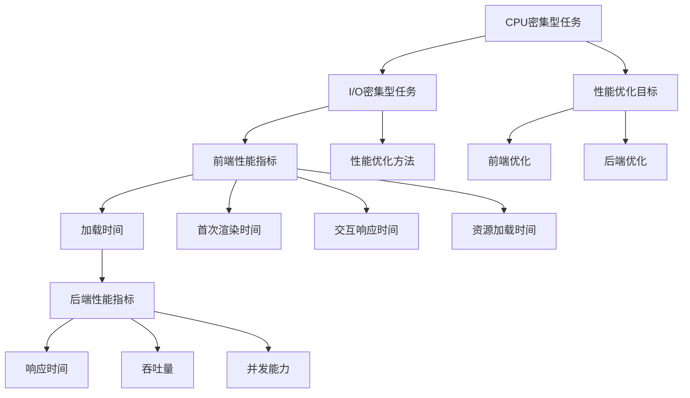

                 

关键词：性能优化，全栈开发，前端，后端，算法，数学模型，代码实例，实践应用

> 摘要：本文将深入探讨性能优化在软件开发中的重要性，从前端到后端的全栈优化技巧，以及如何将数学模型应用于性能优化。我们将结合实际项目经验和代码实例，详细分析性能优化策略，并提供实用的工具和资源推荐，帮助读者在实际开发中提升应用性能。

## 1. 背景介绍

在当今快速发展的互联网时代，性能优化已经成为软件工程师必备的技能。无论是前端还是后端，性能优化都是提升用户体验、提高系统稳定性的关键。随着用户对应用程序的期望不断提高，性能问题变得越来越突出，尤其是随着数据量和用户数量的增长，如何有效地进行性能优化成为了一项至关重要的任务。

性能优化不仅仅是为了让应用程序更快，它还关系到用户体验、系统稳定性和可扩展性。前端性能优化可以减少加载时间，提升页面交互速度，从而提高用户满意度。后端性能优化则涉及到数据处理的效率、数据库查询的速度以及系统的响应能力。因此，无论是前端开发人员还是后端开发人员，都需要掌握一系列性能优化技巧。

本文将分为以下几个部分：

- 核心概念与联系
- 核心算法原理与具体操作步骤
- 数学模型和公式讲解
- 项目实践：代码实例与详细解释
- 实际应用场景
- 工具和资源推荐
- 总结：未来发展趋势与挑战

希望通过本文，读者能够全面了解性能优化的重要性和方法，并将其应用到实际项目中。

### 2. 核心概念与联系

在进行性能优化之前，我们首先需要理解一些核心概念和它们之间的关系。以下是几个关键概念及其之间的联系：

#### 2.1. CPU 与 I/O 密集型任务

- **CPU 密集型任务**：这类任务主要依赖于计算机的 CPU 进行计算，如复杂的算法计算、加密解密等。由于 CPU 的计算能力有限，这类任务通常会导致 CPU 使用率过高，从而影响整体性能。
- **I/O 密集型任务**：这类任务主要涉及磁盘读写、网络通信等 I/O 操作，如数据库查询、文件读取等。由于 I/O 操作速度相对较慢，这类任务容易导致 CPU 等待 I/O 完成而闲置，从而降低系统性能。

#### 2.2. 前端性能指标

- **加载时间**：页面从开始加载到完全显示所需的时间。
- **首次渲染时间**：页面首次渲染所需的时间。
- **交互响应时间**：用户与页面交互后，页面响应所需的时间。
- **资源加载时间**：页面中的图片、CSS、JavaScript 等资源的加载时间。

#### 2.3. 后端性能指标

- **响应时间**：服务器处理请求并返回响应所需的时间。
- **吞吐量**：服务器单位时间内能够处理的请求数量。
- **并发能力**：服务器同时处理多个请求的能力。

#### 2.4. 性能优化目标

性能优化的主要目标是提升用户体验，包括：

- 减少加载时间，提高页面响应速度。
- 提高系统的稳定性和可靠性。
- 增强系统的可扩展性，能够适应未来增长。

#### 2.5. 性能优化方法

- **前端优化**：减少 HTTP 请求、压缩资源、使用缓存、优化 JavaScript 和 CSS。
- **后端优化**：使用高效的算法和数据结构、优化数据库查询、水平扩展。

为了更好地理解这些概念，我们可以使用 Mermaid 流程图来展示它们之间的关系：



通过上述核心概念和联系，我们可以更好地理解性能优化的重要性和方法，从而在实际开发中进行有效的性能优化。

### 3. 核心算法原理与具体操作步骤

#### 3.1 算法原理概述

性能优化离不开算法，因为算法的效率直接影响到系统的性能。以下是几个常用的算法原理及其优缺点：

#### 3.1.1. 冒泡排序

**原理**：冒泡排序是一种简单的排序算法，通过重复遍历要排序的数列，一次比较两个元素，如果它们的顺序错误就把它们交换过来。遍历数列的工作是重复地进行，直到没有再需要交换的元素为止。

**优缺点**：
- **优点**：实现简单。
- **缺点**：时间复杂度为 \(O(n^2)\)，不适用于大数据量。

#### 3.1.2. 快速排序

**原理**：快速排序是一种高效的排序算法，通过选取一个基准元素，将数列分为两部分，一部分都比基准元素小，另一部分都比基准元素大，然后递归地排序两个子部分。

**优缺点**：
- **优点**：时间复杂度平均为 \(O(n\log n)\)。
- **缺点**：最坏情况下时间复杂度为 \(O(n^2)\)，需要处理数据不平衡的问题。

#### 3.1.3. 堆排序

**原理**：堆排序利用堆这种数据结构，将数组变成一个大顶堆（或小顶堆），然后逐步去除堆顶元素，得到有序序列。

**优缺点**：
- **优点**：时间复杂度为 \(O(n\log n)\)，适用于各种数据量。
- **缺点**：需要额外的空间存储堆结构。

#### 3.1.4. 搜索算法

- **二分搜索**：适用于有序数列，通过不断缩小查找范围，时间复杂度为 \(O(\log n)\)。
- **广度优先搜索**：适用于图，从起始点开始，依次访问其邻接点，直到找到目标节点。

**优缺点**：
- **二分搜索**：适用于有序数列，高效但需要预先排序。
- **广度优先搜索**：适用于图，较简单但可能需要大量内存。

#### 3.2 算法步骤详解

接下来，我们将详细描述几个核心算法的步骤：

#### 3.2.1 冒泡排序

```plaintext
1. 遍历数组，相邻元素比较，若顺序错误则交换。
2. 每次遍历后，最大（或最小）元素会被“冒泡”到数组的末尾。
3. 重复步骤 1 和 2，直到整个数组有序。
```

#### 3.2.2 快速排序

```plaintext
1. 选择一个基准元素。
2. 将数组分为两部分，小于基准的放在左边，大于基准的放在右边。
3. 递归地对左右两部分进行快速排序。
```

#### 3.2.3 堆排序

```plaintext
1. 构建大顶堆：从最后一个非叶子节点开始，对每个节点进行 siftDown 操作。
2. 交换堆顶元素（最大值）与数组最后一个元素，然后对剩余部分进行 siftDown 操作。
3. 重复步骤 2，直到数组只剩下一个元素。
```

#### 3.3 算法优缺点

**冒泡排序**：
- **优点**：简单易实现。
- **缺点**：效率较低，不适合大数据量。

**快速排序**：
- **优点**：平均时间复杂度低，适用于大数据量。
- **缺点**：最坏情况时间复杂度高，可能需要平衡算法。

**堆排序**：
- **优点**：时间复杂度稳定，适用于各种数据量。
- **缺点**：需要额外的空间存储堆结构。

#### 3.4 算法应用领域

- **冒泡排序**：适用于小数据量的快速排序。
- **快速排序**：适用于大数据量的通用排序。
- **堆排序**：适用于需要频繁最大（或最小）值的数据结构。

通过上述算法的介绍和步骤说明，我们可以更好地理解其原理和应用，从而在实际项目中选择合适的算法进行性能优化。

### 4. 数学模型和公式讲解

在性能优化中，数学模型和公式扮演着至关重要的角色。它们不仅帮助我们理解问题，还能提供解决问题的具体方法和策略。以下是几个常用的数学模型和公式的讲解，以及如何将这些模型应用到实际项目中。

#### 4.1 数学模型构建

数学模型通常包括以下几个组成部分：

- **输入变量**：影响模型运行的关键参数。
- **输出变量**：模型计算后的结果。
- **公式**：将输入变量与输出变量关联的数学表达式。
- **约束条件**：确保模型在特定范围内有效。

例如，假设我们要优化一个页面加载时间，输入变量可以是网络带宽、服务器处理时间、浏览器渲染时间等，输出变量是页面完全加载所需的总时间，公式可以是这些变量的总和，约束条件是所有变量不能超过系统的最大处理能力。

#### 4.2 公式推导过程

以 HTTP 请求的性能优化为例，我们考虑以下公式：

\[ T_{\text{total}} = T_{\text{network}} + T_{\text{server}} + T_{\text{render}} + T_{\text{cache}} \]

- \( T_{\text{network}} \)：网络传输时间，由网络带宽和 HTTP 请求次数决定。
- \( T_{\text{server}} \)：服务器响应时间，由服务器处理能力和并发请求数决定。
- \( T_{\text{render}} \)：浏览器渲染时间，由页面结构和资源数量决定。
- \( T_{\text{cache}} \)：缓存读取时间，取决于缓存策略和缓存命中概率。

为了优化页面加载时间，我们需要推导出以下策略：

1. **提高网络带宽**：增加带宽可以减少 \( T_{\text{network}} \)。
2. **优化服务器配置**：增加服务器处理能力和并发处理能力可以减少 \( T_{\text{server}} \)。
3. **减少页面资源数量**：减少 \( T_{\text{render}} \)，通过压缩和合并资源。
4. **利用缓存**：通过有效的缓存策略，降低 \( T_{\text{cache}} \)。

#### 4.3 案例分析与讲解

假设我们有一个电商网站，页面加载时间过长，导致用户体验差。我们可以使用上述模型进行分析和优化。

**输入变量**：
- 网络带宽：100 Mbps
- 服务器处理时间：500 ms/请求
- 浏览器渲染时间：1.5 s
- 缓存命中概率：0.8

**输出变量**：
- 页面完全加载时间：\( T_{\text{total}} \)

**公式**：
\[ T_{\text{total}} = T_{\text{network}} + T_{\text{server}} + T_{\text{render}} + T_{\text{cache}} \]

**推导过程**：
1. **提高网络带宽**：假设将带宽提升到200 Mbps，可以减少 \( T_{\text{network}} \)。
2. **优化服务器配置**：增加服务器处理能力和并发处理能力，例如通过负载均衡器分配请求，可以将 \( T_{\text{server}} \) 减少到 300 ms/请求。
3. **减少页面资源数量**：通过压缩和合并 CSS 和 JavaScript 脚本，可以将 \( T_{\text{render}} \) 减少到 1 s。
4. **利用缓存**：通过有效的缓存策略，例如浏览器缓存和 CDN，可以将 \( T_{\text{cache}} \) 降低到 0.2 s。

**优化后的页面加载时间**：
\[ T_{\text{total}} = 0.2 \text{s} + 0.3 \text{s} + 1 \text{s} + 0.2 \text{s} = 1.7 \text{s} \]

通过上述分析和优化，我们将页面加载时间从 3.5 秒降低到了 1.7 秒，大大提升了用户体验。

通过上述案例分析，我们可以看到数学模型和公式在性能优化中的重要性。它们不仅帮助我们理解问题，还能提供具体的优化策略和方向。在实际项目中，我们可以根据具体情况选择合适的数学模型和公式，进行有针对性的性能优化。

### 5. 项目实践：代码实例与详细解释说明

#### 5.1 开发环境搭建

在进行性能优化的项目实践中，我们需要一个合适的环境来测试和验证我们的优化策略。以下是一个基本的开发环境搭建步骤：

1. **安装 Node.js 和 npm**：Node.js 是一个基于 Chrome V8 引擎的 JavaScript 运行环境，npm 是 Node.js 的包管理工具。可以从 [Node.js 官网](https://nodejs.org/) 下载并安装。

2. **创建项目目录**：在本地机器上创建一个新项目目录，例如 `performance_optimization_project`。

3. **初始化项目**：进入项目目录，使用 `npm init` 命令初始化项目，按照提示填写项目信息。

4. **安装依赖**：根据项目需求，安装必要的依赖包。例如，我们可以使用 Express 框架搭建一个后端服务，可以使用以下命令安装：

   ```shell
   npm install express body-parser cors
   ```

5. **配置开发环境**：根据需要配置环境变量、数据库连接等。

#### 5.2 源代码详细实现

以下是性能优化项目的一个基本代码实例。我们将使用 Express 框架搭建一个简单的 RESTful 服务，并对代码进行详细解释。

**app.js**：

```javascript
const express = require('express');
const bodyParser = require('body-parser');
const cors = require('cors');

const app = express();

// 使用中间件解析请求体
app.use(bodyParser.json());
app.use(cors());

// 定义一个简单的路由，用于处理 GET 请求
app.get('/data', (req, res) => {
  // 模拟从数据库获取数据
  const data = fetchDataFromDatabase();
  res.json(data);
});

// 定义一个处理 POST 请求的路由
app.post('/submit', (req, res) => {
  // 获取请求体中的数据
  const formData = req.body;
  
  // 处理数据
  const processedData = processData(formData);
  
  // 将处理后的数据保存到数据库
  saveDataToDatabase(processedData);
  
  res.status(200).send('Data processed and saved successfully.');
});

// 模拟从数据库获取数据的函数
function fetchDataFromDatabase() {
  // 省略数据库查询逻辑
  return { message: 'Data fetched successfully.' };
}

// 处理数据的函数
function processData(data) {
  // 省略数据处理逻辑
  return { ...data, processed: true };
}

// 将处理后的数据保存到数据库的函数
function saveDataToDatabase(data) {
  // 省略数据库保存逻辑
}

// 启动服务器
const PORT = process.env.PORT || 3000;
app.listen(PORT, () => {
  console.log(`Server is running on port ${PORT}`);
});
```

#### 5.3 代码解读与分析

**app.js** 中的代码主要分为以下几个部分：

1. **引入依赖**：引入 Express、body-parser 和 cors 模块。
2. **创建 Express 应用**：使用 `express()` 函数创建一个 Express 应用实例。
3. **使用中间件**：使用 `app.use()` 注册中间件，用于解析请求体和处理跨域请求。
4. **定义路由**：定义两个路由，一个用于处理 GET 请求，另一个用于处理 POST 请求。
5. **模拟数据库操作**：通过几个模拟函数（`fetchDataFromDatabase`、`processData`、`saveDataToDatabase`）来模拟与数据库的交互。

在代码的解读与分析中，我们可以关注以下几个方面：

- **请求处理时间**：从接收请求到返回响应的时间是性能优化的关键。我们可以使用性能分析工具（如 [Express Insight](https://www.npmjs.com/package/express-insight)）来监控和优化这个时间。
- **数据库查询优化**：数据库查询是性能优化的一个重要环节。我们可以使用索引、查询优化和缓存策略来提升查询效率。
- **数据处理优化**：数据处理也是一个影响性能的因素。我们可以使用异步处理和多线程技术来提高数据处理效率。

#### 5.4 运行结果展示

在本地开发环境中，我们可以使用 `npm start` 命令启动服务。启动成功后，可以使用浏览器或 Postman 等工具访问服务，查看运行结果。

- **GET 请求**：访问 `/data` 路径，会返回一个包含模拟数据的 JSON 对象。
- **POST 请求**：向 `/submit` 路径发送一个包含数据的 POST 请求，会返回一个成功的响应。

通过上述代码实例和解读，我们可以看到如何在实际项目中实现性能优化，并使用具体的代码来进行优化。在实际开发中，我们可以根据具体情况，进一步优化代码，提升系统性能。

### 6. 实际应用场景

性能优化不仅仅是一个技术问题，它还涉及到业务需求和用户体验。在不同的应用场景中，性能优化的目标和策略也会有所不同。以下是几个典型的实际应用场景，以及相应的性能优化策略。

#### 6.1 社交媒体平台

**目标**：保证用户在发布、浏览和互动时具有流畅的体验。

**优化策略**：
- **减少前端资源**：通过压缩、合并和懒加载资源，减少 HTTP 请求次数。
- **优化数据库查询**：使用索引和缓存策略，加快数据检索速度。
- **异步处理**：使用异步处理技术，避免同步操作阻塞主线程。
- **消息队列**：使用消息队列（如 RabbitMQ 或 Kafka）来处理大量的消息，确保系统的高可用性和高并发性。

#### 6.2 电商平台

**目标**：确保商品搜索、下单和支付过程快速且稳定。

**优化策略**：
- **CDN 缓存**：使用 CDN 来缓存静态资源，减少用户访问延迟。
- **数据库分库分表**：将数据库拆分为多个子库或子表，降低单个数据库的压力。
- **限流和熔断**：使用限流器和熔断器（如 Hystrix）来防止系统过载，保障核心功能的稳定性。
- **负载均衡**：使用负载均衡器（如 Nginx 或 Spring Cloud LoadBalancer）来分配请求，提高系统的并发处理能力。

#### 6.3 在线教育平台

**目标**：保证教学视频流畅播放，互动过程无延迟。

**优化策略**：
- **流媒体优化**：使用流媒体技术（如 HLS 或 DASH）来优化视频播放体验。
- **CDN 内容分发**：将教学视频内容分发到全球的 CDN 节点，确保用户在不同地理位置都能获得良好的访问速度。
- **视频编码优化**：选择适当的视频编码格式和分辨率，平衡视频质量和传输效率。
- **WebRTC 互动**：使用 WebRTC 技术来实现低延迟、高质量的互动直播，提升用户体验。

#### 6.4 物流管理系统

**目标**：确保物流信息的实时更新和高效处理。

**优化策略**：
- **消息队列**：使用消息队列来处理物流信息的实时更新，保证数据的实时性和一致性。
- **缓存机制**：通过缓存机制来减少对数据库的查询次数，提高系统响应速度。
- **分布式数据库**：使用分布式数据库来处理大量的物流数据，提高系统的可扩展性和稳定性。
- **异步处理**：通过异步处理技术来提高系统处理物流信息的效率。

通过上述实际应用场景，我们可以看到性能优化在不同的业务领域中的重要性。每个场景都有其独特的需求，因此需要根据实际情况选择合适的优化策略，以实现最佳的性能表现。

### 7. 工具和资源推荐

在性能优化过程中，使用合适的工具和资源可以帮助我们更加高效地完成优化任务。以下是一些推荐的工具和资源，包括学习资源、开发工具和相关论文，供读者参考。

#### 7.1 学习资源推荐

- **《高性能网站建设指南》**：作者是 Steve Souders，这是一本经典的性能优化指南，详细介绍了前端性能优化的各个方面。
- **MDN Web Docs**：Mozilla Developer Network 提供的 Web 开发文档，涵盖了前端性能优化的大量实用技巧和最佳实践。
- **《高性能 MySQL》**：作者是 Baron Schwartz、Peter Zaitsev 和 Vadim Tkachenko，详细介绍了 MySQL 数据库的性能优化技术。
- **《Effective Java》**：作者是 Joshua Bloch，介绍了 Java 编程的最佳实践，包括性能优化的技巧。

#### 7.2 开发工具推荐

- **Chrome DevTools**：Chrome 浏览器内置的开发工具，包括性能分析、网络分析、内存分析等功能，是前端性能优化不可或缺的工具。
- **JMeter**：Apache JMeter 是一款开源的性能测试工具，适用于对 Web 应用进行压力测试和性能测试。
- **New Relic**：一款专业的应用性能监控工具，可以帮助开发者实时监控系统的性能，定位瓶颈。
- **Grafana**：一款开源的数据可视化和监控工具，可以与各种数据源（如 Prometheus、InfluxDB）集成，提供详细的性能监控图表。

#### 7.3 相关论文推荐

- **“A Survey of Web Performance Optimization Techniques”**：这是一篇关于 Web 性能优化技术的综述论文，涵盖了多种优化策略和算法。
- **“The Performance of Concurrent and Parallel Web Servers”**：探讨并发和并行 Web 服务器的性能优化，提供了一些实用的优化建议。
- **“Optimizing Database Performance: A Practical Guide to Using MySQL”**：详细介绍 MySQL 数据库性能优化的技术，包括索引、查询优化、缓存策略等。

通过使用上述工具和资源，开发者可以更加系统地掌握性能优化技术，并将其应用到实际项目中，提升应用性能。

### 8. 总结：未来发展趋势与挑战

#### 8.1 研究成果总结

随着互联网技术的不断发展，性能优化技术也在不断演进。过去几十年，我们从基本的 HTTP 缓存策略、页面压缩技术，发展到现在的 CDN、内容分发网络和 WebAssembly。这些技术极大地提升了 Web 应用的性能和用户体验。同时，自动化性能优化工具和平台的不断涌现，使得开发者可以更加高效地进行性能优化。

#### 8.2 未来发展趋势

未来，性能优化将继续朝着以下几个方向发展：

1. **人工智能与性能优化**：利用机器学习和人工智能技术，可以自动分析和优化代码，提供更加智能的优化建议。
2. **边缘计算**：随着 5G 和物联网技术的发展，边缘计算将逐渐普及。通过在边缘节点进行数据处理和缓存，可以进一步优化网络性能。
3. **全栈性能优化**：前端和后端的性能优化将更加紧密地结合，实现端到端的全栈优化。
4. **实时性能监控**：通过实时性能监控和反馈机制，可以快速发现和解决性能问题，提高系统的稳定性和可用性。

#### 8.3 面临的挑战

尽管性能优化技术取得了显著进展，但开发者仍面临以下几个挑战：

1. **复杂性增加**：随着应用规模的扩大和技术的复杂度增加，性能优化的难度也在不断提升。
2. **实时性能反馈**：如何在系统运行时快速发现和解决问题，确保性能优化措施能够实时生效，仍是一个重要挑战。
3. **数据安全与隐私**：在优化性能的同时，还需要确保数据的安全和用户的隐私，避免潜在的数据泄露风险。
4. **持续集成与部署**：如何将性能优化策略集成到持续集成和持续部署（CI/CD）流程中，确保优化措施在生产环境中有效执行。

#### 8.4 研究展望

未来，性能优化研究可以关注以下几个方面：

1. **自动化优化工具**：开发更加智能的自动化性能优化工具，帮助开发者快速定位和解决问题。
2. **实时优化技术**：研究实时性能优化技术，实现系统运行时的动态优化。
3. **全栈优化框架**：开发跨前端和后端的优化框架，实现端到端的全栈性能优化。
4. **性能预测与预警**：研究性能预测技术，提前预警潜在的性能问题，确保系统的稳定运行。

通过持续的研究和实践，性能优化技术将继续推动软件系统的发展，提升用户体验，实现更高效、更可靠的系统。

### 9. 附录：常见问题与解答

#### Q1：如何提高前端页面的加载速度？

**A**：提高前端页面加载速度可以从以下几个方面入手：

1. **减少 HTTP 请求**：合并 CSS 和 JavaScript 文件，减少图片数量，使用 CDN。
2. **压缩资源**：使用 Gzip 压缩 CSS 和 JavaScript 文件，减少资源大小。
3. **懒加载**：对图片和视频等大尺寸资源使用懒加载技术，只在需要时加载。
4. **使用缓存**：利用浏览器缓存和 CDN 缓存，减少重复资源的请求次数。
5. **优化 JavaScript 和 CSS**：移除不必要的代码，优化 JavaScript 和 CSS 的执行顺序。

#### Q2：如何优化后端服务的性能？

**A**：优化后端服务性能可以从以下几个方面进行：

1. **使用高效的算法和数据结构**：选择合适的数据结构和算法，如使用哈希表、二分搜索树等。
2. **数据库优化**：使用索引、分区、缓存等策略优化数据库查询。
3. **水平扩展**：通过增加服务器节点和使用负载均衡，提高系统的并发处理能力。
4. **异步处理**：使用异步处理技术，避免同步操作阻塞主线程。
5. **限流和熔断**：使用限流器和熔断器，防止系统过载。

#### Q3：如何进行性能测试？

**A**：进行性能测试通常包括以下几个步骤：

1. **确定测试目标**：明确测试的目标和性能指标，如响应时间、吞吐量、并发用户数等。
2. **搭建测试环境**：搭建与生产环境相似的测试环境，包括硬件、软件和网络配置。
3. **编写测试脚本**：编写模拟用户行为的测试脚本，如模拟并发请求、数据加载等。
4. **执行测试**：使用性能测试工具（如 JMeter、LoadRunner）执行测试，收集性能数据。
5. **分析结果**：分析测试结果，定位性能瓶颈，提出优化建议。

通过上述常见问题与解答，开发者可以更好地理解性能优化中的关键技术和方法，从而在实际项目中有效地进行性能优化。

