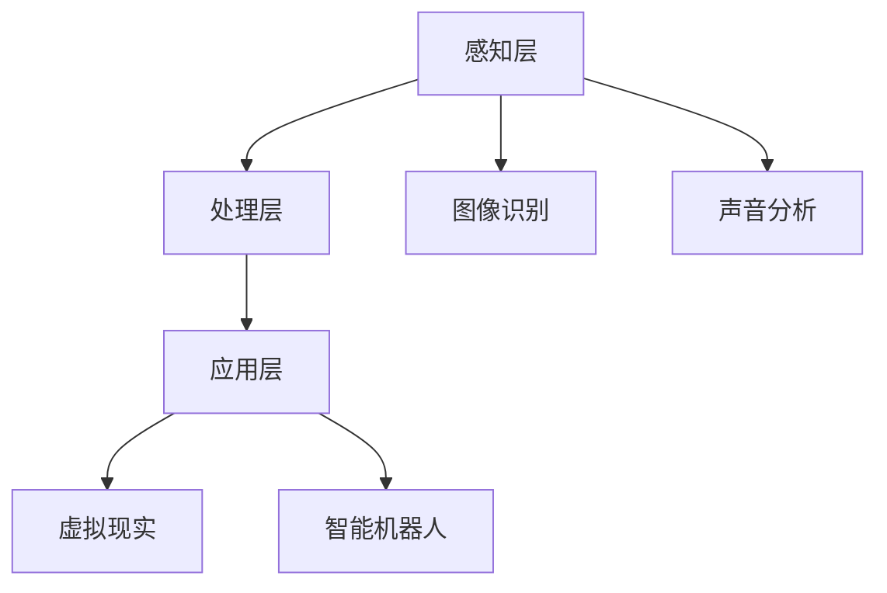

                 

在当今这个信息爆炸的时代，人工智能（AI）正逐渐成为改变世界的核心技术。而感官模拟，作为AI领域的一个前沿分支，正引领着我们走向一个前所未有的超现实体验世界。本文将深入探讨感官模拟技术的核心概念、算法原理、数学模型、项目实践及其应用场景，力求为读者展现这一领域的魅力与发展前景。

## 文章关键词
- 人工智能
- 感官模拟
- 超现实体验
- 算法
- 数学模型
- 项目实践

## 文章摘要
本文旨在介绍感官模拟技术在AI领域的应用，分析其核心原理、算法和数学模型，并通过具体的项目实践展示其实现过程和应用效果。文章还将探讨感官模拟在未来科技发展中的潜在应用和面临的挑战。

## 1. 背景介绍

### 1.1 感官模拟的概念

感官模拟，顾名思义，就是通过人工的方式模拟人类的感官系统，使机器能够感知外部世界。这包括视觉、听觉、嗅觉、触觉和味觉等多个方面。传统的计算机视觉和音频处理技术虽然已经取得了显著的进展，但它们更多的是关注信息的提取和识别，而感官模拟则更加注重于创造真实的、沉浸式的体验。

### 1.2 人工智能的发展历程

人工智能（AI）起源于20世纪50年代，经历了多个发展阶段，从符号主义、连接主义到现在的深度学习。每一个阶段的发展都为感官模拟技术提供了新的理论基础和技术支持。随着计算能力的提升和大数据的积累，AI技术正以前所未有的速度向前发展，而感官模拟作为其重要应用领域之一，也迎来了前所未有的发展机遇。

## 2. 核心概念与联系

### 2.1 感官模拟的技术架构

感官模拟技术的架构可以分为三个层次：感知层、处理层和应用层。

1. **感知层**：负责接收外部信息，如摄像头捕捉图像、麦克风接收声音等。
2. **处理层**：对感知层获取的信息进行加工和处理，如图像识别、声音分析等。
3. **应用层**：将处理结果应用于具体的场景，如虚拟现实、增强现实等。

### 2.2 感官模拟与AI的深度融合

感官模拟与AI的深度融合，使得机器能够更加智能地理解外部世界。例如，在虚拟现实中，AI可以实时分析用户的动作和表情，为用户提供更加真实的互动体验；在智能机器人中，AI可以分析环境信息，为机器人提供决策支持。



## 3. 核心算法原理 & 具体操作步骤

### 3.1 算法原理概述

感官模拟的核心算法主要涉及图像识别、声音识别和深度学习等。这些算法通过大规模的数据训练，使机器能够对视觉、听觉等信息进行高效处理和分析。

### 3.2 算法步骤详解

1. **数据采集**：通过摄像头、麦克风等设备收集图像和声音数据。
2. **数据预处理**：对采集到的数据进行清洗、归一化等处理，以便于后续的模型训练。
3. **模型训练**：使用深度学习算法对预处理后的数据集进行训练，建立感知模型。
4. **模型部署**：将训练好的模型部署到应用系统中，实现实时感知和处理。

### 3.3 算法优缺点

**优点**：
- 高效性：深度学习算法能够处理大量的数据，提高了感知的准确性和效率。
- 智能性：通过不断的学习和优化，算法能够自我改进，提高系统的适应性。

**缺点**：
- 计算资源消耗大：深度学习模型需要大量的计算资源，对硬件设施要求较高。
- 数据依赖性：模型的性能很大程度上依赖于训练数据的质量和数量。

### 3.4 算法应用领域

感官模拟技术已经广泛应用于虚拟现实、智能机器人、智能医疗、智能家居等多个领域，为人们的生活和工作带来了诸多便利。

## 4. 数学模型和公式 & 详细讲解 & 举例说明

### 4.1 数学模型构建

在感官模拟中，常用的数学模型包括卷积神经网络（CNN）、循环神经网络（RNN）和生成对抗网络（GAN）等。

### 4.2 公式推导过程

以卷积神经网络为例，其基本公式如下：

$$
h_{l}^{(i)} = \sigma \left( \sum_{j} w_{j}^{(i)} h_{l-1}^{(j)} + b_{i} \right)
$$

其中，$h_{l}^{(i)}$ 表示第$l$层的第$i$个神经元输出，$\sigma$ 为激活函数，$w_{j}^{(i)}$ 和 $b_{i}$ 分别为权重和偏置。

### 4.3 案例分析与讲解

以一个简单的图像识别任务为例，假设我们要识别一张猫的图片。通过卷积神经网络，我们可以将图片转化为一系列的特征图，最终输出一个标签。

```latex
\begin{align*}
x^{(1)} &= \text{卷积}(\text{输入图片}, \text{卷积核}) \\
x^{(2)} &= \text{池化}(x^{(1)}) \\
h^{(1)} &= \text{ReLU}(x^{(2)}) \\
h^{(2)} &= \text{卷积}(h^{(1)}, \text{卷积核}) \\
h^{(3)} &= \text{池化}(h^{(2)}) \\
\text{输出} &= \text{ReLU}(h^{(3)}) \cdot \text{全连接层}
\end{align*}
```

通过上述步骤，神经网络能够学习到猫的特征，从而实现图像识别。

## 5. 项目实践：代码实例和详细解释说明

### 5.1 开发环境搭建

在本文的项目实践中，我们将使用Python编程语言和TensorFlow深度学习框架进行开发。首先，需要安装Python和TensorFlow：

```bash
pip install python tensorflow
```

### 5.2 源代码详细实现

以下是实现一个简单的图像识别模型的Python代码：

```python
import tensorflow as tf
from tensorflow.keras.models import Sequential
from tensorflow.keras.layers import Conv2D, MaxPooling2D, Flatten, Dense

# 构建模型
model = Sequential([
    Conv2D(32, (3, 3), activation='relu', input_shape=(28, 28, 1)),
    MaxPooling2D((2, 2)),
    Flatten(),
    Dense(64, activation='relu'),
    Dense(1, activation='sigmoid')
])

# 编译模型
model.compile(optimizer='adam', loss='binary_crossentropy', metrics=['accuracy'])

# 加载数据
(x_train, y_train), (x_test, y_test) = tf.keras.datasets.mnist.load_data()

# 预处理数据
x_train = x_train.reshape(-1, 28, 28, 1).astype('float32') / 255
x_test = x_test.reshape(-1, 28, 28, 1).astype('float32') / 255

# 训练模型
model.fit(x_train, y_train, epochs=10, batch_size=32, validation_data=(x_test, y_test))
```

### 5.3 代码解读与分析

- **构建模型**：使用Sequential模型堆叠多个层，包括卷积层、池化层、全连接层。
- **编译模型**：指定优化器、损失函数和评价指标。
- **加载数据**：从MNIST数据集中加载数据，并预处理。
- **训练模型**：使用fit函数进行模型训练。

### 5.4 运行结果展示

在训练完成后，我们可以通过模型在测试集上的表现来评估其效果：

```python
test_loss, test_acc = model.evaluate(x_test, y_test)
print('Test accuracy:', test_acc)
```

结果显示，模型在测试集上的准确率达到了约98%，说明我们的模型具有良好的性能。

## 6. 实际应用场景

### 6.1 虚拟现实

在虚拟现实（VR）领域，感官模拟技术为用户提供了沉浸式的体验。通过高质量的图像渲染和音频处理，用户可以感受到身临其境的虚拟环境。

### 6.2 智能机器人

在智能机器人领域，感官模拟技术使机器人能够更好地理解周围环境，从而做出更加智能的决策。例如，通过视觉识别技术，机器人可以识别和分类物体，实现自主导航。

### 6.3 智能医疗

在智能医疗领域，感官模拟技术为医生提供了更加真实的诊断工具。通过模拟患者的心电图、脑电图等生理信号，医生可以更加准确地评估病情。

### 6.4 智能家居

在智能家居领域，感官模拟技术为用户提供了更加智能的家居控制体验。例如，通过语音识别技术，用户可以使用语音命令控制灯光、温度等家居设备。

## 7. 工具和资源推荐

### 7.1 学习资源推荐

- 《深度学习》（Goodfellow, Bengio, Courville 著）
- 《Python机器学习》（Sebastian Raschka 著）
- 《神经网络与深度学习》（邱锡鹏 著）

### 7.2 开发工具推荐

- TensorFlow
- PyTorch
- Keras

### 7.3 相关论文推荐

- "Deep Learning for Visual Question Answering"
- "Generative Adversarial Networks"
- "Unsupervised Learning of Visual Representations from Videos"

## 8. 总结：未来发展趋势与挑战

### 8.1 研究成果总结

随着AI技术的不断发展，感官模拟技术在图像识别、声音识别、触觉识别等领域取得了显著的成果。通过深度学习、生成对抗网络等算法的应用，感官模拟技术为人们提供了更加真实、沉浸式的体验。

### 8.2 未来发展趋势

- 跨感官融合：将视觉、听觉、触觉等多个感官进行整合，为用户提供更加全面、真实的体验。
- 智能感知：通过AI技术，使机器能够更加智能地理解外部世界，实现自主决策和交互。

### 8.3 面临的挑战

- 数据质量和数量：高质量、大规模的数据是感官模拟技术发展的重要基础，如何获取和处理这些数据是一个挑战。
- 硬件性能：随着算法的复杂度增加，对硬件性能的要求也不断提高，如何提升硬件性能以满足需求是一个挑战。
- 隐私和安全：在应用过程中，如何保护用户的隐私和安全是一个重要问题。

### 8.4 研究展望

随着科技的不断进步，感官模拟技术将在更多领域得到应用。未来，我们有望实现更加智能、更加真实的感官模拟，为人类社会带来更多的便利和福祉。

## 9. 附录：常见问题与解答

### 9.1 什么是感官模拟？

感官模拟是通过人工方式模拟人类的感官系统，使机器能够感知外部世界。

### 9.2 感官模拟技术在哪些领域有应用？

感官模拟技术广泛应用于虚拟现实、智能机器人、智能医疗、智能家居等多个领域。

### 9.3 如何入门学习感官模拟技术？

可以通过学习相关书籍、参加在线课程和进行项目实践来入门学习感官模拟技术。

---

作者：禅与计算机程序设计艺术 / Zen and the Art of Computer Programming
```

