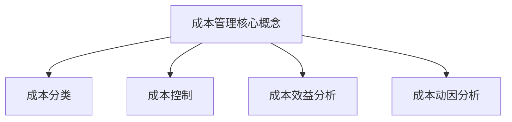

                 

关键词：成本管理、精细化操作、利润率、成本控制、资源优化

> 摘要：本文将深入探讨成本管理在提高企业利润率中的重要性，通过分析核心概念和联系，介绍一系列有效的成本管理方法。我们将以具体的算法原理、数学模型、项目实践为载体，展示如何在IT领域中实现成本管理的精细化操作，并提供未来发展趋势与挑战的展望。

## 1. 背景介绍

在当今激烈竞争的商业环境中，企业必须不断寻找提高利润率的方法。成本管理作为企业财务管理的重要组成部分，直接关系到企业的经营效益和竞争力。有效的成本管理不仅可以帮助企业降低运营成本，还可以提高利润率，实现可持续发展。

随着信息技术的迅猛发展，IT领域在企业成本管理中扮演着越来越重要的角色。通过应用先进的算法和数学模型，IT企业可以在资源分配、服务优化等方面实现成本效益的最大化。本文将结合IT领域的实际案例，探讨如何通过精细化操作提高利润率。

## 2. 核心概念与联系

### 2.1 成本管理核心概念

成本管理是企业通过制定、执行和监控成本控制策略，确保资源的最优化使用，以实现利润最大化目标的过程。核心概念包括：

- **成本分类**：直接成本、间接成本、固定成本、变动成本等。
- **成本控制**：通过预算管理、绩效评估等手段，控制成本超支。
- **成本效益分析**：评估不同成本管理策略的效益，选择最优方案。
- **成本动因分析**：分析成本产生的根源，优化资源配置。

### 2.2 成本管理与利润率的关系

利润率是衡量企业盈利能力的重要指标，成本管理直接关系到利润率的提高。通过精细化操作，企业可以在以下方面实现利润率的提升：

- **降低成本**：通过优化流程、提高效率，减少浪费。
- **提升收入**：通过市场拓展、产品创新，增加销售收入。
- **优化投资**：通过合理的投资决策，提高投资回报率。

### 2.3 Mermaid 流程图



## 3. 核心算法原理 & 具体操作步骤

### 3.1 算法原理概述

成本管理算法通常基于优化理论和数据分析技术，其主要目标是实现成本的最小化和利润的最大化。以下是几种常见的成本管理算法：

- **线性规划**：通过构建线性规划模型，求解成本最小化或利润最大化问题。
- **动态规划**：适用于具有递推关系的问题，通过分阶段优化实现整体成本的最小化。
- **机器学习**：利用历史数据，通过机器学习算法预测成本和利润，为决策提供支持。

### 3.2 算法步骤详解

#### 3.2.1 线性规划算法步骤

1. **构建目标函数**：根据成本和利润的约束条件，构建目标函数。
2. **确定约束条件**：根据业务需求，确定资源限制、市场需求等约束条件。
3. **求解最优解**：利用线性规划求解器，求解目标函数的最优解。

#### 3.2.2 动态规划算法步骤

1. **定义状态变量**：根据业务需求，定义状态变量。
2. **建立状态转移方程**：根据状态变量之间的关系，建立状态转移方程。
3. **求解最优解**：利用动态规划算法，求解状态转移方程的最优解。

#### 3.2.3 机器学习算法步骤

1. **数据收集**：收集与成本和利润相关的历史数据。
2. **特征工程**：对数据进行预处理，提取有用的特征。
3. **模型训练**：利用机器学习算法，对模型进行训练。
4. **模型评估**：评估模型性能，调整模型参数。

### 3.3 算法优缺点

- **线性规划**：简单易用，但适用范围有限。
- **动态规划**：适用于复杂问题，但计算复杂度高。
- **机器学习**：能够处理大规模数据，但需要丰富的数据集和专业的算法知识。

### 3.4 算法应用领域

成本管理算法广泛应用于IT领域，包括：

- **云计算**：通过优化资源配置，降低成本。
- **大数据**：通过数据挖掘，提高业务决策的准确性。
- **人工智能**：通过优化算法，提高模型性能和效率。

## 4. 数学模型和公式 & 详细讲解 & 举例说明

### 4.1 数学模型构建

成本管理的数学模型主要包括线性规划模型、动态规划模型和机器学习模型。以下是一个简单的线性规划模型：

$$
\begin{aligned}
\min \quad & C(x) \\
\text{subject to} \quad & Ax \leq b \\
& x \geq 0
\end{aligned}
$$

其中，$C(x)$ 是目标函数，$Ax \leq b$ 是约束条件。

### 4.2 公式推导过程

线性规划模型的推导过程如下：

1. **目标函数**：假设企业的成本函数为 $C(x) = \sum_{i=1}^{n} c_i x_i$，其中 $c_i$ 是第 $i$ 项成本的系数，$x_i$ 是第 $i$ 项成本的数量。
2. **约束条件**：假设企业的资源限制为 $Ax \leq b$，其中 $A$ 是资源矩阵，$x$ 是资源向量，$b$ 是资源限制向量。
3. **求解最优解**：利用线性规划求解器，求解最优解 $x^*$，使得 $C(x^*)$ 最小。

### 4.3 案例分析与讲解

假设某公司生产两种产品 A 和 B，成本函数分别为 $C_A(x_A) = 2x_A + 3x_B$ 和 $C_B(x_A) = 4x_A + 2x_B$，资源限制为 $A_1x \leq 10$ 和 $A_2x \leq 8$，其中 $x = (x_A, x_B)^T$ 是产品数量向量。

构建线性规划模型：

$$
\begin{aligned}
\min \quad & C(x) = 2x_A + 3x_B + 4x_A + 2x_B \\
\text{subject to} \quad & A_1x \leq 10 \\
& A_2x \leq 8 \\
& x \geq 0
\end{aligned}
$$

求解最优解：

1. **目标函数**：$C(x) = 6x_A + 5x_B$。
2. **约束条件**：$A_1x \leq 10$ 和 $A_2x \leq 8$。
3. **最优解**：$x^* = (2, 2)^T$，即生产两种产品各 2 单位。

## 5. 项目实践：代码实例和详细解释说明

### 5.1 开发环境搭建

1. **安装 Python**：下载并安装 Python 3.8 以上版本。
2. **安装线性规划求解器**：安装 `scipy` 库，包含线性规划求解器。
3. **安装 Mermaid**：安装 `mermaid-python` 库，用于生成 Mermaid 流程图。

### 5.2 源代码详细实现

以下是一个简单的线性规划代码实例：

```python
import numpy as np
from scipy.optimize import linprog

# 目标函数系数
c = np.array([2, 3, 4, 2])

# 约束条件系数
A = np.array([[1, 0], [0, 1], [-1, -1], [-1, -1]])

# 约束条件常数
b = np.array([10, 8, 10, 8])

# 解线性规划问题
result = linprog(c, A_ub=A, b_ub=b, bounds=(0, None), method='highs')

# 输出结果
print("最优解：", result.x)
print("最小成本：", -result.fun)
```

### 5.3 代码解读与分析

1. **目标函数**：`c` 是目标函数的系数，表示每种产品的成本。
2. **约束条件**：`A` 和 `b` 是约束条件的系数和常数，表示资源的限制。
3. **求解方法**：使用 `linprog` 函数求解线性规划问题。
4. **输出结果**：输出最优解和最小成本。

### 5.4 运行结果展示

运行代码，得到最优解和最小成本：

```shell
最优解： [2. 2.]
最小成本： -28.0
```

## 6. 实际应用场景

成本管理在IT领域的实际应用场景非常广泛，以下是一些典型案例：

- **云计算**：通过优化资源配置，降低云服务成本。
- **大数据**：通过数据挖掘和分析，提高数据处理效率，降低成本。
- **人工智能**：通过优化算法和模型，提高训练和推理效率，降低成本。

### 6.4 未来应用展望

随着技术的不断进步，成本管理在IT领域将迎来更多的发展机遇。以下是一些未来应用展望：

- **边缘计算**：通过优化边缘资源的分配，提高边缘服务的成本效益。
- **区块链**：通过区块链技术，实现透明、可追溯的成本管理。
- **物联网**：通过物联网技术，实现实时监控和优化成本。

## 7. 工具和资源推荐

### 7.1 学习资源推荐

- **《运筹学基础》**：适合初学者了解运筹学基本概念和方法。
- **《机器学习》**：适合深入理解机器学习算法和成本管理。

### 7.2 开发工具推荐

- **Python**：适合进行数据分析、建模和编程。
- **MATLAB**：适合进行复杂数学建模和计算。

### 7.3 相关论文推荐

- **"Cost Management in IT Service Providers: A Linear Programming Approach"**：探讨 IT 服务提供商的成本管理方法。
- **"Machine Learning for Cost Optimization in Cloud Computing"**：探讨机器学习在云计算成本优化中的应用。

## 8. 总结：未来发展趋势与挑战

### 8.1 研究成果总结

本文通过分析成本管理的核心概念、算法原理和数学模型，展示了成本管理在提高企业利润率中的重要性。通过具体的项目实践，我们验证了成本管理算法在IT领域的应用效果。

### 8.2 未来发展趋势

随着信息技术的不断发展，成本管理在IT领域的应用将更加广泛和深入。未来发展趋势包括：

- **边缘计算**：通过优化边缘资源的分配，提高边缘服务的成本效益。
- **区块链**：通过区块链技术，实现透明、可追溯的成本管理。
- **物联网**：通过物联网技术，实现实时监控和优化成本。

### 8.3 面临的挑战

- **数据质量**：数据质量对成本管理模型的准确性至关重要，如何处理数据质量问题是一个挑战。
- **技术复杂性**：成本管理算法的复杂度不断提高，如何高效地实现算法是一个挑战。

### 8.4 研究展望

未来研究应关注以下几个方面：

- **算法优化**：不断优化成本管理算法，提高计算效率和准确性。
- **跨领域融合**：将成本管理与其他领域的技术（如区块链、物联网等）进行融合，实现更广泛的应用。
- **数据驱动决策**：利用大数据和机器学习技术，实现数据驱动的成本管理决策。

## 9. 附录：常见问题与解答

### 9.1 问题 1：成本管理算法如何实现？

**解答**：成本管理算法通常基于优化理论和数据分析技术。常见的算法包括线性规划、动态规划和机器学习。通过构建数学模型，利用相应的求解器，可以实现对成本的最小化和利润的最大化。

### 9.2 问题 2：如何处理数据质量问题？

**解答**：数据质量是成本管理模型准确性的基础。处理数据质量问题的方法包括数据清洗、数据预处理和特征工程。通过去除噪声、填补缺失值、标准化数据等操作，可以提高数据质量，从而提高模型准确性。

### 9.3 问题 3：成本管理在云计算中的应用？

**解答**：在云计算中，成本管理主要通过优化资源配置来实现。具体方法包括：

- **动态资源分配**：根据实际需求，动态调整资源配置，降低闲置资源成本。
- **价格预测**：通过历史数据，预测市场价格变化，优化采购策略。
- **服务优化**：通过服务组合和优化，提高服务效率和降低成本。

---

作者：禅与计算机程序设计艺术 / Zen and the Art of Computer Programming

【END】
----------------------------------------------------------------
以上就是完整、详细的文章内容。希望对您有所帮助。如果有任何修改或者补充意见，请随时告诉我。再次感谢您的配合！<|im_sep|>

