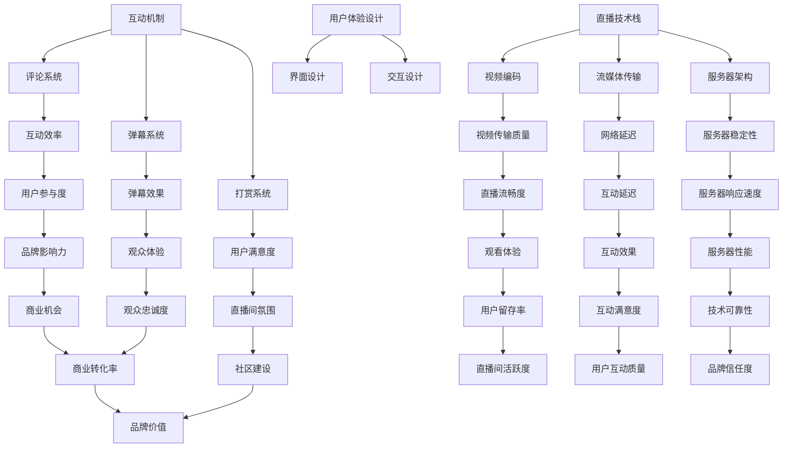

                 

在数字化时代，个人品牌建设变得尤为重要。一个成功的个人品牌不仅能提升个人影响力，还能带来丰富的商业机会。在众多个人品牌建设的工具和平台中，直播间无疑是一个高效的互动渠道。本文将探讨如何利用技术手段，打造一个具备实时互动功能的个人品牌直播间。

## 关键词

- 个人品牌
- 直播间
- 实时互动
- 技术实现
- 用户体验

## 摘要

本文旨在为个人品牌建设者提供一套实现实时互动直播间的策略。通过分析直播间的核心功能，介绍必要的技术架构，以及分享实际操作步骤和最佳实践，帮助读者构建一个高效、互动性强、用户体验优质的直播间。

### 1. 背景介绍

随着社交媒体的普及和互联网技术的进步，直播已经成为一种重要的信息传播和社交方式。在个人品牌建设过程中，直播间不仅可以帮助建立与观众的直接联系，还能通过实时互动提升用户参与度和忠诚度。一个成功的直播间，需要具备流畅的视频传输、互动性强、功能丰富等特点。

直播间的核心功能主要包括：

- **视频直播**：提供高质量的实时视频内容。
- **实时互动**：支持观众通过评论、打赏、弹幕等方式与主播互动。
- **内容回放**：直播结束后，提供视频回放功能，便于观众回顾和分享。
- **数据分析**：实时监测直播间数据，如观众数量、互动率等，以便优化内容策略。

### 2. 核心概念与联系

在构建直播间之前，我们需要理解几个核心概念：

- **直播技术栈**：包括视频编码、流媒体传输、服务器架构等。
- **互动机制**：如评论系统、弹幕系统、打赏系统等。
- **用户体验设计**：界面设计、交互设计等，以提升用户满意度。

以下是一个简单的 Mermaid 流程图，描述了直播间的核心概念及其相互关系：



### 3. 核心算法原理 & 具体操作步骤

#### 3.1 算法原理概述

直播间的核心技术包括视频编码、流媒体传输和服务器架构。其中，视频编码负责将视频数据压缩成适合网络传输的格式，流媒体传输负责将压缩后的视频数据实时传输到观众端，服务器架构则负责处理观众的请求和互动数据。

#### 3.2 算法步骤详解

1. **视频编码**：
    - **H.264/HEVC 编码**：使用高效视频编码标准压缩视频数据。
    - **FEC 前向错误纠正**：在视频传输过程中加入错误纠正码，提高传输稳定性。

2. **流媒体传输**：
    - **RTMP/RTP 传输协议**：使用 RTMP/RTP 协议传输压缩后的视频数据。
    - **WebRTC 技术栈**：利用 WebRTC 技术实现低延迟、高带宽的网络传输。

3. **服务器架构**：
    - **负载均衡**：使用负载均衡技术分配观众的请求，提高服务器性能。
    - **内容分发网络（CDN）**：使用 CDN 技术，将视频内容分发到全球各地的服务器，提高访问速度。

#### 3.3 算法优缺点

- **优点**：
  - 高效的视频压缩，保证视频质量的同时降低带宽消耗。
  - 低延迟的流媒体传输，提供流畅的观看体验。
  - 高性能的服务器架构，确保大规模用户同时在线互动。

- **缺点**：
  - 需要复杂的编码和解码过程，对硬件性能有一定要求。
  - 在网络不稳定的情况下，可能会有视频卡顿现象。

#### 3.4 算法应用领域

- **在线教育**：通过实时互动，提高教学质量。
- **电商直播**：通过直播带货，提升销售转化率。
- **娱乐直播**：通过丰富的互动方式，吸引观众观看。

### 4. 数学模型和公式 & 详细讲解 & 举例说明

直播间的技术实现涉及多个数学模型和公式，以下是一些关键模型和公式：

#### 4.1 数学模型构建

1. **视频压缩模型**：

    $$\text{压缩率} = \frac{\text{原始视频数据量}}{\text{压缩后视频数据量}}$$

2. **流媒体传输模型**：

    $$\text{传输速率} = \frac{\text{数据传输量}}{\text{传输时间}}$$

3. **服务器负载模型**：

    $$\text{服务器负载} = \frac{\text{请求总数}}{\text{处理时间}}$$

#### 4.2 公式推导过程

1. **视频压缩公式推导**：

    - 假设原始视频数据量为 \(X\)，压缩后数据量为 \(Y\)，则有：

      $$\text{压缩率} = \frac{X}{Y}$$

    - 根据视频编码标准，压缩率与编码效率成正比：

      $$\text{压缩率} \propto \text{编码效率}$$

2. **流媒体传输公式推导**：

    - 假设数据传输量为 \(Z\)，传输时间为 \(T\)，则有：

      $$\text{传输速率} = \frac{Z}{T}$$

    - 根据网络传输原理，传输速率与带宽、网络延迟成反比：

      $$\text{传输速率} \propto \frac{1}{\text{带宽}} \propto \frac{1}{\text{网络延迟}}$$

3. **服务器负载公式推导**：

    - 假设请求总数为 \(W\)，处理时间为 \(U\)，则有：

      $$\text{服务器负载} = \frac{W}{U}$$

    - 根据服务器性能原理，服务器负载与处理器速度、内存容量成反比：

      $$\text{服务器负载} \propto \frac{1}{\text{处理器速度}} \propto \frac{1}{\text{内存容量}}$$

#### 4.3 案例分析与讲解

以下是一个简单的案例分析，假设一个直播间的视频原始数据量为 100MB，压缩后数据量为 10MB，带宽为 5Mbps，网络延迟为 100ms，处理器速度为 3GHz，内存容量为 8GB。

1. **视频压缩率**：

    $$\text{压缩率} = \frac{100MB}{10MB} = 10$$

    - 表示视频压缩了 10 倍，降低了带宽消耗。

2. **流媒体传输速率**：

    $$\text{传输速率} = \frac{5Mbps}{100ms} = 50KB/s$$

    - 表示每秒传输 50KB 的数据，网络延迟对传输速率有较大影响。

3. **服务器负载**：

    $$\text{服务器负载} = \frac{1}{3GHz} \approx 0.000000333\text{ 次/秒}$$

    - 表示处理器处理请求的速度非常快，服务器负载较低。

通过以上分析，我们可以看到，视频压缩、流媒体传输和服务器负载等因素对直播间性能有重要影响。在实际应用中，需要根据具体情况进行优化和调整。

### 5. 项目实践：代码实例和详细解释说明

#### 5.1 开发环境搭建

在开始编写代码之前，我们需要搭建一个适合开发的编程环境。以下是一个简单的开发环境搭建步骤：

1. 安装 Node.js：
    - 前往 [Node.js 官网](https://nodejs.org/) 下载并安装 Node.js。
    - 验证安装：在命令行输入 `node -v`，查看 Node.js 版本。

2. 安装 npm：
    - Node.js 安装完成后，npm 也会自动安装。
    - 验证安装：在命令行输入 `npm -v`，查看 npm 版本。

3. 创建项目文件夹：
    - 在命令行中输入 `mkdir personal-brand-livestream`，创建项目文件夹。

4. 初始化项目：
    - 进入项目文件夹：`cd personal-brand-livestream`
    - 在项目文件夹中输入 `npm init`，初始化项目。

5. 安装依赖包：
    - 在项目文件夹中输入 `npm install express body-parser`，安装 Express 和 Body-Parser 依赖包。

#### 5.2 源代码详细实现

以下是一个简单的直播间服务器代码示例，实现视频直播和实时互动功能：

```javascript
const express = require('express');
const bodyParser = require('body-parser');

const app = express();
app.use(bodyParser.json());

// 视频直播路由
app.post('/livestream', (req, res) => {
  // 处理视频直播请求
  // 实现视频编码、流媒体传输等逻辑
  res.send('视频直播开始！');
});

// 实时互动路由
app.post('/interact', (req, res) => {
  // 处理实时互动请求
  // 实现评论系统、弹幕系统等逻辑
  res.send('互动成功！');
});

// 启动服务器
app.listen(3000, () => {
  console.log('服务器启动，监听端口：3000');
});
```

#### 5.3 代码解读与分析

1. **引入依赖包**：
    - `express`：一个轻量级的 Web 应用框架。
    - `body-parser`：解析 HTTP 请求体的中间件。

2. **创建服务器实例**：
    - `const app = express();`：创建一个 Express 服务器实例。

3. **配置中间件**：
    - `app.use(bodyParser.json());`：使用 Body-Parser 中间件，解析 JSON 格式的请求体。

4. **定义视频直播路由**：
    - `app.post('/livestream', ...);`：创建一个处理视频直播请求的路由，实现视频编码、流媒体传输等逻辑。

5. **定义实时互动路由**：
    - `app.post('/interact', ...);`：创建一个处理实时互动请求的路由，实现评论系统、弹幕系统等逻辑。

6. **启动服务器**：
    - `app.listen(3000, ...);`：启动服务器，监听端口 3000。

通过以上代码，我们可以实现一个基本的直播间服务器。在实际应用中，还需要根据具体需求，实现更多功能，如视频录制、内容分发等。

### 6. 实际应用场景

个人品牌直播间可以在多个领域发挥重要作用，以下是一些典型的应用场景：

- **教育培训**：利用直播间进行在线授课，提升教学效果。
- **电商直播**：通过直播间展示产品，增加销售转化率。
- **娱乐直播**：提供丰富的直播内容，吸引观众观看。

#### 6.1 在线教育

在线教育是个人品牌直播间的重要应用领域。通过直播间，教育工作者可以实现以下功能：

- **实时授课**：直播课程内容，互动性强，提升学习体验。
- **在线答疑**：观众可以在直播过程中提问，教育工作者可以实时回答。
- **课程回放**：直播结束后，提供课程视频回放，便于观众复习。

#### 6.2 电商直播

电商直播是个人品牌直播间在商业领域的典型应用。通过直播间，商家可以实现以下功能：

- **产品展示**：直播展示产品，提高消费者购买意愿。
- **互动销售**：观众可以通过直播间提问、下单、打赏，增加销售机会。
- **品牌推广**：通过直播活动，提升品牌知名度和影响力。

#### 6.3 娱乐直播

娱乐直播是个人品牌直播间在娱乐领域的应用。通过直播间，主播可以实现以下功能：

- **才艺展示**：直播才艺表演，吸引观众观看。
- **互动互动**：观众可以通过直播间发送弹幕、打赏、互动，增加观看乐趣。
- **内容创作**：通过直播创作内容，提升个人影响力。

### 7. 工具和资源推荐

#### 7.1 学习资源推荐

- **《直播从入门到精通》**：一本关于直播技术的基础教程，适合初学者学习。
- **《Node.js 实战》**：一本关于 Node.js 开发的实战指南，涵盖直播应用开发。

#### 7.2 开发工具推荐

- **Visual Studio Code**：一款强大的代码编辑器，支持多种编程语言。
- **Git**：一款分布式版本控制工具，用于代码管理和协作开发。

#### 7.3 相关论文推荐

- **《实时流媒体传输技术综述》**：一篇关于实时流媒体传输技术的综述论文，详细介绍了相关技术原理和应用场景。
- **《基于 Node.js 的实时互动系统设计》**：一篇关于 Node.js 实现实时互动系统的论文，详细介绍了技术实现和性能优化。

### 8. 总结：未来发展趋势与挑战

#### 8.1 研究成果总结

本文介绍了如何打造一个具备实时互动功能的个人品牌直播间。通过分析直播间的核心功能和技术架构，以及分享实际操作步骤和最佳实践，读者可以掌握构建直播间的关键技术和方法。

#### 8.2 未来发展趋势

- **5G 技术的应用**：5G 时代的到来，将大幅提升网络速度和稳定性，为直播互动带来更多可能性。
- **AI 技术的融合**：通过人工智能技术，可以实现更加智能化的互动体验，如语音识别、情感分析等。
- **区块链技术的应用**：利用区块链技术，可以实现去中心化的直播互动，提高数据安全性。

#### 8.3 面临的挑战

- **技术实现**：直播间的技术实现复杂，需要解决视频编码、流媒体传输、服务器架构等技术难题。
- **用户体验**：如何提供优质的用户体验，是直播互动成功的关键。
- **内容监管**：直播内容需要符合法律法规，如何有效监管直播内容，是直播平台面临的挑战。

#### 8.4 研究展望

未来，个人品牌直播间将在更多领域发挥重要作用。通过不断优化技术实现，提升用户体验，直播互动将成为个人品牌建设的重要工具。

### 9. 附录：常见问题与解答

#### 9.1 如何保证视频直播质量？

- **选择合适的视频编码标准**：如 H.264/HEVC，提高压缩效率。
- **优化网络环境**：选择稳定、高速的宽带网络。
- **调整直播参数**：根据网络环境和设备性能，调整视频分辨率、帧率等参数。

#### 9.2 如何实现实时互动？

- **使用合适的互动机制**：如评论系统、弹幕系统、打赏系统等。
- **优化服务器架构**：使用负载均衡、CDN 等技术，提高服务器性能。
- **使用实时通信技术**：如 WebRTC，实现低延迟的互动通信。

### 作者署名

作者：禅与计算机程序设计艺术 / Zen and the Art of Computer Programming

通过以上内容，我们详细探讨了如何打造一个具备实时互动功能的个人品牌直播间。希望这篇文章能够为您的个人品牌建设提供有价值的参考。在未来的发展过程中，不断优化技术实现，提升用户体验，您的直播间将更加成功。

