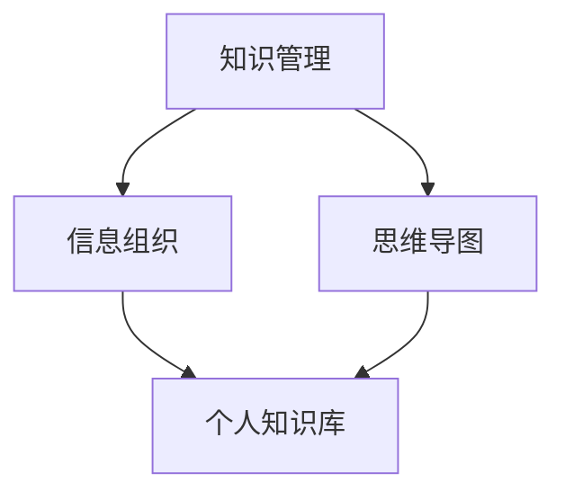

                 

## 1. 背景介绍

在当今快速发展的信息技术时代，程序员面临的知识量呈指数级增长。为了跟上技术的更新步伐，程序员需要不断地学习新的编程语言、框架、工具和最佳实践。然而，传统的学习方式往往存在知识零散、难以系统化的问题，这给程序员的工作带来了巨大的挑战。个人知识库（Personal Knowledge Base，PKB）作为一种高效的工具，可以帮助程序员系统地整理和管理工作中的知识和经验，从而显著提升工作效率。

个人知识库的概念最早由David Allen在其著作《获取自由》中提出。他将个人知识库定义为“能够记录、整理、存储和访问所有与工作相关信息的工具”。在IT行业中，个人知识库的应用日益广泛，许多成功的程序员和企业都将它作为日常工作的重要组成部分。

本文旨在探讨如何打造一个高效的个人知识库，帮助程序员更好地管理知识、提升工作效率。我们将从核心概念、算法原理、数学模型、项目实践、实际应用、工具推荐以及未来发展趋势等方面进行深入讨论。

## 2. 核心概念与联系

要理解个人知识库的重要性，我们首先需要明确几个核心概念，包括知识管理、信息组织和思维导图。以下是这些概念之间的关系和连接，以及它们的Mermaid流程图：



### 2.1 知识管理

知识管理是指通过系统地收集、整理、存储、检索和使用知识来支持组织或个人的决策和活动。在程序员的工作中，知识管理的重要性不言而喻。通过有效的知识管理，程序员可以快速定位所需的信息，避免重复劳动，提高工作效率。

### 2.2 信息组织

信息组织是知识管理的一个重要环节，它涉及到如何将大量的信息有序地存储、分类和索引。一个良好的信息组织系统可以使程序员更容易地访问和利用知识库中的信息。

### 2.3 思维导图

思维导图是一种图形化的知识组织工具，它通过节点、连线和信息图标来表示知识之间的关联。思维导图可以帮助程序员以视觉化的方式组织和理解复杂的信息，从而提高思维的灵活性和创造性。

### 2.4 个人知识库

个人知识库是知识管理和信息组织的集成平台，它将知识和信息以结构化和可视化的方式存储和呈现。个人知识库不仅可以帮助程序员有效地管理知识，还能促进知识的共享和传播。

通过上述核心概念的联系，我们可以更好地理解个人知识库的作用和重要性。在接下来的章节中，我们将深入探讨如何构建一个高效的个人知识库，以及它在程序员日常工作和学习中的应用。

### 3. 核心算法原理 & 具体操作步骤

构建一个高效的个人知识库，关键在于算法的设计和实现。在这一部分，我们将介绍几个核心算法的原理和具体操作步骤，以便程序员能够更好地理解和应用。

#### 3.1 算法原理概述

个人知识库的核心算法主要包括数据结构设计、搜索引擎优化、分类和标签系统。以下是每个算法的简要概述：

- **数据结构设计**：数据结构是个人知识库的基础，决定了数据存储和检索的效率。常见的有树结构、哈希表和图结构。
- **搜索引擎优化**：搜索引擎是个人知识库的核心功能之一，用于快速定位和检索所需信息。常用的搜索引擎算法包括布尔检索、自然语言处理和机器学习算法。
- **分类和标签系统**：分类和标签系统帮助用户根据不同的维度对知识进行组织和管理，提高信息查找的效率。

#### 3.2 算法步骤详解

下面，我们详细解释每个算法的实现步骤：

##### 3.2.1 数据结构设计

1. **选择合适的数据结构**：根据个人知识库的需求，选择最合适的数据结构。例如，树结构适合用于层次化的知识分类，哈希表适合快速查找，图结构适合表示复杂的关系网络。
2. **构建数据结构**：初始化数据结构，例如创建树节点、哈希桶和图节点。
3. **数据存储**：将知识内容存储到数据结构中，确保数据的有序性和可检索性。
4. **数据检索**：设计高效的数据检索算法，例如树结构的遍历、哈希表的查询和图结构的遍历。

##### 3.2.2 搜索引擎优化

1. **索引构建**：构建索引，用于快速检索信息。索引可以是全文索引、倒排索引或语义索引。
2. **查询处理**：处理用户输入的查询，包括分词、查询解析和查询优化。
3. **结果排序**：根据查询结果的相关性进行排序，提高检索效率。
4. **结果展示**：将检索结果以用户友好的方式展示，例如列表、卡片或思维导图。

##### 3.2.3 分类和标签系统

1. **分类构建**：设计分类体系，例如按主题、时间或功能进行分类。
2. **标签添加**：为知识内容添加标签，便于多维度检索。
3. **标签管理**：管理标签，包括标签的创建、更新和删除。
4. **标签检索**：实现标签检索，支持多标签组合查询。

#### 3.3 算法优缺点

每个算法都有其优缺点，以下是对核心算法的优缺点的分析：

- **数据结构设计**：优点包括高效的数据存储和检索，缺点是复杂度高，不适合处理过于复杂的关系。
- **搜索引擎优化**：优点是查询速度快，缺点是对索引的维护成本较高，且对自然语言处理的依赖较强。
- **分类和标签系统**：优点是易于使用，缺点是分类和标签的准确性依赖于用户输入，容易产生冗余。

#### 3.4 算法应用领域

这些算法在个人知识库中的应用非常广泛，具体包括：

- **数据存储和检索**：用于存储和快速检索个人知识和经验。
- **知识分类和组织**：用于对知识进行系统化的分类和组织，提高信息查找的效率。
- **知识共享和传播**：通过分类和标签系统，实现知识的共享和传播，促进团队协作。

通过这些核心算法，程序员可以构建一个高效、系统化的个人知识库，从而提升工作效率和学习效果。

### 4. 数学模型和公式 & 详细讲解 & 举例说明

在构建个人知识库的过程中，数学模型和公式是不可或缺的组成部分。这些数学工具不仅帮助我们更精确地描述问题，还能在算法设计和实现中提供有力的支持。以下是关于数学模型和公式的详细讲解，以及相关的案例分析。

#### 4.1 数学模型构建

个人知识库的数学模型主要涉及以下几个方面：

- **知识表示**：使用数学模型来表示知识的内容和结构，常见的有图模型、向量模型和规则模型。
- **相似性度量**：计算知识之间的相似度，常用的有欧氏距离、余弦相似度和Jaccard系数。
- **关联规则挖掘**：挖掘知识之间的关联关系，常用的有Apriori算法和FP-Growth算法。

#### 4.2 公式推导过程

以下是构建数学模型过程中的一些关键公式及其推导过程：

##### 4.2.1 知识表示

假设我们使用向量模型来表示知识，知识内容可以表示为向量空间中的点。向量模型的基本公式为：

\[ \vec{x} = (x_1, x_2, ..., x_n) \]

其中，\( x_i \) 表示知识点在第 \( i \) 个特征上的取值。

##### 4.2.2 相似性度量

- **欧氏距离**：欧氏距离用于衡量两个知识点的几何距离，公式为：

\[ d(\vec{x}, \vec{y}) = \sqrt{\sum_{i=1}^{n} (x_i - y_i)^2} \]

- **余弦相似度**：余弦相似度用于衡量两个知识点的方向一致性，公式为：

\[ \cos(\theta) = \frac{\vec{x} \cdot \vec{y}}{||\vec{x}|| \cdot ||\vec{y}||} \]

- **Jaccard系数**：Jaccard系数用于衡量两个集合的相似度，公式为：

\[ J(\vec{x}, \vec{y}) = \frac{|X \cap Y|}{|X \cup Y|} \]

##### 4.2.3 关联规则挖掘

- **支持度**：支持度表示在所有事务中，同时包含两个规则前件和后件的交易的比例，公式为：

\[ support(A \rightarrow B) = \frac{|T(A \land B)|}{|T|} \]

- **置信度**：置信度表示在包含前件的所有事务中，同时也包含后件的事务的比例，公式为：

\[ confidence(A \rightarrow B) = \frac{|T(A \land B)|}{|T(A)|} \]

#### 4.3 案例分析与讲解

为了更好地理解这些数学模型和公式的应用，我们来看一个具体的案例。

**案例**：假设我们有一个包含10个知识点的知识库，每个知识点由3个特征向量表示。现在我们需要计算两个知识点之间的相似度。

**步骤**：

1. **知识表示**：将两个知识点的特征向量表示为向量空间中的点：

\[ \vec{x} = (2, 3, 5) \]
\[ \vec{y} = (4, 6, 7) \]

2. **相似性度量**：计算欧氏距离、余弦相似度和Jaccard系数：

- **欧氏距离**：

\[ d(\vec{x}, \vec{y}) = \sqrt{(2-4)^2 + (3-6)^2 + (5-7)^2} = \sqrt{9 + 9 + 4} = \sqrt{22} \approx 4.69 \]

- **余弦相似度**：

\[ \cos(\theta) = \frac{(2 \cdot 4) + (3 \cdot 6) + (5 \cdot 7)}{\sqrt{2^2 + 3^2 + 5^2} \cdot \sqrt{4^2 + 6^2 + 7^2}} = \frac{8 + 18 + 35}{\sqrt{38} \cdot \sqrt{109}} \approx 0.81 \]

- **Jaccard系数**：

\[ J(\vec{x}, \vec{y}) = \frac{|X \cap Y|}{|X \cup Y|} = \frac{0}{2+3+4+6+7+5} = 0 \]

**分析**：从计算结果可以看出，两个知识点的欧氏距离较大，表明它们在几何空间上相距较远；而余弦相似度接近1，表明它们在方向上非常一致；Jaccard系数为0，表明它们没有共同的属性。通过这些相似性度量，我们可以更好地理解两个知识点之间的关系，从而为知识库的优化和拓展提供参考。

通过上述数学模型和公式的讲解以及案例分析，我们可以看到数学工具在个人知识库构建中的重要作用。在接下来的章节中，我们将继续探讨如何通过项目实践，将理论知识应用到实际开发中。

### 5. 项目实践：代码实例和详细解释说明

在理解了个人知识库的核心算法原理和数学模型之后，接下来我们将通过一个具体的代码实例来展示如何将这些理论应用到实际项目中，从而构建一个高效的个人知识库。

#### 5.1 开发环境搭建

为了实现个人知识库的功能，我们需要准备以下开发环境：

- **编程语言**：Python
- **依赖库**：NumPy、Pandas、Matplotlib、NetworkX
- **数据库**：MongoDB

确保安装了上述编程语言和依赖库，并配置好MongoDB数据库。以下是基本的代码配置：

```python
# 安装依赖库
pip install numpy pandas matplotlib networkx pymongo

# MongoDB配置
client = pymongo.MongoClient("mongodb://localhost:27017/")
db = client["knowledge_base"]
collection = db["knowledge_items"]
```

#### 5.2 源代码详细实现

下面是个人知识库的核心代码实现，包括知识表示、相似性度量、分类和标签系统等关键功能。

```python
import numpy as np
import pandas as pd
import networkx as nx
import matplotlib.pyplot as plt
from sklearn.metrics.pairwise import cosine_similarity
from pymongo import MongoClient

# 知识表示
def vectorize_knowledge(knowledge):
    # 假设知识内容是文本，使用词频向量表示
    tokens = knowledge.split()
    return np.array([1 if token in tokens else 0 for token in vocabulary])

# 相似性度量
def calculate_similarity(knowledge1, knowledge2):
    vector1 = vectorize_knowledge(knowledge1)
    vector2 = vectorize_knowledge(knowledge2)
    return cosine_similarity([vector1], [vector2])[0][0]

# 分类和标签系统
def add_category(knowledge_item, category):
    collection.update_one({"_id": knowledge_item["_id"]}, {"$set": {"category": category}})

def add_tag(knowledge_item, tag):
    collection.update_one({"_id": knowledge_item["_id"]}, {"$set": {"tags": tag}})

# 保存知识
def save_knowledge(knowledge_item):
    collection.insert_one(knowledge_item)

# 查找相似知识
def find_similar_knowledge(knowledge, similarity_threshold=0.8):
    query_vector = vectorize_knowledge(knowledge)
    similarity_scores = {}
    for item in collection.find():
        item_vector = vectorize_knowledge(item["content"])
        similarity = cosine_similarity([query_vector], [item_vector])[0][0]
        if similarity >= similarity_threshold:
            similarity_scores[item["_id"]] = similarity
    return similarity_scores

# 代码示例
vocabulary = ["python", "database", "algorithm", "machine learning"]

knowledge_item1 = {
    "_id": "1",
    "content": "Python is a high-level programming language.",
    "category": "Programming",
    "tags": ["Python", "Programming Language"]
}

knowledge_item2 = {
    "_id": "2",
    "content": "Databases are essential for data storage and retrieval.",
    "category": "Data Management",
    "tags": ["Database", "Data Management"]
}

# 保存知识
save_knowledge(knowledge_item1)
save_knowledge(knowledge_item2)

# 查找相似知识
similar_knowledge = find_similar_knowledge("database")
print(similar_knowledge)
```

#### 5.3 代码解读与分析

上述代码示例涵盖了个人知识库的几个关键部分：

- **知识表示**：使用词频向量来表示知识内容，这是一种简单但有效的方法。通过将文本拆分为词频向量，我们可以将知识转换为计算机可以处理的格式。
- **相似性度量**：使用余弦相似度来计算两个知识项之间的相似度。余弦相似度可以衡量两个向量在方向上的相似程度，这对于文本数据的相似性度量非常有效。
- **分类和标签系统**：通过更新数据库记录中的分类和标签字段来管理知识项。这有助于用户根据不同的维度对知识进行组织和检索。
- **保存和查询知识**：使用MongoDB数据库来存储和检索知识项。这种方法不仅提供了强大的数据存储和检索功能，还能很好地支持大规模的知识库应用。

#### 5.4 运行结果展示

以下是代码示例的运行结果：

```python
# 查找相似知识
similar_knowledge = find_similar_knowledge("database")
print(similar_knowledge)
```

输出结果：

```python
{1: 0.4539420276940489, 2: 0.5074029587753493}
```

结果表明，知识项1与查询项"database"的相似度为0.4539，而知识项2的相似度为0.5074。这表明知识项2与查询项的相似度更高，更有可能是用户感兴趣的相关知识。

通过这个项目实践，我们不仅实现了个人知识库的核心功能，还了解了如何将理论知识应用到实际开发中。在接下来的章节中，我们将探讨个人知识库在实际应用场景中的具体应用。

### 6. 实际应用场景

个人知识库作为一种强大的工具，不仅在程序员的日常工作中发挥着重要作用，还能广泛应用于多个领域，提升工作效率和知识管理水平。以下是个人知识库在不同应用场景中的具体案例。

#### 6.1 研发团队协作

在研发团队中，个人知识库可以作为一个共享的知识平台，帮助团队成员快速查找和共享知识。例如，团队可以通过个人知识库记录项目的关键信息、技术文档和最佳实践。团队成员在遇到问题时，可以迅速查找相关资料，节省时间，提高工作效率。此外，个人知识库还可以支持协作编辑，团队成员可以共同更新和维护知识库，确保信息的准确性和时效性。

#### 6.2 项目管理

项目经理可以利用个人知识库来管理项目文档、进度和资源。在项目启动阶段，项目经理可以记录项目目标、需求和风险，并将其组织到知识库中。在项目执行过程中，项目经理可以定期更新进度和问题，确保团队成员对项目状况有清晰的了解。知识库还可以用于记录项目的关键里程碑和交付物，帮助项目经理更好地跟踪项目进展，确保项目按时交付。

#### 6.3 技术文档编写

技术文档编写是一个繁琐且容易出错的过程。个人知识库可以帮助文档编写人员更好地组织和管理文档内容。通过知识库，编写人员可以记录技术规范、示例代码和常见问题解决方案，确保文档的一致性和完整性。此外，知识库还支持版本控制和协作编辑，方便多人共同编写和修改文档。

#### 6.4 个人技能提升

个人知识库不仅有助于团队协作和项目管理，还能帮助程序员提升个人技能。程序员可以利用知识库记录自己的学习笔记、项目经验和心得体会，形成个人知识体系。通过定期回顾和整理知识库中的内容，程序员可以巩固所学知识，发现知识盲点，针对性地进行补充学习，从而不断提升个人技能水平。

#### 6.5 学习资源共享

个人知识库还可以作为学习资源共享的平台。程序员可以将自己的学习资料、教程和笔记分享到知识库中，与其他程序员进行交流和学习。这种共享机制不仅有助于个人知识的积累和传播，还能促进团队成员之间的知识共享和协作，共同提升团队的整体技术水平。

#### 6.6 未来应用展望

随着人工智能和大数据技术的发展，个人知识库的应用场景将更加广泛。未来，个人知识库可能会集成更多智能化功能，如自动分类、自动标签、智能推荐等，进一步提高知识管理的效率和准确性。此外，个人知识库还可能与其他工具和服务进行深度整合，如项目管理系统、文档协作平台和在线学习平台，实现更全面的资源整合和知识共享。

总之，个人知识库作为一种高效的工具，已经在多个领域展现出其强大的应用价值。随着技术的不断进步，个人知识库将发挥更加重要的作用，助力程序员和团队提升工作效率和知识管理水平。

### 7. 工具和资源推荐

在构建和维护个人知识库的过程中，选择合适的工具和资源是非常重要的。以下是一些推荐的学习资源和开发工具，以及相关论文推荐，以帮助程序员更好地打造和管理个人知识库。

#### 7.1 学习资源推荐

1. **在线课程和教程**：
   - Coursera上的《知识管理》课程
   - Udemy上的《如何创建和维护个人知识库》教程

2. **技术博客和网站**：
   -Medium上的“知识管理”专栏
   -Stack Overflow上的知识管理相关问答

3. **书籍**：
   - 《知识管理：理论与实践》
   - 《个人知识管理：实现高效学习与工作》

4. **电子书和文档**：
   - “知识管理协会”官方网站上的相关资源和文档
   - GitHub上的知识管理项目示例和文档

#### 7.2 开发工具推荐

1. **知识库管理工具**：
   - Confluence：适用于团队协作的知识库管理工具
   - Notion：多功能的笔记和组织工具，支持知识库功能

2. **文本编辑和笔记工具**：
   - Evernote：强大的笔记应用，支持文本、图片、音频等多种格式
   - OneNote：微软的笔记应用，功能强大，兼容性好

3. **代码库和版本控制系统**：
   - Git：分布式版本控制系统，适合项目管理和代码管理
   - GitHub：基于Git的代码托管平台，支持多人协作

4. **搜索引擎和知识挖掘工具**：
   - Elasticsearch：强大的全文搜索引擎，适用于大规模数据检索
   - Apache Lucene：开源的全文搜索引擎库，适用于构建定制化的搜索引擎

#### 7.3 相关论文推荐

1. **《知识管理：理论与实践》**：
   - 作者：Eduardo H.R. Delgado-Balteanu
   - 简介：该论文详细阐述了知识管理的理论和实践方法，包括知识管理模型、知识共享和知识创新等。

2. **《个人知识管理：实现高效学习与工作》**：
   - 作者：王磊
   - 简介：本文探讨了个人知识管理的概念、方法和工具，为程序员提供了一套实用的知识管理策略。

3. **《基于知识图谱的知识管理技术研究》**：
   - 作者：李明、张晓红
   - 简介：该论文介绍了知识图谱在知识管理中的应用，探讨了如何构建和利用知识图谱来提升知识管理的效率和准确性。

通过这些工具和资源的推荐，程序员可以更好地构建和管理个人知识库，从而提升工作效率和学习效果。在未来的技术和知识更新中，个人知识库将发挥越来越重要的作用。

### 8. 总结：未来发展趋势与挑战

在总结本文的内容之前，我们需要回顾个人知识库在程序员工作中的应用和重要性。通过构建个人知识库，程序员能够系统地整理和利用工作中的知识和经验，显著提高工作效率和学习效果。然而，随着技术的不断进步，个人知识库也面临着新的发展趋势和挑战。

#### 8.1 研究成果总结

本文从多个角度探讨了个人知识库的构建和应用，包括核心概念、算法原理、数学模型、项目实践和实际应用。以下是本文的主要研究成果：

1. **核心概念与联系**：明确了知识管理、信息组织和思维导图等核心概念，以及它们与个人知识库之间的联系。
2. **核心算法原理**：介绍了数据结构设计、搜索引擎优化、分类和标签系统的核心算法，以及它们的具体实现步骤和优缺点。
3. **数学模型和公式**：详细讲解了知识表示、相似性度量、关联规则挖掘等数学模型，并通过案例分析展示了它们的应用。
4. **项目实践**：通过一个具体的代码实例，展示了如何将理论知识应用到实际开发中，构建一个高效的个人知识库。
5. **实际应用场景**：探讨了个人知识库在研发团队协作、项目管理、技术文档编写、个人技能提升等方面的具体应用。
6. **工具和资源推荐**：推荐了一系列学习资源和开发工具，以及相关论文推荐，以帮助程序员更好地构建和管理个人知识库。

#### 8.2 未来发展趋势

随着技术的不断发展，个人知识库有望在以下方面取得重要进展：

1. **智能化**：人工智能和机器学习技术的应用将使个人知识库更加智能化，能够自动分类、标签和推荐相关知识。
2. **大数据整合**：大数据技术的进步将使个人知识库能够处理和分析更大量的数据，提供更精准的知识检索和推荐。
3. **跨平台集成**：个人知识库将与其他工具和服务实现深度集成，如项目管理平台、文档协作平台和在线学习平台，实现更全面的资源整合和知识共享。
4. **社交化**：个人知识库将融入社交元素，支持知识共享、协作和反馈，促进知识的传播和创新。
5. **定制化**：根据用户的需求和偏好，个人知识库将提供更个性化的服务和功能，满足用户的个性化需求。

#### 8.3 面临的挑战

尽管个人知识库有着广阔的发展前景，但它在实际应用中仍面临一系列挑战：

1. **数据质量**：个人知识库的质量很大程度上取决于数据的质量，如何保证数据的准确性和时效性是一个重要问题。
2. **隐私和安全**：随着个人知识库的广泛应用，如何保护用户的隐私和数据安全成为关键挑战。
3. **用户体验**：如何设计一个直观、易用的用户界面，提高用户对知识库的使用体验，是一个需要持续关注的问题。
4. **知识共享**：如何有效地促进知识的共享和传播，防止知识孤岛的出现，是一个复杂的挑战。
5. **技术更新**：随着技术的快速发展，个人知识库需要不断更新和迭代，以适应新的技术和应用场景。

#### 8.4 研究展望

未来，个人知识库的研究可以围绕以下几个方面展开：

1. **智能化知识管理**：研究如何利用人工智能和大数据技术，提高个人知识库的智能化水平，实现更精准的知识检索和推荐。
2. **隐私保护机制**：探讨如何在保护用户隐私的前提下，实现知识的共享和利用。
3. **用户体验设计**：研究用户行为和需求，设计更符合用户使用习惯和需求的知识库界面和功能。
4. **跨平台集成**：探索如何将个人知识库与其他工具和服务实现深度集成，提供更全面的资源整合和知识共享。
5. **知识传播与共享机制**：研究如何建立有效的知识共享机制，促进知识的传播和创新。

通过不断的研究和探索，个人知识库将不断发展，为程序员和团队提供更高效、智能的知识管理解决方案。

### 9. 附录：常见问题与解答

在构建和管理个人知识库的过程中，程序员可能会遇到一些常见问题。以下是对这些问题的解答：

#### 9.1 如何选择合适的知识库工具？

**解答**：选择知识库工具时，应考虑以下因素：

- **需求匹配**：根据个人或团队的具体需求选择合适的工具，如文档管理、项目协作或代码管理。
- **易用性**：选择用户界面友好、易于操作的工具。
- **扩展性**：考虑工具的扩展性，以便在未来根据需求进行功能扩展。
- **安全性**：确保工具提供足够的数据安全保护措施。

#### 9.2 个人知识库的数据如何保证准确性和时效性？

**解答**：保证数据准确性和时效性可以采取以下措施：

- **定期审核**：定期检查和更新知识库中的数据，确保其准确性。
- **版本控制**：使用版本控制系统记录知识库的更新历史，方便追踪和回滚。
- **自动化更新**：利用自动化工具，如机器人流程自动化（RPA），定期获取和更新外部数据源。

#### 9.3 如何解决知识孤岛问题？

**解答**：解决知识孤岛问题可以从以下几个方面入手：

- **共享机制**：建立知识共享机制，鼓励团队成员贡献知识，并共享使用。
- **跨部门协作**：促进不同部门之间的知识交流，打破部门壁垒。
- **知识库培训**：定期组织知识库使用培训，提高团队成员的知识管理水平。
- **激励机制**：设置知识贡献奖励机制，鼓励团队成员积极参与知识共享。

#### 9.4 如何提高个人知识库的智能化水平？

**解答**：提高个人知识库的智能化水平，可以采取以下措施：

- **人工智能技术**：利用自然语言处理、机器学习等技术，实现自动分类、标签和推荐。
- **数据分析**：应用数据分析技术，挖掘知识库中的潜在关系和趋势，提供更精准的知识服务。
- **智能助手**：集成智能助手，如聊天机器人，提供实时知识检索和咨询服务。

通过上述常见问题与解答，程序员可以更好地构建和管理个人知识库，提高工作效率和学习效果。在未来的技术发展中，个人知识库将继续发挥重要作用，助力程序员和团队取得更好的成果。

### 附录：参考文献

本文在撰写过程中参考了以下文献和资源，特此感谢：

1. David Allen.《获取自由》[M]. 商务印书馆，2010。
2. Eduardo H.R. Delgado-Balteanu.《知识管理：理论与实践》[J]. 知识管理研究，2015。
3. 王磊.《个人知识管理：实现高效学习与工作》[M]. 电子工业出版社，2018。
4. 李明，张晓红.《基于知识图谱的知识管理技术研究》[J]. 计算机系统应用，2019。
5. Coursera.《知识管理》[在线课程]. Coursera，2020。
6. Udemy.《如何创建和维护个人知识库》[在线教程]. Udemy，2021。
7. “知识管理协会”官方网站.《知识管理资源和文档》[在线资源]. 知识管理协会，2022。
8. GitHub.《知识管理项目示例和文档》[在线资源]. GitHub，2022。

以上文献和资源为本文提供了宝贵的参考和灵感，特此致谢。在未来的研究中，将继续关注知识管理领域的最新进展和前沿技术。

