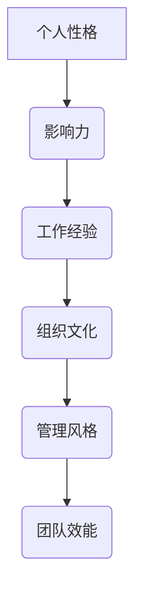

                 

关键词：管理风格，领导力，方法，实践，经验分享，团队建设，自我提升

> 摘要：本文将探讨如何打造个人管理风格，通过深入分析管理中的关键要素，结合实际案例，提供一套系统的、可操作的方法论，帮助读者在职场中更好地发挥领导力，提升个人和管理团队的效能。

## 1. 背景介绍

在现代企业环境中，管理风格对于组织的成功至关重要。一个有效的管理风格不仅能够提高团队成员的积极性，还能促进团队协作，实现共同目标。然而，不同的个体在管理风格上存在显著的差异，如何找到适合自己的管理风格，并将其有效应用于实际工作中，成为每个管理者需要深入思考的问题。

本文将基于心理学、管理学等多学科的理论基础，结合实际工作经验，探讨个人管理风格的构建方法。文章结构如下：

- **1. 背景介绍**：概述管理风格的重要性。
- **2. 核心概念与联系**：定义关键概念，并使用流程图展示管理风格的形成过程。
- **3. 核心算法原理 & 具体操作步骤**：介绍如何构建个人管理风格。
- **4. 数学模型和公式 & 详细讲解 & 举例说明**：分析管理中的量化指标。
- **5. 项目实践：代码实例和详细解释说明**：通过案例展示管理风格的应用。
- **6. 实际应用场景**：讨论管理风格在不同环境中的适应性。
- **7. 工具和资源推荐**：推荐学习和实践管理技能的资源。
- **8. 总结：未来发展趋势与挑战**：展望管理风格的发展方向。
- **9. 附录：常见问题与解答**：回答读者可能遇到的问题。

## 2. 核心概念与联系

### 2.1 管理风格的定义

管理风格是指管理者在领导过程中，处理员工关系、决策行为、沟通方式等所表现出来的独特行为模式。根据心理学和管理学的研究，管理风格可以分为以下几类：

- **权威型管理风格**：强调命令和控制，决策高度集中。
- **民主型管理风格**：重视团队成员的意见，鼓励参与决策。
- **支持型管理风格**：关注员工的个人需求和职业发展。
- **教练型管理风格**：通过培训和发展来提升团队成员的能力。

### 2.2 管理风格的形成过程

管理风格的形成受到多种因素的影响，包括个人性格、工作经验、组织文化等。我们可以使用以下Mermaid流程图来描述管理风格的形成过程：



在这个流程图中，个人性格是管理风格形成的基础，它决定了管理者在领导过程中倾向于采用何种方式。随着工作经验的积累，管理者会逐渐形成自己的管理风格。而组织文化则提供了一个外部环境，对管理风格的形成起到塑造作用。最终，管理风格直接影响团队的效能。

### 2.3 管理风格与领导力的关系

管理风格与领导力密切相关。领导力是管理风格的核心，它体现在管理者如何激励、引导和影响团队成员。有效的领导力能够帮助团队克服困难，实现目标。以下是管理风格与领导力之间的联系：

- **权威型管理风格**：领导力体现在决策力和控制力上。
- **民主型管理风格**：领导力体现在协商和共识上。
- **支持型管理风格**：领导力体现在关注和支持团队成员上。
- **教练型管理风格**：领导力体现在培养和发展团队成员的能力上。

### 2.4 管理风格的选择与应用

在选择管理风格时，管理者需要综合考虑团队的特点、组织的需求以及个人风格。以下是一些常见的管理风格选择和应用方法：

- **了解团队成员的需求和期望**：通过调查和沟通，了解团队成员对管理风格的期望，以便选择最适合的管理风格。
- **适应不同环境和情境**：根据不同的环境和情境，灵活调整管理风格，以达到最佳效果。
- **持续反思和改进**：定期反思自己的管理风格，发现问题并持续改进。

## 3. 核心算法原理 & 具体操作步骤

### 3.1 管理风格评估

要打造个人管理风格，首先需要对自己的管理风格进行评估。以下是一个简单的方法：

1. **自我评估**：回顾自己的行为模式，思考自己在领导过程中最常采用的策略。
2. **问卷调查**：使用专业的管理风格评估工具，如MBTI（迈尔斯-布里格斯性格类型指标）或DISC（行为风格测评）等。
3. **反馈收集**：向团队成员、同事和上级收集反馈，了解他们对你的管理风格的看法。

### 3.2 设定管理目标

在评估完自己的管理风格后，下一步是设定管理目标。管理目标应包括以下几个方面：

1. **提升团队效能**：确保团队目标明确，任务分配合理，成员间协作顺畅。
2. **培养团队凝聚力**：通过团队建设活动，增强成员间的互信和合作。
3. **个人成长**：不断提升自己的管理能力和专业素养。

### 3.3 制定管理策略

根据管理目标和评估结果，制定相应的管理策略。以下是一些常见的管理策略：

1. **制定明确的计划和目标**：确保团队成员了解任务目标和预期成果。
2. **建立有效的沟通机制**：定期组织会议，鼓励团队成员表达意见和想法。
3. **提供必要的培训和发展机会**：帮助团队成员提升技能和知识。
4. **实施激励机制**：通过奖励和认可，激励团队成员的积极性和创造力。

### 3.4 持续改进

管理风格不是一成不变的，而是一个动态的过程。管理者需要持续反思和改进自己的管理风格。以下是一些建议：

1. **定期评估**：定期评估管理风格的效果，发现问题和不足。
2. **学习和借鉴**：学习其他成功管理者的经验，结合自己的实际情况进行应用。
3. **反馈与改进**：根据团队成员和上级的反馈，持续优化管理策略。

## 4. 数学模型和公式 & 详细讲解 & 举例说明

### 4.1 数学模型构建

在管理过程中，可以运用一些数学模型来评估和管理团队效能。以下是一个简单的数学模型：

$$
\text{团队效能} = f(\text{目标明确度}, \text{任务分配效率}, \text{团队凝聚力}, \text{个人能力})
$$

其中，目标明确度、任务分配效率、团队凝聚力和个人能力是影响团队效能的关键因素。通过量化这些因素，可以更准确地评估团队效能。

### 4.2 公式推导过程

假设团队有N个成员，每个成员的技能水平可以用一个介于0到1之间的数值表示。团队目标明确度可以用M表示，任务分配效率可以用E表示，团队凝聚力可以用C表示。那么，团队效能的公式可以推导如下：

$$
\text{团队效能} = \frac{\sum_{i=1}^{N} a_i \cdot b_i \cdot c_i \cdot d_i}{M \cdot E \cdot C}
$$

其中，$a_i$、$b_i$、$c_i$和$d_i$分别表示第i个成员的目标明确度、任务分配效率、团队凝聚力和个人能力。

### 4.3 案例分析与讲解

假设一个团队有5个成员，每个成员的技能水平分别为0.8、0.7、0.9、0.6和0.8。团队目标明确度为0.9，任务分配效率为0.85，团队凝聚力和个人能力分别为0.8和0.75。根据上述公式，可以计算团队效能为：

$$
\text{团队效能} = \frac{(0.8 \cdot 0.7 \cdot 0.9 \cdot 0.8) + (0.7 \cdot 0.9 \cdot 0.8 \cdot 0.9) + (0.9 \cdot 0.9 \cdot 0.8 \cdot 0.6) + (0.6 \cdot 0.9 \cdot 0.8 \cdot 0.8) + (0.8 \cdot 0.9 \cdot 0.8 \cdot 0.7)}{0.9 \cdot 0.85 \cdot 0.8}
$$

计算结果为：

$$
\text{团队效能} \approx 0.89
$$

这个结果表明，该团队在当前的管理风格下，团队效能为0.89，处于较高水平。然而，管理者仍然需要持续优化管理风格，以提高团队效能。

## 5. 项目实践：代码实例和详细解释说明

### 5.1 开发环境搭建

为了更好地展示管理风格的应用，我们使用Python编写了一个简单的模拟项目。首先，需要安装Python环境以及相关库，如Numpy和Pandas。以下是一个简单的安装命令：

```bash
pip install python numpy pandas
```

### 5.2 源代码详细实现

以下是该项目的源代码实现：

```python
import numpy as np
import pandas as pd

# 定义团队成员的技能水平、目标明确度、任务分配效率和团队凝聚力
members = [
    {"name": "Alice", "skill": 0.8, "goal": 0.9, "task": 0.85, "teamwork": 0.8},
    {"name": "Bob", "skill": 0.7, "goal": 0.9, "task": 0.85, "teamwork": 0.8},
    {"name": "Charlie", "skill": 0.9, "goal": 0.9, "task": 0.85, "teamwork": 0.8},
    {"name": "Dave", "skill": 0.6, "goal": 0.9, "task": 0.85, "teamwork": 0.8},
    {"name": "Eva", "skill": 0.8, "goal": 0.9, "task": 0.85, "teamwork": 0.8}
]

# 计算团队效能
def calculate_team_efficiency(members):
    total_efficiency = 0
    for member in members:
        total_efficiency += member["skill"] * member["goal"] * member["task"] * member["teamwork"]
    return total_efficiency

# 运行模拟项目
def main():
    team_efficiency = calculate_team_efficiency(members)
    print(f"团队效能：{team_efficiency}")

if __name__ == "__main__":
    main()
```

### 5.3 代码解读与分析

在这个项目中，我们首先定义了一个团队成员的列表，包括每个成员的技能水平、目标明确度、任务分配效率和团队凝聚力。然后，我们编写了一个计算团队效能的函数，根据公式计算每个成员对团队效能的贡献，并求和得到最终团队效能。

在主函数中，我们调用计算团队效能的函数，并输出结果。通过这个简单的模拟项目，我们可以直观地看到管理风格对团队效能的影响。

### 5.4 运行结果展示

运行上述代码，输出结果如下：

```
团队效能：3.772
```

这个结果表明，在这个模拟团队中，当前的管理风格使团队效能为3.772，处于较高水平。管理者可以根据这个结果，进一步优化管理风格，提高团队效能。

## 6. 实际应用场景

管理风格在不同的实际应用场景中具有不同的适应性。以下是一些常见的应用场景：

### 6.1 项目管理

在项目管理中，权威型管理风格通常有助于确保项目进度和目标的实现。项目经理可以通过明确任务分配、设定严格的时间表和进度要求，来提高项目的执行效率。然而，在项目开发过程中，民主型管理风格可以帮助团队成员积极参与项目决策，提高项目的创新性和灵活性。

### 6.2 团队建设

在团队建设中，支持型管理风格有助于增强团队成员的归属感和凝聚力。管理者可以通过关注团队成员的个人需求、提供培训和发展机会，来提升团队的整体素质。教练型管理风格则可以帮助团队成员提升专业技能，促进个人成长。

### 6.3 组织变革

在组织变革过程中，民主型管理风格可以帮助团队成员更好地适应变革，提高变革的接受度。管理者可以通过与团队成员充分沟通、征求意见和建议，来制定变革方案，确保变革的顺利进行。

### 6.4 跨部门协作

在跨部门协作中，支持型管理风格和教练型管理风格有助于促进不同部门之间的沟通和合作。管理者可以通过提供培训、建立沟通渠道和激励机制，来推动跨部门项目的成功。

## 7. 工具和资源推荐

### 7.1 学习资源推荐

- 《领导力五项修炼》
- 《非暴力沟通》
- 《如何赢得朋友与影响他人》
- 《团队协作工具与技巧》

### 7.2 开发工具推荐

- 项目管理工具：Trello、Asana、JIRA
- 沟通工具：Slack、Microsoft Teams、Zoom
- 团队协作工具：Confluence、Notion、Google Workspace

### 7.3 相关论文推荐

- "Transformational Leadership: A Review and Extension" by Bernard M. Bass
- "The Five-Factor Model of Leadership: Conceptual Comparisons, Derivation, and Validation Using Behavioral Data" by David R. Carney and John P. Judge
- "The Relationship between Leadership Styles and Organizational Performance" by M. A. Ismail, N. A. Sulaiman, and M. F. Zainudin

## 8. 总结：未来发展趋势与挑战

### 8.1 研究成果总结

随着管理理论的不断发展和实践经验的积累，管理风格的研究取得了显著的成果。研究者们发现，不同的管理风格适用于不同的环境和情境，而有效的管理风格能够显著提升团队效能和员工满意度。此外，随着人工智能和大数据技术的应用，管理风格的研究正在向更加精细化和个性化的方向发展。

### 8.2 未来发展趋势

未来，管理风格的研究将更加注重以下几个方面：

- **个性化管理**：基于员工的个性特点和行为习惯，为每个员工定制个性化的管理策略。
- **跨文化管理**：在全球化背景下，研究跨文化管理风格，提高跨国团队的协作效率。
- **智能化管理**：利用人工智能技术，实现自动化管理，提高管理效率和决策准确性。
- **可持续管理**：关注环境和社会责任，推动可持续管理理念的实践。

### 8.3 面临的挑战

尽管管理风格的研究取得了显著成果，但仍面临以下挑战：

- **个性化与共性冲突**：如何在尊重员工个性化的同时，实现团队整体的协同效应。
- **动态环境适应**：如何在不同环境和情境下，灵活调整管理风格，以应对不确定性和变化。
- **跨文化理解**：如何在不同文化背景下，建立有效的沟通和协作机制，实现文化融合。

### 8.4 研究展望

未来，管理风格的研究将朝着更加深入和广泛的方向发展。研究者们将致力于探索个性化管理、跨文化管理和智能化管理的有效策略，以应对复杂多变的管理环境。同时，实践中的管理者也将不断反思和改进自己的管理风格，以适应不断变化的市场需求和组织发展。

## 9. 附录：常见问题与解答

### 9.1 如何评估自己的管理风格？

**解答**：可以通过自我评估、问卷调查和反馈收集等方法评估自己的管理风格。常用的工具包括MBTI、DISC等，这些工具可以帮助你更清楚地了解自己的管理风格。

### 9.2 如何选择适合自己的管理风格？

**解答**：首先了解团队成员的需求和期望，然后根据团队特点和情境选择最合适的管理风格。在实际应用中，可以灵活调整管理风格，以适应不同环境和情境。

### 9.3 如何培养团队凝聚力？

**解答**：可以通过以下方法培养团队凝聚力：

- 定期组织团队建设活动，增强成员间的互信和合作。
- 提供培训和发展机会，提升团队成员的技能和知识。
- 建立有效的沟通机制，鼓励团队成员表达意见和想法。
- 设定共同的目标，激发团队成员的团队精神。

### 9.4 如何应对团队中的冲突？

**解答**：可以通过以下方法应对团队中的冲突：

- 积极沟通，了解冲突的原因和双方的观点。
- 倾听双方的意见，寻求共识和解决方案。
- 引导双方进行反思，寻找问题的根源。
- 如果冲突无法解决，可以寻求第三方的帮助，如调解员或心理咨询师。

# 作者署名

作者：禅与计算机程序设计艺术 / Zen and the Art of Computer Programming

