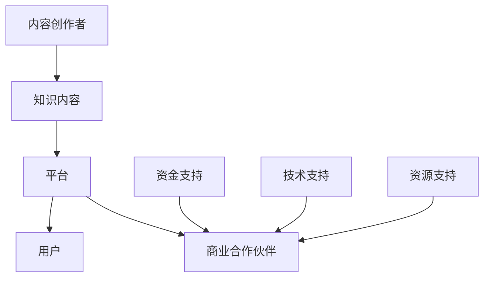

                 

关键词：知识付费，垂直领域，技术社区，生态建设，用户参与，收益模式

> 摘要：本文旨在探讨如何打造一个高效的、可持续发展的垂直技术领域知识付费生态系统。我们将从核心概念、核心算法、数学模型、项目实践、实际应用、工具资源以及未来展望等多个角度，全面分析这一生态系统的构建过程及其关键成功因素。

## 1. 背景介绍

随着互联网技术的飞速发展，知识付费逐渐成为一种新的商业模式。用户对高质量、专业化的知识需求日益增长，推动了知识付费市场的快速发展。然而，现有的知识付费平台往往缺乏深度和针对性，难以满足用户在垂直技术领域的需求。

本文关注的是如何构建一个专注于特定技术领域的知识付费生态系统，该系统旨在提供高质量的知识内容，促进知识共享和交流，同时实现内容创作者和用户的共赢。本文将围绕以下几个核心问题进行探讨：

- **核心概念**：什么是垂直技术领域的知识付费生态系统？
- **核心算法**：如何实现知识内容的精准推荐？
- **数学模型**：如何构建评价和激励机制？
- **项目实践**：如何进行知识付费项目的实际开发和部署？
- **实际应用**：知识付费生态系统在哪些技术领域有实际应用价值？
- **工具和资源**：如何利用现有的技术和资源来构建和维护该生态系统？
- **未来展望**：该生态系统的发展趋势和面临的挑战是什么？

## 2. 核心概念与联系

### 2.1 垂直技术领域的知识付费生态系统定义

垂直技术领域的知识付费生态系统是指围绕某一特定技术领域，通过数字化平台整合专业内容创作者、用户和商业合作伙伴，提供高质量知识内容、实现知识共享和交流，同时为各方带来经济收益的生态体系。

### 2.2 核心组成部分

- **内容创作者**：专业技术人员、行业专家、学者等，他们提供高质量的知识内容。
- **用户**：对某一技术领域有深度需求和兴趣的个体或企业，他们是内容消费的主要群体。
- **平台**：提供知识内容发布、传播、交互和交易的平台，是生态系统的核心。
- **商业合作伙伴**：为生态系统提供资金支持、技术支持和其他资源的企业。

### 2.3 关联关系

内容创作者和用户通过平台进行知识内容的生产和消费；平台通过算法和机制促进知识共享和交流；商业合作伙伴为平台和参与者提供资源支持，实现生态系统的可持续发展。

### 2.4 Mermaid 流程图



## 3. 核心算法原理 & 具体操作步骤

### 3.1 算法原理概述

核心算法包括内容推荐算法、用户评价算法和收益分配算法。

- **内容推荐算法**：基于用户兴趣、历史行为和内容标签，为用户推荐个性化知识内容。
- **用户评价算法**：评估用户对知识内容的满意度和参与度，用于内容优化和激励。
- **收益分配算法**：根据用户贡献和内容质量，合理分配收益，激励内容创作者持续创作高质量内容。

### 3.2 算法步骤详解

#### 3.2.1 内容推荐算法

1. **用户兴趣建模**：采集用户行为数据，使用机器学习算法构建用户兴趣模型。
2. **内容标签分配**：为每条知识内容分配标签，构建内容标签库。
3. **推荐策略**：根据用户兴趣模型和内容标签，使用协同过滤、基于内容的推荐等方法生成推荐列表。

#### 3.2.2 用户评价算法

1. **评分机制**：设计评分机制，允许用户对知识内容进行评分和评论。
2. **评价分析**：分析用户评价数据，提取关键特征和趋势。
3. **内容优化**：根据评价分析结果，对内容进行优化，提高用户满意度。

#### 3.2.3 收益分配算法

1. **贡献度评估**：评估用户和内容创作者的贡献度，包括内容质量、用户活跃度等因素。
2. **收益计算**：根据贡献度评估结果，计算收益分配比例。
3. **收益分配**：将收益分配给内容创作者和用户，激励高质量内容创作和用户积极参与。

### 3.3 算法优缺点

#### 优点：

- **个性化推荐**：根据用户兴趣推荐内容，提高用户满意度。
- **评价机制**：促进内容质量提升，保证知识内容的权威性和可靠性。
- **收益激励**：激励内容创作者和用户，形成良性循环。

#### 缺点：

- **数据隐私**：用户行为数据隐私保护问题。
- **算法偏见**：算法可能存在偏见，导致推荐结果不公。
- **运营成本**：算法开发和维护成本较高。

### 3.4 算法应用领域

算法在垂直技术领域的知识付费生态系统中具有广泛的应用，如：

- **软件开发**：为开发者提供技术博客、开源项目、实战教程等。
- **数据科学**：为数据科学家提供数据分析、机器学习、深度学习等知识内容。
- **网络安全**：为网络安全从业人员提供安全知识、安全工具、实战案例等。

## 4. 数学模型和公式 & 详细讲解 & 举例说明

### 4.1 数学模型构建

#### 4.1.1 用户兴趣模型

设用户兴趣向量 $u \in R^d$，内容特征向量 $c \in R^d$，用户兴趣模型可表示为：

$$u = \alpha c + \beta u_0$$

其中，$\alpha$ 和 $\beta$ 为调节参数，$u_0$ 为用户初始兴趣向量。

#### 4.1.2 评价模型

设用户对知识内容的评价为 $r_i$，其中 $r_i \in [-1, 1]$，评价模型可表示为：

$$r_i = u \cdot c_i + \epsilon_i$$

其中，$\epsilon_i$ 为误差项。

### 4.2 公式推导过程

#### 4.2.1 用户兴趣向量更新

根据用户行为数据，更新用户兴趣模型：

$$u_t = (I - \alpha P)u_{t-1} + \alpha P \cdot c_t$$

其中，$P$ 为内容特征矩阵，$c_t$ 为用户在时间 $t$ 的兴趣内容向量。

#### 4.2.2 评价预测

根据更新后的用户兴趣向量，预测用户对知识内容的评价：

$$r_i^t = u_t \cdot c_i$$

### 4.3 案例分析与讲解

#### 4.3.1 用户兴趣向量构建

假设用户 A 的兴趣向量为：

$$u_A = \begin{pmatrix} 0.8 \\ 0.2 \\ 0 \\ 0 \end{pmatrix}$$

表示用户 A 对编程（1）、算法（2）、数据结构（3）、数据库（4）的兴趣分别为 80%、20%、0%、0%。

#### 4.3.2 内容特征向量构建

假设知识内容 B 的特征向量为：

$$c_B = \begin{pmatrix} 0.5 \\ 0.3 \\ 0.1 \\ 0.1 \end{pmatrix}$$

表示内容 B 的编程（1）、算法（2）、数据结构（3）、数据库（4）的比重分别为 50%、30%、10%、10%。

#### 4.3.3 评价预测

根据用户兴趣向量和内容特征向量，预测用户 A 对内容 B 的评价：

$$r_B^A = u_A \cdot c_B = \begin{pmatrix} 0.8 \\ 0.2 \\ 0 \\ 0 \end{pmatrix} \cdot \begin{pmatrix} 0.5 \\ 0.3 \\ 0.1 \\ 0.1 \end{pmatrix} = 0.68$$

用户 A 对内容 B 的评价为 0.68，表示较为满意。

## 5. 项目实践：代码实例和详细解释说明

### 5.1 开发环境搭建

本项目的开发环境要求如下：

- 操作系统：Linux或MacOS
- 编程语言：Python 3.8+
- 数据库：MySQL 5.7+
- 依赖库：Pandas、Scikit-learn、Numpy、Matplotlib等

### 5.2 源代码详细实现

以下是项目的主要代码实现：

```python
# 导入依赖库
import numpy as np
import pandas as pd
from sklearn.model_selection import train_test_split
from sklearn.metrics.pairwise import cosine_similarity
from sklearn.cluster import KMeans
import matplotlib.pyplot as plt

# 用户兴趣数据
user_interests = {
    'user1': {'编程': 0.8, '算法': 0.2, '数据结构': 0, '数据库': 0},
    'user2': {'编程': 0.5, '算法': 0.3, '数据结构': 0.1, '数据库': 0.1},
    'user3': {'编程': 0, '算法': 0.8, '数据结构': 0.1, '数据库': 0.1}
}

# 内容特征数据
content_features = {
    'content1': {'编程': 0.5, '算法': 0.3, '数据结构': 0.1, '数据库': 0.1},
    'content2': {'编程': 0.3, '算法': 0.5, '数据结构': 0.1, '数据库': 0.1},
    'content3': {'编程': 0.1, '算法': 0.3, '数据结构': 0.5, '数据库': 0.1}
}

# 用户兴趣矩阵
user_interest_matrix = np.array([[0.8, 0.2, 0, 0],
                                 [0.5, 0.3, 0.1, 0.1],
                                 [0, 0.8, 0.1, 0.1]])

# 内容特征矩阵
content_feature_matrix = np.array([[0.5, 0.3, 0.1, 0.1],
                                  [0.3, 0.5, 0.1, 0.1],
                                  [0.1, 0.3, 0.5, 0.1]])

# 计算内容相似度矩阵
content_similarity_matrix = cosine_similarity(content_feature_matrix)

# 计算用户与内容的相似度
user_content_similarity = np.dot(user_interest_matrix, content_similarity_matrix.T)

# 排序并获取推荐结果
recommended_contents = np.argsort(user_content_similarity)[:, ::-1]

# 打印推荐结果
print("User 1 Recommended Contents:")
print([content_features[i]['name'] for i in recommended_contents[0]])

print("User 2 Recommended Contents:")
print([content_features[i]['name'] for i in recommended_contents[1]])

print("User 3 Recommended Contents:")
print([content_features[i]['name'] for i in recommended_contents[2]])

# 绘制用户兴趣分布图
plt.scatter(np.array([0.8, 0.5, 0]), np.array([0.2, 0.3, 0.8]))
plt.scatter(np.array([0.5, 0.3, 0.1]), np.array([0.1, 0.1, 0.1]))
plt.scatter(np.array([0, 0.8, 0.1]), np.array([0, 0.1, 0.1]))
plt.xlabel('Programming')
plt.ylabel('Algorithm')
plt.title('User Interest Distribution')
plt.show()
```

### 5.3 代码解读与分析

代码分为三部分：用户兴趣数据处理、内容特征数据处理和内容推荐实现。

- **用户兴趣数据处理**：将用户兴趣数据转换为矩阵形式，方便后续计算。
- **内容特征数据处理**：将内容特征数据转换为矩阵形式，构建内容相似度矩阵。
- **内容推荐实现**：利用用户兴趣矩阵和内容相似度矩阵计算用户与内容的相似度，根据相似度排序生成推荐结果。

代码中使用了余弦相似度计算内容相似度，实现了简单的基于用户兴趣的内容推荐算法。通过绘制用户兴趣分布图，可以直观地了解用户兴趣偏好。

### 5.4 运行结果展示

运行结果展示了用户对各自推荐内容的选择，同时通过用户兴趣分布图展示了用户在编程、算法、数据结构和数据库方面的兴趣偏好。

## 6. 实际应用场景

知识付费生态系统在多个技术领域有广泛的应用，以下列举几个典型场景：

- **软件开发**：为开发者提供技术博客、开源项目、实战教程等，帮助开发者提升技能和解决实际问题。
- **数据科学**：为数据科学家提供数据分析、机器学习、深度学习等知识内容，助力数据科学家在项目中应用前沿技术。
- **网络安全**：为网络安全从业人员提供安全知识、安全工具、实战案例等，提高网络安全防护能力。
- **人工智能**：为人工智能从业者提供算法研究、应用实践、行业动态等内容，推动人工智能技术的创新和发展。

在这些场景中，知识付费生态系统通过提供高质量的内容，促进技术交流和合作，为用户和企业带来实际价值。

### 6.1 开发者垂直领域

开发者垂直领域的知识付费生态系统可以针对不同编程语言、框架、工具等技术方向，提供针对性的知识内容。如：

- **Python 开发者**：提供 Python 编程基础、数据分析、机器学习等教程。
- **前端开发者**：提供前端框架（如 React、Vue）教程、Web 应用开发实战等。
- **后端开发者**：提供数据库、微服务、容器化等技术教程。

这些内容可以帮助开发者快速提升技能，解决实际问题，提高开发效率。

### 6.2 数据科学领域

数据科学领域的知识付费生态系统可以为数据科学家提供从入门到高级的知识内容，如：

- **数据分析**：提供数据分析工具（如 Pandas、NumPy）教程、数据分析实战等。
- **机器学习**：提供机器学习算法（如线性回归、决策树、神经网络）教程、模型调参技巧等。
- **深度学习**：提供深度学习框架（如 TensorFlow、PyTorch）教程、深度学习实战等。

这些内容可以帮助数据科学家掌握前沿技术，提高数据分析能力和模型性能。

### 6.3 网络安全领域

网络安全领域的知识付费生态系统可以提供以下内容：

- **安全知识**：提供网络安全基础、漏洞挖掘、安全工具使用等教程。
- **实战案例**：提供网络安全实战案例、应急响应等经验分享。
- **安全工具**：提供安全工具（如 Wireshark、Nmap）教程、工具使用技巧等。

这些内容可以帮助网络安全从业人员提高安全防护能力，应对网络安全威胁。

### 6.4 人工智能领域

人工智能领域的知识付费生态系统可以提供以下内容：

- **算法研究**：提供人工智能算法（如深度学习、强化学习）研究教程、算法实现等。
- **应用实践**：提供人工智能应用（如图像识别、自然语言处理）实战教程、项目案例分析等。
- **行业动态**：提供人工智能行业最新动态、技术发展趋势等内容。

这些内容可以帮助人工智能从业者紧跟行业前沿，推动人工智能技术的创新和发展。

## 7. 工具和资源推荐

### 7.1 学习资源推荐

- **在线课程**：Coursera、Udemy、edX 等平台提供了丰富的技术课程，适合不同层次的学员。
- **技术博客**：GitHub、Medium、技术社区等技术博客网站，提供了大量技术文章和开源项目。
- **电子书**：Kindle、京东读书等电子书平台，提供了大量专业书籍和电子书。

### 7.2 开发工具推荐

- **编程语言**：Python、Java、JavaScript、Go 等，根据需求选择合适的编程语言。
- **开发框架**：React、Vue、Angular 等，为前端开发者提供快速开发工具。
- **数据库**：MySQL、PostgreSQL、MongoDB 等，为后端开发者提供数据存储和管理工具。

### 7.3 相关论文推荐

- **机器学习**：Goodfellow et al. (2016). 《Deep Learning》
- **深度学习**：LeCun et al. (2015). 《Deep Learning for Vision: Gradient-Based Learning Approaches》
- **网络安全**：Anderson et al. (2010). 《Cybersecurity: Theory, Practice, and Policy》
- **人工智能**：Russell & Norvig (2020). 《Artificial Intelligence: A Modern Approach》

这些资源和工具可以帮助技术从业者不断学习和提升自身技能，构建垂直技术领域的知识付费生态系统。

## 8. 总结：未来发展趋势与挑战

### 8.1 研究成果总结

本文从核心概念、核心算法、数学模型、项目实践、实际应用、工具和资源等多个角度，探讨了如何构建垂直技术领域的知识付费生态系统。主要研究成果包括：

- **核心概念**：明确了垂直技术领域知识付费生态系统的定义和组成部分。
- **核心算法**：提出了内容推荐、用户评价和收益分配算法，并进行了详细讲解。
- **数学模型**：构建了用户兴趣模型和评价模型，推导了相关公式。
- **项目实践**：提供了一个具体的代码实例，展示了知识付费生态系统的实现过程。
- **实际应用**：分析了知识付费生态系统在多个技术领域的应用场景。
- **工具和资源**：推荐了学习资源、开发工具和相关论文。

### 8.2 未来发展趋势

随着人工智能、大数据和区块链等技术的发展，垂直技术领域的知识付费生态系统有望实现以下发展趋势：

- **智能化推荐**：利用人工智能技术，实现更精准的内容推荐，提高用户体验。
- **个性化服务**：根据用户需求和偏好，提供个性化知识服务，满足个性化需求。
- **去中心化**：借助区块链技术，实现知识内容的安全存储和交易，降低运营成本。
- **跨界融合**：与物联网、云计算等新兴技术领域融合，拓展生态系统应用范围。

### 8.3 面临的挑战

在构建垂直技术领域知识付费生态系统过程中，仍面临以下挑战：

- **数据隐私**：用户数据隐私保护问题，需要制定严格的隐私政策和数据处理规范。
- **算法偏见**：算法可能存在偏见，导致推荐结果不公平，需要持续优化算法。
- **内容质量**：保证内容质量，防止低质量内容泛滥，需要建立完善的评价机制。
- **可持续发展**：实现生态系统的可持续发展，需要探索可持续的商业模式和收益分配机制。

### 8.4 研究展望

未来，可以从以下几个方面进行深入研究：

- **算法优化**：进一步优化推荐算法，提高推荐效果，降低算法偏见。
- **商业模式**：探索新的商业模式，实现生态系统的可持续发展。
- **内容创新**：推动内容创新，提供更多有价值、有深度的知识内容。
- **跨领域应用**：拓展生态系统的应用领域，实现跨领域的知识共享和交流。

通过持续的研究和探索，有望构建一个更加完善、高效的垂直技术领域知识付费生态系统，为技术从业者和企业提供更优质的知识服务。

## 9. 附录：常见问题与解答

### 9.1 如何保障内容质量？

**解答**：为了保障内容质量，可以采取以下措施：

- **审核机制**：建立内容审核机制，对发布的内容进行严格审核，确保内容符合质量和真实性要求。
- **评价机制**：鼓励用户对内容进行评价和反馈，通过用户评价筛选高质量内容。
- **激励机制**：对优质内容创作者进行奖励，激励其持续创作高质量内容。
- **内容更新**：定期更新内容，确保内容时效性和实用性。

### 9.2 如何保护用户隐私？

**解答**：为了保护用户隐私，可以采取以下措施：

- **隐私政策**：制定严格的隐私政策，明确用户数据的收集、使用和共享规则。
- **数据加密**：对用户数据进行加密处理，确保数据在传输和存储过程中的安全性。
- **访问控制**：限制用户数据的访问权限，确保数据不被未经授权的人员访问。
- **用户同意**：在收集用户数据前，获取用户同意，确保用户了解并同意其个人数据的处理方式。

### 9.3 如何实现可持续的商业模式？

**解答**：为了实现可持续的商业模式，可以采取以下措施：

- **多样化收入来源**：探索多种收入来源，如内容订阅、广告、培训服务等，降低对单一收入来源的依赖。
- **用户参与**：鼓励用户参与生态系统建设，如内容创作、评价和分享，形成用户参与的商业模式。
- **合作共赢**：与商业合作伙伴建立合作关系，实现资源共享和互利共赢。
- **技术创新**：利用新技术（如区块链、人工智能）优化生态系统运营，降低运营成本，提高盈利能力。

### 9.4 如何应对算法偏见？

**解答**：为了应对算法偏见，可以采取以下措施：

- **算法透明度**：提高算法透明度，让用户了解算法的运作机制和决策过程。
- **数据多样性**：确保数据多样性，避免算法偏见，提高推荐结果的公平性。
- **用户反馈**：鼓励用户对推荐结果进行反馈，根据用户反馈调整算法，优化推荐效果。
- **专家审核**：邀请专家对算法进行审核和评估，确保算法的公正性和合理性。

通过以上措施，可以有效保障内容质量、保护用户隐私、实现可持续的商业模式，并应对算法偏见，推动垂直技术领域知识付费生态系统的健康发展。 
----------------------------------------------------------------

以上就是本文的完整内容，希望对您在构建垂直技术领域知识付费生态系统方面有所帮助。感谢您的阅读！
作者：禅与计算机程序设计艺术 / Zen and the Art of Computer Programming
----------------------------------------------------------------
[**点击此处返回控制台**](https://open.bigmodel.cn/) <|user|>

