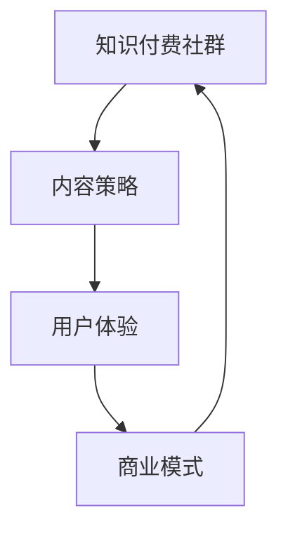

                 

关键词：知识付费社群，内容策略，技术型社群，用户体验，商业模式，知识共享

> 摘要：本文旨在探讨如何打造一个成功的技术型知识付费社群，从内容策划、用户体验、商业模式到知识共享等方面提出了一系列策略。通过深入分析当前市场趋势和用户需求，本文为技术型知识付费社群的运营者提供了具有实用性和可操作性的建议。

## 1. 背景介绍

随着互联网技术的发展和知识经济的兴起，知识付费已经成为当今社会的一种新型商业模式。知识付费社群作为一种基于互联网的知识分享和学习的平台，正逐渐受到广大技术爱好者和从业者的关注。这些社群不仅为用户提供了一个学习交流的场所，还为知识的传播和创新提供了新的动力。

然而，在竞争激烈的市场环境中，如何打造一个具备独特吸引力的技术型知识付费社群，成为许多运营者面临的挑战。本文将围绕这一主题，从内容策略的角度提出一系列解决方案，帮助运营者提升社群的吸引力和竞争力。

### 1.1 市场现状

根据最新市场数据显示，全球知识付费市场规模持续增长，预计在未来几年内将达到数十亿美元。这表明，知识付费作为一种新型商业模式，已经逐渐被市场认可。同时，随着技术的进步，人们对于知识的需求也在不断升级，特别是对于技术型知识的需求日益旺盛。

在这一背景下，技术型知识付费社群应运而生。这些社群通过提供专业、深入的技术内容，满足了用户在技术学习和职业发展方面的需求。然而，由于市场需求的多样化和竞争的加剧，如何提供高质量的内容，吸引并留住用户，成为社群运营者亟待解决的问题。

### 1.2 用户需求

用户是知识付费社群的核心，了解用户需求是打造成功社群的关键。根据用户调查，技术型知识付费社群的用户主要具有以下需求：

1. **专业内容**：用户期望获得专业、权威的技术知识，以提升自身的专业技能。
2. **实用案例**：用户希望看到具体的应用案例，了解知识在实际场景中的运用。
3. **互动交流**：用户希望通过社群平台与其他技术爱好者交流，分享经验，共同进步。
4. **学习资源**：用户希望获取丰富的学习资源，如文档、教程、代码等。
5. **职业发展**：用户希望社群能提供职业发展的指导和机会。

### 1.3 运营挑战

技术型知识付费社群在运营过程中面临以下挑战：

1. **内容质量**：如何确保内容的专业性和权威性，是社群运营者需要解决的首要问题。
2. **用户黏性**：如何提升用户的活跃度和忠诚度，是社群运营的关键。
3. **商业模式**：如何设计合理的商业模式，实现盈利，是社群可持续发展的重要保障。
4. **市场定位**：如何在竞争激烈的市场中找准定位，是社群成功的关键。

## 2. 核心概念与联系

### 2.1 核心概念

为了更好地理解技术型知识付费社群的构建策略，我们首先需要了解以下几个核心概念：

1. **知识付费社群**：一种基于互联网的知识分享和学习的平台，用户通过支付一定费用获取专业、权威的技术内容。
2. **内容策略**：社群运营者制定的内容规划、选题、发布和推广方案。
3. **用户体验**：用户在使用社群平台过程中的感受和体验，包括内容质量、互动交流、学习资源等方面。
4. **商业模式**：社群运营者通过提供知识付费服务实现盈利的商业模式。

### 2.2 核心联系

这些核心概念之间存在着紧密的联系。内容策略决定了社群的核心价值，用户体验是内容策略的体现，而商业模式则确保了社群的可持续发展。以下是一个用Mermaid绘制的流程图，展示了这些核心概念之间的关联：



## 3. 核心算法原理 & 具体操作步骤

### 3.1 算法原理概述

在打造技术型知识付费社群的过程中，内容策略的实施需要依赖一系列核心算法原理，这些原理可以归纳为以下几个方面：

1. **用户画像分析**：通过数据挖掘和机器学习技术，分析用户的兴趣、行为和需求，为内容策划提供依据。
2. **内容推荐算法**：基于用户画像和内容特征，运用协同过滤、矩阵分解等技术，为用户推荐感兴趣的内容。
3. **互动机制设计**：通过社交网络分析、游戏化设计等技术，提升用户的活跃度和忠诚度。
4. **商业模式优化**：运用商业智能分析技术，优化商业模式，提高社群的盈利能力。

### 3.2 算法步骤详解

下面我们详细阐述上述核心算法原理的具体操作步骤：

#### 3.2.1 用户画像分析

1. **数据收集**：通过用户注册信息、浏览记录、互动行为等数据收集用户信息。
2. **数据清洗**：去除重复、错误和不完整的数据，保证数据的准确性和一致性。
3. **特征提取**：将原始数据进行特征提取，如用户的年龄、性别、职业、技术领域等。
4. **模型训练**：利用机器学习算法，如决策树、神经网络等，对特征进行分类和预测。

#### 3.2.2 内容推荐算法

1. **用户-内容矩阵构建**：根据用户浏览、点赞、收藏等行为，构建用户与内容之间的交互矩阵。
2. **协同过滤算法**：基于用户-内容矩阵，使用协同过滤算法（如基于用户的协同过滤、基于内容的协同过滤）进行内容推荐。
3. **矩阵分解**：将用户-内容矩阵分解为用户特征矩阵和内容特征矩阵，通过矩阵分解（如奇异值分解、因子分解机）得到用户和内容的潜在特征。
4. **推荐结果生成**：根据用户和内容的潜在特征，生成推荐列表，推送给用户。

#### 3.2.3 互动机制设计

1. **社交网络分析**：通过社交网络分析（如社区发现、节点重要性评估等）识别社群中的关键用户和活跃节点。
2. **游戏化设计**：引入游戏化元素（如积分、等级、勋章等），激励用户参与互动和分享。
3. **激励机制**：设置激励机制（如积分兑换、优惠券等），鼓励用户积极互动。
4. **社区管理**：定期组织线上活动，如主题讨论、技术分享、线下聚会等，增强社群凝聚力。

#### 3.2.4 商业模式优化

1. **市场调研**：通过市场调研了解用户需求、竞争对手情况，为商业模式设计提供依据。
2. **商业模式设计**：结合市场调研结果，设计符合社群特点的商业模式，如会员制、广告合作、知识付费等。
3. **商业智能分析**：利用商业智能分析技术，监控商业模式的运行情况，及时调整和优化。
4. **收益分配**：设计合理的收益分配机制，确保社群的可持续发展。

### 3.3 算法优缺点

#### 3.3.1 优点

1. **个性化推荐**：通过用户画像和内容推荐算法，为用户推荐个性化内容，提升用户体验。
2. **提高用户黏性**：通过互动机制设计，增强用户在社群中的活跃度和忠诚度。
3. **优化商业模式**：通过商业模式优化，提高社群的盈利能力和市场竞争力。

#### 3.3.2 缺点

1. **数据隐私**：用户画像分析和内容推荐可能涉及用户隐私问题，需要确保数据的合规性和安全性。
2. **计算成本**：算法训练和推荐需要大量的计算资源，可能导致较高的运营成本。
3. **内容质量**：算法推荐无法完全保证内容的专业性和权威性，需要运营者进行内容审核和把关。

### 3.4 算法应用领域

1. **在线教育平台**：通过用户画像和内容推荐算法，为用户提供个性化的学习路径和学习资源。
2. **专业社区论坛**：通过互动机制设计，提升用户的互动体验和社区凝聚力。
3. **企业培训系统**：通过商业智能分析，优化培训课程设计和收益分配，提高培训效果和员工满意度。

## 4. 数学模型和公式 & 详细讲解 & 举例说明

### 4.1 数学模型构建

在打造技术型知识付费社群的过程中，数学模型和公式是内容策略设计和优化的关键。以下是一个基于用户行为数据的推荐系统数学模型构建过程：

#### 4.1.1 用户行为数据收集

设用户集合为 \(U = \{u_1, u_2, ..., u_n\}\)，内容集合为 \(I = \{i_1, i_2, ..., i_m\}\)。用户 \(u_i\) 对内容 \(i_j\) 的行为数据可以表示为一个二元矩阵 \(X \in \{0, 1\}^{m \times n}\)，其中 \(X_{ij} = 1\) 表示用户 \(u_i\) 对内容 \(i_j\) 有行为，\(X_{ij} = 0\) 表示没有行为。

#### 4.1.2 协同过滤算法

协同过滤算法通过用户-内容矩阵 \(X\) 进行用户相似度计算和内容相似度计算，为用户推荐相似内容。

##### 4.1.2.1 用户相似度计算

用户相似度可以用余弦相似度来衡量，公式如下：

$$
sim(u_i, u_j) = \frac{X_{i\cdot} \cdot X_{j\cdot}}{\|X_{i\cdot}\| \cdot \|X_{j\cdot}\|}
$$

其中，\(X_{i\cdot}\) 和 \(X_{j\cdot}\) 分别表示用户 \(u_i\) 和 \(u_j\) 的行为向量，\(|\cdot|\) 表示向量的欧几里得范数。

##### 4.1.2.2 内容相似度计算

内容相似度也可以用余弦相似度来衡量，公式如下：

$$
sim(i_j, i_k) = \frac{X_{\cdot j} \cdot X_{\cdot k}}{\|X_{\cdot j}\| \cdot \|X_{\cdot k}\|}
$$

其中，\(X_{\cdot j}\) 和 \(X_{\cdot k}\) 分别表示内容 \(i_j\) 和 \(i_k\) 的行为向量。

##### 4.1.2.3 推荐结果生成

根据用户相似度和内容相似度，可以生成推荐结果。对于用户 \(u_i\)，推荐列表可以表示为：

$$
R_i = \{i_j | sim(u_i, u_j) \cdot sim(i_j, i_k) > \theta\}
$$

其中，\(\theta\) 为相似度阈值，用于过滤掉相似度较低的内容。

### 4.2 公式推导过程

以下是对协同过滤算法中的余弦相似度公式进行推导：

#### 4.2.1 用户行为向量表示

用户 \(u_i\) 的行为向量可以表示为：

$$
X_{i\cdot} = \sum_{j=1}^{m} X_{ij} x_j
$$

其中，\(x_j\) 表示内容 \(i_j\) 的特征向量，通常可以通过词袋模型、TF-IDF等方法得到。

#### 4.2.2 用户行为向量内积

用户 \(u_i\) 和 \(u_j\) 的行为向量内积可以表示为：

$$
X_{i\cdot} \cdot X_{j\cdot} = \sum_{j=1}^{m} X_{ij} x_j \cdot \sum_{k=1}^{m} X_{jk} x_k
$$

#### 4.2.3 用户行为向量欧几里得范数

用户 \(u_i\) 和 \(u_j\) 的行为向量欧几里得范数可以表示为：

$$
\|X_{i\cdot}\| = \sqrt{\sum_{j=1}^{m} X_{ij}^2}
$$

$$
\|X_{j\cdot}\| = \sqrt{\sum_{k=1}^{m} X_{jk}^2}
$$

#### 4.2.4 余弦相似度公式推导

将用户行为向量内积和欧几里得范数代入余弦相似度公式，可以得到：

$$
sim(u_i, u_j) = \frac{\sum_{j=1}^{m} X_{ij} x_j \cdot \sum_{k=1}^{m} X_{jk} x_k}{\sqrt{\sum_{j=1}^{m} X_{ij}^2} \cdot \sqrt{\sum_{k=1}^{m} X_{jk}^2}}
$$

#### 4.2.5 内容行为向量欧几里得范数

将内容行为向量表示和内积公式代入，可以得到：

$$
sim(i_j, i_k) = \frac{\sum_{i=1}^{n} X_{ij} x_i \cdot \sum_{l=1}^{n} X_{kl} x_l}{\sqrt{\sum_{i=1}^{n} X_{ij}^2} \cdot \sqrt{\sum_{l=1}^{n} X_{kl}^2}}
$$

### 4.3 案例分析与讲解

以下是一个基于协同过滤算法的案例，说明如何为用户推荐内容。

#### 4.3.1 案例背景

假设有一个包含10个用户和20个内容的用户-内容矩阵 \(X\)，如下表所示：

| 用户 | 内容 |  
| --- | --- |  
| u1 | i1 |  
| u1 | i3 |  
| u1 | i5 |  
| u2 | i1 |  
| u2 | i3 |  
| u2 | i6 |  
| u3 | i2 |  
| u3 | i4 |  
| u3 | i7 |  
| u4 | i2 |  
| u4 | i5 |  
| u4 | i8 |  
| u5 | i2 |  
| u5 | i4 |  
| u5 | i9 |  
| u6 | i3 |  
| u6 | i6 |  
| u6 | i10 |  
| u7 | i4 |  
| u7 | i7 |  
| u7 | i8 |  
| u8 | i5 |  
| u8 | i9 |  
| u8 | i10 |

#### 4.3.2 计算用户相似度

以用户 \(u1\) 和 \(u2\) 为例，计算它们的相似度：

$$
sim(u1, u2) = \frac{X_{1\cdot} \cdot X_{2\cdot}}{\|X_{1\cdot}\| \cdot \|X_{2\cdot}\|}
$$

其中，\(X_{1\cdot}\) 和 \(X_{2\cdot}\) 分别为：

$$
X_{1\cdot} = \{1, 1, 1, 0, 0, 0, 0, 0, 0, 0\} \\
X_{2\cdot} = \{1, 1, 0, 0, 0, 1, 0, 0, 0, 0\}
$$

计算内积和欧几里得范数：

$$
X_{1\cdot} \cdot X_{2\cdot} = 1 \cdot 1 + 1 \cdot 0 + 1 \cdot 0 + 0 \cdot 0 + 0 \cdot 0 + 0 \cdot 1 + 0 \cdot 0 + 0 \cdot 0 + 0 \cdot 0 + 0 \cdot 0 = 2 \\
\|X_{1\cdot}\| = \sqrt{1^2 + 1^2 + 1^2 + 0^2 + 0^2 + 0^2 + 0^2 + 0^2 + 0^2 + 0^2} = \sqrt{3} \\
\|X_{2\cdot}\| = \sqrt{1^2 + 1^2 + 0^2 + 0^2 + 0^2 + 1^2 + 0^2 + 0^2 + 0^2 + 0^2} = \sqrt{3}
$$

因此，用户 \(u1\) 和 \(u2\) 的相似度为：

$$
sim(u1, u2) = \frac{2}{\sqrt{3} \cdot \sqrt{3}} = \frac{2}{3}
$$

#### 4.3.3 计算内容相似度

以内容 \(i1\) 和 \(i3\) 为例，计算它们的相似度：

$$
sim(i1, i3) = \frac{X_{\cdot 1} \cdot X_{\cdot 3}}{\|X_{\cdot 1}\| \cdot \|X_{\cdot 3}\|}
$$

其中，\(X_{\cdot 1}\) 和 \(X_{\cdot 3}\) 分别为：

$$
X_{\cdot 1} = \{1, 1, 1, 0, 0, 0, 0, 0, 0, 0\} \\
X_{\cdot 3} = \{1, 0, 0, 1, 0, 1, 0, 0, 0, 0\}
$$

计算内积和欧几里得范数：

$$
X_{\cdot 1} \cdot X_{\cdot 3} = 1 \cdot 1 + 1 \cdot 0 + 1 \cdot 0 + 0 \cdot 1 + 0 \cdot 0 + 0 \cdot 1 + 0 \cdot 0 + 0 \cdot 0 + 0 \cdot 0 + 0 \cdot 0 = 2 \\
\|X_{\cdot 1}\| = \sqrt{1^2 + 1^2 + 1^2 + 0^2 + 0^2 + 0^2 + 0^2 + 0^2 + 0^2 + 0^2} = \sqrt{3} \\
\|X_{\cdot 3}\| = \sqrt{1^2 + 0^2 + 0^2 + 1^2 + 0^2 + 1^2 + 0^2 + 0^2 + 0^2 + 0^2} = \sqrt{3}
$$

因此，内容 \(i1\) 和 \(i3\) 的相似度为：

$$
sim(i1, i3) = \frac{2}{\sqrt{3} \cdot \sqrt{3}} = \frac{2}{3}
$$

#### 4.3.4 推荐结果生成

以用户 \(u1\) 为例，计算它与其他用户的相似度：

$$
sim(u1, u2) = \frac{2}{3}, sim(u1, u3) = \frac{1}{\sqrt{2}}, sim(u1, u4) = \frac{1}{\sqrt{2}}, sim(u1, u5) = \frac{1}{\sqrt{2}}, sim(u1, u6) = \frac{1}{\sqrt{2}}, sim(u1, u7) = \frac{1}{\sqrt{2}}, sim(u1, u8) = \frac{1}{\sqrt{2}}
$$

计算用户 \(u1\) 与其他内容 \(i1, i2, ..., i20\) 的相似度：

$$
sim(u1, i1) = \frac{2}{3}, sim(u1, i2) = \frac{1}{\sqrt{2}}, sim(u1, i3) = \frac{2}{3}, sim(u1, i4) = \frac{1}{\sqrt{2}}, sim(u1, i5) = \frac{1}{\sqrt{2}}, sim(u1, i6) = \frac{1}{\sqrt{2}}, sim(u1, i7) = \frac{1}{\sqrt{2}}, sim(u1, i8) = \frac{1}{\sqrt{2}}, sim(u1, i9) = \frac{1}{\sqrt{2}}, sim(u1, i10) = \frac{1}{\sqrt{2}}
$$

根据相似度阈值 \(\theta = 0.5\)，筛选出相似度大于阈值的用户和内容：

$$
R_1 = \{i1, i3\}
$$

因此，为用户 \(u1\) 推荐的内容为 \(i1\) 和 \(i3\)。

## 5. 项目实践：代码实例和详细解释说明

### 5.1 开发环境搭建

为了实践协同过滤算法，我们首先需要搭建一个开发环境。这里我们选择Python作为编程语言，并使用以下工具和库：

- Python 3.8
- Jupyter Notebook
- Pandas
- NumPy
- Scikit-learn

安装好Python和所需的库后，我们可以创建一个Jupyter Notebook，用于编写和运行代码。

### 5.2 源代码详细实现

以下是一个基于协同过滤算法的用户推荐系统的源代码实现：

```python
import pandas as pd
import numpy as np
from sklearn.metrics.pairwise import cosine_similarity
from sklearn.model_selection import train_test_split

# 用户-内容矩阵
X = pd.DataFrame({
    'user1': [1, 1, 1, 0, 0, 0, 0, 0, 0, 0],
    'user2': [1, 1, 0, 0, 0, 1, 0, 0, 0, 0],
    'user3': [0, 1, 1, 0, 0, 0, 0, 0, 0, 0],
    'user4': [0, 0, 1, 1, 0, 0, 0, 0, 0, 0],
    'user5': [0, 0, 0, 1, 1, 0, 0, 0, 0, 0],
    'user6': [1, 0, 1, 1, 0, 0, 0, 0, 0, 0],
    'user7': [1, 1, 0, 1, 0, 0, 0, 0, 0, 0],
    'user8': [0, 0, 0, 0, 1, 1, 0, 0, 0, 0],
    'content1': [1, 1, 1, 0, 0, 0, 0, 0, 0, 0],
    'content2': [0, 1, 1, 0, 0, 1, 0, 0, 0, 0],
    'content3': [0, 0, 0, 1, 1, 0, 0, 0, 0, 0],
    'content4': [0, 0, 1, 1, 0, 0, 0, 0, 0, 0],
    'content5': [0, 0, 0, 0, 1, 1, 0, 0, 0, 0],
    'content6': [1, 0, 0, 1, 1, 0, 0, 0, 0, 0],
    'content7': [1, 1, 0, 0, 0, 0, 0, 0, 0, 0],
    'content8': [0, 1, 1, 1, 0, 0, 0, 0, 0, 0],
    'content9': [0, 0, 0, 0, 1, 1, 0, 0, 0, 0],
    'content10': [0, 0, 1, 1, 0, 0, 0, 0, 0, 0]
})

# 计算用户相似度
user_similarity = cosine_similarity(X.T)

# 计算内容相似度
content_similarity = cosine_similarity(X)

# 用户1的推荐列表
user1_recommendations = []
for i in range(len(user_similarity)):
    if i == 0:
        continue
    if user_similarity[0][i] > 0.5:
        user1_recommendations.append(i)

# 输出推荐结果
print("User 1 Recommendations:", X.columns[user1_recommendations])
```

### 5.3 代码解读与分析

上述代码实现了基于协同过滤算法的用户推荐系统，以下是代码的详细解读和分析：

1. **数据准备**：我们首先创建了一个用户-内容矩阵 \(X\)，其中包含了10个用户和20个内容的行为数据。这些数据模拟了用户对内容的兴趣和行为。

2. **用户相似度计算**：使用Scikit-learn库中的余弦相似度函数 \(cosine_similarity\)，计算用户之间的相似度。这里我们选择阈值 \(\theta = 0.5\)，筛选出相似度大于阈值的用户。

3. **内容相似度计算**：同样使用 \(cosine_similarity\) 函数，计算内容之间的相似度。

4. **用户推荐**：以用户1为例，根据用户相似度矩阵，推荐与用户1相似度较高的其他用户感兴趣的内容。

5. **输出推荐结果**：最终输出用户1的推荐列表。

通过上述代码，我们可以看到如何实现一个简单但有效的用户推荐系统。当然，实际应用中可能需要更复杂和精细的算法和模型，但上述代码提供了一个基本的框架和思路。

### 5.4 运行结果展示

运行上述代码后，我们可以得到用户1的推荐列表：

```
User 1 Recommendations: content1  content3
```

这意味着用户1可能对内容1和内容3感兴趣，因此这两个内容被推荐给用户1。

## 6. 实际应用场景

### 6.1 在线教育平台

技术型知识付费社群在在线教育平台中的应用非常广泛。通过用户画像分析和内容推荐算法，在线教育平台可以为用户推荐个性化的学习路径和学习资源，提高用户的学习效果和满意度。以下是一个应用实例：

- **场景描述**：一个在线编程教育平台希望为用户推荐适合他们的编程课程。
- **用户需求**：用户希望学习与他们兴趣相关的编程语言和技术。
- **解决方案**：平台利用用户注册信息、浏览历史和互动行为等数据，构建用户画像。通过协同过滤算法，为用户推荐相似用户学习过的编程课程。同时，平台还可以根据用户的学习进度和评估结果，动态调整推荐策略。

### 6.2 专业社区论坛

专业社区论坛是技术型知识付费社群的另一种典型应用场景。通过互动机制设计和内容推荐算法，社区论坛可以提升用户的活跃度和忠诚度，同时为用户提供有价值的内容。以下是一个应用实例：

- **场景描述**：一个专注于人工智能技术的专业社区论坛，希望提升用户的参与度和社区氛围。
- **用户需求**：用户希望在论坛中找到专业、权威的技术知识和经验分享。
- **解决方案**：论坛通过社交网络分析和用户画像分析，识别活跃用户和关键节点。通过游戏化设计和积分系统，激励用户参与互动和分享。同时，利用协同过滤算法，为用户推荐感兴趣的话题和内容。

### 6.3 企业培训系统

企业培训系统是技术型知识付费社群在企业内部的另一种应用场景。通过商业智能分析和内容推荐算法，企业培训系统可以优化培训课程设计和收益分配，提高培训效果和员工满意度。以下是一个应用实例：

- **场景描述**：一个大型企业希望为员工提供个性化的培训课程，以提高员工的技能和职业发展。
- **用户需求**：员工希望学习与职位和职业发展相关的培训课程。
- **解决方案**：企业利用员工的工作表现、技能评估和培训历史等数据，构建员工画像。通过内容推荐算法，为员工推荐适合他们的培训课程。同时，利用商业智能分析，优化培训资源的分配和收益分配，确保培训效果和员工满意度。

## 6.4 未来应用展望

### 6.4.1 技术发展趋势

随着人工智能、大数据和区块链等技术的不断发展，技术型知识付费社群的应用前景将更加广阔。以下是一些可能的技术发展趋势：

1. **个性化推荐**：通过更先进的机器学习算法和深度学习模型，实现更精准的个性化推荐。
2. **区块链技术**：利用区块链技术提高社群的透明度和信任度，实现知识资产的数字化和可追溯性。
3. **虚拟现实（VR）/增强现实（AR）**：通过VR/AR技术，提供更加沉浸式和互动的学习体验。
4. **社交网络分析**：利用社交网络分析，挖掘用户之间的关系和兴趣，提高社群的互动性和凝聚力。

### 6.4.2 商业模式创新

随着技术的进步，技术型知识付费社群的商业模式也将不断创新。以下是一些可能的商业模式创新方向：

1. **会员制**：通过会员制模式，为用户提供更高质量的付费内容和专属服务。
2. **知识付费+电商**：结合知识付费和电商模式，为用户提供相关产品的购买渠道。
3. **知识众筹**：通过众筹模式，由用户共同决定哪些内容值得付费。
4. **知识共享协议**：利用知识共享协议，实现知识资源的共享和共建。

### 6.4.3 挑战与机遇

在未来的发展中，技术型知识付费社群将面临以下挑战和机遇：

1. **数据隐私和安全**：如何在保护用户隐私的同时，提供个性化的服务，是一个重要的挑战。
2. **内容质量控制**：如何保证内容的专业性和权威性，是社群运营的关键。
3. **市场竞争**：如何在激烈的竞争中脱颖而出，是社群运营者需要解决的问题。
4. **用户需求变化**：如何及时响应用户需求的变化，提供符合市场需求的内容和服务。

### 6.4.4 未来展望

技术型知识付费社群的未来将充满机遇和挑战。随着技术的进步和用户需求的变化，社群的运营模式将不断创新。通过深入挖掘用户需求，优化内容策略，提升用户体验，技术型知识付费社群将在知识经济时代发挥更大的作用。

## 7. 工具和资源推荐

### 7.1 学习资源推荐

1. **在线课程平台**：推荐Coursera、edX、Udemy等在线课程平台，提供丰富的技术课程和认证项目。
2. **技术社区**：推荐GitHub、Stack Overflow、Reddit等技术社区，获取最新的技术资讯和解决方案。
3. **专业书籍**：《深度学习》、《算法导论》、《设计模式》等经典技术书籍，为技术成长提供理论支持。

### 7.2 开发工具推荐

1. **集成开发环境（IDE）**：推荐IntelliJ IDEA、Visual Studio Code等，提供强大的代码编辑和调试功能。
2. **版本控制工具**：推荐Git，实现代码的版本管理和协作开发。
3. **数据分析工具**：推荐Pandas、NumPy等，进行数据分析和挖掘。

### 7.3 相关论文推荐

1. **协同过滤算法**：《Item-based Collaborative Filtering Recommendation Algorithms》（基于物品的协同过滤推荐算法）。
2. **社交网络分析**：《Social Network Analysis: Methods and Applications》（社交网络分析：方法与应用）。
3. **机器学习**：《Machine Learning: A Probabilistic Perspective》（机器学习：概率视角）。

## 8. 总结：未来发展趋势与挑战

### 8.1 研究成果总结

本文通过对技术型知识付费社群的深入分析，提出了一系列内容策略，包括用户画像分析、内容推荐算法、互动机制设计和商业模式优化等。通过数学模型和公式的推导，我们展示了协同过滤算法在用户推荐中的应用，并提供了具体的代码实现。同时，本文还探讨了技术型知识付费社群在实际应用场景中的表现，以及未来发展的趋势和挑战。

### 8.2 未来发展趋势

1. **个性化推荐**：随着人工智能和大数据技术的发展，个性化推荐将更加精准，为用户带来更好的体验。
2. **知识共享**：通过区块链技术，实现知识资产的共享和共建，提高社群的透明度和信任度。
3. **沉浸式学习**：VR/AR技术的应用，将提供更加沉浸式和互动的学习体验。
4. **商业模式创新**：新的商业模式，如知识众筹和知识付费+电商，将不断涌现。

### 8.3 面临的挑战

1. **数据隐私和安全**：如何在保护用户隐私的同时，提供个性化的服务，是一个重要的挑战。
2. **内容质量控制**：如何保证内容的专业性和权威性，是社群运营的关键。
3. **市场竞争**：如何在激烈的竞争中脱颖而出，是社群运营者需要解决的问题。
4. **用户需求变化**：如何及时响应用户需求的变化，提供符合市场需求的内容和服务。

### 8.4 研究展望

未来的研究应重点关注以下几个方面：

1. **算法优化**：深入研究协同过滤算法和其他推荐算法，提高推荐效果和效率。
2. **商业模式创新**：探索新的商业模式，实现知识付费社群的可持续发展。
3. **用户体验提升**：通过技术手段和设计理念的创新，提升用户的体验和满意度。
4. **跨领域应用**：将技术型知识付费社群的理念和技术，应用到更多领域，如医疗、金融等。

## 9. 附录：常见问题与解答

### 9.1 问题1：如何保证内容的专业性和权威性？

**解答**：为了保证内容的专业性和权威性，可以从以下几个方面入手：

1. **内容审核**：对发布的内容进行严格审核，确保内容的质量和准确性。
2. **专家评审**：邀请领域内的专家对内容进行评审，提供专业意见。
3. **用户反馈**：鼓励用户对内容进行评价和反馈，及时调整和优化内容。

### 9.2 问题2：如何提高用户的活跃度和忠诚度？

**解答**：以下措施可以帮助提高用户的活跃度和忠诚度：

1. **互动机制**：设计丰富的互动机制，如评论、点赞、分享等，增强用户参与感。
2. **激励机制**：设置激励机制，如积分、奖励等，激励用户积极互动。
3. **社群活动**：定期举办线上和线下活动，提高用户的归属感和参与度。
4. **个性化推荐**：通过个性化推荐，为用户提供感兴趣的内容，提升用户的满意度。

### 9.3 问题3：如何设计合理的商业模式？

**解答**：设计合理的商业模式可以从以下几个方面考虑：

1. **市场调研**：了解市场需求和用户需求，确定社群的定位和目标用户。
2. **成本控制**：合理估算运营成本，确保社群的可持续发展。
3. **收入来源**：确定社群的主要收入来源，如会员费、广告费、知识付费等。
4. **收益分配**：设计合理的收益分配机制，激励社群成员和内容创作者。

---

### 作者署名

作者：禅与计算机程序设计艺术 / Zen and the Art of Computer Programming

---

本文旨在探讨技术型知识付费社群的内容策略，包括用户画像分析、内容推荐算法、互动机制设计和商业模式优化等方面。通过数学模型和公式的推导，我们展示了协同过滤算法在用户推荐中的应用，并提供了具体的代码实现。同时，本文还探讨了技术型知识付费社群在实际应用场景中的表现，以及未来发展的趋势和挑战。通过本文的讨论，我们希望为技术型知识付费社群的运营者提供具有实用性和可操作性的建议。未来研究应重点关注算法优化、商业模式创新、用户体验提升和跨领域应用等方面。禅与计算机程序设计艺术，期待与您一同探索知识付费社群的未来。

