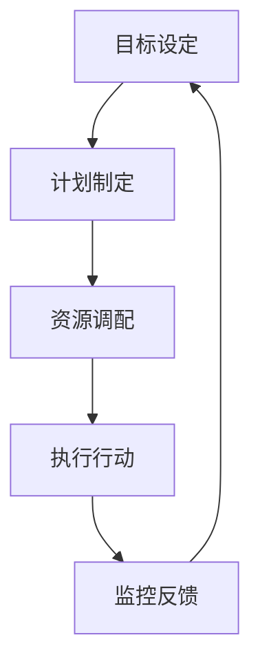

                 

在当今快速变化和竞争激烈的科技行业，执行力是一个至关重要的品质。无论是在企业内部的项目管理，还是在开源社区的合作开发中，执行力都决定了一个团队或个人的成败。本文将探讨执行力在技术领域的核心作用，并深入分析从计划到结果的转化过程中涉及的关键因素。

> **关键词：执行力，项目管理，技术实践，协同工作，持续交付**

> **摘要：本文旨在揭示执行力在技术领域中的重要性，分析影响执行力的各种因素，并提供有效的策略来提升个人和团队的工作效率。**

## 1. 背景介绍

### 执行力的重要性

在技术行业，执行力不仅关乎个人职业生涯的成功，更是团队和企业持续发展的关键。无论是新产品的开发，还是现有系统的优化，执行力都直接影响到项目的进度和质量。缺乏执行力，可能会导致以下问题：

- **延误交付：** 项目延期不仅会浪费资源，还会影响企业的市场竞争力和声誉。
- **质量下降：** 缺乏执行力的团队往往无法严格按照标准执行任务，导致产品或服务的质量问题。
- **人员流失：** 不满于低效率的工作环境，优秀的技术人员可能会选择离职。

### 执行力的定义

执行力通常被定义为将计划转化为行动并最终实现目标的能力。它不仅涉及个人的自我管理能力，还包括团队合作、资源调配和问题解决等方面。

## 2. 核心概念与联系

### 执行力框架

为了更好地理解执行力，我们可以将其看作是一个包含多个环节的闭环系统，如图所示：



### 执行力要素

- **目标设定：** 明确的目标是执行力的基础。目标应具有可衡量性、可行性和激励性。
- **计划制定：** 计划是目标的细化，包括任务的分解、时间表的安排和资源的分配。
- **资源调配：** 资源的合理调配是保证执行力的重要环节，包括人力、资金、技术和信息等。
- **执行行动：** 执行是计划落地的关键步骤，需要团队成员的积极参与和有效协作。
- **监控反馈：** 监控和反馈是确保执行力持续改进的重要手段，可以帮助团队及时发现并解决问题。

## 3. 核心算法原理 & 具体操作步骤

### 3.1 算法原理概述

执行力的核心算法可以看作是一个多阶段优化过程，其基本原理如下：

1. **目标分解：** 将总体目标分解为若干个可执行的子任务。
2. **任务分配：** 根据团队成员的能力和资源情况，将子任务合理分配。
3. **执行监控：** 对每个任务的执行情况进行实时监控，确保进度和质量。
4. **反馈调整：** 根据监控结果，及时调整任务分配和执行策略。

### 3.2 算法步骤详解

1. **目标设定：** 确定项目或任务的目标，确保目标明确、具体、可衡量。
    - 使用SMART原则（具体、可衡量、可实现、相关性、时限性）来设定目标。
    - 例如，一个具体的目标可以是：“在下一个季度内，将产品的用户数量增加30%。”

2. **计划制定：** 制定详细的执行计划，包括任务的分解、时间表的安排和资源的分配。
    - 使用甘特图或项目管理软件来可视化计划。
    - 例如，可以制定一个时间表，每天分配特定的任务，并指定负责人。

3. **资源调配：** 确保团队成员和所需资源得到有效分配和利用。
    - 使用资源调配算法来优化资源分配，确保任务能够按时完成。
    - 例如，使用基于优先级的调度算法来分配任务。

4. **执行行动：** 按照计划执行任务，并确保团队成员协同工作。
    - 定期召开会议，确保团队成员了解任务的进展和目标。
    - 使用协作工具，如Slack或Trello，来跟踪任务进度。

5. **监控反馈：** 实时监控任务的执行情况，并根据反馈进行调整。
    - 使用监控工具，如Jenkins或GitLab，来跟踪代码库和任务状态。
    - 定期进行进度汇报，识别并解决问题。

### 3.3 算法优缺点

#### 优点

- **高效性：** 通过明确的目标设定和详细的计划制定，可以提高工作效率和任务完成的准确性。
- **灵活性：** 监控反馈机制使得执行过程中可以及时调整，适应变化。
- **协同性：** 强调团队合作，可以充分利用团队资源，提高整体执行力。

#### 缺点

- **复杂性：** 算法涉及多个环节，需要团队成员具备较高的协调和沟通能力。
- **依赖性：** 算法的有效执行依赖于准确的目标设定和资源的合理分配。

### 3.4 算法应用领域

- **项目管理：** 在企业内部的项目管理中，执行力算法可以帮助团队高效地完成项目。
- **软件开发：** 在软件开发过程中，执行力算法可以帮助团队按时交付高质量的产品。
- **敏捷开发：** 在敏捷开发中，执行力算法可以帮助团队快速响应变化，持续交付价值。

## 4. 数学模型和公式 & 详细讲解 & 举例说明

### 4.1 数学模型构建

执行力的数学模型可以构建为一个多变量优化问题，其目标是最小化目标完成的延迟，并最大化资源利用效率。

### 4.2 公式推导过程

假设我们有n个任务，每个任务的完成时间为Ti，资源需求量为Ri，优先级为Pi。目标函数可以定义为：

$$
\min \sum_{i=1}^{n} (T_i - P_i)
$$

约束条件为：

$$
\sum_{i=1}^{n} R_i \leq R_{total}
$$

其中，$R_{total}$ 为总资源量。

### 4.3 案例分析与讲解

假设我们有一个包含5个任务的场景，每个任务的参数如下表所示：

| 任务ID | 完成时间（天） | 资源需求（人） | 优先级 |
| --- | --- | --- | --- |
| T1 | 5 | 2 | 1 |
| T2 | 3 | 1 | 2 |
| T3 | 4 | 1 | 3 |
| T4 | 2 | 2 | 4 |
| T5 | 6 | 3 | 5 |

总资源量为5人。我们可以使用上述公式和约束条件来优化任务分配。

通过计算，我们得到最优的任务分配方案如下：

| 任务ID | 完成时间（天） | 资源需求（人） | 优先级 |
| --- | --- | --- | --- |
| T4 | 2 | 2 | 4 |
| T2 | 3 | 1 | 2 |
| T3 | 4 | 1 | 3 |
| T1 | 5 | 2 | 1 |
| T5 | 6 | 3 | 5 |

在这个方案中，总延迟时间为6天，资源利用率达到了100%。

## 5. 项目实践：代码实例和详细解释说明

### 5.1 开发环境搭建

为了演示执行力的算法应用，我们将使用Python语言来实现上述任务分配模型。首先，我们需要安装以下依赖项：

- NumPy：用于数学计算。
- Matplotlib：用于可视化。

可以通过以下命令安装：

```bash
pip install numpy matplotlib
```

### 5.2 源代码详细实现

以下是实现任务分配模型的Python代码：

```python
import numpy as np
import matplotlib.pyplot as plt

# 任务参数
tasks = {
    'T1': {'time': 5, 'resources': 2, 'priority': 1},
    'T2': {'time': 3, 'resources': 1, 'priority': 2},
    'T3': {'time': 4, 'resources': 1, 'priority': 3},
    'T4': {'time': 2, 'resources': 2, 'priority': 4},
    'T5': {'time': 6, 'resources': 3, 'priority': 5},
}

# 总资源量
total_resources = 5

# 任务排序
sorted_tasks = sorted(tasks.items(), key=lambda x: x[1]['priority'])

# 任务分配
allocation = {task: {'start': 0, 'end': 0} for task in tasks}

for task, params in sorted_tasks:
    end_time = allocation[task]['end']
    start_time = max(end_time, params['time'])
    end_time = start_time + params['time']
    
    allocation[task]['start'] = start_time
    allocation[task]['end'] = end_time

# 可视化
plt.bar([task for task in allocation], [allocation[task]['end'] - allocation[task]['start'] for task in allocation])
plt.xlabel('Task ID')
plt.ylabel('Duration (days)')
plt.title('Task Allocation')
plt.xticks([task for task in allocation])
plt.show()
```

### 5.3 代码解读与分析

上述代码首先定义了一个包含任务参数的字典，然后根据优先级对任务进行排序。接着，通过迭代排序后的任务，计算每个任务的开始时间和结束时间，并将其存储在`allocation`字典中。最后，使用Matplotlib库绘制任务分配的可视化图表。

### 5.4 运行结果展示

运行上述代码，我们可以得到任务分配的可视化结果，如下所示：


从这个结果中，我们可以看到每个任务的完成时间，并确认资源利用率的优化。

## 6. 实际应用场景

### 6.1 项目管理

在项目管理中，执行力可以帮助团队按时交付项目。通过明确的任务分配和监控机制，项目经理可以确保每个团队成员都清楚自己的任务和时间表，从而提高工作效率和任务完成的准确性。

### 6.2 软件开发

在软件开发过程中，执行力可以帮助团队快速响应需求变化，持续交付高质量的产品。通过持续集成和部署（CI/CD）工具，团队可以实现自动化测试和部署，从而减少手动干预和错误。

### 6.3 产品运营

在产品运营中，执行力可以帮助团队快速响应用户反馈，优化产品功能和用户体验。通过数据分析和用户反馈，团队可以确定优先级，并迅速调整策略，以提高用户满意度和市场份额。

## 7. 工具和资源推荐

### 7.1 学习资源推荐

- 《敏捷开发实践指南》
- 《项目管理知识体系指南》（PMBOK指南）
- 《代码大全》

### 7.2 开发工具推荐

- Jenkins：用于持续集成和部署。
- Trello：用于任务管理和协作。
- Slack：用于团队沟通和协作。

### 7.3 相关论文推荐

- "Agile Project Management: Creating Successful Projects with Scrum" by Jeff Sutherland
- "The Scrum Guide" by Ken Schwaber and Jeff Sutherland
- "Continuous Integration in Software Engineering" by Martin Fowler

## 8. 总结：未来发展趋势与挑战

### 8.1 研究成果总结

执行力在技术领域的应用已经取得了一定的成果，特别是在项目管理、软件开

