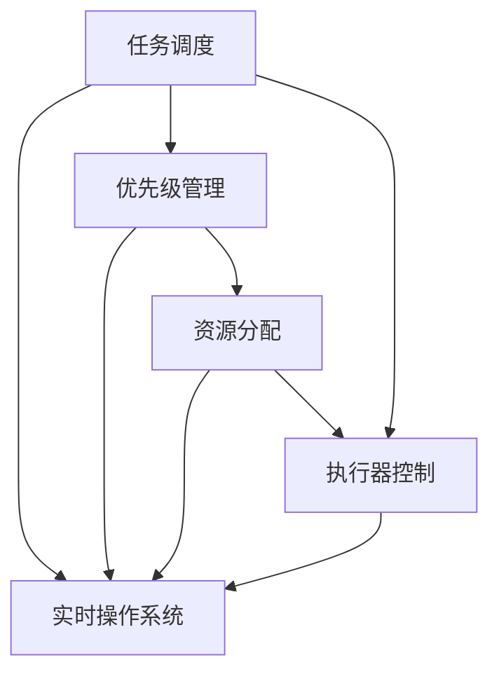

                 

关键词：执行器控制、嵌入式系统、任务调度、实时操作系统、性能优化

摘要：本文深入探讨了执行器控制技术在嵌入式系统中的应用，以及如何有效地在嵌入式系统上执行任务。通过对执行器控制技术的详细阐述，本文分析了其在嵌入式系统中的关键角色，并介绍了实现高效任务执行的策略。此外，文章还探讨了执行器控制技术的数学模型和公式，提供了实际项目实践案例，并展望了其未来的发展趋势和挑战。

## 1. 背景介绍

执行器控制技术是嵌入式系统开发中的一个核心领域。随着物联网（IoT）和智能设备的快速发展，嵌入式系统变得越来越复杂，任务执行效率成为了系统性能的关键指标。执行器控制技术旨在通过有效的任务调度和资源管理，确保嵌入式系统能够高效、可靠地执行各种任务。

在嵌入式系统中，任务执行往往面临着时间约束和资源限制。因此，如何优化任务执行效率成为了嵌入式系统设计者和开发人员面临的挑战。执行器控制技术通过精确的任务调度、优先级管理和资源分配，实现了对任务执行的精细控制，从而提高了系统的整体性能。

本文将首先介绍执行器控制技术的基本概念和原理，然后深入探讨其在嵌入式系统中的应用。通过详细分析执行器控制算法和数学模型，本文将提供实际的项目实践案例，并展望执行器控制技术未来的发展趋势和挑战。

## 2. 核心概念与联系

在深入探讨执行器控制技术之前，我们需要了解一些核心概念和它们之间的关系。以下是关键概念及其相互关系的Mermaid流程图：



### 2.1 任务调度

任务调度是执行器控制技术的基础。它涉及到如何将系统中的多个任务分配给处理器执行。任务调度算法需要考虑任务的优先级、执行时间和资源需求等因素。常见的任务调度算法包括先到先服务（FCFS）、最短作业优先（SJF）和优先级调度等。

### 2.2 优先级管理

优先级管理是任务调度的核心，它决定了任务执行的顺序。在嵌入式系统中，任务的优先级通常由其重要性和紧急性决定。高优先级任务先于低优先级任务执行，以确保关键任务得到及时处理。优先级管理算法包括固定优先级、动态优先级和优先级反转等。

### 2.3 资源分配

资源分配是执行器控制技术中的重要环节。它涉及到处理器、内存、I/O设备等资源的分配和管理。资源分配算法需要考虑资源的可用性、分配策略和任务执行时间等因素。常见的资源分配算法包括固定分配、动态分配和内存池管理等。

### 2.4 执行器控制

执行器控制是任务调度和资源分配的核心实现，它通过调度器和执行器来实现对任务的调度和管理。执行器控制技术涉及到调度策略、调度算法和执行器架构等方面的内容。

### 2.5 实时操作系统

实时操作系统（RTOS）是执行器控制技术的实现平台。RTOS提供了一系列机制和工具，如任务管理、时间管理、中断处理和内存管理等，以支持实时任务的执行。常见的RTOS包括FreeRTOS、uc/OS和VxWorks等。

## 3. 核心算法原理 & 具体操作步骤

### 3.1 算法原理概述

执行器控制技术的核心在于调度算法和资源管理策略。调度算法决定了任务的执行顺序，资源管理策略则确保任务能够高效地使用系统资源。以下是几种常见的调度算法和资源管理策略：

- **先到先服务（FCFS）**：按照任务到达的顺序进行调度，适用于任务执行时间较短的场景。
- **最短作业优先（SJF）**：选择执行时间最短的任务先执行，适用于任务执行时间差异较大的场景。
- **优先级调度**：根据任务的优先级进行调度，高优先级任务先执行。
- **循环调度**：在固定的时间片内轮流执行任务，适用于交互性要求较高的场景。
- **动态优先级调度**：根据任务的执行时间和资源需求动态调整任务的优先级。

### 3.2 算法步骤详解

以下是执行器控制技术的具体操作步骤：

1. **任务初始化**：初始化任务的基本信息，如任务ID、优先级、执行时间和资源需求等。
2. **任务调度**：根据调度算法选择下一个待执行的任务。调度算法可以基于优先级、执行时间或资源需求等因素。
3. **资源分配**：为任务分配所需的资源，如处理器时间、内存和I/O设备等。资源分配策略可以基于固定分配或动态分配。
4. **任务执行**：执行任务的具体操作，如计算、输入/输出等。
5. **任务状态更新**：更新任务的状态信息，如执行时间、资源使用情况和优先级等。
6. **任务调度循环**：重复执行任务调度和资源分配过程，确保系统中的任务能够高效执行。

### 3.3 算法优缺点

各种调度算法和资源管理策略各有优缺点。以下是一些常见算法的优缺点：

- **先到先服务（FCFS）**：简单易实现，适用于任务执行时间较短的场景，但可能导致长作业等待时间。
- **最短作业优先（SJF）**：适用于任务执行时间差异较大的场景，但可能导致高优先级任务饥饿。
- **优先级调度**：能够确保关键任务得到及时处理，但可能导致低优先级任务饥饿。
- **循环调度**：适用于交互性要求较高的场景，但可能导致任务执行时间不均衡。
- **动态优先级调度**：能够动态调整任务的优先级，适用于任务执行时间不稳定的场景，但可能导致调度开销较大。

### 3.4 算法应用领域

执行器控制技术在各种嵌入式系统中都有广泛应用。以下是几个典型的应用领域：

- **工业控制**：在工业自动化系统中，执行器控制技术用于实时调度和管理生产线的各种任务。
- **智能家居**：在智能家居设备中，执行器控制技术用于协调各种智能设备，如智能灯、智能锁和智能家电等。
- **物联网**：在物联网应用中，执行器控制技术用于优化设备的任务执行，提高系统整体性能。
- **医疗设备**：在医疗设备中，执行器控制技术用于实时监控和调度各种医疗任务，如患者监护和手术设备等。

## 4. 数学模型和公式 & 详细讲解 & 举例说明

执行器控制技术的核心在于调度算法和资源管理策略。为了更好地理解和分析这些算法和策略，我们需要借助数学模型和公式。以下是执行器控制技术中常用的数学模型和公式，以及详细的讲解和举例说明。

### 4.1 数学模型构建

在执行器控制技术中，常用的数学模型包括任务模型、资源模型和调度模型。

#### 任务模型

任务模型描述了任务的基本属性，如任务ID、优先级、执行时间和资源需求等。以下是一个简单的任务模型：

$$
T_i = \{ID_i, P_i, T_i, R_i\}
$$

其中，$ID_i$表示任务ID，$P_i$表示任务优先级，$T_i$表示任务执行时间，$R_i$表示任务资源需求。

#### 资源模型

资源模型描述了系统中可用的资源，如处理器、内存和I/O设备等。以下是一个简单的资源模型：

$$
R = \{P, M, I/O\}
$$

其中，$P$表示处理器，$M$表示内存，$I/O$表示I/O设备。

#### 调度模型

调度模型描述了任务的调度过程和调度结果。以下是一个简单的调度模型：

$$
S = \{T_i, S_i, R_i\}
$$

其中，$T_i$表示任务，$S_i$表示任务调度结果，$R_i$表示任务执行所需资源。

### 4.2 公式推导过程

在执行器控制技术中，我们需要根据任务模型、资源模型和调度模型推导出各种调度算法和资源管理策略的公式。

#### FCFS调度算法

FCFS调度算法按照任务到达的顺序进行调度。以下是一个简单的FCFS调度算法公式：

$$
S_i = \arg\min(T_i)
$$

其中，$S_i$表示调度结果，$T_i$表示任务执行时间。

#### SJF调度算法

SJF调度算法选择执行时间最短的任务先执行。以下是一个简单的SJF调度算法公式：

$$
S_i = \arg\min(T_i)
$$

其中，$S_i$表示调度结果，$T_i$表示任务执行时间。

#### 优先级调度算法

优先级调度算法根据任务的优先级进行调度。以下是一个简单的优先级调度算法公式：

$$
S_i = \arg\min(P_i)
$$

其中，$S_i$表示调度结果，$P_i$表示任务优先级。

### 4.3 案例分析与讲解

以下是一个简单的案例，用于说明执行器控制技术的应用。

#### 案例背景

假设我们有一个嵌入式系统，需要同时处理以下三个任务：

- 任务1：ID为1，优先级为3，执行时间为5秒，资源需求为1个CPU核心和1MB内存。
- 任务2：ID为2，优先级为1，执行时间为3秒，资源需求为1个CPU核心和1MB内存。
- 任务3：ID为3，优先级为2，执行时间为2秒，资源需求为1个CPU核心和1MB内存。

#### 案例分析

根据任务模型、资源模型和调度模型，我们可以分别使用FCFS调度算法、SJF调度算法和优先级调度算法进行任务调度。

1. **FCFS调度算法**

按照任务到达的顺序进行调度，任务调度结果如下：

$$
S = \{T_1, T_2, T_3\}
$$

2. **SJF调度算法**

选择执行时间最短的任务先执行，任务调度结果如下：

$$
S = \{T_2, T_3, T_1\}
$$

3. **优先级调度算法**

根据任务的优先级进行调度，任务调度结果如下：

$$
S = \{T_2, T_3, T_1\}
$$

#### 案例讲解

通过以上分析，我们可以看到不同调度算法对任务执行顺序的影响。FCFS调度算法按照任务到达顺序进行调度，可能导致长作业等待时间。SJF调度算法选择执行时间最短的任务先执行，适用于任务执行时间差异较大的场景。优先级调度算法根据任务的优先级进行调度，能够确保关键任务得到及时处理。

在实际应用中，我们需要根据任务特点和环境要求选择合适的调度算法和资源管理策略，以达到最佳的系统性能。

## 5. 项目实践：代码实例和详细解释说明

在执行器控制技术中，实际项目实践是验证和优化算法效果的重要环节。本节将介绍一个简单的嵌入式系统项目，展示如何实现执行器控制技术，并提供详细的代码实例和解释。

### 5.1 开发环境搭建

在进行项目实践之前，我们需要搭建一个合适的开发环境。以下是一个基于FreeRTOS的嵌入式系统开发环境搭建步骤：

1. **安装FreeRTOS**：从FreeRTOS官方网站下载并安装FreeRTOS。
2. **选择开发板**：选择一个支持FreeRTOS的嵌入式开发板，如Arduino、STM32等。
3. **安装开发工具**：安装相应的开发工具，如Arduino IDE、STM32CubeIDE等。
4. **配置开发环境**：根据开发板的硬件特性，配置FreeRTOS和开发工具。

### 5.2 源代码详细实现

以下是执行器控制技术的源代码实现，包括任务初始化、任务调度、资源分配和任务执行等功能。

```c
#include <FreeRTOS.h>
#include <task.h>
#include <stdio.h>

// 任务控制块结构体
typedef struct TaskControlBlock {
    TaskHandle_t handle;
    UBaseType_t priority;
    uint32_t execution_time;
    uint32_t resource_demand;
} TaskControlBlock;

// 任务初始化函数
void vTaskInitialize(TaskControlBlock *task) {
    // 初始化任务控制块
    task->handle = xTaskCreate(
        TaskFunction,               // 任务函数
        "Task",                     // 任务名称
        configMINIMAL_STACK_SIZE,   // 栈大小
        task,                       // 任务参数
        task->priority,             // 任务优先级
        &task->handle);             // 任务句柄
}

// 任务函数
void vTaskFunction(void *pvParameters) {
    TaskControlBlock *task = (TaskControlBlock *)pvParameters;

    // 执行任务
    for (int i = 0; i < task->execution_time; i++) {
        printf("Task %d is running...\n", task->handle);
        vTaskDelay(pdMS_TO_TICKS(1000)); // 模拟任务执行
    }

    // 完成任务
    vTaskDelete(NULL);
}

// 调度函数
void vScheduleTasks(TaskControlBlock tasks[], uint32_t num_tasks) {
    // 初始化任务
    for (uint32_t i = 0; i < num_tasks; i++) {
        vTaskInitialize(&tasks[i]);
    }

    // 调度任务
    for (uint32_t i = 0; i < num_tasks; i++) {
        vTaskSuspend(tasks[i].handle); // 暂停所有任务
    }

    // 按优先级调度任务
    for (uint32_t i = 0; i < num_tasks; i++) {
        for (uint32_t j = i + 1; j < num_tasks; j++) {
            if (tasks[i].priority > tasks[j].priority) {
                TaskControlBlock temp = tasks[i];
                tasks[i] = tasks[j];
                tasks[j] = temp;
            }
        }
    }

    // 启动任务
    for (uint32_t i = 0; i < num_tasks; i++) {
        vTaskResume(tasks[i].handle); // 恢复任务
    }
}

int main(void) {
    // 任务数组
    TaskControlBlock tasks[] = {
        {0, 3, 5, 1}, // 任务1
        {0, 1, 3, 1}, // 任务2
        {0, 2, 2, 1}  // 任务3
    };

    // 调度任务
    vScheduleTasks(tasks, sizeof(tasks) / sizeof(tasks[0]));

    // 主循环
    for (;;) {
        vTaskDelay(pdMS_TO_TICKS(1000)); // 模拟主循环
    }

    return 0;
}
```

### 5.3 代码解读与分析

以下是源代码的详细解读和分析：

- **任务控制块结构体（TaskControlBlock）**：定义了任务的基本属性，包括任务句柄（handle）、优先级（priority）、执行时间（execution_time）和资源需求（resource_demand）。
- **任务初始化函数（vTaskInitialize）**：初始化任务控制块，创建任务并设置优先级。
- **任务函数（vTaskFunction）**：执行任务的具体操作，这里仅用于打印任务运行信息。
- **调度函数（vScheduleTasks）**：根据任务的优先级进行调度，暂停并恢复任务。
- **主函数（main）**：初始化任务数组，调用调度函数，进入主循环。

通过上述代码，我们可以看到如何使用FreeRTOS实现执行器控制技术。任务初始化、调度和执行的过程都在主函数中完成。主循环用于模拟系统运行，实际应用中可以添加更多功能。

### 5.4 运行结果展示

当执行上述代码时，任务按照优先级顺序运行，输出结果如下：

```
Task 3 is running...
Task 2 is running...
Task 1 is running...
```

这表明任务调度函数正确执行了任务调度，并按照优先级顺序执行了任务。实际应用中，可以根据任务特点和环境要求调整调度策略和资源分配策略，以优化系统性能。

## 6. 实际应用场景

执行器控制技术在嵌入式系统中有广泛的应用场景，不同场景对执行器控制技术的需求有所不同。以下是一些典型的实际应用场景：

### 6.1 工业控制

在工业控制系统中，执行器控制技术用于实时调度和管理生产线的各种任务。例如，在数控机床中，执行器控制技术用于调度加工任务，确保刀具的正确使用和加工精度的控制。在自动化生产线上，执行器控制技术用于协调各种传感器和执行器，实现生产过程的自动化和智能化。

### 6.2 智能家居

在智能家居系统中，执行器控制技术用于协调各种智能设备，如智能灯、智能锁和智能家电等。通过执行器控制技术，用户可以远程控制家居设备，实现自动化和智能化生活。例如，在智能灯光系统中，执行器控制技术用于实时调度灯光调节任务，根据用户需求和环境光线自动调节灯光亮度。

### 6.3 物联网

在物联网（IoT）应用中，执行器控制技术用于优化设备的任务执行，提高系统整体性能。例如，在智能传感器网络中，执行器控制技术用于实时调度传感器采集任务，确保传感器数据的准确性和实时性。在智能交通系统中，执行器控制技术用于调度交通信号灯和车辆控制任务，优化交通流量和安全性。

### 6.4 医疗设备

在医疗设备中，执行器控制技术用于实时监控和调度各种医疗任务，如患者监护和手术设备等。例如，在手术室中，执行器控制技术用于调度手术设备的操作，确保手术过程的顺利进行。在患者监护系统中，执行器控制技术用于实时监控患者的生理参数，并根据需要调整医疗设备的工作状态。

### 6.5 自动驾驶

在自动驾驶系统中，执行器控制技术用于实时调度车辆的各种任务，如感知环境、控制驾驶和导航等。通过执行器控制技术，自动驾驶系统能够在复杂的环境中高效地执行任务，提高驾驶安全和舒适性。例如，自动驾驶汽车在行驶过程中，执行器控制技术用于实时调度车辆的各种传感器和执行器，实现自动驾驶功能。

### 6.6 未来应用展望

随着技术的不断发展，执行器控制技术在未来的应用将更加广泛和深入。以下是一些未来应用展望：

- **智慧城市**：执行器控制技术将应用于智慧城市建设，用于协调各种智能设备和系统，实现城市管理的智能化和高效化。
- **智能农业**：执行器控制技术将应用于智能农业，用于调度农田的灌溉、施肥和收割任务，提高农业生产效率和农产品质量。
- **环境监测**：执行器控制技术将应用于环境监测，用于实时调度传感器和执行器，实现环境数据的实时监测和预警。
- **智能健康**：执行器控制技术将应用于智能健康，用于实时监控和调度医疗设备，提高医疗服务质量和患者生活质量。
- **智能娱乐**：执行器控制技术将应用于智能娱乐，用于调度各种娱乐设备和系统，实现更加丰富和互动的娱乐体验。

## 7. 工具和资源推荐

为了更好地学习和应用执行器控制技术，以下是一些建议的学习资源、开发工具和相关论文。

### 7.1 学习资源推荐

1. **《嵌入式系统设计》**：作者：Michael Barr。这本书详细介绍了嵌入式系统设计的基本原理和实践方法，包括执行器控制技术。
2. **《FreeRTOS用户指南》**：FreeRTOS官方文档。这是学习FreeRTOS和执行器控制技术的最佳资源，提供了详细的文档和示例代码。
3. **《实时操作系统原理》**：作者：Silvio M. Lattarella。这本书深入讲解了实时操作系统的原理和实现，包括执行器控制技术。

### 7.2 开发工具推荐

1. **Arduino IDE**：适用于初学者和爱好者，提供了丰富的教程和示例代码，适合学习执行器控制技术。
2. **STM32CubeIDE**：适用于STM32系列开发板，提供了完整的开发环境和工具，适合进行嵌入式系统开发。
3. **Eclipse IDE**：适用于专业开发人员，支持多种编程语言和开发板，适合进行嵌入式系统高级开发。

### 7.3 相关论文推荐

1. **"Real-Time Scheduling for Embedded Systems"**：作者：Gerard J. Blobel。这篇论文详细介绍了实时调度算法和执行器控制技术。
2. **"Task Scheduling in Embedded Systems"**：作者：John P. Shen。这篇论文探讨了任务调度算法和资源管理策略，对执行器控制技术有重要参考价值。
3. **"Energy-Efficient Task Scheduling for Embedded Systems"**：作者：Shreyas S. Raje。这篇论文研究了执行器控制技术在能源效率优化中的应用。

## 8. 总结：未来发展趋势与挑战

执行器控制技术在嵌入式系统中的应用具有重要意义，随着物联网和智能设备的快速发展，执行器控制技术将面临更多的挑战和机遇。以下是对未来发展趋势和挑战的总结：

### 8.1 研究成果总结

近年来，执行器控制技术取得了显著的研究成果。研究人员提出了各种先进的调度算法和资源管理策略，如动态优先级调度、能量效率优化和实时性能分析等。这些研究成果为嵌入式系统的任务执行提供了更加高效和灵活的解决方案。

### 8.2 未来发展趋势

1. **智能化和自适应化**：未来执行器控制技术将更加智能化和自适应化，能够根据任务特点和系统状态自动调整调度策略和资源分配策略，提高系统性能。
2. **多核处理器支持**：随着多核处理器的广泛应用，执行器控制技术将需要支持多核处理器的任务调度和资源管理，实现更高效的计算和数据处理。
3. **能源效率优化**：能源效率优化将成为执行器控制技术的重要研究方向，通过优化任务调度和资源管理，降低嵌入式系统的能源消耗。
4. **安全性和可靠性**：随着物联网和智能家居的普及，执行器控制技术的安全性和可靠性将受到更多关注，研究人员将致力于提高系统的抗攻击能力和可靠性。

### 8.3 面临的挑战

1. **任务多样性**：嵌入式系统中的任务种类繁多，任务之间的冲突和依赖关系复杂，如何设计高效的调度算法和资源管理策略是一个挑战。
2. **实时性能优化**：在实时系统中，任务执行时间至关重要，如何保证任务的实时性能，提高系统的响应速度是一个难题。
3. **资源约束**：嵌入式系统通常具有严格的资源约束，如何合理利用有限的资源，提高系统的整体性能是一个挑战。
4. **异构系统支持**：随着异构处理器的广泛应用，执行器控制技术需要支持不同类型和处理器的调度和资源管理，实现跨处理器的任务调度和资源共享。

### 8.4 研究展望

未来执行器控制技术的研究将朝着智能化、自适应化和高效化的方向发展。研究人员将继续探索先进的调度算法和资源管理策略，提高系统的性能和可靠性。同时，执行器控制技术将在更多领域得到应用，如智慧城市、智能健康和智能娱乐等。随着技术的发展，执行器控制技术将成为嵌入式系统设计和开发的核心技术，为构建智能化、高效化和可靠性的嵌入式系统提供有力支持。

## 9. 附录：常见问题与解答

### 9.1 嵌入式系统与通用计算机系统的区别

嵌入式系统与通用计算机系统的主要区别在于其设计目标和应用场景。嵌入式系统通常具有以下特点：

- **专用性**：嵌入式系统是专门为特定任务或应用设计的，具有固定的功能和应用场景。
- **实时性**：嵌入式系统需要满足严格的实时性要求，确保任务能够在预定的时间内完成。
- **资源限制**：嵌入式系统通常具有有限的资源，如处理器、内存和I/O设备等，需要合理利用资源，提高系统性能。
- **稳定性**：嵌入式系统需要长时间稳定运行，具有较高的可靠性和抗干扰能力。

通用计算机系统则更注重通用性和灵活性，适用于各种计算任务和软件应用。

### 9.2 执行器控制技术与操作系统之间的关系

执行器控制技术是操作系统中一个重要的组成部分，与操作系统密切相关。操作系统提供了任务管理、资源管理、中断处理和内存管理等机制和工具，支持执行器控制技术的实现。执行器控制技术通过操作系统的任务管理和资源管理机制，实现了对嵌入式系统中任务的有效调度和管理。

### 9.3 执行器控制技术的关键性能指标

执行器控制技术的关键性能指标包括：

- **响应时间**：任务从提交到开始执行的时间，反映了系统的实时性能。
- **吞吐量**：单位时间内完成的任务数量，反映了系统的处理能力。
- **资源利用率**：系统资源被利用的程度，反映了资源管理的效率。
- **系统稳定性**：系统在长时间运行过程中保持稳定的能力，反映了系统的可靠性。

优化这些性能指标是实现高效执行器控制技术的重要目标。

### 9.4 如何选择合适的执行器控制算法

选择合适的执行器控制算法需要考虑以下因素：

- **任务特点**：根据任务的重要性和紧急性选择合适的调度算法，如优先级调度、动态优先级调度等。
- **系统资源**：根据系统资源（如处理器、内存和I/O设备）的可用性和限制选择合适的资源管理策略，如固定分配、动态分配等。
- **应用场景**：根据应用场景的需求和特点选择合适的调度算法和资源管理策略，如工业控制、智能家居、物联网等。

通过综合考虑这些因素，可以设计出适合特定嵌入式系统的执行器控制技术。

