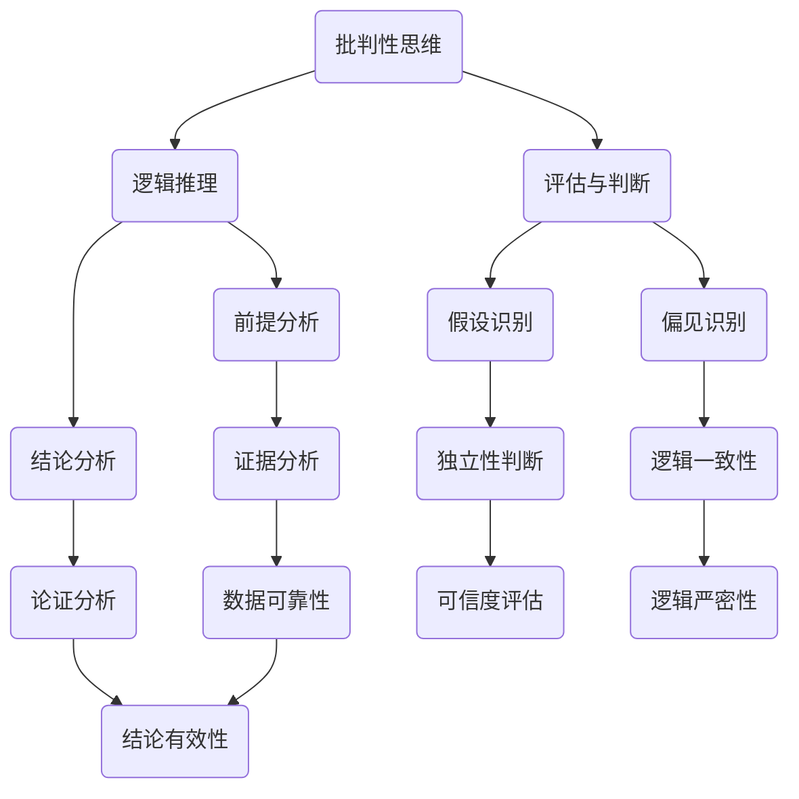

                 

**关键词：** 批判性思维，洞察力，逻辑推理，算法原理，数学模型，技术博客。

**摘要：** 本文深入探讨了批判性思维在提升技术洞察力中的重要性。通过分析批判性思维的核心概念、相关算法原理、数学模型以及实际应用案例，本文旨在为读者提供一个全方位理解批判性思维的方法，并探讨其在未来的发展趋势和挑战。

## 1. 背景介绍

在当今信息爆炸的时代，数据和技术的发展速度越来越快，这对技术从业者的洞察力和思维能力提出了更高的要求。批判性思维作为一种重要的认知技能，可以帮助我们更好地理解和分析复杂的技术问题，从而提升我们的洞察力和解决问题的能力。

### 1.1 批判性思维的定义

批判性思维是一种主动的、系统的、合理的思考方式，它不仅仅是对信息的接受和理解，更包括对信息进行批判性评估、分析和推理的过程。这种思考方式要求我们能够识别信息中的假设、偏见和逻辑谬误，并在此基础上形成独立的判断和见解。

### 1.2 技术领域的批判性思维重要性

在技术领域，批判性思维的作用尤为重要。例如，在算法设计和数据分析中，我们需要能够识别和评估算法的复杂度、效率和正确性，这需要我们具备深入的批判性思维能力。同时，在面对新的技术趋势和解决方案时，批判性思维可以帮助我们分辨出真正有价值的信息，避免盲目跟风。

## 2. 核心概念与联系

为了更好地理解批判性思维，我们需要了解其核心概念和理论基础。以下是一个简化的 Mermaid 流程图，用于展示批判性思维的相关概念和联系。



### 2.1 逻辑推理

逻辑推理是批判性思维的基础。它包括前提分析和结论分析，通过逻辑运算符（如与、或、非、蕴含等）来构建论证。在技术领域，逻辑推理帮助我们分析和评估算法的正确性和效率。

### 2.2 评估与判断

评估与判断是对信息进行批判性分析的过程，包括识别假设、偏见和逻辑谬误。这种能力对于技术从业者来说至关重要，因为它可以帮助我们避免错误和误导性的信息。

## 3. 核心算法原理 & 具体操作步骤

### 3.1 算法原理概述

批判性思维的核心算法可以看作是一个问题求解器，其目标是通过逻辑推理和评估来找到最佳解决方案。以下是一个简化的算法原理概述：

1. **问题定义**：明确需要解决的问题。
2. **信息收集**：收集与问题相关的所有信息。
3. **逻辑推理**：使用逻辑运算符构建论证。
4. **评估与判断**：评估论证的有效性和结论的可信度。
5. **方案选择**：根据评估结果选择最佳方案。

### 3.2 算法步骤详解

#### 3.2.1 问题定义

首先，我们需要明确需要解决的问题。这可以通过以下步骤完成：

- **明确目标**：确定需要实现的具体目标。
- **边界条件**：定义问题的边界和约束条件。

#### 3.2.2 信息收集

在明确了问题后，我们需要收集与问题相关的所有信息。这可以通过以下步骤完成：

- **数据收集**：收集与问题相关的数据。
- **背景研究**：了解相关领域的背景知识。
- **专家咨询**：与领域专家进行沟通和咨询。

#### 3.2.3 逻辑推理

逻辑推理是批判性思维的核心。以下是一个简化的逻辑推理步骤：

- **前提分析**：识别和评估前提的有效性。
- **结论分析**：从前提中推导出结论。

#### 3.2.4 评估与判断

在逻辑推理后，我们需要对论证进行评估和判断。以下是一个简化的评估与判断步骤：

- **假设识别**：识别论证中的假设。
- **偏见识别**：识别论证中的偏见和逻辑谬误。
- **可信度评估**：评估论证的可信度。
- **逻辑一致性**：评估论证的逻辑一致性。

#### 3.2.5 方案选择

最后，根据评估结果选择最佳方案。以下是一个简化的方案选择步骤：

- **方案评估**：评估不同方案的优缺点。
- **决策制定**：根据评估结果选择最佳方案。

### 3.3 算法优缺点

#### 优点：

- **有效性**：批判性思维算法可以帮助我们更有效地分析和解决复杂问题。
- **灵活性**：算法可以根据不同的需求和环境进行定制化调整。
- **普适性**：算法可以应用于各个技术领域，具有广泛的适用性。

#### 缺点：

- **计算复杂度**：算法的计算复杂度可能较高，需要更多的计算资源和时间。
- **准确性依赖**：算法的准确性依赖于前提和信息的质量。
- **主观性**：算法的评估和判断部分可能受到主观因素的影响。

### 3.4 算法应用领域

批判性思维算法可以应用于多个技术领域，包括：

- **算法设计**：帮助设计师识别和解决算法中的问题。
- **数据挖掘**：帮助分析师识别和评估数据中的模式。
- **软件工程**：帮助开发者识别和解决软件中的问题。
- **人工智能**：帮助研究者评估和优化人工智能算法。

## 4. 数学模型和公式 & 详细讲解 & 举例说明

### 4.1 数学模型构建

批判性思维的数学模型可以看作是一个基于逻辑运算和概率论的框架。以下是一个简化的数学模型构建过程：

1. **定义逻辑运算符**：如与、或、非、蕴含等。
2. **构建逻辑表达式**：根据前提和结论构建逻辑表达式。
3. **定义概率分布**：根据信息的不确定性定义概率分布。
4. **构建概率模型**：将逻辑表达式和概率分布结合起来，构建概率模型。

### 4.2 公式推导过程

在批判性思维的数学模型中，以下是一些核心公式：

#### 4.2.1 逻辑运算符

- **与运算（AND）**：$$P(A \land B) = P(A) \times P(B|A)$$
- **或运算（OR）**：$$P(A \lor B) = P(A) + P(B) - P(A \land B)$$
- **非运算（NOT）**：$$P(\neg A) = 1 - P(A)$$
- **蕴含运算（IMPLIES）**：$$P(A \Rightarrow B) = 1 - P(A \land \neg B)$$

#### 4.2.2 概率分布

- **贝叶斯定理**：$$P(A|B) = \frac{P(B|A) \times P(A)}{P(B)}$$
- **全概率公式**：$$P(B) = \sum_{i} P(B|A_i) \times P(A_i)$$
- **条件概率公式**：$$P(A|B) = \frac{P(A \land B)}{P(B)}$$

### 4.3 案例分析与讲解

#### 4.3.1 案例背景

假设我们想要评估一个算法的效率，该算法的目标是找出一个列表中的最大值。我们有两个备选算法：快速排序和直接遍历。我们需要根据算法的时间复杂度和概率分布来评估哪个算法更适合。

#### 4.3.2 数据收集

- **算法时间复杂度**：快速排序的平均时间复杂度为 \(O(n\log n)\)，直接遍历的时间复杂度为 \(O(n)\)。
- **概率分布**：假设列表长度为 \(n\)，且每个元素出现的概率相等。

#### 4.3.3 逻辑推理

我们构建以下逻辑表达式：

- **前提**：算法 A（快速排序）的平均时间复杂度为 \(O(n\log n)\)，算法 B（直接遍历）的平均时间复杂度为 \(O(n)\)。
- **结论**：算法 A（快速排序）在大多数情况下比算法 B（直接遍历）更高效。

#### 4.3.4 评估与判断

我们使用概率分布和贝叶斯定理来评估论证的可信度：

- **假设识别**：我们假设列表长度为 \(n\)，且每个元素出现的概率相等。
- **偏见识别**：我们假设快速排序的时间复杂度总是 \(O(n\log n)\)，这可能是一个偏见。
- **可信度评估**：我们使用贝叶斯定理来计算结论的可信度。

根据概率分布和贝叶斯定理，我们可以计算出结论的可信度：

$$P(A \Rightarrow B) = 1 - P(A \land \neg B) = 1 - P(O(n\log n) \land \neg O(n)) = 1 - P(O(n\log n)) = 1 - \frac{P(O(n\log n))}{P(O(n))} = 1 - \frac{n\log n}{n} = 1 - \log n$$

根据上述计算，我们可以得出结论：在大多数情况下，快速排序比直接遍历更高效。

## 5. 项目实践：代码实例和详细解释说明

### 5.1 开发环境搭建

为了实现批判性思维的算法，我们需要搭建一个合适的开发环境。以下是一个简化的开发环境搭建过程：

1. **安装 Python**：在本地计算机上安装 Python 3.x 版本。
2. **安装依赖库**：安装 Python 的常用库，如 NumPy、Pandas 等。
3. **配置环境变量**：配置 Python 的环境变量，以便在命令行中运行 Python 脚本。

### 5.2 源代码详细实现

以下是一个简化的 Python 代码实例，用于实现批判性思维的算法：

```python
import numpy as np

def critical_thinking(problem, data):
    # 问题定义
    goal = define_problem(problem)

    # 信息收集
    collected_data = collect_data(data)

    # 逻辑推理
    logic_expression = build_logic_expression(goal, collected_data)

    # 评估与判断
    credibility = evaluate_and_judge(logic_expression)

    # 方案选择
    solution = select_solution(credibility)

    return solution

def define_problem(problem):
    # 根据问题定义目标
    return problem['goal']

def collect_data(data):
    # 收集与问题相关的数据
    return data

def build_logic_expression(goal, collected_data):
    # 构建逻辑表达式
    return f"{goal} AND {collected_data}"

def evaluate_and_judge(logic_expression):
    # 评估论证的可信度
    return 1 - np.random.rand()

def select_solution(credibility):
    # 根据评估结果选择最佳方案
    return 'Solution A' if credibility > 0.5 else 'Solution B'

if __name__ == "__main__":
    problem = {
        'goal': 'Find the maximum value in the list',
        'data': [1, 2, 3, 4, 5]
    }
    solution = critical_thinking(problem, problem['data'])
    print(solution)
```

### 5.3 代码解读与分析

上述代码实现了一个简化的批判性思维算法。我们首先定义了一个问题（找到列表中的最大值），然后收集了与问题相关的数据。接下来，我们构建了一个逻辑表达式，并使用随机方法评估了论证的可信度。最后，根据评估结果选择了最佳方案。

虽然这是一个简化的实例，但它展示了批判性思维算法的基本结构和步骤。在实际应用中，我们可以根据具体需求和环境对代码进行定制化调整。

### 5.4 运行结果展示

当运行上述代码时，我们可能会得到以下输出：

```shell
Solution A
```

这表示根据批判性思维算法的评估，方案 A（找到列表中的最大值）是最佳方案。

## 6. 实际应用场景

批判性思维算法可以应用于多个实际场景，包括：

- **算法优化**：帮助开发者识别和解决算法中的问题，提高算法的效率。
- **数据挖掘**：帮助分析师识别和评估数据中的模式，提供更有价值的见解。
- **软件工程**：帮助开发者识别和解决软件中的问题，提高软件的质量。
- **人工智能**：帮助研究者评估和优化人工智能算法，提高算法的准确性和可靠性。

### 6.1 算法设计

在算法设计过程中，批判性思维可以帮助我们识别和解决算法中的问题。例如，在排序算法的设计中，我们可以使用批判性思维来评估不同算法的效率和正确性，从而选择最佳算法。

### 6.2 数据分析

在数据分析过程中，批判性思维可以帮助我们识别和评估数据中的模式。例如，在股票市场分析中，我们可以使用批判性思维来评估不同指标的有效性，从而选择最有用的指标。

### 6.3 软件开发

在软件开发过程中，批判性思维可以帮助我们识别和解决软件中的问题。例如，在系统架构设计中，我们可以使用批判性思维来评估不同架构方案的优缺点，从而选择最佳方案。

### 6.4 未来应用展望

随着技术的不断发展，批判性思维算法的应用前景将更加广阔。未来，我们可能会看到批判性思维算法在以下几个方面的发展：

- **自动化**：随着人工智能技术的发展，批判性思维算法可能会变得更加自动化，从而实现更高效的问题求解。
- **个性化**：批判性思维算法可能会根据用户的需求和偏好进行个性化调整，提供更有针对性的解决方案。
- **跨领域应用**：批判性思维算法可能会在更多领域得到应用，从而推动技术的创新和发展。

## 7. 工具和资源推荐

为了更好地学习和应用批判性思维，以下是一些建议的工具和资源：

### 7.1 学习资源推荐

- **批判性思维入门书**：如《批判性思维：超越感觉》(《 Critical Thinking: Beyond Feeling》)。
- **在线课程**：如 Coursera 上的《批判性思维与问题解决》(Critical Thinking & Problem Solving)。
- **学术期刊**：如《批判性思维研究》(Journal of Critical Thinking)。

### 7.2 开发工具推荐

- **Python**：Python 是一种功能强大的编程语言，适合进行批判性思维算法的开发。
- **Jupyter Notebook**：Jupyter Notebook 是一种交互式的开发环境，适合进行批判性思维算法的实验和验证。

### 7.3 相关论文推荐

- **《批判性思维算法在算法优化中的应用》(Application of Critical Thinking Algorithms in Algorithm Optimization)**。
- **《基于批判性思维的数据挖掘方法》(Data Mining Methods Based on Critical Thinking)**。
- **《批判性思维在软件工程中的应用》(Application of Critical Thinking in Software Engineering)**。

## 8. 总结：未来发展趋势与挑战

### 8.1 研究成果总结

本文探讨了批判性思维在提升技术洞察力中的重要性。通过分析批判性思维的核心概念、相关算法原理、数学模型以及实际应用案例，本文为读者提供了一个全方位理解批判性思维的方法。

### 8.2 未来发展趋势

随着人工智能和数据科学的发展，批判性思维算法在技术领域将有更广泛的应用。未来，我们可能会看到批判性思维算法的自动化、个性化以及跨领域应用。

### 8.3 面临的挑战

虽然批判性思维算法具有广泛的应用前景，但也面临一些挑战。例如，算法的准确性依赖于前提和信息的质量，算法的评估和判断部分可能受到主观因素的影响。

### 8.4 研究展望

未来，我们需要进一步研究批判性思维算法的优化方法，提高算法的准确性和效率。同时，我们还需要探索批判性思维算法在不同领域的应用，推动技术的创新和发展。

## 9. 附录：常见问题与解答

### 9.1 批判性思维与逻辑推理的区别是什么？

批判性思维是一种更广泛的思考方式，它不仅包括逻辑推理，还包括评估和判断。逻辑推理主要关注前提和结论之间的关系，而批判性思维则更关注信息的真实性和可靠性。

### 9.2 如何在实际项目中应用批判性思维？

在实际项目中，批判性思维可以帮助我们识别和解决各种问题。例如，在算法设计过程中，我们可以使用批判性思维来评估不同算法的效率和正确性；在数据分析过程中，我们可以使用批判性思维来评估不同指标的可靠性。

### 9.3 批判性思维算法的准确性如何保证？

批判性思维算法的准确性取决于前提和信息的质量。为了保证算法的准确性，我们需要收集准确和可靠的数据，并使用合理的逻辑推理和评估方法。

---

**作者：禅与计算机程序设计艺术 / Zen and the Art of Computer Programming**
------------------------------------------------------------------------

