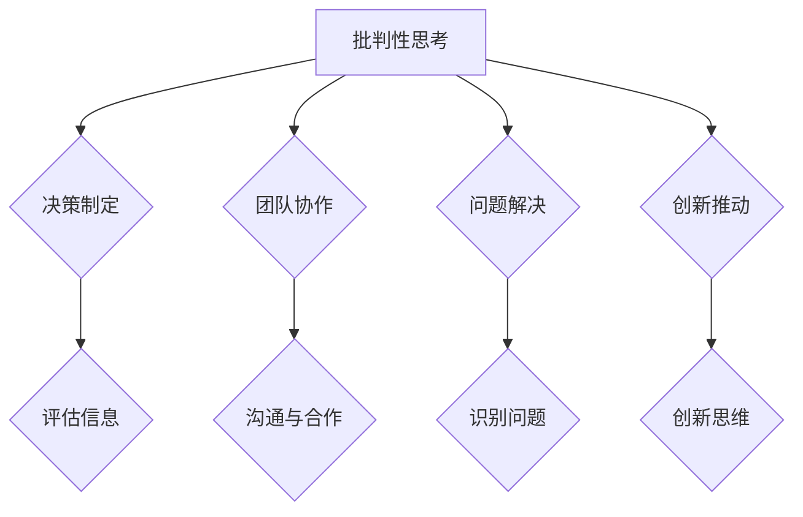

                 

关键词：批判性思考、管理、决策、创新、团队协作、IT领域

> 摘要：本文旨在探讨批判性思考在管理中的重要性，通过深入分析批判性思考的概念、管理中的关键应用，结合IT领域的实际案例，阐述批判性思考如何提升管理效能，推动团队创新和协作。本文还探讨了批判性思考在未来的发展趋势、面临的挑战以及如何应对这些挑战。

## 1. 背景介绍

在现代企业的运营中，管理已经成为一个至关重要的环节。有效的管理不仅能够提高企业的运作效率，还能够激发员工的潜力，推动企业的持续发展。然而，随着市场竞争的加剧和技术的快速发展，管理面临的挑战也在不断增加。传统的管理方法往往难以应对复杂多变的环境，这就需要管理者具备批判性思考的能力。

批判性思考是一种基于逻辑和证据的思考方式，它强调对事物的深入分析和理性判断。在管理领域，批判性思考可以帮助管理者更准确地评估形势，做出更为明智的决策，发现潜在的问题并加以解决，从而提升管理的有效性。

## 2. 核心概念与联系

### 2.1 批判性思考的概念

批判性思考是一种评估性思维过程，它要求思考者不仅要有广泛的知识储备，还要有独立思考和判断的能力。批判性思考的核心在于：

1. **分析**：对信息进行深入分析，理解其背后的逻辑和动机。
2. **评估**：根据事实和证据对信息进行评估，判断其价值和真实性。
3. **应用**：将批判性思考的结果应用到实际问题中，形成有效的解决方案。
4. **反思**：对自己的思考过程进行反思，不断优化和改进。

### 2.2 批判性思考在管理中的应用

在管理中，批判性思考的应用体现在以下几个方面：

1. **决策制定**：管理者需要根据不同的信息和数据，运用批判性思考来制定合理的决策。
2. **团队协作**：批判性思考有助于团队成员更有效地沟通和合作，共同解决问题。
3. **问题解决**：管理者通过批判性思考能够快速识别问题，找到根本原因，并提出有效的解决方案。
4. **创新推动**：批判性思考可以激发管理者的创新思维，推动企业的持续发展。

### 2.3 Mermaid 流程图



## 3. 核心算法原理 & 具体操作步骤

### 3.1 算法原理概述

批判性思考可以看作是一种多步骤的算法，其核心在于以下几个步骤：

1. **信息收集**：管理者需要收集与问题相关的所有信息。
2. **信息评估**：对收集到的信息进行评估，判断其真实性和可靠性。
3. **逻辑推理**：根据评估后的信息，进行逻辑推理，形成初步的结论。
4. **反思与修正**：对推理过程和结论进行反思，根据实际情况进行修正。

### 3.2 算法步骤详解

1. **信息收集**：
    - 与团队成员进行深入交流，了解他们的意见和建议。
    - 查阅相关的文献、报告和数据分析，获取必要的信息。
2. **信息评估**：
    - 对收集到的信息进行分类和整理，识别出关键信息。
    - 利用批判性思维工具，如因果分析、逻辑推理等，评估信息的真实性和可靠性。
3. **逻辑推理**：
    - 根据评估后的信息，构建逻辑框架，形成初步的结论。
    - 运用演绎推理、归纳推理等方法，对结论进行论证。
4. **反思与修正**：
    - 对思考过程和结论进行反思，识别可能的漏洞和错误。
    - 根据实际情况进行修正，形成最终的决策。

### 3.3 算法优缺点

**优点**：
- 提高决策的准确性和有效性。
- 激发团队的创新思维和协作能力。
- 帮助管理者更好地解决问题。

**缺点**：
- 需要大量的时间和精力。
- 可能会受到主观偏见的影响。

### 3.4 算法应用领域

- 企业管理：包括战略规划、决策制定、团队管理等方面。
- 产品开发：在产品设计和研发过程中，进行需求分析和风险评估。
- 项目管理：帮助项目经理更有效地规划和执行项目。

## 4. 数学模型和公式 & 详细讲解 & 举例说明

### 4.1 数学模型构建

在批判性思考中，可以使用一些数学模型来辅助分析和决策。以下是几个常见的数学模型：

1. **贝叶斯定理**：用于概率推断，帮助管理者评估信息的可靠性和重要性。
2. **决策树**：用于决策分析，帮助管理者选择最优的决策路径。
3. **回归分析**：用于预测分析，帮助管理者预测未来的趋势和结果。

### 4.2 公式推导过程

以贝叶斯定理为例，其公式推导如下：

$$
P(A|B) = \frac{P(B|A) \cdot P(A)}{P(B)}
$$

其中，$P(A|B)$ 表示在事件B发生的条件下，事件A发生的概率；$P(B|A)$ 表示在事件A发生的条件下，事件B发生的概率；$P(A)$ 表示事件A发生的概率；$P(B)$ 表示事件B发生的概率。

### 4.3 案例分析与讲解

假设一家企业需要决定是否投资一个新项目。根据市场调研和内部数据分析，可以得到以下信息：

- 投资成功的概率：$P(成功) = 0.6$
- 投资失败的概率：$P(失败) = 0.4$
- 如果项目成功，企业将获得100万元的利润：$P(利润|成功) = 1$
- 如果项目失败，企业将亏损50万元：$P(亏损|失败) = 1$

利用贝叶斯定理，可以计算出在项目成功的前提下，企业获得利润的概率：

$$
P(利润|成功) = \frac{P(成功) \cdot P(利润|成功)}{P(成功) \cdot P(利润|成功) + P(失败) \cdot P(利润|失败)}
$$

代入具体数值，得到：

$$
P(利润|成功) = \frac{0.6 \cdot 1}{0.6 \cdot 1 + 0.4 \cdot 1} = 0.6
$$

这意味着，在项目成功的条件下，企业获得利润的概率为60%。

通过这个案例，我们可以看到，批判性思考和数学模型的应用可以帮助管理者更准确地评估风险和收益，做出更为明智的决策。

## 5. 项目实践：代码实例和详细解释说明

### 5.1 开发环境搭建

为了演示批判性思考在项目管理中的应用，我们选择Python语言进行编程实践。首先，我们需要搭建Python的开发环境。

1. 下载并安装Python：[Python官网](https://www.python.org/)
2. 安装必要的库：`numpy`，`pandas`，`matplotlib`等。

### 5.2 源代码详细实现

以下是一个简单的Python代码实例，用于模拟项目评估过程。

```python
import numpy as np
import pandas as pd
import matplotlib.pyplot as plt

# 初始化项目数据
projects = pd.DataFrame({
    '名称': ['项目A', '项目B', '项目C'],
    '成功概率': [0.6, 0.5, 0.4],
    '收益': [100, 80, 60],
    '风险': [-50, -30, -20]
})

# 利用贝叶斯定理评估项目收益
def evaluate_project(project):
    success_prob = project['成功概率']
    profit = project['收益']
    risk = project['风险']
    total_prob = success_prob * profit + (1 - success_prob) * risk
    return total_prob

# 计算所有项目的评估结果
evaluation_results = projects.apply(evaluate_project, axis=1)

# 可视化评估结果
plt.bar(projects['名称'], evaluation_results)
plt.xlabel('项目名称')
plt.ylabel('评估结果')
plt.title('项目评估结果')
plt.show()
```

### 5.3 代码解读与分析

1. **数据准备**：我们使用`pandas`库创建了一个包含项目名称、成功概率、收益和风险的DataFrame。
2. **评估函数**：`evaluate_project`函数利用贝叶斯定理计算每个项目的评估结果，即成功概率乘以收益减去风险。
3. **评估结果计算**：使用`apply`方法对每个项目进行评估，并将结果存储在一个新的Series中。
4. **可视化**：使用`matplotlib`库将评估结果以条形图的形式展示出来。

通过这个实例，我们可以看到批判性思考和数学模型如何应用于项目管理，帮助管理者更直观地了解每个项目的优劣，从而做出更为明智的决策。

### 5.4 运行结果展示

运行上述代码后，会生成一个条形图，展示每个项目的评估结果。通过分析这个图表，管理者可以快速识别出最具潜力的项目，并优先考虑。

## 6. 实际应用场景

### 6.1 企业战略规划

在企业战略规划过程中，批判性思考可以帮助管理者评估市场环境、竞争态势、技术趋势等关键因素，从而制定出符合企业长远发展的战略。

### 6.2 产品开发

在产品开发过程中，批判性思考可以帮助产品经理和开发团队识别用户需求、评估技术可行性、分析市场潜力，从而开发出更具竞争力的产品。

### 6.3 项目管理

在项目管理过程中，批判性思考可以帮助项目经理识别项目风险、优化项目计划、协调团队协作，从而确保项目按期完成并达到预期目标。

## 6.4 未来应用展望

随着人工智能和大数据技术的发展，批判性思考的应用前景将更加广阔。未来，我们可以期待以下几个方向的发展：

1. **智能化辅助系统**：利用人工智能技术，开发智能化辅助系统，帮助管理者进行决策和评估。
2. **数据驱动的批判性思考**：结合大数据分析，提高批判性思考的数据支持，使其更加客观和精确。
3. **跨领域的批判性思考应用**：批判性思考可以应用于各个领域，如医学、教育、金融等，推动这些领域的创新和发展。

## 7. 工具和资源推荐

### 7.1 学习资源推荐

1. **《批判性思考的技巧》**：作者：理查德·帕斯卡尔，该书详细介绍了批判性思考的方法和应用。
2. **《决策与判断》**：作者：丹尼尔·卡内曼，该书从心理学角度探讨了决策和判断过程中的批判性思考。

### 7.2 开发工具推荐

1. **Python**：Python是一种广泛应用于数据分析和机器学习的编程语言。
2. **R语言**：R语言是一种专门用于统计分析的编程语言。

### 7.3 相关论文推荐

1. **"The Importance of Critical Thinking in Management"**：作者：John G. C. Williams，该论文探讨了批判性思考在管理中的重要性。
2. **"The Role of Critical Thinking in Decision Making"**：作者：James M. Paton，该论文分析了批判性思考在决策过程中的作用。

## 8. 总结：未来发展趋势与挑战

### 8.1 研究成果总结

本文通过对批判性思考的概念、应用领域和具体案例的深入分析，展示了批判性思考在管理中的重要性。研究表明，批判性思考可以帮助管理者更准确地评估形势，做出更为明智的决策，提高团队协作效率，推动企业创新。

### 8.2 未来发展趋势

未来，批判性思考将在人工智能和大数据的推动下，得到更加广泛的应用。智能化辅助系统、数据驱动的批判性思考以及跨领域的应用将成为研究的热点。

### 8.3 面临的挑战

然而，批判性思考也面临着一些挑战，如如何克服主观偏见、如何提高批判性思考的效率等。未来研究需要进一步探讨这些问题，并提出有效的解决方案。

### 8.4 研究展望

随着技术的进步和管理实践的深入，批判性思考将在管理领域发挥越来越重要的作用。我们期待未来的研究能够为管理者提供更强大的工具和方法，帮助他们更好地应对复杂多变的环境，推动企业的持续发展。

## 9. 附录：常见问题与解答

### 9.1 批判性思考的定义是什么？

批判性思考是一种基于逻辑和证据的思考方式，它要求思考者对事物进行深入分析、评估和反思，从而形成独立的判断和决策。

### 9.2 为什么批判性思考在管理中很重要？

批判性思考可以帮助管理者更准确地评估形势，做出更为明智的决策，提高团队协作效率，推动企业创新，从而提升管理效能。

### 9.3 如何培养批判性思考能力？

培养批判性思考能力需要广泛的知识储备、独立思考和判断能力。可以通过阅读相关书籍、参加培训课程、进行实际案例分析等方式来提高。

### 9.4 批判性思考在项目管理中的应用有哪些？

批判性思考在项目管理中可以应用于项目评估、风险识别、决策制定等方面，帮助项目经理更有效地规划和执行项目。

### 9.5 如何利用数学模型进行批判性思考？

可以利用贝叶斯定理、决策树、回归分析等数学模型进行批判性思考，通过数学公式和模型推导，辅助分析和决策。

### 9.6 如何克服批判性思考中的主观偏见？

可以通过提高自我意识、接受多方意见、进行反思和修正等方式来克服批判性思考中的主观偏见。

### 9.7 未来批判性思考有哪些发展方向？

未来批判性思考的发展方向包括智能化辅助系统、数据驱动的批判性思考、跨领域的应用等，随着技术的进步和管理实践的深入，批判性思考将在更广泛的领域发挥重要作用。

----------------------------------------------------------------
作者：禅与计算机程序设计艺术 / Zen and the Art of Computer Programming

