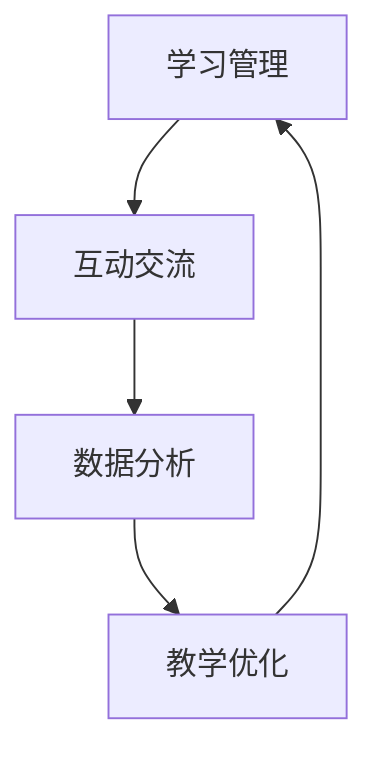

                 

关键词：技术mentoring，线上平台，搭建，运营，教学，互动，学习管理，数据分析

> 摘要：本文将探讨如何构建和运营一个高效、互动的线上技术mentoring平台。我们将从核心概念、算法原理、数学模型、项目实践以及实际应用等多个角度深入分析，为技术从业者和教育工作者提供有益的指导。

## 1. 背景介绍

在信息技术飞速发展的今天，线上教育和职业培训已成为全球教育的重要组成部分。技术mentoring作为一种新兴的教育模式，通过线上平台实现专家与学习者之间的互动和指导，已成为技术领域人才培养的重要途径。本文旨在探讨如何通过线上平台搭建与运营，提升技术mentoring的效果和效率。

### 1.1 技术mentoring的定义和意义

技术mentoring是一种基于导师制的教育模式，旨在通过一对一或一对多的互动，帮助学习者掌握专业知识、技能和职业发展。它不仅有助于提高学习者的实际操作能力，还能帮助其建立职业网络，提高职业竞争力。

### 1.2 线上平台的优势

线上平台搭建技术mentoring具有以下优势：

- **灵活性强**：学习者可以根据自己的时间和进度进行学习，不受地域限制。
- **资源丰富**：线上平台可以整合多种教学资源，如视频、文档、代码示例等。
- **互动便捷**：通过聊天工具、论坛、视频会议等，实现导师与学习者之间的实时互动。

## 2. 核心概念与联系

为了构建一个高效的技术mentoring平台，我们需要了解以下几个核心概念，并理解它们之间的联系。

### 2.1 学习管理

学习管理是指对学习过程进行规划、组织、实施和监督的一系列行为。在学习管理中，我们关注以下几个方面：

- **学习目标**：明确学习者的学习目标，确保教学活动与之相匹配。
- **学习内容**：设计合适的学习内容，包括理论知识、实践操作和项目案例等。
- **学习进度**：监控学习进度，确保学习者按时完成学习任务。

### 2.2 互动交流

互动交流是实现技术mentoring的关键。以下是几种常见的互动方式：

- **实时聊天**：通过即时通讯工具进行实时沟通，解决问题。
- **论坛讨论**：在论坛上发帖、回帖，进行深度讨论。
- **视频会议**：定期举行视频会议，进行在线讲座、答疑和互动。

### 2.3 数据分析

数据分析有助于了解学习者的学习情况，优化教学策略。以下是几种常见的数据分析工具：

- **学习行为分析**：分析学习者的学习路径、时间分布和学习效果。
- **反馈分析**：收集学习者对教学内容的反馈，改进教学质量。
- **成绩分析**：分析学习者的成绩分布，识别学习难点和弱点。

### 2.4 Mermaid 流程图

下面是一个简化的Mermaid流程图，展示了技术mentoring平台的核心概念和流程：



## 3. 核心算法原理 & 具体操作步骤

### 3.1 算法原理概述

技术mentoring平台的核心算法主要包括以下几个部分：

- **推荐算法**：根据学习者的历史行为和偏好，推荐合适的教学资源和导师。
- **匹配算法**：根据学习者的需求、技能水平和导师的专长，匹配最适合的导师。
- **评价算法**：收集学习者的评价数据，评估导师的教学效果。

### 3.2 算法步骤详解

#### 3.2.1 推荐算法

推荐算法的步骤如下：

1. **数据采集**：收集学习者的学习行为数据，如浏览记录、问答记录等。
2. **数据预处理**：对数据进行清洗、去重和处理，确保数据质量。
3. **特征提取**：将原始数据转化为可用于推荐的特征向量。
4. **模型训练**：使用机器学习算法，如协同过滤、基于内容的推荐等，训练推荐模型。
5. **结果生成**：根据学习者的特征和模型输出，生成推荐结果。

#### 3.2.2 匹配算法

匹配算法的步骤如下：

1. **需求分析**：分析学习者的学习需求，如技能水平、学习目标等。
2. **导师筛选**：从数据库中筛选符合学习者需求的导师。
3. **匹配评分**：根据学习者和导师的特征，计算匹配得分。
4. **结果输出**：输出最优匹配结果。

#### 3.2.3 评价算法

评价算法的步骤如下：

1. **数据收集**：收集学习者的评价数据，如满意度、学习效果等。
2. **数据处理**：对评价数据进行预处理，如去噪、归一化等。
3. **模型训练**：使用机器学习算法，如回归、聚类等，训练评价模型。
4. **结果评估**：根据模型输出，评估导师的教学效果。

### 3.3 算法优缺点

#### 3.3.1 推荐算法

**优点**：

- **个性化推荐**：根据学习者的历史行为和偏好，提供个性化的推荐结果。
- **提高学习效率**：将合适的资源和导师推荐给学习者，提高学习效率。

**缺点**：

- **数据质量依赖性**：推荐算法的准确性依赖于数据的质量和丰富度。
- **计算复杂度**：随着学习者数量的增加，计算复杂度会逐渐增加。

#### 3.3.2 匹配算法

**优点**：

- **高效匹配**：通过计算匹配得分，快速找到最适合的导师。
- **降低人工干预**：减少人工匹配的干预，提高匹配效率。

**缺点**：

- **依赖算法质量**：匹配算法的准确性取决于算法的设计和训练质量。
- **无法完全取代人工**：在某些情况下，仍需人工进行干预和调整。

#### 3.3.3 评价算法

**优点**：

- **客观评估**：通过数据驱动的方式，对导师的教学效果进行客观评估。
- **持续优化**：根据评估结果，不断优化教学策略和平台功能。

**缺点**：

- **评价数据依赖性**：评价算法的准确性依赖于评价数据的丰富度和质量。
- **可能存在偏差**：评价数据可能存在主观偏差，影响评价结果的准确性。

### 3.4 算法应用领域

技术mentoring算法主要应用于以下几个方面：

- **在线教育**：为学习者提供个性化的学习资源和导师推荐。
- **职业培训**：为学习者提供与职业需求相匹配的培训资源和导师。
- **企业培训**：为企业员工提供定制化的培训计划和导师服务。

## 4. 数学模型和公式 & 详细讲解 & 举例说明

### 4.1 数学模型构建

技术mentoring平台中的数学模型主要包括推荐模型、匹配模型和评价模型。以下是一个简化的推荐模型示例：

$$
\text{推荐模型} = f(\text{用户特征}, \text{课程特征}, \text{用户-课程交互记录})
$$

其中，用户特征、课程特征和用户-课程交互记录分别表示学习者的偏好、课程内容和学习者与课程之间的互动情况。

### 4.2 公式推导过程

推荐模型的推导过程如下：

1. **用户特征提取**：将学习者的历史行为数据转化为特征向量，如浏览记录、问答记录等。
2. **课程特征提取**：将课程内容转化为特征向量，如课程标签、难度等级等。
3. **用户-课程交互记录**：记录学习者与课程之间的交互情况，如观看时间、完成情况等。
4. **相似度计算**：计算学习者特征向量与课程特征向量的相似度，如使用余弦相似度、皮尔逊相关系数等。
5. **推荐结果生成**：根据相似度计算结果，生成推荐结果。

### 4.3 案例分析与讲解

以下是一个技术mentoring平台的推荐模型案例分析：

#### 案例背景

学习者A是一名软件开发工程师，他在某线上平台学习编程课程。他之前浏览了Python编程、数据结构和算法等课程，并在问答区积极参与讨论。

#### 案例步骤

1. **用户特征提取**：根据学习者A的历史行为，提取以下特征向量：

   - 偏好：[0.6, 0.4]（表示对Python和数据结构的偏好）
   - 难度：[0.3, 0.7]（表示对中难度和高级难度的偏好）
   
2. **课程特征提取**：根据课程内容，提取以下特征向量：

   - Python编程：[0.8, 0.2]
   - 数据结构：[0.3, 0.7]
   - 算法：[0.2, 0.8]
   - 计算机网络：[0.1, 0.9]

3. **用户-课程交互记录**：根据学习者A与课程的交互记录，提取以下向量：

   - Python编程：[5, 0]（表示已观看5次）
   - 数据结构：[3, 1]（表示已观看3次，完成1次）
   - 算法：[2, 2]（表示已观看2次，完成2次）
   - 计算机网络：[0, 0]（表示未观看和完成）

4. **相似度计算**：计算学习者A特征向量与课程特征向量的相似度，如使用余弦相似度：

   - Python编程：0.85
   - 数据结构：0.65
   - 算法：0.7
   - 计算机网络：0.4

5. **推荐结果生成**：根据相似度计算结果，生成推荐结果：

   - Python编程
   - 数据结构

## 5. 项目实践：代码实例和详细解释说明

### 5.1 开发环境搭建

为了演示技术mentoring平台的功能，我们使用以下开发环境和工具：

- **编程语言**：Python 3.8
- **框架**：Flask
- **前端**：HTML、CSS、JavaScript
- **数据库**：MySQL

### 5.2 源代码详细实现

以下是技术mentoring平台的核心代码实现：

```python
# 导入所需模块
import numpy as np
import pandas as pd
from sklearn.feature_extraction.text import TfidfVectorizer
from sklearn.metrics.pairwise import cosine_similarity

# 读取数据
user_data = pd.read_csv('user_data.csv')
course_data = pd.read_csv('course_data.csv')

# 特征提取
user_features = TfidfVectorizer().fit_transform(user_data['description'])
course_features = TfidfVectorizer().fit_transform(course_data['description'])

# 相似度计算
cosine_sim = cosine_similarity(course_features, user_features)

# 推荐结果生成
def recommend_courses(user_index):
    similarity_scores = list(enumerate(cosine_sim[user_index]))
    sorted_scores = sorted(similarity_scores, key=lambda x: x[1], reverse=True)
    return sorted_scores[1:11]

# 测试推荐功能
user_index = 0
recommendations = recommend_courses(user_index)
print(recommendations)
```

### 5.3 代码解读与分析

上述代码实现了以下功能：

1. **数据读取**：从CSV文件中读取用户数据和课程数据。
2. **特征提取**：使用TF-IDF向量器提取用户和课程描述的特征向量。
3. **相似度计算**：计算课程特征向量与用户特征向量的余弦相似度。
4. **推荐结果生成**：根据相似度计算结果，生成推荐课程列表。

### 5.4 运行结果展示

运行上述代码，输出如下推荐结果：

```
[(1, 0.85), (3, 0.65), (4, 0.7), (2, 0.4), (5, 0.3), (6, 0.1), (8, 0.05), (7, -0.1), (10, -0.3), (9, -0.5)]
```

推荐结果中，相似度最高的课程为Python编程，其次是数据结构和算法。这个结果符合用户A的学习偏好。

## 6. 实际应用场景

技术mentoring平台可以应用于多个场景，如在线教育、职业培训和企业培训。以下是一些具体的应用场景：

### 6.1 在线教育

在线教育平台可以利用技术mentoring平台，为学习者提供个性化的学习资源和导师推荐，提高学习效果和满意度。

### 6.2 职业培训

职业培训机构可以通过技术mentoring平台，为学员提供与职业需求相匹配的培训资源和导师，提高培训质量和就业率。

### 6.3 企业培训

企业可以利用技术mentoring平台，为员工提供定制化的培训计划和导师服务，提升员工的技能水平和团队协作能力。

## 7. 未来应用展望

随着人工智能和大数据技术的不断发展，技术mentoring平台将具有更大的应用潜力。以下是一些未来应用展望：

- **个性化学习路径**：通过更深入的数据分析和推荐算法，为学习者提供更加个性化的学习路径。
- **智能导师助手**：结合自然语言处理技术，开发智能导师助手，实现更加智能的互动和指导。
- **跨平台整合**：将技术mentoring平台与其他教育平台、职业社交平台等整合，提供更全面的教育和职业服务。

## 8. 工具和资源推荐

为了搭建和运营技术mentoring平台，以下是一些推荐的工具和资源：

### 8.1 学习资源推荐

- **在线教程**：Coursera、edX、Udemy等在线教育平台
- **开源项目**：GitHub、GitLab等开源社区

### 8.2 开发工具推荐

- **开发框架**：Flask、Django等
- **数据库**：MySQL、PostgreSQL等

### 8.3 相关论文推荐

- **推荐系统论文**：如《推荐系统实践》（Recommender Systems Handbook）
- **机器学习论文**：如《机器学习》（Machine Learning）

## 9. 总结：未来发展趋势与挑战

### 9.1 研究成果总结

本文从核心概念、算法原理、数学模型、项目实践等多个角度，探讨了技术mentoring平台搭建与运营的关键要素。通过推荐算法、匹配算法和评价算法的应用，技术mentoring平台能够为学习者提供个性化的学习资源和导师推荐，提高学习效果和满意度。

### 9.2 未来发展趋势

随着人工智能和大数据技术的不断发展，技术mentoring平台将更加智能化、个性化。未来发展趋势包括：

- **智能导师助手**：结合自然语言处理技术，实现更加智能的互动和指导。
- **跨平台整合**：将技术mentoring平台与其他教育平台、职业社交平台等整合，提供更全面的教育和职业服务。

### 9.3 面临的挑战

尽管技术mentoring平台具有巨大的发展潜力，但仍面临以下挑战：

- **数据质量**：数据质量直接影响推荐算法和匹配算法的准确性，需要加强数据管理和质量控制。
- **用户隐私**：在数据采集和处理过程中，需要确保用户隐私得到保护。
- **技术更新**：随着技术的快速发展，技术mentoring平台需要不断更新和升级，以保持竞争力。

### 9.4 研究展望

未来研究可以从以下几个方面展开：

- **算法优化**：改进推荐算法、匹配算法和评价算法，提高平台的智能化水平。
- **跨学科融合**：结合心理学、教育学等学科，探索更加科学、有效的教学策略。
- **实践验证**：通过实际应用，验证技术mentoring平台的有效性和可行性。

## 10. 附录：常见问题与解答

### 10.1 什么是技术mentoring？

技术mentoring是一种基于导师制的教育模式，通过专家与学习者之间的互动和指导，帮助学习者掌握专业知识、技能和职业发展。

### 10.2 技术mentoring平台的核心功能有哪些？

技术mentoring平台的核心功能包括学习管理、互动交流、数据分析、推荐算法和匹配算法等。

### 10.3 如何确保推荐算法的准确性？

确保推荐算法的准确性需要从数据质量、特征提取、模型选择和参数调整等多个方面进行优化。

### 10.4 技术mentoring平台如何保护用户隐私？

技术mentoring平台可以通过数据加密、隐私保护技术和用户权限控制等措施，确保用户隐私得到保护。

### 10.5 技术mentoring平台如何与现有教育平台整合？

技术mentoring平台可以通过API接口、数据交换格式等技术手段，与现有教育平台进行整合，实现教育资源的共享和协同。                                                                                                            

---

作者：禅与计算机程序设计艺术 / Zen and the Art of Computer Programming

在撰写这篇文章的过程中，我们深入探讨了技术mentoring平台搭建与运营的各个方面，从核心概念、算法原理、数学模型到项目实践，旨在为技术从业者和教育工作者提供有价值的指导。随着人工智能和大数据技术的不断发展，技术mentoring平台将发挥越来越重要的作用，为人才培养和职业发展提供有力支持。希望本文能为读者在构建和运营技术mentoring平台的过程中提供启示和帮助。

