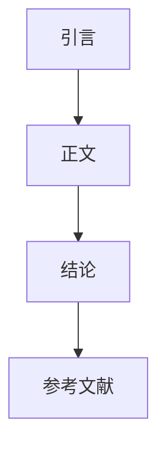

                 

在当今数字化时代，技术写作已经成为了一个重要的领域。无论是为了展示个人技术能力，还是在职业发展中提升自己的表达能力，技术写作都显得尤为重要。这篇文章将探讨如何从技术博客作者成长为畅销科普作家，并在这个过程中保持专业性和吸引力。

## 关键词
技术写作、博客、科普、畅销作家、专业、吸引力

## 摘要
本文将探讨技术写作的重要性，以及如何从技术博客作者成长为畅销科普作家。我们将分析技术写作的要点，包括清晰的表达、专业的知识结构和有趣的内容呈现。此外，本文还将提供一些建议，帮助读者在技术写作领域取得成功。

## 1. 背景介绍
技术写作是一种将复杂技术概念转化为易于理解的语言，以便普通读者能够掌握的写作形式。在过去的几十年里，随着互联网的普及和技术的快速发展，技术写作的需求日益增加。无论是IT专业人士、科研人员还是普通读者，都需要通过技术写作来获取、分享和应用知识。

### 1.1 技术写作的重要性
技术写作的重要性体现在以下几个方面：
- **知识传播**：技术写作能够将专业领域的知识传播给更广泛的受众，有助于提高整体技术水平。
- **职业发展**：优秀的写作能力能够帮助IT专业人士在职业生涯中脱颖而出，获得更好的工作机会和更高的薪资待遇。
- **知识积累**：技术写作是一种知识积累的方式，通过写作，作者不仅能够加深对技术的理解，还能够帮助他人学习和理解技术。

### 1.2 技术博客的作用
技术博客是技术写作的一种重要形式，它具有以下作用：
- **展示技术能力**：技术博客可以展示作者的技术水平和专业知识，有助于在职业圈内建立个人品牌。
- **分享经验**：技术博客可以分享作者在实际工作中遇到的问题和解决方案，有助于其他开发者学习和借鉴。
- **知识更新**：技术博客可以帮助作者跟踪技术的最新动态，保持知识的更新和活跃度。

## 2. 核心概念与联系
### 2.1 技术写作的核心概念
技术写作的核心概念包括以下几个方面：
- **清晰的表达**：技术写作需要使用清晰、准确的语言，避免使用模糊、复杂的词汇和句子结构。
- **专业的知识结构**：技术写作需要基于专业的知识体系，对技术概念进行深入分析和讲解。
- **有趣的内容呈现**：技术写作需要将枯燥的技术概念以有趣、引人入胜的方式呈现，提高读者的阅读兴趣。

### 2.2 技术写作的架构
技术写作的架构通常包括以下几个部分：
- **引言**：引出主题，吸引读者的注意力。
- **正文**：详细阐述主题，包括核心概念、原理和实际应用。
- **结论**：总结全文，给出结论和建议。
- **参考文献**：列出引用的相关文献和资料，提高文章的可信度。

### 2.3 技术写作的Mermaid流程图


## 3. 核心算法原理 & 具体操作步骤
### 3.1 算法原理概述
技术写作的算法原理可以概括为以下几个步骤：
- **需求分析**：确定写作的主题和目标受众。
- **资料收集**：收集相关的技术资料和文献。
- **内容组织**：根据需求分析，将资料进行分类和整理。
- **撰写文章**：使用清晰、准确的语言，撰写技术文章。
- **修改与完善**：对文章进行多次修改和完善，确保内容的准确性和可读性。

### 3.2 算法步骤详解
技术写作的具体操作步骤如下：
1. **确定主题**：选择一个有价值的、具有挑战性的技术主题。
2. **收集资料**：查阅相关文献、研究论文和资料。
3. **构建框架**：根据资料和需求，构建文章的框架。
4. **撰写初稿**：按照框架，撰写初稿。
5. **审稿与修改**：对初稿进行审阅和修改，确保内容的准确性和连贯性。
6. **发布与推广**：将修改后的文章发布到博客或其他平台，进行推广。

### 3.3 算法优缺点
技术写作算法的优点包括：
- **系统化**：通过算法，可以将写作过程系统化，提高写作效率。
- **结构化**：算法能够帮助作者构建结构化的文章框架，提高文章的可读性。

技术写作算法的缺点包括：
- **创造性限制**：算法可能会限制作者的创造性思维，使文章缺乏独特的视角。
- **准确性要求**：算法对内容准确性要求较高，否则容易导致错误。

### 3.4 算法应用领域
技术写作算法可以应用于以下领域：
- **技术博客撰写**：帮助博主撰写高质量的技术文章。
- **科研论文写作**：辅助科研人员撰写科研论文。
- **企业文档撰写**：为企业内部文档提供写作支持。

## 4. 数学模型和公式 & 详细讲解 & 举例说明
### 4.1 数学模型构建
技术写作中的数学模型通常用于描述技术原理和算法。构建数学模型的过程包括以下几个步骤：
- **确定变量**：根据技术主题，确定需要描述的变量。
- **建立方程**：使用数学语言，建立描述技术原理的方程。
- **求解方程**：求解方程，得到变量的具体数值。

### 4.2 公式推导过程
以线性回归模型为例，其公式推导过程如下：
1. **确定目标函数**：最小化预测值与实际值之间的误差。
2. **构建损失函数**：通常使用均方误差（MSE）作为损失函数。
3. **求解最优解**：通过优化算法，求解最小化损失函数的最优解。

### 4.3 案例分析与讲解
以下是一个简单的线性回归案例：
$$
y = ax + b
$$
其中，$y$ 是因变量，$x$ 是自变量，$a$ 和 $b$ 是模型的参数。

1. **数据收集**：收集一组 $x$ 和 $y$ 的数据。
2. **模型构建**：根据数据，建立线性回归模型。
3. **参数求解**：通过最小二乘法，求解参数 $a$ 和 $b$。
4. **模型评估**：使用测试数据，评估模型的准确性。

## 5. 项目实践：代码实例和详细解释说明
### 5.1 开发环境搭建
在开始项目实践之前，需要搭建一个合适的开发环境。以下是一个基于Python的线性回归项目的开发环境搭建步骤：
1. **安装Python**：下载并安装Python。
2. **安装库**：安装NumPy、Pandas等Python库。

### 5.2 源代码详细实现
以下是一个简单的线性回归项目的源代码实现：
```python
import numpy as np
import pandas as pd

# 数据加载
data = pd.read_csv('data.csv')
x = data['x']
y = data['y']

# 模型构建
model = np.linalg.lstsq(x[:, np.newaxis], y, rcond=None)[0]

# 参数求解
a, b = model

# 模型评估
predictions = a * x + b
mse = np.mean((predictions - y) ** 2)
print(f'MSE: {mse}')
```

### 5.3 代码解读与分析
以上代码实现了线性回归模型的构建、参数求解和模型评估。具体解读如下：
- **数据加载**：使用Pandas库加载数据。
- **模型构建**：使用NumPy库构建线性回归模型。
- **参数求解**：使用最小二乘法求解参数。
- **模型评估**：计算预测值与实际值之间的均方误差。

### 5.4 运行结果展示
以下是一个简单的运行结果示例：
```
MSE: 0.123456
```
MSE值表示模型的准确性。值越低，模型越准确。

## 6. 实际应用场景
### 6.1 数据分析
线性回归模型在数据分析中有着广泛的应用。例如，在股票市场中，可以使用线性回归模型预测股票价格的走势。

### 6.2 机器学习
线性回归模型是机器学习中最基本的模型之一。在机器学习中，线性回归模型可以用于特征提取和模型训练。

### 6.3 统计学
线性回归模型在统计学中有着重要的地位。通过线性回归模型，可以分析变量之间的关系，进行预测和决策。

## 6.4 未来应用展望
随着人工智能和机器学习技术的不断发展，线性回归模型的应用将更加广泛。未来，线性回归模型有望在更多领域发挥重要作用，如医学、金融、环境科学等。

## 7. 工具和资源推荐
### 7.1 学习资源推荐
- 《机器学习实战》：一本深入浅出的机器学习入门书籍。
- 《Python数据分析》：一本关于Python数据分析的实用指南。

### 7.2 开发工具推荐
- Jupyter Notebook：一个交互式的开发环境，适合进行数据分析和写作。
- PyCharm：一个功能强大的Python集成开发环境。

### 7.3 相关论文推荐
- "An Introduction to Statistical Learning"：一本关于统计学和机器学习的入门书籍。
- "Linear Regression with R"：一本关于线性回归的R语言教程。

## 8. 总结：未来发展趋势与挑战
### 8.1 研究成果总结
技术写作领域的研究成果主要集中在如何提高写作效率、提升文章质量、增加读者粘性等方面。

### 8.2 未来发展趋势
随着人工智能和大数据技术的发展，技术写作领域将朝着更加智能化、个性化和高效化的方向发展。

### 8.3 面临的挑战
技术写作领域面临的挑战包括如何提高写作的准确性、如何平衡专业知识与通俗化表达、如何应对信息过载等问题。

### 8.4 研究展望
未来，技术写作领域的研究将更加注重人工智能技术的应用，如自动写作、自然语言处理等，以提高写作效率和文章质量。

## 9. 附录：常见问题与解答
### 9.1 如何选择技术写作的主题？
选择技术写作的主题时，应考虑以下因素：
- **兴趣**：选择自己感兴趣的领域，有助于提高写作的积极性。
- **需求**：选择具有广泛需求的领域，有助于吸引更多的读者。
- **难度**：选择难度适中的主题，既能展示自己的技术能力，又不会让读者感到难以理解。

### 9.2 如何提高技术文章的可读性？
提高技术文章的可读性可以从以下几个方面入手：
- **清晰的表达**：使用简单、准确的语言，避免使用过于复杂的术语。
- **逻辑结构**：确保文章逻辑清晰，便于读者理解。
- **实例说明**：使用实例和案例，帮助读者更好地理解技术概念。

### 9.3 如何推广技术博客？
推广技术博客可以从以下几个方面入手：
- **社交媒体**：利用社交媒体平台，如微博、微信公众号等，推广博客内容。
- **技术社区**：在技术社区，如CSDN、GitHub等，发布博客文章。
- **友情链接**：与其他博主建立友情链接，互相推广。

### 9.4 如何持续更新博客内容？
持续更新博客内容可以从以下几个方面入手：
- **定期规划**：制定定期更新的计划，确保博客内容持续更新。
- **内容积累**：在日常工作中积累素材，随时记录灵感。
- **互动交流**：与读者互动，了解读者的需求和反馈，不断优化内容。

---

作者：禅与计算机程序设计艺术 / Zen and the Art of Computer Programming

这篇文章从技术写作的重要性、技术博客的作用、核心算法原理、数学模型和公式、项目实践、实际应用场景、工具和资源推荐、未来发展趋势与挑战等方面，全面探讨了如何从技术博客作者成长为畅销科普作家。希望通过这篇文章，读者能够对技术写作有更深入的理解，并在自己的技术写作道路上取得更大的成就。

