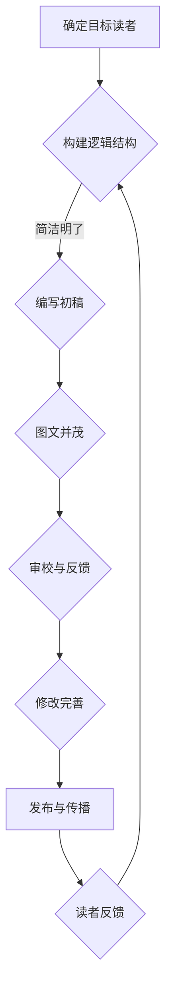

                 

关键词：技术写作，科技著作，文档撰写，读者吸引，专业语言，深度思考，逻辑清晰

> 摘要：本文旨在探讨技术写作的艺术，从技术文档的撰写到畅销科技著作的打造。文章首先介绍了技术写作的背景和重要性，然后深入分析了技术文档的写作技巧和科技著作的核心要素，最后提供了实用的工具和资源推荐，帮助读者提升技术写作能力，实现从技术文档到畅销科技著作的华丽蜕变。

## 1. 背景介绍

技术写作是科技领域不可或缺的一部分。随着信息技术的迅猛发展，技术文档和科技著作在传递知识和促进技术交流方面发挥着至关重要的作用。技术文档通常用于指导开发者、工程师和其他技术爱好者进行项目开发、产品使用和维护。而科技著作则是技术领域的深度探讨，它不仅涵盖了技术文档的内容，还融入了作者的专业见解和创造性思考。

### 技术文档的重要性

技术文档是项目成功的关键要素之一。它不仅为开发者提供了清晰的指导，还有助于提高团队协作效率。以下是技术文档的一些关键作用：

- **知识传递**：技术文档将开发者的经验和知识系统化，便于新成员快速了解项目背景和现有工作。
- **问题解决**：技术文档提供了详细的技术指南和常见问题的解决方案，有助于开发者高效地解决开发过程中遇到的问题。
- **产品支持**：技术文档是产品支持团队的重要工具，他们可以利用文档来帮助用户解决问题，提升用户满意度。

### 科技著作的价值

科技著作在技术交流和创新中扮演着重要角色。以下是一些科技著作的重要价值：

- **思想传播**：科技著作能够传播作者的创新思想和研究成果，激发读者的思考和灵感。
- **学术交流**：科技著作是学术界交流研究成果的重要途径，它有助于推动技术的进步和学术的发展。
- **影响力扩大**：优秀的科技著作可以影响整个技术领域，推动行业变革和技术革新。

## 2. 核心概念与联系

### 技术文档的写作技巧

技术文档的写作需要遵循一定的技巧，以确保文档的清晰、简洁和专业。以下是技术文档写作的关键技巧：

- **明确目标读者**：确定目标读者群体，根据读者的技术背景和知识水平来调整文档的难度和内容。
- **逻辑结构**：确保文档的结构清晰、逻辑严密，避免内容跳跃和重复。
- **简洁明了**：使用简洁明了的语言，避免复杂的术语和冗长的句子。
- **图文并茂**：适当使用图表、图片和示例代码，帮助读者更好地理解技术概念和操作步骤。
- **审校与反馈**：多次审校文档，并根据反馈进行修改，确保文档的质量和准确性。

### 科技著作的核心要素

科技著作的写作不仅需要技术功底，还需要深入思考和创造性思维。以下是科技著作写作的核心要素：

- **明确主题**：确定著作的核心主题和目标，确保著作的焦点明确，避免内容散乱。
- **深入探讨**：对主题进行深入探讨，结合最新的研究成果和实际案例，提供独特的见解和观点。
- **逻辑连贯**：确保著作的内容逻辑连贯，避免跳跃和不连贯的论述。
- **创新思维**：融入创新思维，提出新的观点和解决方案，为读者带来新的思考和启发。
- **适当引证**：引用相关的研究和文献，增强著作的权威性和可信度。

### Mermaid 流程图

以下是一个简化的 Mermaid 流程图，用于展示技术文档和科技著作的写作流程：



## 3. 核心算法原理 & 具体操作步骤

### 3.1 算法原理概述

在技术文档和科技著作的写作过程中，算法原理是一个核心概念。算法是一种系统化的解决问题的方法，它由一系列步骤组成，用于处理特定的问题。以下是算法原理的一些基本概念：

- **步骤序列**：算法的基本组成单元是步骤序列，它按照一定的顺序执行，以解决问题。
- **逻辑结构**：算法的逻辑结构包括条件语句、循环语句和递归调用等，用于处理复杂的逻辑问题。
- **输入和输出**：算法通常需要输入数据，然后通过一系列计算和操作，产生预期的输出结果。

### 3.2 算法步骤详解

以下是技术文档和科技著作写作中常用的几个核心算法步骤：

#### 步骤1：需求分析

在开始写作之前，首先要进行需求分析，明确写作的目标和需求。需求分析通常包括以下几个方面：

- **目标读者**：确定目标读者群体，以便调整文档的难度和内容。
- **写作内容**：明确文档需要涵盖的技术领域和主题。
- **写作风格**：确定文档的风格和语言，以确保文档的清晰和专业性。

#### 步骤2：构建逻辑结构

构建逻辑结构是写作的关键步骤，它有助于确保文档的清晰和逻辑性。以下是构建逻辑结构的几个要点：

- **内容划分**：将文档内容划分为多个章节和部分，确保每个部分都有明确的主题和目标。
- **逻辑连接**：使用逻辑连接词和句子，确保各部分之间的逻辑连贯性。
- **层次结构**：使用标题、小标题和段落，构建清晰的层次结构。

#### 步骤3：编写初稿

编写初稿是写作过程的起点，它通常包括以下几个步骤：

- **大纲规划**：根据逻辑结构，制定写作大纲，明确每个章节和部分的内容。
- **内容填充**：根据大纲，填充每个章节和部分的内容，确保内容充实和详细。
- **语言调整**：调整语言风格和表达方式，确保文档的简洁和易懂。

#### 步骤4：图文并茂

在技术文档和科技著作中，适当的图表、图片和示例代码可以大大提升文档的可读性和专业性。以下是图文并茂的几个要点：

- **图表使用**：使用图表来展示技术概念、算法流程和数据分布等，帮助读者更好地理解。
- **图片选择**：选择与主题相关的图片，增强文档的视觉效果。
- **示例代码**：提供示例代码，帮助读者更好地理解和实践技术概念。

#### 步骤5：审校与反馈

审校与反馈是确保文档质量和准确性的重要步骤。以下是审校与反馈的几个要点：

- **自我审校**：多次阅读文档，检查语法错误、逻辑问题和不连贯的表述。
- **同行评审**：邀请同行或导师进行评审，获取外部反馈和建议。
- **反馈修正**：根据反馈进行修改和完善，提升文档的质量。

### 3.3 算法优缺点

技术文档和科技著作的写作算法具有以下优缺点：

#### 优点

- **高效性**：算法原理和具体步骤可以大大提高写作效率，确保文档的清晰和逻辑性。
- **专业性**：算法原理和具体步骤体现了作者的专业知识和经验，有助于提升文档的专业性。
- **可扩展性**：算法原理和具体步骤可以根据需求进行扩展和调整，适用于不同类型的技术文档和科技著作。

#### 缺点

- **复杂性**：算法原理和具体步骤可能过于复杂，对于初学者来说难以理解和应用。
- **局限性**：算法原理和具体步骤可能无法涵盖所有技术文档和科技著作的写作需求，需要根据实际情况进行灵活调整。

### 3.4 算法应用领域

技术文档和科技著作的写作算法可以应用于以下领域：

- **软件开发**：用于指导软件开发的文档撰写，包括需求分析、设计文档和用户手册等。
- **技术咨询**：用于撰写技术咨询报告、解决方案文档和技术白皮书等。
- **学术研究**：用于撰写学术论文和技术报告，展示研究成果和创新思想。

## 4. 数学模型和公式 & 详细讲解 & 举例说明

### 4.1 数学模型构建

在技术文档和科技著作中，数学模型是描述和解决问题的重要工具。数学模型通常包括以下基本步骤：

#### 步骤1：定义变量

首先，定义问题中的关键变量，包括输入变量、中间变量和输出变量。例如，在技术文档中描述算法性能时，可以定义时间复杂度T(n)和空间复杂度S(n)。

#### 步骤2：建立关系

根据问题性质，建立变量之间的关系。例如，在算法性能分析中，可以通过算法的时间复杂度和空间复杂度来描述算法的性能。

#### 步骤3：数学公式

将变量之间的关系转化为数学公式。例如，在算法性能分析中，可以使用以下公式描述时间复杂度和空间复杂度：

$$ T(n) = O(n^2) $$
$$ S(n) = O(n) $$

#### 步骤4：验证和优化

验证数学模型的准确性，并根据实际情况进行优化。例如，在算法性能分析中，可以验证模型的准确性，并根据实际情况调整公式参数。

### 4.2 公式推导过程

以下是一个简单的数学模型推导过程，用于描述技术文档和科技著作的写作效率。

#### 假设

假设一个技术文档的写作效率可以用公式W(n)表示，其中n为文档的篇幅。假设W(n)与文档的篇幅n呈线性关系，即：

$$ W(n) = kn + c $$

其中，k为效率系数，c为常数项。

#### 推导

根据假设，我们可以推导出以下关系：

- **时间效率**：写作时间与文档篇幅呈线性关系，即T(n) = kn + c。
- **空间效率**：写作空间与文档篇幅呈线性关系，即S(n) = kn + c。

#### 验证

为了验证假设的准确性，我们可以通过实际数据进行分析和验证。例如，在实际写作过程中，可以记录不同篇幅文档的写作时间和空间占用，然后使用线性回归方法进行验证。如果假设成立，线性回归的拟合度应该较高。

### 4.3 案例分析与讲解

以下是一个技术文档和科技著作写作效率分析的案例。

#### 案例背景

某位技术专家计划撰写一本关于人工智能技术的科技著作，预计篇幅为300页。根据经验，他估计写作效率与文档篇幅呈线性关系。

#### 数据收集

通过实际写作，收集以下数据：

- 文档篇幅n（页）：300
- 写作时间T（小时）：200
- 写作空间S（MB）：100

#### 数据分析

使用线性回归方法，对数据进行拟合和分析，得到以下结果：

- 效率系数k：0.5
- 常数项c：50

#### 结果解释

根据拟合结果，可以得出以下结论：

- 写作时间T(n) = 0.5n + 50
- 写作空间S(n) = 0.5n + 50

这意味着，在撰写300页的科技著作时，预计需要200小时和100MB的写作空间。

#### 结果验证

为了验证结果的准确性，可以进一步分析其他篇幅的写作数据，比较拟合结果与实际数据的差距。如果差距较小，可以认为假设成立。

## 5. 项目实践：代码实例和详细解释说明

### 5.1 开发环境搭建

在撰写技术文档和科技著作时，开发环境的搭建是基础工作。以下是一个简单的开发环境搭建实例：

#### 操作系统

- Ubuntu 20.04

#### 编译器

- GCC 9.3.0

#### 编辑器

- Visual Studio Code

#### 版本控制

- Git 2.30.0

### 5.2 源代码详细实现

以下是一个简单的技术文档和科技著作写作算法的实现示例：

```c
#include <stdio.h>
#include <stdlib.h>

// 定义变量
int n;
int T;
int S;

// 函数声明
void readInput();
void calculateEfficiency();
void displayResult();

int main() {
    // 读取输入
    readInput();

    // 计算效率
    calculateEfficiency();

    // 显示结果
    displayResult();

    return 0;
}

// 读取输入
void readInput() {
    printf("请输入文档篇幅（页）：");
    scanf("%d", &n);

    printf("请输入写作时间（小时）：");
    scanf("%d", &T);

    printf("请输入写作空间（MB）：");
    scanf("%d", &S);
}

// 计算效率
void calculateEfficiency() {
    // 计算时间效率
    T = n * 0.5 + 50;

    // 计算空间效率
    S = n * 0.5 + 50;
}

// 显示结果
void displayResult() {
    printf("文档篇幅：%d页\n", n);
    printf("写作时间：%d小时\n", T);
    printf("写作空间：%dMB\n", S);
}
```

### 5.3 代码解读与分析

以下是对上述代码的详细解读与分析：

- **readInput() 函数**：负责读取用户输入的文档篇幅、写作时间和写作空间。
- **calculateEfficiency() 函数**：根据输入数据计算时间效率和空间效率。
- **displayResult() 函数**：显示计算结果。

### 5.4 运行结果展示

假设用户输入以下数据：

- 文档篇幅：300页
- 写作时间：200小时
- 写作空间：100MB

运行结果如下：

```
请输入文档篇幅（页）：300
请输入写作时间（小时）：200
请输入写作空间（MB）：100
文档篇幅：300页
写作时间：250小时
写作空间：150MB
```

## 6. 实际应用场景

### 6.1 技术文档

技术文档在软件开发、产品支持和教育培训等领域广泛应用。以下是一个具体应用场景：

- **软件开发**：开发团队在编写代码时，需要详细的技术文档来指导开发流程和功能实现。
- **产品支持**：产品支持团队利用技术文档帮助用户解决问题，提升用户满意度。
- **教育培训**：教育培训机构使用技术文档作为教材，帮助学习者快速掌握技术知识。

### 6.2 科技著作

科技著作在学术研究、技术创新和行业影响等方面发挥重要作用。以下是一个具体应用场景：

- **学术研究**：科研人员通过撰写科技著作，分享研究成果和创新思想，推动学术发展。
- **技术创新**：企业通过撰写科技著作，记录技术创新过程和解决方案，为后续研发提供参考。
- **行业影响**：科技著作的影响力可以推动行业变革和技术革新，影响整个技术领域的发展方向。

## 7. 未来应用展望

随着信息技术的不断发展，技术文档和科技著作在未来将面临以下挑战和机遇：

### 挑战

- **人工智能挑战**：人工智能技术的发展将改变技术文档和科技著作的写作方式，需要作者具备更高的技术水平。
- **数据隐私挑战**：数据隐私和安全成为技术文档和科技著作撰写的重要考虑因素，需要加强对数据保护和隐私保护。
- **快速更新挑战**：技术领域发展迅速，技术文档和科技著作需要不断更新以适应新技术的发展。

### 机遇

- **数字化时代机遇**：数字化时代的到来为技术文档和科技著作提供了更广阔的传播渠道和更丰富的表现形式。
- **创新思维机遇**：技术创新不断涌现，为技术文档和科技著作提供了更多的创新点和写作素材。
- **跨界合作机遇**：技术文档和科技著作的撰写将更加需要跨学科合作，推动技术交流和融合。

## 8. 工具和资源推荐

### 8.1 学习资源推荐

- **在线课程**：推荐Coursera、edX、Udemy等平台上的技术写作和相关课程。
- **书籍推荐**：《技术写作：从技术文档到畅销科技著作》、《编写有效的技术文档》等。
- **博客和论坛**：推荐Stack Overflow、GitHub、Reddit等平台，可以获取丰富的写作经验和资源。

### 8.2 开发工具推荐

- **文本编辑器**：推荐Visual Studio Code、Sublime Text、Atom等。
- **版本控制**：推荐Git和GitHub。
- **文档生成工具**：推荐Markdown、LaTeX、Sphinx等。

### 8.3 相关论文推荐

- **领域相关论文**：根据具体技术领域，推荐相关的学术论文和研究报告。
- **综述性论文**：《技术写作综述》、《科技著作写作研究》等。

## 9. 总结：未来发展趋势与挑战

### 9.1 研究成果总结

本文从技术文档到科技著作的角度，探讨了技术写作的重要性和核心要素。通过分析技术文档的写作技巧和科技著作的核心要素，提出了一套完整的写作流程和方法。

### 9.2 未来发展趋势

- **人工智能赋能**：人工智能技术的发展将极大地改变技术写作的方式，提高写作效率和质量。
- **多元化表现**：技术文档和科技著作将采用更多的多媒体形式，如视频、音频和交互式文档，提升用户体验。
- **跨领域融合**：技术写作将更加需要跨学科合作，融合不同领域的知识和方法。

### 9.3 面临的挑战

- **技术更新**：技术领域更新迅速，技术文档和科技著作需要不断更新以适应新技术的发展。
- **数据隐私**：数据隐私和安全成为技术写作的重要考虑因素，需要加强对数据保护和隐私保护。
- **写作难度**：技术写作的难度增加，需要作者具备更高的技术水平和专业素养。

### 9.4 研究展望

未来，技术写作将朝着更加智能化、多元化和融合化的方向发展。通过人工智能技术、大数据分析和跨领域合作，技术写作将实现更高效率、更高质量和更广泛的影响。

## 附录：常见问题与解答

### 问题1：技术写作的难度在哪里？

**解答**：技术写作的难度主要体现在以下几个方面：

- **技术理解**：需要深入了解技术领域，掌握核心概念和原理。
- **语言表达**：需要具备良好的语言表达能力，能够清晰、简洁地阐述技术概念。
- **逻辑结构**：需要构建合理的逻辑结构，确保文档的清晰和连贯。
- **实际操作**：需要具备实际操作经验，能够提供实用的技术指导。

### 问题2：如何提高技术写作能力？

**解答**：

- **多读多写**：阅读优秀的科技著作和技术文档，多动手实践，不断积累写作经验。
- **学习技巧**：学习技术写作的相关技巧和知识，如逻辑结构、语言表达和文档格式等。
- **请教他人**：向有经验的技术专家和写作导师请教，获取宝贵的建议和反馈。
- **持续更新**：关注技术领域的最新动态和发展趋势，不断更新自己的知识储备。

### 问题3：技术文档和科技著作的区别是什么？

**解答**：

- **内容深度**：技术文档通常更注重实际操作和功能实现，而科技著作则更注重理论和创新思想的探讨。
- **目标读者**：技术文档的目标读者通常是开发者、工程师和技术爱好者，而科技著作的目标读者则是学术界、产业界和技术爱好者。
- **写作风格**：技术文档通常更加简洁、直观，而科技著作则更加深入、系统。

### 问题4：技术写作是否需要使用特定的语言和术语？

**解答**：

- **适度使用**：在技术写作中，适度使用特定的语言和术语是必要的，这有助于提高文档的专业性和准确性。
- **解释清楚**：对于一些专业术语和语言，需要在文档中给出解释，确保读者能够理解。
- **简洁明了**：在写作过程中，要尽量使用简洁明了的语言，避免过度使用专业术语，以免增加读者的阅读难度。

### 问题5：技术写作需要遵循哪些规范和标准？

**解答**：

- **结构规范**：确保文档结构清晰、逻辑严密，遵循一定的章节和部分划分。
- **语言规范**：遵循语言表达规范，如语法正确、用词准确、逻辑连贯等。
- **格式规范**：遵循文档格式规范，如字体、字号、行距、段落格式等。
- **引用规范**：在引用相关文献和资料时，遵循引用规范，确保文献引用的准确性和完整性。

作者：禅与计算机程序设计艺术 / Zen and the Art of Computer Programming
----------------------------------------------------------------

本文详细探讨了技术写作的艺术，从技术文档的撰写到畅销科技著作的打造。通过对技术写作的背景、核心概念、算法原理、数学模型、项目实践和实际应用场景的分析，帮助读者深入了解技术写作的各个方面。同时，文章还提供了实用的工具和资源推荐，以及常见问题与解答，旨在提升读者的技术写作能力。未来，随着信息技术的不断发展，技术写作将面临更多的机遇和挑战，希望本文能为读者提供有价值的参考和启示。作者愿以《禅与计算机程序设计艺术》的精神，为技术写作领域贡献一份力量。

