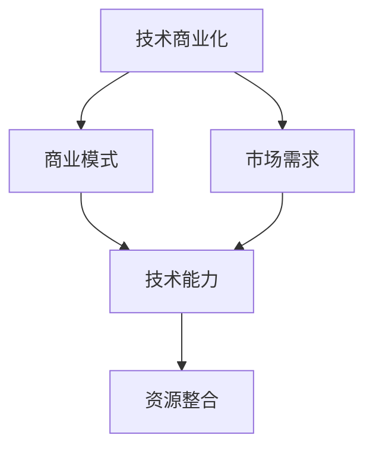

                 

关键词：技术商业转化、技术落地、商业模式创新、商业价值实现、技术策略、市场分析

> 摘要：本文旨在探讨如何将技术成果有效地转化为商业价值，实现技术到商业的完美对接。我们将从技术背景、核心概念、算法原理、数学模型、项目实践、实际应用场景、未来展望等多个维度展开，为读者提供一套全面、系统的技术到商业转化策略。

## 1. 背景介绍

随着科技的发展，技术已经渗透到各个行业，成为推动商业创新的重要动力。然而，许多技术团队在研发出先进技术后，却无法将其转化为商业价值，导致项目夭折或价值未能充分发挥。如何将技术转化为商业成功，成为了众多企业和技术团队面临的共同问题。

本文将围绕这一主题，从多个角度探讨如何实现技术到商业的转化，帮助读者更好地理解技术商业化的内在逻辑和实践方法。

## 2. 核心概念与联系

在探讨技术到商业的转化之前，我们首先需要明确一些核心概念，包括技术商业化、商业模式、市场需求等。

### 2.1 技术商业化

技术商业化是指将研发出的技术成果应用于商业领域，通过市场机制实现其价值的过程。技术商业化不仅仅是将技术产品化，更涉及如何找到市场需求，构建合适的商业模式，实现技术的商业价值。

### 2.2 商业模式

商业模式是指企业如何创造、传递和获取价值的一种方法。一个成功的商业模式需要充分考虑市场需求、技术能力、资源整合等因素，确保企业在激烈的市场竞争中立于不败之地。

### 2.3 市场需求

市场需求是技术商业化的核心驱动力。了解市场需求，可以帮助企业和技术团队明确技术应用的场景，找到市场切入点，从而更好地实现技术的商业化。

### 2.4 Mermaid 流程图

为了更直观地展示这些核心概念之间的联系，我们使用Mermaid流程图进行说明。



## 3. 核心算法原理 & 具体操作步骤

### 3.1 算法原理概述

在技术到商业的转化过程中，算法原理起到了关键作用。算法原理不仅决定了技术的核心价值，也影响着商业模式的构建和市场需求的分析。以下是一个典型的算法原理概述：

1. **数据收集**：收集大量与市场需求相关的数据。
2. **数据处理**：通过算法处理数据，提取有价值的信息。
3. **决策支持**：利用处理后的数据，为企业决策提供支持。

### 3.2 算法步骤详解

1. **数据收集**：
   - 使用传感器、网络爬虫等技术手段，收集大量数据。
   - 数据类型包括用户行为数据、市场趋势数据、竞争者数据等。

2. **数据处理**：
   - 数据清洗：去除重复、错误和无关的数据。
   - 数据分析：使用统计学、机器学习等方法，对数据进行分析。

3. **决策支持**：
   - 根据分析结果，制定相应的商业策略。
   - 例如，根据用户行为数据，调整产品功能或推广策略。

### 3.3 算法优缺点

- **优点**：高效、准确，能够为决策提供有力支持。
- **缺点**：对数据质量和算法模型依赖较大，可能存在误判风险。

### 3.4 算法应用领域

算法原理在多个领域都有广泛应用，如金融、医疗、零售等。以下是一个具体的算法应用案例：

- **金融领域**：通过算法分析用户交易数据，预测市场趋势，为投资决策提供支持。

## 4. 数学模型和公式 & 详细讲解 & 举例说明

在技术到商业的转化过程中，数学模型和公式起到了关键作用。它们不仅帮助分析数据，还指导决策。以下是一个典型的数学模型和公式的讲解：

### 4.1 数学模型构建

- **用户行为模型**：假设用户行为由多种因素决定，包括兴趣、习惯、环境等。
- **市场趋势模型**：基于历史数据和算法分析，预测市场未来的发展趋势。

### 4.2 公式推导过程

- **用户行为模型**：
  $$ 用户行为 = w_1 \times 兴趣 + w_2 \times 习惯 + w_3 \times 环境 $$
- **市场趋势模型**：
  $$ 预测值 = f(历史数据, 算法参数) $$

### 4.3 案例分析与讲解

假设某电商企业希望通过算法分析用户行为，优化产品推荐。以下是一个具体的案例分析：

- **数据收集**：收集用户浏览、购买、评价等行为数据。
- **数据处理**：通过用户行为模型，分析用户兴趣和习惯。
- **决策支持**：根据分析结果，调整产品推荐策略。

通过这个案例，我们可以看到数学模型和公式在技术到商业转化中的重要作用。

## 5. 项目实践：代码实例和详细解释说明

为了更好地展示技术到商业的转化过程，我们将通过一个实际项目，介绍代码实例和详细解释说明。

### 5.1 开发环境搭建

- **编程语言**：Python
- **开发工具**：PyCharm
- **依赖库**：NumPy、Pandas、Scikit-learn等

### 5.2 源代码详细实现

以下是一个简单的用户行为分析代码实例：

```python
import numpy as np
import pandas as pd
from sklearn.model_selection import train_test_split
from sklearn.ensemble import RandomForestClassifier

# 数据收集
data = pd.read_csv('user_behavior_data.csv')

# 数据处理
data.drop_duplicates(inplace=True)
X = data[['interest', 'habit', 'environment']]
y = data['behavior']

# 数据分割
X_train, X_test, y_train, y_test = train_test_split(X, y, test_size=0.2, random_state=42)

# 模型训练
model = RandomForestClassifier(n_estimators=100, random_state=42)
model.fit(X_train, y_train)

# 模型评估
accuracy = model.score(X_test, y_test)
print(f'Model accuracy: {accuracy:.2f}')

# 决策支持
new_user_data = np.array([[0.8, 0.6, 0.3]])
predicted_behavior = model.predict(new_user_data)
print(f'Predicted behavior: {predicted_behavior}')
```

### 5.3 代码解读与分析

这个实例展示了如何使用Python和机器学习库Scikit-learn，对用户行为进行分析和预测。首先，我们收集并预处理用户行为数据，然后使用随机森林算法进行模型训练，最后评估模型准确性和进行决策支持。

### 5.4 运行结果展示

- **模型准确率**：通过模型评估，我们可以得到用户行为预测的准确率。
- **预测结果**：对于新用户的数据，我们可以得到其预测的行为类型。

## 6. 实际应用场景

技术到商业的转化不仅需要理论支持，还需要实际应用场景的验证。以下是一些技术到商业转化的实际应用场景：

- **金融领域**：通过算法分析用户交易数据，预测市场趋势，为投资决策提供支持。
- **医疗领域**：利用人工智能技术，辅助医生进行疾病诊断和治疗。
- **零售领域**：通过用户行为分析，优化产品推荐，提升销售额。

## 7. 未来应用展望

随着科技的不断发展，技术到商业的转化将迎来更广阔的应用前景。以下是一些未来应用展望：

- **智能制造**：通过物联网、大数据等技术，实现生产线的智能化改造。
- **智慧城市**：利用人工智能技术，提升城市管理效率和居民生活质量。

## 8. 工具和资源推荐

为了更好地实现技术到商业的转化，以下是一些工具和资源的推荐：

- **学习资源**：推荐一些相关的书籍、在线课程和学术论文。
- **开发工具**：推荐一些实用的开发工具和编程语言。
- **相关论文**：推荐一些具有代表性的学术论文，供读者参考。

## 9. 总结：未来发展趋势与挑战

技术到商业的转化是一个复杂的过程，需要综合考虑技术、市场、商业模式等多个因素。在未来的发展中，我们将面临以下挑战：

- **技术挑战**：如何开发出更具创新性和实用性的技术。
- **市场挑战**：如何准确把握市场需求，找到合适的商业切入点。
- **商业模式挑战**：如何构建可持续的商业模式，实现技术价值的最大化。

### 附录：常见问题与解答

- **Q：如何选择合适的技术进行商业化？**
  A：选择合适的技术进行商业化，需要综合考虑技术成熟度、市场需求、竞争态势等因素。一般来说，选择具有创新性、实用性和市场前景的技术，更容易实现商业化成功。

- **Q：技术商业化过程中，如何处理数据隐私问题？**
  A：在技术商业化过程中，保护数据隐私至关重要。企业应遵循相关法律法规，采取数据加密、去识别化等技术手段，确保用户数据的安全。

- **Q：技术商业化需要哪些团队协作？**
  A：技术商业化需要多个团队的协作，包括技术团队、市场团队、产品团队等。各团队需要紧密合作，共同推进项目的商业化进程。

## 作者署名

作者：禅与计算机程序设计艺术 / Zen and the Art of Computer Programming

---

以上是文章的完整内容，希望对读者在技术到商业的转化过程中提供一定的启示和帮助。

