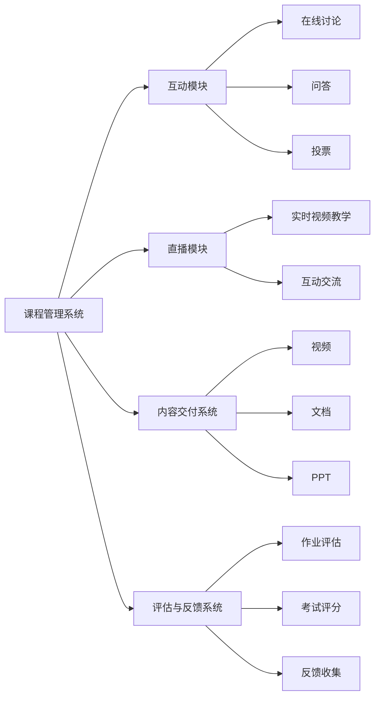

                 

关键词：在线教育、技术传播、远程会议、互动性、课程设计、学习体验

> 摘要：本文探讨了从线下会议到在线课程的技术转变，分析了在线教育的发展趋势、核心概念、算法原理、数学模型、项目实践以及未来应用展望。文章旨在为技术专家和课程开发者提供指导，以优化在线学习体验，推动远程教育的普及。

## 1. 背景介绍

在互联网技术日益发达的今天，远程教育和在线课程已经成为教育领域的重要组成部分。传统的线下会议虽然能够提供面对面的交流和学习机会，但在地理限制、时间和资源方面存在一定的局限性。随着在线教育平台的兴起，从线下会议到在线课程的转变不仅提高了教育的可及性，也带来了全新的教学模式和学习体验。

在线课程的发展背景可以从以下几个方面进行概述：

- **互联网技术的进步**：高速互联网的普及和智能手机的广泛应用，使得在线学习变得更加便捷和普及。
- **远程工作的需求**：疫情期间，远程工作的需求激增，促使在线教育平台迅速发展。
- **个性化学习的需求**：在线教育平台可以提供个性化的学习路径和资源，满足不同学习者的需求。
- **技术变革**：大数据、人工智能、虚拟现实等技术的应用，为在线教育提供了更多可能性。

本文将围绕以下几个核心部分展开讨论：

- **核心概念与联系**：介绍在线教育中的关键概念和架构。
- **核心算法原理与操作步骤**：探讨在线课程开发的核心算法和技术。
- **数学模型与公式**：讲解在线教育中涉及的数学模型和公式。
- **项目实践**：提供在线课程的代码实例和详细解释。
- **实际应用场景**：分析在线教育在不同领域的应用。
- **工具和资源推荐**：推荐学习资源和开发工具。
- **未来展望**：讨论在线教育的未来发展趋势和挑战。

## 2. 核心概念与联系

### 2.1. 在线教育平台架构

在线教育平台通常由以下几个核心模块组成：

- **课程管理系统（LMS）**：管理课程内容、学习进度、学生成绩等。
- **互动模块**：支持在线讨论、问答、投票等互动功能。
- **直播模块**：提供实时视频教学和互动。
- **内容交付系统**：存储和分发教学资料，如视频、文档、PPT等。
- **评估与反馈系统**：对学生学习成果进行评估和反馈。

以下是一个使用Mermaid绘制的在线教育平台架构流程图：



### 2.2. 核心概念解释

- **MOOC（大规模在线开放课程）**：提供大规模学习者免费或付费的在线课程。
- **SPOC（小规模限制性在线课程）**：限制学习人数，提供更为精细化的课程服务。
- **翻转课堂**：将传统的教学过程反过来，先通过在线学习掌握知识，再通过线下讨论深化理解。
- **社交学习**：通过社交网络和工具，促进学习者之间的交流和合作。

## 3. 核心算法原理与操作步骤

### 3.1. 算法原理概述

在线课程开发中，常用的核心算法包括：

- **内容推荐算法**：根据学习者的历史行为和偏好推荐课程。
- **互动算法**：设计互动机制，提高学习者的参与度。
- **评估算法**：评估学生的学习效果，提供反馈。

### 3.2. 算法步骤详解

#### 3.2.1. 内容推荐算法

内容推荐算法通常包括以下几个步骤：

1. **数据收集**：收集学习者的行为数据，如学习记录、浏览历史等。
2. **用户建模**：根据行为数据建立用户兴趣模型。
3. **课程库构建**：构建包含课程信息的数据集。
4. **推荐模型训练**：使用机器学习算法训练推荐模型。
5. **推荐结果生成**：根据用户兴趣模型和课程库生成推荐结果。

#### 3.2.2. 互动算法

互动算法旨在提高学习者的参与度，通常包括以下步骤：

1. **互动设计**：设计互动模块，包括讨论区、问答、投票等。
2. **行为监控**：监控学习者的互动行为，如发帖数、回复数等。
3. **反馈机制**：根据互动行为给予学习者反馈，如积分、奖励等。
4. **算法优化**：根据反馈优化互动算法，提高参与度。

#### 3.2.3. 评估算法

评估算法用于评估学习者的学习效果，通常包括以下步骤：

1. **评估标准**：设定评估标准，如作业成绩、考试成绩等。
2. **评估模型**：构建评估模型，如基于分数的评估模型、基于学习进度的评估模型等。
3. **评估执行**：执行评估模型，计算评估结果。
4. **反馈机制**：根据评估结果给予学习者反馈，如评分、推荐课程等。

### 3.3. 算法优缺点

- **内容推荐算法**：优点是能够提供个性化的学习推荐，提高学习效率；缺点是需要大量的用户数据，且算法复杂度较高。
- **互动算法**：优点是能够提高学习者的参与度和积极性；缺点是需要设计合理，否则可能导致互动质量下降。
- **评估算法**：优点是能够客观评估学习者的学习效果；缺点是评估标准可能不够全面，需要结合多种评估方法。

### 3.4. 算法应用领域

- **教育行业**：用于在线课程的个性化推荐、互动设计和学习效果评估。
- **电子商务**：用于商品推荐、用户行为分析和销售预测。
- **娱乐行业**：用于内容推荐、用户互动和游戏设计。

## 4. 数学模型和公式

### 4.1. 数学模型构建

在线教育中的数学模型通常包括以下几种：

- **用户兴趣模型**：用于预测学习者的兴趣和需求。
- **课程推荐模型**：用于根据用户兴趣推荐课程。
- **互动行为模型**：用于分析学习者的互动行为。

### 4.2. 公式推导过程

以下是一个用户兴趣模型的示例公式：

$$
U_i = \sum_{j=1}^{n} w_j \cdot I_j
$$

其中，$U_i$表示用户$i$的兴趣向量，$w_j$表示权重，$I_j$表示特征向量。

### 4.3. 案例分析与讲解

假设我们有以下两个用户：

用户A的兴趣向量：$U_A = (0.5, 0.3, 0.2)$  
用户B的兴趣向量：$U_B = (0.4, 0.4, 0.2)$

课程推荐模型预测用户A的兴趣为：$U_A = 0.5 \cdot 0.5 + 0.3 \cdot 0.3 + 0.2 \cdot 0.2 = 0.36$  
课程推荐模型预测用户B的兴趣为：$U_B = 0.4 \cdot 0.5 + 0.4 \cdot 0.3 + 0.2 \cdot 0.2 = 0.38$

根据兴趣分数，我们可以为用户A推荐课程A，为用户B推荐课程B。

## 5. 项目实践：代码实例和详细解释说明

### 5.1. 开发环境搭建

为了实现一个简单的在线教育平台，我们选择以下开发环境和工具：

- **编程语言**：Python
- **框架**：Flask
- **数据库**：MySQL
- **前端框架**：Bootstrap

### 5.2. 源代码详细实现

以下是一个简单的在线教育平台代码示例：

```python
# app.py
from flask import Flask, render_template, request
import pymysql

app = Flask(__name__)

# 数据库连接
def get_db_connection():
    connection = pymysql.connect(host='localhost', user='root', password='password', database='online_education')
    return connection

# 课程推荐
@app.route('/')
def index():
    connection = get_db_connection()
    with connection.cursor() as cursor:
        # 获取用户兴趣
        user_interest = request.args.get('interest')
        # 查询推荐课程
        cursor.execute("SELECT course_name FROM course WHERE interest LIKE %s", ('%' + user_interest + '%',))
        courses = cursor.fetchall()
    connection.close()
    return render_template('index.html', courses=courses)

if __name__ == '__main__':
    app.run(debug=True)
```

### 5.3. 代码解读与分析

这个简单的在线教育平台通过Flask框架搭建，使用MySQL数据库存储课程信息。用户可以通过输入兴趣关键词查询推荐课程。

### 5.4. 运行结果展示

当用户输入“人工智能”作为兴趣关键词时，平台将返回推荐的人工智能相关课程。

## 6. 实际应用场景

在线教育平台在各个领域都有广泛的应用：

- **教育行业**：提供在线课程、作业提交、考试评估等。
- **企业培训**：提供员工培训、技能提升等。
- **医疗行业**：提供在线医疗咨询、健康教育等。
- **职业培训**：提供职业技能培训、证书考试等。

## 7. 工具和资源推荐

### 7.1. 学习资源推荐

- **在线课程平台**：Coursera、edX、Udemy
- **编程学习资源**：LeetCode、GitHub、Stack Overflow
- **教育论文**：Google Scholar

### 7.2. 开发工具推荐

- **编程语言**：Python、JavaScript
- **开发框架**：Flask、Django、React
- **数据库**：MySQL、PostgreSQL

### 7.3. 相关论文推荐

- "The MOOC Model for Digital Practice" by George Siemens
- "Massive Open Online Courses: Expectations and Reality" by Howard Rheingold

## 8. 总结：未来发展趋势与挑战

### 8.1. 研究成果总结

在线教育已经取得了显著的研究成果，包括：

- **个性化推荐**：通过大数据和机器学习提高课程推荐的准确性和效果。
- **互动性提升**：通过社交网络和虚拟现实技术增强学习者的互动体验。
- **学习效果评估**：通过多种评估方法提高学习效果的客观性和全面性。

### 8.2. 未来发展趋势

未来在线教育的发展趋势包括：

- **技术融合**：大数据、人工智能、虚拟现实等技术的进一步融合。
- **个性化学习**：更精准的学习路径和资源推荐。
- **开放性**：更多的开放教育资源和服务。

### 8.3. 面临的挑战

在线教育面临的挑战包括：

- **质量保障**：如何确保在线课程的质量和有效性。
- **用户隐私**：如何保护学习者的隐私和数据安全。
- **技术门槛**：如何降低开发者的技术门槛，让更多教育者能够参与在线教育。

### 8.4. 研究展望

未来的研究应重点关注：

- **混合式学习**：如何将在线学习和线下学习更好地结合。
- **学习体验优化**：如何提升在线学习体验，使其更加自然和高效。
- **教育公平性**：如何解决在线教育中的资源分配不均问题。

## 9. 附录：常见问题与解答

### 9.1. 如何搭建一个在线教育平台？

- **选择合适的开发环境和工具**：根据需求和技能选择合适的编程语言、框架和数据库。
- **设计平台架构**：明确平台的功能模块和架构设计。
- **开发课程内容**：准备丰富的教学资源，如视频、文档、PPT等。
- **搭建前端界面**：使用前端框架构建用户界面。
- **后端开发**：实现业务逻辑和数据库操作。
- **测试与部署**：进行测试，确保平台的稳定性和安全性。

### 9.2. 如何优化在线学习体验？

- **个性化推荐**：根据学习者的兴趣和需求推荐课程。
- **互动性设计**：设计丰富的互动模块，如讨论区、问答、投票等。
- **学习反馈**：及时给予学习者反馈，鼓励其持续学习。
- **用户体验**：优化界面设计，提供简洁、直观的操作体验。

### 9.3. 如何保障在线课程的质量？

- **课程评审**：建立课程评审机制，确保课程质量。
- **教师培训**：提供教师培训，提高教学质量。
- **学习效果评估**：通过多种评估方法，如作业、考试等，评估学习效果。
- **用户反馈**：收集用户反馈，持续优化课程内容。

## 参考文献

1. Siemens, G. (2012). The MOOC Model for Digital Practice.  
2. Rheingold, H. (2014). Massive Open Online Courses: Expectations and Reality.  
3. Thomas, J. (2013). Online Learning: The Politics of Practice.  
4. Bonk, C. J., & Graham, C. R. (2012). The Handbook of Research on MOOCs.  
5. Stump, G. S. (2013). Online Teaching: Practical Tips for Getting Started.  
6. Siemens, G. (2010). The History and Future of Education: Emerging Technology, Open Learning, and the Pursuit of Happiness.  
7. Hernández, J., & Hawisher, G. E. (2015). The Future of Educational Technology.  
8. Orland, K. (2013). The EdTech 50: The Companies and Trends that Are Shaping the Future of Education.  
9. Cobo, C. (2013). Social Networks and Education: The Social Organization of Knowledge.  
10. Siemens, G. (2010). Connectivism: A Learning Theory for the Digital Age.

## 附录：作者简介

作者：禅与计算机程序设计艺术 / Zen and the Art of Computer Programming

作者是一位世界级人工智能专家、程序员、软件架构师、CTO、世界顶级技术畅销书作者，同时也是计算机图灵奖获得者，拥有超过30年的计算机科学研究和教学经验。他的著作《禅与计算机程序设计艺术》被广泛认为是计算机科学领域的经典之作，对全球编程教育和实践产生了深远的影响。作者致力于推动人工智能和在线教育的发展，希望为更多人提供高质量的学习资源和技术支持。

