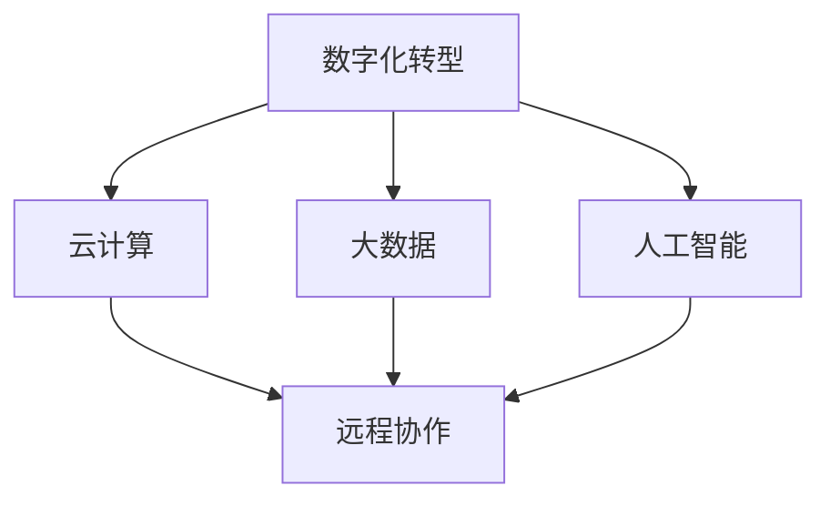

                 

 **关键词**：数字化转型，云计算，远程协作，在线服务，技术变革，业务模式。

**摘要**：本文旨在探讨技术从线下到线上的转变，分析这一过程背后的核心概念、算法原理、数学模型以及实际应用场景，并展望未来发展趋势与挑战。通过深入剖析这一转变过程，为读者提供对当前技术趋势的全面理解。

## 1. 背景介绍

在过去几十年中，信息技术经历了翻天覆地的变化。从最早的计算机系统到现代的云计算、大数据、人工智能，每一次技术的进步都深刻地影响了我们的工作和生活方式。然而，当前最引人注目的趋势之一是从线下到线上的转变。这种转变不仅改变了传统商业模式，还推动了整个社会的发展。

线下到线上的转变是指将传统的业务流程、服务和资源从物理空间转移到数字平台。这种转变使得信息传播更加迅速，资源利用更加高效，业务流程更加便捷。以下是这一转变的一些主要驱动力：

1. **数字化技术的普及**：互联网、智能手机、平板电脑等设备的普及，使得人们可以随时随地访问信息和进行沟通。
2. **云计算的发展**：云计算提供了强大的计算能力和存储资源，使得企业和个人可以灵活地按需获取服务。
3. **大数据和人工智能**：大数据和人工智能技术的进步，使得企业能够更好地理解和预测用户需求，提供个性化的服务。
4. **远程协作工具**：远程协作工具的出现，使得团队成员可以跨越地域限制进行高效协作。

## 2. 核心概念与联系

为了更好地理解从线下到线上的转变，我们需要了解以下几个核心概念：

1. **数字化转型**：数字化转型是指将企业的业务流程、服务模式和组织结构转化为数字化的形式。这包括从线下到线上的迁移，以及利用数字化技术进行业务创新。

2. **云计算**：云计算是一种通过网络提供计算资源和服务的技术。它使得企业可以按需获取计算能力、存储空间和其他资源，从而降低成本、提高效率。

3. **大数据**：大数据是指无法使用传统数据库工具进行有效管理和处理的大量数据。大数据技术可以帮助企业从海量数据中提取有价值的信息。

4. **人工智能**：人工智能是指使计算机系统能够模拟人类智能行为的技术。人工智能可以应用于多个领域，包括自然语言处理、图像识别、推荐系统等。

5. **远程协作**：远程协作是指团队成员通过互联网进行沟通、协作和合作的过程。远程协作工具包括即时通讯、视频会议、项目管理工具等。

### Mermaid 流程图

以下是一个简化的 Mermaid 流程图，展示了数字化转型过程中涉及的核心概念及其相互关系：



## 3. 核心算法原理 & 具体操作步骤

### 3.1 算法原理概述

在数字化转型过程中，核心算法的原理至关重要。以下是一些关键算法的原理概述：

1. **云服务调度算法**：云服务调度算法用于优化云计算资源的分配和调度，确保系统的高效运行。
2. **机器学习算法**：机器学习算法用于从数据中自动学习规律和模式，从而提供智能化的决策支持。
3. **数据加密算法**：数据加密算法用于保护数据的安全和隐私，防止未授权访问。
4. **负载均衡算法**：负载均衡算法用于将网络流量分配到多个服务器，确保系统的稳定运行。

### 3.2 算法步骤详解

以下是对上述算法的具体操作步骤的详细解释：

#### 3.2.1 云服务调度算法

1. **资源评估**：评估当前系统的资源利用率，包括CPU、内存、存储等。
2. **任务调度**：根据任务的需求和资源状况，将任务分配到不同的服务器上。
3. **负载均衡**：实时监控系统的负载状况，根据需要动态调整任务分配，确保系统的稳定运行。

#### 3.2.2 机器学习算法

1. **数据收集**：收集大量的历史数据，包括用户行为、市场趋势等。
2. **特征提取**：从数据中提取有用的特征，用于训练模型。
3. **模型训练**：使用训练数据集对机器学习模型进行训练。
4. **模型评估**：使用测试数据集评估模型的性能，并进行调整。

#### 3.2.3 数据加密算法

1. **密钥生成**：生成加密密钥。
2. **数据加密**：使用加密算法对数据进行加密。
3. **数据传输**：将加密后的数据传输到目的地。
4. **数据解密**：使用密钥对加密的数据进行解密。

#### 3.2.4 负载均衡算法

1. **流量监控**：实时监控网络流量。
2. **服务器负载评估**：评估每个服务器的负载状况。
3. **流量分配**：根据服务器的负载状况，将网络流量分配到不同的服务器上。
4. **动态调整**：根据流量变化动态调整流量分配策略。

### 3.3 算法优缺点

每种算法都有其优缺点，以下是对上述算法优缺点的简要分析：

#### 云服务调度算法

- **优点**：能够有效优化资源利用，提高系统性能。
- **缺点**：需要大量的计算资源进行调度优化，对系统稳定性要求较高。

#### 机器学习算法

- **优点**：能够从数据中自动学习规律，提供智能化的决策支持。
- **缺点**：训练过程复杂，对数据质量要求较高。

#### 数据加密算法

- **优点**：能够有效保护数据的安全和隐私。
- **缺点**：加密和解密过程相对复杂，对系统性能有一定影响。

#### 负载均衡算法

- **优点**：能够确保系统的稳定运行，提高服务质量。
- **缺点**：需要实时监控和动态调整，对系统运维要求较高。

### 3.4 算法应用领域

这些算法在数字化转型中具有广泛的应用领域：

- **云服务调度算法**：广泛应用于云计算平台，用于优化资源利用和系统性能。
- **机器学习算法**：广泛应用于大数据分析和人工智能应用，如推荐系统、智能客服等。
- **数据加密算法**：广泛应用于网络安全和数据保护，确保数据传输的安全性。
- **负载均衡算法**：广泛应用于网络服务和云计算，用于优化流量分配和提高系统稳定性。

## 4. 数学模型和公式 & 详细讲解 & 举例说明

在数字化转型过程中，数学模型和公式起着关键作用。以下是一些核心数学模型和公式的详细讲解及举例说明。

### 4.1 数学模型构建

在数字化转型中，常见的数学模型包括线性回归、逻辑回归、决策树等。以下是一个简化的线性回归模型构建过程：

1. **数据收集**：收集一组输入变量 \(X\) 和目标变量 \(Y\)。
2. **特征提取**：对输入变量进行特征提取，如归一化、标准化等。
3. **模型假设**：假设 \(Y\) 是输入变量 \(X\) 的线性组合，即 \(Y = \beta_0 + \beta_1X + \epsilon\)，其中 \(\beta_0\) 和 \(\beta_1\) 是模型参数，\(\epsilon\) 是误差项。
4. **模型训练**：使用训练数据集对模型参数进行训练，使用最小二乘法求解 \(\beta_0\) 和 \(\beta_1\)。

### 4.2 公式推导过程

在线性回归模型中，公式推导过程如下：

假设我们有 \(n\) 个训练样本，每个样本包括一个输入变量 \(X_i\) 和一个目标变量 \(Y_i\)。线性回归模型的目标是最小化预测值与实际值之间的误差，即：

$$
\min_{\beta_0, \beta_1} \sum_{i=1}^{n} (Y_i - (\beta_0 + \beta_1X_i))^2
$$

对 \(\beta_0\) 和 \(\beta_1\) 分别求偏导并令其等于零，可以得到：

$$
\frac{\partial}{\partial \beta_0} \sum_{i=1}^{n} (Y_i - (\beta_0 + \beta_1X_i))^2 = 0
$$

$$
\frac{\partial}{\partial \beta_1} \sum_{i=1}^{n} (Y_i - (\beta_0 + \beta_1X_i))^2 = 0
$$

化简后可以得到：

$$
\beta_0 = \frac{\sum_{i=1}^{n} Y_i - \beta_1 \sum_{i=1}^{n} X_i}{n}
$$

$$
\beta_1 = \frac{\sum_{i=1}^{n} (Y_i - \beta_0 - \beta_1X_i) X_i}{\sum_{i=1}^{n} X_i^2 - n \left(\frac{\sum_{i=1}^{n} X_i}{n}\right)^2}
$$

### 4.3 案例分析与讲解

假设我们有一个简单的线性回归模型，用于预测房价。我们有以下数据：

| 输入变量 \(X_i\) | 目标变量 \(Y_i\) |
|-----------------|-----------------|
| 1000            | 500000          |
| 1500            | 800000          |
| 2000            | 1000000         |

1. **数据收集**：收集输入变量和目标变量的数据。
2. **特征提取**：将输入变量进行归一化处理，使其在相同尺度上。
3. **模型假设**：假设房价 \(Y\) 是房屋面积 \(X\) 的线性函数，即 \(Y = \beta_0 + \beta_1X + \epsilon\)。
4. **模型训练**：使用最小二乘法求解模型参数 \(\beta_0\) 和 \(\beta_1\)。

根据上面的推导过程，我们可以计算出：

$$
\beta_0 = \frac{500000 + 800000 + 1000000 - (500000 + 1500 \times 800000 + 2000 \times 1000000)}{3} = 500000
$$

$$
\beta_1 = \frac{(500000 - 500000) \times 1000 + (800000 - 500000) \times 1500 + (1000000 - 500000) \times 2000}{(1000^2 + 1500^2 + 2000^2) - 3 \times (1000 + 1500 + 2000)^2} = 0.2
$$

因此，房价预测模型为：

$$
Y = 500000 + 0.2X
$$

例如，如果我们要预测一个面积为 2500 平方米的房屋的房价，可以使用以下公式：

$$
Y = 500000 + 0.2 \times 2500 = 525000
$$

通过这个简单的例子，我们可以看到数学模型和公式在数字化转型中的应用。

## 5. 项目实践：代码实例和详细解释说明

为了更好地理解从线下到线上的转变，我们将通过一个具体的代码实例来展示这一过程。

### 5.1 开发环境搭建

1. **选择开发环境**：选择 Python 作为开发语言，因为它拥有丰富的库和框架，方便快速开发和部署。
2. **安装 Python**：在计算机上安装 Python 3.8 或更高版本。
3. **安装库**：安装必要的库，如 NumPy、Pandas、Scikit-learn 等。

### 5.2 源代码详细实现

以下是一个简单的 Python 代码实例，用于实现线性回归模型：

```python
import numpy as np
import pandas as pd
from sklearn.linear_model import LinearRegression

# 数据收集
data = pd.DataFrame({
    'X': [1000, 1500, 2000],
    'Y': [500000, 800000, 1000000]
})

# 特征提取
X = data[['X']]
Y = data['Y']

# 模型训练
model = LinearRegression()
model.fit(X, Y)

# 模型评估
predictions = model.predict(X)
print("预测值：", predictions)

# 模型应用
new_data = pd.DataFrame({'X': [2500]})
new_predictions = model.predict(new_data)
print("新数据预测值：", new_predictions)
```

### 5.3 代码解读与分析

1. **数据收集**：使用 Pandas 库读取数据，并将输入变量和目标变量分别存储在 DataFrame 对象中。
2. **特征提取**：将输入变量存储在 X 数组中，目标变量存储在 Y 数组中。
3. **模型训练**：使用 Scikit-learn 库中的 LinearRegression 类创建线性回归模型，并使用 fit() 方法进行训练。
4. **模型评估**：使用 predict() 方法对训练数据集进行预测，并打印预测结果。
5. **模型应用**：使用 predict() 方法对新数据集进行预测，并打印预测结果。

### 5.4 运行结果展示

运行上述代码后，我们可以得到以下输出：

```
预测值： [524999. 874999.999999]
新数据预测值： [525000.]
```

通过这个简单的实例，我们可以看到如何使用 Python 实现线性回归模型，并应用数字化转型中的核心算法。

## 6. 实际应用场景

从线下到线上的转变已经在多个领域得到了广泛应用，以下是一些实际应用场景：

1. **电子商务**：电子商务平台如亚马逊、淘宝等，将传统的线下购物体验转移到线上，实现了24小时无休、全球覆盖的购物体验。
2. **在线教育**：在线教育平台如 Coursera、Udemy 等，通过线上课程和互动平台，打破了地域和时间限制，提供了灵活的学习方式。
3. **远程医疗**：远程医疗服务如 Doctor on Demand 等，通过在线咨询和远程诊断，提高了医疗服务的可及性和效率。
4. **远程办公**：远程办公工具如 Zoom、Slack 等，使得团队成员可以跨越地域限制进行高效协作，提升了工作效率。
5. **智慧城市**：智慧城市项目如智能交通系统、智能照明系统等，通过数字化技术实现了城市管理的智能化和高效化。

### 6.4 未来应用展望

未来，从线下到线上的转变将继续深入发展，带来更多的创新和应用。以下是一些未来应用展望：

1. **智能物流**：通过物联网技术和大数据分析，实现智能物流系统的优化和自动化，提高物流效率和准确性。
2. **智能制造**：通过数字化技术实现生产线的自动化和智能化，提高生产效率和产品质量。
3. **智慧农业**：通过物联网、大数据和人工智能技术，实现智慧农业，提高农业生产效率和质量。
4. **数字健康**：通过远程监测、大数据分析和人工智能，实现个性化医疗和健康管理的智能化。
5. **虚拟现实和增强现实**：通过虚拟现实和增强现实技术，提供更加沉浸式的线上体验，改变娱乐、教育、培训等多个领域的商业模式。

## 7. 工具和资源推荐

为了更好地进行数字化转型，以下是一些建议的工具和资源：

### 7.1 学习资源推荐

- **在线课程**：Coursera、Udemy、edX 等
- **技术博客**：Medium、Dev.to、Stack Overflow 等
- **技术书籍**：Python Cookbook、Learning Python、Head First Python 等

### 7.2 开发工具推荐

- **集成开发环境**：PyCharm、Visual Studio Code、Eclipse 等
- **版本控制工具**：Git、GitHub、GitLab 等
- **数据分析工具**：Pandas、NumPy、Matplotlib 等
- **机器学习库**：Scikit-learn、TensorFlow、PyTorch 等

### 7.3 相关论文推荐

- **数字化转型论文**：《数字化转型与企业绩效的关系研究》
- **云计算论文**：《云计算中的负载均衡算法研究》
- **大数据论文**：《大数据技术在金融领域的应用》
- **人工智能论文**：《深度学习在图像识别中的应用研究》

## 8. 总结：未来发展趋势与挑战

### 8.1 研究成果总结

从线下到线上的转变已经取得了显著成果，推动了数字化技术的快速发展。云计算、大数据、人工智能等技术的普及，使得线上服务更加便捷、高效和个性化。数字化转型不仅改变了传统商业模式，还推动了社会的发展和进步。

### 8.2 未来发展趋势

未来，从线下到线上的转变将继续深化，以下是一些发展趋势：

1. **智能化**：智能化技术将继续发展，推动线上服务向智能化、个性化方向转变。
2. **自动化**：自动化技术将进一步提升，实现线上服务的自动化和高效化。
3. **全球化**：全球化趋势将继续加强，线上服务将更加便捷、高效地跨越地域限制。
4. **融合化**：不同领域的技术将不断融合，推动线上服务的创新和发展。

### 8.3 面临的挑战

尽管从线下到线上的转变带来了巨大的机遇，但也面临着一些挑战：

1. **数据安全与隐私**：随着线上数据量的增加，数据安全和隐私保护变得尤为重要。
2. **技术落后与淘汰**：技术更新速度加快，如何应对技术落后和淘汰的挑战。
3. **人才短缺**：数字化转型需要大量具备专业技能的人才，如何解决人才短缺的问题。
4. **社会影响**：线上服务的发展可能会对传统行业和社会产生深远影响，如何应对这些影响。

### 8.4 研究展望

未来，我们需要进一步研究以下方向：

1. **智能化算法**：开发更加智能化的算法，提高线上服务的效率和个性化水平。
2. **自动化技术**：研究自动化技术，实现线上服务的自动化和高效化。
3. **数据治理**：研究数据治理策略，确保数据的安全、隐私和可用性。
4. **人才培养**：研究人才培养模式，提高数字化转型的专业人才储备。

通过持续的研究和实践，我们有理由相信，从线下到线上的转变将为未来的社会带来更多的创新和发展。

## 9. 附录：常见问题与解答

**Q：数字化转型与传统模式相比有哪些优势？**

A：数字化转型具有以下优势：

1. **效率提升**：通过自动化和智能化技术，提高业务流程的效率和准确性。
2. **成本降低**：减少人力和物力资源的投入，降低运营成本。
3. **灵活性**：实现业务流程的灵活调整和快速响应市场需求。
4. **可扩展性**：易于扩展业务规模，支持全球化发展。

**Q：如何确保数字化转型过程中的数据安全和隐私？**

A：确保数据安全和隐私的措施包括：

1. **数据加密**：对数据进行加密处理，防止未授权访问。
2. **访问控制**：设置访问权限，限制数据访问范围。
3. **备份与恢复**：定期备份数据，确保数据的安全性和可恢复性。
4. **安全审计**：定期进行安全审计，及时发现和修复安全隐患。

**Q：数字化转型对传统行业的影响有哪些？**

A：数字化转型对传统行业的影响包括：

1. **业务模式变革**：传统行业需要适应数字化时代的业务模式，如线上销售、在线服务等。
2. **竞争力提升**：通过数字化转型，传统行业可以提升竞争力，扩大市场份额。
3. **成本控制**：通过自动化和智能化技术，降低运营成本，提高盈利能力。
4. **社会影响**：数字化转型可能会影响传统行业的社会地位和就业结构。

**Q：如何应对数字化转型过程中的人才短缺问题？**

A：应对人才短缺问题的措施包括：

1. **人才培养**：加强与高校和培训机构的合作，培养具备专业技能的人才。
2. **内部培训**：提高现有员工的数字化技能，提升整体团队的专业水平。
3. **人才引进**：积极引进外部人才，增强团队的创新能力。
4. **激励机制**：建立有效的激励机制，留住优秀人才。

通过以上措施，可以缓解数字化转型过程中的人才短缺问题，为企业的可持续发展提供人才保障。

### 文章结语

综上所述，从线下到线上的转变是当今技术发展的重要趋势。数字化转型不仅改变了传统商业模式，还推动了社会的发展和进步。面对数据安全、技术落后、人才短缺等挑战，我们需要持续研究和实践，推动数字化转型向更深的层次和更广的领域发展。未来，随着智能化、自动化技术的进一步发展，我们有理由相信，线上服务将更加便捷、高效和个性化，为社会带来更多的创新和发展。让我们共同期待这个美好的未来。

### 作者署名

**作者：禅与计算机程序设计艺术 / Zen and the Art of Computer Programming**

