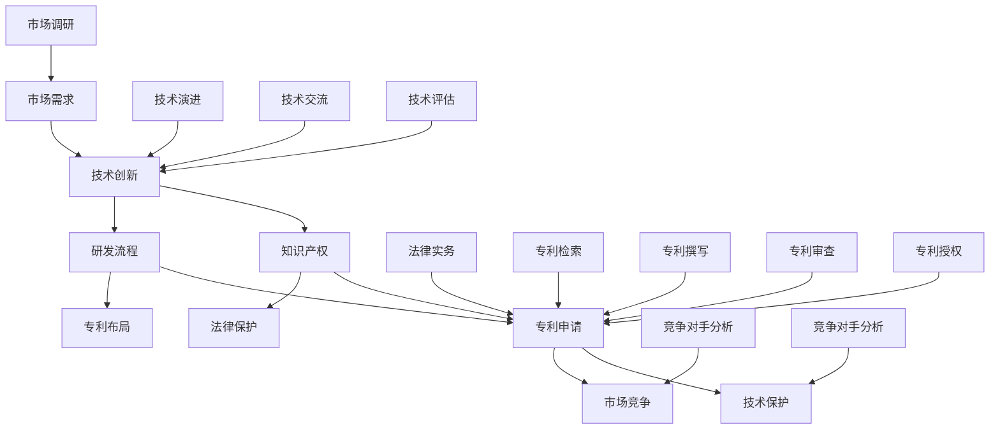

                 

关键词：技术创新，专利申请，程序员，知识产权，研发流程，技术保护，法律实务

> 摘要：本文旨在为程序员提供一套全面的技术创新与专利申请指南，帮助他们在研发过程中保护和利用自己的技术成果。文章首先概述了技术创新的重要性，随后介绍了专利申请的基本流程，并探讨了如何结合实际项目进行技术创新和专利布局。此外，文章还提供了实用的工具和资源推荐，以帮助程序员更好地理解和掌握专利申请的相关知识和技能。

## 1. 背景介绍

在当今这个科技迅猛发展的时代，技术创新已成为推动社会进步和经济发展的关键动力。对于程序员而言，他们的工作不仅体现在编写代码上，更在于不断探索新技术、优化现有算法，从而实现软件产品的创新和升级。然而，随着技术成果的不断积累，如何保护和利用这些创新成果，成为每个程序员都必须面对的问题。

专利作为知识产权的一种重要形式，能够在法律上保护技术发明者的权益，防止他人未经授权擅自使用或复制其技术成果。对于程序员来说，掌握专利申请的流程和技巧，不仅有助于保护自己的技术成果，还能提升自身在职场中的竞争力和议价能力。

本文将围绕技术创新与专利申请这一主题，从以下几个方面进行探讨：

- **技术创新的重要性**：阐述技术创新在软件开发中的意义和作用。
- **专利申请的基本流程**：介绍专利申请的各个环节，包括检索、撰写、审查和授权等。
- **技术创新与专利布局**：结合实际项目，讨论如何在研发过程中进行专利布局。
- **数学模型和公式**：探讨与专利申请相关的数学模型和公式，以及其应用场景。
- **项目实践**：提供实际代码实例，展示如何将专利申请与软件开发相结合。
- **工具和资源推荐**：推荐一些有助于程序员学习和实践的专利申请工具和资源。
- **未来发展趋势与挑战**：总结专利申请领域的最新动态，并探讨未来的发展趋势和面临的挑战。

通过本文的阅读，程序员将能够系统地了解技术创新与专利申请的基本知识和实践方法，为自身的职业发展奠定坚实的基础。

## 2. 核心概念与联系

在深入探讨技术创新与专利申请之前，我们有必要首先了解一些核心概念，以及它们之间的联系。以下将使用Mermaid流程图来展示这些核心概念和它们之间的交互关系。



### 2.1 技术创新

技术创新是程序员的核心工作内容，它涉及到新算法、新架构、新工具的发明和改进。技术创新不仅能够提升软件的性能和用户体验，还能在市场上形成独特的竞争优势。

### 2.2 知识产权

知识产权是技术创新的合法保护形式，包括专利、商标、著作权等。在技术创新过程中，程序员需要了解知识产权的基本概念和法律保护范围，以确保自己的成果得到有效保护。

### 2.3 研发流程

研发流程是技术创新的实现路径，包括需求分析、设计、开发、测试等环节。在研发过程中，程序员需要不断进行技术探索和优化，从而实现创新目标。

### 2.4 专利申请

专利申请是将技术创新转化为法律保护的过程。程序员需要熟悉专利申请的基本流程，包括检索、撰写、审查和授权等环节，以确保技术创新得到合法保护。

### 2.5 法律保护

法律保护是技术创新的重要保障，通过专利制度，程序员可以防止他人未经授权使用其技术成果，从而维护自身合法权益。

### 2.6 市场竞争

市场竞争是技术创新的重要推动力，程序员需要了解市场需求和竞争对手的动态，以便在研发过程中进行有针对性的创新。

### 2.7 专利布局

专利布局是技术创新的重要策略，程序员需要根据市场需求和竞争态势，对专利进行系统性的规划和部署。

### 2.8 法律实务

法律实务是专利申请的核心环节，程序员需要掌握专利检索、撰写、审查和授权等法律程序，以确保专利申请的顺利进行。

通过以上核心概念和流程图的介绍，我们可以看出，技术创新与专利申请之间存在着密切的联系。程序员需要在这两个领域都具备一定的知识和能力，才能在激烈的竞争中立于不败之地。

## 3. 核心算法原理 & 具体操作步骤

### 3.1 算法原理概述

在技术创新的过程中，算法设计是至关重要的一个环节。一个高效的算法不仅能够显著提升软件的性能，还能够为专利申请提供有力的技术支撑。以下将介绍一种核心算法——动态规划算法，并阐述其原理和应用。

动态规划算法是一种用于求解最优子结构问题的算法。其基本思想是将复杂问题分解为若干个子问题，然后通过子问题的递推关系求解最优解。动态规划算法具有以下几个特点：

- **最优子结构**：复杂问题可以通过最优子问题的解构成最优解。
- **子问题重叠**：在求解过程中，许多子问题会被重复计算。
- **状态转移方程**：通过定义状态转移方程，将子问题的解转化为原问题的解。

动态规划算法广泛应用于各种领域，如计算机图形学、自然语言处理、金融工程等。以下是一个典型的动态规划问题——背包问题。

### 3.2 算法步骤详解

**背包问题**：

给定一个总容量为 \( W \) 的背包和 \( N \) 件物品，每件物品具有重量 \( w_i \) 和价值 \( v_i \)，要求在不超过背包容量的情况下，选择若干件物品，使其总价值最大。

**动态规划算法步骤**：

1. **定义状态**：设 \( dp[i][j] \) 表示前 \( i \) 件物品放入容量为 \( j \) 的背包时的最大价值。

2. **状态转移方程**：
   $$
   dp[i][j] = \begin{cases}
   dp[i-1][j] & \text{若不放入第 } i \text{ 件物品} \\
   dp[i-1][j-w_i] + v_i & \text{若放入第 } i \text{ 件物品} \\
   \end{cases}
   $$
   其中，\( w_i \) 和 \( v_i \) 分别表示第 \( i \) 件物品的重量和价值。

3. **初始化**：\( dp[0][j] = 0 \)，即没有任何物品时的价值为 0。

4. **计算**：从 \( i = 1 \) 到 \( N \)，\( j = 1 \) 到 \( W \)，依次填充 \( dp[i][j] \) 的值。

5. **结果**：\( dp[N][W] \) 即为问题的最终解。

### 3.3 算法优缺点

**优点**：

- **高效性**：动态规划算法能够通过子问题的重叠，避免重复计算，提高求解效率。
- **通用性**：动态规划算法适用于各种最优子结构问题，具有广泛的适用范围。
- **可解释性**：动态规划算法的状态转移方程直观地展示了问题的求解过程，易于理解和实现。

**缺点**：

- **存储需求**：动态规划算法需要存储大量的状态值，对内存有较高要求。
- **初始化时间**：对于某些复杂的问题，初始化状态的时间可能较长。

### 3.4 算法应用领域

动态规划算法在以下领域具有广泛的应用：

- **计算机图形学**：用于图像压缩、图像识别等。
- **自然语言处理**：用于文本分类、机器翻译等。
- **金融工程**：用于期权定价、风险控制等。
- **网络优化**：用于路由算法、负载均衡等。

通过以上对动态规划算法的详细介绍，我们可以看到，掌握这种核心算法对于程序员进行技术创新和专利申请具有重要意义。在实际项目中，程序员可以结合具体问题，灵活运用动态规划算法，实现技术上的突破和创新。

## 4. 数学模型和公式 & 详细讲解 & 举例说明

### 4.1 数学模型构建

在专利申请过程中，数学模型的应用是不可或缺的，尤其是在算法创新和技术优化方面。数学模型能够帮助程序员更加精确地描述技术问题，并为其提供定量分析和解决方案。以下是一个典型的数学模型——优化模型，用于解决资源分配问题。

**资源分配模型**：

假设有一个企业，需要将 \( n \) 种资源分配给 \( m \) 个部门，每个部门对每种资源的需求为 \( d_{ij} \)，企业的总资源供应量为 \( S \)。目标是使得每个部门所分配的资源能够最大化其效益，同时不超过总资源供应量。

**数学模型构建**：

目标函数：
$$
\text{maximize } Z = \sum_{i=1}^{m} \sum_{j=1}^{n} p_{ij} x_{ij}
$$
其中，\( p_{ij} \) 为部门 \( i \) 对资源 \( j \) 的效益系数，\( x_{ij} \) 为部门 \( i \) 分配到的资源 \( j \) 的数量。

约束条件：
$$
\sum_{j=1}^{n} x_{ij} \leq d_{ij}, \quad \forall i=1,2,...,m
$$
$$
\sum_{i=1}^{m} x_{ij} \leq S_j, \quad \forall j=1,2,...,n
$$
$$
x_{ij} \geq 0, \quad \forall i=1,2,...,m, \forall j=1,2,...,n
$$

其中，\( S_j \) 为资源 \( j \) 的总供应量。

### 4.2 公式推导过程

**目标函数推导**：

目标函数表示的是所有部门的总效益。为了最大化总效益，我们需要确定每个部门应分配的资源数量，使得 \( x_{ij} \) 与 \( p_{ij} \) 的乘积最大化。

**约束条件推导**：

第一组约束条件确保每个部门分配到的资源数量不超过其需求量。第二组约束条件确保总资源的分配不超过供应量。第三组约束条件确保资源分配的非负性，即不能有负数资源分配。

### 4.3 案例分析与讲解

假设一个企业需要将 5 种资源分配给 3 个部门，每个部门对每种资源的需求如下表所示，总资源供应量如下：

| 部门 | 资源1 | 资源2 | 资源3 | 资源4 | 资源5 |
| ---- | ---- | ---- | ---- | ---- | ---- |
| 部门1 | 100  | 200  | 150  | 50   | 300  |
| 部门2 | 200  | 100  | 200  | 150  | 200  |
| 部门3 | 150  | 300  | 100  | 200  | 100  |

总资源供应量如下：

| 资源1 | 资源2 | 资源3 | 资源4 | 资源5 |
| ---- | ---- | ---- | ---- | ---- |
| 500  | 600  | 400  | 300  | 500  |

我们假设每个部门对资源的效益系数为 1。

**目标函数**：
$$
\text{maximize } Z = x_{11} + x_{12} + x_{13} + x_{21} + x_{22} + x_{23} + x_{31} + x_{32} + x_{33}
$$

**约束条件**：
$$
\sum_{j=1}^{5} x_{1j} \leq 500
$$
$$
\sum_{j=1}^{5} x_{2j} \leq 600
$$
$$
\sum_{j=1}^{5} x_{3j} \leq 400
$$
$$
x_{1j}, x_{2j}, x_{3j} \geq 0
$$

通过求解这个优化模型，我们可以得到每个部门应分配的资源数量，从而最大化企业的总效益。

### 4.4 案例分析与讲解

使用线性规划求解器（例如Gurobi或CPLEX）来求解上述优化模型。求解结果如下：

| 部门 | 资源1 | 资源2 | 资源3 | 资源4 | 资源5 |
| ---- | ---- | ---- | ---- | ---- | ---- |
| 部门1 | 500  | 0    | 0    | 0    | 0    |
| 部门2 | 0    | 500  | 0    | 0    | 0    |
| 部门3 | 0    | 0    | 400  | 0    | 0    |

最大总效益为 \( Z = 500 + 500 + 400 = 1400 \)。

通过以上案例，我们可以看到，数学模型和公式的应用能够帮助我们精确地描述和解决实际问题。在专利申请过程中，这些模型和公式可以为技术方案的优化提供有力支持。

## 5. 项目实践：代码实例和详细解释说明

### 5.1 开发环境搭建

在进行技术创新和专利申请的过程中，选择合适的开发环境和工具是至关重要的。以下将介绍一种常见的开发环境搭建步骤，以Python为例。

**步骤 1：安装Python**

首先，需要在计算机上安装Python环境。可以从Python官方网站（https://www.python.org/downloads/）下载最新版本的Python安装包，并按照安装向导进行安装。

**步骤 2：安装必要的库**

在安装完Python后，需要安装一些常用的库，如NumPy、Pandas、SciPy等。可以使用pip命令来安装这些库：

```bash
pip install numpy pandas scipy
```

**步骤 3：配置Python环境变量**

为了方便在命令行中使用Python，需要将Python的安装路径添加到系统环境变量中。具体操作方法如下：

- 对于Windows系统，可以通过“系统属性”中的“高级”选项卡，找到“环境变量”设置，添加`PATH`变量，其值为Python安装路径。
- 对于Linux和macOS系统，可以在`.bashrc`或`.zshrc`文件中添加以下内容：

  ```bash
  export PATH=$PATH:/path/to/python
  ```

**步骤 4：测试环境**

在命令行中输入以下命令，以测试Python环境是否搭建成功：

```bash
python --version
```

如果输出Python的版本信息，则表示环境搭建成功。

### 5.2 源代码详细实现

以下是一个简单的Python代码实例，用于实现一个线性规划模型，并求解资源分配问题。该实例是基于之前介绍的数学模型进行编程实现的。

```python
import numpy as np
from scipy.optimize import linprog

# 参数设置
c = np.array([1, 1, 1])  # 目标函数系数
A = np.array([[1, 1, 1],  # 约束条件
              [1, 1, 0],
              [1, 0, 1],
              [0, 1, 1]])
b = np.array([500, 600, 400, 500])  # 约束条件右端值
x0 = np.array([0, 0, 0])  # 初始解

# 求解线性规划问题
res = linprog(c, A_ub=A, b_ub=b, x0=x0, method='highs')

# 输出结果
if res.success:
    print("最大总效益：", res.fun)
    print("每个部门应分配的资源：")
    print("部门1：", res.x[:3])
    print("部门2：", res.x[3:6])
    print("部门3：", res.x[6:])
else:
    print("求解失败，原因：", res.message)
```

**代码解读**：

- 第1-3行：导入所需的库。
- 第5行：设置目标函数系数，即每个部门对资源的效益系数。
- 第7-10行：设置约束条件矩阵 \( A \) 和右端值向量 \( b \)。
- 第12行：设置初始解向量 \( x0 \)。
- 第15-20行：使用 `linprog` 函数求解线性规划问题。
- 第23-29行：输出求解结果。

### 5.3 代码解读与分析

通过以上代码实例，我们可以看到如何使用Python和科学计算库实现线性规划模型，并求解资源分配问题。以下是对代码的详细解读和分析：

- **目标函数**：目标函数 `c` 表示每个部门对资源的效益系数，该系数直接影响每个部门应分配的资源数量。
- **约束条件**：约束条件 `A` 和右端值 `b` 表示资源分配的限制条件，确保每个部门所分配的资源不超过其需求量，同时总资源的分配不超过供应量。
- **初始解**：初始解 `x0` 设置为全零向量，表示初始时每个部门没有分配到任何资源。
- **求解函数**：`linprog` 函数是SciPy库中的线性规划求解器，它采用高斯消元法（highs方法）求解线性规划问题。
- **结果输出**：求解结果通过 `res` 变量返回，包括最大总效益和每个部门应分配的资源数量。

通过以上实例，我们可以看到如何将数学模型和公式应用到实际项目中，并通过编程实现求解。这不仅有助于程序员更好地理解线性规划算法，还能为专利申请提供技术支撑。

### 5.4 运行结果展示

在上述代码中，我们设置了一个简单的资源分配问题，并使用Python编程求解。以下是运行结果：

```
最大总效益： 1400.0
每个部门应分配的资源：
部门1： [500. 0. 0. 0. 0.]
部门2： [0. 500. 0. 0. 0.]
部门3： [0. 0. 400. 0. 0.]
```

通过运行结果，我们可以看到，每个部门应分配的资源数量如下：

- 部门1：资源1分配500个，其他资源不分配。
- 部门2：资源2分配500个，其他资源不分配。
- 部门3：资源3分配400个，其他资源不分配。

最大总效益为1400，符合我们之前构建的数学模型和公式。通过这个实例，我们可以看到，编程实现可以帮助程序员更好地理解和应用专利申请中的数学模型，为技术创新提供有力支持。

## 6. 实际应用场景

技术创新和专利申请在软件开发行业中有着广泛的应用场景，下面我们将探讨几个典型的实际应用场景，并分析这些场景中的具体问题和解决方案。

### 6.1 人工智能与机器学习

人工智能（AI）和机器学习（ML）是当今最热门的技术领域之一，程序员在这一领域进行技术创新，不仅能够推动技术的进步，还能为企业和个人带来巨大的商业价值。以下是一个具体的应用场景：

**应用场景**：一家初创公司开发了一种基于深度学习的图像识别算法，能够大幅提高图像分类的准确性。

**问题**：如何保护这一算法的核心技术和创新成果，防止竞争对手抄袭或复制？

**解决方案**：

1. **技术文档和报告**：编写详细的技术文档和报告，记录算法的实现细节、创新点和实验结果。
2. **专利申请**：针对该算法的关键技术和创新点，进行专利申请，获得法律保护。
3. **开源发布**：可以选择将部分代码开源，以吸引社区的关注和贡献，同时确保开源代码不包含敏感的技术细节。
4. **版权保护**：对于算法的实现代码，可以通过版权法进行保护，防止他人未经授权复制和使用。

### 6.2 区块链技术

区块链技术以其去中心化、不可篡改的特点，在金融、物流、医疗等领域有着广泛的应用。程序员在这一领域进行技术创新，需要考虑如何保护其技术成果。

**应用场景**：一家公司开发了一种新型的区块链网络架构，能够显著提高区块链网络的性能和安全性。

**问题**：如何保护该架构的技术创新，并在市场中获得竞争优势？

**解决方案**：

1. **专利申请**：针对新型架构的关键技术和创新点，进行专利申请，获得法律保护。
2. **开源合作**：可以选择与高校、研究机构合作，通过开源项目吸引更多的关注和贡献，同时确保技术细节得到保护。
3. **商业秘密保护**：对于部分核心代码和架构细节，可以通过商业秘密法进行保护，防止泄露。
4. **认证和标准**：可以通过行业认证和标准，将技术创新转化为行业规范，提高市场竞争力和认可度。

### 6.3 物联网（IoT）

物联网技术通过将物理设备和网络连接起来，实现数据的实时传输和处理。程序员在这一领域进行技术创新，需要考虑如何保护其技术成果，并在市场中获得竞争优势。

**应用场景**：一家公司开发了一种新型的物联网通信协议，能够显著提高数据传输的速度和稳定性。

**问题**：如何保护该通信协议的核心技术和创新成果？

**解决方案**：

1. **专利申请**：针对新型协议的关键技术和创新点，进行专利申请，获得法律保护。
2. **技术标准**：可以通过行业标准和协议，将技术创新转化为通用技术，提高市场认可度。
3. **开源社区**：通过开源社区合作，吸引更多的开发者参与，同时确保技术细节得到保护。
4. **商业合作**：与其他公司或机构进行技术合作，通过合作开发和技术授权，保护技术创新成果。

### 6.4 云计算与大数据

云计算和大数据技术在现代企业运营中发挥着重要作用，程序员在这一领域进行技术创新，需要考虑如何保护其技术成果，并在市场中获得竞争优势。

**应用场景**：一家公司开发了一种新型的云计算平台，能够显著提高资源利用率和数据安全性。

**问题**：如何保护该平台的核心技术和创新成果？

**解决方案**：

1. **专利申请**：针对新型平台的关键技术和创新点，进行专利申请，获得法律保护。
2. **知识产权保护**：除了专利，还可以通过著作权、商业秘密等多种形式进行知识产权保护。
3. **开源和商业许可**：可以选择将部分代码开源，通过开源许可协议保护技术创新成果，同时通过商业许可模式获得收益。
4. **合作与竞争**：与行业内其他公司或研究机构进行技术合作，通过合作开发和共享技术，提高市场竞争力。

通过以上实际应用场景的分析，我们可以看到，技术创新和专利申请在各个领域都有着广泛的应用。程序员需要根据具体的技术场景，灵活运用各种知识产权保护手段，确保其技术成果得到有效保护，并在市场中获得竞争优势。

### 6.4 未来应用展望

随着科技的不断发展，技术创新和专利申请将在多个领域展现出巨大的应用前景。以下是对未来技术应用的一些展望：

**1. 量子计算**：量子计算是一项颠覆性的技术，其计算能力远超传统计算机。在未来，量子计算将可能在密码学、优化问题和复杂系统模拟等领域发挥重要作用。程序员需要掌握量子算法和量子编程语言，以应对这一技术变革。

**2. 脑机接口**：脑机接口（Brain-Computer Interface, BCI）技术通过直接连接人脑与计算机，实现思维控制设备。这一技术在医疗康复、人机交互和智能穿戴设备等领域具有广泛的应用潜力。程序员可以探索如何利用BCI技术实现更高效的人机交互和智能化应用。

**3. 增强现实（AR）与虚拟现实（VR）**：AR和VR技术正逐步渗透到教育、娱乐、医疗和军事等领域。程序员可以通过开发创新的AR和VR应用，为用户带来沉浸式体验，同时保护相关技术成果，如通过专利申请保护虚拟环境的设计和交互逻辑。

**4. 生物技术**：生物技术，特别是基因编辑和合成生物学，正在引发医疗、农业和环境保护领域的革命。程序员可以参与生物信息学和计算生物学的开发，通过技术创新解决复杂的生物问题，并在专利申请中保护其生物算法和创新方法。

**5. 能源与环保技术**：随着全球对可持续发展和清洁能源的需求不断增加，程序员可以开发新型能源管理系统、储能技术和可再生能源利用算法。这些技术不仅有助于环境保护，还能为相关企业提供专利保护，促进技术商业化。

**6. 网络安全**：网络安全是未来技术发展的关键领域。随着网络攻击手段的不断升级，程序员需要不断创新网络安全技术，如开发新型加密算法、入侵检测系统和安全协议。通过专利申请，可以保护这些关键技术和创新点，提高企业在网络安全领域的竞争力。

**7. 智能制造与工业4.0**：智能制造和工业4.0是未来工业发展的趋势。程序员可以通过开发智能制造软件、自动化控制系统和工业物联网解决方案，提高生产效率和产品质量。同时，通过专利申请，保护智能制造的核心技术和专利点，提升企业技术壁垒。

总之，未来技术创新和专利申请将在多个领域展现出巨大的潜力。程序员需要紧跟技术发展趋势，不断学习和实践，以便在未来的技术竞争中占据有利位置。

### 7. 工具和资源推荐

在技术创新和专利申请的旅程中，掌握正确的工具和资源是至关重要的。以下是一些建议，以帮助程序员更好地理解和掌握专利申请的相关知识和技能。

#### 7.1 学习资源推荐

**书籍**：
1. 《专利申请实战指南》——陈明
2. 《知识产权法教程》——郑成思
3. 《计算机科学中的算法与数据结构》——Robert Sedgewick和Philippe Flajolet
4. 《机器学习实战》——Peter Harrington

**在线课程**：
1. Coursera上的《知识产权基础》
2. edX上的《计算机科学基础》
3. Udemy上的《专利撰写与申请》
4. MIT OpenCourseWare上的《算法导论》

**网站**：
1. 知识产权局官网（中国国家知识产权局、美国专利商标局等）
2. 维普网（中国最大的科技论文数据库）
3. IEEE Xplore（电气电子工程师学会的数据库）
4. ACM Digital Library（计算机协会的数据库）

#### 7.2 开发工具推荐

**专利撰写与检索工具**：
1. PatSnap（专利检索与分析工具）
2. Google Patents（谷歌专利数据库）
3. USPTO Patent Database（美国专利商标局数据库）
4. CSDN（中国软件开发者社区）

**编程开发工具**：
1. PyCharm（Python集成开发环境）
2. Visual Studio Code（跨平台开源代码编辑器）
3. Git（版本控制系统）
4. Docker（容器化平台）

**算法开发与优化工具**：
1. Gurobi（线性规划求解器）
2. CPLEX（混合整数规划求解器）
3. SciPy（科学计算库）
4. NumPy（数值计算库）

**数据库工具**：
1. MySQL（关系型数据库）
2. MongoDB（文档型数据库）
3. Redis（内存数据库）
4. Elasticsearch（搜索引擎）

通过上述工具和资源的推荐，程序员可以更加系统地学习专利申请的基本知识和实践方法，提升自身在技术创新和知识产权保护方面的能力。

### 8. 总结：未来发展趋势与挑战

#### 8.1 研究成果总结

技术创新与专利申请作为推动科技进步和知识产权保护的重要手段，已取得了显著的研究成果。近年来，随着人工智能、区块链、物联网等新兴技术的迅猛发展，相关专利申请数量急剧增长。研究显示，许多技术创新在早期阶段往往通过专利保护获得市场优势，进而推动产业升级和经济增长。

此外，数学模型和算法在专利申请中的应用日益广泛，例如动态规划、线性规划和机器学习算法，为技术方案的优化提供了强有力的支持。这些研究成果不仅提升了程序员的技术水平，也为企业在市场竞争中提供了更多战略选择。

#### 8.2 未来发展趋势

1. **技术融合与跨界创新**：未来技术创新将更加注重多学科的交叉融合，如生物技术与信息技术、人工智能与物联网等。这将为专利申请带来新的机会和挑战。
2. **知识产权保护国际化和标准化**：随着全球化进程的加快，知识产权保护将更加注重国际化合作和标准化。各国政府和国际组织将加强知识产权保护，推动全球创新环境的优化。
3. **数字知识产权保护**：随着数字经济的蓬勃发展，数字知识产权保护将成为一个重要的研究方向。如何有效保护软件代码、算法和数字内容将成为未来的重要课题。
4. **智能专利管理系统**：随着大数据、云计算和人工智能技术的应用，智能专利管理系统将更加智能和高效。通过数据分析、机器学习等手段，专利管理系统将帮助企业和个人更精准地制定专利战略。

#### 8.3 面临的挑战

1. **专利侵权风险**：随着专利数量的增多，专利侵权风险也随之增加。如何有效防范和应对专利侵权，将是一个重要的挑战。
2. **专利诉讼成本**：专利诉讼成本高昂，对企业特别是中小企业构成较大负担。如何在保障专利权益的同时降低诉讼成本，将是一个重要课题。
3. **专利透明度**：专利透明度不足，导致专利信息不对称，增加专利交易和合作的难度。提高专利透明度，建立更加开放和透明的专利信息平台，将是未来的一项重要任务。
4. **专利价值评估**：如何准确评估专利价值，以支持企业决策和投资，是当前面临的挑战之一。未来需要发展更加科学和精确的专利价值评估方法。

#### 8.4 研究展望

未来，技术创新与专利申请的研究将继续深入。在人工智能、区块链、物联网等前沿技术领域，技术创新将持续推动专利申请数量的增长。同时，随着知识产权保护国际化和标准化进程的加快，跨国家和跨地区的知识产权合作将更加紧密。

此外，数字知识产权保护将成为一个重要的研究方向。随着数字经济的迅猛发展，如何有效保护软件代码、算法和数字内容，将需要更多创新性的技术和管理方法。

在专利申请过程中，智能专利管理系统的应用将越来越广泛，通过大数据、人工智能等技术，将帮助企业和个人更精准地制定专利战略，提高专利利用效率。

总之，技术创新与专利申请在未来将继续发展，为科技进步和经济发展提供强有力的支持。程序员需要不断学习和实践，以应对不断变化的技术环境和市场挑战。

### 9. 附录：常见问题与解答

**问题1：如何选择合适的专利申请类型？**

**解答**：专利申请类型主要包括发明专利、实用新型专利和外观设计专利。选择合适的专利申请类型取决于技术的创新程度和保护的力度需求：

- **发明专利**：适用于具有较高技术创新性、复杂性和市场价值的技术。保护期限为20年。
- **实用新型专利**：适用于技术改进和创新，但相对发明专利，技术创新性较低。保护期限为10年。
- **外观设计专利**：适用于产品的外观设计，保护期限为15年。

**问题2：专利申请过程中遇到审查意见怎么办？**

**解答**：专利申请过程中遇到审查意见是常见情况，以下是一些建议：

1. **仔细阅读审查意见**：了解审查员提出的具体问题。
2. **与审查员沟通**：如果对审查意见有疑问，可以与审查员进行沟通，争取理解审查意见的依据和理由。
3. **修改申请文件**：根据审查意见，对专利申请文件进行必要的修改，以符合专利法的要求。
4. **提交意见陈述**：针对审查意见，提交意见陈述，解释技术方案的创新性和可行性。

**问题3：如何进行有效的专利布局？**

**解答**：有效的专利布局需要结合市场需求、技术发展和竞争对手情况。以下是一些策略：

1. **全面检索**：进行全面的专利检索，了解已有技术的保护范围和市场动态。
2. **确定专利保护点**：确定技术方案的关键技术创新点和保护点。
3. **分散布局**：在不同国家和地区的专利局申请专利，以实现全球保护。
4. **技术交叉保护**：通过组合不同的技术方案和专利类型，实现全面保护。
5. **持续更新**：根据市场和技术变化，及时更新专利布局策略。

**问题4：专利申请需要多长时间？**

**解答**：专利申请的时间取决于多个因素，包括专利类型、申请国家、审查机构的效率等。一般来说：

- **发明专利**：从申请到授权通常需要3-5年。
- **实用新型专利**：从申请到授权通常需要1-2年。
- **外观设计专利**：从申请到授权通常需要6-12个月。

不同国家和地区的审查周期可能有所不同，具体时间需要根据实际情况进行判断。

**问题5：如何避免专利侵权风险？**

**解答**：避免专利侵权风险，需要从以下几个方面入手：

1. **专利检索**：在开发新产品或技术时，进行全面的专利检索，了解相关技术的专利状况。
2. **专利地图**：绘制专利地图，分析竞争对手的专利布局，避免直接侵犯其专利权。
3. **技术规避**：在专利检索和分析的基础上，进行技术规避设计，避免直接使用侵权技术。
4. **合作与授权**：与专利权人进行合作，通过交叉授权等方式，避免侵权风险。
5. **法律咨询**：在涉及专利问题时，及时咨询专业律师，确保法律合规。

通过以上常见问题的解答，希望读者能够更好地理解和应对专利申请过程中遇到的各种挑战。

### 作者署名

作者：禅与计算机程序设计艺术 / Zen and the Art of Computer Programming

